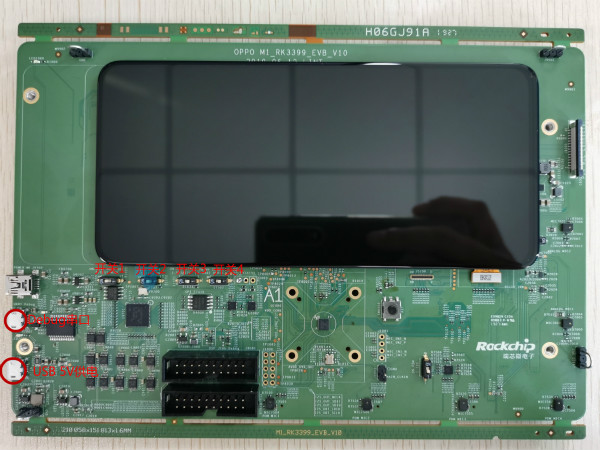
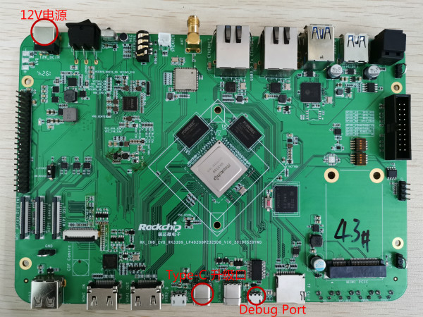
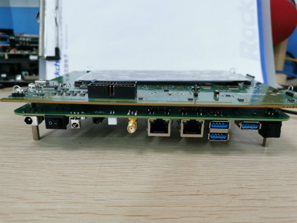

# ** M1_RK3399_EVB使用指南**

发布版本：1.0

作者邮箱：zyw@rock-chips.com

日期：2019.07

文件密级：仅限RK内部使用

***

**前言**

**概述**

**产品版本**

| **芯片名称** | **内核版本** |
| ------------ | ------------ |
| M1           | RTthread  |

**读者对象**

本文档（本指南）主要适用于以下工程师：

技术支持工程师

软件开发工程师

**修订记录**

| **日期**   | **版本** | **作者** | **修改说明** |
| ---------- | -------- | -------- | ------------ |
| 2019-07-27 | V1.0     | 钟勇汪   |              |

***

[TOC]

***

## 板子介绍

   M1_RK3399_EVB板本身不具有从Flash启动的功能，如果想脱离Jtag工作，需要配合一个RK3399 EVB板：RK_IND_EVB_RK3399_LP4D200P232SD8_V10_20190528YWQ

 M1 EVB板正面照
   

 M1 EVB板反面照
   

RK3399 正面照

RK3399反面照

两个板子的反面通过100pin的连接器组合在一起：

## 接口介绍

   M1的电源可由RK3399 EVB提供，M1 EVB可以不用接电源。RK3399上电后，M1板上debug口边上的红色小灯会亮起。
   如果M1 EVB要脱离RK3399 EVB板独立工作，则需要接入USB 5v供电。这个DC口仅仅提供电源，不具有USB升级固件功能。

## 固件下载

### 通过RK3399下载固件

RK3399的kernel需要打开olpc模块，使用spi2apb下载固件到M1的sram中，这个kernel可以从这里下载到：

	smb://10.10.10.164/rtos_repository/RK2108-Pisces/04-Firmware/RK3399_IMAGE_FOR_M1_EVB/Image-rk3399_all_20190726_v0.2
使用方法如下：

	1. 重烧kernel和resource文件，让板子支持下载固件功能
	sudo upgrade_tool di -k kernel.img
	sudo upgrade_tool di -resource resource.img
	
	2. 用type-c连上板子，
	$adb root
	$adb remount
	$adb push flash.sh /data
	$adb push rtthread.bin /mnt/sdcard/
	
	3. 在板子上运行:
	$su
	#/data/flash.sh
	
	4. 执行成功后，会打印下载固件成功的log
	rk3399_mid:/ # /data/flash.sh
	[  157.981306] spi_rk_olpc spi32766.0: before request firmware
	[  157.982019] spi_rk_olpc spi32766.0: request firmware rtthread.bin success!
	[  157.982260] spi_rk_olpc spi32766.0: good status:0xff0aa55
	[  157.982285] spi_rk_olpc spi32766.0: 223
	[  157.982304] spi2apb_safe_write addr = 20000000, 60000
	[  158.040556] spi2apb_safe_write addr = 2000ea60, 60000
	[  158.098868] spi2apb_safe_write addr = 2001d4c0, 60000
	[  158.157036] spi2apb_safe_write addr = 2002bf20, 40836
	[  158.196785] spi_rk_olpc spi32766.0: 228
	[  158.196822] spi2apb_safe_write addr = 200ff000, 20
	flash rtthread.bin ok!!!!!!
	
	[  158.202540] spi_rk_olpc spi32766.0: download firmware success!

	5. 更换固件就是把自己的rtthread.bin通过 adb push到/mnt/sdcard/
	
	注意：如果板子上的R1003电阻没有贴的（在M1芯片正上方），更换固件后，记得按M1 EVB的reset按键来重启板子，否则会出现下载固件失败。如果已经贴了R1003电阻，脚本里面已经做了reset处理了。
	
	------------------
	android固件
	\\10.10.10.164\Oreo_Repository\RK3399\firmware\rk3399-rk809-oppo\RK3399-SAPPHIRE-EXCAVATOR-	EDP_8.1.0_FOR_MALI_20190703.0850_RELEASE_TEST_USERDEBUG
	
	PS. 本目录下rtthread_ap.bin是默认使能RK3399显示的版本，/data/flash.sh执行完后，敲reboot重启RK3399，可以进入到android界面
	注意：如果重启了M1却没有执行/data/flash.sh下载固件，mipi屏默认是不输出的。

### 通过RK3399开机自动下载固件

下面这个android 7.1固件可以实现开机自动下载M1固件，它的boot.img中有带一个/lib/firmware/rtthread.bin，另外在init.rockchip.rc中调用了gpio72 reset和echo "raw rtthread.bin" > /dev/rk_olpc.

	smb://10.10.10.164/rtos_repository/RK2108-Pisces/04-Firmware/RK3399_IMAGE_FOR_M1_EVB/Image-rk3399_all_20190726_auto_download_m1_firmware

再开机起来后会看到一些下载固件的log：

	[    4.122780] spi_rk_olpc spi32766.0: before request firmware
	[    4.123208] spi_rk_olpc spi32766.0: request firmware rtthread.bin success!
	[    4.123358] spi_rk_olpc spi32766.0: good status:0xff0aa55
	[    4.123372] spi_rk_olpc spi32766.0: 223
	[    4.123385] spi2apb_safe_write addr = 20000000, 60000
	[    4.181361] spi2apb_safe_write addr = 2000ea60, 60000
	[    4.239655] spi2apb_safe_write addr = 2001d4c0, 60000
	[    4.297960] spi2apb_safe_write addr = 2002bf20, 37812
	[    4.334959] spi_rk_olpc spi32766.0: 228
	[    4.335081] spi2apb_safe_write addr = 200ff000, 20
	[    4.339450] spi_rk_olpc spi32766.0: download firmware success!

同时M1的debug口也能看到打印：

	 \ | /
	- RT -     Thread Operating System
	 / | \     3.1.3 build Jul 26 2019
	 2006 - 2019 Copyright by rt-thread team
	mount fs[elm] on / failed.
	testing sleep 1s:
	msh />actual tick is:1000

具体init.rockchip.rc的修改是这样的：

	on early-init
	...
	    write /sys/class/gpio/export 72
	    write /sys/class/gpio/gpio72/direction out
	    write /sys/class/gpio/gpio72/value 0
	    write /sys/class/gpio/gpio72/value 1
	
	on post-fs
	...
	    write /dev/rk_olpc "raw rtthread.bin"

## JTag调试

如果想让M1 EVB脱离RK3399独立工作，你可能需要JTag
硬件上需要拨2个开关：

	“开关2”拨到“1”
	“开关4”拨到“ON”

M1的Uart0和JTag的管脚是复用的，因此需要把GPIO0_C7和GPIO0_D0切换到function2，否则系统跑起来后Jtag会断开。具体方法是scons --menuconfig中使能M4_JTAG_ENABLE。如果您的板子修改了硬件（Debug串口改成Uart1），可以通过使能RT_USING_UART1和把RT_CONSOLE_DEVICE_NAME 改成=uart1。

调试方法参考《Rockchip_User_Guide_J-Link_CN》