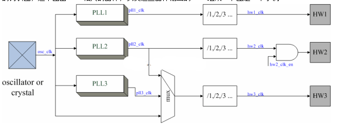
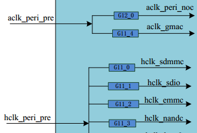
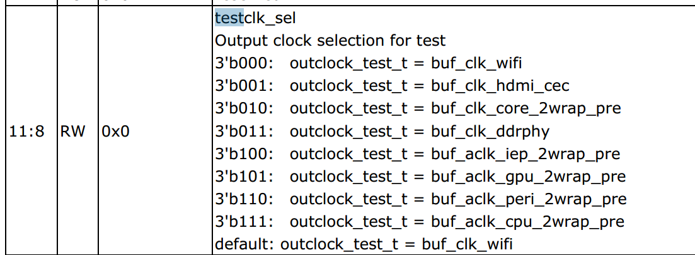

# Rockchip Clock 开发指南

文件标识：RK-KF-YF-030

发布版本：V1.1.1

日期：2021-04-28

文件密级：□绝密   □秘密   □内部资料   ■公开

**免责声明**

本文档按“现状”提供，瑞芯微电子股份有限公司（“本公司”，下同）不对本文档的任何陈述、信息和内容的准确性、可靠性、完整性、适销性、特定目的性和非侵权性提供任何明示或暗示的声明或保证。本文档仅作为使用指导的参考。

由于产品版本升级或其他原因，本文档将可能在未经任何通知的情况下，不定期进行更新或修改。

**商标声明**

“Rockchip”、“瑞芯微”、“瑞芯”均为本公司的注册商标，归本公司所有。

本文档可能提及的其他所有注册商标或商标，由其各自拥有者所有。

**版权所有 © 2021 瑞芯微电子股份有限公司**

超越合理使用范畴，非经本公司书面许可，任何单位和个人不得擅自摘抄、复制本文档内容的部分或全部，并不得以任何形式传播。

瑞芯微电子股份有限公司

Rockchip Electronics Co., Ltd.

地址：     福建省福州市铜盘路软件园A区18号

网址：     [www.rock-chips.com](http://www.rock-chips.com)

客户服务电话： +86-4007-700-590

客户服务传真： +86-591-83951833

客户服务邮箱： [fae@rock-chips.com](mailto:fae@rock-chips.com)

---

**前言**

**概述**

本文档主要介绍 RK 平台时钟子系统框架介绍以及配置。

**产品版本**

| 芯片名称 | **内核版本** |
| -------- | ------------ |
| RK303X   | LINUX3.10    |
| RK312X   | LINUX3.10    |
| RK322X   | LINUX3.10    |
| RK3288X  | LINUX3.10    |
| RK3328   | LINUX3.10    |
| RK3368   | LINUX3.10    |

**读者对象**

本文档（本指南）主要适用于以下工程师：

技术支持工程师

软件开发工程师

**修订记录**

| **版本号** | **作者** | **修改日期** | **修改说明**           |
| ---------- | -------- | ------------ | ---------------------- |
| V1.0.0     | 张晴     | 2016-06-06   | 第一次临时版本发布     |
| V1.1.0     | 张晴     | 2017-02-10   | Add soc RK3328         |
| V1.1.1     | 黄莹     | 2021-04-28   | 修改格式，增加文件标识 |

---

**目录**

[TOC]

---

**图表目录**

> [*图表 0‑1clk 时钟树的示例图* 1-1](#_Toc456336516)
>
> [*图表 0‑2 时钟分配示例图* 1-2](#_Toc456336517)
>
> [*图表 0‑3 时钟配置流程图* 1-2](#_Toc456336518)
>
> [*图表 2‑1 总线时钟结构* 2-4](#_Toc456336519)
>
> [*图表 2‑2 GATING 示例图* 2-5](#_Toc456336520)
>
> [*图表 3‑1 小数分频时钟图* 3-13](#_Toc456336521)

---

## 方案概述

### 概述

本章主要描述时钟子系统的相关的重要概念、时钟方案、总体流程、代码结构。

### 重要概念

**时钟子系统**

这里讲的时钟是给 SOC 各组件提供时钟的树状框架，并不是内核使用的时间，和其他模块一样，CLK 也有框架，用以适配不同的平台。适配层之上是客户代码和接口，也就是各模块（如需要时钟信号的外设，USB 等）的驱动。适配层之下是具体的 SOC 台的时钟操作细节。

**时钟树结构**

可运行 Linux 的主流处理器平台，都有非常复杂的 clock tree，我们随便拿一个处理器的 spec，查看 clock 相关的章节，一定会有一个非常庞大和复杂的树状图，这个图由 clock 相关的器件，以及这些器件输出的 clock 组成。

**相关器件**

clock 相关的器件包括：用于产生 clock 的 Oscillator（有源振荡器，也称作谐振荡器）或者 Crystal（无源振荡器，也称晶振）；用于倍频的 PLL（锁相环，Phase Locked Loop）；用于分频的 divider；用于多路选择的 Mux；用于 clock enable 控制的与门；使用 clock 的硬件模块（可称作 consumer）；等等。

### 时钟方案

每一个 SOC 都有自己的时钟分配方案，主要是包括 PLL 的设置，各个 CLK 的父属性、DIV、MUX 等。芯片不同，时钟方案是有差异的。



图表 1‑1 clk 时钟树的示例图


图表 1‑2 时钟分配示例图

### 总体流程


图表 1‑3 时钟配置流程图

主要内容包括（不需要所有 clk 都支持）：

1. enable/disable clk。

2. 设置 clk 的频率。

3. 选择 clk 的 parent。

### 代码结构

CLOCK 的软件框架由 CLK 的 Device Tree（clk 的寄存器描述、clk 之间的树状关系等）、Device driver 的 CLK 配置和 CLK API 三部分构成。这三部分的功能、CLK 代码路径如表 1-1 所示。

| 项目              | 功能                                     | 路径                                   |
| --------------- | -------------------------------------- | ------------------------------------ |
| Device Tree     | clk 的寄存器描述、clk 之间的树状关系描述等                | Arch/arm/boot/dts/rk3xxx-clocks.dtsi |
| RK PLL 及特殊 CLK 的处理 | 1.处理 RK 的 PLL 时钟 2.  处理 RK 的一些特殊时钟，如 LCDC、I2S 等 | Drivers/clk/rockchip/clk-xxx.c       |
| CLK API         | 提供 linux 环境下供 driver 调用的接口                 | Drivers/clk/clk-xxx.x                |

表格 1‑1CLK 代码构成

---

## CLOCK 开发指南

### 概述

本章描述如何修改时钟配置、使用 API 接口及调试 CLK 程序。

### 时钟的相关概念

#### PLL

锁相环，是由 24M 的晶振输入，然后内部锁相环锁出相应的频率。这是 SOC 所有 CLOCK 的时钟的源。SOC 的所有总线及设备的时钟都是从 PLL 分频下来的。RK 平台主要 PLL 有:

表格 ‑1PLL 描述

| PLL  | 子设备   | 用途                     | 备注                                                         |
| ---- | -------- | ------------------------ | ------------------------------------------------------------ |
| APLL | CLK_CORE | CPU 的时钟               | 一般只给 CPU 使用，因为 CPU 会变频，APLL 会根据 CPU 要求的频率变化 |
| DPLL | Clk_DDR  | DDR 的时钟               | 一般只给 DDR 使用，因为 DDR 会变频，DPLL 会根据 DDR 要求变化 |
| GPLL |          | 提供总线、外设时钟做备份 | 一般设置在 594M 或者 1200M，保证基本的 100、200、300、400M 的时钟都有输出 |
| CPLL |          | GMAC 或者其他设备做备份  | 一般可能是 400、500、800、1000M。或者是给 lcdc 独占使用。    |
| NPLL |          | 给其他设备做备份         | 一般可能是 1188M，或者给 lcdc 独占使用。                     |

我们 SOC 的总线有 ACLK_PERI、HCLK_PERI、PCLK_PERI、ACLK_BUS、HCLK_BUS、PCLK_BUS.（ACLK 用于数据传输，PCLK 跟 HCLK 一般是用于寄存器读写）

> 而区分 BUS 跟 PERI 主要是为了做高速和低速总线的区分，ACLK 范围 100-300M，PCLK 范围 50M\~150M，HCLK 范围 37M\~150M。BUS 下面主要是一些低速的设备，如 I2C、I2S、SPI 等，PERI 下面一般是 EMMC、GMAC、USB 等。不同的芯片在设计时会有一些差异。例如：对于某些对总线速度要求较高时，可能单独给此设备设计一个独立的 ACLK（如 ACLK\_EMMC 或者 ACLK\_USB 等）。

各个设备的总线时钟会挂在上面这些时钟下面，如下图结构：




（如：GMAC 想提高自己设备的总线频率以实现其快速的数据拷贝或者搬移，可以提高 ACLK\_PERI 来实现）

图表 ‑1 总线时钟结构

#### GATING

CLOCK 的框架中有很多的 GATING，主要是为了降低功耗使用，在一些设备关闭，CLOCK 不需要维持的时候，可以关闭 GATING，节省功耗。

RK CLOCK 的框架的 GATING 是按照树的结构，有父子属性。GATING 的开关有一个引用计数机制，使用这个计数来实现 CLOCK 打开时，会遍历打开其父 CLOCK。在子 CLOCK 关闭时，父 CLOCK 会遍历所有的子 CLOCK，在所有的子都关闭的时候才会关闭父 CLOCK。

（如：I2S2 在使用的时候，必须要打开图中三个 GATING（如图 2-2），但是软件上只需要开最后一级的 GATING，时钟结构会自动的打开其 parent 的 GATING）

图表 ‑2GATING 示例图

### 时钟配置

#### 时钟初始化配置

```c
arch/arm64/dts/rockchip/rk33xx.dtsi

	rockchip_clocks_init: clocks-init{
		compatible = "rockchip,clocks-init";
	}
```

1. **频率**

CLOCK TREE 初始化时设置的频率：

```c
	rockchip,clocks-init-rate =
			<&clk_gpll 1200000000>, <&clk_core 700000000>,
			<&clk_cpll 500000000>, <&aclk_bus 150000000>,
			<&hclk_bus 150000000>, <&pclk_bus 75000000>,
			<&aclk_peri 150000000>, <&hclk_peri 150000000>,
			<&pclk_peri 75000000>, <&clk_mac 125000000>,
			<&aclk_iep 250000000>, <&hclk_vio 125000000>,
			<&aclk_rga 250000000>, <&clk_gpu 250000000>,
			<&aclk_vpu 25000000>, <&clk_vdec_core 250000000>,
			<&clk_vdec_cabac 250000000>, <&aclk_rkvdec 16000000>,
			<&aclk_vop 400000000>, <&clk_gmac_div 25000000>;
```

2. **Parent**

CLOCK TREE 初始化时设置的 parent：

```c
	rockchip,clocks-init-parent =
			<&clk_i2s0_pll &clk_gpll>, <&clk_i2s1_pll &clk_gpll>,
			<&clk_i2s2_pll &clk_gpll>, <&clk_spdif_pll &clk_gpll>,
			<&clk_gpu &clk_cpll>, <&dclk_vop0 &hdmi_phy_clk>,
			<&aclk_bus &clk_gpll>, <&aclk_peri &clk_gpll>,
			<&clk_sdmmc0 &clk_cpll>, <&clk_emmc &clk_cpll>,
			<&clk_sdio &clk_cpll>, <&aclk_vpu &clk_cpll>,
			<&hdmi_phy_clk &hdmiphy_out>, <&usb480m &usb480m_phy>,
			<&aclk_rkvdec &clk_cpll>, <&clk_gmac &clk_cpll>;
```

3. **Gating**

CLOCK TREE 初始化时是否默认 enable：

注意：对于没有默认初始化 enable，且设备没有引用去 enable 的时钟，在 clk 初始化完成之后，会被关闭。

```c
	rockchip_clocks_enable: clocks-enable {
		compatible = "rockchip,clocks-enable";
		clocks =
			/*PLL*/
			<&clk_apll>,
			<&clk_dpll>,
			<&clk_gpll>,
			<&clk_cpll>,

			/*PD_CORE*/
			<&clk_core>,
			<&pclk_dbg>,
			<&aclk_core>,
			<&clk_gates4 2>,

			/*PD_BUS*/
			<&clk_gates6 3>,/*pclk_bus_pre*/
			<&clk_gates7 1>,/*clk4x_ddrphy*/
			<&clk_gates8 5>,/*clk_ddrupctl*/
			<&clk_gates8 0>,/*aclk_intmem*/
			<&clk_gates8 1>,/*clk_intmem_mbist*/
			<&clk_gates8 2>,/*aclk_dmac_bus*/
}
```

#### Driver 的时钟配置

1. 获取 CLK 指针

DTS 设备结点里添加 clock 引用信息（推荐）

```c
	clocks = <&clk_saradc>, <&clk_gates7 14>;
	clock-names = "saradc", "pclk_saradc";
```

```c
	dev->pclk = devm_clk_get(&pdev->dev, "pclk_saradc");
	dev->clk = devm_clk_get(&pdev->dev, "saradc");
```

DTS 设备结点里未添加 clock 引用信息

```c
Driver code：

	dev->pclk = devm_clk_get(NULL, "g_p_saradc");
	dev->clk = devm_clk_get(NULL, "clk_saradc");
```

### CLOCK API 接口

#### 主要的 CLK API

1. **头文件**

```c
#include <linux/clk.h>

	clk_prepare/clk_unprepare
	clk_enable/clk_disable
	clk_prepare_enable/clk_disable_unprepare
	clk_get/clk_put
	devm_clk_get/devm_clk_put
	clk_get_rate/clk_set_rate
	clk_round_rate
```

2. **获取 CLK 指针**

```c
	struct clk *devm_clk_get(struct device *dev, const char *id)（推荐使用，可以自动释放）
	struct clk *clk_get(struct device *dev, const char *id)
```

3. **准备/使能 CLK**

```c
	int clk_prepare(struct clk *clk)
	/*开时钟前调用，可能会造成休眠，所以把休眠部分放到这里，可以原子操作的放到enable里*/
	void clk_unprepare(struct clk *clk)
	/*prepare的反操作*/
	int clk_enable(struct clk *clk)
	/*原子操作，打开时钟，这个函数必须在产生实际可用的时钟信号后才能返回*/
	void clk_disable(struct clk *clk)
	/*原子操作，关闭时钟*/
	clk_enable/clk_disable，启动/停止clock。不会睡眠。
	clk_prepare/clk_unprepare，启动clock前的准备工作/停止clock后的善后工作。可能会睡眠。
```

可以使用 clk_prepare_enable / clk_disable_unprepare，clk_prepare_enable / clk_disable_unprepare(或者 clk_enable / clk_disable) 必须成对，以使引用计数正确。

**注意：**

prepare/unprepare，enable/disable 的说明：

这两套 API 的本质，是把 clock 的启动/停止分为 atomic 和 non-atomic 两个阶段，以方便实现和调用。因此上面所说的“不会睡眠/可能会睡眠”，有两个角度的含义：一是告诉底层的 clock driver，请把可能引起睡眠的操作，放到 prepare/unprepare 中实现，一定不能放到 enable/disable 中；二是提醒上层使用 clock 的 driver，调用 prepare/unprepare 接口时可能会睡眠，千万不能在 atomic 上下文（例如内部包含 mutex 锁、中断关闭、spinlock 锁保护的区域）调用，而调用 enable/disable 接口则可放心。

另外，clock 的 enable/disable 为什么需要睡眠呢？这里举个例子，例如 enable PLL clk，在启动 PLL 后，需要等待它稳定。而 PLL 的稳定时间是很长的，这段时间要把 CPU 交出（进程睡眠），不然就会浪费 CPU。

最后，为什么会有合在一起的 clk_prepare_enable/clk_disable_unprepare 接口呢？如果调用者能确保是在 non-atomic 上下文中调用，就可以顺序调用 prepare/enable、disable/unprepared，为了简单，framework 就帮忙封装了这两个接口。

4. **设置 CLK 频率**

```c
	int clk_set_rate(struct clk *clk, unsigned long rate)（单位Hz）
```

（返回值小于 0，设置 CLK 失败）

#### 示例

DTS

```c
	adc: adc@2006c000 {
		compatible = "rockchip,saradc";
		reg = <0x2006c000 0x100>;
		interrupts = <GIC_SPI 26 IRQ_TYPE_LEVEL_HIGH>;
		#io-channel-cells = <1>;
		io-channel-ranges;
		rockchip,adc-vref = <1800>;
		clock-frequency = <1000000>;
		clocks = <&clk_saradc>, <&clk_gates7 14>;
		clock-names = "saradc", "pclk_saradc";
		status = "disabled";
	};
```

Driver code

```c
	static int rk_adc_probe(struct platform_device *pdev)
	{
		info->clk = devm_clk_get(&pdev->dev, "saradc");
		if (IS_ERR(info->clk)) {
			dev_err(&pdev->dev, "failed to get adc clock\n");
			ret = PTR_ERR(info->clk);
			goto err_pclk;
		}
		if(of_property_read_u32(np, "clock-frequency", &rate)) {
			dev_err(&pdev->dev, "Missing clock-frequency property in the DT.\n");
			goto err_pclk;
		}
		ret = clk_set_rate(info->clk, rate);
		if(ret < 0) {
			dev_err(&pdev->dev, "failed to set adc clk\n");
			goto err_pclk;
		}
		clk_prepare_enable(info->clk);
	}

	static int rk_adc_remove(struct platform_device *pdev)
	{
		struct iio_dev *indio_dev = platform_get_drvdata(pdev);
		struct rk_adc *info = iio_priv(indio_dev);
		device_for_each_child(&pdev->dev, NULL, rk_adc_remove_devices);
		clk_disable_unprepare(info->clk);
		clk_disable_unprepare(info->pclk);
		iio_device_unregister(indio_dev);
		free_irq(info->irq, info);
		iio_device_free(indio_dev);
		return 0;
	}
```

### CLOCK 调试

1. **CLOCK DEBUGS:**

打印当前时钟树结构：

```
	cat /sys/kernel/debug/clk/clk_summary
```

2. **CLOCK 设置节点：**

配置选项：

勾选 RK\_PM\_TESTS

```c
	There is no help available for this option.
	Symbol: RK_PM_TESTS [=y]
	Type  : boolean
	Prompt: /sys/pm_tests/ support
	Location:
	 -> System Type
	 -> Rockchip SoCs (ARCH_ROCKCHIP [=y])
	Defined at arch/arm/mach-rockchip/Kconfig.common:41
	Depends on: ARCH_ROCKCHIP [=y]
	Selects: DVFS [=y] && WATCHDOG [=y]
```

节点命令：

```c
	get rate:
	         echo get [clk_name] > /sys/pm_tests/clk_rate
	set rate:
	         echo set [clk_name] [rate(Hz)] > /sys/pm_tests/clk_rate
	         echo rawset [clk_name] [rate(Hz)] > /sys/pm_tests/clk_rate
	open rate:
	         echo open [clk_name] > /sys/pm_tests/clk_rate
	close rate:
	         echo close [clk_name] > /sys/pm_tests/clk_rate
```

3. **TEST\_CLK\_OUT 测试：**

部分时钟是可以输出到 test\_clk\_out，直接测试 clk 输出频率，用于确认某些时钟波形是否正常。配置方法(以 RK3228 为例)：


**设置 CLK 的 MUX**

CRU_MISC_CON

Address: Operational Base + offset (0x0134)



**设置 CLK 的 DIV**

CRU_CLKSEL4_CON

Address: Operational Base + offset (0x0054)


**设置 CLK 的 GATING**

CRU_CLKGATE0_CON

Address: Operational Base + offset (0x00d0)


---

## 常见问题分析

### PLL 设置

#### PLL 类型查找

不同芯片 PLL 相关的寄存器、PLL 计算公式等会有一些差异，使用 PLL 类型来区分芯片不同，去计算并设置 PLL 的参数。

在 rk3xxx-clocks.dtsi 中，找到 PLL，确认其类型。

```c
	clk_cpll: pll-clk@0018 {
					compatible = "rockchip,rk3188-pll-clk";
					clock-output-names = "clk_cpll";
					rockchip,pll-type = <CLK_PLL_312XPLUS>;
};
```

根据 PLL 的类型，在 clk-pll.c 中查找 PLL 频率支持的表格：

```c
	case CLK_PLL_312XPLUS:

	return &clk_pll_ops_312xplus;
```

#### PLL 回调函数的定义

```c
	static const struct clk_ops clk_pll_ops_312xplus = {
	.recalc_rate = clk_pll_recalc_rate_3036_apll,
	.round_rate = clk_cpll_round_rate_312xplus,
	.set_rate = clk_cpll_set_rate_312xplus,
	};
```

#### PLL 频率表格定义

```c
	struct pll_clk_set *clk_set = (struct pll_clk_set *)(rk312xplus_pll_com_table);
	static const struct pll_clk_set rk312xplus_pll_com_table[] = {
		_RK3036_PLL_SET_CLKS(1000000, 3, 125, 1,  1, 1, 0),
		_RK3036_PLL_SET_CLKS(800000, 1, 100, 3, 1, 1, 0),
		_RK3036_PLL_SET_CLKS(594000, 2, 99, 2, 1, 1, 0),
		_RK3036_PLL_SET_CLKS(500000, 1, 125, 3, 2, 1, 0),
		_RK3036_PLL_SET_CLKS(416000, 1, 104, 3, 2, 1, 0),
		_RK3036_PLL_SET_CLKS(400000, 3, 200, 2, 2, 1, 0),
	};
```

#### PLL 计算公式

```c
	VCO = 24M * FBDIV / REFDIV (450M ~ 2200M)
	/*VCO越大jitter越小，功耗越大; REFDIV越小PLL LOCK时间越短*/
	FOUT = VCO / POSTDIV1/ POSTDIV2 /
	/* POSTDIV1 > = POSTDIV2*/
```

如： VCO = 24M * 99 / 2 = 1188M

FOUT = 1188 / 2/ 1 = 594M

如果需要增加其他的 PLL 频率，按照上述公式补齐表格即可。

有一个 PLL 类型是特殊的，查表查不到，会自动去计算 PLL 的参数。如：

```c
	CLK_PLL_3036PLUS_AUTO
	CLK_PLL_312XPLUS
	CLK_PLL_3188PLUS_AUTO
```

（注意：但是使用自动计算的时候，VCO 不能保证尽量大，如果对 PLL 的 jitter 有要求的不建议使用。）

### 部分特殊时钟的设置

#### LCDC 显示相关的时钟

LCDC 的 DCLK 是根据当前屏幕的分辨率决定的，所以不同产品间会有很大差异。所以 RK 平台上 LCDC 的 DCLK 一般是独占一个 PLL 的。由于要独占一个 PLL，所以这个 PLL 的频率会根据屏的要求变化。所以一般此 PLL 要求是可以自动计算 PLL 参数的。而且一些其他对时钟有要求的时钟尽量不要挂在此 PLL 下面。如下表中：

表格 ‑1

| **产品名称** | **PLL**       |
| -------- | ------------- |
| RK303X   | 独占 CPLL        |
| RK312X   | 独占 CPLL        |
| RK322X   | 独占 HDMIPHY PLL |
| RK3288X  | 独占 CPLL        |
| RK3368   | 独占 NPLL        |

对于显示的 CLOCK 的设置，不同的平台差异很大，在此以 RK322X 和 RK3288 为例。

**RK322X：**

使用 HDMIPHY PLL 给 DCLK LCDC，所以就比较简单，DCLK LCDC 需要多少，就按照 HDMIPHY 输出多少的时钟就可以了，这个是 HDMIPHY 内部实现 PLL 的锁相输出。

**RK3288：**

RK3288 的就比较麻烦了，虽然也是 CPLL 独占使用，但是 CPLL 下面还有其他的时钟，而且 3288 是支持双显，也就是有 DCLK\_LCDC0 和 DCLK\_LCDC1，一个做主显一个做 HDMI 显示。主显跟 HDMI 显示都跟实际屏的分辨率有关系，所以理论上需要两个独立的 PLL 的，但是 3288 设计上只有一个 PLL 给显示用，那么我们就只能要求主显的是可以修改 CPLL 的频率，满足任意分辨率的屏，而另一个 lcdc 只能是在当前 GPLL 和 CPLL 已有的频率下分频出就近的频率。

```c
drivers/clk/rockchip/clk-ops.c

	const struct clk_ops clkops_rate_3288_dclk_lcdc0 = {
	.determine_rate = clk_3288_dclk_lcdc0_determine_rate,
	.set_rate = clk_3288_dclk_lcdc0_set_rate,
	.round_rate = clk_3288_dclk_lcdc0_round_rate,
	.recalc_rate = clk_divider_recalc_rate,
	};

	const struct clk_ops clkops_rate_3288_dclk_lcdc1 = {
	.determine_rate = clk_3288_dclk_lcdc1_determine_rate,
	.set_rate = clk_3288_dclk_lcdc1_set_rate,
	.round_rate = clk_3288_dclk_lcdc1_round_rate,
	.recalc_rate = clk_divider_recalc_rate,
	};
```

#### EMMC、SDIO、SDMMC

这几个时钟有要求必须是偶数分频得到的，而且控制器内部还有默认的二分频。也就是说如果 EMMC 需要 50M，那边 CLOCK 要给 EMMC 提供 100M 的时钟。并且 100M 是由 PLL 偶数分频得到的。

偶数分频的时钟有一个标志：rockchip,clkops-idx = <CLKOPS_RATE_MUX_EVENDIV>;

如果修改此类时钟的频率需要如下步骤：

1. **确认此时钟的 parent。**

```c
arch/arm/dts/rk3xxx-clocks.dtsi

	clk_emmc: clk_emmc_mux {
			compatible = "rockchip,rk3188-mux-con";
			rockchip,bits = <14 2>;
			clocks = <&cpll>, <&clk_gpll>, <&xin24m>;
			clock-output-names = "clk_emmc";
			#clock-cells = <0>;
	};
	/*有CPLL、GPLL、24M三个parent可以选择*/
```

2. **确认其 parent 的频率**

```c
	cat /sys/kernel/debug/clk/clk_summary | grep gpll
```

按照上面说的二倍的关系，及偶数分频确认是否可以分出需求的频率。如果不能分出，是否可以将 PLL 的频率倍频上去（但是一般不建议超过 1200M）。

3. **设置频率**

EMMC 的驱动中可以通过 clk\_set\_rate 接口去修改频率。

#### 小数分频

I2S、UART 等有小数分频的。对于小数分频设置时有一个要求，就是小数分频的频率跟小数分频的 parent 有一个 20 倍的关系，如果不满足 20 倍关系，输出的 CLK 会有较大的抖动及频偏。


图表 3‑1 小数分频时钟示意图

#### 以太网时钟

对于以太网的时钟，一般要求是精准的，百兆以太网要求 50M 精准的频率，千兆以太网要求 125M 精准的频率。一般有以太网需求的，PLL 也要是精准的时钟输出。如果说当前的时钟方案由于其他的原因不能出精准的时钟，那么以太网就要使用外部时钟晶振。这个是根据项目需求及实际的产品方案定的。