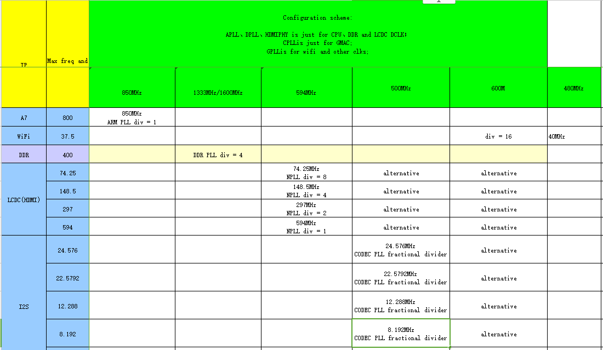
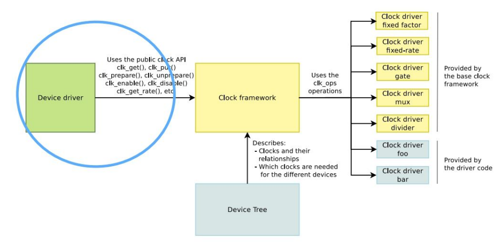
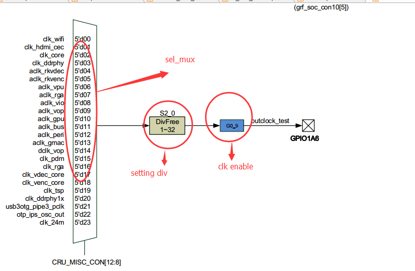

# Rockchip Clock Development Guide

Release Version: 1.0

Author email:zhangqing@rock-chips.com

Date: 2018.6

Security Classification: Public

---

**Preface**

**Overview**

This document mainly describes RK platforms clock subsystem framework and configuration.

**Product Version**

| **Chipset Name** | **Kernel Version** |
| ---------------- | ------------------ |
| RK303X           | LINUX3.10          |
| RK312X           | LINUX3.10          |
| RK322X           | LINUX3.10          |
| RK3288X          | LINUX3.10          |
| RK3328           | LINUX3.10          |
| RK3368           | LINUX3.10          |

**Application object**

The document(the guide) is mainly suitable for below engineers:

Field Application Engineers

Software Development Engineers

**Revision history**

| **Date**  | **Version** | **Author** | **Revision description**  |
| --------- | ----------- | ---------- | ------------------------- |
| 2016.6.6  | 1.0.        | Elaine     | The first version release |
| 2017.2.10 | 1.1.        | Elaine     | Add soc RK3328            |

---

[TOC]

---

## 1 Solution Overview

### 1.1 Overview

This chapter mainly describes clock sub system related important concept, clock solution, overall process and code structure.

### 1.2 Important Concept

**Clock sub system**

The clock here means the tree framework providing clock for SOC components, but not the time used by kernel, same as other module, CLK also has framework in order to match with different platforms. Above the adaptive layer is the customer code and interface, that is the drivers of the modules such as the peripherals requiring clock signal, USB etc. Under the adaptive layer is the clock operation details of specific SOC.

**Clock Tree Structure**

All the mainstream processor platform running Linux have very complex clock tree. Look up the clock related chapter in the specification of any one processor, there must be one very huge and complex tree picture which consists of clock related components and the output clock of these components.

**Related Component**

Clock related components contain: oscillator used to generate clock(active oscillator, also called harmonic oscillator) or crystal(passive oscillator, also called crystal oscillator); PLL used for frequency doubling(Phase Locked Loop); divider used for frequency dividing; Mux used for multi-choice; And GATE used to control clock enable; hardware module using clock(also called consumer); and so on.

### 1.3 Clock Solution

Every SOC has its own clock allocation solution, mainly including PLL setting, parent attribute, DIV, MUX etc.. The clock solution is different for different chipset.


Diagram 1‑1 clk Clk clock tree sample graph



Diagram 1‑2 Clock allocation sample graph

### 1.4 Over process



Diagram 1‑3 clock allocation flow chart

The main content includes(no need to support all clk)

1. Enable/disable clk。

2. Setting clk frequency

3. Select clk parent

### 1.5 Code structure

CLOCK software framework consists of CLK Device Tree(clk register description, the tree relationship among clk, etc.), Device driver CLK configuration and CLK API. The three parts functions and CLK code route are shown as Table 1-1.

| Program                          | Function                                                     | Route                                |
| -------------------------------- | ------------------------------------------------------------ | ------------------------------------ |
| Device Tree                      | clk register description, the tree relationship among clk, etc. | Arch/arm/boot/dts/rk3xxx-clocks.dtsi |
| Deal with RK PLL and special CLK | 1. Deal with RK PLL clock 2. Deal with some RK special clocks such as LCDC, I2S etc. | Drivers/clk/rockchip/clk-xxx.c       |
| CLK API                          | provide interface invoked by driver in linux environment     | Drivers/clk/clk-xxx.x                |

Table 1‑1 CLK code structure

## 2 CLOCK Development Guide

### 2.1 Overview

This chapter describes how to modify clock setting, use API interface and debug CLK program.

### 2.2 Clock Related Concept

#### 2.2.1 PLL

Phase locked loop input through 24M crystal and then lock out corresponding frequency through internal phase locked loop. This is the clock source of all SOC CLOCK. All SOC bus and device clock frequencies are divided from PLL. RK platforms PLL mainly include:

Table 2‑1 PLL description

| PLL  | Sub Device | Feature     | Remark                                 |
| ---- | --------- | ------------- | ---------------------------------------- |
| APLL | CLK_CORE | CPU clock | Normally only used by CPU, because CPU can change frequency, APLL will change the frequency according to CPU requirement. |
| DPLL | Clk_DDR  | DDR clock | Normally only used by DDR, because DDR can change frequency, DPLL will change according to DDR requirement |
| GPLL |           | Provide backup parent clk for bus and peripheral clock | Normally set as 594M or 1200M, to make sure the output for basic 100, 200, 300 400M clock |
| CPLL |           | Backup for GMAC or other devices | Normally may be 400, 500, 800, 1000M, or exclusively used by lcdc |
| NPLL |           | Backup for other devices | Normally may be 1188M, or exclusively used by LCDC |

Our SOC bus has ACLK_PERI、HCLK_PERI、PCLK_PERI、ACLK_BUS、HCLK_BUS、PCLK_BUS.(ACLK is used for data transmission, PCLK and HCLK are normally used for register read and write)

BUS and PERI are mainly  distinguished by high-speed and low-speed bus. ACLK range is 100-300M, PCLK range is 50M~150M, HCLK range is 37M~150M. BUS mainly includes some low speed devices such as I2C, I2S, SPI etc. And PERI  mainly includes some high speed devices such as EMMS, GMAC, USB etc. The different chipsets will have some difference in design. For example, it will design one standalone ACLK for some device requiring high speed bus(such as ACLK_EMMC or ACLK_USB etc.)

The devices bus clock structure is shown as below picture:


(e.g.: GMAC can raise its device bus frequency by increasing ACLK_PERI to achieve quick data copy or transfer)

Diagram 2‑1 bus clock structure

#### 2.2.2 GATING

CLOCK framework has many GATING, mainly used to lower power consumption. When some device is off and no need to maintain CLOCK, you can enbale GATING to save the power.

RK CLOCK framework GATING is using tree structure with parent-child attribute. GATING switch has a reference counting mechanism. When using this counting to open the CLOCK, it will traverse to open its parent CLOCK. When the child CLOCK is closed, the parent CLOCK will traverse all the child CLOCK. The parent CLOCK will be closed only when all the child CLOCK are closed.

(e.g.: When using I2S2, you must open the three GATING as shown in picture 2-2, but software only needs to open the last GATING and the clock structure will automatically open its parent GATING.)


Diagram 2‑2 GATING sample graph

### 2.3 Clock Configuration

#### 2.3.1 Clock Initial Configuration

```c
arch/arm64/dts/rockchip/rk33xx.dtsi

	rockchip_clocks_init: clocks-init{
		compatible = "rockchip,clocks-init";
	}
```

1. **Frequency**

CLOCK TREE frequency set during initialization:

```c
	rockchip,clocks-init-rate =
			<&clk_gpll 1200000000>, <&clk_core 700000000>,
			<&clk_cpll 500000000>, <&aclk_bus 150000000>,
			<&hclk_bus 150000000>, <&pclk_bus 75000000>,
			<&aclk_peri 150000000>, <&hclk_peri 150000000>,
			<&pclk_peri 75000000>, <&clk_mac 125000000>,
			<&aclk_iep 250000000>, <&hclk_vio 125000000>,
			<&aclk_rga 250000000>, <&clk_gpu 250000000>,
			<&aclk_vpu 25000000>, <&clk_vdec_core 250000000>,
			<&clk_vdec_cabac 250000000>, <&aclk_rkvdec 16000000>,
			<&aclk_vop 400000000>, <&clk_gmac_div 25000000>;
```

2. **Parent**

CLOCK TREE parent set during initialization:

```c
	rockchip,clocks-init-parent =
			<&clk_i2s0_pll &clk_gpll>, <&clk_i2s1_pll &clk_gpll>,
			<&clk_i2s2_pll &clk_gpll>, <&clk_spdif_pll &clk_gpll>,
			<&clk_gpu &clk_cpll>, <&dclk_vop0 &hdmi_phy_clk>,
			<&aclk_bus &clk_gpll>, <&aclk_peri &clk_gpll>,
			<&clk_sdmmc0 &clk_cpll>, <&clk_emmc &clk_cpll>,
			<&clk_sdio &clk_cpll>, <&aclk_vpu &clk_cpll>,
			<&hdmi_phy_clk &hdmiphy_out>, <&usb480m &usb480m_phy>,
			<&aclk_rkvdec &clk_cpll>, <&clk_gmac &clk_cpll>;
```

3. **Gating**

Whether to enable CLOCK TREE by default or not during initialization:

Note: For the clock not enabled by default and no device reference to enable, it will be closed after clk initialization finished.

```c
	rockchip_clocks_enable: clocks-enable {
		compatible = "rockchip,clocks-enable";
		clocks =
			/*PLL*/
			<&clk_apll>,
			<&clk_dpll>,
			<&clk_gpll>,
			<&clk_cpll>,

			/*PD_CORE*/
			<&clk_core>,
			<&pclk_dbg>,
			<&aclk_core>,
			<&clk_gates4 2>,

			/*PD_BUS*/
			<&clk_gates6 3>,/*pclk_bus_pre*/
			<&clk_gates7 1>,/*clk4x_ddrphy*/
			<&clk_gates8 5>,/*clk_ddrupctl*/
			<&clk_gates8 0>,/*aclk_intmem*/
			<&clk_gates8 1>,/*clk_intmem_mbist*/
			<&clk_gates8 2>,/*aclk_dmac_bus*/
}
```

#### 2.3.2 Driver Clock Configuration

1. Get CLK Pointer

Add clock reference information in DTS device node(recommend)

```c
	clocks = <&clk_saradc>, <&clk_gates7 14>;
	clock-names = "saradc", "pclk_saradc";
```

```c
	dev->pclk = devm_clk_get(&pdev->dev, "pclk_saradc");
	dev->clk = devm_clk_get(&pdev->dev, "saradc");
```

Not add clock reference information in DTS device node

```c
Driver code：

	dev->pclk = devm_clk_get(NULL, "g_p_saradc");
	dev->clk = devm_clk_get(NULL, "clk_saradc");
```

### 2.4  CLOCK API Interface

#### 2.4.1 Main CLK API

1. **Header file**

```c
#include <linux/clk.h>

	clk_prepare/clk_unprepare
	clk_enable/clk_disable
	clk_prepare_enable/clk_disable_unprepare
	clk_get/clk_put
	devm_clk_get/devm_clk_put
	clk_get_rate/clk_set_rate
	clk_round_rate
```

2. **Get CLK pointer**

```c
	struct clk *devm_clk_get(struct device *dev, const char *id)（recommend）
	struct clk *clk_get(struct device *dev, const char *id)
```

3. **Prepare/enable CLK**

```c
	int clk_prepare(struct clk *clk)
	/*Called before opening the clock, may cause sleep, so put the resume here, you can put the original sub operation in enable*/
	void clk_unprepare(struct clk *clk)
	/*The opposite operation of prepare*/
	int clk_enable(struct clk *clk)
	/*Original sub operation, open clock, the function return only after the actual usable clock signale is generated*/
	void clk_disable(struct clk *clk)
	/*Original sub operation, close the clock*/
	clk_enable/clk_disable，start/stop clock. will not sleep.
	clk_prepare/clk_unprepare，the preparation before clock start/stop. may sleep.
```

You can use `clk_prepare_enable / clk_disable_unprepare` ,which must be paired to make sure reference counting correct.

**Note:**

prepare/unprepare，enable/disable description:

The essence of these two API is to separate clock start/stop into atomic and non-atomic two phases for easier implement and invoke. So for the "will not sleep/may sleep" mentioned above, there are two different meanings: one is to tell clock driver of bottom layer to put the operations which may cause sleep in prepare/unprepare instead of enable/disable; the other is to remind the driver using clock in upper layer that definitely not to invoke prepare/unprepare interface within atomic context(e.g. internal protection area including mutex lock, interrupt shut down, spinlock) as it may sleep, while it is safe to invoke enable/disable interface.

Besides, why does clock enable/disable need to sleep? Take an example, enable PLL clk, after PLL starts, need to wait until it is stable. But PLL will take a long time to be stable, during this period CPU should be handed over(process enters sleep) otherwise it will be wasted.

At last, why is there clk_prepare_enable/clk_disable_unprepare integrated interface? If it is invoked in non-atomic context, you can invoke prepare/enable、disable/unprepared in sequence. To make it simple, framework helps to package these two interfaces.

4. **Setting CLK frequency**

```c
	int clk_set_rate(struct clk *clk, unsigned long rate)（Hz）
```

(if return value is less than 0, set CLK failed)

#### 2.4.2 Example

DTS

```c
	adc: adc@2006c000 {
		compatible = "rockchip,saradc";
		reg = <0x2006c000 0x100>;
		interrupts = <GIC_SPI 26 IRQ_TYPE_LEVEL_HIGH>;
		#io-channel-cells = <1>;
		io-channel-ranges;
		rockchip,adc-vref = <1800>;
		clock-frequency = <1000000>;
		clocks = <&clk_saradc>, <&clk_gates7 14>;
		clock-names = "saradc", "pclk_saradc";
		status = "disabled";
	};
```

Driver code

```c
	static int rk_adc_probe(struct platform_device *pdev)
	{
		info->clk = devm_clk_get(&pdev->dev, "saradc");
		if (IS_ERR(info->clk)) {
			dev_err(&pdev->dev, "failed to get adc clock\n");
			ret = PTR_ERR(info->clk);
			goto err_pclk;
		}
		if(of_property_read_u32(np, "clock-frequency", &rate)) {
			dev_err(&pdev->dev, "Missing clock-frequency property in the DT.\n");
			goto err_pclk;
		}
		ret = clk_set_rate(info->clk, rate);
		if(ret < 0) {
			dev_err(&pdev->dev, "failed to set adc clk\n");
			goto err_pclk;
		}
		clk_prepare_enable(info->clk);
	}

	static int rk_adc_remove(struct platform_device *pdev)
	{
		struct iio_dev *indio_dev = platform_get_drvdata(pdev);
		struct rk_adc *info = iio_priv(indio_dev);
		device_for_each_child(&pdev->dev, NULL, rk_adc_remove_devices);
		clk_disable_unprepare(info->clk);
		clk_disable_unprepare(info->pclk);
		iio_device_unregister(indio_dev);
		free_irq(info->irq, info);
		iio_device_free(indio_dev);
		return 0;
	}
```

### 2.5 CLOCK Debugging

1. **CLOCK DEBUGS:**

Print current clock tree structure:

```
	cat /sys/kernel/debug/clk/clk_summary
```

2. **CLOCK set node:**

configuration option:

Select `RK_PM_TESTS`

```c
	There is no help available for this option.
	Symbol: RK_PM_TESTS [=y]
	Type  : boolean
	Prompt: /sys/pm_tests/ support
	Location:
	 -> System Type
	 -> Rockchip SoCs (ARCH_ROCKCHIP [=y])
	Defined at arch/arm/mach-rockchip/Kconfig.common:41
	Depends on: ARCH_ROCKCHIP [=y]
	Selects: DVFS [=y] && WATCHDOG [=y]
```

Node command:

```c
	get rate:
	         echo get [clk_name] > /sys/pm_tests/clk_rate
	set rate:
	         echo set [clk_name] [rate(Hz)] > /sys/pm_tests/clk_rate
	         echo rawset [clk_name] [rate(Hz)] > /sys/pm_tests/clk_rate
	open rate:
	         echo open [clk_name] > /sys/pm_tests/clk_rate
	close rate:
	         echo close [clk_name] > /sys/pm_tests/clk_rate
```

3. **Test**

Some clocks can be output to test_clk_out, directly test clk output frequency to check if the clock wave is normal or not. Configuration method(take RK3228 as an example):



**Setting CLK MUX**

CRU_MISC_CON

Address: Operational Base + offset (0x0134)


**Setting CLK DIV**

CRU_CLKSEL4_CON

Address: Operational Base + offset (0x0054)


 **Set CLK GATING**

CRU_CLKGATE0_CON

Address: Operational Base + offset (0x00d0)


## 3 FAQ

### 3.1 PLL Setting

#### 3.1.1 PLL Type Search

PLL related registers, PLL computing formula etc. will have some differences for different chipsets. Use PLL type to distinguish the chipsets and to compute and set PLL parameters.

Find PLL and confirm its type in `rk3xxx-clocks.dtsi`.

```c
	clk_cpll: pll-clk@0018 {
					compatible = "rockchip,rk3188-pll-clk";
					clock-output-names = "clk_cpll";
					rockchip,pll-type = <CLK_PLL_312XPLUS>;
};
```

According PLL type to look up PLL frequency support table in clk-pll.c.

```c
	case CLK_PLL_312XPLUS:

	return &clk_pll_ops_312xplus;
```

#### 3.1.2 PLL Recall Function Definition

```c
	static const struct clk_ops clk_pll_ops_312xplus = {
	.recalc_rate = clk_pll_recalc_rate_3036_apll,
	.round_rate = clk_cpll_round_rate_312xplus,
	.set_rate = clk_cpll_set_rate_312xplus,
	};
```

#### 3.1.3 PLL frequency table definition

```c
	struct pll_clk_set *clk_set = (struct pll_clk_set *)(rk312xplus_pll_com_table);
	static const struct pll_clk_set rk312xplus_pll_com_table[] = {
		_RK3036_PLL_SET_CLKS(1000000, 3, 125, 1,  1, 1, 0),
		_RK3036_PLL_SET_CLKS(800000, 1, 100, 3, 1, 1, 0),
		_RK3036_PLL_SET_CLKS(594000, 2, 99, 2, 1, 1, 0),
		_RK3036_PLL_SET_CLKS(500000, 1, 125, 3, 2, 1, 0),
		_RK3036_PLL_SET_CLKS(416000, 1, 104, 3, 2, 1, 0),
		_RK3036_PLL_SET_CLKS(400000, 3, 200, 2, 2, 1, 0),
	};
```

#### 3.1.4 PLL computing formula

```c
	VCO = 24M * FBDIV / REFDIV (450M ~ 2200M);
	/*the bigger VCO, the smaller jitter, the higher the power consumption; the smaller REFDIV, the shorter PLL LOCK time*/
	FOUT = VCO / POSTDIV1/ POSTDIV2;
	/*POSTDIV1 > = POSTDIV2*/
```

for example： VCO = 24M * 99 / 2 = 1188M

FOUT = 1188 / 2/ 1 = 594M

If want to add other PLL frequency, only need to fill in the table according to the above formula.

There is one special PLL type which can not be found in the table. It will automatically compute PLL parameter. For example:

```c
	CLK_PLL_3036PLUS_AUTO
	CLK_PLL_312XPLUS
	CLK_PLL_3188PLUS_AUTO
```

(Note: But when using automatic computing, VCO is not guaranteed to be as big as possible, not recommend if you have requirement for PLL jitter)

### 3.2 Some special clock setting

#### 3.2.1 LCDC display related clock

LCDC DCLK is determined by current panel resolution, so the difference is huge among different products. So in RK platforms LCDC DCLK usually monopolize one PLL. The PLL frequency can change according to the panel requirement. So, normally it requires this PLL can compute PLL parameter automatically and try not to hang some other clocks with requirement for clock under this PLL. Refer to below table:

Table 3‑1  Dclk_lcdc parent select

| **产品名称**Product name | **PLL**                |
| ------------------------ | ---------------------- |
| RK303X                   | monopolize CPLL        |
| RK312X                   | monopolize CPLL        |
| RK322X                   | monopolize HDMIPHY PLL |
| RK3288X                  | monopolize CPLL        |
| RK3368                   | monopolize NPLL        |

The difference of  display CLOCK setting in different platforms is huge. Here take RK322X and RK3288 as example.

**RK322X：**

It is easier to use HDMIPHY PLL output for DCLK LCDC. How much DCLK LCDC needs, HDMIPHY output the corresponding clock. This is the PLL phase locked loop output internally implemented by HDMIPHY.

**RK3288：**

RK3288 is more complex. CPLL is also monopolized, but it has other child clocks, and RK3288 supports dual display, that means there are DCLK_LCDC0 and DCLK_LCDC1, one as main display and the other as HDMI display. Both main display and HDMI display have relationship with actual panel resolution, so theoretically it needs two standalone PLL. But RK3288 only designs one PLL for display, we can only allow main display to change CPLL frequency to meet with any panel resolution, while the other lcdc needs to use the similar frequency divided from current available GPLL and CPLL frequency.

```c
drivers/clk/rockchip/clk-ops.c

	const struct clk_ops clkops_rate_3288_dclk_lcdc0 = {
	.determine_rate = clk_3288_dclk_lcdc0_determine_rate,
	.set_rate = clk_3288_dclk_lcdc0_set_rate,
	.round_rate = clk_3288_dclk_lcdc0_round_rate,
	.recalc_rate = clk_divider_recalc_rate,
	};

	const struct clk_ops clkops_rate_3288_dclk_lcdc1 = {
	.determine_rate = clk_3288_dclk_lcdc1_determine_rate,
	.set_rate = clk_3288_dclk_lcdc1_set_rate,
	.round_rate = clk_3288_dclk_lcdc1_round_rate,
	.recalc_rate = clk_divider_recalc_rate,
	};
```

#### 3.2.2 EMMC/SDIO/SDMMC

These clocks require frequency division by even and should have default two divided-frequency within the controller. That means, if EMMC needs 50M, the CLOCK needs to provide 100M clock for EMMC and the 100M should be obtained from PLL frequency division by even.

The clock obtained from frequency division by even has a flag: rockchip,clkops-idx = <CLKOPS_RATE_MUX_EVENDIV>;

Follow below steps if need to change this kind of clock frequency:

1. **Confirm the parent of the clock.**

```c
arch/arm/dts/rk3xxx-clocks.dtsi

	clk_emmc: clk_emmc_mux {
			compatible = "rockchip,rk3188-mux-con";
			rockchip,bits = <14 2>;
			clocks = <&cpll>, <&clk_gpll>, <&xin24m>;
			clock-output-names = "clk_emmc";
			#clock-cells = <0>;
	};
	/*there are three parent CPLL, GPLL, 24M to choose*/
```

2. **Confirm its parent frequency**

```c
	cat /sys/kernel/debug/clk/clk_summary | grep gpll
```

Check if it is able to obtain the required frequency according to the above double relationship and frequency division by even. If not, try frequency multiplication of PLL(but normally not recommend over 1200M).

3. **Set frequency**

You can change frequency through clk_set_rate interface in EMMC driver.

#### 3.2.3 Fractional frequency division

I2S, UART etc. are fractional frequency division. There is one requirement for fractional frequency division setting, that is the frequency and the parent of the fractional frequency division should have a 20-time relationship, if not, the CLK output will have a large jitter and frequency deviation.


Diagram 3‑1 fractional frequency division clock sample graph

#### 3.2.4 Ethernet Clock

The ethernet clock requires to be precise. 100M ethernet requires precise frequency of 50M and gigabit ethernet requires 125M. Normally if there is ethernet requirement, PLL output clock should also be precise. If current clock solution is not able to provide precise clock due to other reason, ethernet needs to use external clock crystal. It is determined by the project requirement and the actual product solution.