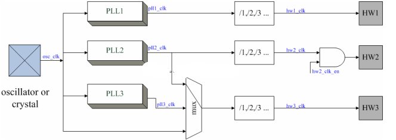
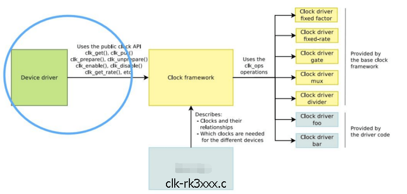
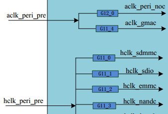
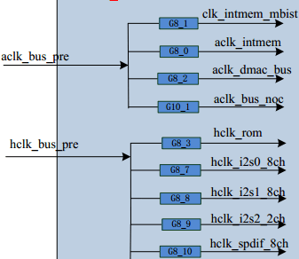
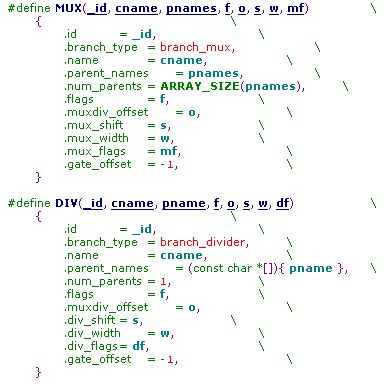
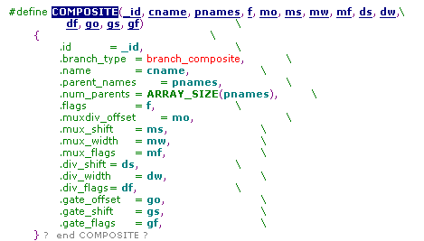
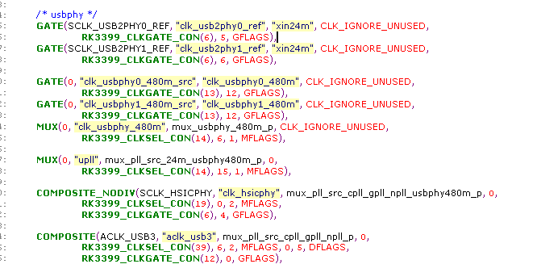
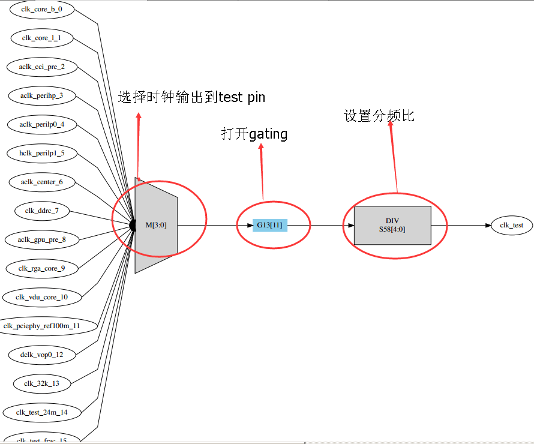

# Rockchip Clock 开发指南

发布版本：V1.0.0

日期：2021-01-18

文件密级：□绝密   □秘密   □内部资料   ■公开

**免责声明**

本文档按“现状”提供，瑞芯微电子股份有限公司（“本公司”，下同）不对本文档的任何陈述、信息和内容的准确性、可靠性、完整性、适销性、特定目的性和非侵权性提供任何明示或暗示的声明或保证。本文档仅作为使用指导的参考。

由于产品版本升级或其他原因，本文档将可能在未经任何通知的情况下，不定期进行更新或修改。

**商标声明**

“Rockchip”、“瑞芯微”、“瑞芯”均为本公司的注册商标，归本公司所有。

本文档可能提及的其他所有注册商标或商标，由其各自拥有者所有。

**版权所有 © 2021 瑞芯微电子股份有限公司**

超越合理使用范畴，非经本公司书面许可，任何单位和个人不得擅自摘抄、复制本文档内容的部分或全部，并不得以任何形式传播。

瑞芯微电子股份有限公司

Rockchip Electronics Co., Ltd.

地址：     福建省福州市铜盘路软件园A区18号

网址：     [www.rock-chips.com](http://www.rock-chips.com)

客户服务电话： +86-4007-700-590

客户服务传真： +86-591-83951833

客户服务邮箱： [fae@rock-chips.com](mailto:fae@rock-chips.com)

---

**前言**

**概述**

本文档主要介绍 RK 平台时钟子系统框架介绍以及配置。

**产品版本**

| 芯片名称 | **内核版本**    |
| -------- | --------------- |
| RK303X   | LINUX4.4 & 4.19 |
| RK312X   | LINUX4.4 & 4.19 |
| RK322X   | LINUX4.4 & 4.19 |
| RK3288X  | LINUX4.4 & 4.19 |
| RK3328   | LINUX4.4 & 4.19 |
| RK3368   | LINUX4.4 & 4.19 |
| RK3399   | LINUX4.4 & 4.19 |
| RV1108   | LINUX4.4 & 4.19 |
| PX30     | LINUX4.4 & 4.19 |
| RV1126   | LINUX4.4 & 4.19 |
| RK356X   | LINUX4.4 & 4.19 |

**读者对象**

本文档（本指南）主要适用于以下工程师：

技术支持工程师

软件开发工程师

**修订记录**

| **版本号** | **作者** | **修改日期** | **修改说明**       |
| ---------- | -------- | ------------ | ------------------ |
| V1.0.0     | Elaine   | 2021.1.18    | 第一次临时版本发布 |

---

**目录**

[TOC]

---

**图表目录**

> [*图表 1‑1 时钟树的示例图*](#_Toc456336516)
>
> [*图表 1‑2 时钟配置流程图*](#_Toc456336518)
>
> [*图表 1‑3 CLOCK 代码构成*](#_Toc456336519)
>
> [*图表 2‑1 PLL描述*](#_Toc456336520)
>
> [*图表 2‑2 总线时钟结构*](#_Toc456336521)
>
> [*图表 2‑3 GATING示例图*](#_Toc456336522)
>
> [*图表 2-4 CLOCKID示例图*](#_Toc456336523)
>
> [*图表 2-5 CLOCKTYPE示例图*](#_Toc456336524)
>
> [*图表 2-6 CLOCKPARENT示例图*](#_Toc456336525)
>
> [*图表 2-7 TESTCLOCK示例图*](#_Toc456336526)
>
> [*图表 2-8 TESTCLOCK_MUX*](#_Toc456336527)
>
> [*图表 2-9 TESTCLOCK_DIV*](#_Toc456336528)
>
> [*图表 2-10 TESTCLOCK_GATE*](#_Toc456336529)
>
> [*图表 3-1 DCLK分配图*](#_Toc456336530)
>
> [*图表 3‑2 小数分频时钟示意图*](#_Toc456336531)

---

## 方案概述

### 概述

本章主要描述时钟子系统的相关的重要概念、时钟方案、总体流程、代码结构。

### 重要概念

**时钟子系统**

这里讲的时钟是给 SOC 各组件提供时钟的树状框架，并不是内核使用的时间，和其他模块一样，CLOCK 也有框架，用以适配不同的平台。适配层之上是客户代码和接口，也就是各模块（如需要时钟信号的外设，USB 等）的驱动。适配层之下是具体的 SOC 台的时钟操作细节。

**时钟树结构**

可运行 LINUX 的主流处理器平台，都有非常复杂的 CLOCK TREE，我们随便拿一个处理器的 SPEC，查看 CLOCK 相关的章节，一定会有一个非常庞大和复杂的树状图，这个图由 CLOCK 相关的器件，以及这些器件输出的 CLOCK 组成。

**相关器件**

CLOCK 相关的器件包括：用于产生 CLOCK 的 Oscillator（有源振荡器，也称作谐振荡器）或者 Crystal（无源振荡器，也称晶振）；用于倍频的 PLL（锁相环，Phase Locked Loop）；用于分频的 Divider；用于多路选择的 MUX；用于CLOCK ENABLE控制的与门；使用 CLOCK 的硬件模块（可称作 CONSUMER）；等等。

### 时钟方案

每一个 SOC 都有自己的时钟分配方案，主要是包括 PLL 的设置，各个 CLOCK 的父属性、DIV、MUX 等。芯片不同，时钟方案是有差异的。



图表 1‑1 时钟树的示例图

### 总体流程



图表 1‑2 时钟配置流程图

主要内容包括（不需要所有 CLOCK 都支持）：

1. Enable/Disable CLOCK。

2. 设置 CLOCK 的频率。

3. 选择 CLOCK 的 Parent。

### 代码结构

CLOCK 的软件框架由 CLOCK 的 Device Tree（CLOCK 的寄存器描述、CLOCK 之间的树状关系等）、Device driver 的 CLOCK 配置和 CLOCK API 三部分构成。这三部分的功能、CLOCK 代码路径如表 1-1 所示。

| 项目            | 功能                                   | 路径                                                       |
| --------------- | ---------------------------------------------------------- | -------------------------------------- |
| Clk-rk3xxx.c    | .c中主要是CLOCK的寄存器描述、CLOCK之间的树状关系描述等         | Drivers/clk/rockchip/clk-rk3xxx.c      |
| Rk3xxx-cru.h    | .h中是CLOCK的ID定义，通过ID匹配CLOCK Name。                    | Include/dt-bindings/clock/rk3xxx-cru.h |
| RK 特别的处理   | 处理 RK 的 PLL 时钟, 处理 RK 的一些特殊时钟如 LCDC、I2S 等 | Drivers/clk/rockchip/clk-xxx.c         |
| CLK API         | 提供 Linux 环境下供 Driver 调用的接口                      | Drivers/clk/clk-xxx.x                  |

图表 1‑3 CLOCK代码构成

---

## CLOCK 开发指南

### 概述

本章描述如何修改时钟配置、使用 API 接口及调试 CLOCK 程序。

### 时钟的相关概念

#### PLL

锁相环，是由 24M 的晶振输入，然后内部锁相环锁出相应的频率。这是 SOC 所有 CLOCK 的时钟的源。SOC 的所有总线及设备的时钟都是从 PLL 分频下来的。RK 平台主要 PLL 有:

| PLL  | 子设备     | 用途                     | 备注                                                         |
| ---- | ---------- | ------------------------ | ------------------------------------------------------------ |
| APLL | CLOCK_CORE | CPU 的时钟               | 一般只给 CPU 使用，因为 CPU 会变频，APLL 会根据 CPU 要求的频率变化 |
| DPLL | CLOCK_DDR  | DDR 的时钟               | 一般只给 DDR 使用，因为 DDR 会变频，DPLL 会根据 DDR 要求变化 |
| GPLL |            | 提供总线、外设时钟做备份 | 一般设置在 594M 或者 1200M，保证基本的 100、200、300、400M 的时钟都有输出 |
| CPLL |            | GMAC 或者其他设备做备份  | 一般可能是 400、500、800、1000M。或者是给 Lcdc 独占使用。    |
| NPLL |            | 给其他设备做备份         | 一般可能是 1188M，或者给 Lcdc 独占使用。                     |

图表 2‑1 PLL描述

#### 总线

我们 SOC 的总线有 ACLK_PERI、HCLK_PERI、PCLK_PERI、ACLK_BUS、HCLK_BUS、PCLK_BUS.（ACLK 用于数据传输，PCLK 跟 HCLK 一般是用于寄存器读写）

而区分 BUS 跟 PERI 主要是为了做高速和低速总线的区分，ACLK 范围 100-300M，PCLK 范围 50M\~150M，HCLK 范围 37M\~150M。BUS 下面主要是一些低速的设备，如 I2C、I2S、SPI 等，PERI 下面一般是 EMMC、GMAC、USB 等。不同的芯片在设计时会有一些差异。例如：对于某些对总线速度要求较高时，可能单独给此设备设计一个独立的 ACLK（如 ACLK\_EMMC 或者 ACLK\_USB 等）。

各个设备的总线时钟会挂在上面这些时钟下面，如下图结构：






图表 2‑2 总线时钟结构

（如：GMAC 想提高自己设备的总线频率以实现其快速的数据拷贝或者搬移，可以提高 ACLK\_PERI 来实现）

备注：
RK3399上设计将高速和低速总线彻底分开，分成高速：ACLK_PERIHP、HCLK_PERIHP、PCLK_PERIHP；低速：ACLK_PERILP0、HCLK_PERILP0、PCLK_PERILP0、HCLK_PERILP1、PCLK_PERILP1。这样做是为了功耗最优，根据不同的需求可以设置不同的总线频率。（具体每个设备在哪条总线下详细见时钟图）
可以参考（EMMC、GMAC、USB等有自己的ACLK）。

#### GATING

CLOCK 的框架中有很多的 GATING，主要是为了降低功耗使用，在一些设备关闭，CLOCK 不需要维持的时候，可以关闭 GATING，节省功耗。

RK CLOCK 的框架的 GATING 是按照树的结构，有父子属性。GATING 的开关有一个引用计数机制，使用这个计数来实现 CLOCK 打开时，会遍历打开其父 CLOCK。在子 CLOCK 关闭时，父 CLOCK 会遍历所有的子 CLOCK，在所有的子都关闭的时候才会关闭父 CLOCK。

（如：I2S2 在使用的时候，必须要打开图中三个 GATING（如图 2-2），但是软件上只需要开最后一级的 GATING，时钟结构会自动的打开其 parent 的 GATING）


图表 2‑3 GATING示例图

### 时钟配置

#### 时钟初始化配置

与LINUX3.10不同的，4.4内核时钟的初始化使用"of_clk_set_defaults"然后解析"assigned-clocks"获取CLOCK的ID，然后获取CLOCK Name，解析"assigned-clock-parents"获取需要设置的PARENT，解析"assigned-clock-rates"获取需要设置的频率。

```c
arch/arm64/dts/rockchip/rk33xx.dtsi

cru: clock-controller@ff760000 {
	compatible = "rockchip,rk3399-cru";
	reg = <0x0 0xff760000 0x0 0x1000>;
	#clock-cells = <1>;
	#reset-cells = <1>;
	assigned-clocks =
		<&cru ACLK_VOP0>, <&cru HCLK_VOP0>,
		<&cru ACLK_VOP1>, <&cru HCLK_VOP1>,
		<&cru ARMCLKL>, <&cru ARMCLKB>,
		<&cru PLL_GPLL>, <&cru PLL_CPLL>,
		<&cru PLL_NPLL>,
		<&cru ACLK_PERIHP>, <&cru HCLK_PERIHP>,
		<&cru PCLK_PERIHP>,
		<&cru ACLK_PERILP0>, <&cru HCLK_PERILP0>,
		<&cru PCLK_PERILP0>,
		<&cru HCLK_PERILP1>, <&cru PCLK_PERILP1>;
};
```

1. **频率**

CLOCK TREE 初始化时设置的频率：

```c
	assigned-clock-rates =
		<400000000>,  <200000000>,
		<400000000>,  <200000000>,
		<816000000>, <816000000>,
		<594000000>,  <800000000>,
		<1000000000>,
		<150000000>,   <75000000>,
		<37500000>,
		<100000000>,  <100000000>,
		<50000000>,
		<100000000>,   <50000000>;
```

2. **Parent**

CLOCK TREE 初始化时设置的 PARENT：

```c
	assigned-clock-parents =
			<&cru VPLL>, <&cru VPLL>,
			<&cru CPLL>, <&cru CPLL>,
			<&cru APLLL>, <&cru APLLB>,
			<&cru GPLL>, <&cru GPLL>,
			<&cru GPLL>,
			<&cru GPLL>, <&cru GPLL>;
```

注意：
Assinged的配置Parent和Rate时候，需要跟Assigned-Clocks一一对应，因为设置是按照Assigned-Clocks的CLK ID进行查找并设置的。

3. **Gating**

CLOCK TREE 初始化时是否默认 Enable：

注意：对于没有默认初始化 Enable，且设备没有引用去 Enable 的时钟，在CLOCK初始化完成之后，会被关闭。

（1）常开CLOCK：

需要在clk-rk3xxx.c中增加Critical配置，主要在rk3399_cru_critical_clocks中增加需要默认打开的CLOCK Name，一旦增加CLOCK的计数被加1，后面这个CLOCK将不能被关闭。

```c
static const char *const rk3399_cru_critical_clocks[] __initconst = {
	"aclk_usb3_noc",
	"aclk_gmac_noc",
	"pclk_gmac_noc",
	"pclk_center_main_noc",
	"aclk_cci_noc0",
	"aclk_cci_noc1",
	"clk_dbg_noc",
	"hclk_vcodec_noc",
	"aclk_vcodec_noc",
	"hclk_vdu_noc",
	"aclk_vdu_noc",
}；
```

（2）CLOCK的定义时候增加Flag属性CLK_IGNORE_UNUSED，这样即使这个CLOCK没有使用，在最后CLOCK关闭没有用的CLOCK时也不会关闭这个。但是在CLOCK TREE上看到的Enable Cnt还是0，但是CLOCK是开启的。

```c
GATE(PCLK_PMUGRF_PMU, "pclk_pmugrf_pmu", "pclk_pmu_src", CLK_IGNORE_UNUSED, RK3399_PMU_CLKGATE_CON(1), 1, GFLAGS),
```

#### 时钟ID

LINUX4.4和4.19上对CLOCK的操作都是引用CLOCK ID，而ID如何获取？

在clk-rk3xxx.c中找到需要控制的CLOCK(可以用过Name查找)：


图表 2-4 CLOCKID示例图

#### 主要的CLOCK注册类型函数

常用的有如下几种：
GATE：描述GATING，主要包括CLOCK ID、类型、GATING的寄存器偏移地址、BIT位等。
MUX：描述SLECT，主要包括CLOCK ID、类型、MUX的寄存器偏移地址、BIT位等。
COMPOSITE：描述有MUX、DIV、GATING的CLK，主要包括CLOCK ID、类型、MUX、DIV、GARING的寄存器偏移地址、BIT位等。




图表 2-5 CLOCKTYPE示例图

Clk-rk3xxx.c中的使用，使用这些CLOCK的注册函数，描述此CLOCK的类型，寄存器及父子关系等。



图表 2-6 CLOCKPARENT示例图

#### Driver 的时钟配置

1. 获取 CLOCK 指针

DTS 设备结点里添加CLOCK引用信息（推荐）

```c
	clocks = <&cru SCLK_TSADC>, <&cru PCLK_TSADC>;
	clock-names = "tsadc", "apb_pclk";
```

```c
	dev->pclk = devm_clk_get(&pdev->dev, "tsadc");
	dev->clk = devm_clk_get(&pdev->dev, "apb_pclk");
```

DTS 设备结点里未添加CLOCK引用信息

```c
Driver code：

	dev->pclk = devm_clk_get(NULL, "g_p_saradc");
	dev->clk = devm_clk_get(NULL, "clk_saradc");
```

### CLOCK API 接口

#### 主要的CLOCK API

1. **头文件**

```c
#include <linux/clk.h>

	clk_prepare/clk_unprepare
	clk_enable/clk_disable
	clk_prepare_enable/clk_disable_unprepare
	clk_get/clk_put
	devm_clk_get/devm_clk_put
	clk_get_rate/clk_set_rate
	clk_round_rate
```

2. **获取CLOCK指针**

```c
	struct clk *devm_clk_get(struct device *dev, const char *id)（推荐使用，可以自动释放）
	struct clk *clk_get(struct device *dev, const char *id)
	static inline struct clk *devm_clk_get_optional(struct device *dev, const char *id)
	static inline int __must_check devm_clk_bulk_get(struct device *dev, int num_clks, struct clk_bulk_data *clks)(推荐使用，整组获取，整组开关）
	static inline int __must_check devm_clk_bulk_get_optional(struct device *dev, int num_clks, struct clk_bulk_data *clks)
	static inline int __must_check devm_clk_bulk_get_all(struct device *dev, struct clk_bulk_data **clks)
```

3. **准备/使能 CLOCK**

```c
	int clk_prepare(struct clk *clk)
	/*开时钟前调用，可能会造成休眠，所以把休眠部分放到这里，可以原子操作的放到enable里*/
	void clk_unprepare(struct clk *clk)
	/*prepare的反操作*/
	int clk_enable(struct clk *clk)
	/*原子操作，打开时钟，这个函数必须在产生实际可用的时钟信号后才能返回*/
	void clk_disable(struct clk *clk)
	/*原子操作，关闭时钟*/
	clk_enable/clk_disable，启动/停止clock。不会睡眠。
	clk_prepare/clk_unprepare，启动clock前的准备工作/停止clock后的善后工作。可能会睡眠。
```

可以使用 clk_prepare_enable / clk_disable_unprepare，clk_prepare_enable / clk_disable_unprepare(或者 clk_enable / clk_disable) 必须成对，以使引用计数正确。

**注意：**

prepare/unprepare，enable/disable 的说明：

这两套 API 的本质，是把CLOCK的启动/停止分为 Atomic 和 Non-atomic 两个阶段，以方便实现和调用。因此上面所说的“不会睡眠/可能会睡眠”，有两个角度的含义：一是告诉底层的CLOCK Driver，请把可能引起睡眠的操作，放到 Prepare/Unprepare 中实现，一定不能放到 Enable/Disable 中；二是提醒上层使用CLOCK的Driver，调用 Prepare/Unprepare 接口时可能会睡眠，千万不能在 Atomic 上下文（例如内部包含 Mutex 锁、中断关闭、Spinlock 锁保护的区域）调用，而调用 Enable/Disable 接口则可放心。

另外，CLOCK的 Enable/Disable 为什么需要睡眠呢？这里举个例子，例如 Enable PLL CLOCK，在启动 PLL 后，需要等待它稳定。而 PLL 的稳定时间是很长的，这段时间要把 CPU 交出（进程睡眠），不然就会浪费 CPU。

最后，为什么会有合在一起的 clk_prepare_enable/clk_disable_unprepare 接口呢？如果调用者能确保是在 Non-atomic 上下文中调用，就可以顺序调用 prepare/enable、disable/unprepared，为了简单，Framework 就帮忙封装了这两个接口。

4. **设置CLOCK频率**

```c
	int clk_set_rate(struct clk *clk, unsigned long rate)（单位Hz）
```

（返回值小于 0，设置CLOCK失败）

#### 示例

DTS

```c
	tsadc: tsadc@ff260000 {
		compatible = "rockchip,rk3399-tsadc";
		reg = <0x0 0xff260000 0x0 0x100>;
		interrupts = <GIC_SPI 97 IRQ_TYPE_LEVEL_HIGH>;
		rockchip,grf = <&grf>;
		clocks = <&cru SCLK_TSADC>, <&cru PCLK_TSADC>;
		clock-names = "tsadc", "apb_pclk";
		assigned-clocks = <&cru SCLK_TSADC>;
		assigned-clock-rates = <750000>;
		resets = <&cru SRST_TSADC>;
		reset-names = "tsadc-apb";
		pinctrl-names = "init", "default", "sleep";
		pinctrl-0 = <&otp_gpio>;
		pinctrl-1 = <&otp_out>;
		pinctrl-2 = <&otp_gpio>;
		#thermal-sensor-cells = <1>;
		rockchip,hw-tshut-temp = <95000>;
		status = "disabled";
	}；
```

Driver code

```c
static int rockchip_thermal_probe(struct platform_device *pdev)
{
	.....

	thermal->reset = devm_reset_control_array_get(&pdev->dev, false, false);
	if (IS_ERR(thermal->reset)) {
		if (PTR_ERR(thermal->reset) != -EPROBE_DEFER)
			dev_err(&pdev->dev, "failed to get tsadc reset lines\n");
		return PTR_ERR(thermal->reset);
	}

	thermal->num_clks = devm_clk_bulk_get_all(&pdev->dev, &thermal->clks);
	if (thermal->num_clks < 1)
		return -ENODEV;

	error = clk_bulk_prepare_enable(thermal->num_clks, thermal->clks);
	if (error) {
		dev_err(&pdev->dev, "failed to prepare enable tsadc bulk clks: %d\n",
			error);
		return error;
	}
	......
}

static int rockchip_thermal_remove(struct platform_device *pdev)
{
	.......

	clk_bulk_disable_unprepare(thermal->num_clks, thermal->clks);

	.......
}
```

### CLOCK 调试

1. **CLOCK DEBUGS:**

打印当前时钟树结构：

```
	cat /sys/kernel/debug/clk/clk_summary
```

2. **CLOCK 设置节点：**

节点命令：

```c
get rate:
	cat /sys/kernel/debug/clk_saradc/clk_rate
set rate:
	echo 24000000 > /sys/kernel/debug/clk_saradc/clk_rate
打开clk：
	echo 1 > /sys/kernel/debug/clk_saradc/clk_enable_count
关闭clk：
	echo 0 > /sys/kernel/debug/clk_saradc/clk_enable_count
```

3. **TEST_CLK_OUT 测试：**

部分时钟是可以输出到 test_clk_out，直接测试CLOCK输出频率，用于确认某些时钟波形是否正常。配置方法(以 RK3399 为例)：



图表 2-7 TESTCLK示例图

**设置CLOCK的 MUX**

CRU_MISC_CON

Address: Operational Base + offset (0x050c)


图表 2-8 TESTCLOCK_MUX

**设置CLOCK的 DIV**

CRU_CLKSEL58_CON

Address: Operational Base + offset (0x01e8)


图表 2-9 TESTCLOCK_DIV

**设置CLOCK的 GATING**

CRU_CLKGATE13_CON

Address: Operational Base + offset (0x0334)


图表 2-10 TESTCLOCK_GATE

---

## 常见问题分析

### PLL 设置

#### PLL 频率表格定义

```c
static struct rockchip_pll_rate_table rk3399_pll_rates[] = {
	/* _mhz, _refdiv, _fbdiv, _postdiv1, _postdiv2, _dsmpd, _frac */
	RK3036_PLL_RATE(2208000000, 1, 92, 1, 1, 1, 0),
	RK3036_PLL_RATE(2184000000, 1, 91, 1, 1, 1, 0),
	RK3036_PLL_RATE(2160000000, 1, 90, 1, 1, 1, 0),
	RK3036_PLL_RATE(2136000000, 1, 89, 1, 1, 1, 0),
	RK3036_PLL_RATE(2112000000, 1, 88, 1, 1, 1, 0),
	RK3036_PLL_RATE(2088000000, 1, 87, 1, 1, 1, 0),
	RK3036_PLL_RATE(2064000000, 1, 86, 1, 1, 1, 0),
	RK3036_PLL_RATE(2040000000, 1, 85, 1, 1, 1, 0),
	RK3036_PLL_RATE(2016000000, 1, 84, 1, 1, 1, 0),
	RK3036_PLL_RATE(1992000000, 1, 83, 1, 1, 1, 0),
	RK3036_PLL_RATE(1968000000, 1, 82, 1, 1, 1, 0),
	RK3036_PLL_RATE(1944000000, 1, 81, 1, 1, 1, 0),
	RK3036_PLL_RATE(1920000000, 1, 80, 1, 1, 1, 0),
	RK3036_PLL_RATE(1896000000, 1, 79, 1, 1, 1, 0),
	RK3036_PLL_RATE(1872000000, 1, 78, 1, 1, 1, 0),
	RK3036_PLL_RATE(1848000000, 1, 77, 1, 1, 1, 0),
	RK3036_PLL_RATE(1824000000, 1, 76, 1, 1, 1, 0),
	RK3036_PLL_RATE(1800000000, 1, 75, 1, 1, 1, 0),
	RK3036_PLL_RATE(1776000000, 1, 74, 1, 1, 1, 0),
	RK3036_PLL_RATE(1752000000, 1, 73, 1, 1, 1, 0),
	RK3036_PLL_RATE(1728000000, 1, 72, 1, 1, 1, 0),
	RK3036_PLL_RATE(1704000000, 1, 71, 1, 1, 1, 0),
	RK3036_PLL_RATE(1680000000, 1, 70, 1, 1, 1, 0),
	RK3036_PLL_RATE(1656000000, 1, 69, 1, 1, 1, 0),
	RK3036_PLL_RATE(1632000000, 1, 68, 1, 1, 1, 0),
	RK3036_PLL_RATE(1608000000, 1, 67, 1, 1, 1, 0),
	RK3036_PLL_RATE(1600000000, 3, 200, 1, 1, 1, 0),
	RK3036_PLL_RATE(1584000000, 1, 66, 1, 1, 1, 0),
	RK3036_PLL_RATE(1560000000, 1, 65, 1, 1, 1, 0),
	RK3036_PLL_RATE(1536000000, 1, 64, 1, 1, 1, 0),
	RK3036_PLL_RATE(1512000000, 1, 63, 1, 1, 1, 0),
	RK3036_PLL_RATE(1488000000, 1, 62, 1, 1, 1, 0),
	RK3036_PLL_RATE(1464000000, 1, 61, 1, 1, 1, 0),
	RK3036_PLL_RATE(1440000000, 1, 60, 1, 1, 1, 0),
	RK3036_PLL_RATE(1416000000, 1, 59, 1, 1, 1, 0),
	RK3036_PLL_RATE(1392000000, 1, 58, 1, 1, 1, 0),
	RK3036_PLL_RATE(1368000000, 1, 57, 1, 1, 1, 0),
	RK3036_PLL_RATE(1344000000, 1, 56, 1, 1, 1, 0),
	RK3036_PLL_RATE(1320000000, 1, 55, 1, 1, 1, 0),
	RK3036_PLL_RATE(1296000000, 1, 54, 1, 1, 1, 0),
	RK3036_PLL_RATE(1272000000, 1, 53, 1, 1, 1, 0),
	RK3036_PLL_RATE(1248000000, 1, 52, 1, 1, 1, 0),
	RK3036_PLL_RATE(1200000000, 1, 50, 1, 1, 1, 0),
	RK3036_PLL_RATE(1188000000, 2, 99, 1, 1, 1, 0),
	RK3036_PLL_RATE(1104000000, 1, 46, 1, 1, 1, 0),
	RK3036_PLL_RATE(1100000000, 12, 550, 1, 1, 1, 0),
	RK3036_PLL_RATE(1008000000, 1, 84, 2, 1, 1, 0),
	RK3036_PLL_RATE(1000000000, 1, 125, 3, 1, 1, 0),
	RK3036_PLL_RATE( 984000000, 1, 82, 2, 1, 1, 0),
	RK3036_PLL_RATE( 960000000, 1, 80, 2, 1, 1, 0),
	RK3036_PLL_RATE( 936000000, 1, 78, 2, 1, 1, 0),
	RK3036_PLL_RATE( 912000000, 1, 76, 2, 1, 1, 0),
	RK3036_PLL_RATE( 900000000, 4, 300, 2, 1, 1, 0),
	RK3036_PLL_RATE( 888000000, 1, 74, 2, 1, 1, 0),
	RK3036_PLL_RATE( 864000000, 1, 72, 2, 1, 1, 0),
	RK3036_PLL_RATE( 840000000, 1, 70, 2, 1, 1, 0),
	RK3036_PLL_RATE( 816000000, 1, 68, 2, 1, 1, 0),
	RK3036_PLL_RATE( 800000000, 1, 100, 3, 1, 1, 0),
	RK3036_PLL_RATE( 700000000, 6, 350, 2, 1, 1, 0),
	RK3036_PLL_RATE( 696000000, 1, 58, 2, 1, 1, 0),
	RK3036_PLL_RATE( 676000000, 3, 169, 2, 1, 1, 0),
	RK3036_PLL_RATE( 600000000, 1, 75, 3, 1, 1, 0),
	RK3036_PLL_RATE( 594000000, 1, 99, 4, 1, 1, 0),
	RK3036_PLL_RATE( 533250000, 8, 711, 4, 1, 1, 0),
	RK3036_PLL_RATE( 504000000, 1, 63, 3, 1, 1, 0),
	RK3036_PLL_RATE( 500000000, 6, 250, 2, 1, 1, 0),
	RK3036_PLL_RATE( 408000000, 1, 68, 2, 2, 1, 0),
	RK3036_PLL_RATE( 312000000, 1, 52, 2, 2, 1, 0),
	RK3036_PLL_RATE( 297000000, 1, 99, 4, 2, 1, 0),
	RK3036_PLL_RATE( 216000000, 1, 72, 4, 2, 1, 0),
	RK3036_PLL_RATE( 148500000, 1, 99, 4, 4, 1, 0),
	RK3036_PLL_RATE( 106500000, 1, 71, 4, 4, 1, 0),
	RK3036_PLL_RATE(  96000000, 1, 64, 4, 4, 1, 0),
	RK3036_PLL_RATE(  74250000, 2, 99, 4, 4, 1, 0),
	RK3036_PLL_RATE(  65000000, 1, 65, 6, 4, 1, 0),
	RK3036_PLL_RATE(  54000000, 1, 54, 6, 4, 1, 0),
	RK3036_PLL_RATE(  27000000, 1, 27, 6, 4, 1, 0),
	{ /* sentinel */ },
};
```

#### PLL 计算公式

```c
	VCO = 24M * FBDIV / REFDIV (450M ~ 2200M)
	/*VCO越大jitter越小，功耗越大; REFDIV越小PLL LOCK时间越短*/
	FOUT = VCO / POSTDIV1/ POSTDIV2 /
	/* POSTDIV1 > = POSTDIV2*/
```

如： VCO = 24M * 99 / 2 = 1188M

FOUT = 1188 / 2/ 1 = 594M

如果需要增加其他的 PLL 频率，按照上述公式补齐表格即可。

有一个 PLL 类型是特殊的，查表查不到，会自动去计算 PLL 的参数。如：

（注意：但是使用自动计算的时候，VCO 不能保证尽量大，如果对 PLL 的 jitter 有要求的不建议使用。）

### 部分特殊时钟的设置

#### LCDC 显示相关的时钟

LCDC 的 DCLK 是根据当前屏幕的分辨率决定的，所以不同产品间会有很大差异。所以 RK 平台上 LCDC 的 DCLK 一般是独占一个 PLL 的。由于要独占一个 PLL，所以这个 PLL 的频率会根据屏的要求变化。所以一般此 PLL 要求是可以自动计算 PLL 参数的。而且一些其他对时钟有要求的时钟尽量不要挂在此 PLL 下面。如下表中：

| **产品名称** | **PLL**                 |
| ------------ | ----------------------- |
| RK303X       | 独占 CPLL               |
| RK312X       | 独占 CPLL               |
| RK322X       | 独占 HDMIPHY PLL        |
| RK3288X      | 独占 CPLL               |
| RK3368       | 独占 NPLL               |
| RK3399       | 支持双显独占 CPLL和VPLL |

图表 3-1 DCLK分配图

对于显示的 CLOCK 的设置，不同的平台差异很大，在此以 RK322X 和 RK3288 为例。

**RK322X：**

使用 HDMIPHY PLL 给 DCLK LCDC，所以就比较简单，DCLK LCDC 需要多少，就按照 HDMIPHY 输出多少的时钟就可以了，这个是 HDMIPHY 内部实现 PLL 的锁相输出。

**RK3288：**

RK3288 的就比较麻烦了，虽然也是 CPLL 独占使用，但是 CPLL 下面还有其他的时钟，而且 3288 是支持双显，也就是有 DCLK_LCDC0 和 DCLK_LCDC1，一个做主显一个做 HDMI 显示。主显跟 HDMI 显示都跟实际屏的分辨率有关系，所以理论上需要两个独立的 PLL 的，但是 3288 设计上只有一个 PLL 给显示用，那么我们就只能要求主显的是可以修改 CPLL 的频率，满足任意分辨率的屏，而另一个 lcdc 只能是在当前 GPLL 和 CPLL 已有的频率下分频出就近的频率。

**RK3399：**

VPLL是给HDMI使用的，也就是做HDMI显示的VOP的DCLK需要绑定在VPLL上，并且DCLK和VPLL频率是1:1关系。另一个VOP绑定在CPLL。Dts可以如下配置：

```c
VOP0给HDMI

&vopb_rk_fb {
	assigned-clocks = <&cru DCLK_VOP0_DIV>;
	assigned-clock-parents = <&cru PLL_VPLL>;
};
&vopl_rk_fb {
	assigned-clocks = <&cru DCLK_VOP1_DIV>;
	assigned-clock-parents = <&cru PLL_CPLL>;
};
```

```c
VOP1给HDMI

&vopb_rk_fb {
	assigned-clocks = <&cru DCLK_VOP0_DIV>;
	assigned-clock-parents = <&cru PLL_CPLL>;
};
&vopl_rk_fb {
	assigned-clocks = <&cru DCLK_VOP1_DIV>;
	assigned-clock-parents = <&cru PLL_VPLL>;
};
```

具体使用要看具体芯片，每个芯片设计不一样，限制条件也会有差异。

#### 小数分频

I2S、UART 等有小数分频的。对于小数分频设置时有一个要求，就是小数分频的频率跟小数分频的 Parent 有一个 20 倍的关系，如果不满足 20 倍关系，输出的CLOCK会有较大的抖动及频偏。


图表 3‑2 小数分频时钟示意图

#### 以太网时钟

对于以太网的时钟，一般要求是精准的，百兆以太网要求 50M 精准的频率，千兆以太网要求 125M 精准的频率。一般有以太网需求的，PLL 也要是精准的时钟输出。如果说当前的时钟方案由于其他的原因不能出精准的时钟，那么以太网就要使用外部时钟晶振。这个是根据项目需求及实际的产品方案定的。
