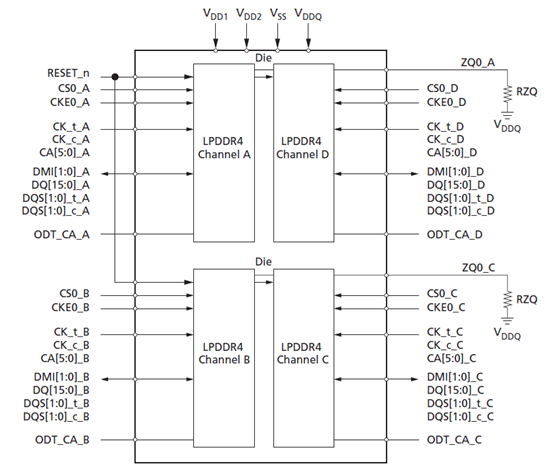

# **DDR布板注意事项**

发布版本：1.3

作者邮箱：hcy@rock-chips.com

日期：2018.10.08

文件密级：内部资料

---------

**前言**
记录所有平台的DDR布板注意事项

**概述**

**产品版本**

| **芯片名称**                                 | **内核版本** |
| ---------------------------------------- | -------- |
| 所有芯片(包括28系列、29系列、30系列、31系列、32系列、33系列、PX系列、1108A) | 所有内核版本   |

**读者对象**

本文档（本指南）主要适用于以下工程师：

硬件工程师

**修订记录**

| **日期**     | **版本** | **作者** | **修改说明**                   |
| ---------- | ------ | ------ | -------------------------- |
| 2017.11.02 | V1.0   | 何灿阳    |                            |
| 2017.11.09 | V1.1   | 陈炜     | 更改某些表述                     |
| 2017.01.14 | V1.2   | 汤云平    | 增加RK3326描述及LPDDR2/LPDDR3要求 |
| 2018.10.08 | V1.3   | 陈有敏    | 增加总容量3GB说明和RK3399单通道布线要求   |

--------------------
[TOC]
------
## 名词说明
- **颗粒**：指各种DDR memory，DDR3 memory、DDR4 memory、LPDDR3 memory、LPDDR4 memory、LPDDR2 memory

- **CS**：主控或DDR memory的片选信号

- **rank**：就是CS，就是片选信号

- **byte**：主控每8根DDR信号线，成为一个byte。所以byte0指DQ0-DQ7，byte1指DQ8-DQ15，byte2指DQ16-DQ23，byte3指DQ24-DQ31。注意，这里的DQ都是说主控的，颗粒的DQ不一定跟主控的DQ是一一对应连接的。

- **bank**：是指DDR memory的bank数量

- **column**：是指DDR memory的column数量

- **row**：是指DDR memory的row数量

- **AXI SPLIT**：非对称容量组合模式，如高位寻址区为16bit位宽，低位寻址区为32bit位宽。例如常规的组合为256x16+256x16，而AXI SPLIT的组合为256x16+128x16=768MB，在高位寻址区只剩16bit位宽，示意图如下图。

  

-----
## 总的要求
总的要求适用于所有平台，各款主控的特殊要求，后面单独列出

**1、DQ的交换，不能超出该组byte，只能在byte内部进行交换。有些主控有特殊要求，byte内部都不能交换，见具体主控的特殊要求**

原因：因为DDR协议，每组byte的DQ信号，总是与该组的DQS信号同步。如果DQ被换到另一组byte，会导致DQS同步信号用错。

**2、用到2个CS上的bank、column数量不同的DDR颗粒，需要跟软件确认是否支持**

原因：不同的bank、column数量需要有2个CS的ddr_config来选择，而我们的ddr_config和控制器，都是采用一个寄存器来控制2个CS，因此要求2个CS的column必须一样。
某些主控有对1-2个不同column的配置有支持，还有些是DDR颗粒不同的bank或column刚好可以找到一个ddr_config配置项可以用，要看column不同的情况。所以，具体情况还请找软件确认。

**3、如果颗粒只有一个CS，只能接在主控的CS0上**

原因：控制器的设计限制

**4、如果只用一个通道，只支持通道0**

原因：代码写死，否则代码变复杂

**5、如果颗粒2个CS的容量不同，则容量小的应该放在主控的CS1上**

原因：软件设定的前提，否则要改软件，软件变复杂，而且有的芯片本身不支持

**6、所有平台，不支持大于2个CS的颗粒**

LPDDR4有大于2个CS的颗粒，如果使用，只能用到2个CS

**7、如果颗粒只有一个ODT（像LPDDR3），应该连到ODT0上**

原因：控制器的设计限制

**8、6Gb、12Gb的使用比较特殊（8Gb、4Gb、2Gb没有这条限制）**

目前只支持一个通道上的2个CS都是6Gb或者2个CS都是12Gb的，不支持6Gb、12Gb与8Gb、4Gb、2Gb混合在2个CS中使用。
比如：

| CS0  | CS1  | 支持情况                  |
| ---- | ---- | --------------------- |
| 6Gb  | 6Gb  | 支持                    |
| 12Gb | 12Gb | 支持                    |
| 6Gb  | 12Gb | 不支持  违反要求5，并且这样组合也不支持 |
| 12Gb | 6Gb  | 不支持，  这种组合也不支持        |
| 8Gb  | 6Gb  | 不支持  8Gb和6Gb混合在2个CS中  |
| 12Gb | 8Gb  | 不支持  12Gb和8Gb混合在2个CS中 |
| 6Gb  | 4Gb  | 不支持  6Gb和4Gb混合在2个CS中  |
| 12Gb | 4Gb  | 不支持  12Gb和4Gb混合在2个CS中 |

**9、颗粒的RZQ不能共用**

一块板子上贴多颗颗粒或者一个颗粒上有多个RZQ pin（如dual die的LPDDR3）的话，必须每个RZQ pin单独接一个240ohm的电阻。

**10、DDR4目前连接方式暂无特殊要求**

**11、外接LPDDR2或LPDDR3时，DDR0的DQ0-DQ7应该一一对应的连接到DRAM的DQ0-DQ7**

由于LPDDR2/LPDDR3 Mode Register read的数据是通过DQ0-DQ7读回来，所以需要保证DQ0-DQ7的连接是一一对应的。如无法保证DQ0-DQ7一一对应的话需与软件确认。

**12、双通道DRAM总容量3GB支持情况**
双通道DRAM总容量3GB支持的颗粒组合如下图：

  
  说明：1）RK3288，RK3399支持双通道。

**13、单通道DRAM总容量3GB支持情况**
单通道DRAM总容量3GB支持的颗粒组合如下图：

  

----
##  RK3399特殊要求
**1、 CS2是CS0的复制信号，CS3是CS1的复制信号，其行为与被复制信号完全一样**

因此对于DDR3，LPDDR3，实际只能使用2个CS。CS2，CS3主要是给LPDDR4使用的，因为LPDDR4颗粒一个channel是16bit，当要让主控达到32bit、2CS时，就需要用到4根CS信号。

**2、CLK走线必须比该通道任意一组DQS都长，ddr PHY的要求**

原因：Vendor 无法提供准确的CLK需要比DQS长多少的数据，layout上能长多少尽量长多少。

**3、LPDDR3的D0-D15必须和主控完全一一对应的连接**

原因：因为有用到LPDDR3的CA training，数据会按顺序输出到D0-D15，所以这些信号不能对调，必须一一对应的连接

**4、LPDDR3的D16、D24这2根数据线也必须和主控完全一一对应连接**

原因：cadence方案的training有用到DQ Calibration，而DQ Calibration LPDDR3一定是从D0、D8、D16、D24吐出数据，其他数据线不一定有数据吐出，所以额外还需要D16、D24要一一对应。（D0、D8在前一条规则已经要求了）。

**5、注意主控一个通道与LPDDR4颗粒2个通道的组成关系**

​    a. LPDDR4 366/272球封装均为64bit带宽，每16bit为一个channel，RK3399为32bit一个channel，所以RK3399每个通道挂2*channel的LPDDR4

​    b. LPDDR4 366/272颗粒每2个channel共用一个ZQ。

​    c. 设计要求不共用ZQ的channel组合成一个32bit连接到RK3399。如下图，不能把Channel A和Channel D拿来组合。也不能把Channel B和Channel C拿来组合。这2组Channel都是共用一个ZQ的。

目前通过Micron、Samsung、Hynix三家颗粒的Channel A\B\C\D定义来看，采用颗粒的Channel A + Channel C组成一个32bit，和Channel B + Channel D组成一个32bit，这种方法，能做到三家颗粒都可以避免ZQ共用的问题。所以，改版后的LPDDR4都采用这种方式的连线。

**6、LPDDR4的RZQ要通过240电阻接VDDQ，而不是GND，这点要注意，RK3399主控端没有变，还是一样RZQ通过240电阻接GND**

**7、接LPDDR4时，主控端的DDR0_ODT0/1，DDR1_ODT0/1悬空，不用连到LPDDR4颗粒。而颗粒端的ODT_CA_X默认通过10K电阻上拉到VDDQ，暂时预留DNP的下拉电阻**

**8、LPDDR4所有数据线（DQ）都不能对调，不管组内，还是组间**

​    即DDRx_D0-D15必须一一对应的连接到一个LPDDR4颗粒通道的D0-D15；DDRx_D16-D31必须一一对应的连接到另一个LPDDR4颗粒通道的D0-D15；原因：

​    对单个LPDDR4 channel来说（16bit），MRR功能需要用到DQ[0：7]；CA training功能需要用到DQS0、DQ[0:6]、DQ[8:13]；RD DQ Calibration用到DQ[0:15]和DMI[1:0]。所以，所有数据线都不能对调。

   额外说明：

​    假设原来DDRx_D0-D15是连到LPDDR4颗粒的channel A，DDRx_D16-D31是连到LPDDR4颗粒的channel C。
如果希望将A/C通道的互连关系对调，即DDRx_D0-D15连到LPDDR4颗粒的channel C，DDRx_D16-D31连到LPDDR4颗粒的channel A。则这种对调方式，是允许的。但需要满足上面第5点的要求，保证LPDDR4上共用ZQ的通道不组合成32bit。

**9、如果只用channel 0，channel 1也需要供电**

原因：RK3399 DDR变频时是通过CIC模块控制DDR频率切换，而CIC模块要求两个channel要同时切换。即使channel 1上没有接DRAM，也需要对channel 1的controller和PHY进行初始化，否则CIC模块控制DDR频率切换时，会出现由于channel 1异常，导致CIC模块状态出错，DDR变频失败。

 因此对于单通道使用场景（channel 0有接DRAM，channel 1没有接DRAM），也需要对channel 1进行供电（DDR1_AVDD_0V9,DDR1_CLK_VDD,DDR1_VDD），否则channel 1上的controller和PHY无法完成初始化，影响DDR变频功能。

-----
## RK3326、PX30特殊要求
**1、支持的位宽组合方式**

1. 32bit最大位宽（大容量16bit+小容量16bit），举例：256x16+128x16=768MB。
2. 16bit最大位宽（大容量8bit+小容量8bit），举例：512x8+256x8=768MB。

**2、颗粒要求**

AXI SPLIT模式下，要求所有颗粒的column,bank是相同的。

**3、连接要求**

1. AXI SPLIT模式下，要求在使用16bit位宽的颗粒时，需要将AP DDR控制器的byte0/1接在一个颗粒上，将byte2/3接在一个颗粒上。
2. AXI SPLIT模式下，要求较大容量的颗粒连接到AP DDR控制器的低位区，如byte0或byte0/1,举例：16bit a颗粒+16bit b颗粒组成32bit位宽，如果a颗粒的容量大，则a颗粒连接到byte0/1。
3. 如果使用2个CS，则只有CS1支持AXI SPLIT，允许两种方式：
   1. CS1上采用非对称容量，如CS0上为32bit总位宽，则CS1上采用大容量16bit+小容量16bit颗粒拼接成32bit，如CS0上为16bit总位宽，则CS1上采用大容量8bit+小容量8bit颗粒拼接成16bit。
   2. CS1上只贴一半位宽的颗粒，要求其row<=CS0上的颗粒。如CS0为32bit总位宽，则CS1贴16bit的颗粒，如CS0为16bit总位宽，则CS1贴8bit的颗粒。

**4、下表列举出了所有支持的AXI SPLIT的容量组合。该表格之外的AXI SPLIT组合都不支持。**

| NO.  | CS0                          | CS1                                 | 支持情况 |
| ---- | ---------------------------- | ----------------------------------- | ---- |
| 1    | 16bit最大位宽（大容量8bit+小容量8bit）   | 无颗粒                                 | 支持   |
| 2    | 32bit最大位宽（大容量16bit+小容量16bit） | 无颗粒                                 | 支持   |
| 3    | 32bit固定位宽                    | 32bit最大位宽（大容量16bit+小容量16bit）        | 支持   |
| 4    | 32bit固定位宽                    | 16bit固定位宽，接Byte0/1（row<=cs0上的颗粒row） | 支持   |
| 5    | 16bit固定位宽                    | 16bit最大位宽（大容量8bit+小容量8bit）          | 支持   |
| 6    | 16bit固定位宽                    | 8bit固定位宽，接Byte0（row<=cs0上的颗粒row）    | 支持   |

**5、常规应用同其他平台一致。**