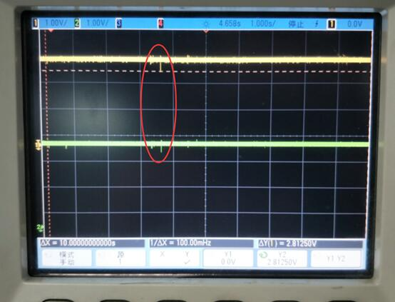
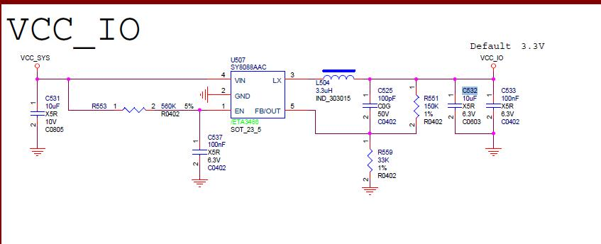
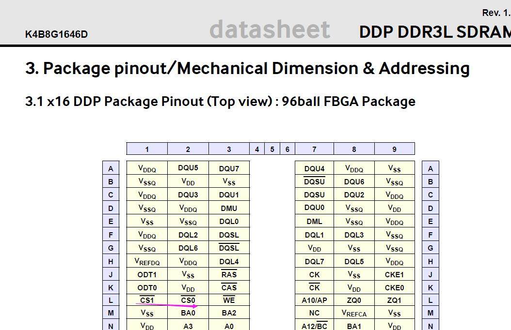

----------------------------
**Rockchip**
# **DDR遇到的问题记录**

发布版本：1.1

作者邮箱：hcy@rock-chips.com

日期：2017.11.29

文件密级：内部资料

---------
# 前言
**记录所有DDR遇到的问题，不管是哪个平台，用于Q4期间整理成DDR问题排查手册**

------
**产品版本**
| **芯片名称** | **内核版本** |
| -------- | -------- |
| 所有芯片     | 所有内核版本   |

**读者对象**
本文档（本指南）主要适用于以下工程师：
技术支持工程师
软件开发工程师

**修订记录**
| **日期**     | **版本** | **作者** | **修改说明** |
| ---------- | :----: | :----: | :------: |
| 2017.10.26 |  V1.0  |  何灿阳   |          |
| 2017.11.29 |  V1.1  |  汤云平   |   增加描述   |

--------------------
[TOC]
------

#  RK3228B
## 问题：无法恢复出厂设置
#### 关键词：无法恢复出厂设置，OS_REG被清，GRF_OS_REG被清，LPDDR3板子无法恢复出厂设置
#### 现象描述
从菜单点恢复出厂设置，机器重启后，还是正常开机，并没有进入recovery模式。
而且客户这款机器用得是LPDDR3的颗粒才有这个问题，另外一款用DDR3的就没有这个问题。
#### 恢复出厂设置的原理
```mermaid
graph TD
	A[用户通过菜单点恢复出厂设置]-->B[kernel会在OS_REG中<br/>写上recovery的特殊标志]
	B-->C[重启]

	D[启动]-->|kernel启动|E{OS_REG是否有<br/>进入recovery的特殊标志}
	E-->|有|F[进入recovery流程]
	E-->|没有|G[正常启动kernel]
```
其中的OS_REG，不同平台使用的不同。因为有的平台是PMU_OS_REG在reboot后不会被清0.
有的平台没有PMU_OS_REG，有GRF_OS_REG，也是reboot后不会被清0.
而对于3229，使用的是GRF_OS_REG.

另一个，OS_REG一般我们都设计有4个，这4个具体怎么使用的，都是由kernel负责人、loader负责人、DDR负责人一起协商定义好的，而且各个芯片都这样沿用下来。对于此问题，用于进入recovery流程的标志，记录在GRF_OS_REG[0]上。
#### 分析过程
从无法进recovery模式的kernel log可以看到，kernel并没有进入recovery流程，而是走了正常启动kernel的流程。所以，问题一定出在OS_REG的标志上。

可能原因有2个：

一是，reboot前，标志没写入。

二是，reboot后，重启过程中，标志被kernel前的代码改掉了，既然客户说跟DDR有关系，那重点要怀疑DDR初始化代码清掉了OS_REG标志。

查找过程：

步骤1：在kernel reboot前，打印出GRF_OS_REG[0]的值

结果：OS_REG的标志有正常写入

步骤2：kernel一开始打印GRF_OS_REG[0]的值

结果：OS_REG的标志已经变成0
所以，怀疑是在kernel前的流程中被清0了。

步骤3：在uboot一开始打印GRF_OS_REG[0]的值

结果：OS_REG的标志已经变成0

步骤4：检查DDR初始化代码

结果：并没有对GRF_OS_REG[0]操作，更没有根据不同DDR类型来做不同操作。

所以，不可能是DDR代码清了OS_REG标志

步骤5：在DDR一开始打印GRF_OS_REG[0]的值

结果：OS_REG的标志已经变成0

好奇怪，DDR一开始的地方就变成0，说明不是软件清0，是硬件导致的清0

这里就可以排除是板子使用不同DDR导致的了。

步骤6：用可以正常恢复出厂设置的DDR3机器，重复上述过程

结果：DDR3机器GRF_OS_REG[0]的值能一直保持到kernel检查的地方

所以，问题已经可以确认出在2台机器的硬件上的差异，从上面的现象看，能把OS_REG清0，要么是电源掉电了，要么是有RESET信号进来。

最终让硬件测电源和reset信号，找到了原因。

#### 问题原因
REBOOT测试时VCCIO会塌陷到2.5V,而RESET检测VCCIO的阀值为2.63V。所以导致RESET信号有效，从而复位了CPU，最终导致OS_REG的标志没了。再次启动后，就判断不到这个标志，从而进入不了recovery模式。下面是电源塌陷的波形



#### 解决办法
由于塌陷是DC-DC导致的，最好的解决办法是换DC-DC。但是基于客户不换的解决办法是：

将输出端C532更改为22Uf,同时将U509第3PIN加22uF电容,保证VCCIO塌陷不触发reset,功能即正常



----
# RK3328/RK3228H
## 问题：颗粒验证时，烧写失败
#### 关键词：烧写失败，不能启动
#### 现象描述
收集了一批板子，贴了各种型号的DDR颗粒，用于验证。结果发现有3块板子烧写总是失败
#### 分析过程
查找过程：

步骤1：查看烧写失败的串口打印log，看到DDR初始化能正常完成，后面的uboot等代码运行异常了

步骤2：认真查看DDR初始化的log，发现是芯片不匹配的。

步骤3：看过芯片是RK3328的，再看下载选择的loader等，是RK3228H的。

所以导致loader和芯片不匹配，运行会不稳当。要么烧写失败，要么系统启动异常。

步骤4：选择RK3328的loader和其他相应文件。

结果：烧写和运行都正常。

#### 问题原因
一堆板子里，有RK3228H，也有RK3328，下载时，没有根据芯片型号选对loader和其他文件。导致下载失败
#### 解决办法
根据芯片型号，选对loader和其他文件，就能解决

-----
# PX3
## 问题：贴2GB DDR3L，只识别到1GB容量
#### 关键词：容量识别错，容量不对，少了一个CS，少了一个片选
#### 现象描述
客户板子贴了2片512Mx16bit的颗粒，总容量应该是2GB，但开机log看，容量只识别到1GB
#### 分析过程
查找过程：

步骤1：让客户提供DDR3L的datasheet和原理图

步骤2：看到DDR3L是512Mx16bit的，认真对比datasheet和开机log的DDR信息，发现DDR3L是2CS的，而开机log只识别到一个CS


步骤3：因为PX3芯片设计本身有一个局限，就是当颗粒的row数量为16时，这时候CS信号被拿过来当row15信号了，因此row数量为16时，只能支持一个CS。具体见“interconnect”章节的描述。

而512Mx16bit如果不是dual-die，就是16根row信号。

步骤4：认真看了DDR3L的datasheet，确实是dual-die的，不是16跟row信号。所以，导致只识别到一个CS的问题，肯定不是芯片本身的这个局限导致的。

步骤5：查看客户的原理图，发现颗粒板子只有CS0


#### 问题原因
DDR3L是2个CS的颗粒，而客户原理图只连了一个CS0到颗粒。导致容量少了一半。
#### 解决办法
无法解决，除非客户改版

----
## 问题：免拆机loader无法进入测试模式
#### 关键词：无法进入测试模式，无法进入maskrom，免拆机loader，DDR工具测试失败
#### 现象描述
客户板子进入loader模式，再用DDR测试工具测试，会测试失败。

如果直接在maskrom模式下，用DDR测试工具测试，是能成功的。

#### 分析过程
查找过程：

步骤1：因为免拆机的loader是一定版本后才支持的，不知道客户的版本是否支持。所以，先让客户把串口log发过来，我确认了DDR版本，确认这个版本是可以支持的。

步骤2：使用免拆机loader是一定版本的DDR测试工具才能支持的，也跟客户确定了DDR测试工具是最新版本

步骤3：让客户提供他使用的RKPX3Loader_miniall.bin

步骤4：因为DDR测试工具只有3188的，PX3使用的是PX3的测试项，怀疑是不是跟PX3特殊性有关系。找了台PX3机器，用客户正在使用的loader，烧入后，通过按键进入loader模式，用DDR测试工具进行测试。

结果：可以正常进测试模式，并测试成功啊

很奇怪，为什么客户那边的机器就是不行呢

步骤5：让客户发DDR测试工具的log，看到是

```c
15:56:35 126 瑞芯微DDR用户测试工具_20151103 v1.33 start run
15:57:20 081 等待Maskrom失败!
15:58:39 064 等待Maskrom失败!
16:00:55 023 等待Maskrom失败!
```
所以，DDR测试工具根本还没等到maskrom，所以跟DDR测试代码完全没关系，而是跟loader有关系。
步骤6：搞不清楚到底这时候是loader没切换到maskrom，还是切换到maskrom里面异常了
让客户抓串口log，因为PX3如果正常进入maskrom模式，会一直打印
`▒RK310B▒▒RK310B▒▒RK310B`这样的字符串

结果：串口没看到maskrom模式下的字符打印

由此可以断定，设备没有切到maskrom模式

步骤7：跟客户说，在loader下工具的状态栏看到的是，先显示“发现一台设备”，一旦DDR测试工具开始运行，状态栏会变成“没有发现设备”，然后再变回“发现一台设备”，接下来就开始测试了。

结果：从客户提供的视频看到，客户机器一直停留在loader时的“发现一台设备”，都没有断开过。由此可以确	认问题出在loader没有重启上。

步骤8：让赵仪峰来处理这个问题，已经定位到他的问题。

结果：找到原因

#### 问题原因：
用户使用的是miniall的loader，RKPX3Loader_miniall.bin，这种loader有特殊处理：
即这种loader，如果搭配uboot使用，那么当PC工具显示loader状态时，机器上的代码是运行在uboot中。
如果不搭配uboot使用，则PC工具显示loader状态时，机器上的代码是运行在miniloader中。
而这个版本的miniall，其中的miniloader是支持DDR测试工具的切换测试状态，但是客户使用的uboot不支持。

之所以客户不能测试，而我们这边可以测试，是因为我们这边的机器是没有搭配uboot使用，所以看到的loader状态，此时是由miniloader负责切换到测试模式。而客户是有uboot的，所以客户看到的loader状态，是uboot负责切换测试模式，而这刚好是当前版本的uboot没有支持的。
```mermaid
graph TD
	A[启动或重启后]-->|进loader模式|B[miniloader运行]
	B-->C{检查是否有uboot}
	C-->|客户机器有|D[运行uboot代码]
	C-->|我们机器没有|E[还是在miniloader代码中]
	D-->F[PC上的DDR测试工具]
	E-->F
```
#### 解决办法：
参考RK3128平台，在uboot中增加切换测试模式的支持

------

# RK3126

## 问题：reboot测试失败

### 关键词：reboot 失败，概率性

####现象描述

部分颗粒reboot测试概率性在ddr初始化处初始化失败，烧写固件后reboot在ddr初始化处初始化失败。

这种ddr初始化失败之后在reboot时才会出现，而正常掉电再上电开机是没问题的。

#### 分析过程

1. 通过添加打印发现reboot失败时停留在read gate training处，无法正常完成training。
2. 通过示波器查看training 的DQS信号发现read命令发出去后DQS始终没有返回信号。
3. 由于掉电再开机一定没问题，只有reboot存在问题上看， 应该是颗粒的状态受到上次开机过程中对ddr的访问影响，导致颗粒内部逻辑出现混乱，无法正确响应read命令。

#### 问题原因

从上面的分析过程看，引起颗粒异常的原因是3126由于pin脚紧张 将ddr的reset pin 删除了，导致正常初始化的过程中并没有发送reset 动作，从而受上一次开机的状态影响，颗粒处于正常的访问状态就再次发起初始化动作引起颗粒内部逻辑混乱。

#### 解决方法

在reboot前将颗粒切到self-refresh mode下再reboot，这样颗粒再次初始化时是从self-refresh mode下接着初始化，就不会引起颗粒逻辑混乱。

所以相应的uboot， kernel中的reboot代码都需要做相应的改动，reboot前让dram进入self-refresh mode。

______

# RK3126/RK3128

## 问题:x4颗粒初始化失败

### 关键词：x4颗粒，初始化失败，Col error！， W FF！=R，必现， 白牌颗粒

#### 现象描述

在ddr初始化时出现列探测失败，而将颗粒对调位置再焊上之后大部分能够变好。

#### 分析过程

1. 由于x4颗粒我们的主控一个DQS对应颗粒2个DQS，在read 时两个颗粒同时吐出数据存在竞争关系。如果两个颗粒DQS输出相位相差比较大的话会破坏信号完整性。

下图为实测到dll bypass下 read到的dqs信号，通过实际测量到的波形看，确实dqs1上的两个颗粒输出的dqs相位差比较大导致上升沿存在一个比较严重的台阶，严重影响信号质量。


2. 通过jedec标准可以知道，当dll bypass时 ddr的tDQSCK是在0.75-1.25tck之间范围比较广，而dll on的情况下tdqsck是在±225ps，相对比较小。所以尝试将dll enable起来看看dll enable下dqs的信号。下图为dll enable下的dqs的输出相位就比较一致。


3. 在dll enable之后3块板子中的两块观察到DQS均是对齐的，但是其中一块板子出现了如下波形， 而出现这种波形的原因是其中一个颗粒的DQS是正常的 而其他三个颗粒的DQS都推后了一个cycle引起的。试验发现初始化时发送带dll reset 的MR0 会引起该现象，而发送MR0 不带DLL reset或者发送带DLL reset的MR0后再发送一次不带DLL reset的MR0 会恢复正常。但是DLL reset 在jedec中的规定是self-clearing的，只能说这个颗粒比较奇怪，违反了jedec规定，需要手动去clear DLL reset bit。


#### 问题原因

1. 由于我们主控并不支持x4颗粒， 所有主控端一个DQS对应两个颗粒，这样在read的时候就存在2驱1的情况，如果一个DQS上的两个颗粒存相位差的话就会引起信号质量问题。
2. 部分颗粒违反jedec MR0中的DLL Reset bit需要手动清0才能够正常。

#### 解决方法

1. 针对x4颗粒两个颗粒连接到同一个DQS上的情况，通过enable DLL来尽量减少颗粒的不一致性带来的DQS之间的相位差的问题。
2. 针对部分违反jedec 需要手动清DLL Reset bit的颗粒手动清该bit解决问题。

------

# RK3126

## 问题:x4颗粒reboot死机问题

### 关键词：x4颗粒，reboot， 必现， 白牌颗粒

#### 现象描述

reboot后必现的在training处卡住，由于3126没有ddr reset pin，在打上self-refresh补丁之后依然如此。

#### 分析过程

1. 通过测量波形发现与之前MR0中的dll reset bit需要手动清0 的颗粒类似， 如下图，其中一个颗粒的DQS输出正常，而另一个颗粒的DQS 推迟了2个cycle 导致整个波形都是异常的。但是这个问题重新发送MR0 并不能够解决问题。


2. 从现象上看其中一个颗粒的cl 为8， 而其他3个颗粒均为6. 而8应该是系统中上次开机400M下的cl值。
3. 正常上电开机后系统中变频的cl设置是成功的。

#### 问题原因

问题原因未知。表象上看是reboot后其中一个颗粒MR没有成功写入。

#### 解决方法

在reboot前调用ddr变频命令将ddr频率变到与loader 初始化相同的300Mhz。这样初始化时的cl就正常了。

------

# RK3126

## 问题:概率性开机初始化出错，报Col error

### 关键词：初始化出错， Col error， 白牌颗粒

#### 现象描述

redmine号112646，开机概率性会卡在ddr初始化处报Col error， 复位后概率性的能够正常开机。

#### 分析过程

1. 发现芯片热开机时基本能够开机，而芯片冷却后在常温下会概率性的出现异常。
2. 更换nanya颗粒正常。
3. 复现概率小的机器放入冰箱冷冻10分钟，问题必现。加热DDR颗粒，DDR都能初始化OK,机器可以正常运行起来。

#### 问题原因

白牌颗粒在常温下会概率性的出现异常，而加热后就能够正常开机。

#### 解决方法

出现异常的颗粒直接更换。

------

# RK3229

## 问题:4bit ddr3大于600M时死机

### 关键词：屏幕绿屏，无法运行高频

#### 现象描述

当频率大于600MHz时会死机，死机时屏幕显示异常。

#### 分析过程

1. 通过ddr测试工具测试在crosstalk测试项中全空间写地址值后出现数据出错，每次刷新后都会出现数据异常。重新发送MR0后大部分数据能够恢复正常，但是有部分地址空间的数据依然是错误的。
2. 客户在ddr_rst pin靠近主控端上加了一个100nf的电容。 将电容去掉或者将电容移动到颗粒端后能够正常运行800Mhz。
3. 通过示波器观察， reset pin 的噪声很大， 有电容时最高到2v 最低到600mv， 而没电容时最低到800mv。

#### 问题原因

客户在ddr reset pin的近端增加了一个100nf的电容引起了谐振，会概率性的触发颗粒的reset。

#### 解决方法

将电容移到颗粒端。


------

# RK3128/RK322X/RK3368/RK322XH

## 问题:概率性出现颗粒类型，颗粒位宽探测出错

### 关键词：概率性，颗粒类型出错，颗粒位宽出错，W FF != R

#### 现象描述

初始化时概率性的将16bit的位宽探测成32bit位宽， 将LPDDR识别成DDR3，以及初始化时报W FF != R等。

#### 分析过程

1. 使用Inno的ddr phy的平台ddr位宽以及颗粒类型是通过ddr 的read gate training 来探测的， 而3228H上的cs也是通过read gate training来探测的。 发现异常的时候都是read gate trainining得到的值是比较异常的，但是实际PHY 会报回training成功。 如training 实际的值是“0x2D531A1B"  DQS2 和DQS3的结果封边是0x53 0x2d, 与正常的0x1A,0x1B相差甚远，但是phy给的result 仍然是success。
2. 会误报success的条件均是对应的DQS实际悬空 或者DQS实际没有信号回来的情况下出现错误的结果。 如a.x16位宽的系统DQS2,3 是悬空的当第一次设置成32bit training时 实际DQS2,3没有返回正常read信号。 b.如贴lpddr3的时候，首先会被初始化成ddr3 来training，这时候dqs并不会有正常read信号返回。c.在探测cs1的时候由于cs1上实际没有颗粒时这时候read DQS并不会去有read信号返回。 这些情况下由于phy内部对这些信号的误判，可能上报training 成功，从而引起颗粒类型，位宽 容量的异常。 

#### 问题原因

由于training时DQS上没有read信号回来时DDR PHY会概率性的误报成功，引起ddr的容量，类型，位宽探测异常。

#### 解决方法

在training时将主控端的odt从原来的上下拉设置为单端上拉后 PHY read gate training的结果就会稳定可靠。

相应平台对应改动的loader版本如下：

| rk3128             | v2.06     |
| ------------------ | --------- |
| **rk322x**         | **v1.06** |
| **rk3368**         | **v2.02** |
| **rk322xh/rk3328** | **v1.10** |


------

# RK3126

## 问题:系统中报错，死机

### 关键词：panic，白牌颗粒

#### 现象描述

系统中运行容易报错死机，降频无效

#### 分析过程

1. 降低ddr频率到200MHz并未改善该问题说明是信号质量问题的概率较小。

2. 部分机器march 报错‘

3. 部分机器march 布板稳定性测试 正常， 但是系统中很容易报错，  stressapptest 和memtester都很容易报错。

4. 对于手头上的机器 分别编号1， 2， 3，4

   1#   ddr 测试工具报错。

   2#，4#  ddr测试工具pass， 但是系统中的memtester 都会报错。

   3# 视频烤机24小时正常。

   对于1#， 这个我们很早前遇到过， ddr测试工具中 的march专项 就是当时针对这种颗粒添加的。 对于这种颗粒内部缺陷的 我们是无能为力的。只能通过换颗粒解决。

   2# 做了如下实验：

   1. 测量过ddr read 信号， read 的信号质量很好。
   2. ddr 电压增加到1.66v  没有任何改善
   3. ddr 频率降低到200Mhz  odt enable  memtester 仍然报错。而memtester的测试结果多个测试项报同一个地址出错，很明显指向了颗粒存储异常，而非信号质量异常。
   4. ddr运行200MHz 使用400MHz的timing（所有dram timing 放大一倍）  并无效果， memtester 依然报错。
   5. 加强减弱 驱动强度 odt强度， memtester 仍然报错。

   4# 与2#类似的memtester 报错 ddr 频率降低到200MHz ，ddr运行200MHz 使用400MHz的timing（所有dram timing 放大一倍）  并无效果。

#### 问题原因

ddr测试工具march 专项，以及系统中的memtester在较低频率下均能够测出问题。为白牌颗粒基本存储单元异常。

#### 解决方法

对于存储单元异常的白牌颗粒只能通过更换颗粒来解决。

------

# RK3229

## 问题:DDR2支持

### 关键词：ddr2，ddr控制器1:2 mode

#### 现象描述

正常初始化起来后从memroy中读出来的数据都为0，无法写入

#### 分析过程

1. 检查设置的ddr timing 和3126一致 并无问题。

2. 测量信号发现write时 dm会mask掉所有写入的数据。

3. 怀疑DFI timing，发现ddr控制器1:1 mode和1:2 mode 下的DFI timing 的计算方法不同。

   1:2 mode下 tdfirddataen = (cl-1)/2-1, tdfiphywrlat = (cwl-1)/2 -1;  而 tdfiphywrlat 必须大于0，所有cwl必须大等于5.所以实际上cl，cwl的最小设置是6和5。

####问题原因

1:2 mode下 tdfirddataen = (cl-1)/2-1, tdfiphywrlat = (cwl-1)/2 -1;  而 tdfiphywrlat 必须大于0，所有cwl必须大等于5.所以实际上cl，cwl的最小设置是6和5。

#### 解决方法

将最小的cl,cwl 现在在6和5 解决该问题。

_________

# RK322xH/RK3328

## 问题:1Gbx4  8颗组成4GB下载异常

### 关键词：下载失败，ddr初始化报错， 4GB

#### 现象描述

烧写固件时在ddr初始化处出现ERR 报错。

#### 分析过程

无

#### 问题原因

跟踪ddr代码发现原有的代码cs_cap使用uint32型的变量， 没考虑到一个cs的容量会达到4GB。 所以原有的代码正常两个cs 4GB的情况下不会出现变量溢出报错。而当使用1Gbx4 8颗组成的4GB 一个cs就达到4GB导致变量溢出报错。

#### 解决方法

更新loader到v1.09 20171011 后解决该4GB下载失败问题。

------

# RK322xH/RK3328

## 问题:更新到v1.08的loader后出现死机

### 关键词：hynix 2cs lpddr3，odt，rd_gap

#### 现象描述

RK3228H/RK3228 loader更新到V1.08以后的版本出现开机死机的现象。

颗粒型号：H9CKNNNCPTMRPR， H9CCNNNBJTMLAR，H9CKNNNBPTMRLR，H9CCNNN8JTMLAR

#### 分析过程

1. 回退loader 发现正常
2. 新的loader 更新了 lpddr3， ddr4的diff_cs_rd_gap和diff_cs_wr_gap从默认值6改为1。
3. 排查后发现为diff_cs_rd_gap 引起。
4. 发现现象和之前3399上遇到的hynix lpddr3 相似。当时3399 上是需要将颗粒端的odt disable掉。或者将diff_cs_rd_gap 加大后才能够正常运行。
5. 测量该信号发现write odt enable之后颗粒会概率性的将dqs dq提前好几个cycle 驱高。 从而影响另一个cs的read信号导致数据出错死机。

#### 问题原因

hynix 该批次的lpddr3 odt设计逻辑上有问题。enable后cs0 会误触发DQS/DQ驱高电平。引起cs1 read时报错。

该问题也得到hynix官方承认。

#### 解决方法

1. disable write odt。
2. 或者将主控端的rd_gap加大。但是这样会影响ddr的访问效率。

------

# RK322xH

## 问题:大唐ddr3 2层板800MHz死机

### 关键词：跑不了高频，2层板，panic

#### 现象描述

kingstom颗粒2层板ddr 800MHz时容易出现死机painc现象

#### 分析过程

1. 降低ddr频率后稳定。说明与信号质量或者电源相关。
2. 逐步逼近发现能够稳定的一个边缘频率再738Mhz。
3. 通过更改de-skew发现DDR_WE信号非常临界，离边缘只有一个de-skew单位，将de-skew从0x7改为0x3之后 800MHz稳定。

#### 问题原因

信号质量较差，WE信号比较临界

#### 解决方法

将we信号提前4个de-skew单位后运行稳定。

------

# RK3126 DDR2

## 问题:rk3126c ddr2系统中不稳定容易panic

### 关键词：panic

#### 现象描述

客户rk3126c ddr2板子进入系统中很容易panic

#### 分析过程

1. 降低arm频率有一定改善，但是还是容易panic，能够正常进入系统的memtester也很容易报错
2. 降低ddr频率到200Mhz，只能能比较稳定的进入系统。
3. 测量arm文波偏大。改善文波对死机没多少改善。
4. 发现客户主控下方的GND没有连接。补焊上之后系统正常。

#### 问题原因

客户主控下方GND没焊，导致芯片内部整体电源较差引起系统不稳定。

#### 解决方法

主控下方GND补焊。

------

# RK3288

## 问题:ddr变频中函数改为no_inline 死机

### 关键词：no inline，ddr变频

#### 现象描述

3288 optee中的ddr变频代码将ddr_get_parameter改为no inline之后变频必现的跑飞。

#### 分析过程

1. 跟踪代码发现每次异常的值都是一致的。
2. 看上去像是栈被冲了。
3. 进一步跟踪发现每次传递给ddr_sre_2_srx函数的参数不对。

#### 问题原因

传给ddr_sre_2_srx的参数在sp中，而编译器在切换sp到sram之后再从sp中取对应的参数。导致取出的参数错误。

#### 解决方法

传递给ddr_sre_2_srx 的参数最好设置成全局变量直接饮用，而不通过参数传递。

------

# RK3188/RK3026

## 问题：系统死机花屏

## 关键词：重影花屏

## 现象描述

系统开机或者运行过程中系统死机，没有任何一次log直接卡住，同时显示异常呈现竖条纹状重影花屏。


## 分析过程

1. 出现显示重影，说明这时候ddr里的read出来的数据已经严重出错了。 比如读地址A，可能直接返回的是地址B的数据。


1. 这种现象只能是颗粒内部逻辑异常了，所以可以从电源和ddr timing上来跟进。
2. 从layout上看参考层隔断比较严重， 影响到信号完整性。
3. 提高vcc_ddr电源到1.6v 解决问题。
4. 提高尝试修改ddr增大其他timing 无明显改善。
5. 尝试bypass ddr dll  解决问题。 但是对于dram来说 dll 和odt是挂钩的， 如果dll bypass掉的话 odt也是无法正常工作的， 所以bypass dll 的话 同时也要考虑该频率点下odt关闭是否稳定的问题。

## 问题原因

怀疑参考层较差引起颗粒内部电源环境恶化，导致dll 失锁引起的数据读写异常。

## 解决方法

1. 通过提高vcc_ddr电压解决该问题。
2. bypass 颗粒端的dll 解决该问题。
3. 改善layout 上参考层的完整性。

------

# RK3188

## 问题：系统死机

## 关键词：三星 LPDDR3 pop， RZQ，驱动强度

## 现象描述

颗粒型号K3PE0E000M，K3PE0E000A开机过程中死机。

## 分析过程

1. 查看电源纹波正常。
2. 降低ddr频率效果不明显。
3. 测量ddr信号发现read信号幅度非常弱。
4. 提高ddr驱动强度到34ohm并不明显。
5. 改小或者去除RZQ后 驱动强度有明显改善。

## 问题原因

由于是pop封装，怀疑该批次颗粒是samsung为特殊客户定制故意减弱驱动强度的。 read的驱动强度太弱导致读异常。

## 解决方法

将驱动强度改为150ohm 或者直接去除RZQ来增强驱动强度。
