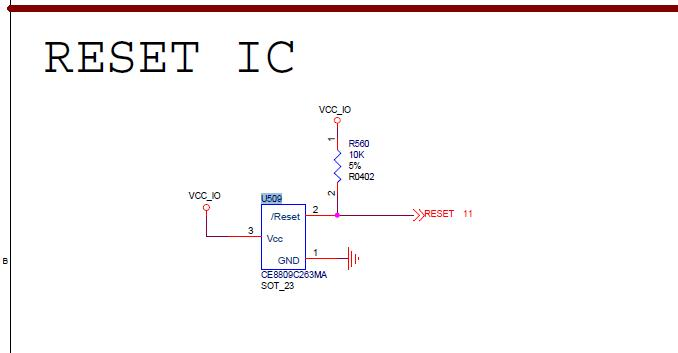

----------------------------
**Rockchip**
# **DDR遇到的问题记录**

发布版本:1.0

日期:2017.10.26

Copyright 2017 @Fuzhou Rockchip Electronics Co., Ltd.

---------
# 前言
**记录所有DDR遇到的问题，不管是哪个平台，用于Q4期间整理成DDR问题排查手册**

------
**产品版本**
| **芯片名称** | **内核版本** |
| -------- | -------- |
| 所有芯片     | 所有内核版本   |

**读者对象**
本文档（本指南）主要适用于以下工程师：
技术支持工程师
软件开发工程师

**修订记录**
| **日期**     | **版本** | **作者** | **修改说明** |
| ---------- | ------ | ------ | -------- |
| 2017.10.26 | V1.0   | HCY    |          |

--------------------
[TOC]
------

#  RK3228B
## 问题：无法恢复出厂设置
#### 关键词：无法恢复出厂设置，OS_REG被清，GRF_OS_REG被清，LPDDR3板子无法恢复出厂设置
#### 现象描述
从菜单点恢复出厂设置，机器重启后，还是正常开机，并没有进入recovery模式。
而且客户这款机器用得是LPDDR3的颗粒才有这个问题，另外一款用DDR3的就没有这个问题。
#### 恢复出厂设置的原理
```mermaid
graph TD
	A[用户通过菜单点恢复出厂设置]-->B[kernel会在OS_REG中<br/>写上recovery的特殊标志]
	B-->C[重启]

	D[启动]-->|kernel启动|E{OS_REG是否有<br/>进入recovery的特殊标志}
	E-->|有|F[进入recovery流程]
	E-->|没有|G[正常启动kernel]
```
其中的OS_REG，不同平台使用的不同。因为有的平台是PMU_OS_REG在reboot后不会被清0.
有的平台没有PMU_OS_REG，有GRF_OS_REG，也是reboot后不会被清0.
而对于3229，使用的是GRF_OS_REG.

另一个，OS_REG一般我们都设计有4个，这4个具体怎么使用的，都是由kernel负责人、loader负责人、DDR负责人一起协商定义好的，而且各个芯片都这样沿用下来。对于此问题，用于进入recovery流程的标志，记录在GRF_OS_REG[0]上。
#### 分析过程
从无法进recovery模式的kernel log可以看到，kernel并没有进入recovery流程，而是走了正常启动kernel的流程。所以，问题一定出在OS_REG的标志上。

可能原因有2个：

一是，reboot前，标志没写入。

二是，reboot后，重启过程中，标志被kernel前的代码改掉了，既然客户说跟DDR有关系，那重点要怀疑DDR初始化代码清掉了OS_REG标志。

查找过程：

步骤1：在kernel reboot前，打印出GRF_OS_REG[0]的值

结果：OS_REG的标志有正常写入

步骤2：kernel一开始打印GRF_OS_REG[0]的值

结果：OS_REG的标志已经变成0
所以，怀疑是在kernel前的流程中被清0了。

步骤3：在uboot一开始打印GRF_OS_REG[0]的值

结果：OS_REG的标志已经变成0

步骤4：检查DDR初始化代码

结果：并没有对GRF_OS_REG[0]操作，更没有根据不同DDR类型来做不同操作。

所以，不可能是DDR代码清了OS_REG标志

步骤5：在DDR一开始打印GRF_OS_REG[0]的值

结果：OS_REG的标志已经变成0

好奇怪，DDR一开始的地方就变成0，说明不是软件清0，是硬件导致的清0

这里就可以排除是板子使用不同DDR导致的了。

步骤6：用可以正常恢复出厂设置的DDR3机器，重复上述过程

结果：DDR3机器GRF_OS_REG[0]的值能一直保持到kernel检查的地方

所以，问题已经可以确认出在2台机器的硬件上的差异，从上面的现象看，能把OS_REG清0，要么是电源掉电了，要么是有RESET信号进来。

最终让硬件测电源和reset信号，找到了原因。

#### 问题原因
REBOOT测试时VCCIO会塌陷到2.5V,而RESET检测VCCIO的阀值为2.63V。所以导致RESET信号有效，从而复位了CPU，最终导致OS_REG的标志没了。再次启动后，就判断不到这个标志，从而进入不了recovery模式。下面是电源塌陷的波形


#### 解决办法
由于塌陷是DC-DC导致的，最好的解决办法是换DC-DC。但是基于客户不换的解决办法是：

将输出端C532更改为22Uf,同时将U509第3PIN加22uF电容,保证VCCIO塌陷不触发reset,功能即正常



----
# RK3328/RK3228H
## 问题：颗粒验证时，烧写失败
#### 关键词：烧写失败，不能启动
#### 现象描述
收集了一批板子，贴了各种型号的DDR颗粒，用于验证。结果发现有3块板子烧写总是失败
#### 分析过程
查找过程：

步骤1：查看烧写失败的串口打印log，看到DDR初始化能正常完成，后面的uboot等代码运行异常了

步骤2：认真查看DDR初始化的log，发现是芯片不匹配的。

步骤3：看过芯片是RK3328的，再看下载选择的loader等，是RK3228H的。

所以导致loader和芯片不匹配，运行会不稳当。要么烧写失败，要么系统启动异常。

步骤4：选择RK3328的loader和其他相应文件。

结果：烧写和运行都正常。

#### 问题原因
一堆板子里，有RK3228H，也有RK3328，下载时，没有根据芯片型号选对loader和其他文件。导致下载失败
#### 解决办法
根据芯片型号，选对loader和其他文件，就能解决

-----
# PX3
## 问题：贴2GB DDR3L，只识别到1GB容量
#### 关键词：容量识别错，容量不对，少了一个CS，少了一个片选
#### 现象描述
客户板子贴了2片512Mx16bit的颗粒，总容量应该是2GB，但开机log看，容量只识别到1GB
#### 分析过程
查找过程：

步骤1：让客户提供DDR3L的datasheet和原理图

步骤2：看到DDR3L是512Mx16bit的，认真对比datasheet和开机log的DDR信息，发现DDR3L是2CS的，而开机log只识别到一个CS


步骤3：因为PX3芯片设计本身有一个局限，就是当颗粒的row数量为16时，这时候CS信号被拿过来当row15信号了，因此row数量为16时，只能支持一个CS。具体见“interconnect”章节的描述。

而512Mx16bit如果不是dual-die，就是16根row信号。

步骤4：认真看了DDR3L的datasheet，确实是dual-die的，不是16跟row信号。所以，导致只识别到一个CS的问题，肯定不是芯片本身的这个局限导致的。

步骤5：查看客户的原理图，发现颗粒板子只有CS0


#### 问题原因
DDR3L是2个CS的颗粒，而客户原理图只连了一个CS0到颗粒。导致容量少了一半。
#### 解决办法
无法解决，除非客户改版

----
## 问题：免拆机loader无法进入测试模式
#### 关键词：无法进入测试模式，无法进入maskrom，免拆机loader，DDR工具测试失败
#### 现象描述
客户板子进入loader模式，再用DDR测试工具测试，会测试失败。

如果直接在maskrom模式下，用DDR测试工具测试，是能成功的。

#### 分析过程
查找过程：

步骤1：因为免拆机的loader是一定版本后才支持的，不知道客户的版本是否支持。所以，先让客户把串口log发过来，我确认了DDR版本，确认这个版本是可以支持的。

步骤2：使用免拆机loader是一定版本的DDR测试工具才能支持的，也跟客户确定了DDR测试工具是最新版本

步骤3：让客户提供他使用的RKPX3Loader_miniall.bin

步骤4：因为DDR测试工具只有3188的，PX3使用的是PX3的测试项，怀疑是不是跟PX3特殊性有关系。找了台PX3机器，用客户正在使用的loader，烧入后，通过按键进入loader模式，用DDR测试工具进行测试。

结果：可以正常进测试模式，并测试成功啊

很奇怪，为什么客户那边的机器就是不行呢

步骤5：让客户发DDR测试工具的log，看到是

```c
15:56:35 126 瑞芯微DDR用户测试工具_20151103 v1.33 start run
15:57:20 081 等待Maskrom失败!
15:58:39 064 等待Maskrom失败!
16:00:55 023 等待Maskrom失败!
```
所以，DDR测试工具根本还没等到maskrom，所以跟DDR测试代码完全没关系，而是跟loader有关系。
步骤6：搞不清楚到底这时候是loader没切换到maskrom，还是切换到maskrom里面异常了
让客户抓串口log，因为PX3如果正常进入maskrom模式，会一直打印
`▒RK310B▒▒RK310B▒▒RK310B`这样的字符串

结果：串口没看到maskrom模式下的字符打印

由此可以断定，设备没有切到maskrom模式

步骤7：跟客户说，在loader下工具的状态栏看到的是，先显示“发现一台设备”，一旦DDR测试工具开始运行，状态栏会变成“没有发现设备”，然后再变回“发现一台设备”，接下来就开始测试了。

结果：从客户提供的视频看到，客户机器一直停留在loader时的“发现一台设备”，都没有断开过。由此可以确	认问题出在loader没有重启上。

步骤8：让赵仪峰来处理这个问题，已经定位到他的问题。

结果：找到原因

#### 问题原因：
用户使用的是miniall的loader，RKPX3Loader_miniall.bin，这种loader有特殊处理：
即这种loader，如果搭配uboot使用，那么当PC工具显示loader状态时，机器上的代码是运行在uboot中。
如果不搭配uboot使用，则PC工具显示loader状态时，机器上的代码是运行在miniloader中。
而这个版本的miniall，其中的miniloader是支持DDR测试工具的切换测试状态，但是客户使用的uboot不支持。

之所以客户不能测试，而我们这边可以测试，是因为我们这边的机器是没有搭配uboot使用，所以看到的loader状态，此时是由miniloader负责切换到测试模式。而客户是有uboot的，所以客户看到的loader状态，是uboot负责切换测试模式，而这刚好是当前版本的uboot没有支持的。
```mermaid
graph TD
	A[启动或重启后]-->|进loader模式|B[miniloader运行]
	B-->C{检查是否有uboot}
	C-->|客户机器有|D[运行uboot代码]
	C-->|我们机器没有|E[还是在miniloader代码中]
	D-->F[PC上的DDR测试工具]
	E-->F
```
#### 解决办法：
参考RK3128平台，在uboot中增加切换测试模式的支持