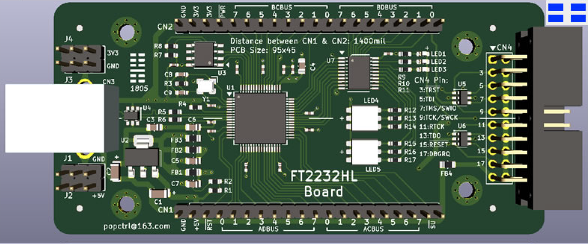
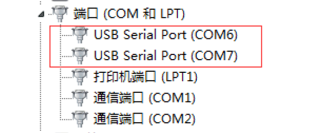
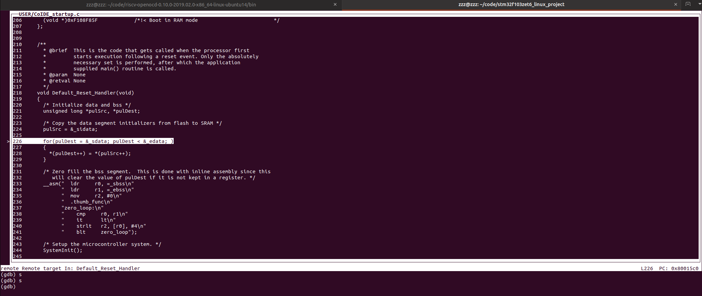

# OpenOCD使用指南

发布版本：1.0

作者邮箱：jason.zhu@rock-chips.com

日期：2019.06

文件密级：内部资料

------

**前言**

**概述**

OpenOCD使用指南。

**读者对象**

本文档（本指南）主要适用于以下工程师：

技术支持工程师

软件开发工程师

**产品版本**

**修订记录**

| **日期**   | **版本** | **作者**  | **修改说明** |
| ---------- | -------- | --------- | ------------ |
| 2019-06-04 | V1.0     | Jason Zhu | 初始版本     |

------

[TOC]

------

## 1 引用参考

[1] <https://blog.csdn.net/zhengyangliu123/article/details/54934719>

[2] [《Open On-Chip Debugger: OpenOCD User’s Guide》](http://openocd.org/documentation/)

## 2 术语

OpenOCD：OpenOCD是一个用于JTAG调试的软件，可以用于不同调试器和CPU，还可以与GDB配合，开源。

FT2232HL：FTDI生产的芯片，它可以实现USB到两个串行UART、FIFO、Bit-Bang IO接口，并且还可以配成MPSSE，I2C，JTAG及SPI总线。

J-Link：SEGGER公司为支持仿真ARM内核芯片推出的JTAG仿真器。

GDB：[The GNU Project Debugger](http://www.gnu.org/software/gdb/)，GNU开源组织发布的一个强大的UNIX下的程序调试工具。

## 3 测试平台

STM32F103开发板

FT2232HL仿真器



J-Link仿真器

## 4 简介

本文介绍如何通过OpenOCD调试开发板，仿真器包括FT2232HL仿真器与J-Link。

## 5 驱动安装

### 5.1 FT2232HL Windows驱动安装

1. FT2232HL调试板与电脑连接，会显示如下两个串口：



如果未出现可以[FTDI](https://www.ftdichip.com/)官网下载对应驱动。

2. 安装FT_Prog.exe并运行：


如上选择后，下载固件到FT2232HL调试板。

3. 运行UsbDriverTool.exe（可以网上下载）：


选择USB Serial Converter B，双击会弹出如下显示框：


安装WinUSB驱动。

### 5.2 FT2232HL Linux驱动安装

新建文件99-openocd.rules，写入如下内容：

```
SUBSYSTEM=="tty", ATTRS{idVendor}=="0403",ATTRS{idProduct}=="6010", MODE="664", GROUP="plugdev"
SUBSYSTEM=="tty", ATTRS{idVendor}=="15ba",ATTRS{idProduct}=="002a", MODE="664", GROUP="plugdev"
SUBSYSTEM=="usb", ATTR{idVendor}=="0403",ATTR{idProduct}=="6010", MODE="664", GROUP="plugdev"
SUBSYSTEM=="usb", ATTR{idVendor}=="15ba",ATTR{idProduct}=="002a", MODE="664", GROUP="plugdev"
```

把该文件拷贝到/etc/udev/rules.d/目录下。

## 6 FT2232HL Windows调试

在PowerShell下输入：

```
openocd -f ftdi.cfg -f stm32f1x.cfg -c "halt" -c "flash write_image erase u-boot.bin 0x08000000 bin" -c "reset"
```

log如下：


表示能够正常连接设备。

## 7 FT2232HL Linux调试

### 7.1 程序下载

在shell输入：

```
openocd -f ftdi.cfg -f stm32f1x.cfg -c init -c "halt"  -c "flash write_image erase u-boot.bin 0x08000000 bin" -c "reset"
```

log如下：


### 7.2 结合telnet调试

在shell内输入：

```
=> openocd -f ftdi.cfg -f stm32f1x.cfg
Open On-Chip Debugger 0.10.0+dev-g672ef66-dirty (2019-03-06-06:00)
Licensed under GNU GPL v2
For bug reports, read
	http://openocd.org/doc/doxygen/bugs.html
adapter speed: 1000 kHz
adapter speed: 1000 kHz
adapter_nsrst_delay: 100
jtag_ntrst_delay: 100
none separate
cortex_m reset_config sysresetreq
Info : Listening on port 6666 for tcl connections
Info : Listening on port 4444 for telnet connections
Info : clock speed 1000 kHz
Info : JTAG tap: stm32f1x.cpu tap/device found: 0x3ba00477 (mfg: 0x23b (ARM Ltd.), part: 0xba00, ver: 0x3)
Info : JTAG tap: stm32f1x.bs tap/device found: 0x06414041 (mfg: 0x020 (STMicroelectronics), part: 0x6414, ver: 0x0)
Info : stm32f1x.cpu: hardware has 6 breakpoints, 4 watchpoints
Info : Listening on port 3333 for gdb connections
Info : accepting 'telnet' connection on tcp/4444
```

在另一个shell输入：

```
=> telnet localhost 4444
Trying 127.0.0.1...
Connected to localhost.
Escape character is '^]'.
Open On-Chip Debugger
>
```

输入help，可以查看支持命令帮助：

```
> help
adapter
      adapter command group (command valid any time)
  adapter usb
        usb adapter command group (command valid any time)
    adapter usb location <bus>-port[.port]...
          set the USB bus location of the USB device (configuration
          command)
adapter_khz [khz]
      With an argument, change to the specified maximum jtag speed.  For
      JTAG, 0 KHz signifies adaptive  clocking. With or without argument,
      display current setting. (command valid any time)
adapter_name
      Returns the name of the currently selected adapter (driver) (command
      valid any time)
adapter_nsrst_assert_width [milliseconds]
      delay after asserting SRST in ms (command valid any time)
adapter_nsrst_delay [milliseconds]
      delay after deasserting SRST in ms (command valid any time)
add_help_text command_name helptext_string
      Add new command help text; Command can be multiple tokens. (command
      valid any time)
add_script_search_dir <directory>
      dir to search for config files and scripts (command valid any time)
add_usage_text command_name usage_string
      Add new command usage text; command can be multiple tokens. (command
      valid any time)
```

### 7.3 结合gdb调试程序

在shell内输入：

```
=> openocd -f ftdi.cfg -f stm32f1x.cfg
Open On-Chip Debugger 0.10.0+dev-g672ef66-dirty (2019-03-06-06:00)
Licensed under GNU GPL v2
For bug reports, read
	http://openocd.org/doc/doxygen/bugs.html
adapter speed: 1000 kHz
adapter speed: 1000 kHz
adapter_nsrst_delay: 100
jtag_ntrst_delay: 100
none separate
cortex_m reset_config sysresetreq
Info : Listening on port 6666 for tcl connections
Info : Listening on port 4444 for telnet connections
Info : clock speed 1000 kHz
Info : JTAG tap: stm32f1x.cpu tap/device found: 0x3ba00477 (mfg: 0x23b (ARM Ltd.), part: 0xba00, ver: 0x3)
Info : JTAG tap: stm32f1x.bs tap/device found: 0x06414041 (mfg: 0x020 (STMicroelectronics), part: 0x6414, ver: 0x0)
Info : stm32f1x.cpu: hardware has 6 breakpoints, 4 watchpoints
Info : Listening on port 3333 for gdb connections
Info : accepting 'telnet' connection on tcp/4444
```

在另一个shell输入：

```
=> arm-none-eabi-gdb LED_project.elf
GNU gdb (Linaro GDB 2017.01) 7.12.1.20170126-git
Copyright (C) 2017 Free Software Foundation, Inc.
License GPLv3+: GNU GPL version 3 or later <http://gnu.org/licenses/gpl.html>
This is free software: you are free to change and redistribute it.
There is NO WARRANTY, to the extent permitted by law.  Type "show copying"
and "show warranty" for details.
This GDB was configured as "--host=x86_64-unknown-linux-gnu --target=arm-none-eabi".
Type "show configuration" for configuration details.
For bug reporting instructions, please see:
<http://www.gnu.org/software/gdb/bugs/>.
Find the GDB manual and other documentation resources online at:
<http://www.gnu.org/software/gdb/documentation/>.
For help, type "help".
Type "apropos word" to search for commands related to "word"...
Reading symbols from LED_project.elf...done.
(gdb)
```

输入target remote localhost:3333：

```
(gdb) target remote localhost:3333
Remote debugging using localhost:3333
0x00554e46 in ?? ()
(gdb)
```

下载程序：

```
(gdb) monitor reset
JTAG tap: stm32f1x.cpu tap/device found: 0x3ba00477 (mfg: 0x23b (ARM Ltd.), part: 0xba00, ver: 0x3)
JTAG tap: stm32f1x.bs tap/device found: 0x06414041 (mfg: 0x020 (STMicroelectronics), part: 0x6414, ver: 0x0)
stm32f1x.cpu -- clearing lockup after double fault
target halted due to debug-request, current mode: Handler HardFault
xPSR: 0x01000003 pc: 0x00554e46 msp: 0xffffffe4
Polling target stm32f1x.cpu failed, trying to reexamine
stm32f1x.cpu: hardware has 6 breakpoints, 4 watchpoints
(gdb) monitor halt
(gdb) load
Loading section .note.gnu.build-id, size 0x24 lma 0x8000000
Loading section .isr_vector, size 0x134 lma 0x8000024
Loading section .text, size 0x14c8 lma 0x8000158
Loading section .init_array, size 0x4 lma 0x8001620
Loading section .fini_array, size 0x4 lma 0x8001624
Loading section .data, size 0x28 lma 0x8001628
Loading section .co_stack, size 0x400 lma 0x8001650
Start address 0x80015a0, load size 6736
Transfer rate: 4 KB/sec, 962 bytes/write.
(gdb)
```

gdb调试：

```
(gdb) c
Continuing.
Program received signal SIGINT, Interrupt.
0x080015b2 in Default_Reset_Handler () at USER/CoIDE_startup.c:228
228	    *(pulDest++) = *(pulSrc++);
(gdb) s
226	  for(pulDest = &_sdata; pulDest < &_edata; )
(gdb)
```

另一个shell的打印：

```
Open On-Chip Debugger 0.10.0+dev-g672ef66-dirty (2019-03-06-06:00)
Licensed under GNU GPL v2
For bug reports, read
	http://openocd.org/doc/doxygen/bugs.html
adapter speed: 1000 kHz
adapter speed: 1000 kHz
adapter_nsrst_delay: 100
jtag_ntrst_delay: 100
none separate
cortex_m reset_config sysresetreq
Info : Listening on port 6666 for tcl connections
Info : Listening on port 4444 for telnet connections
Info : clock speed 1000 kHz
Info : JTAG tap: stm32f1x.cpu tap/device found: 0x3ba00477 (mfg: 0x23b (ARM Ltd.), part: 0xba00, ver: 0x3)
Info : JTAG tap: stm32f1x.bs tap/device found: 0x06414041 (mfg: 0x020 (STMicroelectronics), part: 0x6414, ver: 0x0)
Info : stm32f1x.cpu: hardware has 6 breakpoints, 4 watchpoints
Error: stm32f1x.cpu -- clearing lockup after double fault
Polling target stm32f1x.cpu failed, trying to reexamine
Info : stm32f1x.cpu: hardware has 6 breakpoints, 4 watchpoints
Info : Listening on port 3333 for gdb connections
Info : accepting 'gdb' connection on tcp/3333
Info : device id = 0x10036414
Info : flash size = 512kbytes
Error: JTAG-DP STICKY ERROR
Error: Failed to read memory at 0x00554e48
Error: JTAG-DP STICKY ERROR
Error: Failed to read memory at 0x00554e48
Info : JTAG tap: stm32f1x.cpu tap/device found: 0x3ba00477 (mfg: 0x23b (ARM Ltd.), part: 0xba00, ver: 0x3)
Info : JTAG tap: stm32f1x.bs tap/device found: 0x06414041 (mfg: 0x020 (STMicroelectronics), part: 0x6414, ver: 0x0)
Error: stm32f1x.cpu -- clearing lockup after double fault
target halted due to debug-request, current mode: Handler HardFault
xPSR: 0x01000003 pc: 0x00554e46 msp: 0xffffffe4
Polling target stm32f1x.cpu failed, trying to reexamine
Info : stm32f1x.cpu: hardware has 6 breakpoints, 4 watchpoints
Info : JTAG tap: stm32f1x.cpu tap/device found: 0x3ba00477 (mfg: 0x23b (ARM Ltd.), part: 0xba00, ver: 0x3)
Info : JTAG tap: stm32f1x.bs tap/device found: 0x06414041 (mfg: 0x020 (STMicroelectronics), part: 0x6414, ver: 0x0)
target halted due to debug-request, current mode: Handler HardFault
xPSR: 0x01000003 pc: 0x00554e46 msp: 0xffffffe4
Info : JTAG tap: stm32f1x.cpu tap/device found: 0x3ba00477 (mfg: 0x23b (ARM Ltd.), part: 0xba00, ver: 0x3)
Info : JTAG tap: stm32f1x.bs tap/device found: 0x06414041 (mfg: 0x020 (STMicroelectronics), part: 0x6414, ver: 0x0)
target halted due to debug-request, current mode: Thread
xPSR: 0x61000000 pc: 0x2000003a msp: 0xffffffe4
```

效果：



## 8 J-Link支持

Linux shell输入：

```
openocd -f jlink.cfg -f stm32f1x.cfg -c init -c "halt"  -c "flash write_image erase u-boot.bin 0x08000000 bin" -c "reset"
```

log如下：


其他命令操作同章节7 FT2232HL Linux调试。

## 9 OpenOCD命令

shell下输入openocd --help，查看支持的命令，log如下：

```
Open On-Chip Debugger 0.10.0+dev-g672ef66-dirty (2019-03-06-06:00)
Licensed under GNU GPL v2
For bug reports, read
	http://openocd.org/doc/doxygen/bugs.html
Open On-Chip Debugger
Licensed under GNU GPL v2
--help       | -h	display this help
--version    | -v	display OpenOCD version
--file       | -f	use configuration file <name>
--search     | -s	dir to search for config files and scripts
--debug      | -d	set debug level to 3
             | -d<n>	set debug level to <level>
--log_output | -l	redirect log output to file <name>
--command    | -c	run <command>
```

1. -h

查看OpenOCD的命令帮助。

2. -v

查看OpenOCD的版本，例：

```
=> openocd -v
Open On-Chip Debugger 0.10.0+dev-g672ef66-dirty (2019-03-06-06:00)
Licensed under GNU GPL v2
For bug reports, read
	http://openocd.org/doc/doxygen/bugs.html
```

3. -f

后面跟随配置文件，可以用于探测是否有板子连接，例：

连接测试板log：


未连接测试板log：


4. -d

设置调试级别。

5. -l

后面跟随log输出文件。

6. -c

跟随命令，例：

```
openocd -f jlink.cfg -f stm32f1x.cfg -c init -c "halt"  -c "flash write_image erase u-boot.bin 0x08000000 bin" -c "reset"
```

## 10 eclips支持

to-do

## 11 Rockchip芯片支持

to-do
