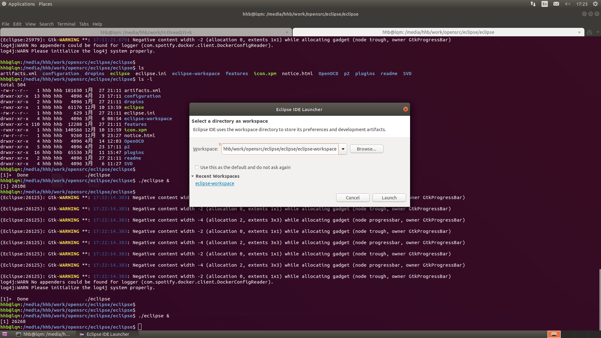
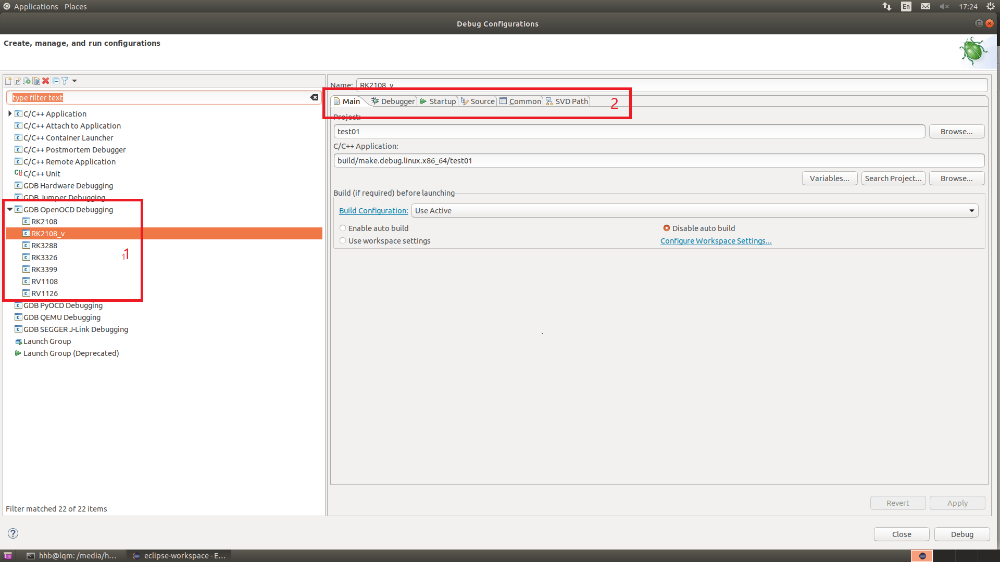
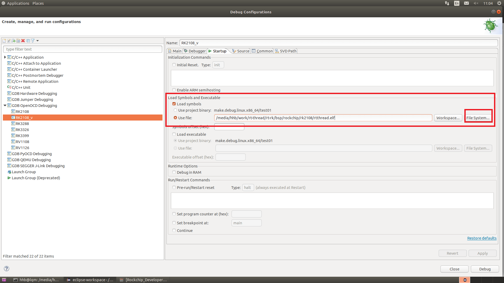
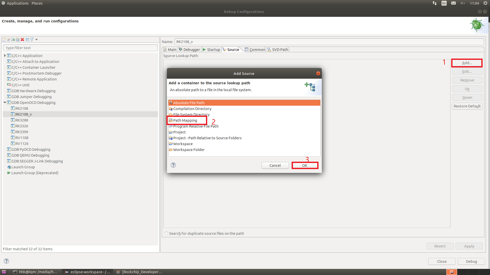
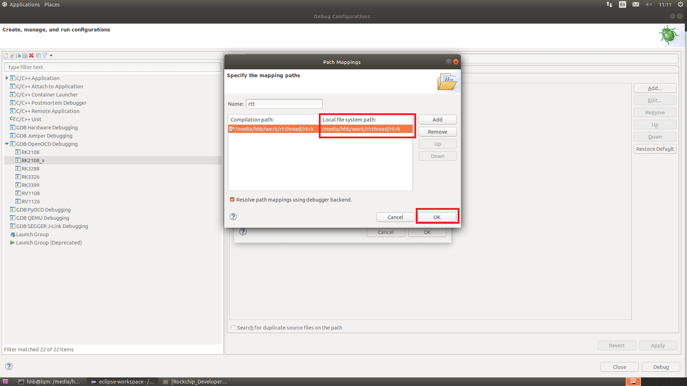
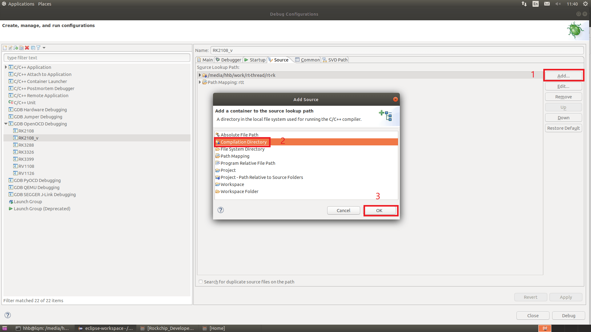
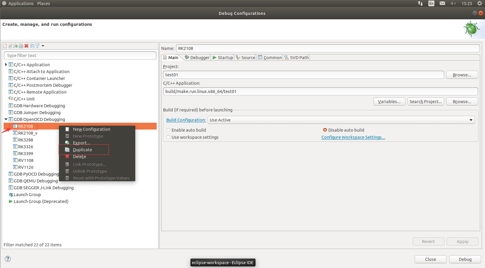
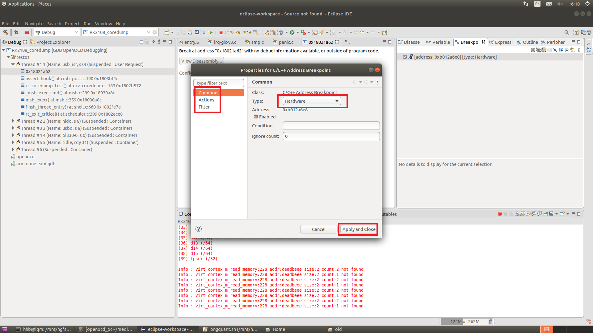
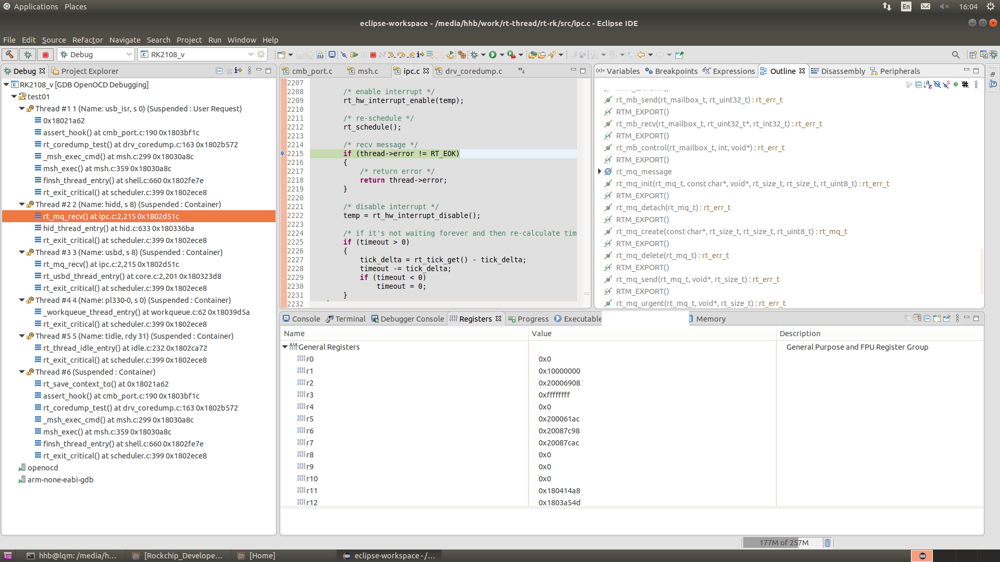
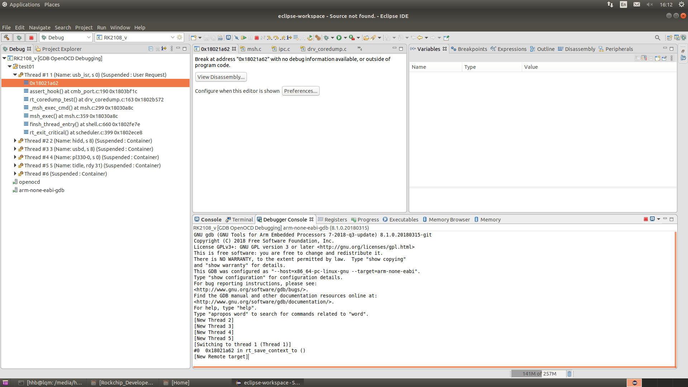

# GNU MCU Eclipse OpenOCD

文件标识：RK-KF-YF-91

发布版本：V1.0.0

日期：2020-04-21

文件密级：□绝密   □秘密   □内部资料   ■公开

---

**免责声明**

本文档按“现状”提供，福州瑞芯微电子股份有限公司（“本公司”，下同）不对本文档的任何陈述、信息和内容的准确性、可靠性、完整性、适销性、特定目的性和非侵权性提供任何明示或暗示的声明或保证。本文档仅作为使用指导的参考。

由于产品版本升级或其他原因，本文档将可能在未经任何通知的情况下，不定期进行更新或修改。

**商标声明**

“Rockchip”、“瑞芯微”、“瑞芯”均为本公司的注册商标，归本公司所有。

本文档可能提及的其他所有注册商标或商标，由其各自拥有者所有。

**版权所有** **© 2019** **福州瑞芯微电子股份有限公司**

超越合理使用范畴，非经本公司书面许可，任何单位和个人不得擅自摘抄、复制本文档内容的部分或全部，并不得以任何形式传播。

福州瑞芯微电子股份有限公司

Fuzhou Rockchip Electronics Co., Ltd.

地址：     福建省福州市铜盘路软件园A区18号

网址：     [www.rock-chips.com](http://www.rock-chips.com)

客户服务电话： +86-4007-700-590

客户服务传真： +86-591-83951833

客户服务邮箱： [fae@rock-chips.com](mailto:fae@rock-chips.com)

---

**前言**

**概述**

本文主要介绍 GNU MCU Eclipse OpenOCD调试方面的功能。

**产品版本**

| **芯片名称** | **内核版本** |
| ------------ | ------------ |
|      all      |              |

**读者对象**

本文档（本指南）主要适用于以下工程师：

技术支持工程师
软件开发工程师

**修订记录**

| **版本号** | **作者** | **修改日期** | **修改说明** |
| ---------- | --------| :--------- | ------------ |
| V1.0.0    | 洪慧斌 | 2020-04-21 | 初始版本     |

**目录**

---
[TOC]
---

## 1 说明

调试结构：Eclipse CDT+GNU MCU Eclipse OpenOCD+Eclipse+GDB+OpenOCD+ftdi/jlink+SOC

* Eclipse CDT (C/C++ Development Tooling)  C/C++ 开发工具

* GNU MCU Eclipse OpenOCD 是一个开源插件，主要完成CDT和GDB、OpenOCD的交互

* Eclipse 是一个很强大的工具，可以集成各种插件，ARM DS-5也是基于它

* GDB  GNU调试器

* OpenOCD 是一个开源的调试软件，可以适配各种JTAG/SWD适配器，支持ARM，RISCV等架构

* ftdi  采用ft2232h，USB转JTAG/SWD芯片，可以作为JTAG/SWD适配器，速度快，稳定性高

## 2 操作系统环境

### 2.1 Ubuntu 64位

#### 2.2.1 在Ubuntu 16.04和Ubuntu 18.04测试正常，需要安装如下软件。

* 运行eclipse，需要安装JRE。

```
sudo add-apt-repository ppa:openjdk-r/ppa
sudo apt-get update
sudo apt-get install openjdk-8-jre  这里不一定要8
```

* 运行openocd需要libusb。

```
sudo apt-get install libusb-1.0-0-dev
sudo apt-get install libftdi-dev
```

* 安装arm gcc编译工具，如果本地有arm gdb工具可以跳过这一步。

```
sudo add-apt-repository ppa:team-gcc-arm-embedded/ppa
sudo apt-get update
sudo apt-get install gcc-arm-embedded
```

## 3 调试功能

不管是Ubuntu还是Windows，UI界面基本一致，本文介绍以Ubuntu为主。

### 3.1 解压Rockchip提供的eclipse软件包eclipse.tar.gz

```
tar -xzvf eclipse.tar.gz
```

进入eclipse目录：

* eclipse   执行该文件，打开eclipse软件
* eclipse-workspace  工作目录，第一次打开eclipse需要把工作目录设到该文件夹
* OpenOCD  openocd 芯片配置文件
* SVD  （CMSIS System View Description format）主要用来查看芯片寄存器

### 3.2 启动eclipse软件

```
./eclipse &
```

设置work space，要选择eclipse目录下的eclipse-workspace。



进入主界面


### 3.3 GNU MCU Eclipse OpenOCD

* 点击下图绿色瓢虫右边的三角按钮，点击Debug Configurations。


* 下图区域1是每个芯片对应debug 配置的名称，区域2是每个芯片对应功能的配置。



* Main菜单

默认。

* Debugger菜单

1的路径会随着eclipse.tar.gz的解压路径变化，但是2的路径只能用绝对路径（无法用环境变量或者相对路径），所以需要把1的路径拷贝并覆盖2的路径。3是指定gdb的路径，这里需要注意对于ARM32位，要用32位的gdb，对于ARM64，要用64位的gdb。


* Startup菜单
  Startup包含各种配置，本小节主要介绍加载符号表，如下红色框，点击File System按钮选择对应的elf，vmlinux等文件。



* Source菜单
  本小结主要介绍增加代码路径，如果本地代码路径和elf里的代码路径一致不需要配置。
  1、路径映射
请按下图，1、2、3顺序选择。



选择符号表里的代码路径，这个需要手动填写。


选择本地代码路径，对话框最右侧有个小按钮（如上图），点进去选择本地路径。



2、配置本地代码路径

请按下图，1、2、3顺序选择。




* SVD Path菜单

配置SVD文件，调试时可以查看core相关寄存器，或者外设寄存器。


* 最后一步，如上图右下角，点击Apply 保存配置，点击Debug开始调试。

注意：如果需要添加芯片，可以右击左侧配置名，点击Duplicate，复制一份芯片配置，并在此基础上修改。



### 3.4 Eclipse CDT (C/C++ Development Tooling)


以上就是CDT的debug界面：

区域1的小甲壳虫右边，单击，可以选择要调试的芯片，然后连接芯片，进入调试模式。

区域2：

* Variables  函数的局部变量。


* Breakpoints 设置断点。



* Expressions 表达式，主要看全局变量。


* Outline  会显示已打开源代码的函数名，宏定义等。



* Disassembly 反汇编。


区域3：

* Console 输出OpenOCD运行时的log，可以判断OpenOCD连接是否正常。


* Terminal 终端，可以用来执行OpenOCD命令，有些命令UI是没办法做的。


* Debugger Console  GDB命令行。



* Registers CPU寄存器。


* Memory Browser 查看内存。


* 串口终端

点击1按钮，会弹出2对话框。


### 3.5 OpenOCD使用说明，请参考：《Rockchip_Developer_Guide_OpenOCD_CN.md》。

