# RK3399 VOP 性能和带宽分析报告

文件标识：RK-KF-YF-125

发布版本：V1.0.0

日期：2020-8-18

文件密级：□绝密   □秘密   ■内部资料   □公开

---

**免责声明**

本文档按“现状”提供，瑞芯微电子股份有限公司（“本公司”，下同）不对本文档的任何陈述、信息和内容的准确性、可靠性、完整性、适销性、特定目的性和非侵权性提供任何明示或暗示的声明或保证。本文档仅作为使用指导的参考。

由于产品版本升级或其他原因，本文档将可能在未经任何通知的情况下，不定期进行更新或修改。

**商标声明**

“Rockchip”、“瑞芯微”、“瑞芯”均为本公司的注册商标，归本公司所有。

本文档可能提及的其他所有注册商标或商标，由其各自拥有者所有。

**版权所有© 2020瑞芯微电子股份有限公司**

超越合理使用范畴，非经本公司书面许可，任何单位和个人不得擅自摘抄、复制本文档内容的部分或全部，并不得以任何形式传播。

瑞芯微电子股份有限公司

Rockchip Electronics Co., Ltd.

地址：     福建省福州市铜盘路软件园A区18号

网址：     [www.rock-chips.com](http://www.rock-chips.com)

客户服务电话： +86-4007-700-590

客户服务传真： +86-591-83951833

客户服务邮箱： [fae@rock-chips.com](mailto:fae@rock-chips.com)

---

**前言**

**概述**

**读者对象**

本文档（本指南）主要适用于以下工程师：

Rockchip 图形/显示模块开发工程师

**修订记录**

| **版本** | **作者** | **日期**   | **修改说明** |
| --------- | --------- | ---------- | -------------- |
| V1.0.0 | 黄家钗 | 2020-08-27 | 初始版本 |
|  |  |  |  |

---

[TOC]

---

## 实验目的

针对 Rockchip 平台频繁出现的显示闪屏、带宽不够问题，根据 VOP 不同的场景配置结合示波器测试 DDR DQS 信号，分析 VOP 访问总线的行为，目的是为了找到导致目前问题的原因和瓶颈，为将来 IP 的设计提供好的方案。

## 实验人员

总工办：张崇松

底层平台中心：何灿阳、黄家钗

## 测试环境

### 硬件环境

示波器：Agilent Technologies MSO9254A 2.5 GHzz，探头：1131A 3.5GHz

EVB 板： RK_IND_EVB_RK3399_LP4D200P232SD8_V12_20200109YWQ

DDR 型号：LPDDR4

### 软件环境

软件版本：Android 10.0、Linux 4.19 kernel

固件备份：[RK3399 Android 10.0 IND](\\10.10.10.164\Q_Repository\RK3399\MID\firmware\rk3399-evb-ind\RK3399 VOP Performance And Bandwidth Analysis)

Android 属性配置：

| 属性                                         | 功能                          |
| -------------------------------------------- | ----------------------------- |
| vendor.hwc.device.main=HDMI-A                | 设置 HDMI 为主显示            |
| vendor.hwc.compose_policy=0                  | 关闭 hwc， 保证只使用一个图层 |
| persist.vendor.framebuffer.main=3840x2160@60 | 设置 4k UI                    |
| vendor.gralloc.disable_afbc=1                | 默认关闭 AFBC                 |

### 测试点

DDR channel 0 DQS --> 示波器蓝色线：

DDR channel 1 DQS --> 示波器绿色线:

VOP DEN --> 示波器黄色线；


## 相关概念说明

以 RK3399  LPDDR4 平台为例说明：

- VOP burst：总线带宽128 bit，所以一个 aclk cycle 访问128 bit 数据， VOP 默认配置为burst 16，所以一个 burst 16 为 128 bit x 16 / 8bit = 256 Byte；
- VOP gather：打开 gather 后让 VOP 尽量多的发出连续 burst 访问，比如 gather8， 在不考虑总线带宽和 VOP 处理性能的情况下 VOP 一次发出 256 Byte x 8 = 2048 Byte 的访问请求；

- VOP max outstanding:  VOP 连续发出的 DMA 请求的数量，即在前面一个 DMA 请求回来前最大可以发出多少个访问请求；
- DDR burst：每一个 DDR clk 访问 32 bit x 2(DDR) /  8 bit = 8 Byte, LPDDR4 默认 burst 16，所以一个 DDR burst8 为 8 x 8 = 128 Byte；
- DDR stride： 两个 DDR 通道，以多大 Byte 单位相互交织在一起，默认为 256 Byte (即每隔 256 Byte 交换一次 DDR 通道)，还可以配置为 512 Byte, 4096 Byte 等。

## 实验过程

### 实验一：VOP gather 效果验证

#### 相关配置

- DDR 频率：856 MHz
- VOP ACLK：400 MHz
- 输出分辨率：3840x2160@60

#### 不同配置下的信号图

##### 3840x2160@ARGB

1. 关闭 gather 的信号

   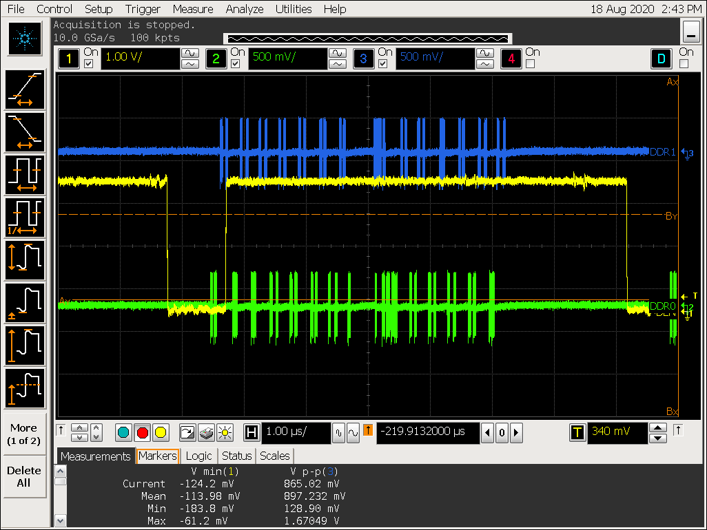

2. 打开 gather 配置 win0_yrgb_axi_gather_num = 1，即 gather 2

   

3. 打开 gather 配置 win0_yrgb_axi_gather_num = 2，即 gather 4

   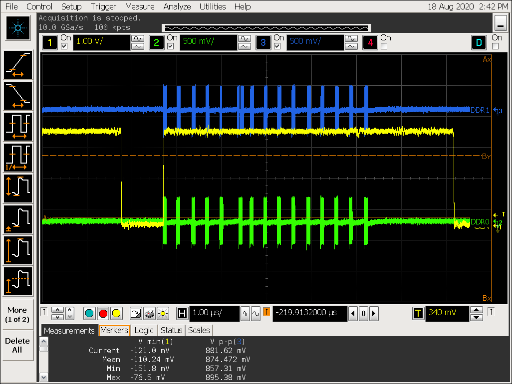

4. 打开 gather 配置 win0_yrgb_axi_gather_num = 3，即 gather 8

   

5. 打开 gather 配置 win0_yrgb_axi_gather_num = 4，即 gather 16

   

##### 3840x2160@YUV420SP_10bit

为了确保 Android 显示框架能将4k yuv 数据overlay 给 VOP 显示，需要打开 hwc 模块，配置属性：

```
setprop vendor.hwc.compose_policy 6
```

1. 关闭 gather 的信号

   

2. 打开 gather 配置 win0_yrgb_axi_gather_num = 1，win0_cbr_axi_gather_num = 1，即 gather 2；

   

3. 打开 gather 配置 win0_yrgb_axi_gather_num = 2，win0_cbr_axi_gather_num = 2，即 gather 4；

   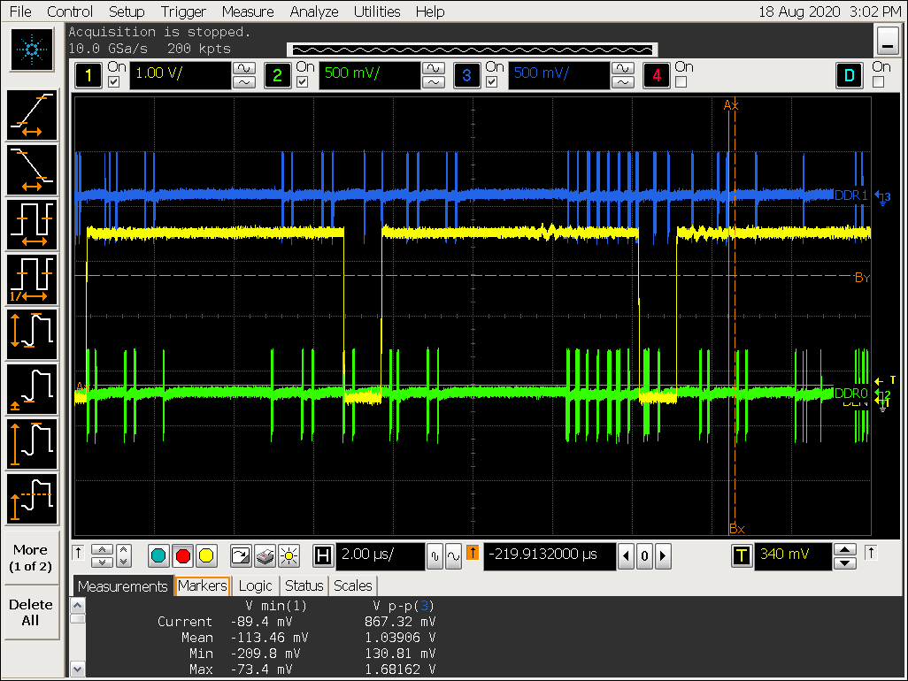

4. 打开 gather 配置 win0_yrgb_axi_gather_num = 3，win0_cbr_axi_gather_num = 3，即 gather 8；

   

5. 打开 gather 配置 win0_yrgb_axi_gather_num = 4，win0_cbr_axi_gather_num = 4，即 gather 16

   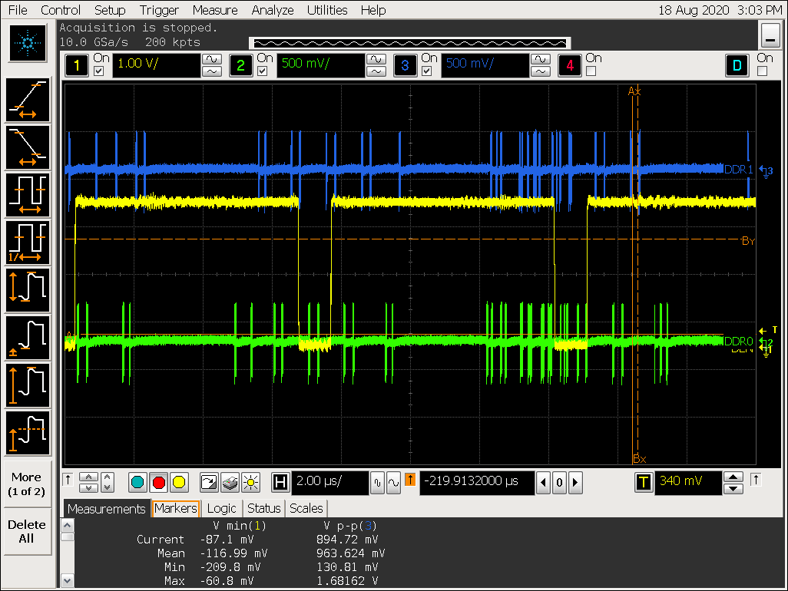

#### 实验一结论

1. ARGB8888 格式最大可以支持 gather 8，打开 gather 后可以看到对 DDR 的访问明显更集中，但 VOP超过 gather 8 的配置会导致 gather 效果被关闭；
2. YUV420SP 开不开 gather 区别不大；

### 实验二：max outstanding 验证

#### 目的

结合 DDR stride 和 VOP gather 的配置，分析 VOP outstanding 的大小；

#### 相关配置

- DDR 频率：856 MHz，默认 stride：256 Byte

- VOP ACLK：400 MHz、位宽：128 bit

- 输出分辨率：3840x2160@60

- VOP 打开 win3，数据大小和格式：3840x2160@ARGB8888

- VOP burst 16、enable gather 8、 max outstanding 30

#### 信号图

##### VOP 扫描一行访问行为


##### DDR channel 0 DQS 连续 burst 访问

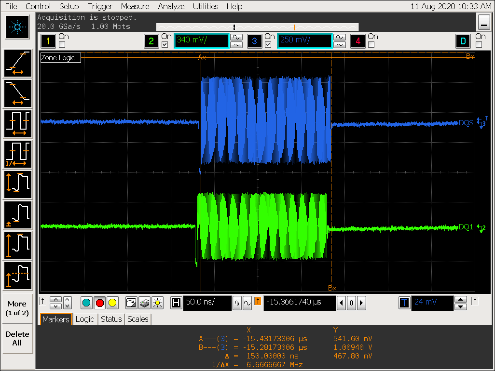

#### 数据分析

1. 理论数据量

DDR 带宽：856 MHz x 32 bit x 2(DDR) x 2 channel / 8 bit = 13,696 MBps

VOP AXI 总线带宽：128 bit x 400 MHz / 8bit = 6400 MBps

VOP gather 8 数据量：128 bit x 16 (burst 16) x 8 (gather 8) / 8 bit = 2048 Byte

VOP 扫描一行数据量：3840 pixel x 4 Byte = 15,360 Byte

2. 实测数据量

根据以上图片可以看到 DDR 连续 burst 时间为：150 ns，即150ns / ( 1000 / 856) = 128 cycle，对应数据量：128 x 32 x 2(DDR) x 2 channel / 8 bit = 2048 Byte;

VOP 一个 burst 访问的数据量为：128 bit x 16 (burst 16) / 8 bit= 256 Byte

(DDR 连续 burst 数据量) /  (VOP 一个 burst 数据量) = 2048 Byte / 256 Byte = 8，符合 gather 8 的配置预期；

#### 降低VOP ACLK 后的信号

1. VOP ACLK 默认为 400M

   

2. VOP ACLK 降低到 300M

   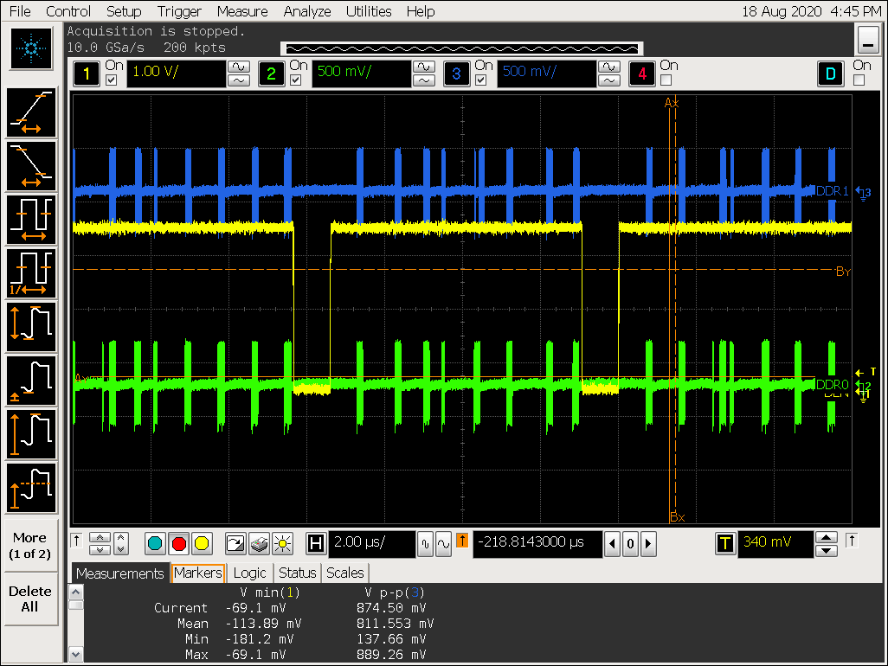

3. VOP ACLK 降低到 200M

   

   第一个连续 burst 访问图放大：

   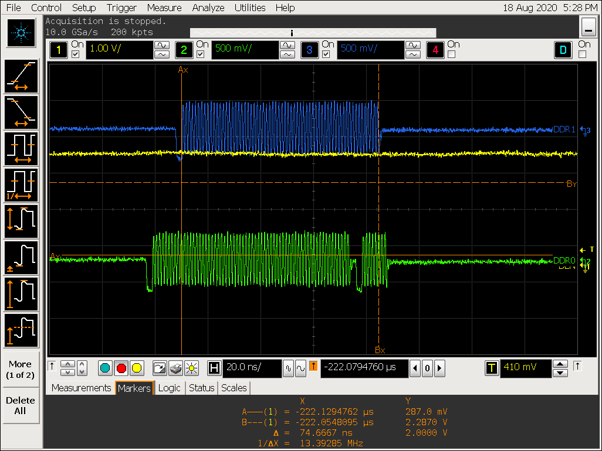

4. VOP ACLK 降低到 100M

   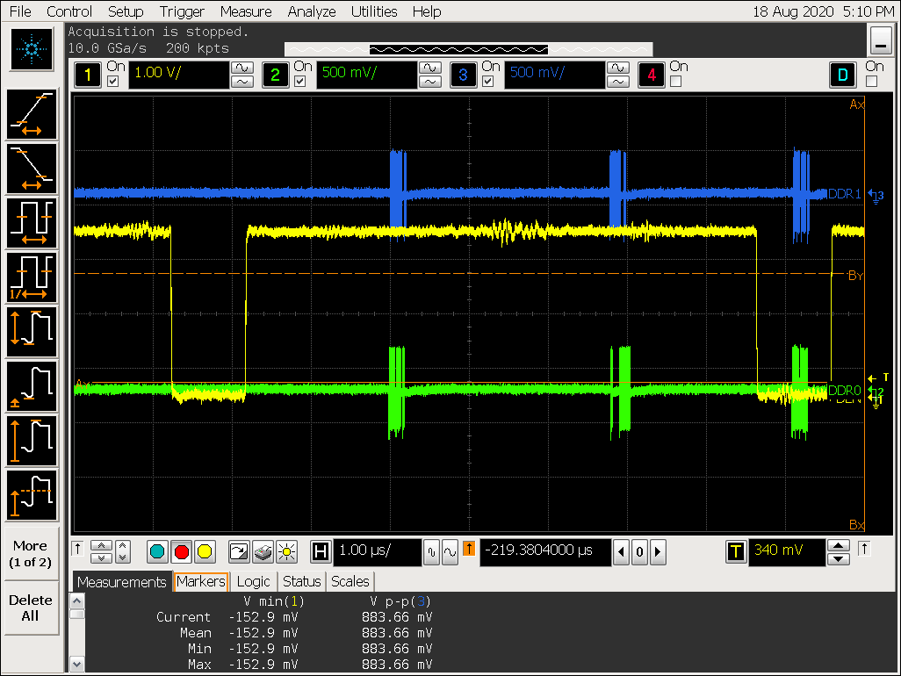

第一个连续 burst 访问图放大：

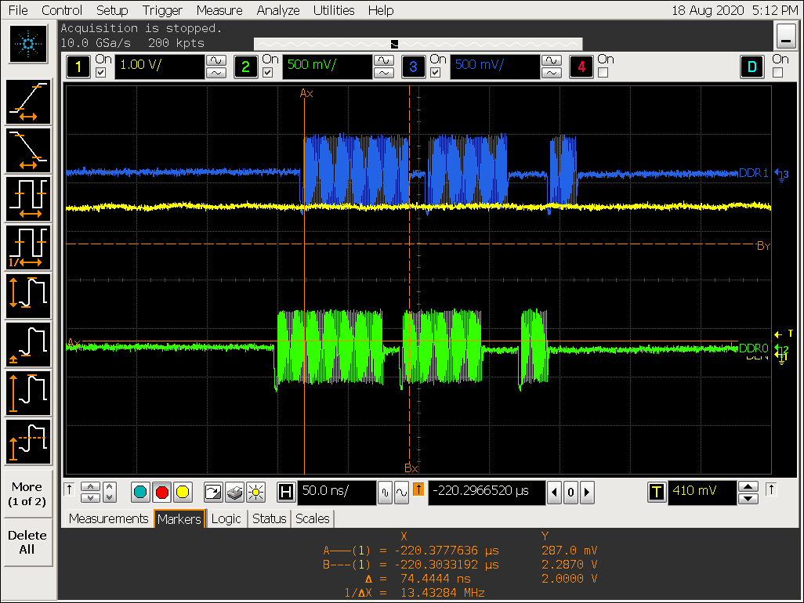

#### 实验二结论

1. 从以上图片可以看到随着 ACLK 降低，VOP 取数的时间延长；

2. 理论上 VOP ACLK 200M 可以提供的数据量为：200M x 128 bit / 8 = 3200M, VOP 4k ARGB 数据需要的带宽为 1898M，所以理论上 200M 的 aclk 是足够的，但实际测试看 ACLK 为 200M 的时候出现闪屏带宽不足的异常现象；

3. VOP ACLK 降低到 200M 后，DDR 连续burst 从128 cycle 降低到 64 cycle；

4. 和 IC 部同事进一步确认得知：VOP 从 AXI 总线取到的数据需要通过内部处理逻辑后再放到 linebuffer，受限于VOP 内部处理速度, 无法做到总线提供多少数据 VOP 就接收多少数据；

#### 下一代 VOP 设计

1. RK3566 VOP Cluster 图层前级有加入 linebuffer，这样可以集中快速的将数据填到 linebuffer，不受 VOP 内部处理效率限制，而且这样一行只要发送一次请求，但是 smart 和 esmart 还是维持 RK3399 的设计；
2. 和 IC 相关人员讨论 RK3588 在 smart 和 esmart 图层也加入前级 linebuffer，保证能一次快速从总线取到数据到 linebuffer，这样不仅仅对 DDR 的访问行为更友好，也会改善 VOP 的带宽问题；

### 实验三：DEN 和 DQS 的相位

#### VOP DEN 信号和 DDR DQS 信号的相位

1. VOP 关闭 gather

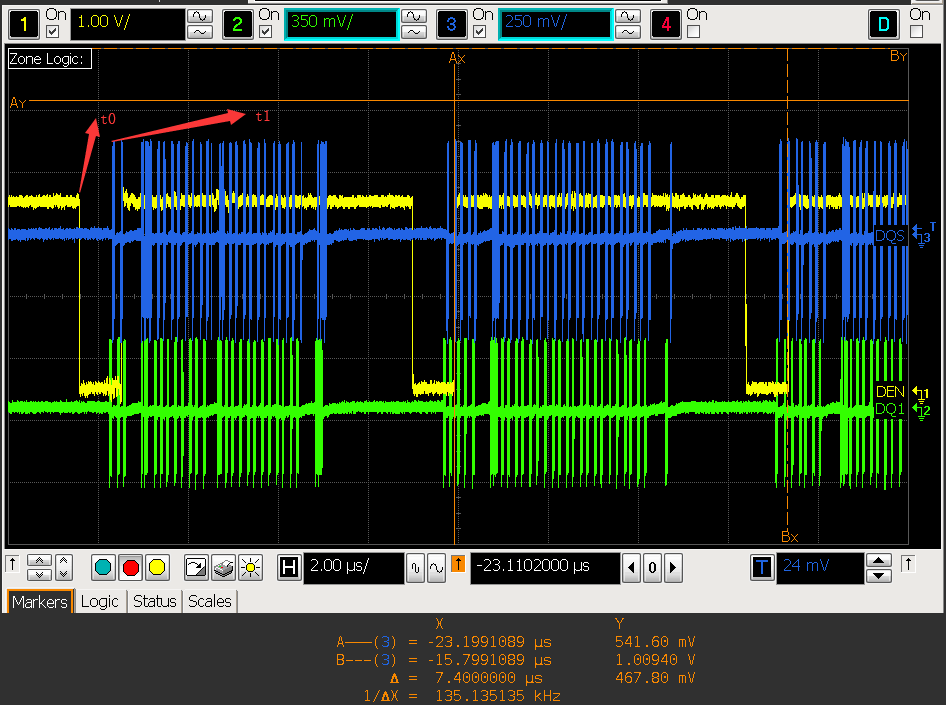

2. VOP 打开 gather

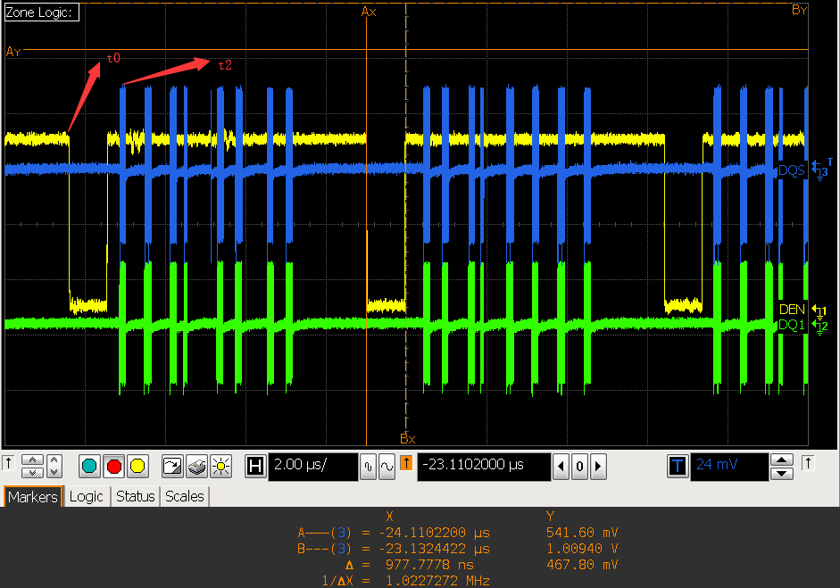

#### 实验三结论

从以上两张图片可以看出，den 结束的地方，即 vop 上一行数据送完的时刻，此时 VOP linebuffer 数据为空，但 VOP 没有马上进行取数而是等了一段时间才开始取数：

1. 在 gather 关闭时，等待的时间大概为：T = t1-t0 约等于 0.8us，占了一行 7.4us 总时间的：10.8%；
2. 在 gahter 打开时，等的时间大概为：T = t2-t0 约等于 1.2us，占了一行 7.4us 总时间的：16.2%；
3. 这段时间 VOP 没有及时去取数，浪费了 VOP 提前取数的时间，建议 IC 将取数时间提前到 den 结束的位置；
4. 同时需要 IC 排查，为什么是否打开 gather 会导致 T 不一致；

### 实验四：DDR stride 效果验证

#### DDR stride 实验过程

1. 将 DDR 的 stride 从 256 Byte 改成 4K Byte;

2. 设置 cpu 为 performance 模式，定频1416000 Hz；

   ```c
   echo performance > /sys/devices/system/cpu/cpufreq/policy0/scaling_governor
   cat /sys/devices/system/cpu/cpufreq/policy0/cpuinfo_cur_freq
   1416000
   ```

2. VOP ACLK 默认配置 600M 波形：

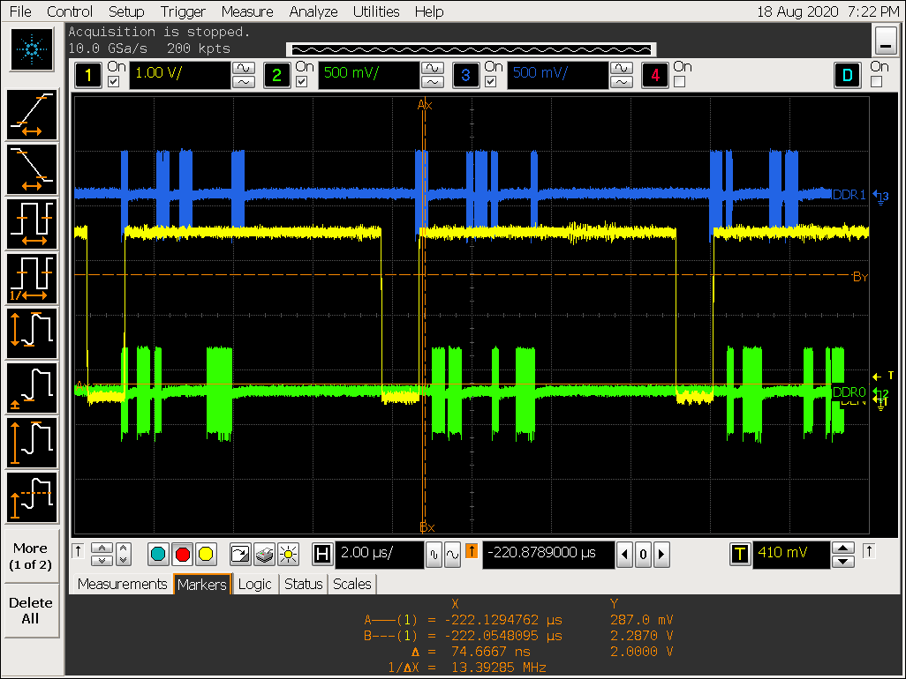

3. 执行 micro_bench_arm32 测试 CPU memset 速度:  4960MB/s

4. 将 ACLK 从 600M 改到 100M 后波形：


5. 执行 micro_bench_arm32 测试 CPU memset 速度: 5200MB/s

6. 移动鼠标，观察是否有 gpu 的访问行为插入


#### 实验四结论

在 VOP 取数来不及的情况下，总线不会被 hold 住，即其他 IP 可以插入访问；

### 实验五：afbc 格式的访问行为

#### 相关配置

1. DDR stride 为 4K Byte;

2. VOP aclk 400M;

3. 打开 VOP afbc 功能;

```c
setprop vendor.gralloc.disable_afbc 0
```

4. 由于 RK3399 VOP AFBC 最大只能支持 2560 的输入，所以设置 android framebuffer 大小为1080p, 同时切换 HDMI 输出分辨率为 1080p 60hz;

```c
setprop persist.vendor.framebuffer.main 1920x1080p60
```

#### UI 场景测试


放大图1：


放大图2：

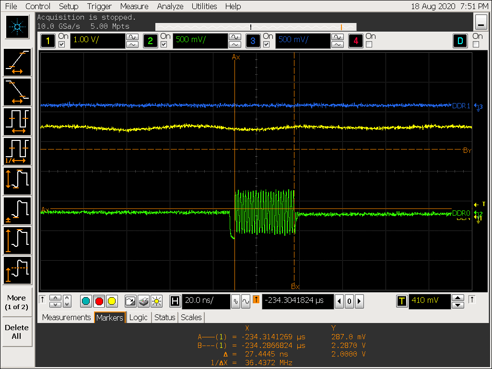

#### 视频场景测试

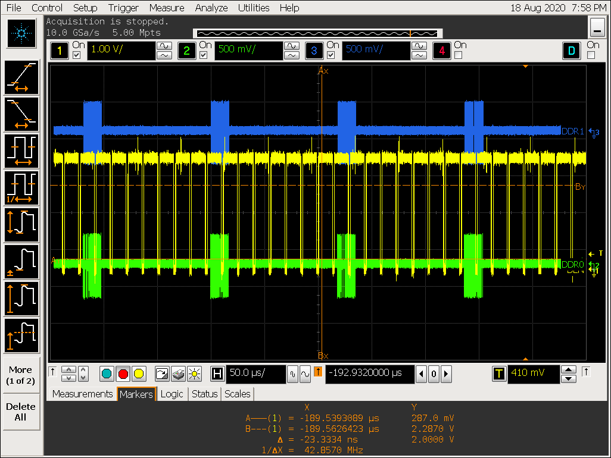

放大图1：

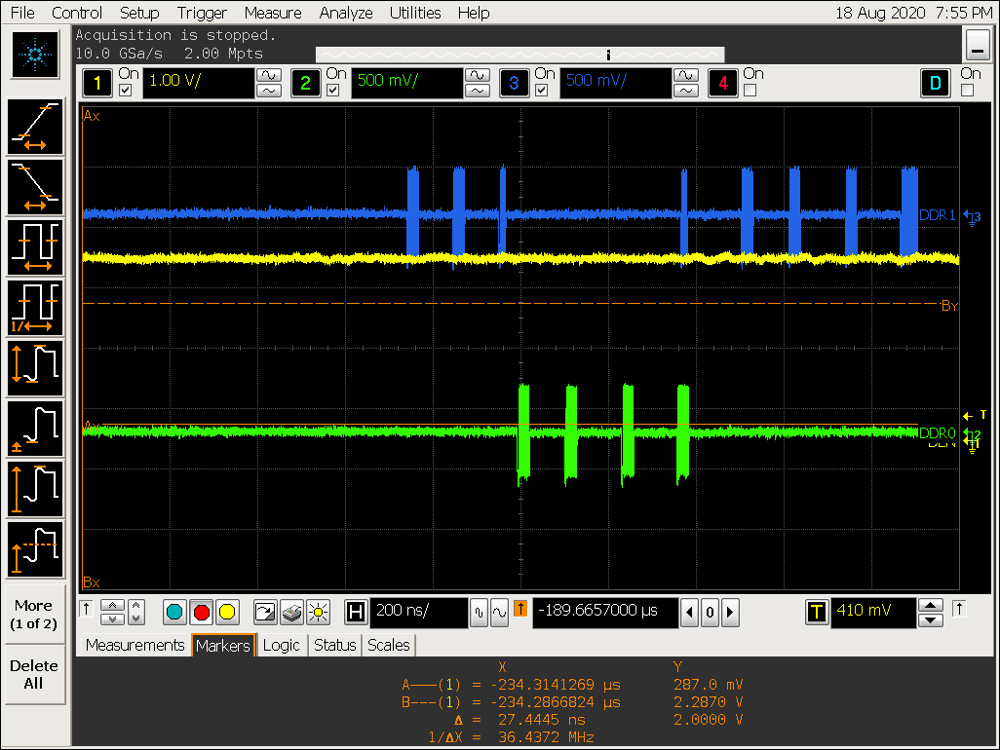

放大图2：

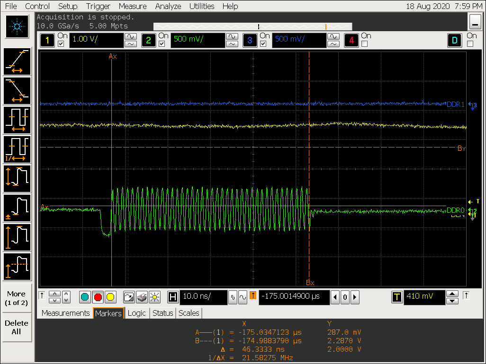

#### 实验五结论

1. RK 3399 AFBC 的 tile 大小为： 16x8 pixel，从前面的波形可以看出每隔 8 行 进行一次集中取数；
2. 数据格式为 ARGB8888，GPU 编码按16 x 16 x 4 = 1024 Byte 编码，所以每个 tile 之间的地址跳跃为：1024 Byte，DDR stride 为 4K Byte，所以每隔4个 tile DDR 交织一次[换一次 DDR 通道];
3. UI 场景随机抓取的一个 tile 数据量为：27.4ns / (1000 / 856) x 32 x 2 / 8 = 192 Byte，即当前 tile 的压缩率为：192 / 512 = 37.5%;
4. 视频场景随机抓取的一个 tile 数据量为：46.3ns / (1000 / 856) x 32 x 2 / 8 = 318 Byte，即当前 tile 的压缩率为：318 / 512 = 62%;
5. 每个 tile 对应 128 bit header 和一个 payload， header 和 payload 存在不同的地址中，目前 RK3399 设计是：取 4 个 tile 的header -> 4 个 payload -> 4 个 tile haeder-> 4 个 payload ...， 4 个 header的数据量只有 512 bit，这种访问行为效率较低；

## 实验总结

1. RK3399 平台播放 4k 视频/4k UI 的场景出现闪屏问题，最主要的一个原因是 VOP 处理单元工作在 ACLK 域，而 ACLK 在 400 M 的设计无法满足这个场景需求；
2. VOP 没有在 linebuffer 空闲时及时进行取数，浪费的有效取数时间，建议 IC 在未来设计中，将取数行为提前；
3. VOP 不同的 gather 配置下，开始取数时机和 VOP DEN 的相位不固定，需要 IC 进一步确认；
4. 建议未来 VOP 设计中所有图层都加入前级 linebuffer，保证能一次快速从总线取到数据到 linebuffer，这样不仅仅对 DDR 的访问行为更友好，也可以避免 VOP 的取数行为受 VOP 内部处理数度速度的影响；
5. AFBC 数据改成连续取一行数据的 header 进来，可以提高 DDR 访问效率；
