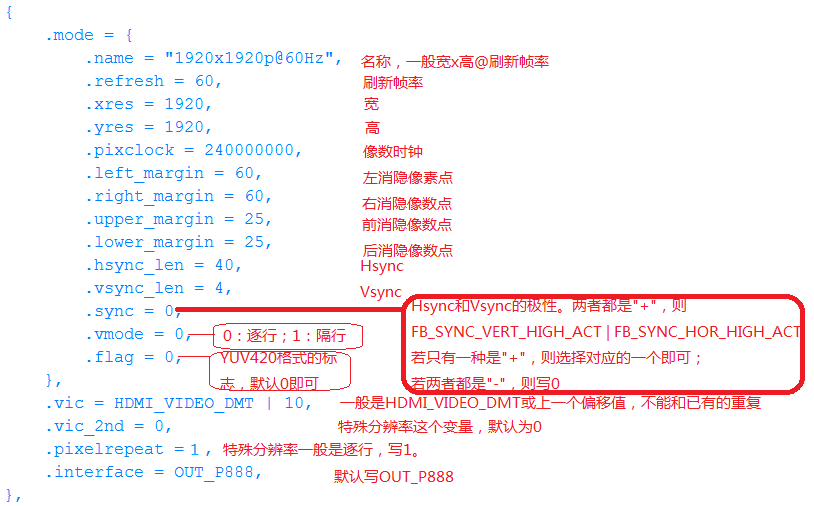
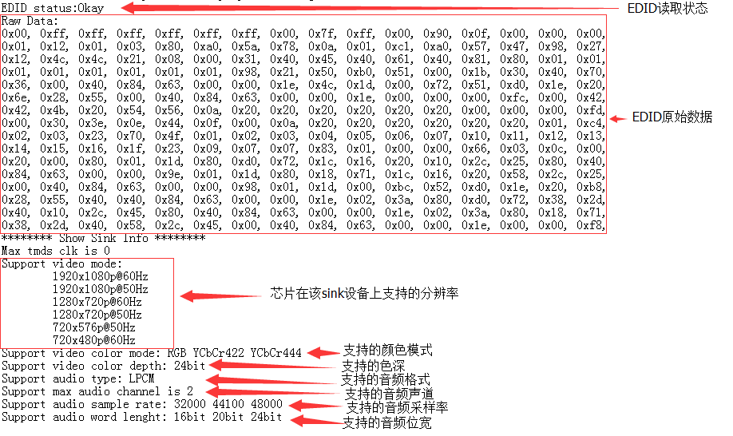
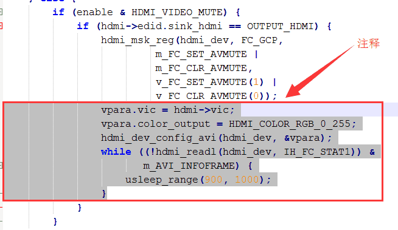
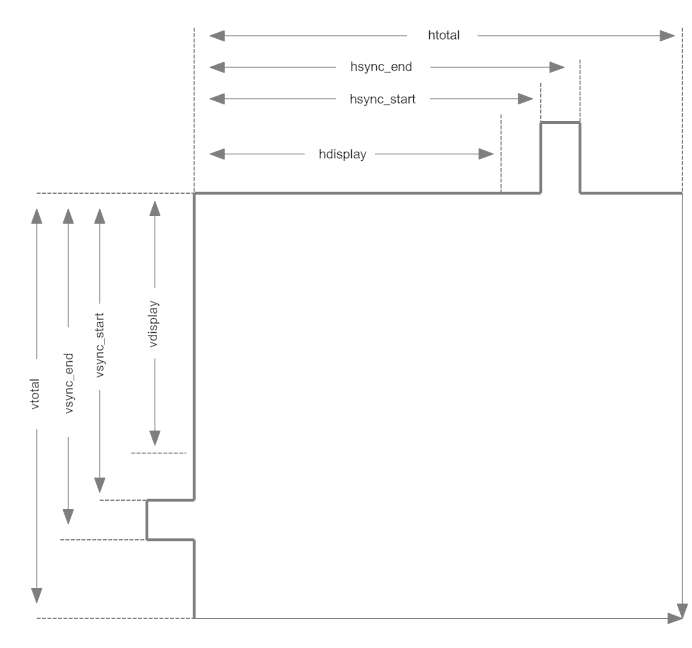
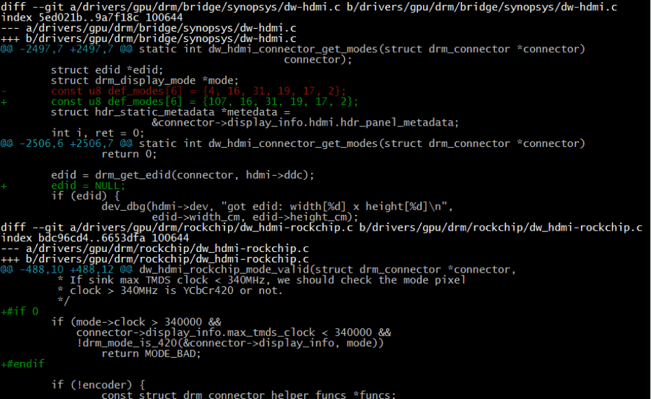
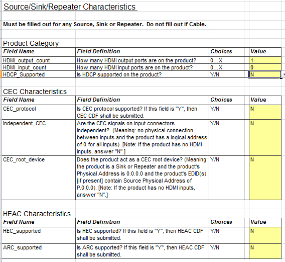
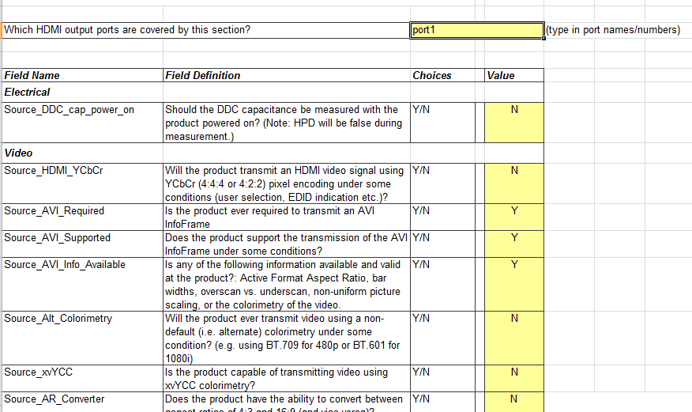
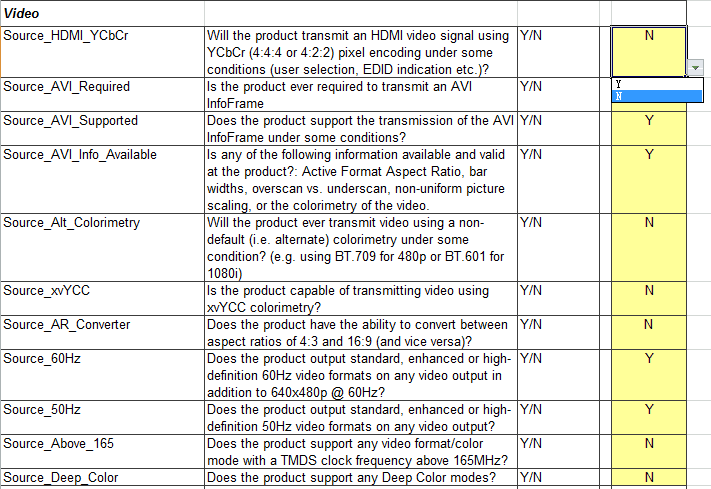

# Rockchip HDMI 软件开发指南

文档标识：RK-SM-YF-119

发布版本：V1.0.0

日期：2020-07-30

文件密级：□绝密   □秘密   □内部资料   ■公开

---

**免责声明**

本文档按“现状”提供，瑞芯微电子股份有限公司（“本公司”，下同）不对本文档的任何陈述、信息和内容的准确性、可靠性、完整性、适销性、特定目的性和非侵权性提供任何明示或暗示的声明或保证。本文档仅作为使用指导的参考。

由于产品版本升级或其他原因，本文档将可能在未经任何通知的情况下，不定期进行更新或修改。

**商标声明**

“Rockchip”、“瑞芯微”、“瑞芯”均为本公司的注册商标，归本公司所有。

本文档可能提及的其他所有注册商标或商标，由其各自拥有者所有。

**版权所有** **© 2020** **瑞芯微电子股份有限公司**

超越合理使用范畴，非经本公司书面许可，任何单位和个人不得擅自摘抄、复制本文档内容的部分或全部，并不得以任何形式传播。

瑞芯微电子股份有限公司

Rockchip Electronics Co., Ltd.

地址： 福建省福州市铜盘路软件园A区18号

网址： www.rock-chips.com

客户服务电话： +86-4007-700-590

客户服务传真： +86-591-83951833

客户服务邮箱： [fae@rock-chips.com](mailto:fae@rock-chips.com)

---
**前言**

文本主要介绍 Rockchip 平台 HDMI 的使用与调试方法，主要分为 FB 和 DRM 两种显示框架。

**概述**

**产品版本**

| **芯片名称**                       | **内核版本**               |
| ---------------------------------- | -------------------------- |
| RK322X/RK3328/RK3368/RK3399/RK3288 | LINUX kernel 4.4/4.19/3.10 |

**读者对象**

本文档（本指南）主要适用于以下工程师：
技术支持工程师
软件开发工程师

**修订记录**

| **日期**   | **版本** | **作者** | **修改说明** |
| ---------- | -------- | -------- | ------------ |
| 2020-06-24 | V1.0.0   | 操瑞杰   | 初始发布     |

---
[TOC]
---

## Rockchip 平台 HDMI 简介

Rockchip 各平台的 HDMI 功能如下：

| **功能**               | **RK3288**                                                  | **RK3368** | **RK322X** | **RK3328** | **RK3399**                                 |
| :--------------------- | ----------------------------------------------------------- | ---------- | ---------- | ---------- | ------------------------------------------ |
| 最大输出分辨率         | 3840x2160                                                   | 4096x2160  | 4096x2160  | 4096x2160  | 4096x2160                                  |
| 隔行模式               | N                                                           | N          | Y          | Y          | Y                                          |
| 4K-60/50 Hz 支持的颜色 | RGB<br/>YCbCr444<br/>YCbCr422<br/>YCbCr420(只有RK3288W支持) | YCbCr420   | YCbCr420   | YCbCr420   | RGB<br/>YCbCr444<br/>YCbCr422<br/>YCbCr420 |
| 是否支持 10 bit 色深   | Y                                                           | N          | Y          | Y          | Y                                          |

Rockchip 平台采用 FB 和 DRM 两种显示框架。与此相对应， HDMI 也有两套驱动。

- FB：

  LINUX 3.10 内核主要采用传统的 FB 框架， HDMI 驱动的路径为：

  ```
  kernel/drivers/video/rockchip/hdmi/
  ```

- DRM：

  DRM 全称是 Direct Rendering Manager 是 DRI ( Direct Rendering Infrastructure ) 框架的一个组件。LINUX 4.4/4.19 内核采用 DRM 框架， HDMI 驱动的路径为：

  ```
  kernel/drivers/gpu/drm/rockchip/dw_hdmi-Rockchip.c
  kernel/drivers/gpu/drm/rockchip/inno_hdmi.c
  kernel/drivers/gpu/drm/bridge/synopsys/
  ```

## FB 框架 HDMI 介绍

### HDMI 功能软件配置

#### 使能 HDMI

在板级 dts 文件中添加以下内容即可使能 HDMI：

```
&hdmi {
	status = "okay";
};
```

#### 使能 CEC

在板级 dts 文件的 hdmi 节点里添加 `rockchip,cec_enable = <1>`，例如：

```
&hdmi {
	status = "okay";
	rockchip,cec_enable = <1>;
};
```

RK3368 由于 CEC CLOCK 对精度的要求，还需要做以下修改：

```diff
--- a/arch/arm64/boot/dts/rk3368.dtsi
+++ b/arch/arm64/boot/dts/rk3368.dtsi
@@ -614,7 +614,7 @@
                        <&i2s_pll &clk_gpll>, <&spdif_8ch_pll &clk_gpll>,
                        <&i2s_2ch_pll &clk_gpll>, <&usbphy_480m &usbotg_480m_out>,
                        <&clk_uart_pll &clk_gpll>, <&aclk_gpu &clk_cpll>,
-                       <&clk_cs &clk_gpll>, <&clk_32k_mux &pvtm_clkout>;
+                       <&clk_cs &clk_gpll>, <&clk_32k_mux &xin32k>;
                rockchip,clocks-init-rate =
                        <&clk_gpll 576000000>,          <&clk_core_b 792000000>,
                        <&clk_core_l 600000000>,        <&clk_cpll 400000000>,
@@ -1014,7 +1014,7 @@
                compatible = "rockchip,rk3368-pvtm";
                rockchip,grf = <&grf>;
                rockchip,pmugrf = <&pmugrf>;
-               rockchip,pvtm-clk-out = <1>;
+               rockchip,pvtm-clk-out = <0>;
        };
```

#### 使能 HDCP 1.4

如果需要支持 HDCP 1.4 需要如下步骤：

- 在板级dts文件的hdmi节点里添加rockchip,hdcp_enable = <1>，例如：

  ```
  &hdmi {
  	status = "okay";
  	rockchip,hdcp_enable = <1>;
  };
  ```

- 使用 HDCP Key 工具烧写 HDCP 1.x Key，工具可以在 SDK 的 RKTools 目录下获取。不同 Android 工具可能不同，可向 FAE 咨询，使用说明见工具的 readme。对应的 Key 需要客户自行向 Digital Content Protection LLC 申请。

- 通过以下节点开启或关闭 HDCP 功能，1 为开启 HDCP 功能，0 为关闭 HDCP 功能：

  ```
  echo 1 > /sys/class/misc/hdcp/enable
  ```

开启 HDCP 功能后可以通过以下方法确认 HDCP 是否正常工作：

- 分别找一台不支持 HDCP 1.4 的电视和支持 HDCP 1.4 的电视。若开启 HDCP 功能后，不支持 HDCP 1.4 的电视显示粉屏而支持 HDCP 1.4 的电视可以正常显示，则说明 HDCP 工作正常。

- 若内核 LOG 中有以下内容，则说明 HDCP 认证成功，工作正常。

  ```
  hdcp_int is 0x80
  ```

#### Android 配置 HDMI 默认分辨率

在用户未在 setting 中手动设置 HDMI 分辨率的情况下，HDMI 使用的默认分辨率设置方法如下：

在板级dts文件的hdmi节点里添加 `rockchip,defaultmode = <value>` ，`<value>`值仅限于 CEA MODE（即有对应 VIC 值的分辨率） 可以在 `kernel/drivers/video/rockchip/hdmi/rockchip-hdmi.h` 的 `hdmi_video_infomation_code` 中查到不同分辨率对应的值，或是查阅 CEA-186-F。例如，设置默认分辨率为720P60Hz 输出：

```
&hdmi {
	status = "okay";
	rockchip,defaultmode = <4>;
};
```

HDMI 在开机时使用的分辨率按照以下优先级：

1. 在 Android 平台，若上次开机用户在 setting 中手动切换过分辨率且未曾恢复出厂设置或重新烧写固件，则 HDMI 开机使用的分辨率为用户选择的分辨率。
2. 若用户未曾手动设置过分辨率，且开机 HDMI 成功读取 EDID，则选用 EDID 中的与 `rockchip,defaultmode` 的值对应的分辨率。
3. 若 EDID 中不存在 `rockchip,defaultmode` 对应的分辨率，则选择 EDID 中最大的分辨率。
4. 若读取 EDID 失败，则直接使用 `rockchip,defaultmode` 对应的分辨率。
5. 若在 dts 中未配置 `rockchip,defaultmode` ，则默认使用`kernel/drivers/video/rockchip/hdmi/rockchip-hdmi.h` 中的宏`HDMI_VIDEO_DEFAULT_MODE`  对应的分辨率。

#### 新增分辨率

##### 新增特殊分辨率时序

添加所需分辨率的具体时序需要在 `drivers/video/rockchip/hdmi/rockchip-hdmi-lcdc.c` 的 `hdmi_mode` 末尾添加新的项目。具体如下：



##### 配置 HDMI-PHY-PLL

RK322X/RK3328 芯片 HDMI PHY PLL 除了供 HDMI PHY 使用外，还作为显示的时钟源，供 HDMI/CVBS/VOP 使用。在产品开发设计中，当需要增加特殊分辨率的支持，需要新增 PHY PLL 配置，使 HDMI PHY PLL 能输出该分辨率对应的时钟。

PLL 参数的计算，分为 PRE-PLL 和 POST-PLL 参数的计算两部分。

###### PRE-PLL计算过程

PRE-PLL 计算过程如图所示，其中 $F_{REF}$ 为 24Mhz：

PRE-PLL($F_{pre-VCO}$） 的频率 VCO 是由 `pre-pll-pre-divider[5:0]` 和 `pre-pll-feedback-divider[11:0]` 控制的。在 RK3328 芯片还可以由 `pre-pll-fractional-feedback-divider[23:0]` 控制，支持浮点运算。

$$
\begin{aligned}
F_{pre-VCO} = & \frac{F_{REF}}{pre-pll-pre-divider[5:0]}\times(pre-pll-feedback-divider[11:0]+\\
&  \frac{pre-pll-fractional-feedback-divider[23:0]}{2^{24}})
\end{aligned}
$$

TMDS CLOCK 通道频率 $F_{TX3}$ 由 `tmds-dividera[1:0]` 和 `tmds-dividerb[1:0]` 控制。

$$
\begin{aligned}
&F_{TX3} = \frac{F_{pre-VCO}}{4\times tmds-dividera[1:0]\times tmds-dividerb[1:0]}\\
\\
&tmds-dividera[1:0] = 1,2,3,5\\
&tmds-dividerb[1:0] = 1,2,4,8\\
\end{aligned}
$$

`pin_hdmi20_tmdsclk` 频率 $F_{pin\_hdmi20\_tmdsclk}$ 由 `tmds-dividera[1:0]` 和 `tmds-dividerc[1:0]` 控制。

$$
\begin{aligned}
&F_{pin\_hdmi20\_tmdsclk} = \frac{F_{pre-VCO}}{4\times tmds-dividera[1:0]\times tmds-dividerc[1:0]} \\
\\
&tmds-dividera[1:0] = 1,2,3,5\\
&tmds-dividerc[1:0] = 1,2,4,8\\
\end{aligned}
$$

`pin_hdmi20_prepclk` 频率 $F_{pin\_hdmi20\_prepclk}$ 计算方法如下：

$$
\begin{aligned}
&F_{pin\_hdmi20\_prepclk} = (pclk-dividera[4:0]==1)\ ?\\
\\
&\frac{F_{pre-VCO}}{pclk-dividerb[1:0]\times pclk-dividerc[4:0]} :\\
\\
&\frac{F_{pre-VCO}}{pclk-dividera[4:0]\times pclk-dividerc[4:0]}\\
\\
&pclk-dividera[4:0] = 1\sim 31\\
&pclk-dividerb[1:0] = 2,3,4,5\\
&pclk-dividerc[1:0] = 1,2,4,8\\
\end{aligned}
$$

当 `pin_hdmi20_pclk` 的频率 ($F_{pin\_hdmi20\_pclk}$) 为 $F_{pre-VCO}$ 的 1/5 时，可以使能 VCO/5 直接获取`pin_hdmi20_pclk`。其他频率计算如下：

$$
\begin{aligned}
&F_{pin\_hdmi20\_pclk} = (pclk-dividera[4:0]==1)\ ?\\
\\
& \frac{F_{pre-VCO}}{pclk-dividerb[1:0]\times pclk-dividerc[4:0])\times 2}:\\
\\
& \frac{F_{pre-VCO}}{pclk-dividera[4:0]\times pclk-dividerc[4:0])\times 2}\\
\\
&pclk-dividera[4:0] = 1\sim 31\\
&pclk-dividerb[1:0] = 2,3,4,5\\
&pclk-dividerd[4:0] = 1\sim 31\\
\end{aligned}
$$

注意点：

1. `pin_hd20_tmdsclk` 为 HDMI 输出的 TMDS CLOCK， `pin_hd20_pclk` 为 HDMI 输出的 PIXEL CLOCK。
2. `pin_hd20_pclk` 频率是由 `pin_hd20_prepclk` 以 1~10 的倍数分频得到。在 `no-repeating` 模式下，两种频率相等。
3. `pin_hd20_prepclk` 和 `pin_hd20_tmdsclk` 的频率在 8-bit 色深下相等。在 10-bit 色深下，`pin_hd20_tmdsclk` 等于 1.25 倍 `pin_hd20_prepclk` 频率。目前 RK 平台仅支持 8-bit 和 10-bit 两种色深。

如其中第一点所述，实际使用中，在非 `4K-YUV420` 的场景下，`pin_hd20_pclk` 与 `pin_hd20_prepclk` 始终相等。`4K-YUV420` 的场景下 `pin_hd20_pclk` 是 `pin_hd20_prepclk` 的两倍。

###### POST-PLL计算过程

POST-PLL 计算过程如下：

POST-PLL 用来产生差分串行时钟，其频率 $F_{diff-sclk}$ 总是 `pin_hdmi20_tmdsclk` 的五倍。

$$
\begin{aligned}
F_{post-VCO} = &\frac{F_{pin\_hdmi20\_tmdsclk}}{post-pll-pre-divider[4:0]}\times\\
& post-pll-feedback-divider[8:0]
\end{aligned}
$$

当 `post-pll-post-divider` 未使能时（0xaa[3:2] = 0），$F_{diff-sclk}$ 与 $F_{post-VCO}$ 相等。否则计算方法为：

$$
\begin{aligned}
&F_{diff-sclk} = \frac{F_{post-VCO}}{post-pll-post-divider[1:0]}\\
\\
&post-pll-post-divider = 2,4,8(2'b0,2'b01,2'b11)\\
\end{aligned}
$$

POST-PLL 计算较为简单，且 DRM 框架驱动中的 `post_pll_cfg_table` 已经包含所有场景，无需另行添加。

FB 框架需要根据分辨率对应的 TMDS CLOCK 所处的区间以及芯片的版本，直接使用 `post_pll_cfg_table` 当中相应的配置。具体说明请见 2.1.5.2.4 节。

需要注意的是，无论是 PRE-PLL 还是 POST-PLL，VCO 的频率都必须在 1.4~3.0Ghz 之间（实际使用中最大可以放宽到 3.2Ghz）。

###### 计算工具的使用

实际工作中可以使用计算工具 cal_innophy 进行计算，该计算工具可通过 FAE 窗口获取。

使用方法为：

```
cal_innophy 148500000 185625000 1
```

其中三个参数的含义分别为

| 参数      | 说明                                                  |
| --------- | ----------------------------------------------------- |
| 148500000 | PIXLE CLOCK                                           |
| 185625000 | TMDS CLOCK                                            |
| 1         | 是否使用浮点计算，RK322X系列芯片不支持浮点计算只能为0 |

其中第三项参数，推荐优先为 0，不使用浮点计算。当不使用浮点无法得出所需频率时，再设置为 1 进行计算。

TMDS CLOCK在不同色深的情况下，与PIXLE CLOCK的比率不同，详见 2.1.5.2.1 节。

计算结果为：

```
148500000, 185625000, 4, 495, 0, 2, 2, 1, 3, 2, 2, 0, 0x816817
```

各项参数含义为：

| 参数      | 说明                                |
| --------- | ----------------------------------- |
| 148500000 | pixel clock                         |
| 185625000 | tmds clock                          |
| 4         | pre-pll-pre-divider                 |
| 495       | pre-pll-feedback-divider            |
| 0         | tmds-dividera                       |
| 2         | tmds-dividerb                       |
| 2         | tmds-dividerc                       |
| 1         | tmds-dividerd                       |
| 3         | pclk-dividera                       |
| 2         | pclk-dividerb                       |
| 2         | pclk-dividerc                       |
| 0         | pclk-dividerd                       |
| 0x816817  | pre-pll-fractional-feedback-divider |

计算结果分别对应 2.1.5.2.1 节中说明的各项寄存器配置。本工具只计算了 PRE-PLL 的配置。

针对 POST-PLL，当 TMDS CLOCK <= 74.25MHz 时，RK322X 和 RK3328 早期样片配置一致，但与 RK3328 量产芯片的配置存在差异，需要在芯片版本上做区分。

LINUX 3.10 内核的 POST-PLL 配置分为 `RK322XH_V1_PLL_TABLE` 和 `EXT_PLL_TABLE` 两个 TABLE。可以根据所需 TMDS CLOCK 以及当前使用芯片的版本，直接选用 `post_pll_cfg_table` 当中对应值，在相应的 TABLE 中添加配置，详见 2.1.5.2.4 节。

###### 新增 PLL 配置

FB 框架驱动 HDMI 需要在特定的 TABLE 中新增对应的配置项，路径为：

```
kernel/drivers/video/rockchip/hdmi/rockchip-hdmiv2/rockchip_hdmiv2_hw.c
```

FB 框架驱动中包含两个 TABLE， `RK322XH_V1_PLL_TABLE` 适用于 TMDS CLOCK <= 74.25MHz 且所用芯片为 RK3328 量产芯片的场景。 `EXT_PLL_TABLE` 适用于 TMDS CLOCK > 74.25MHz 且所用芯片为 RK3328 早期样片和 RK322X 的场景。

```c
static const struct ext_pll_config_tab RK322XH_V1_PLL_TABLE[] = {
        {27000000,      27000000,       8,      1,      90,     3,      2,
                2,      10,     3,      3,      4,      0,      1,      80,
                8,      0xE8FBA7},
        {27000000,      33750000,       10,     1,      90,     1,      3,
                3,      10,     3,      3,      4,      0,      1,      80,
                8,      0xE8FBA7},
        {59400000,      59400000,       8,      1,      99,     3,      1,
                1,      1,      3,      3,      4,      0,      18,     80,
                8,      0xE6AE6B},
        {59400000,      74250000,       10,     1,      99,     0,      3,
                3,      1,      3,      3,      4,      0,      18,     80,
                8,      0xE6AE6B},
        {74250000,      74250000,       8,      1,      99,     1,      2,
                2,      1,      2,      3,      4,      0,      18,     80,
                8,      0xE6AE6B},
};

static const struct ext_pll_config_tab EXT_PLL_TABLE[] = {
        {27000000,      27000000,       8,      1,      90,     3,      2,
                2,      10,     3,      3,      4,      0,      1,      40,
                8,      0xE8FBA7},
        {27000000,      33750000,       10,     1,      90,     1,      3,
                3,      10,     3,      3,      4,      0,      1,      40,
                8,      0xE8FBA7},
        {59400000,      59400000,       8,      1,      99,     3,      1,
                1,      1,      3,      3,      4,      0,      1,      40,
                8,      0xE6AE6B},
        {59400000,      74250000,       10,     1,      99,     0,      3,
                3,      1,      3,      3,      4,      0,      1,      40,
                8,      0xE6AE6B},
        {74250000,      74250000,       8,      1,      99,     1,      2,
                2,      1,      2,      3,      4,      0,      1,      40,
                8,      0xE6AE6B},
        {74250000,      92812500,       10,     4,      495,    1,      2,
                2,      1,      3,      3,      4,      0,      2,      40,
                4,      0x816817},
        {148500000,     148500000,      8,      1,      99,     1,      1,
                1,      1,      2,      2,      2,      0,      2,      40,
                4,      0xE6AE6B},
        {148500000,     185625000,      10,     4,      495,    0,      2,
                2,      1,      3,      2,      2,      0,      4,      40,
                2,      0x816817},
        {297000000,     297000000,      8,      1,      99,     0,      1,
                1,      1,      0,      2,      2,      0,      4,      40,
                2,      0xE6AE6B},
        {297000000,     371250000,      10,     4,      495,    1,      2,
                0,      1,      3,      1,      1,      0,      8,      40,
                1,      0x816817},
        {594000000,     297000000,      8,      1,      99,     0,      1,
                1,      1,      0,      2,      1,      0,      4,      40,
                2,      0xE6AE6B},
        {594000000,     371250000,      10,     4,      495,    1,      2,
                0,      1,      3,      1,      1,      1,      8,      40,
                1,      0x816817},
        {594000000,     594000000,      8,      1,      99,     0,      2,
                0,      1,      0,      1,      1,      0,      8,      40,
                1,      0xE6AE6B},
};

```

`struct ext_pll_config_tab` 的定义为：

```c
struct ext_pll_config_tab {
        u32     pix_clock;
        u32     tmdsclock;
        u8      color_depth;
        u8      pll_nd;
        u16     pll_nf;
        u8      tmsd_divider_a;
        u8      tmsd_divider_b;
        u8      tmsd_divider_c;
        u8      pclk_divider_a;
        u8      pclk_divider_b;
        u8      pclk_divider_c;
        u8      pclk_divider_d;
        u8      vco_div_5;
        u8      ppll_nd;
        u16     ppll_nf;
        u8      ppll_no;
        u32     frac;
};
```

各项参数说明见下表：

| **参数**       | **说明**                                                |
| -------------- | ------------------------------------------------------- |
| pix_clock      | HDMI输出分辨率的pixel clock                             |
| tmdsclock      | HDMI输出分辨率的tmds clock                              |
| color_depth    | HDMI输出色深8/10 bits                                   |
| pll_nd         | pre-pll-pre-divider                                     |
| pll_nf         | pre-pll-feedback-divider                                |
| tmsd_divider_a | tmds-dividera                                           |
| tmsd_divider_b | tmds-dividerb                                           |
| tmsd_divider_c | tmds-dividerc                                           |
| pclk_divider_a | pclk-dividera                                           |
| pclk_divider_b | pclk-dividerb                                           |
| pclk_divider_c | pclk-dividerc                                           |
| pclk_divider_d | pclk-dividerd                                           |
| vco_div_5      | pin_hd20_pclk是否直接由VCO / 5所得，特定clock情况下使用 |
| ppll_nd        | post-pll-pre-divider                                    |
| ppll_nf        | post-pll-feedback-divider                               |
| ppll_no        | post-pll-post-divider                                   |
| frac           | pre-pll-fractional-feedback-divider                     |

ppll_nd，ppll_nf，ppll_no 对应 DRM 框架驱动中的 `post_pll_config` 中的 prediv，fbdiv，postdiv。其值的选择需要根据 TMDS CLOCK 以及芯片版本，选择方法详见 3.1.8 节。

需要注意的是，部分版本的sdk代码较旧不包括 frac。RK322X 系列的芯片 PHY 的版本不支持浮点，所以 frac 只能为 0。

#### HDMI 信号强度配置

##### RK322X/RK3328

HDMI 信号强度由 dts hdmi 节点下属性 `rockchip,phy_table` 决定，格式定义如下：

| 参数                | 说明                                                         |
| ------------------- | ------------------------------------------------------------ |
| 最大适用时钟频率    | 范围：0 - 600 Mhz，用于区分当前配置适用的分辨率范围。        |
| 预加重              | 范围：0 - 3，其值越大，预加重越大。                          |
| 信号上升/下降沿斜率 | 范围：0 - 3，其值越大，斜率越大。                            |
| CLK 幅度            | HDMI CLK 通道信号幅度，范围：0 - 31，其值越大，驱动能力越强。 |
| D0 幅度             | HDMI DATA0 通道信号幅度，范围：0 - 31，其值越大，幅度越大。  |
| D1 幅度             | HDMI DATA1 通道信号幅度，范围：0 - 31，其值越大，幅度越大。  |
| D2 幅度             | HDMI DATA2 通道信号幅度，范围：0 - 31，其值越大，幅度越大。  |

举例如下：

```
&hdmi {
	status = "okay";
	rockchip,phy_table =
		<165000000 0 0 4 4 4 4>,
		<225000000 0 0 6 6 6 6>,
		<340000000 1 0 6 10 10 10>,
		<594000000 1 0 7 10 10 10>;
};
```

<165000000 0 0 4 4 4 4> 表示:

最大适用时钟为 165 MHz、预加重 0、斜率 0 、CLK 幅度 4 、D0 幅度 4、D1 幅度 4、D2 幅度 4 的最大适用时钟为 165 MHz。

当该 table 不存在的时候，将使用驱动中默认的配置。

##### RK3368/RK3288/RK3399

HDMI 信号强度由 dts hdmi 节点下属性 `rockchip,phy_table` 决定，格式定义如下：

| 参数             | 说明                                                         |
| ---------------- | ------------------------------------------------------------ |
| 最大适用时钟频率 | 范围：0 - 600 Mhz，用于区分当前配置适用的分辨率范围。        |
| 预加重           | 范围：0 - 3，其值越大，预加重越大。                          |
| slopeboost       | 范围：0 - 3，其值越大，信号上升/下降沿斜率越大。             |
| CLK 幅度         | HDMI CLK通道信号幅度，范围：0 - 15，其值越大，幅度越小。     |
| D0 幅度          | HDMI DATA0 通道信号幅度，范围：0 - 15，其值越大，幅度越小，三个 DATA 通道的配置必须一致。 |
| D1 幅度          | HDMI DATA1 通道信号幅度，范围：0 - 15，其值越大，幅度越小，三个 DATA 通道的配置必须一致。 |
| D2 幅度          | HDMI DATA2 通道信号幅度，范围：0 - 15，其值越大，幅度越小，三个 DATA 通道的配置必须一致。 |

举例如下：

```
&hdmi {
	status = "okay";
	rockchip,phy_table =
		<165000000 0 0 17 17 17 17>,
		<340000000 0 0 14 17 17 17>,
		<594000000 0 0 9 17 17 17>;
};
```

<165000000 0 0 14 17 17 17> 表示:

最大适用时钟为 165 MHz、预加重 0、slopeboost 0 、CLK 幅度 14 、D0 幅度 17、D1 幅度 17、D2 幅度 17的最大适用时钟为 165 MHz。

当该 table 不存在的时候，将使用驱动中默认的配置。

### 常用调试方法

#### 内核 DEBUG 选项

若内核包含如下提交，使用命令行来修改打印级别，命令见提交说明。

```
commit f1c8587ef4cf9112a364b7949cc568fd23a98645
Author: Shen Zhenyi <szy@rock-chips.com>
Date:   Thu Sep 29 15:16:54 2016 +0800
    video: rockchip: hdmi: change the way to enable debug log
    user can change hdmi_dbg_level value to printf log which you want.
    1 : cec
    2 : hdmi
    3 : hdcp
    such as, echo 2 > /sys/module/rockchip_hdmi_sysfs/parameters/hdmi_dbg_level
    Signed-off-by: Shen Zhenyi <szy@rock-chips.com>
```

若没有上述提交，则需要在 config 中打开内核的 DEBUG 选项，可以查看更多的 LOG 信息。

```
Device Drivers  --->
			Graphics support  --->
				[*] Rockchip HDMI support  --->
						[*]   Rockchip HDMI Debugging
```

#### 命令行调试方法

##### 查看当前分辨率

执行以下命令：

```
cat /sys/class/display/HDMI/mode
```

##### 切换分辨率

举例如下：

1080P60：

```
echo 1920x1080p-60 > /sys/class/display/HDMI/mode
```

720P60：

```
echo 1280x720p-60 > /sys/class/display/HDMI/mode
```

##### 查看 HDMI 连接状态

执行以下命令：

```
cat /sys/class/display/HDMI/connect
```

结果 1 表示 HDMI 已连接， 0 表示 HDMI 已断开。

##### 查看 HDMI 使能状态

执行以下命令：

```
cat /sys/class/display/HDMI/enable
```

结果 1 表示 HDMI 已使能， 0 表示 HDMI 已关闭。

##### 设置 HDMI 使能

执行以下命令：

```
echo <value> > /sys/class/display/HDMI/enable
```

value 可取 0 或 1，0 表示关闭，1 表示开启。

##### 修改输出颜色

执行以下命令：

```
echo mode=<value> > /sys/class/display/HDMI/color
```

mode 值见下表：

| mode 值 | 说明                                                         |
| ------- | ------------------------------------------------------------ |
| 0       | 自动模式，优先级为：YCbCr444[16-235] > YCbCr422[16-235] > RGB[16-235] > RGB[0-255] |
| 1       | RGB[0-255]                                                   |
| 2       | RGB[16-235]                                                  |
| 3       | YCbCr444[16-235]                                             |
| 4       | YCbCr422[16-235]                                             |

##### 修改输出色深

执行以下命令：

```
echo depth=<value> > /sys/class/display/HDMI/color
```

value 可以取值 8、10，分辨率表示 24 bit、30 bit 色深输出。

##### 设置 3D 模式

执行以下命令：

```
echo <value> > /sys/class/display/HDMI/3dmode
```

value值见下表：

| value | 说明                   |
| ----- | ---------------------- |
| 1     | Frame packing 模式     |
| 6     | Top and Bottom 模式    |
| 8     | Side by Side Half 模式 |

##### 查看 3D 模式

执行以下命令：

```
cat /sys/class/display/HDMI/3dmode
```


3D制式定义为：33089 = 0x8146 = 1000000101000110 b。

其中 bit 6 、bit 8 为 1，表示支持 Top and Bottom 和 Side by Side Half 两种 3D 格式，其它制式以此类推。

##### 查看电视 EOTF 曲线

若内核代码包含如下提交，则支持 HDR 功能。

```
commit 08ea9d12f34f8ea6f79bdd5b7eb1ff74d2cd796f
Author: Zheng Yang <zhengyang@rock-chips.com>
Date:   Fri Oct 7 15:38:32 2016 +0800

    video: rockchip: hdmi: support hdr function

```

可以通过命令查看电视的 EOTF 曲线：

```
cat /sys/class/display/HDMI/color
```

有如下打印表示电视支持的 EOTF 曲线，以及当前 HDMI 输出的 EOTF 曲线：


Supported EOTF 的每一个 bit 表征一种曲线。对应 bit 置 1 时表示支持该曲线，定义如下：

| bit 位 | 说明                                    |
| ------ | --------------------------------------- |
| 0      | Traditional gamma - SDR Luminance Range |
| 1      | Traditional gamma - HDR Luminance Range |
| 2      | SMPTE ST 2084（HDR10）                  |
| 3 - 7  | reserved                                |

以三星 UA55KU6310 电视为例，它的 Supported EOTF 值为0x5，表示支持 SDR 和 ST2084 这两种曲线。

Current EOTF 为当前 HDMI 输出的 EOTF 曲线，其值见上表。

##### 配置 HDR

使用命令可以配置 HDMI HDR 输出：

```
echo hdr=<value> > /sys/class/display/HDMI/color
```

value 取值见 2.2.2.10 的表格，例如：

```
echo hdr=4 > /sys/class/display/HDMI/color
```

使能 HDR， EOTF 曲线为 SMPTE ST 2084。

```
echo hdr=0 > /sys/class/display/HDMI/color
```

关闭 HDR。

##### 查看 EDID

节点 `/sys/class/display/HDMI/debug` 可以查看 sink 设备的 EDID 信息，含原始数据和解析后信息。



##### HDMI 寄存器查看与配置

```
commit 9077ac86036f1b614dd9d1951479bddc1796180f
Author: Zheng Yang <zhengyang@rock-chips.com>
Date:   Tue Jun 30 11:19:31 2015 +0800
    HDMI:rk3368/rk3288: add debugfs node regs_phy to modify phy regs.
        and rename debugfs node hdmi to regs_ctrl.
    Signed-off-by: Zheng Yang <zhengyang@rock-chips.com>
```

在确认有以上提交后，可以通过以下节点查看寄存器值：

查看 HDMI 控制器寄存器值：

```
cat /sys/kernel/debug/rockchip-hdmiv2/regs_ctrl
```

查看 HDMI PHY 寄存器值：

```
cat /sys/kernel/debug/rockchip-hdmiv2/regs_phy
```

若无上述提交的代码，只能通过以下节点查看控制器的寄存器值：

```
cat /sys/kernel/debug/rockchip-hdmiv2/hdmi
```

除了查看寄存器值外，还可以通过命令来调整寄存器值，例如要调整控制器寄存器值：

```
echo <regs> <value>  > /sys/kernel/debug/rockchip-hdmiv2/regs_ctrl
```

regs 和 value 需取十六进制，例如：

```
echo 0x3000 0x42 > /sys/kernel/debug/rockchip-hdmiv2/regs_ctrl
```

同理，调整 PHY 的寄存器值也是一样。

### 常见问题排查

#### 插入或切换分辨率，电视提示无信号或格式不支持或电视画面不稳定，时有时无，或有大量彩色亮点、亮线

1. 确认HDMI当前的分辨率，命令见 2.2.2.1。

2. 降低HDMI分辨率，看电视能否恢复正常，命令见 2.2.2.2。

3. 更换好的HDMI线，看电视能否恢复正常。

4. 如果步骤2、3可以恢复画面，一般与 HDMI 物理信号的兼容性有关，需要检查硬件，测试 HDMI 信号进一步分析。

5. 如果 HDMI 信号不达标，可以通过调整 HDMI PHY 的配置进行信号的调整，参考 2.1.6。

#### 播放视频时电视提示无信号或格式不支持

1. 抓取 Android 和内核 log。

2. 分析 log，确认播放视频时是否有切换分辨率或设置 3D 等 HDMI 操作。

3. 分辨率内核切换生效 log 如下图，en 为 1 表示使能 HDMI，screen type 为 6，设置 clk 148500000，请确认是否和所需分辨率的一致。

  

4. 若有设置 3D 的操作，请参考 2.2.2.9 确认 3D 格式是否设置正确。

5. 检查内核代码中是否有针对视频的 DDR 变频功能，若有请配置 `auto-freq=<0>` 关闭变频功能。变频代码见下图橙色高亮处。

  

#### 切换分辨率后花屏

1. 请根据下面步骤进行操作，并反馈下面不同操作的现象或 log 到 redmine 上。

2. 判断花屏是否可恢复正常，例如移动焦点，接入鼠标；

3. 若移动焦点可恢复，那将该结果反馈，并说明芯片和 Android 版本。

4. 若不可恢复，输入 `echo bmp > /sys/class/graphics/fb0/dump_buf`，然后将 `/data/dmp_buf/` 里面的文件pull出来。

5. 文件有可能是 bmp 格式也可能是 yuv 格式。bmp 文件，使用看图软件就可以查看图片内容；yuv 文件则需要使用 RawViewer 或7yuv 这类工具查看。

6. 查看完 pull 出来的文件，请及时反馈看到的画面是否不正常，并上传源文件。

7. 若 pull 出来的文件就是异常的，那请输入 logcat -s hwcomposer 再复现问题，再输入 dumpsys SurfaceFlinger，将两份 log 也一并上传。

#### 切换分辨率过程中画面花屏/闪绿线/闪烁，切换后画面恢复正常

1. 请根据下面步骤进行操作，并反馈下面不同操作的现象或 log 到 redmine 上。

2. 色域切换到 RGB 格式，命令见 2.2.2.6。再切换分辨率，复现问题，寻找规律。

3. 若能复现，输入 `echo 1018 2 > /sys/kenrel/debug/rockchip_hdmiv2/regs_ctrl`。输入该命令，盒子输出黑色画面，请观察从正常显示切换到输出黑色画面过程是否复现问题，若有请及时反馈。

4. 执行 2 若没复现问题，输入 `echo 1018 1 > /sys/kenrel/debug/rockchip_hdmiv2/regs_ctrl`。输入该命令，盒子会从黑色画面恢复到正常画面，请观察该过程是否复现问题，并将结果反馈。

5. 执行到 3 仍没有复现问题，请修改 `kernel/drivers/video/rockchip/hdmi/rockchip-hdmiv2/rockchip_hdmiv2_hw.c` 文件中的 `static int hdmi_dev_control_output(struct hdmi *hdmi, int enable)` 函数，并将如下代码注释，再重新执行 1~3 的步骤，并反馈结果。

   

#### 显示设置中切换分辨率失败

1. 抓取 Android 和 内核 log。

2. 分析内核log，确定切换是否生效，可以参考 2.3.3。

3. 若内核没有切换分辨率或没有切换到用户选择的那个分辨率，则查看 Android log，确认是否有调用内核切换接口。
   box 分辨率设置操作节点 log 如下图，关键词是 setMode , display 0 表示主屏，iface HDMI 表示HDMI接口，`mode 3840x2160p-24` ，表示要切换到 3840x2160p-24 分辨率。

   

4. 若要查看其他信息，关键字为 Displaymanager，DisplayDeviceManagementService，DisplayOutputManager。其中 DisplayOutputManager 是 APP 调用的接口。

5. 确认分辨率是否在列表中，若不在列表中不能切换成功。

   

#### 开机分辨率不符合预期

1. U-Boot 开机分辨率选取流程如下：

   baseparamer 分区无值，EDID 获取成功，选择最大分辨率，不成功选择默认分辨率；

   baseparamer 分区有值，EDID 获取成功，判断电视是否支持分区预设分辨率，若支持输出该分辨率，若不支持选择 EDID 中最大分辨率；获取 EDID 不成功输出默认分辨率。

   先查看 U-Boot log

   1. 首先会读取 baseparamer 分区保存的上次用户设置的 HDMI 和 CVBS 分辨率：

      

   2. 查看最终实际输出的分辨率对应的 VIC 值：

      

      VIC 值含义参考 2.1.4

2. kernel 阶段会获取 U-Boot 阶段的分辨率 VIC：

   U-Boot 有检测到 HDMI 连接时，kernel 获取到的 log，如下：

   ```
   hdmi init vic is 16
   ```

   若是 yuv420 格式的，VIC |= HDMI_VIDEO_YUV420 (1 << 10)。
   U-Boot 未检测到 HDMI 连接时，VIC |= HDMI_U-Boot_NOT_INIT  (1 << 16)，如下：

   ```
   hdmi init vic is 65536
   ```

3. Android 系统起来后：

   displayd 初始化会设置一次显示接口和分辨率：

   

   请确定初始化的分辨率和使能的接口是否符合预期:
   property 0  表示主屏，iface 4 表示 HDMI，operate 1 表示写，value 1 表示使能。
   其他应用调整了分辨率，即有可能使用了 DisplayOutputManager 的接口，也有可能是直接操作 mode 节点。setting 中的 auto 选项即为自适应，保存该设置会清除 baseparameter 分区中 HDMI 分辨率信息。

#### 画面呈现红色或绿色

在红/绿屏时，色域切换到 RGB，命令见 2.2.2.6，确认是否能恢复。

#### 开机 logo 显示闪烁

1. 将 U-Boot 对应芯片平台头文件的 `CONFIG_BOOTDELAY` 宏，值修改成 10，重新编译 U-Boot 后烧写。重烧启动后按回车。
   文件路径如下：

   ```
   include\configs\rk30plat.h   - define detail configure for rk30 plat: rk3036, rk3126, rk3128, rk322x
   include\configs\rk32plat.h   - define detail configure for rk32 plat: rk3288
   include\configs\rk33plat.h   - define detail configure for rk33 plat: rk3368, rk3366
   ```

      若有芯片没在上述对应关系里，可以在 U-Boot 根目录，输入 `cat UserManual`。UserManual 详细介绍了芯片相应的配置文件。

2. 按 1 修改后 U-Boot 启动时间会变长为 10s，可以观察 U-Boot 阶段是否有发生闪烁。若没有，则排查 kernel。有，则排查 U-Boot；

3. 在 kernel 或 U-Boot 阶段 `while(1)；`。
      U-Boot：
      在 `drivers/video/rockchip_fb.c` 文件的 `void lcd_ctrl_init(void *lcdbase)` 函数会对 lcdc 和 HDMI 进行初始化。
      其中 `rk_hdmi_probe(&panel_info);` 是初始化 HDMI，可以在这条语句前后 `while(1);` 确认是否是 HDMI 初始化引起的闪烁。
      若不是 HDMI 初始化引起，则继续往下排查 `rk_lcdc_init(panel_info.lcdc_id);`，`rk_lcdc_load_screen(&panel_info);` 等 lcdc 初始化的函数。
      kernel 主要是 3 个地方：

   1. `drivers/video/rockchip/hdmi/rockchip-hdmiv2/rockchip_hdmiv2.c` 的
      `static int rockchip_hdmiv2_probe(struct platform_device *pdev)` 函数，一进这个函数就 `while(1);` 用于确认闪是否发生在 HDMI 初始化过程。
   2. 若闪发生在 HDMI 初始化之前，则在 `drivers/video/rockchip/lcdc`的 `rk322x_lcdc.c` 文件（3288 是 `rk3288_lcdc.c`，3368 是 `rk3368_lcdc.c`）的 probe 函数添加 `while(1);`。
   3. 若发生在 lcdc 初始化之前，则在 `drivers/video/rockchip/rk_fb.c` 的 probe 函数添加 `while(1);`。
      执行 1~3 后，若定位到闪发生的对应阶段。那么要进一步定位执行到哪一句的话，则需要在对应阶段的 probe 函数，一句一句的 `while(1);` 重点排查时钟开启，iommu 开启或寄存器配置的语句。

4. 若确定闪烁发生在 U-Boot 和 kernel 切换之间，且不是显示模块引起的。那么有可能是 ddr 变频引起。定频方法见 2.3.3。

## DRM 框架 HDMI 介绍

### HDMI 软件功能配置

#### 使能 HDMI

打开HDMI需要添加：

```
&hdmi {
	status = "okay";
};
```

#### 绑定 VOP

在 Rockchip 的各个平台中，各种显示接口（HDMI、DP、CVBS等）输出的图像数据来自于 VOP：


如果平台存在两个 VOP（RK3288、RK3399）：VOPB（支持 4K）、VOPL（只支持 2K），两个 VOP 可以分别与两个显示接口绑定（一个显示接口只能和一个 VOP 绑定），且可以相互交换：


当 dts 中显示设备节点打开时，显示接口对应 VOPB 和 VOPL 的 ports 都会打开，所以需要关闭用不到的那个 VOP 对应的 port。
比如 HDMI 绑定到 VOPB 需要添加：

```
&hdmi_in_vopl {
	status = "disabled";
};
```

反之若绑定到 VOPL 则添加：

```
&hdmi_in_vopb {
	status = "disabled";
};
```

如果平台只有一个 VOP，则不需要该步骤。

#### 打开开机 logo

如果 U-Boot logo 未开启，那 kernel 阶段也无法显示开机 logo，只能等到系统启动后才能看到应用显示的图像。在 dts 里面将 `route_hdmi` 使能即可打开 U-Boot logo 支持:

```
&route_hdmi {
	status = "okay";
};
```

同时，在双 VOP 的平台，需要注意下方代码中的 connect 指定的 VOP 必须要与 HDMI 绑定的 VOP 一致（详见 3.1.2），否则可能出现花屏等问题。

```
route_hdmi: route-hdmi {
	status = "disabled";
	logo,uboot = "logo.bmp";
	logo,kernel = "logo_kernel.bmp";
	logo,mode = "center";
	charge_logo,mode = "center";
	connect = <&vopb_out_hdmi>;
};
```

#### 绑定 PLL

RK3399 的 HDMI 所绑定的 VOP 时钟需要挂载到 vpll 上，若是双显则需要将另一个 VOP 时钟挂到 cpll，这样可以分出任意频率的 dclk,实现双显任意分辨率的支持。如当 HDMI 绑定到 VOPB 时配置：

```
&vopb {
	assigned-clocks = <&cru DCLK_VOP0_DIV>;
	assigned-clock-parents = <&cru PLL_VPLL>;
};
&vopl {
	assigned-clocks = <&cru DCLK_VOP1_DIV>;
	assigned-clock-parents = <&cru PLL_CPLL>;
}；
```

当 HDMI 绑定到 VOPL 时配置：

```
&vopb {
	assigned-clocks = <&cru DCLK_VOP0_DIV>;
	assigned-clock-parents = <&cru PLL_CPLL>;
};
&vopl {
	assigned-clocks = <&cru DCLK_VOP1_DIV>;
	assigned-clock-parents = <&cru PLL_VPLL>;
};
```

#### 使能 HDCP 1.4

```
&hdmi {
	hdcp1x-enable = <1>;
}
```

使能 HDCP 1.4 后还需要通过工具烧录对应 key，工具可以在 SDK 的 RKTools 目录下获取。不同 Android 工具可能不同，可向 FAE 咨询，使用说明见工具的 readme。对应的 Key 需要客户自行向 Digital Content Protection LLC 申请。

通过以下节点可以开启或关闭 HDCP 功能：

```
echo 1 > /sys/class/misc/hdmi_hdcp1x/enable
```

1 为开启 HDCP 功能，0 为关闭 HDCP 功能。

开启 HDCP 功能后，可以通过以下方法确认 HDCP 是否生效：

- 通过以下节点查看 HDCP 工作状态：

  ```
  cat /sys/class/misc/hdmi_hdcp1x/status
  ```

  不同值对应的 HDCP 状态如下：

  | status 节点值     | 说明                                    |
  | ----------------- | --------------------------------------- |
  | hdcp disable      | HDCP 功能关闭。                         |
  | hdcp_auth_start   | HDCP 开始认证。                         |
  | hdcp_auth_success | HDCP 认证成功，开始传输加密的视频数据。 |
  | hdcp_auth_fail    | HDCP 认证失败                           |

- 分别找一台不支持 HDCP 1.4 的电视和支持 HDCP 1.4 的电视。若开启 HDCP 功能后，不支持 HDCP 1.4 的电视显示粉屏而支持 HDCP 1.4 的电视可以正常显示，则说明 HDCP 工作正常。

#### DDC 的 I2C 速率配置

目前 I2C 速率通过 clk 高电平和低电平的时间来调整，如下为实测 I2C 速率为 50 khz 时候的配置。

```
&hdmi {
	ddc-i2c-scl-high-time-ns = <9625>;
	ddc-i2c-scl-low-time-ns = <10000>;
}
```

调整 I2C 速率只需将这两个值按对应的比例修改即可，例如调整速率为 100 khz：

```
&hdmi {
	ddc-i2c-scl-high-time-ns = <4812>;
	ddc-i2c-scl-low-time-ns = <5000>;
}
```

#### HDMI 信号强度配置

由于硬件走线差异,不同板子有可能需要不同的驱动强度配置，当遇到电视兼容性问题时可以尝试进行修改。
HDMI 信号强度可通过 dts 的 `rockchip.phy-table` 属性配置，格式定义:

<PIXELCLOCK  PHY_CKSYMTXCTRL  PHY_TXTERM  PHY_VLEVCTRL>。

PIXELCLOCK 表示该行参数所对应的最大 pixelclock 频率。

PHY_CKSYMTXCTRL 寄存器 (0x09) 值用于调整 HDMI 信号的预加重和上升斜率，加大预加重或 sloop boost，可以提升 DATA 信号的上升/下降斜率，但会降低信号的上升/下降时间：

Bit[0]：CLOCK 信号使能。
Bit[3:1]：DATA 信号预加重。
Bit[4:5]：DATA 信号sloop boost。

PHY_TXTERM 寄存器 (0x19) 值用于调整端接电阻值

Bit[0:2]：值越大，端接电阻值越大。

PHY_VLEVCTRL寄存器 (0x0e) 值用于调整 HDMI 的信号幅度，具体定义如下：Bit[0:4] : tmds_clk +/- 信号幅度，值越低，信号幅度越大；
Bit[5:9]: tmds_data +/- 信号幅度，值越低，信号幅度越大。

举例如下：

```
&hdmi {
rockchip,phy-table =
	<74250000 0x8009 0x0004 0x0272>,
	<165000000 0x802b 0x0004 0x0209>,
	<297000000 0x8039 0x0005 0x028d>,
	<594000000 0x8039 0x0000 0x019d>,
	<000000000 0x0000 0x0000 0x0000>;
};
```

其中 <74250000 0x8009 0x0004 0x0272> ，表示 pixeclock 为 74.25MHz (720p 分辨率) 以下是 PHY_CKSYMTXCTRL 寄存器值为0x8009；PHY_TXTERM 值为 0x0004; PHY_VLEVCTRL 值为 0x0272。修改后也可用 `cat /sys/kernel/debug/dw-hdmi/phy` 命令查看对应的寄存器值确认是否有修改成功。

#### 新增特殊分辨率

##### 新增特殊分辨率时序

DRM 框架目前代码已经支持了绝大部分分辨率时序，但是部分 HDMI 屏幕旋转的场景下，可能还有一些特殊分辨率不支持。需要在 `kernel\drivers\gpu\drm\drm_edid.c` 中的 `drm_dmt_modes` 的末尾新增项目：

```
	/* 0x58 - 4096x2160@59.94Hz RB */
	{ DRM_MODE("4096x2160", DRM_MODE_TYPE_DRIVER, 556188, 4096, 4104,
		   4136, 4176, 0, 2160, 2208, 2216, 2222, 0,
		   DRM_MODE_FLAG_PHSYNC | DRM_MODE_FLAG_NVSYNC) },
```

| 参数                                         | **说明**                                                     |
| -------------------------------------------- | ------------------------------------------------------------ |
| "4096x2160"                                  | mode name，为分辨率的 hdisplay x vdisplay                    |
| DRM_MODE_TYPE_DRIVER                         | mode type，配置为DRM_MODE_TYPE_DRIVER                        |
| 556188                                       | 像素时钟                                                     |
| 4096                                         | 行有效像素                                                   |
| 4104                                         | 行同步起始像素                                               |
| 4136                                         | 行同步结束像素                                               |
| 4176                                         | 一行总像素                                                   |
| 0                                            | hskew，通常为 0                                              |
| 2160                                         | 帧有效行                                                     |
| 2208                                         | 帧同步开始行                                                 |
| 2216                                         | 帧同步结束行                                                 |
| 2222                                         | 一帧总行数                                                   |
| 0                                            | vscan， 通常为 0                                             |
| vrefresh                                     | 显示设备帧率                                                 |
| DRM_MODE_FLAG_PHSYNC \| DRM_MODE_FLAG_NVSYNC | hsync 和 vsync 极性，flags 的定义如下：<br/>DRM_MODE_FLAG_PHSYNC      (1<<0)<br/>DRM_MODE_FLAG_NHSYNC     (1<<1)<br/>DRM_MODE_FLAG_PVSYNC      (1<<2)<br/>DRM_MODE_FLAG_NVSYNC     (1<<3)<br/>DRM_MODE_FLAG_INTERLACE   (1<<4) |

各项参数描述如上表，具体时序的含义可以参考 3.2.4 节。

##### 新增 PLL 配置

RK322X/RK3328 芯片新增特殊分辨率还需要新增 HDMI-PHY-PLL 的配置。具体配置的计算过程请参考 2.1.5.2 节。

DRM 框架需要新增 PHY 配置时，需在 PRE-PLL 的配置 TABLE：`pre_pll_cfg_table` 中新增对应的配置，而 POST-PLL 的配置 TABLE：`post_pll_cfg_table` 目前配置已经涵盖了 PHY 所支持的所有分辨率，无需再新增配置。路径为：

```
kernel/drivers/phy/rockchip/phy-Rockchip-inno-hdmi-phy.c
```

```c
static const struct pre_pll_config pre_pll_cfg_table[] = {
	{ 27000000,  27000000, 1,  90, 3, 2, 2, 10, 3, 3,  4, 0, 0},
	{ 27000000,  33750000, 1,  90, 1, 3, 3, 10, 3, 3,  4, 0, 0},
	{ 40000000,  40000000, 1,  80, 2, 2, 2, 12, 2, 2,  2, 0, 0},
	{ 40000000,  50000000, 1, 100, 2, 2, 2,  1, 0, 0, 15, 0, 0},
	{ 59341000,  59341000, 1,  98, 3, 1, 2,  1, 3, 3,  4, 0, 0xE6AE6B},
	{ 59400000,  59400000, 1,  99, 3, 1, 1,  1, 3, 3,  4, 0, 0},
	{ 59341000,  74176250, 1,  98, 0, 3, 3,  1, 3, 3,  4, 0, 0xE6AE6B},
	{ 59400000,  74250000, 1,  99, 1, 2, 2,  1, 3, 3,  4, 0, 0},
	{ 65000000,  65000000, 1, 130, 2, 2, 2,  1, 0, 0, 12, 0, 0},
	{ 65000000,  81250000, 3, 325, 0, 3, 3,  1, 0, 0, 10, 0, 0},
	{ 71000000,  71000000, 3, 284, 0, 3, 3,  1, 0, 0,  8, 0, 0},
	{ 71000000,  88750000, 3, 355, 0, 3, 3,  1, 0, 0, 10, 0, 0},
	{ 74176000,  74176000, 1,  98, 1, 2, 2,  1, 2, 3,  4, 0, 0xE6AE6B},
	{ 74250000,  74250000, 1,  99, 1, 2, 2,  1, 2, 3,  4, 0, 0},
	{ 74176000,  92720000, 4, 494, 1, 2, 2,  1, 3, 3,  4, 0, 0x816817},
	{ 74250000,  92812500, 4, 495, 1, 2, 2,  1, 3, 3,  4, 0, 0},
	{ 83500000,  83500000, 2, 167, 2, 1, 1,  1, 0, 0,  6, 0, 0},
	{ 83500000, 104375000, 1, 104, 2, 1, 1,  1, 1, 0,  5, 0, 0x600000},
	{ 85750000,  85750000, 3, 343, 0, 3, 3,  1, 0, 0,  8, 0, 0},
	{ 88750000,  88750000, 3, 355, 0, 3, 3,  1, 0, 0,  8, 0, 0},
	{ 88750000, 110937500, 1, 110, 2, 1, 1,  1, 1, 0,  5, 0, 0xF00000},
	{108000000, 108000000, 1,  90, 3, 0, 0,  1, 0, 0,  5, 0, 0},
	{108000000, 135000000, 1,  90, 0, 2, 2,  1, 0, 0,  5, 0, 0},
	{119000000, 119000000, 1, 119, 2, 1, 1,  1, 0, 0,  6, 0, 0},
	{119000000, 148750000, 1,  99, 0, 2, 2,  1, 0, 0,  5, 0, 0x2AAAAA},
	{148352000, 148352000, 1,  98, 1, 1, 1,  1, 2, 2,  2, 0, 0xE6AE6B},
	{148500000, 148500000, 1,  99, 1, 1, 1,  1, 2, 2,  2, 0, 0},
	{148352000, 185440000, 4, 494, 0, 2, 2,  1, 3, 2,  2, 0, 0x816817},
	{148500000, 185625000, 4, 495, 0, 2, 2,  1, 3, 2,  2, 0, 0},
	{162000000, 162000000, 1, 108, 0, 2, 2,  1, 0, 0,  4, 0, 0},
	{162000000, 202500000, 1, 135, 0, 2, 2,  1, 0, 0,  5, 0, 0},
	{296703000, 296703000, 1,  98, 0, 1, 1,  1, 0, 2,  2, 0, 0xE6AE6B},
	{297000000, 297000000, 1,  99, 0, 1, 1,  1, 0, 2,  2, 0, 0},
	{296703000, 370878750, 4, 494, 1, 2, 0,  1, 3, 1,  1, 0, 0x816817},
	{297000000, 371250000, 4, 495, 1, 2, 0,  1, 3, 1,  1, 0, 0},
	{593407000, 296703500, 1,  98, 0, 1, 1,  1, 0, 2,  1, 0, 0xE6AE6B},
	{594000000, 297000000, 1,  99, 0, 1, 1,  1, 0, 2,  1, 0, 0},
	{593407000, 370879375, 4, 494, 1, 2, 0,  1, 3, 1,  1, 1, 0x816817},
	{594000000, 371250000, 4, 495, 1, 2, 0,  1, 3, 1,  1, 1, 0},
	{593407000, 593407000, 1,  98, 0, 2, 0,  1, 0, 1,  1, 0, 0xE6AE6B},
	{594000000, 594000000, 1,  99, 0, 2, 0,  1, 0, 1,  1, 0, 0},
	{     ~0UL,	    0, 0,   0, 0, 0, 0,  0, 0, 0,  0, 0, 0}
};

static const struct post_pll_config post_pll_cfg_table[] = {
	{33750000,  1, 40, 8, 1},
	{33750000,  1, 80, 8, 2},
	{33750000,  1, 10, 2, 4},
	{74250000,  1, 40, 8, 1},
	{74250000, 18, 80, 8, 2},
	{148500000, 2, 40, 4, 3},
	{297000000, 4, 40, 2, 3},
	{594000000, 8, 40, 1, 3},
	{     ~0UL, 0,  0, 0, 0}
};
```

`struct pre_pll_config` 和 `struct post_pll_config` 定义如下，LINUX 4.4/4.19 内核相当于拆分了 3.10 内核中的 `struct ext_pll_config_tab`。

```c
struct pre_pll_config {
	unsigned long pixclock;
	unsigned long tmdsclock;
	u8 prediv;
	u16 fbdiv;
	u8 tmds_div_a;
	u8 tmds_div_b;
	u8 tmds_div_c;
	u8 pclk_div_a;
	u8 pclk_div_b;
	u8 pclk_div_c;
	u8 pclk_div_d;
	u8 vco_div_5_en;
	u32 fracdiv;
};

struct post_pll_config {
	unsigned long tmdsclock;
	u8 prediv;
	u16 fbdiv;
	u8 postdiv;
	u8 version;
};
```

`pre_pll_config` 各项参数说明见下表：

| **参数**     | **说明**                                                |
| ------------ | ------------------------------------------------------- |
| pixclock     | HDMI输出分辨率的pixel clock                             |
| tmdsclock    | HDMI输出分辨率的tmds clock                              |
| prediv       | pre-pll-pre-divider                                     |
| fbdiv        | pre-pll-feedback-divider                                |
| tmds_div_a   | tmds-dividera                                           |
| tmds_div_b   | tmds-dividerb                                           |
| tmds_div_c   | tmds-dividerc                                           |
| pclk_div_a   | pclk-dividera                                           |
| pclk_div_b   | pclk-dividerb                                           |
| pclk_div_c   | pclk-dividerc                                           |
| pclk_div_d   | pclk-dividerd                                           |
| vco_div_5_en | pin_hd20_pclk是否直接由VCO / 5所得，特定clock情况下使用 |
| fracdiv      | pre-pll-fractional-feedback-divider                     |

`post_pll_config` 各项参数说明见下表：

| **参数**  | **说明**                                                     |
| --------- | ------------------------------------------------------------ |
| tmdsclock | HDMI输出分辨率的tmds clock                                   |
| prediv    | post-pll-pre-divider                                         |
| fbdiv     | post-pll-feedback-divider                                    |
| postdiv   | post-pll-post-divider                                        |
| version   | 芯片版本，POST-PLL配置需根据时钟和芯片版本确定，其值含义：<br/>1--RK322X与RK322XH早期样片，tmds clock为74.25Mhz及以下的配置<br/>2--RK322XH量产芯片，tmds clock为74.25Mhz及以下的配置<br/>3--RK322X与RK322XH芯片，tmds clock为74.25Mhz以上的配置，两者配置相同<br/>4--RK322X部分芯片POST VCO为1080Mhz时不稳定，为270Mhz时工作稳定，需要特别区分出来 |

以 TMDS CLOCK 为 74.25Mhz，RK3328 量产芯片为例，POST-PLL 配置选择方法如下：

1. 首先在 `post_pll_cfg_table` 中根据 TMDS CLOCK 找到对应的区间。如 TMDS CLOCK 为 74.25Mhz 时，33.75Mhz < TMDS CLOCK <= 74.25Mhz,找到对应的二项：

```c
{74250000,  1, 40, 8, 1},
{74250000, 18, 80, 8, 2},
```

2. 根据芯片版本进一步选择，此时是 RK3328 量产芯片，TMDS CLOCK <= 74.25Mhz，所以 version 的值应选择 2，所以最终选择：

```c
{74250000, 18, 80, 8, 2},
```

3. 最终配置值为：prediv = 18，fbdiv = 80， postdiv = 8。在 LINUX 3.10 内核的驱动中对应 `struct ext_pll_config_tab` 中的 ppll_nd,  ppll_nf, ppll_no 三项。由于是 RK3328 量产芯片切 TMDS CLOCK <= 74.25Mhz，所以需要添加在`RK322XH_V1_PLL_TABLE` 当中。

#### 打开音频

3368 和 3288 默认 HDMI 声卡和 Codec 公用，需确认配置如下：

```
&hdmi_analog_sound {
	    status = "okay";
}
```

3399 目前 HDMI 声卡和 DP 公用：

```
&hdmi_dp_sound {
        	status = "okay";
};
```

### Android 显示框架配置

Rockchip 在 Android 显示框架增加了一些系统属性，用于帮助客户能够根据需求配置显示。

#### 主副显示接口配置

| **属性**                                                     | **功能说明**         |
| ------------------------------------------------------------ | -------------------- |
| sys.hwc.device.primary<br/>vendor.hwc.device.primary  (Android 9.0 后使用) | 设置显示接口做为主显 |
| sys.hwc.device.extend<br/>vendor.hwc.device.extend (Android 9.0 后使用) | 设置显示接口做为副显 |

以上两个属性的配置可加在产品配置目录下的system.prop里，如：

```
device/rockchip/rk3368/rk3368_box/system.prop
```

默认情况下(即以上属性未配置时)，不支持热拔插设备（如 CVBS/MIPI/LVDS 等）会作为主显，支持热插拔设备（如 HDMI/DP 等）会作为副显。
通常主、副显只配置一个显示接口，例如 RK3399 BOX SDK 默认采用的配置，HDMI 作为主显，DP 作为副显。

```
sys.hwc.device.primary=HDMI-A
sys.hwc.device.extend=DP
```

9.0之后属性改成：

```
vendor.hwc.device.primary=HDMI-A
vendor.hwc.device.extend=DP
```

当主/副显配置多个显示接口时，优先使用支持热拔插的设备。例如RK3368 BOX SDK默认采用的配置：

```
sys.hwc.device.primary=HDMI-A,TV
```

9.0之后属性改成:

```
vendor.hwc.device.primary=HDMI-A,TV
```

当 HDMI 插入时，主显使用 HDMI 作为显示，HDMI 拔出时，主显使用 CVBS 作为显示。
注意：由于主显的 framebuffer 分辨率无法动态更改，所以有两个或以上设备作为主显时，最好设定一个主显的 framebuffer 分辨率。
关于接口名称可以参见 `hardware/rockchip/hwcomposer/drmresources.cpp` 里的定义：

```
struct type_name connector_type_names[] = {
    { DRM_MODE_CONNECTOR_Unknown, "unknown" },//未知接口
    { DRM_MODE_CONNECTOR_VGA, "VGA" },	//VGA
    { DRM_MODE_CONNECTOR_DVII, "DVI-I" },//DVI，暂不支持
    { DRM_MODE_CONNECTOR_DVID, "DVI-D" },//DVI，暂不支持
    { DRM_MODE_CONNECTOR_DVIA, "DVI-A" },//DVI，暂不支持
    { DRM_MODE_CONNECTOR_Composite, "composite" },//不支持
    { DRM_MODE_CONNECTOR_SVIDEO, "s-video" },//S端子
    { DRM_MODE_CONNECTOR_LVDS, "LVDS" },//LVDS
    { DRM_MODE_CONNECTOR_Component, "component" },//分量信号YPbPr
    { DRM_MODE_CONNECTOR_9PinDIN, "9-pin DIN" },//不支持
    { DRM_MODE_CONNECTOR_DisplayPort, "DP" },//DP
    { DRM_MODE_CONNECTOR_HDMIA, "HDMI-A" },//HDMI A型口
    { DRM_MODE_CONNECTOR_HDMIB, "HDMI-B" },//HDMI B型口，不支持
    { DRM_MODE_CONNECTOR_TV, "TV" },// CVBS
    { DRM_MODE_CONNECTOR_eDP, "eDP" },//EDP
    { DRM_MODE_CONNECTOR_VIRTUAL, "Virtual" },//不支持
    { DRM_MODE_CONNECTOR_DSI, "DSI" },//MIPI
};
```

#### 主副显示接口查询

可以通过以下两个只读属性来分别查询主副显示输出接口的名称。

| **属性**                                                     | **功能说明**           |
| ------------------------------------------------------------ | ---------------------- |
| sys.hwc.device.main<br/>vendor.hwc.device.main(Android 9.0 后使用) | 查询当前主显的输出接口 |
| sys.hwc.device.aux<br/>vendor.hwc.device.main (Android 9.0 后使用) | 查询当前副显的输出接口 |

#### Framebuffer 分辨率配置

Framebuffer 分辨率是 UI 绘制时采用的分辨率，与 HDMI 输出分辨率不同。Framebuffer 分辨率与 HDMI 输出分辨率不同时，会进行相应的缩放。可以通过配置以下属性来设置 Framebuffer 的分辨率：

```
persist.sys.framebuffer.main=1920x1080
```

9.0之后属性改为：

```
persist.vendor.framebuffer.main=1920x1080
```

#### 分辨率过滤配置

因为初始获取到的全部分辨率过多，有些分辨率对用户来说并不需要，因此在 SDK 的 HWC 模块中对分辨率进行了过滤。采用了白名单的方式对分辨率进行过滤：

```
device/rockchip/common/resolution_white.xml
```

HWC 中会根据该配置文件对初始的分辨率进行过滤筛选后再传递给上层，该 XML 文件的每一个 resolution 块定义了一个能够通过过滤的分辨率，其中详细项的定义如下：

| **项定义**  | **说明**                                                     |
| ----------- | ------------------------------------------------------------ |
| clock       | 像素时钟                                                     |
| hdisplay    | 行有效像素                                                   |
| hsync_start | 行同步起始像素                                               |
| hsync_end   | 行同步结束像素                                               |
| htotal      | 一行总像素                                                   |
| hskew       | 行偏差，通常为 0                                             |
| vdisplay    | 帧有效行                                                     |
| vsync_start | 帧同步开始行                                                 |
| vsync_end   | 帧同步结束行                                                 |
| vtotal      | 一帧总行数                                                   |
| vscan       | 帧扫描信号，通常为 0                                         |
| vrefresh    | 显示设备帧率                                                 |
| flags       | flags 的定义如下：<br/>DRM_MODE_FLAG_PHSYNC      (1<<0)<br/>DRM_MODE_FLAG_NHSYNC     (1<<1)<br/>DRM_MODE_FLAG_PVSYNC      (1<<2)<br/>DRM_MODE_FLAG_NVSYNC     (1<<3)<br/>DRM_MODE_FLAG_INTERLACE   (1<<4) |
| vic         | HDMI 标准对应定义的 VIC 值，如HDMI标准中未定义置 0           |

具体时序说明见下图：



#### HDMI 设置选项

系统的设置 app 可以从 UI 上对当前的 HDMI 分辨率等属性进行修改。

要在设置中显示出 HDMI 选项， android7.X 是默认显示的； android 8.X 及以上需对 device 下的产品目录，添加配置属性如下：

```
BOARD_SHOW_HDMI_SETTING := true
```

UI 界面默认只显示副屏的配置，如要修改，请在 `package/apps/Settings` 的代码中，对 `HdmiSettings.java`，修改如下内容：

```
int value = SystemProperties.getInt("persist.hdmi.ui.state", ???);
```

代码中 `???` 的取值为 0：显示副屏配置 UI； 1：显示主屏配置 UI； 2：显示主副屏 2 个 UI 配置。

### 常用调试方法

#### 查看 VOP 状态

执行以下命令可查看 VOP 状态：

```
cat /sys/kenrel/debug/dri/0/summary
```


上是 RK3399 连接 HDMI 时上述命令输出的 LOG，可以提供三种信息：

- VOP 状态：VOPB 处于使能状态，VOPL 处于禁用状态。

- VOP 对应的 Connector 状态：VOPB 输出信号给 HDMI，bus_format = 0x2025 表示 YUV444 8bit，output_mode = 0x0f 表示 VOP 输出总线为 ROCKCHIP_OUT_MODE_AAAA，输出 1920x1080P60。
  常用的 bus_format 由内核 `uapi/linux/media-bus-format.h` 定义：

```
#define MEDIA_BUS_FMT_RGB888_1X24				0x100a	//RGB888
#define MEDIA_BUS_FMT_RGB101010_1X30            0x1018	//RGB101010
#define MEDIA_BUS_FMT_YUV8_1X24                 0x2025	//YUV444 8bit
#define MEDIA_BUS_FMT_YUV10_1X30                0x2016	//YUV444 10bit
#define MEDIA_BUS_FMT_UYYVYY8_0_5X24			0x2026	//YUV420 8bit
#define MEDIA_BUS_FMT_UYYVYY10_0_5X30           0x2027	//YUV420 10bit
```

常用的 output_mode 由内核 `drivers/gpu/drm/rockchip/rockchip_drm_vop.h` 定义：

```
#define ROCKCHIP_OUT_MODE_P888		0
#define ROCKCHIP_OUT_MODE_P666		1
#define ROCKCHIP_OUT_MODE_P565		2
#define ROCKCHIP_OUT_MODE_S888		8
#define ROCKCHIP_OUT_MODE_S888_DUMMY	12
#define ROCKCHIP_OUT_MODE_YUV420	14
/* for use special outface */
#define ROCKCHIP_OUT_MODE_AAAA		15
```

- 图层配置信息：win0 和 win2 使能，win2 buffer 格式为 ARGB，buffer 大小为 29x37；目标窗口为 29x37，窗口左上角坐标（385，543）。Win0 buffer 格式为 NV12，大小为 3840x2160；目标窗口大小为 1920x1080，窗口左上角坐标（0，0）。

#### 查看 Connector 状态

`/sys/class/drm` 目录下可以看到驱动注册的各个显卡。下图是 RK3399 BOX 平台 DRM 目录结构，可以看到注册了 `card0-HDMI-A-1` 和 `card0-DP-1` 两种显示设备，分别表示 HDMI 和 DP。


以 `card0-HDMI-A-1` 为例，其目录下有以下文件：

- Enabled:使能状态

- Status:连接状态

- Mode:当前输出分辨率

- Modes:连接设备支持的分辨率列表

- Audioformat:连接设备支持的音频格式

- Edid:连接设备的 EDID，可以通过命令 `cat edid > /data/edid.bin` 保存下来。

#### 查看 HDMI 工作状态

如果包含以下提交，则可以查看 HDMI 工作状态：

```
commit eaca91814449199b1e6ad0b9fe0bba2215497c97
Author: Zheng Yang <zhengyang@rock-chips.com>
Date:   Mon Nov 27 16:56:21 2017 +0800

    	drm: bridge: dw-hdmi: add hdmi status debugfs node
```

使用以下命令查看当前 HDMI 输出状态：

```
cat /sys/kernel/debug/dw-hdmi/status
```


- HDMI Output Status 表示当前 PHY 状态，只有当 PHY 使能的时候才会有后续打印。

- Pixel Clk 表示当前输出的像素时钟。

- TMDS Clk 表示当前输出 HDMI character rate。

- Color Format 表示输出的颜色格式，取值 RGB、YUV444、YUV422、YUV420。

- Color Depth 表示输出的颜色深度，取值 8bit、10bit、12bit、16bit。

- Colorimery 表示输出的颜色标准，取值 ITU.BT601、ITU.BIT709、ITU.BT2020。

- EOTF 表示输出的 HDR 电光转换曲线方式，有如下取值：

| **EOTF**     | **含义**              |
| ------------ | --------------------- |
| Unsupported  | HDMI不支持发送HDR信息 |
| Not  Defined | 未定义                |
| Off          | 不发送HDR信息         |
| SDR          | 采用SDR曲线           |
| ST2084       | 采用ST2084 EOTF曲线   |
| HLG          | 采用HLG EOTF曲线      |

- (x0，y0)、(x1，y1)、(x2，y2)、(white x，white y)、max lum、min lum、max cll、maxfall为静态 HDR 描述子信息，只有 EOTF值为 SDR、ST2084、HLG 值时才会存在。

执行以下命令可以查看 HDMI 控制器寄存器：

```
cat /sys/kenrel/debug/dw-hdmi/ctrl
```

可以使用命令来修改寄存器，例如要修改0x1000寄存器为 0xF8，输入命令：

```
echo 1000 f8 > /sys/kenrel/debug/dw-hdmi/ctrl
```

RK3288、RK3368、RK3399 平台可以用以下命令查看 HDMI PHY 寄存器：

```
cat /sys/kenrel/debug/dw-hdmi/phy
```

修改 PHY 寄存器与控制器类似，例如修改 0x06 寄存器为 0x8002，输入命令：

```
echo 06 8002 > /sys/kenrel/debug/dw-hdmi/phy
```

#### 查看 HDMI CEC 状态

执行以下命令查看 HDMI CEC 状态：

```
cat /sys/kernel/debug/cec/cec0/status
```


打印结果如上图所示：

- configured 表示 cec adapter 是否配置完毕，1 为配置完毕，0 为未完毕。

- configuring 表示 cec adapter 是否正在配置，1 为正在，0 为配置完毕或未开始配置。

- phys_addr 表示 cec 的物理地址，未获取物理地址时为 f.f.f.f。

- number of LAs 表示该 cec 设备的逻辑地址数量，大部分设备为 1，极少数为 2。

- LA mask 表示当前绑定的逻辑地址，具体取值为（1 << 绑定的逻辑地址）。如：取值为 0x0010 时，右移 4 位后为 1，则说明当前的逻辑地址为 4，取值为 0x0800 时，右移 11 位后为 1，则说明当前的逻辑地址为 11.如未绑定任何逻辑地址时为 0x0000。

- has CEC follower 表示当前收到的 cec 消息交由上层用户空间处理，in passthrough mode 表示 kernel 不会处理 cec core message，而是全部上报给上层用户空间处理。

- pending transmits 表示当前还有多少待发送的 cec 消息。

#### 强制使能/禁用 HDMI

强制使能 HDMI：

```
echo on > /sys/class/drm/card0-HDMI-A-1/status
```

强制禁用 HDMI：

```
echo off > /sys/class/drm/card0-HDMI-A-1/status
```

恢复检测热插拔：

```
echo detect >　/sys/class/drm/card0-HDMI-A-1/status
```

#### 命令行设置分辨率

在 Android 系统中，可以用命令行设置属性的方式来设置分辨率。此外，当用户在 Android 的 setting 中设置分辨率时，对应的属性值也会被设置，详见下面的说明。

##### Android 7.x & Android 8.x 分辨率设置

| 属性                        | 说明                                                 |
| --------------------------- | ---------------------------------------------------- |
| persist.sys.resolution.main | 设置主屏分辨率，参数为该分辨率的时序，详见 3.2.4节。 |
| persist.sys.resolution.aux  | 设置副屏分辨率，参数为该分辨率的时序，详见 3.2.4节。 |
| sys.display.timeline        | 刷新显示时间线，每次设置新的分辨率需要加一。         |

通过 `persist.sys.resolution.main` 以及 `persist.sys.resolution.aux` 设置主副屏分辨率，每次设置完更新`sys.display.timeline` (每次加 1) 再进行移动鼠标等更新UI 的操作使新分辨率生效，例子如下：

- 设置4k60：

  ```
  setprop persist.sys.resolution.main 3840x2160@60-3840-4016-4104-4400-2160-2168-2178-2250-5
  setprop sys.display.timeline 1
  ```

- 设置1080p60：

  ```
  setprop persist.sys.resolution.main 1920x1080@60-1920-2008-2052-2200-1080-1084-1089-1125-5
  setprop sys.display.timeline 2
  ```

- 设置720P60：

  ```
  setprop persist.sys.resolution.main 1280x720@60.00-1390-1430-1650-725-730-750-5
  setprop sys.display.timeline 3
  ```

- 设置480P60：

  ```
  setprop persist.sys.resolution.main 720x480@59.94-736-798-858-489-495-525-a
  setprop sys.display.timeline 4
  ```

##### Android 9.0 及以上版本分辨率设置

| 属性                           | 说明                                                 |
| ------------------------------ | ---------------------------------------------------- |
| persist.vendor.resolution.main | 设置主屏分辨率，参数为该分辨率的时序，详见 3.2.4节。 |
| persist.vendor.resolution.aux  | 设置副屏分辨率，参数为该分辨率的时序，详见 3.2.4节。 |
| vendor.display.timeline        | 刷新显示时间线，每次设置新的分辨率需要加一。         |

通过 `persist.vendor.resolution.main` 以及 `persist.vendor.resolution.aux` 设置主副屏分辨率，每次设置完更新 `vendor.display.timeline` (每次加 1)再进行移动鼠标等更新UI 的操作使新分辨率生效，例子如下：

- 设置4k60：

  ```
  setprop persist.vendor.resolution.main 3840x2160@60-3840-4016-4104-4400-2160-2168-2178-2250-5
  setprop vendor.display.timeline 1
  ```

- 设置1080p60：

  ```
  setprop persist.vendor.resolution.main 1920x1080@60-1920-2008-2052-2200-1080-1084-1089-1125-5
  setprop vendor.display.timeline 2
  ```

- 设置720P60：

  ```
  setprop persist.vendor.resolution.main 1280x720@60.00-1390-1430-1650-725-730-750-5
  setprop vendor.display.timeline 3
  ```

- 设置480P60：

  ```
  setprop persist.vendor.resolution.main 720x480@59.94-736-798-858-489-495-525-a
  setprop vendor.display.timeline 4
  ```

#### 命令行设置颜色

在 Android 系统中，可以用命令行设置属性的方式来设置颜色。此外，当用户在 Android 的 setting 中设置颜色时，对应的属性值也会被设置，详见下面的说明。

##### Android 7.x & Android 8.x 颜色设置

| 属性                   | 说明                                                         |
| ---------------------- | ------------------------------------------------------------ |
| persist.sys.color.main | 设置主屏颜色，参数为：颜色格式-色深 <br/>例如想要设置颜色为 RGB， 色深 8 bit（24 bit），则参数为<br/>RGB-8bit<br/>支持颜色格式有：<br/>RGB<br/>YUV444<br/>YUV422<br/>YUV420<br/>支持色深有：<br/>8bit<br/>10bit |
| persist.sys.color.aux  | 设置副屏颜色，参数同主屏。                                   |
| sys.display.timeline   | 刷新显示时间线，每次设置新的分辨率需要加一。                 |

通过 `persist.sys.color.main` 以及 `persist.sys.color.aux` 设置主副屏颜色，每次设置完更新 `sys.display.timeline` (每次加 1) 再进行移动鼠标等更新UI 的操作使新颜色生效，例子如下：

```
setprop persist.sys.color.main RGB-8bit
setprop sys.display.timeline 1
```

将输出颜色设置为 RGB，色深 8 bit（RGB 24 bit）。

##### Android 9.0 及以上版本颜色设置

| 属性                      | 说明                                                         |
| ------------------------- | ------------------------------------------------------------ |
| persist.vendor.color.main | 设置主屏颜色，参数为：颜色格式-色深 <br/>例如想要设置颜色为 RGB， 色深 8 bit（24 bit），则参数为<br/>RGB-8bit<br/>支持颜色格式有：<br/>RGB<br/>YUV444<br/>YUV422<br/>YUV420<br/>支持色深有：<br/>8bit<br/>10bit |
| persist.vendor.color.aux  | 设置副屏颜色，参数同主屏。                                   |
| vendor.display.timeline   | 刷新显示时间线，每次设置新的分辨率需要加一。                 |

通过 `persist.vendor.color.main` 以及 `persist.vendor.color.aux` 设置主副屏颜色，每次设置完更新`vendor.display.timeline` (每次加 1) 再进行移动鼠标等更新 UI 的操作使新颜色生效，例子如下：

```
setprop persist.vendor.color.main RGB-8bit
setprop vendor.display.timeline 1
```

将输出颜色设置为 RGB，色深 8 bit（RGB 24 bit）。

#### 设置过扫描

由于不同电视之间存在差异，画面显示可能存在画面超出屏幕范围，或是画面有黑边等现象。此时可以设置过扫描来调整缩放大小，以修正这些问题。

在 Android 系统中，可以用命令行设置属性的方式来设置过扫描。此外，当用户在 Android 的 setting 中也可以设置过扫描，设置完成后，对应的属性值也会被设置，详见下面的说明。

##### Android 7.x & Android 8.x 过扫描设置

| 属性                      | 说明                                                         |
| ------------------------- | ------------------------------------------------------------ |
| persist.sys.overscan.main | 设置主屏过扫描，属性格式：overscan left,top,right,bottom<br/>left、top、right、bottom 分别为左、上、右、下四个方向的过扫描值，最小值为 1，最大值由属性 persist.sys.overscan.max 定义，如 persist.sys.overscan.max 不存在，默认取 100。 |
| persist.sys.overscan.aux  | 设置副屏过扫描，参数同主屏。                                 |

例子如下：

```
setprop persist.sys.overscan.main "overscan 70,70,70,70"
```

将四个方向的过扫描设置为 70。

##### Android 9.0 及以上版本过扫描设置

| 属性                         | 说明                                                         |
| ---------------------------- | ------------------------------------------------------------ |
| persist.vendor.overscan.main | 设置主屏过扫描，属性格式：overscan  left,top,right,bottom<br/>left，top，right，bottom 分别为左、上、右、下四个方向的过扫描值，最小值为 1，最大值由属性 persist.vendor.overscan.max 定义，如 persist.vendor.overscan.max 不存在，默认取 100。 |
| persist.vendor.overscan.aux  | 设置副屏过扫描，参数同主屏。                                 |

例子如下：

```
setprop persist.vendor.overscan.main "overscan 70,70,70,70"
```

将四个方向的过扫描设置为 70。

#### 设置亮度、对比度、饱和度、色度

在 Android 系统中，可以用命令行设置属性的方式来设置这些参数。此外，当用户在 Android 的 setting 中也可以设置这些参数。设置完成后，对应的属性值也会被设置，详见下面的说明。

##### Android 7.x & Android 8.x 亮度、对比度、饱和度、色度设置

| BCSH   | 取值范围                   | 说明                                                       |
| ------ | -------------------------- | ---------------------------------------------------------- |
| 亮度   | 整形数，0 - 100，默认值 50 | persist.sys.brightness.main<br/>persist.sys.brightness.aux |
| 对比度 | 整形数，0 - 100，默认值 50 | persist.sys.contrast.main<br/>persist.sys.contrast.aux     |
| 饱和度 | 整形数，0 - 100，默认值 50 | persist.sys.saturation.main<br/>persist.sys.saturation.aux |
| 色度   | 整形数，0 - 100，默认值 50 | persist.sys.hue.main<br/>persist.sys.hue.aux               |

举例如下：

```
setprop persist.sys.brightness.main 70
setprop vendor.display.timeline 1
```

通过 `persist.sys.brightness.main` 设置主屏亮度，每次设置完更新 `vendor.display.timeline` (每次加 1) 再进行移动鼠标等更新 UI 的操作使新亮度生效。

##### Android 9.0 及以上版本亮度、对比度、饱和度、色度设置

| BCSH   | 取值范围                   | 说明                                                         |
| ------ | -------------------------- | ------------------------------------------------------------ |
| 亮度   | 整形数，0 - 100，默认值 50 | persist.vendor.brightness.main<br/>persist.vendor.brightness.aux |
| 对比度 | 整形数，0 - 100，默认值 50 | persist.vendor.contrast.main<br/>persist.vendor.contrast.aux |
| 饱和度 | 整形数，0 - 100，默认值 50 | persist.vendor.saturation.main<br/>persist.vendor.saturation.aux |
| 色度   | 整形数，0 - 100，默认值 50 | persist.vendor.hue.main<br/>persist.vendor.hue.aux           |

举例如下：

```
setprop persist.vendor.brightness.main 70
setprop sys.display.timeline 1
```

通过 `persist.vendor.brightness.main` 设置主屏亮度，每次设置完更新 `vendor.display.timeline` (每次加 1) 再进行移动鼠标等更新 UI 的操作使新亮度生效。

### 常见问题排查

#### 插入或切换分辨率，电视提示无信号或格式不支持或画面不稳定，时有时无，或有大量彩色亮点、亮线

1. 确认HDMI当前的分辨率，命令见 3.3.2。
2. 降低HDMI分辨率，看电视能否正常显示，命令见 3.3.6。
3. 更换好的HDMI线，看电视能否正常显示。
4. 如果步骤2、3可以恢复画面，一般与 HDMI 物理信号的兼容性有关，需要检查硬件，测试 HDMI 信号进一步分析。
5. 如果 HDMI 信号不达标，可以通过调整 HDMI PHY 的配置进行信号的调整，参考 3.1.7。

#### 播放视频时电视提示无信号或格式不支持

检查内核代码 dts 中是否有针对视频的 DDR 变频功能，若有请设置 `auto-freq-en = <0>;` 关闭自动变频功能。

```
        dmc: dmc {
                compatible = "rockchip,rk3328-dmc";
                devfreq-events = <&dfi>;
                clocks = <&cru SCLK_DDRCLK>;
                clock-names = "dmc_clk";
                operating-points-v2 = <&dmc_opp_table>;
                ddr_timing = <&ddr_timing>;
                upthreshold = <40>;
                downdifferential = <20>;
                system-status-freq = <
                        /*system status         freq(KHz)*/
                        SYS_STATUS_NORMAL       786000
                        SYS_STATUS_REBOOT       786000
                        SYS_STATUS_SUSPEND      786000
                        SYS_STATUS_VIDEO_1080P  786000
                        SYS_STATUS_VIDEO_4K     786000
                        SYS_STATUS_VIDEO_4K_10B 933000
                        SYS_STATUS_PERFORMANCE  933000
                        SYS_STATUS_BOOST        933000
                >;
                auto-min-freq = <786000>;
                auto-freq-en = <0>;
                #cooling-cells = <2>;
                status = "disabled";
```

#### 部分电视提示无信号、黑屏、花屏

1. 确认HDMI当前的分辨率，命令见 3.3.2。

2. 降低HDMI分辨率，看电视能否正常显示，命令见 3.3.6。

3. 更换好的HDMI线，看电视能否正常显示。

4. 如果步骤 2、3 可以恢复画面，一般与 HDMI 物理信号的兼容性有关，需要检查硬件，测试 HDMI 信号进一步分析。

5. 如果 HDMI 信号不达标，可以通过调整 HDMI PHY 的配置进行信号的调整，参考 3.1.7。

6. 若测试 HDMI 信号达标，可尝试修改以下寄存器值：

   ```
   kernel\drivers\gpu\drm\bridge\synopsys\dw-hdmi.c
   ```

   ```c
   /* HDMI Initialization Step B.4 */
   static void dw_hdmi_enable_video_path(struct dw_hdmi *hdmi)
   {
   	/* control period minimum duration */
   	hdmi_writeb(hdmi, 12, HDMI_FC_CTRLDUR);
   ```

   将 HDMI_FC_CTRLDUR 的值逐步增大（最大 223）看显示是否能恢复正常。

#### 读取 EDID 失败时，如何设置默认分辨率

```
Commit 727e0fe68d8f422698f4e257cb7c04f90b8692c0
Author: xuhuicong xhc@rock-chips.com
Date:    Tue Sep 26 17:32:56 2017 +0800
drm/edid: output common tv resolution and hdmi mode if no read the correct edid
Change-Id: Ib7379340e8c1d59382553d21b60165fe5fb371e8
Signed-off-by: xuhuicong xhc@rock-chips.com
```

在有上面的提交基础上，修改 `def_modes` 的值，对应的是 VIC 值，如下面代码中的 4 对应 720P60 的分辨率。

```
kernel\drivers\gpu\drm\bridge\synopsys\dw-hdmi.c
```

```
static int dw_hdmi_connector_get_modes(struct drm_connector *connector)
{
	struct dw_hdmi *hdmi = container_of(connector, struct dw_hdmi,
					     connector);
	struct edid *edid;
	struct drm_display_mode *mode;
	const u8 def_modes[6] = {4, 16, 31, 19, 17, 2};
	struct drm_display_info *info = &connector->display_info;
```

#### 强制输出指定分辨率

当需要无视 EDID 的限制，需要强制输出某个分辨率时，请做以下修改：



1. 把 `def_mode` 数组的第一个值改成所需分辨率对应的 VIC。
2. `edid = NULL;` 强制进入 EDID 读取失败的流程，不管有没有读到 EDID 都强制按 def_modes 的分辨率来显示。
3. 如果需要强制显示 4K 的分辨率，还需要注释掉上图的这段代码，解除对 4K 分辨率的限制。

#### Recovery HDMI 无显示

Recovery 下不支持双显，也不支持热插拔。若需要从 HDMI 显示，如果代码中没有如下修改，请添加如下的修改，然后插着 HDMI 开机。


#### RK3399 HDMI 设置展频

HDMI 协议没有提及对展频的支持，协议本身对展频并不友好。从之前的测试结果看，展频对 HDMI 的信号影响很大，在保证信号符合 CTS 测试要求的条件下，只能在 1080P 及以下的分辨率开启一档展频。4K 分辨率开启展频率， 电视端都无法显示。综上所述，开启展频总体收益不大，不建议开启。

如果一定要开启展频，请参考如下修改：


#### settings 无法设置 HDMI 分辨率

1. 请确认 3.2.1 中的主副屏配置是否正确，3.2.5 中的设置是否正确。

2. 请确认 3.3.6 中的属性配置是否正确。

3.  如果是 Android 9.X 及以上系统，需要启用 RkOutputManager 服务。3399 代码需更新到以下提交点。

   

4.  9.0 其他平台需打上相应的补丁，补丁为当前工程中执行完 source 和 lunch 相关的命令后，执行 `get_build_var  DEVICE_MANIFEST_FILE`，会打印当前所使用的 manifest 文件，例如输出为：`device/rockchip/common/manifest.xml`，就将下方代码添加到 manifest 文件中：

   ```xml
   <hal format="hidl">
   	<name>rockchip.hardware.outputmanager</name>
   	<transport>hwbinder</transport>
   	<version>1.0</version>
   	<interface>
   		<name>IRkOutputManager</name>
   		<instance>default</instance>
   	</interface>
   </hal>
   ```

#### DDR 带宽不足导致的问题

如果在 4K 的高分辨下，出现闪屏或者闪绿线的问题，确认内核 log 是否有以下打印：

```
 [drm:vop_isr] ERROR POST_BUF_EMPTY irq err
```

若有以上打印则为 DDR 带宽不足导致的问题，请参考《Rockchip_RK3399_Developer_Guide_Android7.1_Software_CN&EN.pdf》的 9.7 节进行处理。

####  4K UI 相关问题

1. 是否一定要 4K UI？

   4K UI 占用系统资源较多，最高只能支持到 4K25Hz 左右，不推荐使用 4K UI。如果只是想要播放 4K 视频或是查看 4K 图片，那可以不需要配置 4K UI，系统默认的视频播放器和图片浏览器可以支持。

2.  如何配置 4K UI？

   请参考 3.2.3 节，将 Framebuffer 分辨率配置为 4K。

3. 配置成 4K  UI 之后出现闪屏DDR 带宽问题，请参考 3.4.10 节进行处理。

#### setting 中 HDMI 分辨率列表中没有 4K 分辨率

1. 确认电视是否支持 4K 分辨率。

2. 执行以下命令，确认内核的 HDMI 分辨率列表中是否包含 4K 分辨率。

   ```
   cat /sys/class/drm/card0-HDMI-A-1/modes
   ```

3. 如果上述列表中不包含 4K 分辨率，双 VOP 平台（RK3288、RK3399）请确认 HDMI 是否绑定的是 VOPB。或是该电视的 4K-50/60Hz 不支持 YUV420，当前平台不支持这么高的分辨率（平台支持 HDMI 最高分辨率请参考第 1 章表格）。

4. 若内核的 HDMI 分辨率列表中包含 4K 分辨率，而 setting 中的分辨率列表不包含该分辨率，请确认白名单中是否包含了该分辨率（参考 3.2.4 节）。

#### HDMI 认证申请表的填写

如果要对设备进行 HDMI 认证，通常都会从认证机构获取到一份认证申请表，该表格一般都是 excel 形式。

首先关注表格下方的分页标签，如下方的例子：


HDMI 各项功能的认证需要填写各个分页中的内容，如果设备不支持某些功能，则对应分页不必填写。常见分页说明如下：

- General：一般申请表都有类似的页面，且必须填写。通常都是关于设备 HDMI 的一些基本信息。如设备有几个 HDMI IN 口、有几个 HDMI OUT 口、设备 HDMI 是否支持 HDCP, CEC 等功能。该分页选项往往也决定了后续分页是否需要填写。如 HDMI_input_count 填 0 的话，则说明设备不支持 HDMI IN，Sink CDF 分页就不必填写。

  

- Source CDF：设备如果包含 HDMI OUT 口（General 分页中需要填写支持几个 HDMI OUT 口），需要填写这个分页，其中一般需要填写 HDMI OUT 支持输出哪些分辨率，支持哪些颜色格式等。

  

- Sink CDF：设备如果包含 HDMI IN 口，需要填写这个分页，其中一般需要填写 HDMI IN 支持输入哪些分辨率，支持哪些颜色格式以及 EDID 相关信息等。

- Repeater CDF：设备如果作为 HDMI Repeater 需要填写这个分页。 Rockchip 方案一般不包含这种产品形态。

每个分页一般包含若干个表格需要填写，填写方法与普通 excel 表格一致，以 Source CDF 分页下的 Video 表格为例：



针对表格中的选项，根据设备的实际情况逐条填写。如上图中的 Source_HDMI_YCbCr 项目，表格第一列为项目名称，第二列为项目说明，第三列为可选值，第四列为申请人需要填写的值。根据描述，该项表明 HDMI 是否支持输出 YCbCr 颜色格式。如果支持该功能，则在右侧下拉列表中选择 Y ，反之则选择 N。

由于申请表格通常项目较多，在此就不一一说明，如果对任何项目的填写有疑问，请在 redmine 上提出。
