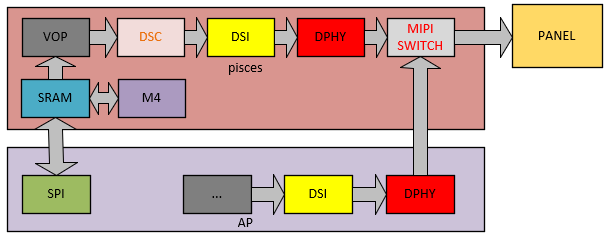
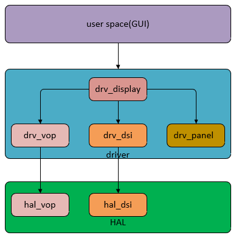
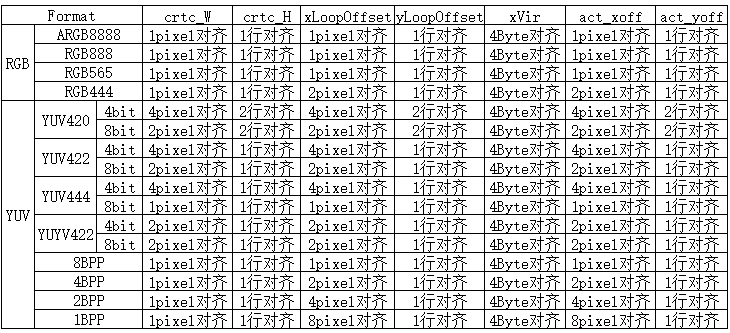
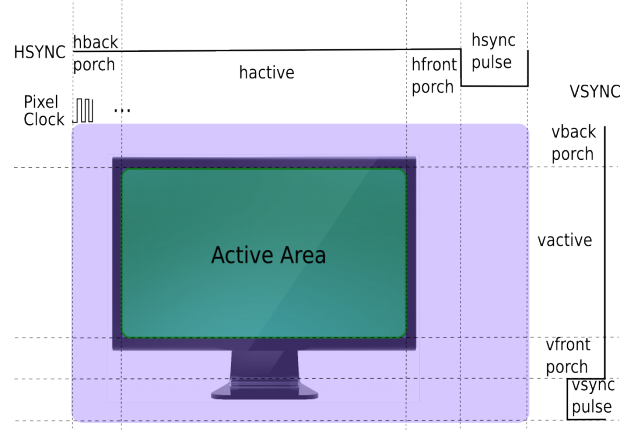
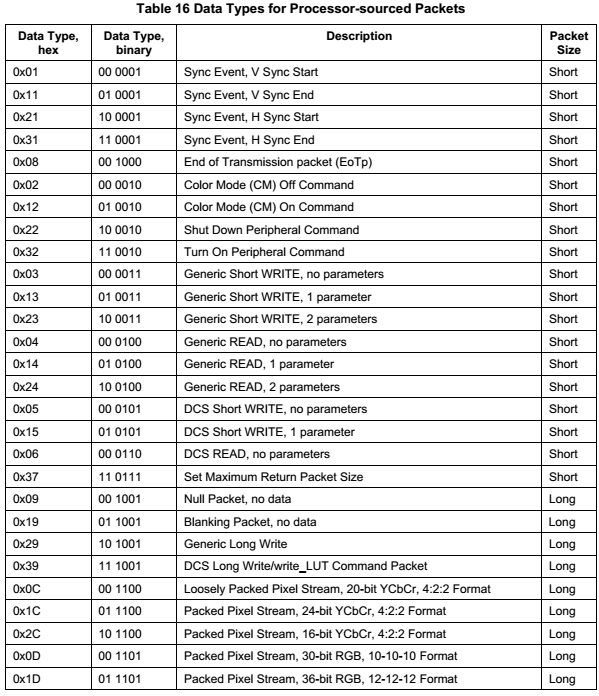
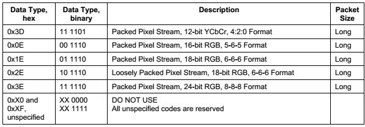
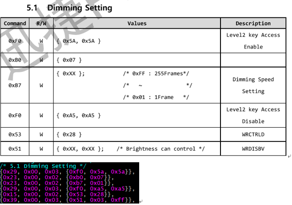
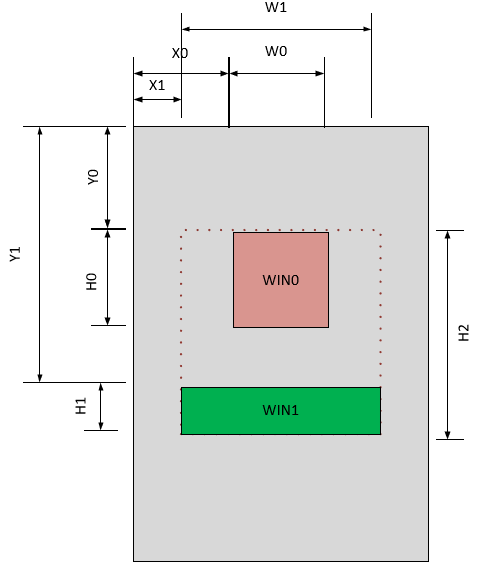
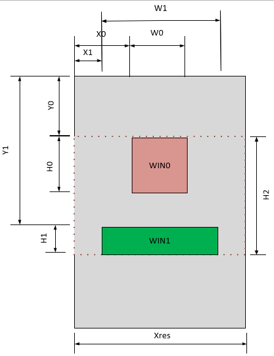

# **DISPLAY**开发指南

发布版本：1.0

作者邮箱：hjc@rock-chips.com

日期：2019.07

文件密级：公开资料

---
**前言**

**概述**

**产品版本**
| **芯片名称**            | **RT Thread 版本** |
| ----------------------- | :---------------- |
| 全部支持 RT Thread 的芯片 |                   |

**读者对象**

本文档（本指南）主要适用于以下工程师：
技术支持工程师
软件开发工程师

**修订记录**

| **日期**   | **版本** | **作者** | **修改说明**                    |
| ---------- | -------- | -------- | ------------------------------- |
| 2019-07-15 | V1.0     | 黄家钗   | 初始发布                        |
| 2019-08-15 | V1.1     | 黄家钗   | 调整格式、加入Color Key使用说明 |
|            |          |          |                                 |

---
[TOC]
---

## 1 概述

Rockchip RT-Thread 显示驱动基于 RT-Thread IO 设备驱动模型向 OS 注册 LCD 驱动，能支持 LittlevGL 等 GUI 应用，同时为了充分发挥 Rockchip 显示模块的性能，我们拓展了一些接口，加入了多图层合成、颜色效果调整、后级缩放、MIPI switch 等功能的支持。

### 1.1 基本概念

CRTC：显示控制器，在 rockchip 平台是 SOC 内部 VOP(部分文档也称为 LCDC)模块的抽象；
Plane：图层，在 rockchip 平台是 SOC 内部 VOP(LCDC)模块 win 图层的抽象；
Encoder/Connector：输出转换器的软件抽象，指 RGB、LVDS、DSI、eDP、HDMI 等显示接口， Pisces 中特指 MIPI DSI。
Panel：各种 LCD、HDMI 等显示设备的抽象；

### 1.2 显示通路



## 2 软件框架



### 2.1 Driver 层驱动文件

| **Driver** | **File**                                                     | **description**                                              |
| ---------- | ------------------------------------------------------------ | ------------------------------------------------------------ |
| Core       | bsp/rockchip-common/drivers/drv_display.c                    | rt-thread 显示框架文件，负责向 rt-thread 注册显示驱动，加载显示模块驱动，负责应用和显示驱动的对接，管理所有显示模块。 |
| VOP        | bsp/rockchip-common/drivers/drv_vop.c <br />dsp/rockchip-common/drivers/drv_vop.h | VOP 显示模块驱动                                              |
| DSI        | bsp/rockchip-common/drivers/drv_dsi.c<br />bsp/rockchip-common/drivers/drv_dsi.h | DSI/DPHY 显示模块驱动                                         |
| PANEL      | bsp/rockchip-common/drivers/drv_panel.c <br />bsp/rockchip-common/drivers/drv_panel_cfg.h | panel 驱动，抽象初始化命令，时序，电源管理等屏相关的操作。    |

### 2.2 HAL 层驱动文件

| **Driver** | **File**                                                     | **Description**            |
| ---------- | :----------------------------------------------------------- | -------------------------- |
| Core       | bsp/rockchip-common/hal/lib/hal/inc/hal_display.h            | 显示相关基础数据结构的定义 |
| VOP        | bsp/rockchip-common/hal/lib/hal/src/hal_vop.c<br />bsp/rockchip-common/hal/lib/hal/inc/hal_vop.h | VOP 模块硬件基础功能的实现  |
| DSI        | bsp/rockchip-common/hal/lib/hal/src/hal_dsi.c<br />bsp/rockchip-common/hal/lib/hal/inc/hal_dsi.h | DSI/DPHY 模块硬件功能实现   |

## 3 常用接口说明

rt-thread GUI 应用和驱动通过各种 control(类似 linux 下的 IOCTL)交互，目前扩展的 control 主要有以下几个：

| **Control**                      | **Description**                                      |
| -------------------------------- | ---------------------------------------------------- |
| RK_DISPLAY_CTRL_ENABLE           | 打开显示设备                                         |
| RK_DISPLAY_CTRL_DISABLE          | 关闭显示设备                                         |
| RK_DISPLAY_CTRL_SET_PLANE        | 设定指定图层                                         |
| RK_DISPLAY_CTRL_SET_SCALE        | 设置后级缩放                                         |
| RK_DISPLAY_CTRL_LOAD_LUT         | 配置 bpp 格式的查找表                                  |
| RK_DISPLAY_CTRL_SET_COLOR_MATRIX | 设置颜色转换矩阵                                     |
| RK_DISPLAY_CTRL_SET_GAMMA_COE    | 设置 gamma 调节系数                                    |
| RK_DISPLAY_CTRL_SET_BCSH         | 配置 bcsh 调节系数，用于调节亮度，对比度，饱和度和色度 |
| RK_DISPLAY_CTRL_SET_POST_CLIP    | 设置 clip 系数                                         |
| RK_DISPLAY_CTRL_MIPI_SWITCH      | 切换 MIPI   switch 通路                                |

## 4 关键数据结构说明

### 4.1 struct display_state

显示驱动最核心的结构体，包括了 RTT 中定义的 device 结构体和 graphic_info 以及 rockchip 平台对硬件设备抽象的结构体。

| **Parameters**                             | **Description**                            |
| ------------------------------------------ | ------------------------------------------ |
| struct rt_device_graphic_info graphic_info | RTT 驱动中描述显示设备信息的结构体          |
| struct rt_device lcd                       | LCD 设备结构体                              |
| uint32_t *rtt_framebuffer                  | RTT 驱动中 frambuffer 的地址                  |
| struct crtc_state crtc_state               | 用于描述 Rockchip 显示控制器 VOP              |
| struct connector_state conn_state          | 用于描述 Rockchip 显示转换模块 MIPI DSI       |
| struct panel_state panel_state             | 用于描述显示设备初始化命令，电源等相关信息 |
| struct DISPLAY_MODE_INFO mode              | 用于描述扫描时序等屏相关信息               |

### 4.2 struct crtc_state

用于描述 Rockchip 处理器 VOP 模块的结构体，主要包括以下信息：

| **Parameters**                          | **Description**               |
| --------------------------------------- | ----------------------------- |
| struct VOP_REG *hw_base                 | VOP 模块寄存器基地址           |
| const struct rockchip_crtc_funcs *funcs | 实现 vop 模块基本功能的函数指针 |
| struct CRTC_WIN_STATE win_state         | WIN 图层的结构                 |
| struct VOP_POST_SCALE_INFO post_scale   | 用于描述后级缩放信息          |
| uint8_t irqno                           | VOP 模块的中断号               |
| uint8_t power_state                     | 电源状态                      |

### 4.3 struct CRTC_WIN_STATE

用于描述 Rockchip 处理器 VOP 模块 WIN 图层的结构体，主要包括以下信息：

| **Parameters**           | **Description**                                              |
| ------------------------ | ------------------------------------------------------------ |
| bool winEn               | 图层控制开关 0：关闭图层，1：打开图层                         |
| uint8_t winId            | 图层制定，0,1,2 分别表示 win0,win1,win2                        |
| uint8_t zpos             | 预留                                                         |
| uint8_t format           | 格式配置，可以配置的值参考 rt-thread/include/rtdef.h          |
| uint32_t yrgbAddr        | RGBX 格式地址或者 YUV 数据 Y 分量地址                             |
| uint32_t cbcrAddr        | YUV 数据 UV 分量地址                                            |
| uint16_t xVir            | 虚宽，需要 4Byte 对齐                                          |
| uint16_t srcX            | 图层在屏上显示位置的 X 坐标                                    |
| uint16_t srcY            | 图层在屏上显示位置的 Y 坐标                                    |
| uint16_t srcW            | 图层在屏上显示的宽                                           |
| uint16_t srcH            | 图层在屏上显示的高                                           |
| uint8_t hwFormat         | 驱动转换成硬件的配置，应用层无需配置                         |
| uint16_t hwCrtcX         | 驱动转换成硬件的配置，应用层无需配置                         |
| uint16_t hwCrtcY         | 驱动转换成硬件的配置，应用层无需配置                         |
| uint16_t xLoopOffset     | X 方向 loop 配置                                                |
| uint16_t yLoopOffset     | Y 方向 loop 配置                                                |
| bool alphaEn             | alpha 使能配置                                                |
| uint8_t alphaMode        | alpha 模式，全局 alpha：VOP_ALPHA_MODE_USER_DEFINED 或者<br />per-pixel：alpha VOP_ALPHA_MODE_PER_PIXEL |
| uint8_t alphaPreMul      | 是否 alpha 预乘：YES:VOP_PREMULT_ALPHA, <br />NO:VOP_NON_PREMULT_ALPHA |
| uint8_t alphaSatMode     | 是否修改 alpha 的值：1：alpha = alpha +   alpha[7]，<br />0：alpha value no   change，建议配置为 0 |
| uint8_t globalAlphaValue | 全局 alpha 的值：0~0xff                                        |
| uint32_t *lut            | bpp 格式查找表，可以参考 display_test.c 中的定义，也可以用户自定义 |

### 4.4 struct VOP_POST_SCALE_INFO

用于描述 Rockchip 处理器 VOP 模块后级缩放的结构体，主要包括以下信息：

| **Parameters**                | **Description**                              |
| ----------------------------- | -------------------------------------------- |
| uint16_t srcW                 | 缩放源 x 方向的分辨率                          |
| uint16_t srcH                 | 缩放源 y 方向的分辨率                          |
| uint16_t dstX                 | 缩放后在屏上显示位置的 X 坐标                  |
| uint16_t dstY                 | 缩放后在屏上显示位置的 Y 坐标                  |
| uint16_t dstW                 | 缩放后在屏上显示的宽                         |
| uint16_t dstH                 | 缩放后在屏上显示的高                         |
| bool postScaleEn              | 硬件缩放使能配置，驱动做判断，应用层无需配置 |
| eVOP_PostSclMode postSclHmode | 硬件缩放倍数，驱动做计算，应用层无需配置     |
| eVOP_PostSclMode postSclVmode | 硬件缩放倍数，驱动做计算，应用层无需配置     |

### 4.5 struct VOP_BCSH_INFO

用于描述 Rockchip 处理器 VOP 模块后级 BCSH 的结构体，主要包括以下信息：

| **Parameters**     | **Description**                       |
| ------------------ | ------------------------------------- |
| uint8_t brightness | 修改亮度，配置范围 0~100，默认值为 50   |
| uint8_t contrast   | 修改对比度，配置范围 0~100，默认值为 50 |
| uint8_t satCon     | 修改饱和度，配置范围 0~100，默认值为 50 |
| uint8_t hue        | 修改色度，配置范围 0~100，默认值为 50   |

### 4.6 struct VOP_COLOR_MATRIX_INFO

用于描述 Rockchip 处理器 VOP 模块后级 color matrix 的结构体，主要包括以下信息：

| **Parameters**             | **Description** |
| -------------------------- | --------------- |
| bool colorMatrixEn         | 控制开关        |
| uint8_t *colorMatrixCoe    | 转换矩阵系数    |
| uint8_t *colorMatrixOffset | 转换矩阵偏移    |


例子：bt709tobt2020 转换矩阵：

```c
{0.6274, 0.3293, 0.0433},
{0.0691, 0.9195, 0.0114},
{0.0164, 0.0880, 0.8956}
```

按 0x80 定点后为(bit7 为符号位)

```c
coe00 = 0.6274 * 0x80  = 0x50
coe01 = 0.3293 * 0x80  = 0x2a
coe02 = 0.0433 * 0x80  = 0x05
```

同理可得：

```c
colorMatrixCoe[3][3] = {
    {0x50, 0x2a, 0x05},
    {0x05, 0x75, 0x02},
    {0x02, 0x08, 0x72}
};
```

### 4.7 struct VOP_POST_CLIP_INFO

用于描述 Rockchip 处理器 VOP 模块后级 clip 的结构体，主要包括以下信息：

| **Parameters**     | **Description** |
| ------------------ | --------------- |
| bool  postClipEn   | 控制开关        |
| uint8_t postYThres | 需要 clip 的值    |

## 5 对齐要求

### 5.1 数据对齐要求



### 5.2 屏对齐要求

有些屏本身有对齐要求，以 S6E3HC2 屏为例：

配置为 1440x3120 的时候 DSC 的 slice 大小为 720x65，所以区域刷新时显示的位置需要按720x65对齐，显示区域的大小需要按 720x195 对齐；

配置为 720x1560 的时候 DSC 的 slice 大小为 360x52，所以区域刷新时显示的位置需要按 360x52 对齐，显示区域的大小需要按360x390对齐。

## 6 屏配置说明

### 6.1 选择驱动已支持的屏

按以下通路选择对应屏的配置文件：

```shell
cd bsp/rockchip-pisces
    scons --menuconfig
        RT-Thread rockchip common drivers  --->
            Panel Type (R17 SS mipi panel, resolution is 1080x2340)  --->
```

### 6.2 增加一块新的屏支持

1. 进入屏配置文件目录：cd bsp/rockchip-common/drivers/panel_cfg；

2. 拷贝当前目录下的一个.h 文件 new_panel.h，参考本文 6.4 章节并根据屏 spec 的定义，修改文件中屏的配置参数；

3. 回到上一级目录 cd ../;即目录 bsp/rockchip-common/drivers/目录下；

4. 打开 Kconfig 文件 ，搜索”Panel Type”,参考其他 config RT_USING_PANEL_配置定义新屏的配置 RT_USING_PANEL_NEW_PANEL；


### 6.3 常见的扫描时序图



### 6.4 屏配置参数说明

| **Parameters**                | **Description**                              |
| ----------------------------- | -------------------------------------------- |
| RT_HW_LCD_XRES                | 屏水平方向分辨率，对应 6.3 图中的 hactive    |
| RT_HW_LCD_YRES                | 屏垂直方向分辨率，对应 6.3 图中的 vactive    |
| RT_HW_LCD_PIXEL_CLOCK         | 像素时钟，单位 khz                           |
| RT_HW_LCD_LANE_MBPS           | MIPI DPHY CLK Lane 时钟，单位 Mbps           |
| RT_HW_LCD_LEFT_MARGIN         | 屏左消隐，对应 6.3 图中的 hback-porch        |
| RT_HW_LCD_RIGHT_MARGIN        | 屏右消隐，对应 6.3 图中的 hfront-porch       |
| RT_HW_LCD_UPPER_MARGIN        | 屏上消隐，对应 6.3 图中的 vback-porch        |
| RT_HW_LCD_LOWER_MARGIN        | 屏下消隐，对应 6.3 图中的 vfront-porch       |
| RT_HW_LCD_HSYNC_LEN           | 屏水平同步时间，对应 6.3 图中的 hsync-porch  |
| RT_HW_LCD_VSYNC_LEN           | 屏垂直同步时间，对应 6.3 图中的 vsync-porch  |
| RT_HW_LCD_CONN_TYPE           | 屏的类型，如： RK_DISPLAY_CONNECTOR_DSI      |
| RT_HW_LCD_BUS_FORMAT          | 屏的接口类型，如： MEDIA_BUS_FMT_RGB888_1X24 |
| RT_HW_LCD_VMODE_FLAG          | 屏的极性、是否支持 DSC 配置等                |
| RT_HW_LCD_INIT_CMD_TYPE       | CMD 类型， CMD_TYPE_DEFAULT 默认为 mipi CMD  |
| RT_HW_LCD_DISPLAY_MODE        | CMD 模式和 video 模式选择                    |
| RT_HW_LCD_AREA_DISPLAY        | 是否支持区域刷新                             |
| RT_HW_LCD_XACT_ALIGN          | 屏显示区域宽对齐要求，单位为像素             |
| RT_HW_LCD_YACT_ALIGN          | 屏显示区域高对齐要求，单位为像素             |
| RT_HW_LCD_XPOS_ALIGN          | 屏显示区域X坐标对齐要求，单位为像素          |
| RT_HW_LCD_YPOS_ALIGN          | 屏显示区域Y坐标对齐要求，单位为像素          |
| struct rockchip_cmd cmd_on[]  | 屏初始化命令                                 |
| struct rockchip_cmd cmd_off[] | 屏反初始化命令                               |

### 6.5 屏初始化命令说明

1. 下面以 MIPI DSI CMD 为例说明：


前 3 个字节（16 进制），分别代表 Data Type，Delay，Payload Length。从第四个字节开始的数据代表长度为 Length 的实际有效 Payload.

2. 第一条命令的解析如下：


Data Type：0x05 (DCS Short Write)
Delay：0x05 (5 ms)
Payload Length：0x01 (1 Bytes)
Payload：0x11

3. 第二条命令解析如下：


Data Type：0x29 (Gereric Long Write)
Delay：0x00 (0 ms)
Payload Length：0x03 (3 Bytes)
Payload：0xf0 0x5a 0x5a

4. Data Type 定义





5. DCS Write


DCS packet 包括一个字节的 dcs 命令，以及 n 个字节的 parameters。
如果 n < 2，将以 Short Packet 的形式对 Payload 进行打包。n = 0，表示只发送 dcs 命令，不带参数，Data Type 为 0x05；n = 1，表示发送 dcs 命令，带一个参数，Data Type 为 0x15。
如果 n >= 2，将以 Long Packet 的形式对 Payload 进行打包。此时发送 dcs 命令，带 n 个参数，Data Type 为 0x39。

6. Generic Write


Gerneic Packet 包括 n 个字节的 parameters。
如果 n < 3，将以 Short Packet 的形式对 Payload 进行打包。n = 0，表示 no parameters，Data Type 为 0x03；n = 1，表示 1 parameter，Data Type 为 0x13；n = 2，表示 2 parameters，Data Type 为 0x23。
如果 n >= 3，将以 Long Packet 的形式进行对 Payload 打包，表示 n parameters，Data Type 为 0x29。

7. Delay

表示当前 Packet 发送完成之后，需要延时多少 ms，再开始发送下一条命令。

8. Payload Length

表示 Packet 的有效负载长度。

9. Payload

表示 Packet 的有效负载，长度为 Payload Length。

10. Example



## 7 显示测试 demo

### 7.1 display_test 支持的测试 case

使用命令:

```c
display_test cmd
dsc; winloop; winmove; winalpha; scale; coe;  bcsh; gamma; clip; mipi_switch; ebook; color_bar
```

| **CMD**     | **Description**                           |
| ----------- | ----------------------------------------- |
| winloop     | 测试图层 loop 功能                          |
| winmove     | 测试图层的移动                            |
| dsc         | 根据 2k 屏 dsc 对齐要求测试区域刷新           |
| winalpha    | 测试图层 alpha 功能                         |
| scale       | 测试后级缩放功能                          |
| coe         | 测试验证转换转换功能，demo 中使用 709to2020 |
| bcsh        | 测试 bcsh 改变亮度、对比度、饱和度、色度    |
| gamma       | 通过 gamma 曲线改变显示效果                 |
| clip        | 测试 clip 功能                              |
| mipi_switch | 测试 mipi switch 功能                       |
| ebook       | 显示 1bpp 格式图片的电子书 demo              |
| color_bar   | 显示 color_bar loop 的 demo                  |

### 7.2 demo 说明

1. LCD 设备

```c
g_display_dev = rt_device_find("lcd");
RT_ASSERT(g_display_dev != RT_NULL);
```

2. 打开 lcd 设备

```c
ret = rt_device_open(g_display_dev, RT_DEVICE_FLAG_RDWR);
RT_ASSERT(ret == RT_EOK);
```

3. 使能 lcd 设备

```c
ret = rt_device_control(g_display_dev, RK_DISPLAY_CTRL_ENABLE, NULL);
RT_ASSERT(ret == RT_EOK);
```

4. 获得屏相关信息

```c
ret = rt_device_control(g_display_dev, RTGRAPHIC_CTRL_GET_INFO, (void *)graphic_info);
RT_ASSERT(ret == RT_EOK);
```

5. 初始化 win_config, post_scale 配置信息

- win_config 的初始化：

```c
static void display_win_init(struct CRTC_WIN_STATE *win_config)
{
    win_config->winEn = true;
    win_config->winId = 0;
    win_config->zpos  = 0;
    win_config->format   = SRC_DATA_FMT;
    win_config->yrgbAddr = (uint32_t)rtt_framebuffer_test;
    win_config->cbcrAddr = (uint32_t)rtt_framebuffer_uv;
    win_config->yrgbLength = 0;
    win_config->cbcrLength = 0;
    win_config->xVir = SRC_DATA_W;
    win_config->srcX = 0;
    win_config->srcY = 0;
    win_config->srcW = SRC_DATA_W;
    win_config->srcH = SRC_DATA_H;
    win_config->crtcX = 0;
    win_config->crtcY = 0;
    win_config->crtcW = SRC_DATA_W;
    win_config->crtcH = SRC_DATA_H;
    win_config->xLoopOffset = 0;
    win_config->yLoopOffset = 0;
}
```

- post_scale 初始化（全屏显示不缩放）

```c
static void display_post_init(struct CRTC_WIN_STATE *win_config,
                              struct VOP_POST_SCALE_INFO *post_scale,
                              struct rt_device_graphic_info *graphic_info)
{
    post_scale->srcW = graphic_info->width;
    post_scale->srcH = graphic_info->height;
    post_scale->dstX = 0;
    post_scale->dstY = 0;
    post_scale->dstW = graphic_info->width;
    post_scale->dstH = graphic_info->height;
}
```

- post_scale 初始化（区域刷新水平和垂直分别做 2 倍放大）

```c
static void display_post_init(struct CRTC_WIN_STATE *win_config,
                              struct VOP_POST_SCALE_INFO *post_scale,
                              struct rt_device_graphic_info *graphic_info)
{
    post_scale->srcW = graphic_info->width / 2;
    post_scale->srcH = win_config->srcH;
    post_scale->dstX = 0;
    post_scale->dstY = 0;
    post_scale->dstW = graphic_info->width;
    post_scale->dstH = win_config->srcH * 2;
}
```

6. 如果是 bpp 格式图片，load lut 调色板，如果不是 bpp 格式可以忽略

```c
ret = rt_device_control(g_display_dev, RK_DISPLAY_CTRL_LOAD_LUT, &lut_state);
RT_ASSERT(ret == RT_EOK);
```

7. 配置 post_scale 确认缩放前的数据大小和缩放后显示的大小

```c
ret = rt_device_control(g_display_dev, RK_DISPLAY_CTRL_SET_SCALE, post_scale);
RT_ASSERT(ret == RT_EOK);
```

8. 配置 win_config 图层信息

```c
ret = rt_device_control(g_display_dev, RK_DISPLAY_CTRL_SET_PLANE, win_config);
RT_ASSERT(ret == RT_EOK);
```

9. 提交显示

```c
ret = rt_device_control(g_display_dev, RK_DISPLAY_CTRL_COMMIT, NULL);
RT_ASSERT(ret == RT_EOK);
```

显示一帧的流程可以参考以上步骤 1 到步骤 9 执行，如果是刷新多帧，可以在修改 win_config 和 post_scale 配置 后重复执行步骤 7、8、9。

### 7.3 区域刷新坐标配置说明

1. 同时支持 X 和 Y 方向区域刷新屏的配置 demo



- 红色区域为 win0 图层，坐标为(X0,Y0),大小为(W0,H0),此时配置:

```c
win_config->winId = 0;
win_config->winEn = 1;
……
win_config->srcX = X0;
win_config->srcY = Y0;
win_config->srcW = W0;
win_config->srcH = H0;
```

- 绿色区域为 win1 图层，坐标为(X1,Y1),大小为(W1,H1),此时配置:

```c
win_config->winId = 1;
win_config->winEn = 1;
……
win_config->srcX = X1;
win_config->srcY = Y1;
win_config->srcW = W1;
win_config->srcH = H1;
```

- 后级缩放配置

```c
post_scale->srcW = W1;
post_scale->srcH = H2;
post_scale->dstX = X1;
post_scale->dstY = Y0;
post_scale->dstW = W1;
post_scale->dstH = H2;
```

- 实际配置显示的代码中要求先配置后级的缩放参数：

```c
ret = rt_device_control(g_display_dev, RK_DISPLAY_CTRL_SET_SCALE, post_scale);
RT_ASSERT(ret == RT_EOK);
```

- 然后调用 WIN0, WIN1 的配置：

```c
ret = rt_device_control(g_display_dev, RK_DISPLAY_CTRL_SET_PLANE, win_config);
RT_ASSERT(ret == RT_EOK);
```

- 最后提交显示：

```c
ret = rt_device_control(g_display_dev, RK_DISPLAY_CTRL_COMMIT, NULL);
RT_ASSERT(ret == RT_EOK);
```

2. 只支持 Y 方向不支持 X 方向区域刷新配置 demo



- 红色区域为 win0 图层，坐标为(X0,Y0),大小为(W0,H0),此时配置:

```c
win_config->winId = 0;
win_config->winEn = 1;
……
win_config->srcX = X0;
win_config->srcY = Y0;
win_config->srcW = W0;
win_config->srcH = H0;
```

- 绿色区域为 win1 图层，坐标为(X1,Y1),大小为(W1,H1),此时配置:

```c
win_config->winId = 1;
win_config->winEn = 1;
……
win_config->srcX = X1;
win_config->srcY = Y1;
win_config->srcW = W1;
win_config->srcH = H1;
```

- 后级缩放配置

```c
post_scale->srcW = Xres;
post_scale->srcH = H2;
post_scale->dstX = 0;
post_scale->dstY = Y0;
post_scale->dstW = Xres;
post_scale->dstH = H2;
```

- 由于不支持 X 方向的区域刷新，所以和 1 中的对比，post scale 的 src 和 dstW 都配置为屏实际的宽 Xres，dstX 配置为 0，其他的和 1 中的步骤一致：
  实际配置显示的代码中要求先配置后级的缩放参数：

```c
ret = rt_device_control(g_display_dev, RK_DISPLAY_CTRL_SET_SCALE, post_scale);
RT_ASSERT(ret == RT_EOK);
```

- 然后调用 WIN0, WIN1 的配置：

```c
ret = rt_device_control(g_display_dev, RK_DISPLAY_CTRL_SET_PLANE, win_config);
RT_ASSERT(ret == RT_EOK);
```

- 最后提交显示：

```c
ret = rt_device_control(g_display_dev, RK_DISPLAY_CTRL_COMMIT, NULL);
RT_ASSERT(ret == RT_EOK);
```

## 8 Color Key使用说明

VOP支持关键色全透的效果即指定图层中某一种颜色实现透视到下一图层或者背景层的效果，驱动提供win_config中的colorKey参数用来配置color key功能，其中bit[23, 0]分别表示RGB三个分量的关键色数据，bit24用来表示打开或者关闭color key功能。

下面分别以RGB888和RGB565两中格式说明color key配置方法，R_VAL，G_VAL，B_VAL分别表示要透视的RGB三个分量的值：

```c
#define COLOR_KEY_EN	BIT(24)
```

### 8.1 RGB888格式配置Color Key的方法

1. 实现红色全透，配置:

```c
win_config->colorKey = 0xFF0000 | COLOR_KEY_EN;
```

2. 实现绿色全透，配置:

```c
win_config->colorKey = 0x00FF00 | COLOR_KEY_EN;
```

3. 实现蓝色全透，配置:

```c
win_config->colorKey = 0xf0000FF | COLOR_KEY_EN;
```

即:

```c
win_config->colorKey = (R_VAL << 16) | (G_VAL << 8) | (B_VAL) | COLOR_KEY_EN;
```

### 8.2 RGB565格式配置Color Key的方法

1. 实现红色全透，配置：

```c
win_config->colorKey = 0xF80000 | COLOR_KEY_EN;
```

2. 实现绿色全透，配置：

```c
win_config->colorKey = 0x00FC00 | COLOR_KEY_EN;
```

3. 实现蓝色全透，配置：

```c
win_config->colorKey = 0x0000F8 | COLOR_KEY_EN;
```

即:

```c
R_VAL_CONFIG = R_VAL << 3;  //R[4,0] -> R[7,0]

G_VAL_CONFIG = G_VAL << 2;  //G[5,0] -> G[7,0]

B_VAL_CONFIG = B_VAL << 3;  //B[4,0] -> B[7,0]

win_config->colorKey = (R_VAL_CONFIG  << 16) | (G_VAL_CONFIG << 8) | B_VAL_CONFIG  | COLOR_KEY_EN;
```

### 8.3 关闭Color Key的方法

```c
win_config->colorKey = 0;
```

## 9 参考文档

(1) Rockchip DRM Display Driver Development Guide
(2) Rockchip_DRM_Panel_Porting_Guide.pdf