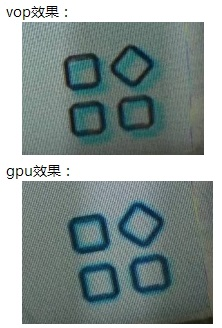

# Rockchip VOP Notes

文件标识：RK-KF-YF-086

发布版本：V1.0.0

日期：2020-05-20

文件密级：□绝密   □秘密   ■内部资料   □公开

---

**免责声明**

本文档按“现状”提供，福州瑞芯微电子股份有限公司（“本公司”，下同）不对本文档的任何陈述、信息和内容的准确性、可靠性、完整性、适销性、特定目的性和非侵权性提供任何明示或暗示的声明或保证。本文档仅作为使用指导的参考。

由于产品版本升级或其他原因，本文档将可能在未经任何通知的情况下，不定期进行更新或修改。

**商标声明**

“Rockchip”、“瑞芯微”、“瑞芯”均为本公司的注册商标，归本公司所有。

本文档可能提及的其他所有注册商标或商标，由其各自拥有者所有。

**版权所有© 2020福州瑞芯微电子股份有限公司**

超越合理使用范畴，非经本公司书面许可，任何单位和个人不得擅自摘抄、复制本文档内容的部分或全部，并不得以任何形式传播。

福州瑞芯微电子股份有限公司

Fuzhou Rockchip Electronics Co., Ltd.

地址：     福建省福州市铜盘路软件园A区18号

网址：     [www.rock-chips.com](http://www.rock-chips.com)

客户服务电话： +86-4007-700-590

客户服务传真： +86-591-83951833

客户服务邮箱： [fae@rock-chips.com](mailto:fae@rock-chips.com)

---

**前言**

本文主要对 Rockchip 各平台 VOP 模块的一些特殊 feature 或者已知 bug 做下备忘录，这样可以对这些 bug 有更好的追踪，同时也方便其他图形、显示模块开发工程师对 VOP 模块使用上的限制有清楚的了解。

**概述**

**读者对象**

本文档（本指南）主要适用于以下工程师：

Rockchip 图形/显示模块开发工程师

**修订记录**

| **版本** | **作者** | **日期**   | **修改说明** |
| --------- | --------- | ---------- | -------------- |
|  V1.0.0   | 黄家钗 | 2020-05-20 | 初始版本     |
|  |  |  |  |

---

[TOC]

---

## 1 VOP 架构版本

目前 Rockchip 平台 VOP 模块主要区分 full 架构和 lite 架构，lite架构是 Rockchip 平台第一代视频输出处理模块，最大可以支持到 2k 分辨率；full 架构基于 lite 架构做了全新设计和升级，最大可以支持到 4k 分辨率。

以下是各个平台 VOP 的版本信息：

| VOP 架构 | SOC                                                          |
| -------- | ------------------------------------------------------------ |
| VOP lite | RK3066/PX2/RK3188/PX3/RK3036/RK312X/PX3se/Sofia 3G-R/RV1108/RK3326/PX30/<br/>RK3308/RK1808/RK2108/RV1109/RV1126 |
| VOP full | RK322X/RK332X/RK322XH/RK3368/PX5/RK3399                      |

## 2 VOP lite 版本共性问题

1. 鼠标层不支持虚宽；
2. 更新 lut 寄存器需要先 disable lut，无法动态更新；
3. 不支持像素小于等于 2x2 的缩放，和 IC 确认现有平台图层的最小尺寸规格统一为 4x4；
4. 不支持 alpha+scale 模式；
5. 不支持 global alplha * pixel alpha 模式；

## 3 VOP full 版本共性问题

1. 鼠标层不支持虚宽；

2. 更新 lut 寄存器需要先 disable lut，无法动态更新；

3. 不支持像素小于等于 2x2 的缩放，和IC确认现有平台图层的最小尺寸规格统一为 4x4；

4. AFBDC/IFBDC 不支持 4K 输入；

5. 4K 分辨率情况下不支持缩放，导致 HDMI 3840 和 4096 分辨率之间切换时无法做到点对点显示；

6. YUV420 数据显示出现 uv 错位问题，和 IC 确认是由于 VOP 做 YUV420 上采样到 YUV444 导致 uv 数据偏移，通过 SCL_OFFSET 调整 uv offset 稍有改善但是和走 GPU 合成对比效果差距明显，以下是具体效果：

   

## 4 各平台特殊问题

### 4.1 RK3288

1. auto gating 功能和 bcsh 功能无法同时使用，否则帧中断无法产生，该问题在  RK3288W 上已修正；

2. yuv 切到 rgb 需要软件对图层缩放相关寄存器做复位处理,修改方法：

   ```c
	static void vop_win_disable(struct vop *vop, struct vop_win *win)
	{
	    ……
   	/*
   	 * FIXUP: some of the vop scale would be abnormal after windows power
   	 * on/off so deinit scale to scale_none mode.
   	 */
   	if (win->phy->scl && win->phy->scl->ext) {
	        VOP_SCL_SET_EXT(vop, win, yrgb_hor_scl_mode, SCALE_NONE);
	        VOP_SCL_SET_EXT(vop, win, yrgb_ver_scl_mode, SCALE_NONE);
	        VOP_SCL_SET_EXT(vop, win, cbcr_hor_scl_mode, SCALE_NONE);
	        VOP_SCL_SET_EXT(vop, win, cbcr_ver_scl_mode, SCALE_NONE);
	}
		……
	}
   ```

3. 部分版本的芯片 aclk 和 dclk 有同源的要求，在 pll 驱动中有做版本判断；

4. 不支持 interlace 的时序；

5. 多区域在带宽不够的情况下会出现 pagefault 问题；

6. 多区域限制：

   (1) 同一扫描线 上只能有一个区域；

   (2) 多区域不能重叠；

   (3) 多区域需要从上到下排列；

   (4) 多区域只能为相同的格式；

   (5) 按区域1-2-3-4顺序使用；

   (6) 可以支持的使用范例：

    

### 4.2 RK3036

1. win1 支持缩放但不支持 yuv 格式，最大只能支持 720p 输入，win0 最大可以支持 yuv/rgb 1080p 输入；

### 4.3 RK3128/PX3SE

1. mmu 的寄存器可以写但是不能读，dts 按如下配置，mmu 驱动不去读 iommu 寄存器：

	```c
	&vop_mmu {
		rockchip,skip-mmu-read;
	};
	```

### 4.4 RK322X

1. 图层 RGB 和 YUV 数据切换有问题，rk fb 框架的处理方法是在切换过程通过 win_dbg 寄存器插入一帧黑色的效果来规避，但 drm 框架下目前还未复现到该问题， rk fb 显示框架的修改记录 :

   ```c
   commit 59aa2f2b327032eb78aa3b125737faba32f3e173
   Author: Mark Yao <mark.yao@rock-chips.com>
   Date:   Thu Jan 7 14:57:01 2016 +0800

       video: rk322x: fix video flash green lines

       rk322x have a bug on windows 0 and 1:

       When switch win format from RGB to YUV, would flash some green
       lines on the top of the windows.

       Use bg_en show one blank frame to skip the error frame.

       Change-Id: I546e2971103002bcd754bd50bf1f5224410200c4
       Signed-off-by: Mark Yao <mark.yao@rock-chips.com>
   ```

### 4.5 RK322XH/RK332X

1. layer2 和 layer1 无法同时打开 global alpha 和 per-pixelalpha；

2. layer2 需要包含于 layer1；

3. HDR 视频只能在最顶层；

4. level2_overlay_en、alpha_hard_calc 寄存器为立即生效，会出现配置这2个寄存器的时候显示异常，目前是将这2个寄存器的配置挪到帧中断处理函数中，修改如下：

   ```c
   static irqreturn_t vop_isr(int irq, void *data)
   {
   ……
   	/* This is IC design not reasonable, this two register bit need
   	 * frame effective, but actually it's effective immediately, so
   	 * we config this register at frame start.
   	 */
   	spin_lock_irqsave(&vop->irq_lock, flags);
   	VOP_CTRL_SET(vop, level2_overlay_en, vop->pre_overlay);
   	VOP_CTRL_SET(vop, alpha_hard_calc, vop->pre_overlay);
   	spin_unlock_irqrestore(&vop->irq_lock, flags);
   ……
   }
   ```

### 4.6 RK3368/PX5

1. 后级 bcsh 的 csc 转换精度太低 [6bit]，打开 bcsh 后出现色阶问题；

2. 1080i 模式下时序不对；

3. 多区域限制：

   (1) 多区域不能重叠；

   (2) 按区域1-2-3-4顺序使用；

   (3) 多区域需要从左到右排列；

   (4) 可以支持的使用范例：

   

4. ifbdc 限制

   (1) 图层源数据不支持 xoffset、yoffset；

   (2) 图层源数据的大小需要按 16x8 对齐；

   (3) 地址需要 64 byte 对齐；

### 4.7 RK3399

1. 多区域限制

   (1) 多区域不能重叠；

   (2) 按区域1-2-3-4顺序使用；

   (3) 多区域需要从左到右排列；

   (4) 可以支持的使用范例：

   

2. afbdc限制

   (1) 图层源数据不支持 xoffset、yoffset；

   (2) 图层源数据的大小需要按 16x8 对齐；

### 4.8 RK3326/PX30

1. 打开 win2 多区域，在带宽不够的时候出现 iommu pagefault 异常问题，从 log 看有两种异常：

   (1) 访问不该访问的地址

   ​	IC 分析，由于该版 vop 多区域复用一个 dma，在带宽不够的时候可能会出现继续访问上一帧的情况，所以软件上在关闭图层的同时将图层对应的地址配置到0地址，该问题 fix，修改记录：

   ```c
   static void vop_plane_atomic_disable(struct drm_plane *plane, struct drm_plane_state *old_state)
   {
   ……
   /*
    * IC design bug: in the bandwidth tension environment when close win2,
    * vop will access the freed memory lead to iommu pagefault.
    * so we add this reset to workaround.
    */
   if (VOP_MAJOR(vop->version) == 2 && VOP_MINOR(vop->version) == 5 && win->win_id == 2)
   	VOP_WIN_SET(vop, win, yrgb_mst, 0);
   ……
   }
   ```

(2) 越界访问
​	处理方法： 没有找到根本原因， 产品上尽量不要出现带宽不够的情况，IC 需要继续分析，目前还没结论。

2. 单屏显示最大可以支持 1200x1920，双屏显示最大支持 720p，否则会出现系统带宽不够问题；

3. afbdc 显示

   (1) 支持图层源数据的 xoffset、yoffset，源数据大小需要按 16x8 对齐；

   (2) afbdc 数据只能送到 win1；

4. mcu + dither 场景在一个 wr cycle 中会出现 mcu_total个dither 数据，可能会出现显示横条纹的现象；

5. 多区域限制：

   (1) 同一扫描线 上只能有一个区域；

   (2) 多区域不能重叠；

   (3) 多区域需要从上到下排列；

   (4) 多区域只能为相同的格式；

   (5) 按区域1-2-3-4顺序使用；

   (6) 可以支持的使用范例：

    

### 4.9 RK1808

1. vop lite 只有 win1 图层，且不支持缩放，在产品中限制较多；

### 4.10 RV1109/RV1126

1. mcu + dither 场景在一个 wr cycle 中会出现 mcu_total个dither 数据，可能会出现显示横条纹的现象；
2. BT656 输出只有 EAV 没有 SAV，可能导致在一些 BT656 输入模块无法识别。