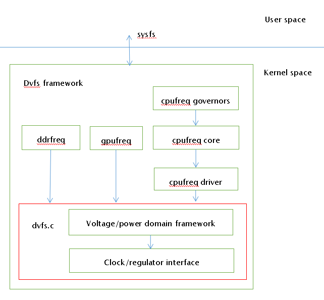

# CPUF-DVFS 开发指南

文件标识：RK-KF-YF-012

发布版本：V1.0.1

日期：2021-05-27

文件密级：□绝密   □秘密   □内部资料   ■公开

**免责声明**

本文档按“现状”提供，瑞芯微电子股份有限公司（“本公司”，下同）不对本文档的任何陈述、信息和内容的准确性、可靠性、完整性、适销性、特定目的性和非侵权性提供任何明示或暗示的声明或保证。本文档仅作为使用指导的参考。

由于产品版本升级或其他原因，本文档将可能在未经任何通知的情况下，不定期进行更新或修改。

**商标声明**

“Rockchip”、“瑞芯微”、“瑞芯”均为本公司的注册商标，归本公司所有。

本文档可能提及的其他所有注册商标或商标，由其各自拥有者所有。

**版权所有 © 2021 瑞芯微电子股份有限公司**

超越合理使用范畴，非经本公司书面许可，任何单位和个人不得擅自摘抄、复制本文档内容的部分或全部，并不得以任何形式传播。

瑞芯微电子股份有限公司

Rockchip Electronics Co., Ltd.

地址：     福建省福州市铜盘路软件园A区18号

网址：     [www.rock-chips.com](http://www.rock-chips.com)

客户服务电话： +86-4007-700-590

客户服务传真： +86-591-83951833

客户服务邮箱： [fae@rock-chips.com](mailto:fae@rock-chips.com)

---

**前言**

**概述**

本章主要描述 CPUFreq-DVFS 的相关的重要概念、配置方法和调试接口。

**产品版本**

| **产品名称** | **内核版本** |
| ------------ | ------------ |
| RK312x       | Linux3.10    |
| RK322x       | Linux3.10    |
| RK3288       | Linux3.10    |
| RK3368       | Linux3.10    |
| RK3328       | Linux3.10    |

**读者对象**

本文档（本指南）主要适用于以下工程师：

技术支持工程师

软件开发工程师

**修订记录**

| **版本号** | **作者**  | **修改日期** | **修改说明**           |
| ---------- | --------- | ------------ | ---------------------- |
| V1.0.0     | 肖锋/陈亮 | 2017-02-17   | 初始版本               |
| V1.0.1     | 黄莹      | 2021-05-27   | 修改格式，增加版权信息 |

---

**目录**

[TOC]

---

## 重要概念

在 CMOS 电路中功率消耗主要可以分为动态功率消耗和静态功率消耗，公式如下：


其中 C 代表负载电容的容值，V 是工作电压，α 是当前频率下的翻转率，f 为工作频率，I\_dq 代表静态电流。公式的前部分代表的是动态功率消耗，后部分则代表的是静态功率消耗。从公式中可以看出，想要降低动态功率消耗可以从 C、V、α、f 着手，对于软件来讲常用的调节方式只涉及到 V、f 两个因素。

DVFS（Dynamic Voltage and Frequency Scaling）动态电压频率调节，是一种实时的电压和频率调节技术。目前 Rockchip Linux3.10 内核中支持 DVFS 的模块有 CPU、GPU、DDR。

CPUFreq 是内核开发者定义的一套支持动态调整 CPU 频率的框架模型。它能有效的降低 CPU 的功耗，同时兼顾 CPU 的性能。

CPUFreq 通过不同的变频管理器，选择一个合适的频率供 CPU 使用，目前的内核版本提供了以下几种变频管理器：

- interactive：根据 CPU 负载动态调频调压；

- conservative：保守策略，逐级调整频率和电压；

- ondemand：根据 CPU 负载动态调频调压，比 interactive 策略反应慢；

- userspace：用户自己设置电压和频率，系统不会自动调整；

- powersave：功耗优先，始终将频率设置在最低值；

- performance：性能优先，始终将频率设置为最高值。

DVFS 为 CPUFreq 提供了底层驱动，CPUFreq-DVFS framework 如下：



Voltage domain 表示电压域，可以独立调节电压，简称 VD。

Power domain 表示电源域，只能开关，电压大小等于 VD 的电压，简称 PD。一个 VD 包括一个或多个 PD，一个 PD 又包含一个或多个 Module。

Opp-table 表示频率电压表，支持 DVFS 的模块都有一个 opp-table 来描述各个频率点需要的运行电压。

Voltage/power domain framework 如下：


## 配置方法

### DVFS 节点介绍

DVFS 的主要设计思路是：一个 VD 下面可以包括多个 PD，一个 PD 下面可以包含多个 CLK，每个 CLK 对应的模块，都有一个需求电压，但是一个 VD 最终只有一个电压值，为了满足它下面所以模块的需求，调节电压时，需要遍历 VD 下面的所有模块，找到最大电压值。

目前常用的 VD 有三种：vdd\_arm、vdd\_gpu 和 vdd\_logic，vdd\_arm 给 arm 核供电，vdd\_gpu 给 gpu 供电，vdd\_logic 给 soc 的各个外设供电，包括 DDR\\I2C\\USB\\GMAC 等。由于电源设计方案的不同，可能会把这三个 VD 合并在一起，在配置 DVFS 节点的时候，常见的有如下几种情况：

#### CPU、GPU、DDR 三路分开供电

比如 RK3288 上，CPU 使用 vdd\_arm 供电，GPU 使用 vdd\_gpu 供电，DDR 使用 vdd\_logic 供电，所以 dvfs 节点下有三个并列的子节点，如下：

```c
arch/arm/boot/dts/rk3288.dtsi
dvfs {
    vd_arm: vd_arm {
        regulator_name = "vdd_arm";
        pd_core {
            clk_core_dvfs_table: clk_core {
            };
        };
    };
    vd_logic: vd_logic {
        regulator_name = "vdd_logic";
        pd_ddr {
            clk_ddr_dvfs_table: clk_ddr{
            };
        };
    };
    vd_gpu: vd_gpu {
        regulator_name = "vdd_gpu";
        pd_gpu {
            clk_gpu_dvfs_table: clk_gpu {
            };
        };
    };
};

```

#### CPU 单独供电，GPU 和 DDR 共用一路供电

比如 RK312X 上，CPU 使用 vdd\_arm 供电，GPU 和 DDR 共同使用 vdd\_logic 供电，如下：

```c
dvfs {
    vd_arm: vd_arm {
        regulator_name = "vdd_arm";
        pd_core {
            clk_core_dvfs_table: clk_core {
            };
        };
    };
    vd_logic: vd_logic {
        regulator_name = "vdd_logic";
        pd_ddr {
            clk_ddr_dvfs_table: clk_ddr {
            };
        };
        pd_gpu {
            clk_gpu_dvfs_table: clk_gpu {
            };
        };
    };
};

```

#### CPU、GPU 和 DDR 三路共用一路供电

```c
比如RK3126 86V的样机上，CPU、GPU和DDR共同使用vdd\_arm供电，如下：
arch/arm/boot/dts/rk3126-86v.dts
dvfs {
    vd_arm: vd_arm {
        regulator_name = "vdd_arm";
        pd_core {
            clk_core_dvfs_table: clk_core {
            };
        };
        pd_ddr {
            clk_ddr_dvfs_table: clk_ddr {
            };
        };
        pd_gpu {
            clk_gpu_dvfs_table: clk_gpu {
            };
        };
    };
};

```

### CPU DVFS 节点配置

CPU DVFS 节点包含频率电压表、leakage 调压（可选）、pvtm 调压（可选）和温控。

```c
clk_core_dvfs_table: clk_core {
    /* 正常的频率电压表 */
    operating-points = <
        /* KHz    uV */
        408000 900000
        600000 900000
        696000 950000
        816000 1000000
        1008000 1050000
        1200000 1100000
        >;
    /*
      支持根据pvtm调整电压表。（可选）
      如果增加了以下两个属性，即使support-pvtm 为0，
      operating-points中的电压表都无效，使用pvtm-operating-points
      中的电压表。如果support-pvtm为1，则代码中还会根据pvtm值
      调整电压表。
    */
    support-pvtm = <0>;
    pvtm-operating-points = <
        /* KHz    uV    margin(uV)*/
        408000 900000   25000
        600000 900000   25000
        696000 950000   25000
        816000 1000000  25000
        1008000 1050000 25000
        1200000 1100000 25000
        >;

    /* 支持根据leakage调整电压表。（可选） */
    lkg_adjust_volt_en = <1>;   /* 1表示开启调整电压表功能，0 关闭 */
    channel = <0>;              /* 0表示获取cpu的leakage 值 */
    def_table_lkg = <35>;       /* leakage的参考值或分割线 */
    min_adjust_freq = <216000>; /* 大于216M的频率，对应的电压将会被调整 */
    /*
      1、表格中lkg值大于def_table_lkg的，后面的volt会变成负值
      2、每行是一个区间，所以表中的意思是：
        0<lkg<=14, 电压增加25mV
        15<lkg<=35, 电压不变
        35<lkg<=60, 电压降低25mV
    */
    lkg_adjust_volt_table = <
      /*lkg(mA)  volt(uV)*/
        0          25000
        14         0
        60         25000
        >;

    /* 温控 */
    temp-limit-enable = <1>; /* 1表示开启温控，0关闭 */
    tsadc-ch = <1>;          /* 获取温度的通道 */
    target-temp = <80>;      /* 目标温度 */
    min_temp_limit = <48>;   /* 温控会降频，但必须大于这个最低值*/
    /*
      normal温控策略的配置表，策略如下：
      温度超过目标温度3度，每个采样周期，最高频率降低96M，以此类推。
      温度低于目标温度3度，每个采样周期，最高频率升高96M，以此类推。
    */
    normal-temp-limit = <
    /* delta-temp delta-freq */
        3    96000
        6    144000
        9    192000
        15    384000
        >;
    /*
      performance温控策略的配置表，策略如下：
      温度超过100度，将最高频率降到816M。
    */
    performance-temp-limit = < /
      /* temp freq */
        100     816000
        >;
};

```

### GPU DVFS 节点配置

GPU 也可以支持 leakage 调压，pvtm 调压，不过电压的收益很小，一直没用。GPU 温控对 GPU 性能也有影响，一般也不建议开启。所以 GPU 的 DVFS 节点一般只有频率电压表。

```c
clk_gpu_dvfs_table: clk_gpu{
/* 正常的频率电压表 */
    operating-points = <
        /* KHz    uV */
        300000 950000
        420000 1050000
        500000 1150000
        >;
};

```

### DDR DVFS 节点配置

DDR 部分包含频率电压表、场景变频（可选）、负载变频（可选）。

```c
clk_gpu_dvfs_table: clk_gpu{
    /* 正常的频率电压表 */
    operating-points = <
        /* KHz    uV */
        200000 1050000
        300000 1050000
        400000 1100000
        533000 1150000
        >;

    /* 场景变频 */
    freq-table = <
        /*status                freq(KHz)*/
        SYS_STATUS_NORMAL       400000 /*普通场景，没有进入任何特殊场景 */
        SYS_STATUS_SUSPEND      200000 /* 一级待机灭屏*/
        SYS_STATUS_VIDEO_1080P  240000 /* 1080P视频 */
        SYS_STATUS_VIDEO_4K     400000 /* 4K视频 */
        SYS_STATUS_PERFORMANCE  528000 /* 跑分 */
        SYS_STATUS_DUALVIEW     400000 /* 接入HDMI后，双屏显示的场景 */
        SYS_STATUS_BOOST        324000 /* 用于负载变频打开后，有触屏动作时，立刻抬高DDR的频率，减小响应时间 */
        SYS_STATUS_ISP          400000 /* 拍照场景 */
        >;

    /*
      负载变频，开启后，场景变频中的NORMAL失效，
      其他场景依然有效，而且优先级高于负载变频。
    */
    bd-freq-table = <
    /* 根据上层显示对ddr带宽的需求，调整ddr频率 */
        /* bandwidth   freq */
        5000           800000
        3500           456000
        2600           396000
        2000           324000
    >;
    auto-freq-table = <
    /* 根据ddr利用率 ，调整ddr频率 */
        240000
        324000
        396000
        528000
        >;
    auto-freq=<1>; /* 1表示开启负载变频，0表示关闭 */
};

```

## 代码使用接口

DVFS 接口函数定义在 include/linux/rockchip/dvfs.h，常用的函数如下：

```c
/* 获取一个clk的DVFS节点*/
struct dvfs_node *clk_get_dvfs_node(char *clk_name);

/* 释放一个clk的DVFS节点 */
void clk_put_dvfs_node(struct dvfs_node *clk_dvfs_node);

/* 使能一个系统clk的DVFS功能 */
int clk_enable_dvfs(struct clk *clk);

/* 关闭一个系统clk的DVFS功能 */
int clk_disable_dvfs(struct clk *clk);

/* 注册一个调频调压回调函数，使该clk不通过系统默认的调频调压接口 */
void dvfs_clk_register_set_rate_callback(struct clk *clk, clk_dvfs_target_callback     clk_dvfs_target);

/* DVFS 变频入口函数 */
int dvfs_clk_set_rate(struct dvfs_node *clk_dvfs_node, unsigned long rate);

```

## 调试接口

### dvfs\_tree 查看

通过命令 cat /sys/dvfs/dvfs\_tree 可以查看当前频率电压的相关信息。

```c
 -------------DVFS TREE-----------
 |- voltage domain:vd_logic  /* vd_ogic 电压由 GPU和DDR中较大值 1050000*/
 |- current voltage:1050000
 |- current regu_mode:UNKNOWN
 |  |
 |  |- power domain:pd_gpu, status = OFF, current volt = 900000
 |  |  |        /* GPU 当前频率和所需电压 */
 |  |  |- clock: clk_gpu current: rate 200000, volt = 900000
 |  |  |- clk limit(enable):[200000000, 492000000]; last set rate = 200000
 |  |  |  |- freq = 200000, volt = 900000  /* GPU频率电压表 */
 |  |  |  |- freq = 300000, volt = 950000
 |  |  |  |- freq = 400000, volt = 1025000
 |  |  |  |- freq = 492000, volt = 1100000
 |  |  |- clock: clk_gpu current: rate 200000, regu_mode = UNKNOWN,
 |  |
 |  |- power domain:pd_ddr, status = OFF, current volt = 1050000
 |  |  |       /* DDR当前频率和所需电压 */
 |  |  |- clock: clk_ddr current: rate 792000, volt = 1050000
 |  |  |- clk limit(enable):[400000000, 800000000]; last set rate = 792000
 |  |  |  |- freq = 400000, volt = 900000  /* DDR频率电压表 */
 |  |  |  |- freq = 800000, volt = 1050000
 |  |  |- clock: clk_ddr current: rate 792000, regu_mode = UNKNOWN,
 |
 |- voltage domain:vd_arm /* vd_arm电压只有cpu决定950000*/
 |- current voltage:950000
 |- current regu_mode:UNKNOWN
 |  |
 |  |- power domain:pd_core, status = OFF, current volt = 950000
 |  |  |          /* CPU当前频率和所需电压 */
 |  |  |- clock: clk_core current: rate 408000,volt = 950000
 |  |  |- clk limit(enable):[408000000, 1296000000]; last set rate = 408000
 |  |  |  |- freq = 408000, volt = 950000   /* CPU频率电压表 */
 |  |  |  |- freq = 600000, volt = 950000
 |  |  |  |- freq = 816000, volt = 1000000
 |  |  |  |- freq = 1008000, volt = 1100000
 |  |  |  |- freq = 1200000, volt = 1225000
 |  |  |  |- freq = 1296000, volt = 1300000
 |  |  |- clock: clk_core current: rate 408000, regu_mode = UNKNOWN,

-------------DVFS TREE END------------

```

### pm\_tests 节点使用方法

make ARCH=arm64 menuconfig 或者 make menuconfig


重新编译烧写，可以看到/sys/pm\_tests/节点，主要有如下功能：

```c
/sys/pm_tests/clk_rate       /* 用于设置频率和获取频率 */
/sys/pm_tests/clk_volt       /* 用于设置电压和获取电压 */
/sys/pm_tests/cpu_usage      /* 用于CPU的高负载测试 */
/sys/pm_tests/pvtm           /* 用于获取PVTM值 */

```

比较常用的是频率和电压的修改：

```c
/* 设置频率 */
echo set clk_ddr 300000000 > /sys/pm_tests/clk_rate
echo set clk_gpu 297000000 > /sys/pm_tests/clk_rate
echo set clk_core 816000000 > /sys/pm_tests/clk_rate
/* 获取频率 */
echo get clk_ddr > /sys/pm_tests/clk_rate
echo get clk_gpu> /sys/pm_tests/clk_rate
echo get clk_core > /sys/pm_tests/clk_rate

/* 设置电压 */
echo set vdd_logic 950000 > /sys/pm_tests/clk_volt
echo set vdd_gpu 950000 > /sys/pm_tests/clk_volt
echo set vdd_arm 950000 > /sys/pm_tests/clk_volt
/* 获取电压 */
echo get vdd_logic> /sys/pm_tests/clk_volt
echo get vdd_gpu > /sys/pm_tests/clk_volt
echo get vdd_arm> /sys/pm_tests/clk_volt

```

需要注意：

1、clk 和 vdd 的名字不同的平台可能不一样，根据实际情况修改。比如 RK3368 上，大核 A53 的 clk 名字是 clk\_core\_b，小核 A53 的是 clk\_core\_l。

2、测试的过程中，如果是升频，需要先提高 clk 对应的 vdd 的电压。

### cpufreq 节点使用方法

在/sys/devices/system/cpu/下有每个 cpu 对应的节点，如 cpu0/cpufreq/、cpu1/cpufreq/等等。

目前有的芯片支持大小核的架构，如 RK3368，芯片内包含两个 cluster（即包含两组 cpu）。有的芯片不支持大小核架构，即只有一个 cluster，比如 RK312x、RK3288。每个 cluster 下的 cpu 共用一个 clk，所以只要对同个 cluster 下的其中一个 cpu 操作即可。对于 RK3288，只要操作 cpu0 即可。对于 RK3368，可以分别操作 cpu0（小核）和 cpu4（大核）。

每个 cpufreq 节点下有如下子节点：

```c
related_cpus          /* 同个cluster下的所有cpu */
affected_cpus         /* 同个cluster下未关的cpu  */
cpuinfo_transition_latency  /* 两个不同频率之间切换时所需要的时间，单位ns */
cpuinfo_max_freq      /* CPU 硬件所支持的最高运行频率 */
cpuinfo_min_freq      /* CPU 硬件所支持的最低运行频率 */
cpuinfo_cur_freq      /* 硬件寄存器中读取 CPU 当前所处的运行频率*/
scaling_available_frequencies /* 系统支持的频率*/
scaling_available_governors   /* 系统支持的变频策略*/
scaling_governor              /* 当前使用的变频策略*/
scaling_cur_freq              /* 当前频率*/
scaling_max_freq              /* 软件上限制的最高频率*/
scaling_min_freq              /* 软件上限制的最低频率*/
scaling_setspeed              /* 需将governor类型切换为userspace，才会出现，可以通过该节点修改频率*/

```

比较常用的是：

1、查看系统支持的频率，在串口中输入如下命令：

```c
cd sys/devices/system/cpu/cpu0/cpufreq/
catscaling_available_frequencies
```

2、cpu 定频，如 cpu0 定频 216MHz，在串口中输入如下命令：

```c
cd sys/devices/system/cpu/cpu0/cpufreq/
echo userspace > scaling_governor
echo 216000 > scaling_setspeed

```

设置完后，查看当前频率：

```c
cat scaling_cur_freq
```

3、限制最高最低频，如限制 cpu 最高频 1200MHz，最低频 216MHz，在串口中输入如下命令：

```c
cd sys/devices/system/cpu/cpu0/cpufreq/
echo 216000 >scaling_min_freq
echo 1200000 >scaling_max_freq

```

设置完后，查看是否生效：

```c
cat scaling_min_freq
cat scaling_max_freq
```

### 调试方法

软件上调试主要开启打印。将 include/linux/rockchip/dvfs.h 中的 DVFS\_DBG 开启。

```c
#if 1
#define DVFS_DBG(fmt, args...) printk(KERN_INFO "DVFS DBG:\t"fmt, ##args)
#else
#define DVFS_DBG(fmt, args...) {while(0);}
#endif

```

若确定死机与 dvfs 有关，注意采集现场信息，包括：

当前 arm 电压、log 电压、ddr 电压；

死机画面表现；

死机操作步骤以及概率，场景；

记录当前的固件所使用的 dvfs 列表（arm、gpu、ddr）；

若及时发现死机，那么注意触摸下主控，确定温度是否过高（注意安全）；

### 各产品最高主频

| **产品名称** | **ARM 核** | **最高主频**                 |
| ------------ | ---------- | ---------------------------- |
| RK312x       | 4 * A7     | 1200MHz                      |
| RK322x       | 4 * A7     | 1464MHz                      |
| RK3288       | 4 * A17    | 1608MHz                      |
| RK3368       | 8 * A53    | 1512MHz(big)\1200MHz(little) |
| RK3328       | 4 * A53    | 1296MHz                      |