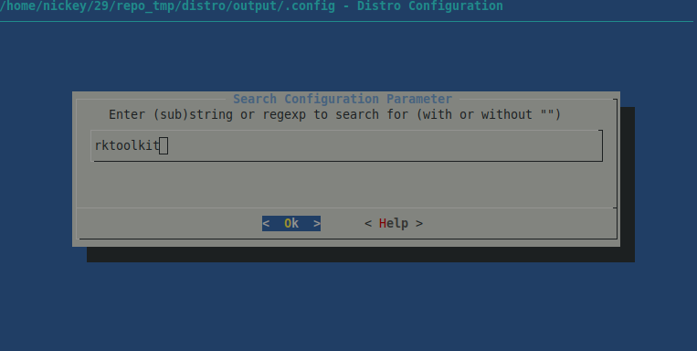
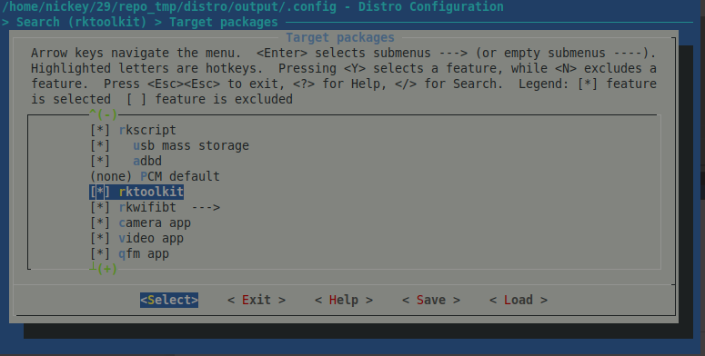

# Rockchip Debian10 Developer Guide

文件标识：RK-KF-YF-332

发布版本：V1.0.0

日       期：2020-02-06

文件密级：□绝密   □秘密   □内部资料   ■公开

---

**免责声明**

本文档按“现状”提供，福州瑞芯微电子股份有限公司（“本公司”，下同）不对本文档的任何陈述、信息和内容的准确性、可靠性、完整性、适销性、特定目的性和非侵权性提供任何明示或暗示的声明或保证。本文档仅作为使用指导的参考。

由于产品版本升级或其他原因，本文档将可能在未经任何通知的情况下，不定期进行更新或修改。

**商标声明**

“Rockchip”、“瑞芯微”、“瑞芯”均为本公司的注册商标，归本公司所有。

本文档可能提及的其他所有注册商标或商标，由其各自拥有者所有。

**版权所有** **© 2020** **福州瑞芯微电子股份有限公司**

超越合理使用范畴，非经本公司书面许可，任何单位和个人不得擅自摘抄、复制本文档内容的部分或全部，并不得以任何形式传播。

福州瑞芯微电子股份有限公司

Fuzhou Rockchip Electronics Co., Ltd.

地址：     福建省福州市铜盘路软件园A区18号

网址：     www.rock-chips.com

客户服务电话： +86-4007-700-590

客户服务传真： +86-591-83951833

客户服务邮箱： fae@rock-chips.com

---

## **前言**

 **概述**

 本文档简单介绍了Rockchip Linux SDK中， Debian10 编译、配置、使用、以及开发过程中注意事项。

**主要功能**

| **类型** | **具体功能**                         |
| -------- | ------------------------------------ |
| 数据通信 | Wi-Fi、以太网卡、USB、SDCARD等       |
| 应用程序 | 桌面、设置、文件管理器、音视频播放等 |

**读者对象**

本文档（本指南）主要适用于以下工程师：

​        技术支持工程师

​        软件开发工程师

 **修订记录**

| **日期**   | **版本** | **作者**    | **修改说明** |
| ---------- | -------- | :---------- | ------------ |
| 2020-02-06 | V1.0.0   | Nickey Yang | 初始版本     |

---

## **目录**

[TOC]

---

## **1 开发环境搭建**

### **1.1 开发环境选择**

 推荐使用**Ubuntu 18.04**作为编译主机的操作系统，操作系统安装且配置好网络环境后，可继续如下步骤完成编译工具的安装。

### **1.2 编译工具安装**

```bash
sudo apt-get install repo git-core gitk git-gui gcc-arm-linux-gnueabihf u-boot-tools device-tree-compiler gcc-aarch64-linux-gnu mtools parted libudev-dev libusb-1.0-0-dev python-linaro-image-tools linaro-image-tools autoconf autotools-dev libsigsegv2 m4 intltool libdrm-dev curl sed make binutils build-essential gcc g++ bash patch gzip bzip2 perl tar cpio python unzip rsync file bc wget libncurses5 libqt4-dev libglib2.0-dev libgtk2.0-dev libglade2-dev cvs git mercurial rsync openssh-client subversion asciidoc w3m dblatex graphviz python-matplotlib libc6:i386 libssl-dev texinfo liblz4-tool genext2fs xutils-dev libwayland-bin bison flex cmake
```

如果编译遇到报错，可以视报错信息，安装对应的软件包。

## **2 目录结构**

```bash
.
├── distro
│   ├── configs..........................#不同芯片平台的默认配置，用户可以加入客制化的配置
│   ├── download.........................#编译过程中，从网络上下载的源码包
│   ├── output...........................#编译过程中，输出的文件
│      ├── log...........................#编译、安装、打包过程中产生的log
│      ├── build.........................#每个包在编译过程中产生的文件
│      ├── images........................#经过打包、压缩的的根文件系统镜像
│      ├── target........................#完整的根文件系统
│   ├── overlay..........................#overlay目录会覆盖到根文件系统，来满足客制化的需求
│   ├── package..........................#存放不同包的编译需要的Config.ini和make.sh
│   ├── scripts..........................#编译，安装，打包的脚本
│   ├── support..........................#编译某些包而添加的，可以支持下载源码包加上本地补丁后编译
├── app...........................#qt应用launcher、camera、setting等的源码
├── buildroot.....................#buildroot目录
└── external......................#Rockchip提供的libdrm、mpp、rktoolkit等源码

```

目前编译Debian10上qt app的时候会使用buildroot编出来的qmake。所以如果需要编译Debian10上的qt app请先编译buildroot。

## **3 配置和编译**

### **3.1 默认配置和编译**

下面以RK3288为例，介绍Debian10系统的编译和相关开发。

```bash
cd distro
make rk3288_defconfig   #defconfig位于configs目录下
```

执行后会生成最终编译所使用的配置文件，存放在output/.config。

```bash
./make.sh               #自动完成各个包的下载、编译、并打包成文件系统
```

### **3.2 新增本地源码包和编译**

下面介绍本地的package如何集成到 Debain10中。 package的编译是由distro/make.sh脚本根据.config里面打开的配置来执行对应package里的make.sh。这里使用rktoolkit作为示例来讲解：

1. 在package/Config.ini里新增rktoolkit

   ```bash
   package/Config.in
           source "package/rkscript/Config.in"
   +       source "package/rktoolkit/Config.in"
           source "package/rkwifibt/Config.in"
   ```

2. 新建rktoolkit文件夹，然后在这个文件夹下编写make.sh和Config.in

   ```bash
   package/rktoolkit/Config.in
   +config BR2_PACKAGE_RKTOOLKIT
   +       bool "rktoolkit"
   +       help
   +         "io and update tool"
   package/rktoolkit/make.sh
   +#!/bin/bash
   +set -e
   +$GCC $TOP_DIR/external/rktoolkit/io.c --sysroot=$SYSROOT_DIR -I$SYSROOT_DIR/usr/include -I$SYSROOT_DIR/usr/include/$TOOLCHAIN -o $TARGET_DIR/usr/bin/io
   +$GCC $TOP_DIR/external/rktoolkit/update.c $TOP_DIR/external/rktoolkit/update_recv/update_recv.c --sysroot=$SYSROOT_DIR -I$SYSROOT_DIR/usr/include -I$SYSROOT_DIR/usr/include/$TOOLCHAIN -I$TOP_DIR/external/rktoolkit/update_recv/ -o $TARGET_DIR/usr/bin/update
   ```

3. 单独编译rktoolkit

   ```
   ./make.sh rktoolkit
   ```

   下面为编译log:

   ```
   building pkgs: rktoolkit
   I: Running command: /home/nickey/29/repo_tmp/distro/package/rktoolkit/make.sh
   ...(省略部分)
   build rktoolkit done!!!
   ```

4. 重新编译rktoolkit

   ```
   ./make.sh rktoolkit-rebuild
   ```

   或

   ```
    rm -rf output/build/rktoolkit/
    ./make.sh rktoolkit
   ```

   编译package时，脚本会根据output/build/rktoolkit/ 检测这个package是否已成功编译过。如果已成功编译过，则不会编译这个包。所以针对rktoolkit包的调试，在源码修改后，可以使用上面的命令重新编译。

注意事项：

​        单独包的编译也会安装到output/target目录下，但并不会完成文件系统的打包。需要执行下面的命令完成文件系统打包。

```
./make.sh image
```

### **3.3 修改配置**

上述的步骤是默认配置，当有客制化的需求时，需要增加或移除一些包，或者修改包的编译配置选项，Debian10支持图形化和直接修改配置的更改方式。

#### 3.3.1 直接修改

在configs/rk3288_defconfig 中直接添加

```
 BR2_PACKAGE_RKTOOLKIT=y
```

#### 3.3.2 图形化修改

以添加rktoolkit为示例，

```
make menuconfig
```


输入 */*，跳出搜索界面如下，输入 rktoolkit，按回车键：



按 1，选择搜索到的rktoolkit包


输入 空格 勾选这个包



保存到最终编译使用的.config


```
./make.sh
```

编译rktoolkit，并打包进根文件系统中。

#### 3.3.3保存配置

```
make savedefconfig
```

上述命令会把output/.config配置保存回configs/rk3288_defconfig。

## 4常见问题

### 4.1 提示mkdir权限不够

make rk3288_defconfig时出现如下log：

```
mkdir -p /output/build/buildroot-config/lxdialog
mkdir: 无法创建目录"/output": 权限不够
Makefile:186: recipe for target '/output/build/buildroot-config/conf' failed
make: *** [/output/build/buildroot-config/conf] Error 1
```

解决：因为Makefile中需要的$CURDIR变量为空，重启一个shell终端即可。

### 4.2 public key is not available

编译过程中出现 public key is not available的相关log:

```
Reading package lists... Done
W: GPG error: http://mirrors.ustc.edu.cn/debian buster InRelease: The following signatures couldn't be verified because the public key is not available: NO_PUBKEY 04EE7237B7D453EC  NO_PUBKEY 648ACFD622F3D138  NO_PUBKEY DCC9EFBF77E11517
```

解决：不用sudo执行make.sh，并且使用下面的命令添加访问server的key。

```
sudo apt-key adv --keyserver keyserver.ubuntu.com --recv-keys 04EE7237B7D453EC 648ACFD622F3D138  DCC9EFBF77E11517
```