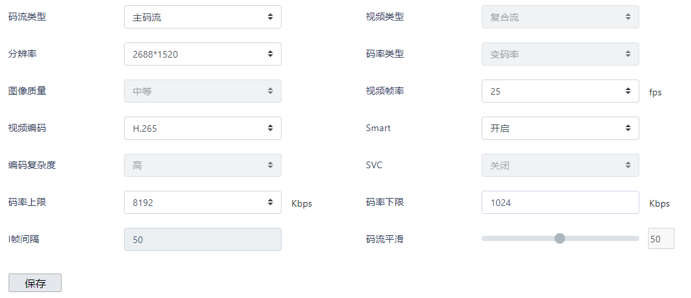
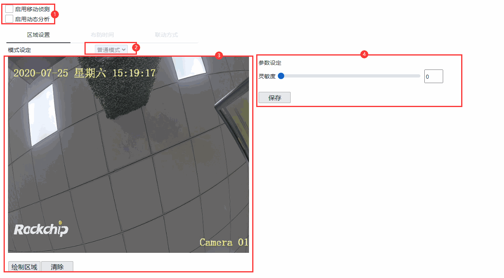
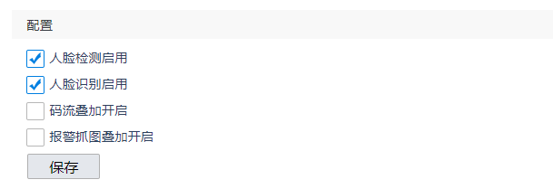
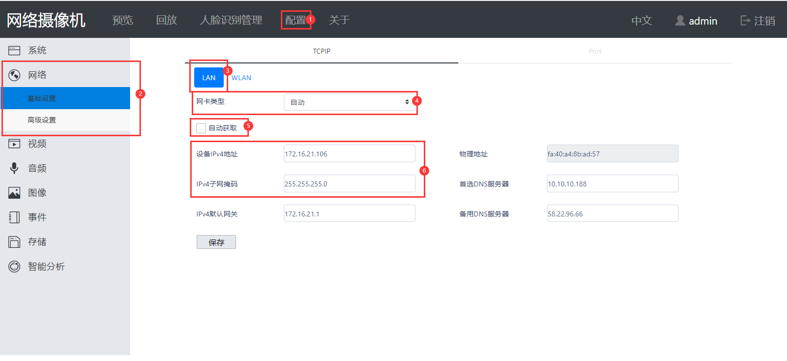

# Web配置使用说明

文件标识：RK-SM-YF-357

发布版本：V1.6.0

日期：2021-02-19

文件密级：□绝密   □秘密   □内部资料   ■公开

**免责声明**

本文档按“现状”提供，瑞芯微电子股份有限公司（“本公司”，下同）不对本文档的任何陈述、信息和内容的准确性、可靠性、完整性、适销性、特定目的性和非侵权性提供任何明示或暗示的声明或保证。本文档仅作为使用指导的参考。

由于产品版本升级或其他原因，本文档将可能在未经任何通知的情况下，不定期进行更新或修改。

**商标声明**

“Rockchip”、“瑞芯微”、“瑞芯”均为本公司的注册商标，归本公司所有。

本文档可能提及的其他所有注册商标或商标，由其各自拥有者所有。

**版权所有** **© 2020** **瑞芯微电子股份有限公司**

超越合理使用范畴，非经本公司书面许可，任何单位和个人不得擅自摘抄、复制本文档内容的部分或全部，并不得以任何形式传播。

瑞芯微电子股份有限公司

Rockchip Electronics Co., Ltd.

地址：     福建省福州市铜盘路软件园A区18号

网址：     [www.rock-chips.com](http://www.rock-chips.com)

客户服务电话： +86-4007-700-590

客户服务传真： +86-591-83951833

客户服务邮箱： [fae@rock-chips.com](mailto:fae@rock-chips.com)

---

**前言**

**概述**

本文介绍如何通过web网页对所支持网络摄像机进行配置。

**产品版本**

| **芯片名称** | **内核版本** |
| ------------ | ------------ |
| RV1109，RV1126，RK1808，RK1806 | Linux 4.19 |

**读者对象**

本文档（本指南）主要适用于以下工程师：

技术支持工程师

软件开发工程师

**修订记录**

| **版本号** | **作者** | **修改日期** | **修改说明** |
| ---------- | --------| :--------- | ------------ |
| V1.0.0 | 陈茂森 | 2020-04-29 | 初始版本     |
| V1.1.0 | 陈茂森 | 2020-05-19 | 添加功能说明，用户管理及人脸数据导出说明 |
| V1.2.0 | 陈茂森 | 2020-06-04 | 增加预览界面录像，智能分析人脸识别开关 |
| V1.3.0 | 陈茂森 | 2020-07-14 | 增加isp详细说明，人脸识别功能说明，存储详细说明 |
| V1.3.1 | 陈茂森 | 2020-07-25 | 名称修正 |
| V1.4.0 | 陈茂森 | 2020-08-14 | 人脸功能变更说明 |
| V1.5.0 | 陈茂森 | 2020-08-31 | 增加直连调试的说明 |
| V1.6.0 | 陈茂森 | 2021-02-19 | 预览功能更新，ISP功能更新 |

---

**目录**

[TOC]

---

## 功能说明

| **功能\产品类型** | **闸机** | **IPC** |
| ----------------- | :------- | ------- |
| 用户登录          | √        | √       |
| 预览功能          | ×        | √       |
| 回放功能          | ×        | √       |
| 人脸识别管理功能  | √        | √       |
| 系统设置          | √        | √       |
| 网络设置          | √        | √       |
| 视频设置          | ×        | √       |
| 音频设置          | ×        | √       |
| 图像设置          | ×        | √       |
| 事件管理          | ×        | √       |
| 计划配置          | ×        | √       |
| 存储管理          | √        | √       |
| 智能分析          | ×        | √       |
| 外设配置          | √        | ×       |

## 用户登录

登录地址：相机IP地址 + /login。

①用户信息：初始用户名：admin，密码admin。

②自动登录：设置自动登录时限。

临时登录：1小时内免密登录。

一天内免密登录：24小时内免密登录。

一周免密登录：7天内免密登录。

一月免密登录：30天内免密登录。

浏览器要求：Chrome 79+，Firefox 68+，Edge 80+，Safari 12.1+。

浏览器说明：使用非要求内浏览器，可能存在部分功能无法使用的情况，如播放器无法正常播放。推荐使用最新版chrome进行操作。

使用浏览器访问登录地址，可见如上图所示登录地址。

## 主界面功能

①预览：预览网络摄像机监控画面，并对部分摄像机参数进行设置，详见4 预览界面。

②回放：查看录像回放，以及抓图存档，详见5 回放。

③人脸识别管理：人脸识别的黑/白名单，抓拍和控制记录管理以及人脸识别参数配置，详见6 人脸识别管理。此项为IPC产品功能，闸机产品无此项。

④人脸参数：对应人脸识别管理中参数设置。此项为闸机产品功能，IPC产品无此项。

⑤人员管理：对应人脸识别管理中，人员清单，注册，抓拍记录，控制记录功能。此项为闸机产品功能，IPC产品无此项。

⑥配置：进行网络摄像机的功能配置，详见7  配置。

⑦关于：查看版权信息。

⑧语言选项：双击切换界面语言，支持中英文切换。

⑨用户名：用户信息。

⑩注销：退出登录，回到登录界面。

---

## 预览界面

①码流切换：切换播放码流。

②播放菜单：支持停止/开始功能。

③电子放大：对预览内容进行局部放大。

④网页截图：网页端对预览界面进行截图。

⑤抓拍：设备端抓拍功能，可在[截图](#截图)中查看记录（仅支持主码流）。

⑥录像：设备端录像开关，可在[录像](#录像)中查看记录（仅支持主码流）。

⑦云台：该功能暂未实现。

注：播放器仅支持h264格式。

## 回放

查看录像回放以及截图。

### 录像

①查询：对已有录像进行条件查询。

②预览：双击查询列表的文件，可在预览窗口中进行预览（仅支持h264格式）。

③下载：对选中的录像进行下载。

④删除：删除选中的录像。

### 截图

查看所有的抓图记录。

①查询：按条件搜索所有截图。

②下载：对选中的截图进行下载。

③删除：删除选中的抓图记录

## 人脸识别管理

### 人员清单

进入界面按默认条件自动查询。

①查询：条件查询已添加的人员信息，现支持条件查询以及人名查询。

②导出excel：将所有满足查询条件的数据整合excel导出（不含图片）。

③模式切换：切换删除/查询模式。删除模式下支持数据删除以及信息重置。删除人员同时将会删除该人员相关的控制记录。

④编辑：修改所在行信息或删除。

⑤特征值：含等待、成功、失败；

等待：设备处理图像中。

成功：设备处理图像成功。

失败：设备处理图像失败，此照片不可用于人脸识别。

重复注册：已有相同特征的照片被注册。

### 单人注册

进行单人注册。

照片规格要求：格式为jpg，大小小于1MB。

除必填信息外，其他信息未填时，将使用系统默认信息。

### 批量注册

#### 功能介绍

①刷新：刷新导入数据。

②批量注册：点击弹出导入菜单，进行批量导入

③非法信息查看：点击查看照片不合格的原因。注册完成后，若存在注册失败照片，将有相同查看按钮。

照片要求：单个照片大小不超过1MB，格式必须为jpg。

特殊说明：批量导入可能存在照片辨识度低，无法作为人脸识别照片的情况，具体情况见6.1人员清单 特征值。

#### 导入速度

测试浏览器：chrome84.0.4147.105

测试照片：50KB照片100pcs

| **限速**(KB) | **用时（s/100pcs）** | **平均速度（pcs/s）** |
| ------------ | :------------------- | --------------------- |
| 2048         | 43                   | 2.3                   |
| 1024         | 63                   | 1.6                   |
| 500          | 110                  | 0.91                  |

若实际使用过程中，导入速度与表中差异较大，请做如下尝试：

1.检查路由器是否存在限速。

2.关闭防火墙后，重新导入，排查是否防火墙限速。

3.更新浏览器。

### 其他功能

抓拍记录：查询网络摄像机抓拍的结果，在删除模式下可进行记录删除，仅闸机类产品支持，IPC类产品暂不支持。

控制记录：查询已登记人员的识别记录，在删除模式下可进行记录删除，IPC类产品暂不支持控制记录的现场头像功能。

参数配置：配置人脸识别特征参数，仅闸机类产品支持，IPC类产品暂不支持。

人脸ROI：配置人脸ROI区域，未设置时默认全屏。仅闸机类产品支持，IPC类产品暂不支持。

### 人脸检测功能使用

1.在使用人脸检测功能前，需在智能分析/叠加与抓图中开启人脸识别功能，详见7.8.1。

2.使用人员清单界面的添加人员或批量导入功能进行人脸注册。

3.当注册人员被相机拍摄并识别时，将会将相似度信息写入控制记录，可在控制记录中进行查询。

## 配置

### 系统

#### 系统设置

##### 基础设置

查询设备信息，可对设备名称编号进行设置。

##### 时间设置

设置系统时间，界面如下。

①夏令时：根据时区设置，进行夏令时校准。

②时区：设置时区，在NTP校准下，设备时间随时区改动而变化，手动校准下，时区不影响设备时间。

③NTP：设置NTP地址，按设置的间隔，定时校准。

④NTP测试：测试NTP校准情况，暂未实现。

⑤手动校准：按手动设置的时间对设备时间进行校准。

#### 系统维护

##### 系统升级

①设备重启：重启设备，待弹窗提示重启完成后，需刷新界面。

②恢复出厂设置：恢复出厂设置，恢复过程中将自动重启设备，待弹窗提示后，需刷新页面。

③设备参数导出：导出含设备参数的db文件。

④设备日志导出：导出含设备日志信息的log文件。

⑤设备参数导入：导入含设备参数的db文件，导入后设备不会重启。

⑥升级：导入设备升级所需的img文件，文件传输完成后设备重启升级，待弹窗提示后，需刷新页面。

##### 日志

展示系统日志，该功能暂未实现。

#### 用户管理

系统用户管理。

①功能菜单：

刷新：刷新用户列表。

添加：添加新用户，仅可添加普通用户。仅默认用户为管理员。

修改：选中用户列表中的用户，点击修改，输入管理员密码验证通过后，可进行密码修改。

删除：选中用户列表中的用户，点击删除，删除选中用户。注：管理员不可删除。

特殊说明：除管理用户外，其他用户分级功能暂未实现。

②用户列表：展示当前所有注册用户。

#### 安全管理

安全管理：该功能暂未实现。

### 网络

#### 基础设置

TCPIP：设置网卡类型以及IP地址。

DDNS：该功能暂未实现。

PPPoE：该功能暂未实现。

Port：设置设备端口。

uPnp：该功能暂未实现。

#### 高级设置

##### WIFI

①启用：启用/关闭WIFI，WIFI开启过程中该功能不可用。

②扫描：扫描附近可用WIFI展示于列表中。

③WIFI列表：显示已扫描到的WIFI。若尝试连接，连接成功后WIFI所在行将显示绿色，连接失败显示红色。

④WIFI设置：设置需要连接的WIFI的密码，名称通过点击WIFI列表中的WIFI自动填充。已成功连接过的WIFI无需再次输入密码即可连接；若需要重设密码，则需先使用删除功能删除该WIFI的记录。

删除：删除选中WIFI的系统记录。

##### 其他功能

SMTP：该功能暂未实现。

FTP：该功能暂未实现。

eMail：该功能暂未实现。

Cloud：该功能暂未实现。

Protocol：该功能暂未实现。

QoS：该功能暂未实现。

Https：该功能暂未实现。

### 视频

#### 编码参数

设置码流、分辨率、图像质量等编码参数。

码流类型：支持主码流，子码流，第三码流，不同码流对应不同参数。

视频类型：支持视频流和复合流，其中复合流包含视频流和音频流，该功能暂未实现。

分辨率：不同码流支持不同分辨率。

码流类型：支持定码率、变码率，定码率设定码率传输，编码率根据实际情况使用不同码率。

图像质量：图像成像质量，设定码流类型为定码率时，图像质量不可设定。

视频帧率：视频每秒帧数。

视频编码：支持H.264、H.265。

Smart：智能模式开启后，对应码流ROI功能关闭，I帧间隔、码率类型、SVC、图像质量、码流平滑不可设置，此时可设置码率下限。Smart开关时，需要进行应用重启。

编码复杂度：同码流，复杂度越高，图像质量越高，功能暂未实现。

SVC：功能暂未实现。

码率上限：最大码率。

码率下限：最小值为码率上限的1/8，与码率上限取平均后得到目标码率。

I帧间隔：两个关键帧间的间隔。

码流平滑：功能暂未实现。

视频帧率：设定视频帧率。

#### 高级编码

临时设置底层参数，主要用于开发者调试，该界面设置参数将不会保存。

#### 兴趣区域

设置不同码流的兴趣区域，每个码流最多可设置4种区域。

①预览/绘图：点击绘制区域可进行绘图，鼠标可拖动兴趣区域，点击兴趣区域四周的调整点，可调整兴趣区域大小。

清除：清除当前区域的绘图框。

说明：单个区域最多绘制一个兴趣区域。

②设置：选择需设置的码流，区域编号，以及提升等级。

#### 区域裁剪

对摄像区域进行裁剪，具体效果可在预览界面查看（该功能暂未实现）。

说明：仅支持第三码流，区域大小仅能通过分辨率设置，不可手动调整大小。

### 音频

设置音频参数。

目前默认编码为MP2，仅支持输入音量调整，其他功能暂未实现。

### 图像

#### ISP设置

①场景：切换网络摄像机场景模式，该功能暂未实现。

②图像调节：设置视频亮度、对比度、饱和度、锐度。

③曝光：支持“自动曝光”以及“手动曝光”两种模式，手动曝光模式下支持对曝光时间以及增益的调节。

④日夜转换：支持日夜转换模式，过滤时间，补光灯模式的调节。

日夜转换模式：“白天”模式下，图像为彩色，“夜晚”模式下图像为黑白。

过滤时间：从 5 s 到 120 s 可调，当环境照度满足转换要求且保持的时间超过时间阈值后才会进行日夜的切换。

灵敏度：对应的夜晚模式到白天模式转换阈值。灵敏度越高，越容易切换到白天模式， 越难切换到夜晚模式；灵敏度越低，越容易切换到夜晚模式，越难切换到白天模式。

注：配置其他模式后再配置自动模式，将无法使用自动模式进行自动切换。

⑤背光：支持高动态以及高动态级别配置。

高动态：高动态下，能够更好的反映出真实环境中的视觉效果。

⑥白平衡：设置白平衡模式，支持“手动白平衡”、“自动白平衡”。

手动白平衡：该模式下支持 R、B 增益调整。

⑦图像增强：设置数字降噪、去雾模式、灰度范围、鱼眼矫正。

数字降噪：减少图像噪点。支持时域降噪，空域降噪以及综合降噪。

去雾模式：可选择“开启”和“关闭”，开启该功能后可以一定程度上提升水雾天气视频画面中的物体可辨识程度。

灰度范围：可选择“[0-255]”和“[16-235]”，用户可根据实际需要来选择视频编码的灰度范围。

畸变矫正：支持LDCH以及FEC矫正。

LDCH：水平方向的畸变矫正，支持矫正级别的调整。

FEC：水平以及垂直方向的畸变矫正，支持矫正级别的调整。

⑧视频调整：支持视频制式的调整，以及视频镜像模式的配置。

镜像：支持翻转、镜像、中心对称模式配置。

---

#### OSD设置

设置OSD字体样式，以及OSD内容。

①预览区域：拖动可设置OSD坐标，保存后可预览OSD设置效果。

②OSD配置：配置OSD，其中OSD属性目前仅支持不透明，不闪烁；仅在国际模式下可设置OSD最小边距。

③OSD内容设置区域：设置OSD内容。

若通道名称以及字符叠加字符过长，超出显示区域部分将不显示。

字符叠加目前仅支持两个叠加区域的设置，预期最高可设置8个字符叠加。

#### 视频遮挡

绘制区域：绘制视频遮挡区域，目前仅支持绘制1个区域。

清除：清除所有的绘制区域。

#### 图片遮挡

使用说明：添加遮挡图片后，预览区域显示等比例红框，拖动红框可调整图像位置。图像X、Y坐标为只读，不可手动设置。

图片规格：图片格式必须为bmp，图片大小需小于 1MB。

### 事件

#### 移动侦测

##### 区域设置

①启用：启用移动侦测或动态分析

②模式设定：目前仅支持普通模式。

③预览/绘图：进入绘制模式，在预览区域点击并多拖动鼠标可绘制侦测区域。

清除：清除所有绘图。

④参数设置：设置侦测灵敏度。

##### 布防时间

绘制布防时间计划表，每日最多设置8个不同时间区间。

①删除：删除当前选中的时间块/删除所有时间块。

②复制：当鼠标处于绘图区内时，出现该行的复制功能图标，点击后在弹窗中选择需要复制到的日期，将选中行的布防时间块同步到对应日期中。

③修改：单击时间块，在弹窗中输入起始结束时间，对时间块进行修改。或拖动时间块两端的修改点，进行时间块修改。

④绘制：在绘图区域内点击并拖动鼠标可创建布防时间块，时间块可自由拖动，拖动时将显示起始以及结束时间。

##### 联动方式

选择检测的联动方式，该功能暂未实现。

#### 区域入侵

##### 区域设置

设置入侵区域，灵敏度，以及入侵占比。

占比：当入侵物体占设置区域比例大于占比设定时，系统将判定为区域入侵。

##### 布防时间

同7.6.1.2 布防时间。

##### 联动方式

同7.6.1.3 联动方式。

#### 其他功能

报警输入：该功能暂未实现。

报警输出：该功能暂未实现。

异常：该功能暂未实现。

### 存储

#### 计划配置

##### 录像计划

按周别设置录像时间区间。

①启用：开关录像记录。录像计划开启后，在非计划期间使用预览录像，将会被自动关闭。

②删除/全部删除：删除选中时间块。

③计划类型：选择需绘制的计划类型，选择后可在绘图区绘制对应计划时间块。

④高级参数：设计计划具体间隔周期，暂未实现。

⑤计划图例：不同类型计划图例。

其他功能同7.6.1.2 布防时间。

##### 抓图计划

高级设置见7.7.1.3抓图参数，其余功能同7.7.1.1录像计划。

##### 抓图参数

①定时：定时自动抓图，抓图间隔区间为1000ms ~ 7day。

②事件触发：特定事件下触发抓图，抓图间隔1000 ~ 65535ms，抓图数量限制1~120。

#### 存储管理

##### 硬盘管理

设置录像以及抓图功能的磁盘配额。

①刷新：刷新磁盘信息。

②格式化：格式化③中选中的磁盘，eMMC不支持格式化。

③格式化选择：选择需要格式化的磁盘，当无可选磁盘时该功能将无法使用。

④磁盘信息：单击此盘信息行，可展示不同磁盘的磁盘配额，功能同⑤。

⑤磁盘号：选择不同磁盘号，将会显示不同磁盘的磁盘配额。

⑥切换：切换存储磁盘为所选磁盘配额中显示的磁盘。

##### 网络硬盘

该功能暂未实现。

##### 云存储

该功能暂未实现。

### 智能分析

#### 叠加和抓图

目前仅支持人脸检测，人脸识别，码流叠加，抓图叠加的开关。

说明：当人脸检测关闭后，人脸识别关，码流叠加，抓图叠加将同步被关闭，并隐藏。

仅当人脸识别启用时可进行人脸识别注册。

#### 屏蔽区域

该功能暂未实现。

#### 规则配置

该功能暂未实现。

#### 高级配置

该功能暂未实现。

### 外设

支持闸机以及显示屏数据配置，无实际应用。此项属于拓展功能，仅供闸机产品使用，具体功能实现需根据实际产品开发。

## 设备直连

调试时，使用设备直连PC操作如下：

1. 设置PC与设备处于同一网段IP，且子网掩码为255.255.255.0；

2. 使用网页访问登录地址，并登录；

3. 如下图，进入配置/网络/基础设置/TCPIP/LAN中，设置网卡为自动，关闭自动获取，并设置IP为之前所设置的设备IP，IPv4子网掩码为255.255.255.0，其余设置满足IP规范即可保存。

4. 进行web操作。

说明：若未进行以上设置，将会出现预览，下载等功能异常。