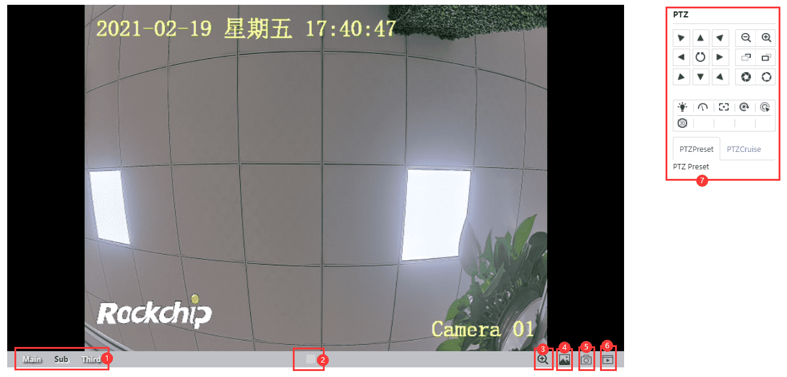
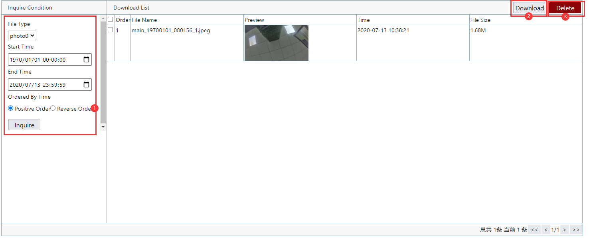
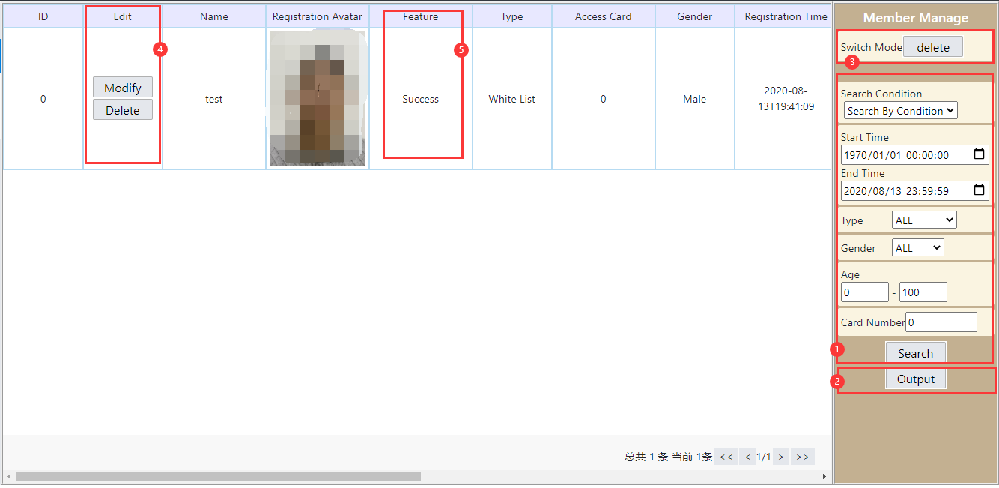
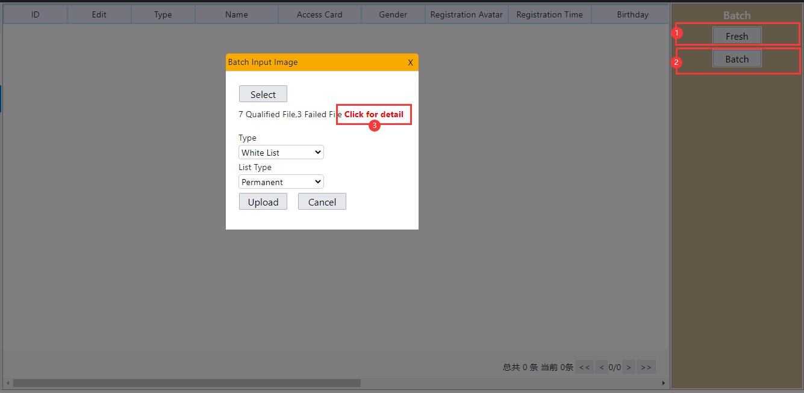
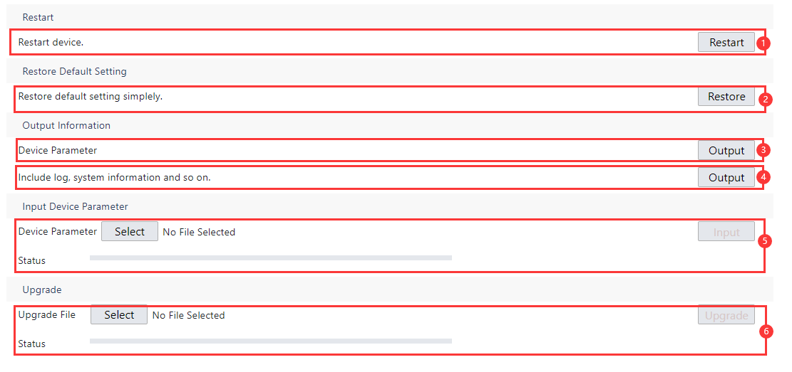
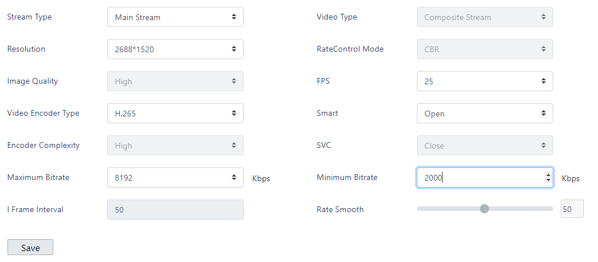
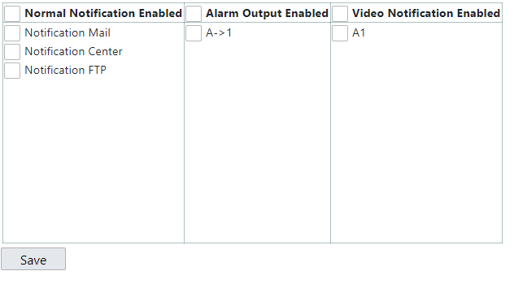
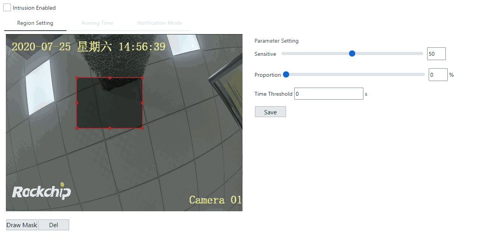
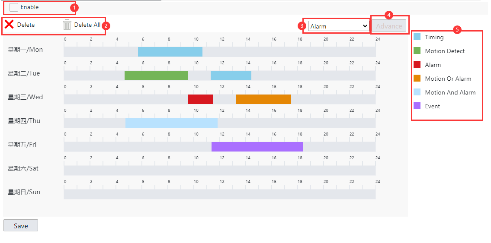
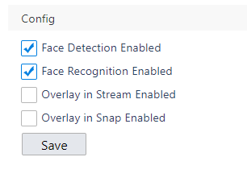

# Web Configuration

ID: RK-SM-YF-357

Release Version: V1.4.0

Release Date: 2020-08-14

Security Level: □Top-Secret   □Secret   □Internal   ■Public

**DISCLAIMER**

THIS DOCUMENT IS PROVIDED “AS IS”. ROCKCHIP ELECTRONICS CO., LTD.(“ROCKCHIP”)DOES NOT PROVIDE ANY WARRANTY OF ANY KIND, EXPRESSED, IMPLIED OR OTHERWISE, WITH RESPECT TO THE ACCURACY, RELIABILITY, COMPLETENESS,MERCHANTABILITY, FITNESS FOR ANY PARTICULAR PURPOSE OR NON-INFRINGEMENT OF ANY REPRESENTATION, INFORMATION AND CONTENT IN THIS DOCUMENT. THIS DOCUMENT IS FOR REFERENCE ONLY. THIS DOCUMENT MAY BE UPDATED OR CHANGED WITHOUT ANY NOTICE AT ANY TIME DUE TO THE UPGRADES OF THE PRODUCT OR ANY OTHER REASONS.

**Trademark Statement**

"Rockchip", "瑞芯微", "瑞芯" shall be Rockchip’s registered trademarks and owned by Rockchip. All the other trademarks or registered trademarks mentioned in this document shall be owned by their respective owners.

**All rights reserved. ©2020. Rockchip Electronics Co., Ltd.**

Beyond the scope of fair use, neither any entity nor individual shall extract, copy, or distribute this document in any form in whole or in part without the written approval of Rockchip.

Rockchip Electronics Co., Ltd.

No.18 Building, A District, No.89, software Boulevard Fuzhou, Fujian,PRC

Website:     [www.rock-chips.com](http://www.rock-chips.com)

Customer service Tel:  +86-4007-700-590

Customer service Fax:  +86-591-83951833

Customer service e-Mail:  [fae@rock-chips.com](mailto:fae@rock-chips.com)

---

**Preface**

**Overview**

This document is intended to present how to configure the supported network cameras through web pages.

**Product Version**

| **Chipset**                    | **Kernel Version** |
| ------------------------------ | ------------------ |
| RV1109, RV1126, RK1808, RK1806 | Linux 4.19         |

**Intended Audience**

This document (this guide) is mainly intended for:

Technical support engineers

Software development engineers

---

**Revision History**

| **Version** | **Author** | **Date** | **Change Description** |
| --------- | ---------- | :-------- | ------------ |
| V1.0.0      | Allen Chen | 2020-04-29 | Initial version                                              |
| V1.1.0      | Allen Chen | 2020-05-19 | Add introduction about face-output and user management.   |
| V1.2.0      | Allen Chen | 2020-06-04 | Add introduction on record about preview and face mode switch. |
| V1.3.0      | Allen Chen | 2020-07-14 | Add introduction on ISP, storage management and face recognition. |
| V1.3.1 | Allen Chen | 2020-07-25 | Correction. |
| V1.4.0 | Allen Chen | 2020-08-14 | Add introduction on face function changes. |

**Contents**

[TOC]

---

## Functions

| **function\production**  | **Gate** | **IPC** |
| ------------------------ | :------- | ------- |
| User Authentication      | √        | √       |
| Preview                  | ×        | √       |
| Review                   | ×        | √       |
| Face Recognition Manager | √        | √       |
| System Config            | √        | √       |
| Network Config           | √        | √       |
| Video Config             | ×        | √       |
| Audio Config             | ×        | √       |
| Image Config             | ×        | √       |
| Event Manager            | ×        | √       |
| Plan Config              | ×        | √       |
| Storage Config           | √        | √       |
| Intelligence Analysis    | ×        | √       |
| Peripherals              | √        | ×       |

## User Authentication

Login address: device IP + /login

①Default:

User Name: admin

Password: admin

②Password-free login: set time for password-free login.

Temporary login: Password-free login within 1 hour.

Auto Login Within One Day: Password-free login within 24 hours.

Auto Login Within One Week: Login without password within 7 days.

Auto Login Within One Month: Login without password within 30 days.

Browser requirements: and_chr 81 / and_ff 68 / and_qq 1.2 / and_uc 12.12 / android 81 / baidu 7.12 / chrome 81 / chrome 80 / chrome 79 / edge 81 / edge 80 / edge 18 / firefox 75 / firefox 74 / firefox 73 / firefox 68 / ios_saf 13.3 / ios_saf 13.2 / ios_saf 12.2-12.4 / kaios 2.5 / op_mini all / op_mob 46 / opera 68 / opera 67 / safari 13 / safari 12.1 / samsung 11.1 / samsung 10.1

Remark: using browser that is beyond requirements, part of functions would be disabled.

Use a browser to access the login address, you can see the login address as shown in the figure above.

## Header Navigation

①Preview: Enter preview page. Please refer to chapter 4.Preview for details.

②Review: Inquire video review and snap. Please refer to chapter 5.Review for details.

③Face: Set white list/black list and inquire record. Please refer to chapter 6.Face Recognition Manager for details. This item is a function of the IPC product, and gate products don‘t have this item.

④Face Config: Correspond to config in Face. This item is a function of the gate product, and IPC products don‘t have this item.

⑤Manage: Corresponding to member list, registration, snapshot record, control record function. This item is a function of the gate product, and IPC products do not have this item.

⑥Config: Set most config of device. Please refer to chapter 7.Config for details.

⑦About: View copyright information.

⑧Language: Double click to switch English/Chinese.

⑨User Name: Show User name.

⑩Logout: Logout and enter login page.

## Preview

①Player Menu: Only support playing/pausing/stopping。

②Switch Stream: To be realized.

③Snapshot: Snapshot. Inquire record in review page.

④Recording: Recording switch. When switch on, color of this button would alter to blue. Inquire record in review page.

⑤PTZ：IPC PTZ. To be realized.

## Review

Inquire snap and record.

### Video Record

①Inquire: Inquire by type and time.

②Preview: Preview record when double click on file.

③Download: Download file selected.

④Delete: Delete file selected.

### Snapshot

①Inquire: Inquire by type and time.

②Download: Download file selected.

③Delete: Delete file selected.

## Face Recognition Manager

### Member List

①Search: Search by conditions or by name.

②Output: Export all information except image to excel.

③Switch Mode: Switch Search/Delete Mode. Support data deletion and information reset in delete mode. Deleting a person will also delete the control records related to that person.

④Edit: Double click on raw to show edit menu. With that, you could modify or delete information selected.

⑤Feature: Feature determines a image whether can be used in face system.

Wait: It means that device is trying to get feature. If it shows 'wait' for a long time, maybe something wrong with getting feature. At this case, you could delete it and reupload.

Success: Image could be used for face recognition.

Fail: Image could not be used for face recognition.

Repeat: Image that has the same feature has been registered.

### Single Registration

Add face information for person.

Picture: File format should be jpg and its size should be smaller than 1MB.

Remark: When optional message is blank, it would be filled with default.

### Batch Registration

#### Introduce

①Fresh: Fresh data.

②Batch: After click show input menu.

③Unqualified image info: Show reason of unqualified image.

Picture: File format should be jpg and its size should be smaller than 1MB.

Remark: If image is not qualified, it will fail when device gets feature. Feature of Please refer to chapter 6.Member List for details.

#### Import speed

Browser: chrome84.0.4147.105

Sample: 100 pcs 50KB pictures

| **Internet speed**(KB) | **Time（s/100pcs）** | **Average speed（pcs/s）** |
| ---------------------- | :------------------- | -------------------------- |
| 2048                   | 43                   | 2.3                        |
| 1024                   | 63                   | 1.6                        |
| 500                    | 110                  | 0.91                       |

If the import speed is quite different from the table in actual use, please try the following:

1.Check whether the router has a speed limit.

2.After closing the firewall, re-import to check whether the firewall is speed limited.

3.Update the browser.

### Other Functions

Snap Shot: Inquire Snapshot record. You can delete record in delete mode. This function only realize in gate products.

Control: Inquire Control record. You can delete record in delete mode. This function only realize in turnstile products.

### Usage

1.Make sure Face Detection and Face Recognition is enabled in Config/Intelligence Analysis/Smart Cover. Please refer to section 7.8.1 for details.

2.Register members in Member List or Batch Input.

3.Person not registered will be recorded in snapshot(only support in gate products). And person registered will be recorded in control(Present Avatar is supported only in gate products).

## Config

### System

#### Setting

##### Basic Setting

Get Device info and set device name/ID.

##### Time Setting

Set device time.

①DST: Auto Perform DST according to the time zone setting.

②Time Zone: Set Time Zone. It functions only when using NTP.

③NTP: Set NTP service address and interval to calibrate.

④NTP test: To be realized.

⑤Manual Calibration: Set time by input.

#### Maintain

##### Upgrade

①Restart: Restart device. You should fresh page after completion.

②Restore: Restore default setting. You should fresh page after completion.

③Output Device Parameter: Output parameter as .db file.

④Device Log: Output device log as log file.

⑤Input Device Parameter: Input parameter using .db file.

⑥Upgrade: Upgrade by .img file. You should fresh page after completion.

##### Log

Show System log. To be realized.

#### User

User Management.

①Menu:

Fresh: Fresh user list.

Add: Add an normal user by admin.

Modify: Modify password of the user selected by admin.

Delete: Delete the user selected by admin. Admin can't be deleted.

②User List: Show users registered.

#### Security

To be realized.

### Network

#### Basic

TCPIP: Set Nic address and IP address.

DDNS: To be realized.

PPPoE: To be realized.

Port: Set Port.

uPnp: To be realized.

#### Advance

##### WIFI

①Enabled: Turn on/off WIFI. It is disabled during turning on WIFI.

②Scan: Scan and show WIFI in list.

③WIFI List: Show WIFI scanned. Row color is green when connecting WIFI successful, and red when connecting fail.

④WIFI Setting: Set Password for WIFI to be connected. If WIFI connected, password would be auto filled. And you should delete WIFI before modify password.

Delete: Delete record of WIFI selected.

##### Other Functions

SMTP: To be realized.

FTP: To be realized.

eMail: To be realized.

Cloud: To be realized.

Protocol: To be realized.

QoS: To be realized.

Https: To be realized.

### Video

#### Encoder Param

Stream Type: Support Main Stream, Sub Stream, Third Stream. Different stream type needs different setting.

Video Type: Support Video Stream and Composite Stream. To be realize.

Resolution: Adjust video resolution.

Rate Control Mode: Support CBR and VBR. Set CBR to using default rate.

Image Quality: Set image quality. When Rate Control Mode is CBR, this function is disabled.

FPS: Frames Per Second.

Video Encoder Type: Support H.264 and H.265.

Smart: When smart on, ROI, I Frame Interval, Rate Control Mode, SVC, Image Quality and Rate Smooth are disabled, but you could set Minimum Bitrate. Before switching Smart, application would be restarted.

Encoder Complexity: With increment of it, Image Quality is improved. To be realized.

SVC: To be realized.

Maximum Bitrate: Set Maximum Bitrate.

Minimum Bitrate: Use to calculate average with Maximum Bitrate.

I Frame Interval: Gap between two I Frame.

Rate Smooth: To be realized.

#### Advanced Encoder

Temporarily set the underlying parameters, which are mainly used for developer debugging. The interface setting parameters will not be saved.

#### ROI

Set the interest area of different streams, each stream can be set up to 4 types of areas.

①Preview/Drawing: Click the drawing area to draw, the mouse can drag the area of interest, and click the adjustment points around the area of interest to adjust the size of the area of interest.

Del: Clear the drawing frame in the current area.

Remark: Draw at most one area of interest in a single area

②Setting: Select the stream, area number, and upgrade level to be set.

#### Region Crop

Crop the camera area, the specific effect can be checked in the preview interface(to be realized).

Remark: Only the third stream is supported, and the area size can only be set by the resolution, and cannot be adjusted manually.

### Audio

The current default encoding is MP2, which only supports input volume adjustment, and other functions are not yet implemented.

### Image

#### ISP

①Scenario: Switch the scene mode of the network camera, this function is not implemented yet.

②Graphic Options: Set video brightness, contrast, saturation, sharpness.

③Exposure: Currently only supports exposure time and gain adjustment.

④ICR: Support ICR mode, filter time, adjustment of fill light mode. Sensitivity adjustment has not yet been realized.

ICR mode: In "day" mode, the image is in color, and in "night" mode, the image is in black and white.

Filter Time: It is adjustable from 5 s to 120 s. When the ambient illuminance meets the conversion requirements and the holding time exceeds the time threshold, the day and night switching will be performed.

Sensitive: Corresponding night mode to day mode transition threshold. The higher the sensitivity, the easier it is to switch to day mode and the harder it is to switch to night mode; the lower the sensitivity, the easier it is to switch to night mode and the harder it is to switch to day mode.

⑥BLC: Set the white balance mode, support "Manual White Balance", "Auto White Balance 1", "Locking White Balance", "Fluorescent Light", "Incandescent", "Warm Light" and "Natural Light".

Manual White Balance: Support Red, Blue gain adjustment in this mode.

Locking White Balance: In this mode, the current color correction matrix will be locked.

If the actual using scene is a fixed light type, you can choose the last four options according to the actual situation.

⑦Image Enhancement: Set DNR, Dehaze, Gray Range, FEC。

DNR: Reduce image noise. In normal mode, adjust the noise reduction level. In expert mode, time domain and spatial domain noise reduction can be set.

Dehaze: You can choose "On" and "Off". After turning on this function, you can improve the visibility of objects in the water mist weather video screen to a certain extent.

Gray Range: "[0-255]" and "[16-235]" can be selected, and users can select the grayscale range of the video encoding according to actual needs.

FEC: You can choose "on" and "off". After turning on this function, the distortion of the screen edge can be reduced to a certain extent.

⑧Video Adjustment: Only the Video Standard is currently supported.

#### OSD

Set the OSD font style and OSD content.

①Preview: Drag to set the OSD coordinates, and preview the OSD setting effect after saving.

②Setting: Configure the OSD. The OSD attribute currently only supports opacity and no flickering; the minimum margin of the OSD can be set only in the GB mode.

③Content: Set OSD content.

Remark: If the channel name and character superimposed characters are too long, the part beyond the display area will not be displayed.

Character overlay currently only supports the setting of two overlay areas, and it is expected that up to 8 character overlays can be set.

#### Privacy Cover

Drawing: Draw the occluded area of the video, currently at most 1 area is drawn, and it is planned to draw at most 4 areas.

Del: Clear the drawing frame in the current area.

Remark: Currently only the first drawing area takes effect.

#### Picture Mask

After adding the masked picture, the preview area will display a red frame in proportion. Drag the red frame to adjust the image position. The X and Y coordinates of the image are read-only and cannot be set manually.

Image Requirement: The picture format must be 24bit bmp, and the picture size must be less than 1MB.

### Event

#### Motion Detect

##### Region Setting

①Enabled: Enable motion detection or motion analysis.

②Mode: Currently only supports normal mode.

③Preview/Drawing: Enter the drawing mode, click and drag the mouse in the preview area to draw the detection area.

Del: Clear the drawing frame in the current area.

④Setting: Set detection sensitivity.

##### Arming Time

Draw an arming time schedule, and set up to 8 different time intervals per day.

①Delete: Delete time block selected.

②Copy: When the mouse is in the drawing area, the copy function icon of the row appears. After clicking, select the date to be copied in the pop-up window, and synchronize the arming time block of the selected row to the corresponding date.

③Modify: Click the time block and enter the start and end time in the pop-up window to modify the time block. Or drag the modification points at both ends of the time block to modify the time block.

④Drawing: Click and drag the mouse in the drawing area to create an arming time block. The time block can be dragged freely. The start and end time will be displayed when dragging.

##### Notification Mode

Select the detection notification mode, this function has not yet been implemented.

#### Intrusion Detection

##### Region Setting

Set the invasion area, sensitivity, and percentage of invasion.

percentage: When the proportion of the invading object in the setting area is greater than the proportion setting, the system will judge it as an area intrusion.

##### Arming Time

The same as section 7.6.1.2 Arming time.

##### Notification Mode

The same as section 7.6.1.3 Arming time

#### Other Functions

Alarm Input: To be realized.

Alarm Output: To be realized.

Error: To be realized.

### Storage

#### Plan Setting

##### Video Plan

Set the recording time interval by week.

①Enabled: Recording switch. After the recording plan is opened, the preview recording during the unplanned period will be automatically closed.

②Delete: Delete time block selected.

③Plan Type: Select the type of plan to be drawn, and then draw the corresponding plan time block in the drawing area after selection.

④Advanced Parameter: The specific interval of the design plan has not been realized yet.

⑤Plan legend: Legends of different types of plans.

Other functions are the same as section 7.6.1.3 Arming time.

##### Screenshot Plan

For advanced settings, see section 7.7.1.3 Capture Parameters, and other functions are The same as section 7.7.1.1 Recording Plan.

##### Screenshot Setting

①Interval: Automatically capture pictures regularly, and the interval of capturing pictures is 1000ms ~ 7day.

②Event: The snapshot is triggered under a specific event, the interval between snapshots is 1000 ~ 65535ms, and the number of snapshots is limited to 1~120.

#### Storage Manage

##### Hard Disk Management

Set disk quotas for recording and capturing functions.

①Fresh: Refresh disk information.

②Format: Format the disk selected in ③, eMMC does not support formatting.

③Format selection: Select the disk to be formatted. This function will not be available when there is no optional disk.

④Disk List: Click this disk information line to display the disk quotas of different disks, with the same function as ⑤.

⑤Disk Number: Select different disk numbers, the disk quotas of different disks will be displayed.

⑥Switch: Switch the storage disk to the disk displayed in the selected disk quota.

##### NAS

To be realized.

##### Cloud Storage

To be realized.

### Intelligence Analysis

#### Mask Cover

Currently, it only supports face detection, face recognition, overlay in stream, and overlay in snap switches.

Remark: When the face detection is turned off, others will be turned off synchronously and hidden.

The face recognition registration can only be performed when face recognition is enabled.

#### Mask Area

To be realized.

#### Rule Settings

To be realized.

#### Advanced Settings

To be realized.

### Peripherals

It supports the data configuration of gates and display screens, without practical application. This item is an extended function and is only used by gate products. The realization of specific functions needs to be developed according to actual products.