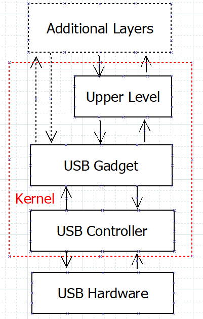
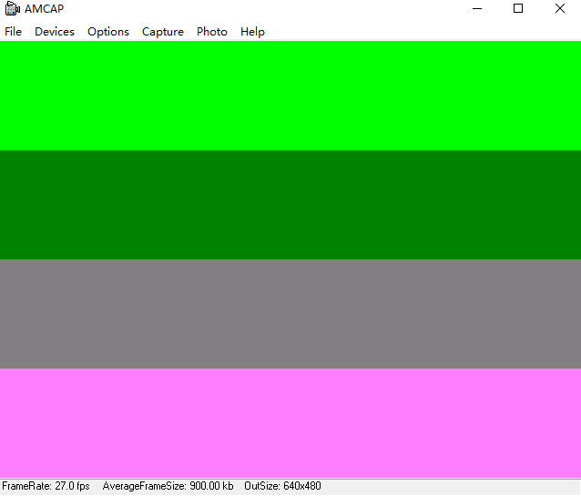

# Rockchip Linux USB Gadget Quick Start

文件标识：RK-JC-YF-316

发布版本：V1.0.0

日期：2020-03-10

文件密级：□绝密   □秘密   □内部资料   ■公开

---

**免责声明**

本文档按“现状”提供，福州瑞芯微电子股份有限公司（“本公司”，下同）不对本文档的任何陈述、信息和内容的准确性、可靠性、完整性、适销性、特定目的性和非侵权性提供任何明示或暗示的声明或保证。本文档仅作为使用指导的参考。

由于产品版本升级或其他原因，本文档将可能在未经任何通知的情况下，不定期进行更新或修改。

**商标声明**

“Rockchip”、“瑞芯微”、“瑞芯”均为本公司的注册商标，归本公司所有。

本文档可能提及的其他所有注册商标或商标，由其各自拥有者所有。

**版权所有** **© 2019** **福州瑞芯微电子股份有限公司**

超越合理使用范畴，非经本公司书面许可，任何单位和个人不得擅自摘抄、复制本文档内容的部分或全部，并不得以任何形式传播。

福州瑞芯微电子股份有限公司

Fuzhou Rockchip Electronics Co., Ltd.

地址：     福建省福州市铜盘路软件园A区18号

网址：     www.rock-chips.com

客户服务电话： +86-4007-700-590

客户服务传真： +86-591-83951833

客户服务邮箱： fae@rock-chips.com

---

## **前言**

 **概述**

 本文主要描述了Linux USB Gadget基本使用方法，旨在帮助开发者快速了解并使用Linux USB Gadget功能。

**产品版本**

| **平台名称** | **内核版本** |
| ------------ | ------------ |
| Linux        | v4.4         |

**读者对象**

本文档（本指南）主要适用于以下工程师：

​        技术支持工程师

​        软件开发工程师

 **修订记录**

| **日期**   | **版本** | **作者**  | **修改说明**                     |
| ---------- | -------- | :-------- | -------------------------------- |
| 2019-12-10 | V0.0.1   | Zain Wang | 初始版本                         |
| 2020-03-10 | V1.0.0   | Zain Wang | 更新英文图片 修改一些名词描述 |

---

## **目录**

[TOC]

---

## **1 Linux-USB Gadget API Framework**

USB Gadget 是运行在USB Peripheral 上配置USB功能的子系统，正常可被枚举的USB设备至少有3层逻辑层，有些功能还会在用户空间多跑一层逻辑代码。Gadget API就是具体功能和硬件底层交互的中间层。

从下到上，逻辑层分布为：

- **USB Controller**: USB上最底层的软件代码，直接与硬件交互，并抽象出endpoint概念，用于管理数据流的进出，并供给USB Gadget层调用。
- **USB Gadget**: 进一步封装USB Controller，调用USB Controller实现硬件无关的软件配置。例如，在ep0协议上运行各种class-specific协议来启动特定功能，并管理端点的进出信息等。
- **Upper Level**: 大部分的Gadget驱动都会连接到具体的Linux驱动或框架，通过连接这些具体功能的驱动或框架让USB正常工作。
- **Additional Layers**: 除开以上3层代码，还有可能有其他多出的代码层，比如kernel里的网络协议栈，也有可能是一个用户上层应用，通过调用POSIX系统的标准接口实现，如`open()`, `close()`, `read()` and `write()`。

**NOTE:** 参考资料 <https://www.kernel.org/doc/htmldocs/gadget/intro.html>

### **1.1 Kernel 配置**

USB Gadget功能配置在menuconfig如下位置：

~~~shell
Location:
  -> Device Drivers
    -> USB support
      -> USB Gadget Support
        -> USB Gadget Drivers
~~~

RK Linux下提供了一套自动配置的脚本，实现自动配置的功能有：

~~~shell
CONFIG_USB_CONFIGFS_ACM
CONFIG_USB_CONFIGFS_RNDIS
CONFIG_USB_CONFIGFS_MASS_STORAGE
CONFIG_USB_CONFIGFS_F_FS
CONFIG_USB_CONFIGFS_F_MTP
CONFIG_USB_CONFIGFS_F_UAC1
CONFIG_USB_CONFIGFS_F_UAC2
CONFIG_USB_CONFIGFS_F_UVC
~~~

### **1.2 USB configfs**

configfs 是一套基于可读写空间的文件系统，与sysfs类似，也有不同。

sysfs的节点都是由kernel创建并注册到sysfs里。sysfs中，用户通过readdir/read等方式读取节点属性，也可以通过write方式修改。sysfs的重点在于，所有节点的创建销毁，都是由Kernel发起，Kernel控制sysfs节点的生命周期，sysfs只是一个查看这些节点的窗口。

configfs通过用户使用mkdir创建，rmdir销毁。节点内容是在mkdir后出现，这些内容可用通过read/write修改。和sysfs一样，readdir可以批量查看这些内容，symlink可以方便管理内容。不同的是，节点内容的生命周期完全由用户决定。支持这个功能的Kernel模块必须响应用户操作。

## **2 USB Gadget 使用**

### **2.1 USB 管理流程**

RKScript中，有三个USB相关文件：

~~~shell
S50usbdevice # /etc/init.d/ 使用时，配合同级目录的.usb_config使用
usbdevice # /usr/bin/
61-usbdevice.rules # /lib/udev/rules.d/
#还有两个相关文件需要用户自建或修改
.usb_config # /etc/init.d/
/tmp/.usb_config # S50usbdevice 自动生成

~~~

用户可直接操作S50usbdevce脚本，修改.usb_config配置想要的USB功能。

USB功能配置成功会有如下log，表明进入USB Ready:

~~~shell
[   66.178517] android_work: sent uevent USB_STATE=CONNECTED
[   66.179977] configfs-gadget gadget: high-speed config #1: b
[   66.180663] android_work: sent uevent USB_STATE=CONFIGURED
~~~

### **2.2 功能配置**

USB 功能配置写在/etc/init.d/.usb_config中，运行状态下，修改USB功能可以修改/tmp/.usb_config，并运行/etc/init.d/S50usbdevice restart。

目前 USB Gadget 自动配置支持以下选项（配置在.usb_config中）：

~~~ shell
usb_adb_en
usb_uac1_en
usb_uac2_en
usb_rndis_en
usb_mtp_en
usb_ums_en
usb_acm_en
usb_uvc_en
~~~

**/etc/init.d/.usb_config 和 /tmp/.usb_config的区别：**

/etc/init.d/.usb_config**为开机默认配置**，因为系统可能为只读系统，该部分文件可能无法修改。因此无特殊原因，运行状态下不建议修改该文件。

/tmp/.usb_config 是/etc/init.d/.usb_config的复制文件，开机后，S50usbdevice会将/etc/init.d/.usb_config复制一份到/tmp下，/tmp目录为ram空间，可以随时修改。在运行状态下，需要临时修改USB功能，可以修改该文件，并用/etc/init.d/S50usbdevice restart重置USB功能。

#### ADB (Android Debug Bridge)

ADB是一种功能多样的命令行调试工具，可以实现文件传输，Unix Shell登录等功能。

ADB 需要上层应用**adbd**才能正常启动，Buildroot中需要打开adbd编译开关。

~~~shell
BR2_PACKAGE_ANDROID_TOOLS_ADBD
~~~

确保系统中存在adbd后，执行下列命令并接入USB线连接PC，

~~~shell
echo usb_adb_en > /tmp/.usb_config
/etc/init.d/S50usbdevice restart
~~~

即可在PC上通过adb devices看到设备

Note: Linux 上使用adb devices如果无法看到设备，请执行

~~~shell
adb kill-server
sudo adb devices
~~~

Windows 需要安装ADB驱动，必要时，需要使用管理员权限运行ADB

#### UAC （USB Audio Class）

UAC通过USB虚拟标准PCM接口给Host设备，实现Device和Host之间音频互传功能。

UAC分为UAC1和UAC2，UAC2和UAC1有以下区别：

- UAC2比UAC1具有更高的带宽（各平台实现略有不同，以实测为准）
- Windows 7及部分Windows 10系统默认不支持UAC2，需要手动安装驱动，但都支持UAC1

直接运行以下命令可以使能UAC:

~~~shell
echo usb_uac1_en > /tmp/.usb_config # or usb_uac2_en
/etc/init.d/S50usbdevice restart
~~~

UAC测试需要借助第三方开源库ALSA，使用aplay -l 或 arecord -l看支持播放或采集声音的声卡:

~~~shell
# aplay -l
card 2: rk3xxx [rk3xxx], device 0: USB Audio [USB Audio]
  Subdevices: 1/1
  Subdevice #0: subdevice #0

# 指定设备设用 -D "hw:${card},${device}" (上述信息即可写为 -D "hw:2,0")
~~~

UAC 测试流程需要搭建音频数据流的回环，可以同时测试UAC的Playback和Capture功能：

(1) PC 向Device播放音频文件

Linux:

~~~shell
aplay -D "plughw:2,0" -f S16_LE -r 48000 -c 2 /userdata/test.wav
# plughw 如果音频采样率和设置的不符，alsa将对音频进行重采样，保证输出音频采样率和设置的一致
~~~

Windows:

右键右下的声音图标->"Open Sound Settings"->选择输出设备，选中Device设备（一般识别为Source/Sink，设备名与Windows版本相关），并打开播放器，播放音乐

(2) Device 将UAC Playback上的音频重定向到Capture

~~~shell
arecord -D "hw:3,0" -f S16_LE -r 48000 -c 2 -t raw -N |  aplay -D "hw:3,0" -f S16_LE -r 48000 -c 2 -t raw -N
~~~

(3) PC将UAC Capture上的音频重定向到正常的扬声器上

Linux

~~~shell
arecord -D "hw:2,0" -f S16_LE -r 44100 -c 2 -t raw -N | aplay -D "hw:1,0" -f S16_LE -r 44100 -c 2 -t raw -N
~~~

Windows:

右键右下角的声音图标->"Open Sound Settings"->"选择输入设备，选中Device设备（一般识别为Source/Sink，设备名与Windows版本相关）

点击Device properties->Additional device properties，勾选Listen to this device，选择“Play through this device”指向PC原播放设备。

这样就可以在PC的扬声器上听到测试音频。

#### RNDIS（Remote Network Driver Interface Specification）

RNDIS提供基于USB的网络接口规范，可以使用网络命令（SSH等）实现Device和Host的数据交互。

直接执行下列命令，可以使能RNDIS功能：

~~~shell
echo usb_rndis_en > /tmp/.usb_config
/etc/init.d/S50usbdevice restart
~~~

使用ifconfig可以看到在Host和Device上都会多出一块网卡：

~~~shell
# Host Linux
ifconfig
enp0s20u3u4u4 Link encap:Ethernet  HWaddr d6:11:03:17:c3:97
          inet6 addr: fe80::3fa6:da84:77bd:122a/64 Scope:Link
          UP BROADCAST RUNNING MULTICAST  MTU:1500  Metric:1
          RX packets:61 errors:0 dropped:0 overruns:0 frame:0
          TX packets:187 errors:0 dropped:0 overruns:0 carrier:0
          collisions:0 txqueuelen:1000
          RX bytes:7198 (7.1 KB)  TX bytes:41844 (41.8 KB)
# Device
ifconfig
usb0      Link encap:Ethernet  HWaddr 46:26:71:47:E3:9F
          inet addr:169.254.216.27  Bcast:169.254.255.255  Mask:255.255.0.0
          inet6 addr: fe80::9e72:7f20:cc68:4a34/64 Scope:Link
          UP BROADCAST RUNNING MULTICAST  MTU:1500  Metric:1
          RX packets:606 errors:606 dropped:0 overruns:0 frame:606
          TX packets:125 errors:0 dropped:0 overruns:0 carrier:0
          collisions:0 txqueuelen:1000
          RX bytes:100024 (97.6 KiB)  TX bytes:30346 (29.6 KiB)
~~~

Host上并没有分配ipv4的地址，可以使用ifconfig命令手动指定：

~~~shell
#固定RNDIS地址为169.254.216.1
ifconfig enp0s20u3u4u4 down
ifconfig enp0s20u3u4u4 169.254.216.1
ifconfig enp0s20u3u4u4 up
~~~

此时在Device或Host上可以使用ping命令相互通信。

**Note:**Windows上识别成功自动分配ipv4地址，无需手动分配。

#### MTP （Media Transfer Protocol）

MTP是由Microsoft提出的一套媒体文件传输协议，可以方便的在Device和Host之间共享媒体文件。

MTP 需要上层应用**mtp-server**才能正常启动，Buildroot中需要打开mtp-server编译开关

~~~shell
BR2_PACKAGE_MTP
~~~

确保系统中存在mtp-server后，执行下列命令并接入OTG线连接PC:

~~~shell
echo usb_mtp_en > /tmp/.usb_config
/etc/init.d/S50usbdevice restart
~~~

即可在PC上看到"---MODEL---"的设备，Linux/Windows通用。

**Note:**MTP属性名称可以在buildroot/package/rockchip/mtp中，参考补丁修改。默认共享/userdata目录。

#### UMS （USB Mass Storage）

UMS 给Host设备提供大容量外挂存储。

UMS与MTP有以下区别：

- UMS以Block为单位工作；MTP则以文件为单位工作。
- UMS工作时，目标Block为独占工作，多用户操作同一Block将会出现错误；MTP支持多用户操作。

运行以下命令可以使能UMS

~~~shell
echo usb_ums_en > /tmp/.usb_config
echo "ums_block=/dev/block/by-name/userdata" >> /tmp/.usb_config # 可用镜像文件替换具体分区，例如/userdata/ums_shared.img
/etc/init.d/S50usbdevice restart
~~~

即可在PC上看到一个新的U盘盘符。

由于UMS Block只能独占工作，S50usbdevice提供了一个新属性，使UMS Block在连接PC的时候从Device上卸载，防止Device产生错误操作；PC断开的时候，重新挂载到Device上的/mnt/ums。

可以在.usb_config中追加以下属性开启：

~~~shell
echo "ums_block_auto_mount=on" >> /tmp/.usb_config
~~~

不想使用逻辑分区加载UMS，可以使用image文件代替逻辑分区。image可以自建，也可以使用S50usbdevice脚本自动生成

~~~shell
# 自动生成一个 fat 格式， 8M 大小的image文件，并开启UMS自动挂载
echo usb_ums_en > /tmp/.usb_config
echo "ums_block=/userdata/ums_shared.img" >> /tmp/.usb_config
echo "ums_block_size=8" >> /tmp/.usb_config #Unit M
echo "ums_block_type=fat" >> /tmp/.usb_config
echo "ums_block_auto_mount=on" >> /tmp/.usb_config
/etc/init.d/S50usbdevice restart
~~~

以上操作在Buildroot中都可以配置，配置路径Target packages -> Rockchip BSP packages -> rockchip usb mass storage配置完毕，重编rkscript即可自动生成/etc/init.d/.usb_config。

#### ACM （CDC - ACM: Communication Device Class - Abstract Control Model）

可以理解为USB虚拟串口，在Device/Host两端生成TTY设备。

运行以下命令可以使能ACM

~~~shell
echo usb_acm_en > /tmp/.usb_config
/etc/init.d/S50usbdevice restart
~~~

使能ACM后，可以在Device上看到/dev/ttyGS0设备，PC上看到/dev/ttyACM0设备。

~~~shell
#PC上运行
echo test > /dev/ttyACM0
#Device上运行
cat /dev/ttyGS0 #得到 test 输出
~~~

#### UVC (USB Video Class)

UVC 功能需要上层UVC应用才能正常启动，Buildroot中提供了一个测试Demo (uvc_app)，Buildroot中需要打开对应编译开关。

~~~shell
BR2_PACKAGE_UVC_APP
~~~

需要手动修改下S50usbdevice脚本，添加

~~~shell
-       # Add uvc app here with start-stop-daemon
+       if [ $UVC_EN = on ];then
+               start-stop-daemon --start --quiet --background --exec /usr/bin/uvc_app -- 640 480
+       fi
~~~

使用以下命令使能UVC：

~~~shell
echo usb_uvc_en > /tmp/.usb_config #默认输出640x480格式图像
/etc/init.d/S50usbdevice restart
~~~

Host查看工具，Linux推荐guvcview，Windows推荐Amcap工具，选中Device->UVC Camera / Options->Preview

左下角显示帧率。

**Note:**

- uvc_app 只是一个测试Demo，并非正式应用，显示4块纯色条纹，用户可以根据这个Demo自行修改应用
- 要使用UVC功能，必须要有UVC应用，否则直接启动UVC功能，会造成USB功能异常。
- 如果系统是只读文件系统，S50usbdevice需要在系统打包前提前修改
- UVC对热拔插支持不友好，只要USB Gadget一旦完成unbind动作，UVC就无法正常使用，这个问题是V4L2节点注册机制决定的。

### **2.3 USB复合设备**

在端口及带宽条件允许下，USB Gadget可以使用复合功能，将多个USB Gadegt功能复合到一个USB Port上。

例如复合ADB  + RNDIS:

~~~shell
echo usb_mtp_en > /tmp/.usb_config
echo usb_adb_en >> /tmp/.usb_config
/etc/init.d/S50usbdevice restart
~~~
