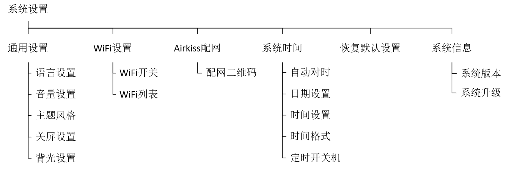

# Rockchip MiniGUI Desktop开发指南

文件标识：RK-KF-CS-001

发布版本：V1.0.0

日期：2020-03-09

文件密级：□绝密   □秘密   □内部资料   ■公开

---

**免责声明**

本文档按“现状”提供，福州瑞芯微电子股份有限公司（“本公司”，下同）不对本文档的任何陈述、信息和内容的准确性、可靠性、完整性、适销性、特定目的性和非侵权性提供任何明示或暗示的声明或保证。本文档仅作为使用指导的参考。

由于产品版本升级或其他原因，本文档将可能在未经任何通知的情况下，不定期进行更新或修改。

**商标声明**

“Rockchip”、“瑞芯微”、“瑞芯”均为本公司的注册商标，归本公司所有。

本文档可能提及的其他所有注册商标或商标，由其各自拥有者所有。

**版权所有** **© 2019** **福州瑞芯微电子股份有限公司**

超越合理使用范畴，非经本公司书面许可，任何单位和个人不得擅自摘抄、复制本文档内容的部分或全部，并不得以任何形式传播。

福州瑞芯微电子股份有限公司

Fuzhou Rockchip Electronics Co., Ltd.

地址：     福建省福州市铜盘路软件园A区18号

网址：     [www.rock-chips.com](http://www.rock-chips.com)

客户服务电话： +86-4007-700-590

客户服务传真： +86-591-83951833

客户服务邮箱： [fae@rock-chips.com](mailto:fae@rock-chips.com)

---

## 前言

**概述**

本文档主要介绍MiniGUI Desktop的功能、常用的接口和内部工作原理，通过实例介绍MiniGUI Desktop的开发过程以及注意事项。

**产品版本**

| **芯片名称** | **内核版本** |
| ------------ | ------------ |
| RK3126C | 4.4     |
| RK3308 | 4.4 |

**读者对象**

本文档（本指南）主要适用于以下工程师：

技术支持工程师
软件开发工程师

**修订记录**

| **版本号** | **作者** | **修改日期** | **修改说明** |
| ---------- | --------| :--------- | ------------ |
| V0.0.1 | WJJ | 2019-06-26 | 初始版本     |
| V1.0.0 | Ruby Zhang | 2020-03-09 | 正式发布，更新了文档格式 |

## 目录

---
[TOC]
---

## MiniGUI Desktop

### 概述

MiniGUI是一款面向嵌入式系统的高级窗口系统和图形用户界面支持系统，目前我们在MiniGUI的基础上编写了MiniGUI Desktop，用以实现音频播放、视频播放、图片浏览等功能，支持按键或触屏控制，便于二次开发。

### 功能描述

#### 文件浏览

表 1‑1支持的文件类型

| **文件类型** | **文件格式**  |
| ------------ | ------------- |
| 图片         | jpg、bmp、png |
| 音频         | wav、mp3      |
| 视频         | mp4           |

文件浏览均由browser_dialog窗体处理，通过判断文件后缀名创建对应的音频播放窗体、视频播放窗体或图片预览窗体。

在音频、视频播放窗体中，支持播放/暂停、上一曲/下一曲以及快进退。

在图片预览窗体中，支持上一张/下一张以及双击屏幕退出。

#### 系统设置

图 1‑1系统设置层级关系



**通用设置：**支持中文、英文、日文、韩文四种语言设置；支持音量设置；支持两种主题风格，可根据需求再拓展；可设置5、10、15、30、60s关屏或常亮；可设置四个等级背光亮度。

**WiFi 设置：**可打开或关闭WiFi；显示附近热点信息，上下滑动可翻页，点击可进入密码输入界面。

**Airkiss：**暂不支持。

**系统时间：**可选用NTP对时；开启自动对时后日期设置、时间设置项无效；点击日期设置、时间设置、定时开关机可进入对应的输入界面，点击确定后会将对应时间日期写入系统，并同步到RTC；可设置12/24小时制显示。

**恢复默认设置：**将系统设置恢复为默认值。

**系统信息：**显示模组型号；显示固件版本号；点击系统升级会判断是否有固件可更新。

### 编译配置

板级配置：

在根目录运行make menuconfig找到如下项并使能：

```
BR2_PACKAGE_MINIGUI=y
BR2_PACKAGE_MINIGUI_ENABLE_FREETYPE=y
BR2_PACKAGE_MINIGUI_ENABLE_PNG=y
BR2_PACKAGE_MINIGUI_DESKTOP=y
```

可选配置：

其中FFMPEG和SDL2用于支持音视频播放，NTP用于支持网络对时。

```
BR2_PACKAGE_FFMPEG_FFPLAY=y
BR2_PACKAGE_SDL2_KMSDRM=y
BR2_PACKAGE_SDL2_OPENGLES=y
BR2_PACKAGE_NTP=y
BR2_PACKAGE_NTP_NTPDATE=y
BR2_PACKAGE_NTP_NTPTIME=y
```

minigui_desktop编译配置：

编辑external/minigui_desktop/config.mk，修改如下项可开启或关闭电池、WiFi编译，用于适配部分板子可能没有电池或不支持WiFi。可参考Makefile和config.mk添加其他编译开关。

```
ENABLE_WIFI=1
ENABLE_BATT=1
```

### 开发指引

#### 创建窗体

函数DialogBoxIndirectParam用于创建窗体并设置对应的事件处理函数，一般情况下，每个窗体都有单独的dialog文件，例如audioplay_dialog.c，每个窗体都有自己的创建函数和事件处理函数，以audioplay_dialog为例，其创建窗体的函数为creat_audioplay_dialog，主要工作为指定窗体的位置以及一些参数的传递和初始化，最后调用DialogBoxIndirectParam创建窗体。

#### 窗体事件处理

在创建一个窗体时，会绑定对应事件处理函数，以audioplay_dialog.c为例，其处理函数为audioplay_dialog_proc，系统触发某一事件后，就会上发至该函数进行处理。常用事件如下：

表 1‑2窗体事件

| **事件名**          | **描述**                                                     |
| ------------------- | ------------------------------------------------------------ |
| MSG_INITDIALOG      | 初始化事件，窗体被创建时触发                                 |
| MSG_TIMER           | 定时器事件，可在初始化事件中创建定时器，则系统会定时触发该事件，可根据wParam（ID）判断是哪个定时器触发 |
| MSG_KEYDOWN         | 按键事件，可通过wParam判断是哪个按键已按下                   |
| MSG_DISPLAY_CHANGED | 判断图形输出设备是否改变，例如插拔HDMI会触发该事件           |
| MSG_PAINT           | 绘图事件，函数InvalidateRect会触发该事件，进行画面重绘，可指定重绘区域，降低不必要的开销 |
| MSG_MEDIA_UPDATE    | 媒体播放更新事件，由播放器上发，例如获取媒体总时间、当前播放时间、通知播放结束等 |
| MSG_DESTROY         | 销毁事件，窗体完全退出时触发，执行反初始化函数               |
| MSG_LBUTTONDOWN     | 鼠标左键是否按下/手指是否接触触屏判断                        |
| MSG_LBUTTONUP       | 鼠标左键是否松开/手指是否离开触屏判断                        |

注：更多事件的触发和处理可参考MiniGUI官方文档说明。

#### 控件的绘制和按下判断

按钮等控件的绘制本质上是绘制图片，使用FillBox、FillBoxWithBitmap、DrawText等函数实现，按下判断则是在触发MSG_LBUTTONDOWN、MSG_LBUTTONUP事件后记录对应的坐标，调用各个窗体的check_button函数去判断是哪个控件被触发，从而执行对应的操作。

绘制时的坐标等参数由ui_1024x600.h、ui_480x272.h、ui_480_320.h分别指定对应分辨率下的数值，目前ui_1024x600.h中的支持较完善，另外两种分辨率，或其他分辨率的头文件还需要进行适配。在common.h中通过#include的方式指定使用哪个分辨率的头文件。

### 常见问题

请参考常见问题FAQs:[https://github.com/VincentWei/minigui/wiki/FAQs-in-Chinese](https://github.com/VincentWei/minigui/wiki/FAQs-in-Chinese)