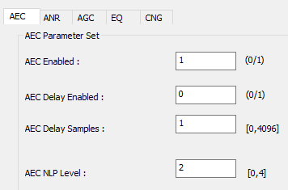
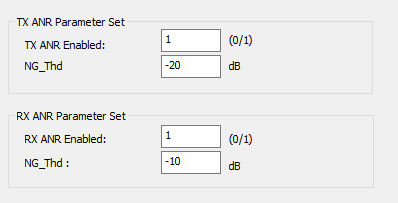
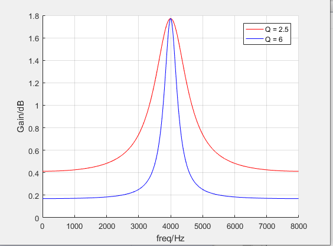
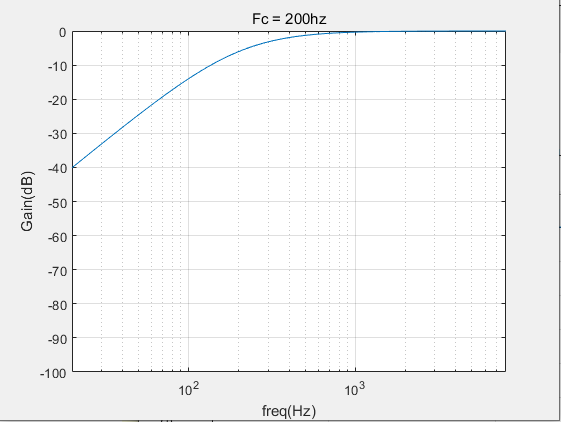
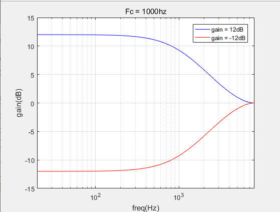
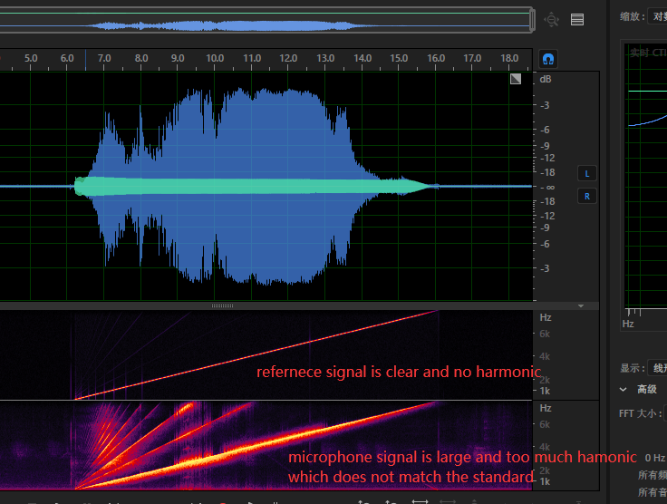

# Rockchip Voice Intercom 3A Algorithm Integration

ID: RK-SM-YF-391

Release Version: V1.1.0

Release Date: 2021-04-06

Security Level: □Top-Secret   □Secret   □Internal   ■Public

**DISCLAIMER**

THIS DOCUMENT IS PROVIDED “AS IS”. ROCKCHIP ELECTRONICS CO., LTD.(“ROCKCHIP”)DOES NOT PROVIDE ANY WARRANTY OF ANY KIND, EXPRESSED, IMPLIED OR OTHERWISE, WITH RESPECT TO THE ACCURACY, RELIABILITY, COMPLETENESS,MERCHANTABILITY, FITNESS FOR ANY PARTICULAR PURPOSE OR NON-INFRINGEMENT OF ANY REPRESENTATION, INFORMATION AND CONTENT IN THIS DOCUMENT. THIS DOCUMENT IS FOR REFERENCE ONLY. THIS DOCUMENT MAY BE UPDATED OR CHANGED WITHOUT ANY NOTICE AT ANY TIME DUE TO THE UPGRADES OF THE PRODUCT OR ANY OTHER REASONS.

**Trademark Statement**

"Rockchip", "瑞芯微", "瑞芯" shall be Rockchip’s registered trademarks and owned by Rockchip. All the other trademarks or registered trademarks mentioned in this document shall be owned by their respective owners.

**All rights reserved. ©2021. Rockchip Electronics Co., Ltd.**

Beyond the scope of fair use, neither any entity nor individual shall extract, copy, or distribute this document in any form in whole or in part without the written approval of Rockchip.

Rockchip Electronics Co., Ltd.

No.18 Building, A District, No.89, software Boulevard Fuzhou, Fujian,PRC

Website:     [www.rock-chips.com](http://www.rock-chips.com)

Customer service Tel:  +86-4007-700-590

Customer service Fax:  +86-591-83951833

Customer service e-Mail:  [fae@rock-chips.com](mailto:fae@rock-chips.com)

---

**Preface**

**Overview**

Rockchip Audio Processor (referred to as RKAP) is a set of Rockchip audio processing algorithms. This document mainly introduces the processing flow and related parameter configuration of the voice call 3A algorithm.

**Product Version**

| **Name** | Version |
| ------------ | ------------ |
| Introduce of the 3A algorithm | RKAP_3A_V1.2.0 |

**Intended Audience**

This document is mainly intended for:

Technical support engineers

Software development engineers

**Support benchmarks**

| **Date**   | **Version** | **Author**  | **Revision History** |
| ---------- | :---------- | :---------- | :------------------- |
| V1.0.0 | Cherry.Chen | 2020-12-09 | Initial  version      |
| V1.1.0 | Cherry.Chen | 2021-04-06 | add AEC ERLE mode and  Hardware test |

---

**Contents**

[TOC]

---

## Introduction

The sound of the loudspeaker is fed back to the microphone for a period of time, and the original sound that is heard by human ear is called echo. The block diagram of the echo generation and the basic working principle of the 3A algorithm are as follows.

### Flow Description


In the above figure, the TX represents the transmitting end, that is, sending data from the near-end to the far-end, and the RX represents receiving; that is, receiving signals from the far-end to the near-end. In the case of speaker playback, the far-end sound played by the speaker spreads over the air to the near-end microphone. If Acoustic Echo Cancellation (AEC) is not applied to it, the far-end can hear the near-end sound at the same time. Hearing what user just said, the worse situation is that when the hands-free device is also used at the remote end, the sounds at both ends stimulate each other, which is easy to produce howling. Therefore, it is necessary to attenuate the echo through the AEC algorithm. The AEC algorithm mainly includes two parts: AF (Adaptive Filter) and NLP (Nonlinear Process), where AF stands for adaptive filter, which calculates the echo in the near-end signal by simulating the echo path, and the NLP means non-linear processing. After AF processing, there is residual echo in the near-end signal, which needs to be suppressed by the NLP algorithm. It can be seen from the figure that in addition to the near-end speech and echo, the signal captured by the microphone also contains environmental noise. Therefore, audio noise reduction (ANR) is also required to remove the environmental noise. In the signals captured by the near-end microphone, after the echo and noise are cancelled, the remaining useful sound gain is low, so the automatic gain control algorithm (Audio Gain Control, AGC) is introduced to gain the useful signal; finally, the EQ (Equalizer) and CNG (Comfort Noise Generation) increase the comfort of the sound and send it to the far-end.

### Testing

From the description in section 1.1, we can know that there are three situations in a two-terminal call:

- **Near-end speaks, far-end does not speak**

    In this case, the system is in the near-end single-speaking state, and the far-end does not speak (the near-end speaker has no sound), so there is no echo. At this time, it is equivalent to the microphone collecting only the near-end sound and noise. Equivalent to the adaptive filter not working.

- **Near-end does not speak, far-end speaks**

    In this case, the system is in the far-end single-talking state, and the far-end sound is played through the near-end speaker and then collected by the microphone (the microphone input contains echo and noise). In this state, the adaptive filter converges in a certain period of time After reaching a steady state.

- **Near-end and far-end talk at the same time**

    In this case, the system is in a dual-talk state. In this state, the adaptive filter is prone to divergence, resulting in reduced echo cancellation.

   Therefore, when testing the echo cancellation effect, the above three conditions need to be tested simultaneously.

### Indicators

#### Objective indicators

It is mentioned in ITU G.168 that Echo Return Loss (ERL): The attenuation of the signal from the receiving port to the transmitting port of the echo canceller. Refers to the loss in the echo channel (near end), that is, the attenuation of the sound from the far end through the echo path and then to the microphone input.

Echo Return Loss Enhancement (ERLE): The attenuation when the echo signal is transmitted through the transmission channel of the echo canceller.

Using ERLE to measure the effect of echo cancellation can be regarded as the average value of echo attenuation achieved over a period of time. The larger the ERLE value, the better the effect, and the value can be recorded in time to count the convergence time:
$$
\text{ERLE}(m) =10\log10 \frac{\sum_{j=1}^qd^2[(m-1)q+j]}{\sum_{j=1}^qe^2[(m-1)q+j]}
$$
The $d(n)$ is the near-end signal, and $e(n)$ is the difference signal, which is the output signal.

#### Subjective indicators

ITU-TP.800 and P.830 define the subjective test method of MOS score (Mean Opinion Score): different people compare the original corpus and the corpus after audio algorithm processing, score MOS separately, and finally get average value, this is a purely subjective qualitative measurement. The ITU selects the same scores for different ages, genders, and language groups within a wide range of hearing to make the evaluation criteria for voice quality.

| MOS Rating | Subjective Opinions | Auditory Perception |
| ------- | ---------------- | ---------------------------------------------------- |
| 4-5   | Excellent | Speaking is clear, almost no delay.<br />Smooth communication               |
| 3-4   | Good     | Speaking is clear, and the delay is small.<br />Communication is not smooth and there is a little noise. |
| 2-3   | Fair     | Speaking is not too clear, and the delay feels obvious.<br />Communication was repeated many times.       |
| 1-2   | Poor       | Speaking is not clear, and the delay is large.<br />Communication was repeated many times.         |
| 1 or less | Bad      | Hard to hearing clearly, and the delay is large.<br />Difficult to communicate.               |

---

## API Integration

### RKAP_3A_Init()

| Functions     | RKAP_Handle RKAP_3A_Init(RKAP_AEC_State *st,<br />                                            RKAP_AEC_TRANS_ENUM transType); |
| ------------ | ------------------------------------------------------------ |
| Input Parameters     | st: The structure of st input some basic parameters<br />transType: TX or RX to indicate the current processing flow |
| Return Values       | Handle of TX or RX processing                                      |
| Function Description | Initialize the 3A algorithm                                           |

**Note**: The value range of each parameter of the structure RKAP_AEC_State is as follows:

```c
typedef struct RKAP_AEC_State_S
{
    /* Basic info */
    int swSampleRate;     /* Sample rate, only supports 8000Hz or 16000Hz */
    int swFrameLen;       /* The length of frame, only supports 16ms or 20ms */
    const char *pathPara; /* The path of loading Para.bin */
} RKAP_AEC_State;
```

### RKAP_3A_Destroy()

| Functions | void RKAP_3A_Destroy(RKAP_Handle handle); |
| -------- | ------------------------------------- |
| Input Parameters | RKAP Handle                                  |
| Return Values   | None                                    |
| Function Description | Deinitialize                              |

### RKAP_3A_Process()

| Functions | int RKAP_3A_Process(RKAP_Handle handle, short *pfSigIn,<br/>                                short *pfSigRef, short *pfSigOut); |
| -------- | ------------------------------------------------------------ |
| Input Parameters | handle: The handle of initialized TX or RX <br />pfSigIn: the signal of near-end<br />pfSigRef: the signal of far-end for reference<br />pfSigOut: output signal |
| Return Values   | 0 means correct return, the others mean error return.                              |
| Function Description | The processing of 3A algorithm<br />Note: Generally TX and RX are co-exist, so they need to be initialized and processed separately. |

### RKAP_3A_DumpVersion()

| Functions | void RKAP_3A_DumpVersion(void); |
| -------- | --------------------------- |
| Input Parameters | None                          |
| Return Values   | None                          |
| Function Description | Print the current algorithm library version    |

### example

external/rkmedia/examples/rkmedia_audio_test.c

---

## RKAP_Para.bin Files

The following with the TX mark indicates the TX process adjustment parameters, and RX is the same. There are many tuning modules involved, so use the Windows tool RKAP_3A_Para_Tool to save the relevant parameters.

### Basic Parameters

| Parameter Name    | Index | Ranges    | Description                             |
| ----------- | ----- | ----------- | -------------------------------- |
| SampleRate  | 0     | 8kHz or 16kHz     | Sample Rate                           |
| Mic_Num     | 5     | 1~8         | The number of Mic-phones                    |
| Speaker_Num | 6     | 1~2         | The number of reference channels                  |
| Linear Gain | 7     | -90~90 (dB) | Linear gain for TX input signal, the unit is dB |

The UI of tool looks as follows:


### AEC Parameters

#### AEC Basic Parameter

| Parameter Name              | Index | Ranges | Description                      |
| --------------------- | ----- | -------- | ------------------------------------------------------------ |
| AEC Enabled           | 10    | 0 or 1     | 0-off, 1-on                                   |
| AEC Delay Enabled     | 11    | 0 or 1     | Usually the AEC Delay is used for software loop back       |
| Default Delay Samples | 12    | 0~4096   | When the automatic delay estimation is not enabled and the mic and ref signals have a fixed delay, this value represents the number of samples of the delay. |
| AEC NLP Level         | 13    | 0~4      | The degree of inhibition of AEC NLP, 0-4 inhibition is gradually increasing.                       |

**Note**: AEC NLP Level is the suppression of residual echo by nonlinear processing:

- Level 0 means that the NLP module is turned off, that is, only the echo is adaptively filtered. This situation is suitable for scenarios where the near-end signal and the far-end signal have a linear relationship.

- Level 1 means light intensity to suppress residual echo, suitable for scenes with high speaker quality, good cavity sealing, less nonlinearity introduced by the whole machine vibration, and better structure.

- Level 2 means that the residual echo is suppressed with moderate strength. It is suitable for situations where the speaker, cavity and structure basically meet the requirements, but the linearity is not enough.

- Level 3 means the highest level of echo suppression. This situation is suitable for scenes where the speaker is cheap, the cavity is bad, and the audio index is poor. Using Level 3 can cancel echo, but it is easy to produce over-cutting, sound-cutting, etc., resulting in voice understanding influences.

The UI of tool looks as follows:

  

#### AEC ERLE Parameter

| Parameter Name | Index | Range  | Default Value | Description                                           |
| -------------- | ----- | ------ | ------------- | ----------------------------------------------------- |
| ERLE Enabled   | 450   | 0 or 1 | 0             | 0-off,1-on                                            |
| ERLE Smooth    | 451   | 0~1    | 0.92          | ERLE smoothing coefficent                             |
| ERLE Thd       | 452   | 0~1    | 0.05          | ERLE threshold, repressing when ERLE low than THD     |
| ERLE Con Thd   | 453   | 1~20   | 1             | ERLE continuation threshold which lower than ERLE THD |

### ANR Parameters

| Parameter Name | Index | Ranges | Description                      |
| -------------- | ----- | ----------- | -------------------------------------------------------- |
| TX ANR Enabled | 100   | 0 or 1        | 0-off, 1-on                                  |
| TX ANR Gmin    | 101   | -50~-5 (dB) | Gmin represents the noise threshold, that is, the noise energy value when there is no speech. |
| RX ANR Enabled | 110   | 0 or 1        | 0-off, 1-on                                  |
| RX ANR Gmin    | 111   | -50~-5 (dB) | The same as the Gmin of TX ANR                 |

**Note**: The smaller the value of Gmin, the cleaner the noise is eliminated, but at the same time, the speech with lower energy may be over-eliminated.

The UI of tool looks as follows:



### AGC Parameters

| Parameter Name | Index | Ranges | Description                      |
| ---------------------- | ----- | ---------- | ---------------------------------------------------------- |
| TX AGC Enabled         | 130   | 0 or 1       | 0-off, 1-on                                    |
| TX AGC Limiter Enabled | 131   | 0 or 1       | 0-off, 1-on                              |
| TX AGC Target Level    | 132   | 0~90(dB)   | When the limiter is enabled, the TX AGC target level means (-1) times the gain to be limited |
| TX AGC Add Gain        | 133   | -90~90(dB) | The range of the TX AGC Gain               |
|                        |       |            |                                                            |
| RX AGC Enabled         | 150   | 0 or 1       | 0-off, 1-on                                   |
| RX AGC Limiter Enabled | 151   | 0 or 1       | 0-off, 1-on                              |
| RX AGC Target Level    | 152   | 0~30(dB)   | When the limiter is enabled, the RX AGC target level means (-1) times the gain to be limited |
| RX AGC Add Gain        | 153   | -90~90(dB) | The range of the RX AGC Gain                                                |

The following figure shows the input and output comparison diagram when the target Level is 3dB and the RX AGC Add Gain is 10dB:


The UI of tool looks as follows:


### EQ Parameters

#### PEAK Filter

The EQ (Equalizer) in this algorithm is a simple 3-Bands EQ, which aims at the voice comfort after 3A algorithm processing.
The specific parameters are as follows:

| Parameter Name | Index | Ranges | Description                      |
| ------------- | ----- | ------------- | ----------------------- |
| TX EQ Enabled | 160   | 0 or 1          | 0-off, 1-on  |
| TX EQ Freq0   | 170   | (0, Fs/2)     | The center frequency of the first band TX EQ       |
| TX EQ Gain0   | 171   | [-12,12] (dB) | The gain of the first band TX EQ, unit: dB |
| TX EQ Q0      | 172   | (0,10]        | The quality factor of the first band TX EQ       |
| TX EQ Freq1   | 180   | (0, Fs/2)     | The center frequency of the second band TX EQ       |
| TX EQ Gain1   | 181   | [-12,12] (dB) | The gain of the second band TX EQ, unit: dB |
| TX EQ Q1      | 182   | (0,10]        | The quality factor of the second band TX EQ       |
| TX EQ Freq2   | 190   | (0, Fs/2)     | The center frequency of the third band TX EQ       |
| TX EQ Gain2   | 191   | [-12,12] (dB) | The gain of the first band TX EQ, unit: dB |
| TX EQ Q2      | 192   | (0,10]        | The quality factor of the third band TX EQ       |
| RX EQ Enabled | 300   | 0或1          | 0-off, 1-on  |
| RX EQ Freq0   | 310   | (0, Fs/2)     | The center frequency of the first band RX EQ       |
| RX EQ Gain0   | 311   | [-12,12] (dB) | The gain of the first band RX EQ, unit: dB |
| RX EQ Q0      | 312   | (0,10]        | The quality factor of the first band RX EQ       |
| RX EQ Freq1   | 320   | (0, Fs/2)     | The center frequency of the second band RX EQ      |
| RX EQ Gain1   | 321   | [-12,12] (dB) | The gain of the second band RX EQ, unit: dB |
| RX EQ Q1      | 322   | (0,10]        | The quality factor of the second band RX EQ       |
| RX EQ Freq2   | 330   | (0, Fs/2)     | The center frequency of the third band RX EQ       |
| RX EQ Gain2   | 331   | [-12,12] (dB) | The gain of the third band RX EQ, unit: dB |
| RX EQ Q2      | 332   | (0,10]        | The quality factor of the third band RX EQ       |

The UI of tool looks as follows:


The figure below shows an example of peak filter which Freq = 4000Hz,Gain = 12, Q = 2.5/6:



#### High Pass Filter & Low Pass Filter

| Parameter Name | Index | Range  | Description                           |
| -------------- | ----- | ------ | ------------------------------------- |
| TX HPF Fc      | 200   | 0~Fs/2 | TX high pass filter cut-off frequency |
| TX LPF Fc      | 201   | 0~Fs/2 | TX low pass filter cut-off frequency  |
| RX HPF Fc      | 340   | 0~Fs/2 | RX high pass filter cut-off frequency |
| RX LPF Fc      | 341   | 0~Fs/2 | RX low pass filter cut-off frequency  |

**Note：**if Fc = 0 or Fc = Fs/2 ,the filter is off.

The figure below shows an example of low-pass filter which Fc = 2000Hz:


The figure below shows an example of high-pass filter which Fc = 200Hz:



#### Shelf Filter

| Parameter Name | Index | Range  | Description                            |
| -------------- | ----- | ------ | -------------------------------------- |
| TX HSF Fc      | 202   | 0~Fs/2 | TX high shelf filter cut-off frequency |
| TX HSF Gain    | 203   | -12~12 | TX high shelf filter Gain              |
| TX LSF Fc      | 204   | 0~Fs/2 | TX low shelf filter  cut-off frequency |
| TX LSF Gain    | 203   | -12~12 | TX low shelf filter Gain               |
| RX HSF Fc      | 342   | 0~Fs/2 | RX high shelf filter cut-off frequency |
| RX HSF Gain    | 343   | -12~12 | RX high shelf filter Gain              |
| RX LSF Fc      | 344   | 0~Fs/2 | RX low shelf ilter cut-off frequency   |
| RX LSF Gain    | 345   | -12~12 | RX low shelf filter Gain               |

**Note：**if Fc = 0 or Fc = Fs/2 ,the filter is off.

The figure below shows an example of high-shelf filter which Fc = 300Hz,Gain = ±12 :


The figure below shows an example of low-shelf filter which Fc = 1000Hz,Gain = ±12 :



### CNG Parameters

| Parameter Name | Index | Ranges | Description                      |
| -------------- | ----- | -------- | ---------------------- |
| TX CNG Enabled | 440   | 0 or 1     | 0-off, 1-on |
| TX CNG Ratio   | 441   |          | Applying ratio of TX CNG      |
| TX CNG Amp     | 442   |          | Applying amplitude of TX CNG      |

---

### Hardware Test

### Audio Precision Test

- Environment:  AP

- Audio Signal:  Sweep Signal

- Purpose: Measure audio quality

- Method: Use AP test microphone signal and reference signal

- Standard: THD+N < 5%

**Special Note:** if you use RK809 or RK817, recommend hpout+PA method. if you need use SPK, please note that:

(1) RK809 adn RK817 codec ClassD designed for 8ohm.

(2) RK809 adn RK817 codec do  not support single-ended to get reference signal.

### Audio Easy Test

- Environment:  protetype

- Audio Signal:  Sweep Signal

- Purpose: Measure audio quality

- Method: use protetype to play sweep signal and record it

```
arecord -D hw:0,0 -c 2 -f S16_LE -r 16000 /tmp/sweep.wav
sox -b 16 -r 16000 -c 2 -n -t alsa hw:0,0 synth 20 sine 20:8000 // samplerate = 16k, and sweep signal from 20Hz to 8KHz
```

or

```
arecord -D hw:0,0 -c 2 -f S16_LE -r 8000 /tmp/sweep.wav
sox -b 16 -r 8000 -c 2 -n -t alsa hw:0,0 synth 20 sine 20:4000 samplerate = 8k, and sweep signal from 20Hz to 4KHz
```

then, observe mic signal and ref signal's SNR and THD of sweep.wav.

The figure below shows an example of bad mic signal and good reference signal:



**Special Note:** Before use RK809/RK817 Codec to record and play, you should make sure record and play path according to hardware. Play path:

```
amixer -c 0 sset 'Playback Path' SPK // Open Codec ClassD
```

or

```
amixer -c 0 sset 'Playback Path' HP // Open Codec HPOUT
```

Record Path:

```
amixer -c 0 sset 'Capture MIC Path' 'Main Mic' // Open codec MIC
```

### Sealing Test

- Environment:  Anechoic room
- Audio Signal:  0dBFS White Noise
- Purpose: Measure seal of  microphone
- Method: The source audio  is placed 50cm in the normal direction of the mic external plane, the mic inlet holes are blocked with rubber paste or other things in turn, and the white noise signal is played with high fidelity playback equipment with the volume level of 94dBA. The prototype to be tested is recorded, and the RMS size of  mic channel blocked picked-up hole is measured, and the RMS difference between blocked and non-blocked picked-up holes is compared.
- Standard: RMS difference between blocking and not blocking the sound hole is more than 20dB.

