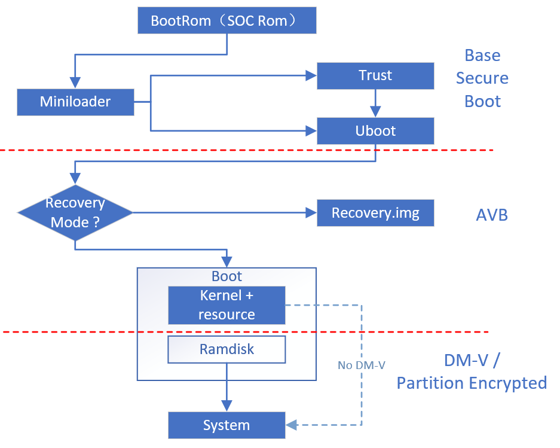
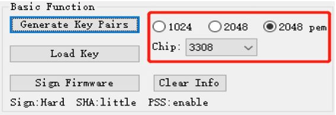
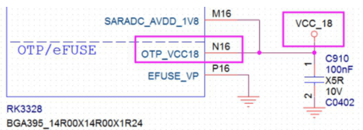
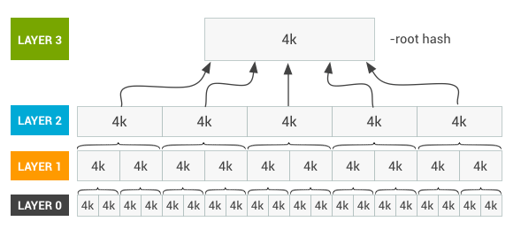

# Rockchip Linux Secure Boot Developer Guide

ID: RK-KF-YF-379

Release Version: V2.0.1

Release Date: 2020-8-10

Security Level: □Top-Secret   □Secret   □Internal   ■Public

**DISCLAIMER**

THIS DOCUMENT IS PROVIDED “AS IS”. ROCKCHIP ELECTRONICS CO., LTD.(“ROCKCHIP”)DOES NOT PROVIDE ANY WARRANTY OF ANY KIND, EXPRESSED, IMPLIED OR OTHERWISE, WITH RESPECT TO THE ACCURACY, RELIABILITY, COMPLETENESS,MERCHANTABILITY, FITNESS FOR ANY PARTICULAR PURPOSE OR NON-INFRINGEMENT OF ANY REPRESENTATION, INFORMATION AND CONTENT IN THIS DOCUMENT. THIS DOCUMENT IS FOR REFERENCE ONLY. THIS DOCUMENT MAY BE UPDATED OR CHANGED WITHOUT ANY NOTICE AT ANY TIME DUE TO THE UPGRADES OF THE PRODUCT OR ANY OTHER REASONS.

**Trademark Statement**

"Rockchip", "瑞芯微", "瑞芯" shall be Rockchip’s registered trademarks and owned by Rockchip. All the other trademarks or registered trademarks mentioned in this document shall be owned by their respective owners.

**All rights reserved. ©2020. Rockchip Electronics Co., Ltd.**

Beyond the scope of fair use, neither any entity nor individual shall extract, copy, or distribute this document in any form in whole or in part without the written approval of Rockchip.

Rockchip Electronics Co., Ltd.

No.18 Building, A District, No.89, software Boulevard Fuzhou, Fujian,PRC

Website:     [www.rock-chips.com](http://www.rock-chips.com)

Customer service Tel:  +86-4007-700-590

Customer service Fax:  +86-591-83951833

Customer service e-Mail:  [fae@rock-chips.com](mailto:fae@rock-chips.com)

---

**Preface**

**Overview**

This document mainly introduces the steps and notices of Secure Boot under RK Linux platform, which is convenient for customers to do secondary development base on it. Secure Boot function is designed to ensure devices with correct and valid firmware, and unsigned or invalid firmware will not boot.

**Product Version**

| **Chipset**                      | **Kernel Version** |
| -------------------------------- | ------------------ |
| RK3308/RK3399/RK3328/RK3326/PX30 | 4.4                |

**Intended Audience**

This document (this guide) is mainly intended for:

Technical support engineers

Software development engineers

**Revision History**

| **Version** | **Author** | **Date**   | **修改说明**                                                 |
| ----------- | ---------- | :--------- | ------------------------------------------------------------ |
| V1.0.0      | WZZ        | 2018-10-31 | Initial version                                              |
| V1.0.1      | WZZ        | 2018-12-17 | Fix vbmeta to security                                       |
| V2.0.0      | WZZ        | 2019-06-03 | Sign_Tool is compatible with AVB boot.img，<br/>Update device-mapper related introduction |
| V2.0.1      | Ruby Zhang | 2020-08-10 | Update the company name and document format                  |

---

**Contents**

[TOC]

---

## Secure Boot Introduction

### Secure Boot Process



As shown in the above figure, starting from BootRom, a reliable security verification solution is established step by step on Linux platform. And it is divided into three parts in order. Customers can choose verification contents according to their own need.

Base Secure Boot: start with BootRom and verify Miniloader/Trust/Uboot step by step.

AVB: start with Uboot and verify Boot and Recovery (Optional).

DM-V: verify or decrypt system partition by Ramdisk tool that is packaged in Boot.

Note: the main difference between the above process and Android platform is DM-V process. Android takes fs_mgr mechanism to implement DMV verification in kernel. But Linux uses Ramdisk to verify.

### Secure Boot Secure Storage

The following secure storage areas are included in Linux platform:

| Storage area       | Note                                                         |
| ------------------ | ------------------------------------------------------------ |
| OTP / eFuse        | Located in SOC, it is a fuse mechanism and irreversible flashing. <br/>OTP can be flashed by Miniloader but eFuse can only be flashed by PC tool<br/>(Refer to [Section 2.2 Secure Information Flahing](# Secure Information Flashing)).<br/> Medias are different in different SOC. <br/>Currently, Linux platforms mainly includes:<br/>eFuse: RK3399 / RK3288<br/>OTP： RK3308 / RK3326 / PX30 / RK3328<br/>(See [Section 1.3 Reference Resources](# Reference Resources)<br/>Rockchip-Secure-Boot-Application-Note-V1.9.pdf） |
| RPMB               | It is a physical partition of eMMC, and it is not available<br/> in file system and requires SOC authorizing access<br/> (that is, it can only be accessed by TEE).<br/> Generally it is considered to be a secure area. |
| Security Partition | The logical partition of storage medium<br/> is a temporary partition added to supplement <br/>the absence of RPMB on Flash. The partition contents <br/>are encrypted and stored and cannot be mounted, <br/>but may be forcibly erased. It can only be accessed by TEE<br/> (if you force to erase, TEE access will fail and <br/>Secure Boot will not start properly). |

Note: Since OTP (eFuse) is mainly used internally by Rockchip, for security information, customers should give priority to other areas such as RPMB/Security. If you have a special needs, please apply for related materials by business.

Secure information and storage location of each process:

| Security Information | Storage area                                                 |
| -------------------- | ------------------------------------------------------------ |
| Base Secure Boot     | Public Key Hash is stored in OTP/eFuse                       |
| AVB                  | In OTP device：<br/>permanent_attributes.bin is stored in OTP<br/>In eFuse device：<br/>permanent_attributes.bin is stored in RPMB/Security Partition<br/>permanent_attributes_cer.bin is stored in RPMB/Security Partition<br/>(permanent_attributes.bin is verified by Base Secure Boot Key) |
| DM-V                 | Root Hash is stored in Boot's Ramdisk, and Boot contents are verified by AVB to ensure accurate |

### Reference Resources

Reference documents are located in SDK/docs/Develop reference documents/SECURITY/ directory:

Rockchip-Secure-Boot-Application-Note-V1.9.pdf

Rockchip-Secure-Boot2.0.pdf

SDK/tools/linux/Linux_SecurityAVB/Readme.md

SDK/kernel/ Documentation/device-mapper/

<https://android.googlesource.com/platform/external/avb/+/master/README.md>

<https://source.android.google.cn/security/verifiedboot/dm-verity>

Linux Secure Boot tools:

Link of enterprise network disk: <https://eyun.baidu.com/s/3qZwY9FQ>  password: OubV

(Tool’s version is backward compatible, please use the high version tool first)

## Base Secure Boot

Base Secure Boot provides basic security to U-boot (loader/trust/uboot)

The start process is as follows:


In short, a signed firmware includes Firmware(OBM Code) + Digital Signature + Public key

Digital Signature + Public Key are added by signature tool.

About memory, the signed firmware is stored in eMMC or Flash, and the Public Key Hash is stored in OTP (eFuse) of a chip.

When starting, public key of the end of a firmware is verified by the Hash in OTP, and then the digital signature is verified by the public key to achieve the binding effect of a chip and signature code.

See Rockchip-Secure-Boot-Application-Note-V1.9.pdf for details.

### Signature Tools

#### UI tool (Windows)

SDK/tools/windows/SecureBootTool_v1.94 or see the enterprise network disk (see [Section 1.3 Reference Resources](# Reference Resources))

1. Modify configurations

Open setting.ini in the tool：

If AVB is needed, modify exclude_boot_sign = True。

If the chip uses OTP to enable Secure Boot, set sign_flag=0x20. (bit 5: loader OTP write enabled, boards that have been written OTP, or eFuse chips, this flag should be set to null.)

2. Generate public and private keys

Select Chip and Key formats (pem is common format), click “Generate Key Pairs” to generate PrivteKey.pem and PublicKey.pem. (**Keys are generated randomly. Please save these two keys properly. After the security function is enabled, if the two keys are lost, the device will not be able to upgrade**.)



3. Load key

Select “Load Key” to load the public and private keys follow the prompts.

4. Signature

There are two ways to sign: only sign update.img and independent sign.

If you have already packaged update.img, you can sign update.img directly by “Sign Firmware”.

Independent sign need to press “CTRL + R +K” to open “Advanced Function”:


“Sign Loader” is used to sign Miniloader.bin

“Sign File” is used to sign trust.img and uboot.img

 (Actually, sign update.img is unpack update.img, and then sign each firmware separately, and then packaged as a whole, at last sign the whole again)

#### Command Line Tool

rk_sign_tool_v1.3_win.zip or rk_sign_tool_v1.3_linux.zip are in the enterprise network disk(see [Section 1.3 Reference Resources](# Reference Resources))

```shell
# step1：Generate rsa public private key (if you already have a key, skip this step)
 ./rk_sign_tool kk --out .
# step2：Load the public and private keys (can be load only once) and automatically saved to setting.ini
./rk_sign_tool lk --key privateKey.pem --pubkey publicKey.pem
# step3：Select the chip to determine signature  solution
./rk_sign_tool cc --chip 3326
# stpe4：Open setting.ini
# Set sign_flag = 0x20
# If the platform uses OTP to store security information, set sign_flag = 0x20, enable RKloader OTP writing function, empty boards must be enabled; otherwise, this item will be cleared.
# If AVB is needed, change exclude_boot_sign = True
# stpe5：Overall sign( independent sign skip this step).
./rk_sign_tool sf --firmware update.img
# stpe6：Sign loader, overall sign, skip steps 6-8.
./rk_sign_tool sl --loader  rk3326loader.bin
# stpe7：Sign uboot, for versions before v1.3, RK3326/RK3308 need to add—pss; others do not need.
./rk_sign_tool si --img uboot.img
# stpe8：Sign trust, for version before v1.3, RK3326/RK3308 need to add--pss；others do not needed.
./rk_sign_tool si --img trust.img
```

### Secure Information Flashing

#### OTP

If a chip uses OTP to enable Secure Boot function, ensure that OTP pin of the chip is powered during Loader process. Download firmware directly through AndroidTool (Windows) / upgrade_tool (Linux). The first time you restart, Loader will be responsible for writing Hash of the Key to OTP and activating Secure Boot. Restart again and then the firmware is protected.



#### eFuse

If a chip uses eFuse to enable Secure Boot function, please ensure that the hardware connection is correct, because kernel has not been started when downloading eFuse, so please ensure that VCC_IO was powered in MaskRom state.


The board enters MaskRom state by using tools/windows/eFusetool_vXX.zip,.

Click "Firmware", select the signed update.img, or Miniloader.bin, click "Start" to start download eFuse.


After eFuse is successfully downloaded, power off and restart, enter MaskRom, use AndroidTool to download other sign firmware to the board.

### Verify

After secure boot takes effect, there are logs similar to the following output during Loader process.

```log
SecureMode = 1
Secure read PBA: 0x4
SecureInit ret = 0, SecureMode = 1
```

## AVB

AVB requires U-boot to work together. AVB on Linux is used to guarantee the integrity of uboot.img (including boot.img and recovery.img).

The corresponding tool is in tools/linux/Linux_SecurityAVB.

For detailed usage, please refer to tools/linux/Linux_SecurityAVB/Readme.md

(If there is a conflict, the Linux_SecurityAVB/Readme.md shall prevail)

### Notice

About device lock & unlock：

When a device is in unlock state, program will still verify the whole boot.img. If the firmware has an error, the program will report what the error is, but **the device starts normally**. If a device is in lock state, the program will verify the whole boot.img. If the firmware has an error, the next level of firmware will not be started. Therefore, setting the device to unlock state during debugging is more convenient.

### Firmware Configuration

Trust：

Endter rkbin/RKTRUST, take RK3308 as an example, find RK3308TRUST.ini and change:

```shell
[BL32_OPTION]
SEC=0
```

to

```shell
[BL32_OPTION]
SEC=1
```

U-boot：

U-boot needs FASTBOOT and OPTEE support:

```shell
CONFIG_OPTEE_CLIENT=y
CONFIG_OPTEE_V1=y	#RK312x/RK322x/RK3288/RK3228H/RK3368/RK3399 and V2 are mutually exclusive
CONFIG_OPTEE_V2=y	#RK3308/RK3326 and V1 are mutually exclusive
```

In config files, configure AVB to open:

```shell
CONFIG_AVB_LIBAVB=y
CONFIG_AVB_LIBAVB_AB=y
CONFIG_AVB_LIBAVB_ATX=y
CONFIG_AVB_LIBAVB_USER=y
CONFIG_RK_AVB_LIBAVB_USER=y
CONFIG_AVB_VBMETA_PUBLIC_KEY_VALIDATE=y
CONFIG_CRYPTO_ROCKCHIP=y
CONFIG_ANDROID_AVB=y
CONFIG_ANDROID_AB=y	#open when needed
CONFIG_OPTEE_ALWAYS_USE_SECURITY_PARTITION=y	#open when pmb is not available, not open by default
CONFIG_ROCKCHIP_PRELOADER_PUB_KEY=y #should be open in eFuse security solution
```

Firmware, Certificate and hash should be flashed by fastboot, so fastboot function needs to be configured in config file.

```shell
CONFIG_FASTBOOT=y
CONFIG_FASTBOOT_BUF_ADDR=0x800800   #it varies between platforms, refer to default configuration
CONFIG_FASTBOOT_BUF_SIZE=0x04000000 #it varies between platforms, refer to default configuration
CONFIG_FASTBOOT_FLASH=y
CONFIG_FASTBOOT_FLASH_MMC_DEV=0
```

Use `./make.sh xxxx`,  to generate uboot.img, trust.img, loader.bin

Parameter：

AVB needs to add vbmeta partition to store firmware signature information, the size is 1M and the location is optional.

AVB needs system partition. On buildroot (that is rootfs partition), rootfs is renamed to system. If uuid is used, uuid partition name should be modified.

If storage medium is Flash, you have to add another security partition to store operation information. Contents also should be encrypted, the size is 4M and the location is optional. (eMMC does not need to add this partition, eMMC operation information is stored in physical RPMB partition)

The following is an example of AVB parameter:

```shell
0x00002000@0x00004000(uboot),0x00002000@0x00006000(trust),0x00002000@0x00008000(misc),0x00010000@0x0000a000(boot),0x00010000@0x0001a000(recovery),0x00010000@0x0002a000(backup),0x00020000@0x0003a000(oem),0x00300000@0x0005a000(system),0x00000800@0x0035a000(vbmeta),0x00002000@0x0035a800(security),-@0x0035c800(userdata:grow)
```

AVB ab parameter:

```shell
0x00002000@0x00004000(uboot),0x00002000@0x00006000(trust_a),0x00002000@0x00008000(trust_b),0x00002000@0x0000a000(misc),0x00010000@0x0000c000(boot_a),0x00010000@0x0001c000(boot_b),0x00010000@0x0002c000(backup),0x00020000@0x0003c000(oem),0x00300000@0x0005c000(system_a),0x00300000@0x0035c000(system_b),0x00000800@0x0065c000(vbmeta_a),0x00000800@0x0065c800(vbmeta_b),0x00002000@0x0065d000(security),-@0x0065f00(userdata:grow)
```

When downloading, the name on the tool should be modified synchronously. After modification, reload parameter.

### AVB Key

The main information of AVB contains the following four Keys:

Product RootKey (PRK): root Key of AVB, in eFuse devices, related information is verified by Base Secure Boot Key. In OTP devices, PRK-Hash information pre-stored in OTP is directly read and verified;

ProductIntermediate Key (PIK): intermediate Key;

ProductSigning Key (PSK): used to sign a firmware;

ProductUnlock Key (PUK): used to unlock a device.


A series of files are generated based on these 4 Keys, as shown in the figure. Refer to the Google AVB open source documents for details. <https://android.googlesource.com/platform/external/avb/+/master/README.md>

Compared with the original AVB, Linux grabs of main firmware verification function of AVB. In order to adapt to RK platform, additional permanent_attributes_cer.bin is generated in eFuse, in other words, it unnecessary to store permanent_attributes.bin in eFuse, permanent_attributes.bin information is verified directly by Base Secure Boot Key to save eFuse space.

**There is already a set of test certificates and key in this directory. If you need a new Key and certificate, you can generate it yourself by the following steps:**

**Please keep the generated files properly, otherwise you will not be able to unlock after locking, and the device will not be able to flashed.**

```shell
openssl genpkey -algorithm RSA -pkeyopt rsa_keygen_bits:4096 -outform PEM -out testkey_prk.pem
openssl genpkey -algorithm RSA -pkeyopt rsa_keygen_bits:4096 -outform PEM -out testkey_psk.pem
openssl genpkey -algorithm RSA -pkeyopt rsa_keygen_bits:4096 -outform PEM -out testkey_pik.pem
touch temp.bin
python avbtool make_atx_certificate --output=pik_certificate.bin --subject=temp.bin --subject_key=testkey_pik.pem --subject_is_intermediate_authority --subject_key_version 42 --authority_key=testkey_prk.pem
echo "RKXXXX_nnnnnnnn" > product_id.bin
python avbtool make_atx_certificate --output=psk_certificate.bin --subject=product_id.bin --subject_key=testkey_psk.pem --subject_key_version 42 --authority_key=testkey_pik.pem
python avbtool make_atx_metadata --output=metadata.bin --intermediate_key_certificate=pik_certificate.bin --product_key_certificate=psk_certificate.bin

# The temp.bin is a temporary file created by yourself, just new temp.bin and don’t need to fill in data.
# Product_id.bin needs to be defined by yourself, the size is 16 bytes, which can be defined as product ID.

# Generate permanent_attributes.bin：
python avbtool make_atx_permanent_attributes --output=permanent_attributes.bin --product_id=product_id.bin --root_authority_key=testkey_prk.pem

# Generate PUK：
openssl genpkey -algorithm RSA -pkeyopt rsa_keygen_bits:4096 -outform PEM -out testkey_puk.pem

# Puk_certificate.bin and permanent_attributes.bin are certificates for unlocking a device. The generation process requires PrivateKey.pem which is the key to be downloaded into efuse/otp (refer to [Chapter 2 Base Secure Boot](# Base Secure Boot)). The process is as follows:
python avbtool make_atx_certificate --output=puk_certificate.bin --subject=product_id.bin --subject_key=testkey_puk.pem --usage=com.google.android.things.vboot.unlock --subject_key_version 42 --authority_key=testkey_pik.pem

# For eFuse devices, you also need to generate additional permanent_attributes_cer.bin (OTP devices can skip this step)
openssl dgst -sha256 -out permanent_attributes_cer.bin -sign PrivateKey.pem permanent_attributes.bin
```

### Generate vbmeta.sh

The signature script is `make_vbmeta.sh`

Below is firmware signature format:：

```shell
python avbtool add_hash_footer --image  --partition_size <SIZE> --partition_name <PARTITION> --key testkey_psk.pem --algorithm SHA512_RSA4096
```

IMG is the signed firmware.

SIZE is firmware size after signature, it is at least 64K larger than the original file, and does not exceed the partition size defined in parameter and must be 4K aligned.

PARTITION is boot / recovery

After signature, generate vbmeta.img by the signed file.

Basic format:

```shell
python avbtool make_vbmeta_image --public_key_metadata metadata.bin --include_descriptors_from_image  --algorithm SHA256_RSA4096 --rollback_index 0 --key testkey_psk.pem  --output vbmeta.img
```

"--include_descriptors_from_image \  this field can be used multiple times, that is, how many encrypted files, how many --include_descriptors_from_image are added.

For example：

```shell
python avbtool make_vbmeta_image --public_key_metadata metadata.bin --include_descriptors_from_image boot.img --include_descriptors_from_image recovery.img --algorithm SHA256_RSA4096 --rollback_index 0 --key testkey_psk.pem  --output vbmeta.img
```

You can modify make_vbmeta.sh script and generate vbmeta.img according to the above rules.

### Flashing Process

1. Put boot.img/recovery.img in the directory
2. Run make_vbmeta.sh to generate vbmeta.bin and encrypt boot.img/recovery.img
3. Replace firmware:

Replace uboot.img, trust.img, MiniloaderAll.bin with newly configured firmware

Boot.img uses the encrypted firmware generated in this directory.

Extracted out vbmeta.bin

Modify parameter.txt according to the rules in chapter 2.3

4. Flash by the tool.

If you are using a Windows tool, add a vbmeta partition to the tool (security partition depends on parameter), the address should not be full filled. Then reload parameter and the tool will update the address itself.

5. After downloading, the device is in unlock state by default. At this time, the firmware will still verify, but it will not block system startup, and only report errors.

### AVB Lock \& Unlock

AVB will block unsigned firmware startup only in lock state.

AVB Lock state is active in Fastboot mode. There are three ways for a device entering Fastboot mode:

1. Boot to system and run reboot fastboot

2. Go to U-boot command line and enter fastboot usb 0

3. If there is a fastboot button, enter fastboot mode by the button.

Then PC operates by fastboot command (may require administrator permission)

Download PUB Key

```shell
sudo ./fastboot stage permanent_attributes.bin
sudo ./fastboot oem fuse at-perm-attr
#Permanent_attributes.bin is stored in RPMB/security partition. On an OTP device, Hash of permanent_attributes.bin is also calculated and download into OTP.

# eFuse only， skip this step if used OTP
sudo ./fastboot stage permanent_attributes_cer.bin
sudo ./fastboot oem fuse at-rsa-perm-attr
#Download permanent_attributes_cer.bin to RPMB/security, in this way, Base Secure Boot Root Key can be used to verify permanent_attributes.bin in efuse devices.
```

Lock  process:

```shell
sudo ./fastboot oem at-lock-vboot
sudo ./fastboot reboot
```

 Unlock  process:

```shell
sudo ./fastboot oem at-get-vboot-unlock-challenge
sudo ./fastboot get_staged raw_unlock_challenge.bin
./make_unlock.sh
sudo ./fastboot stage unlock_credential.bin
sudo ./fastboot oem at-unlock-vboot
```

The last Lock Log:

```log
ANDROID: reboot reason: "(none)"
Could not find security partition
read_is_device_unlocked() ops returned that device is LOCKED
```

## DM-V

One precondition of using DM-V is that boot.img must be secure. This solution will package a ramdisk in boot.img. The security of ramdisk is guaranteed by AVB. The veritysetup tool is used to verify mounted firmware in ramdisk.

The advantage of DM-V is that verification speed is fast, the larger the firmware, the more obvious the effect.

The disadvantage is that DM-V can only work in read-only file systems, Boot and System firmware will become larger.

The basic theory is Device-Mapper-Verity technology, which will do 4K segmentation on a verification firmware and hash calculation for each 4K data slice, iterate multiple layers, and generate corresponding Hash-Map (within 30M) and Root- Hash. When creating a virtual partition based on DM-V, Hash-Map is verified to ensure that the Hash-Map is correct.



After the partition is mounted, when there is data accessing, it is going to do hash verification of the 4K partition where the data is located. When verification errors occur, I/O errors are returned, and the corresponding location cannot be used, which is similar to file system corruption.

Please refer to Documentation/device-mapper/ under Kernel for details.

Or refer to <https://source.android.google.cn/security/verifiedboot/dm-verit>.

### Sign Firmware

DM-V function can be used when kernel opens related resources.

Pay attention to open CONFIG_DM_VERITY when Compiling Kernel.

For related tools, refer to the network disk file ([Section 1.3 Reference Resources](# Reference Resources)) Linux_SecurityDM_v1_01.tar.gz

The above compressed files should be decompressed in a Linux environment. It contains soft links and will be expanded to original file size, causing the file to become larger under windows.

Decompress the file to get:

```log
|── config
|── mkbootimg
|── mkdm.sh
└── ramdisk.tar.gz
```

First configure the config file, please fill in the corresponding information according to actual situation.

```shell
ROOT_DEV=	#the partition location of actual root firmware in flash, such as /dev/mmcblk2p8
INIT=		#the first script that actual root runs, generally is /init or /sbin/init
ROOTFS_PATH=	#rootfs firmware that needs to be signed
KERNEL_PATH=		#Kernel Image location, generally is kernel/arch/arm(64)/boot/Image
RESOURCE_PATH=	#kernel resource.img location, generally is kernel/resource.img
```

Then run `./mkdm.sh -m dmv -c config (--debug)`, the script will automatically package Root-Hash into Ramdisk, and package with kernel, resource to boot.img. Hash-Map is attached to rootfs.img.

Obtain boot.img and rootfs_dmv.img from output directory.

Download the two firmware to the board instead of the original boot.img and rootfs.img.

## Partition Encryption

Partition encryption is also based on device-mapper technology, except each partition block treatment. Refer to [Chapter 4 DM-V](# DM-V)

Advantages: high security, free file system, readable and writable.

Disadvantages: when encrypting partitions, they cannot be compressed; reading and writing data must be calculated by encryption and decryption, which affects the efficiency of reading and writing to some extent.

### rootfs Encryption

Like DM-V, partition encryption also requires Kernel to open related resources:

```shell
CONFIG_BLK_DEV_DM
CONFIG_DM_CRYPT
CONFIG_BLK_DEV_CRYPTOLOOP
```

Share a set of tools with DM-V (Linux_SecurityDM_v1_01.tar.gz)

Need to configure the following items in the config file:

```shell
ROOT_DEV=	#the location of actual root firmware in flash, such as /dev/mmcblk2p8
INIT=	 #the first script that the actual root runs, generally is /init or /sbin/init
KERNEL_PATH=	 #Kernel Image location, generally is kernel/arch/arm(64)/boot/Image
RESOURCE_PATH=	#Kernel resource.img location, generally is kernel/resource.img
inputimg=	#firmware that needs to be encrypted
cipher= #aes-cbc-plain by default
key= #note the format size, the key should match with cipher
```

Use`./mkdm.sh -m fde-s -c config`

to generate boot.img and encrypted.img in output directory.

Download these two firmware to the board instead of the original boot.img and rootfs.img.

### Non System Firmware Encryption

There are many open source tools for firmware encryption and decryption. We are talking about dmsetup (consistent with tools in chapter 5.1) here. To use this tool, you need to open the following configurations:

```shell
# Kernel：
CONFIG_BLK_DEV_DM
CONFIG_DM_CRYPT
CONFIG_BLK_DEV_CRYPTOLOOP

# Buildroot：
BR2_PACKAGE_LUKSMETA
```

Share a set of tools with DM-V(Linux_SecurityDM_v1_01.tar.gz)

Need to configure the following items in the config file

```shell
inputimg=	#firmware that need to be encrypted, or use inputfile to encrypt folders
cipher= # aes-cbc-plain by default
key= # note the format size, the key should match with cipher
```

Using `./mkdm.sh -m fde -c config` to generate encrypted.img and encrypted_info in the output directory.

Encrypted.img is the encrypted file, which can be mounted and virtualized to a partition device by dmsetup. The encrypted_info here is encrypted information, such as:

```shell
#dmsetup create encfs-4284779680572201071 --table "0 550912 crypt aes-cbc-plain 000102030405060708090a0b0c0d0e0f101112131415161718191a1b1c1d1e1f 0 TARGET_PARTITION 0 1 allow_discards"
sectors=550912
cipher=aes-cbc-plain
key=000102030405060708090a0b0c0d0e0f101112131415161718191a1b1c1d1e1f
```

The method to mount encrypted files to /mnt:

```shell
source encrypted_info
loopdevice=`losetup -f`
losetup ${loopdevice} encrypted.img
dmsetup create encrypt-file --table "0 $sectors crypt $cipher $key 0 $loopdevice 0 1 allow_discards"
mount /dev/mapper/encrypt-file /mnt
```

Umount method：

```shell
umount /mnt
dmsetup remove encrypt-file
losetup -d ${loopdevice}
```

### About mkdm.sh

Mkdm.sh provides some basic debugging functions in addition to dm-verity and partition encryption.

For example：

1. boot_only

When this option is packaged, only boot.img changed but rootfs didn’t.

2. debug

Provide real-time running commands for all mkdm.sh, which can be useful when script fails to run.

3. ramdisk

This option is useful when customers have a customize ramdisk requirement.

4. More functions, please read the script.
