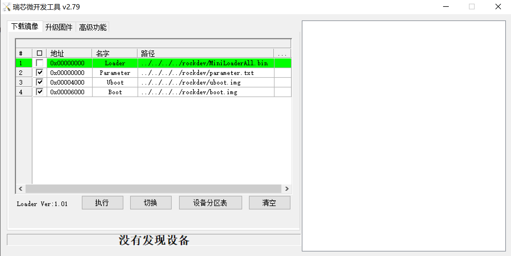
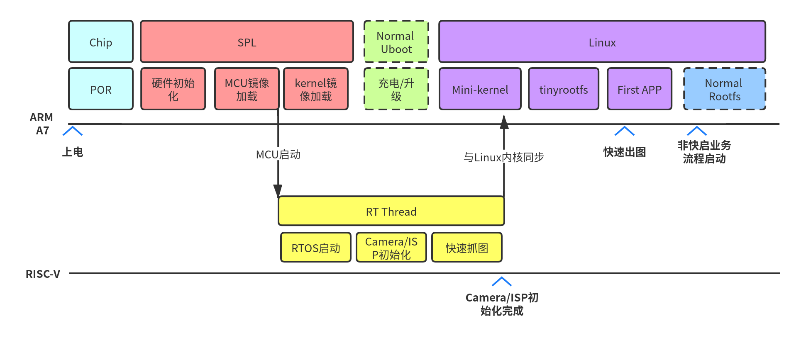
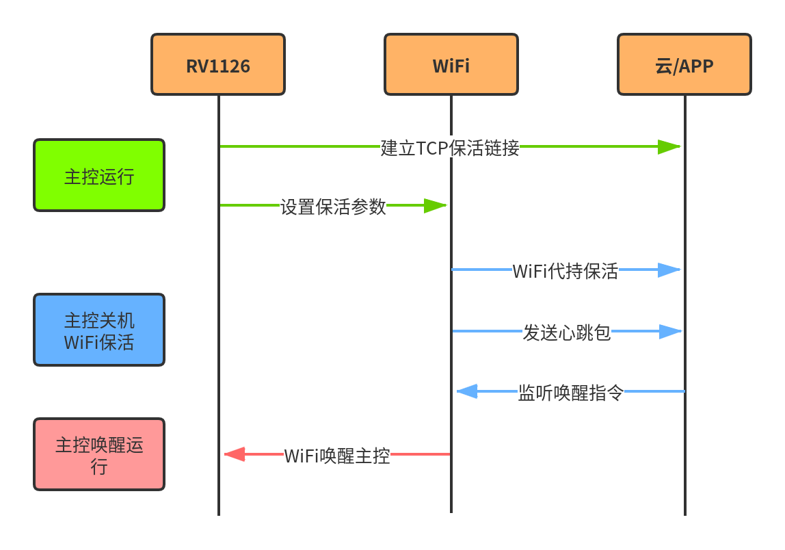
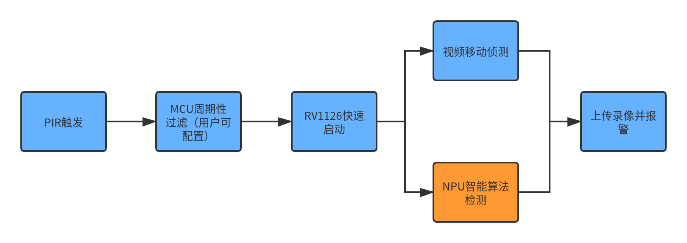

# RV1126/RV1109 低功耗/快速启动产品开发指南

文档标识：RK-KF-YF-397

发布版本：V1.1.0

日期：2020-12-12

文件密级：□绝密   □秘密   □内部资料   ■公开

**免责声明**

本文档按“现状”提供，瑞芯微电子股份有限公司（“本公司”，下同）不对本文档的任何陈述、信息和内容的准确性、可靠性、完整性、适销性、特定目的性和非侵权性提供任何明示或暗示的声明或保证。本文档仅作为使用指导的参考。

由于产品版本升级或其他原因，本文档将可能在未经任何通知的情况下，不定期进行更新或修改。

**商标声明**

“Rockchip”、“瑞芯微”、“瑞芯”均为本公司的注册商标，归本公司所有。

本文档可能提及的其他所有注册商标或商标，由其各自拥有者所有。

**版权所有 © 2021 瑞芯微电子股份有限公司**

超越合理使用范畴，非经本公司书面许可，任何单位和个人不得擅自摘抄、复制本文档内容的部分或全部，并不得以任何形式传播。

瑞芯微电子股份有限公司

Rockchip Electronics Co., Ltd.

地址：     福建省福州市铜盘路软件园A区18号

网址：     [www.rock-chips.com](http://www.rock-chips.com)

客户服务电话： +86-4007-700-590

客户服务传真： +86-591-83951833

客户服务邮箱： [fae@rock-chips.com](mailto:fae@rock-chips.com)

---

**前言**

**概述**

本文主要描述了RV1126/RV1109 Linux SDK用来开发低功耗/快速启动相关产品的技术要点，希望能够帮助客户快速上手开发低功耗相关产品，比如：电池IPC、智能门铃、智能猫眼、智能门锁等。

**产品版本**

| **芯片名称** | **内核版本** |
| ------------ | ------------ |
| RV1126/RV1109   | Linux 4.19 |

**读者对象**

本文档（本指南）主要适用于以下工程师：

- 技术支持工程师
- 软件开发工程师

**修订记录**

| **版本号** | **作者** | **修改日期** | **修改说明** |
| ---------- | --------| :--------- | ------------ |
| V1.0.0 | Zhichao Yu, Ziyuan Xu, Hans Yang, Tao Huang | 2020-12-22 | 初始版本     |
| V1.1.0 | Zhihua Wang | 2021-02-02 | 增加双目使用说明 |

---

**目录**

[TOC]

---

## 产品方案基本介绍

### 低功耗产品方案介绍

低功耗带电池产品都有一个共同特点就是在用电池的情况下，需要使用的时间长达半年甚至一年的时间。目前已经有很多非常类似的产品，比如：电池IPC、智能猫眼、智能门铃、人脸门锁等等。

为了延长电池使用时间，在做这类产品的时候我们就要求，设备不工作时SoC必须处于关机状态，DDR也完全掉电。当外部条件（比如PIR或者Wi-Fi远程唤醒）触发的时候，通过快速冷启动的方式，快速进入到工作模式。所以冷启动时间也成为了这种产品非常关键的指标。

RV1126/RV1109芯片采用14nm工艺，运行电压0.8V，功耗和温升相比前一代的芯片都有极大的提升。另外，RV1126/RV1109内部有专门针对快速启动做了硬件优化设计，可以极大地降低快速启动时间，比如RV1126/RV1109芯片内置硬件解压缩模块，可以快速解压rootfs和kernel。

目前我们电池IPC样机支持的唤醒方式有：

- 按键唤醒
- PIR唤醒
- Wi-Fi远程唤醒

### RV1126/RV1109开发低功耗产品方案的优势

- 14nm制程，运行电压低，功耗低；
- 快速冷启动，250ms快速抓拍，350ms可以启动应用服务；
- ISP2.0，去噪模块强化，可以实现暗光全彩；
- 支持H264 Smart编码，可以实现更低的码率更高的画质；
- 支持Wi-Fi低功耗保活和远程唤醒机制；
- 支持全双工语音对讲，支持语音3A算法；
- 目前支持阿里云、涂鸦等云平台；

### 电池IPC产品框图

基于目前RV1126/RV1109芯片，开发电池IPC产品的框图如下：


方案框图中，T2 Wi-Fi是一颗低功耗Wi-Fi芯片，里面集成了一颗低功耗MCU，这样我们就能省掉一个外置的低功耗的MCU。一般情况下，外置低功耗MCU上需要执行一些低功耗的逻辑，这样可以不要给主控上电就可以进行一些低功耗逻辑的处理，例如：

- 充电电流的控制；
- 唤醒源判断；
- 电量读取；
- PIR使能控制；
- PIR唤醒多次过滤；

如果客户选择其他低功耗Wi-Fi，并且不带MCU功能的话，我们建议方案设计上需要考虑外置一颗低功耗MCU。

## RV1126/RV1109快速启动SDK介绍

### 快速启动/低功耗软件框架基本介绍

#### 基础板级配置介绍

RV1126/RV1109 SDK中目前和快速启动的相关配置如下：

| 配置名                        | 说明                                                         |
| ----------------------------- | ------------------------------------------------------------ |
| BoardConfig-tb-v12.mk         | 用来编译RV1126 DDR3 EVB V12板子的板级配置，存储使用eMMC      |
| BoardConfig-tb-v13.mk         | 用来编译RV1126 DDR3 EVB V13板子的板级配置，存储使用eMMC      |
| BoardConfig-spi-nor-tb-v13.mk | 用来编译RV1126 DDR3 EVB V13板子的板级配置，存储使用SPI Nor   |
| BoardConfig-dualcam-tb-v13.mk | 用来编译RV1126 DDR3 EVB V13板子的板级配置，存储使用eMMC，支持双目 |
| BoardConfig-battery-ipc.mk    | 用来编译电池IPC LPDDR3 Demo Board的板级配置，存储使用eMMC           |

RV1126/RV1109默认使用BoardConfig.mk配置，编译上述配置时需要先切换板级配置再进行编译，参考命令如下：

```shell
./build.sh BoardConfig-tb-v13.mk && ./build.sh
```

客户可以根据自己的产品需求，基于上述配置进行开发。

#### 镜像分区说明

快速启动固件镜像分区和常规IPC固件不一样，分区配置可以参考SDK中device/rockchip/rv1126_rv1109目录下的文件：

```
parameter-tb.txt                              // eMMC快速启动镜像分区配置
parameter-spi-nor-tb-32M.txt                 // SPI Nor 32MB快速启动镜像分区配置
```

快速启动一般创建了如下几个分区：

- uboot

说明：uboot分区实际打包了MCU镜像和Trust镜像，他们会被SPL加载；

配置文件路径：`rkbin/RKTRUST/RV1126TOS_TB.ini`

- boot

说明：采用fit格式打包，其中包含了dtb、内核镜像和rootfs镜像，rootfs镜像一般采用ramdisk，它们被SPL预加载，并采用decom硬件解压缩。

配置文件路径：`device/rockchip/rv1126_rv1109/boot-tb.its`

- userdata(oem)

说明：根据需要，客户可以单独开一个可读写的分区。

#### 快速启动固件烧写

Linux环境下可以用下面的命令烧写整体固件：

```shell
upgrade_tool uf rockdev/update.img
```

Windows环境下，需要导入快速启动烧写配置，再进行分区烧写，Windows工具快速启动烧写配置文件如下：

```
rv1126_rv1109_tb-config.cfg
```

导入配置后界面显示如下，我们一般只要烧写uboot和boot即可：



关于固件烧写更细节的说明，请参考文档：docs/RV1126_RV1109/Rockchip_RV1126_RV1109_Quick_Start_Linux_CN.pdf

## 快速启动

RV1126/RV1109系列芯片内置硬件解压缩模块 -- decom，可以极大得提升系统启动速度。另外，RV1126/RV1109内置一个MCU，MCU在SoC上电后就会快速启动，迅速初始化Camera和ISP，然后尽可能快得把前几帧图像保存下来。本章主要介绍了RV1126/RV1109快速启动的优化方法和注意事项。

快速启动目前支持如下存储介质：

- eMMC
- SPI Nor Flash

不同存储介质对内核和rootfs镜像的读取速度不一样，下面是不同存储介质典型的读取速度，因此我们不推荐使用SPI Nand Flash作为快速启动的存储介质：

| 存储介质类型   | 读取速度 | 是否支持快速启动 | 参考板级配置                  |
| -------------- | -------- | ---------------- | ----------------------------- |
| eMMC           | 120MB/S  | 是               | BoardConfig-tb-v13.mk         |
| SPI Nor Flash  | 30MB/S   | 是               | BoardConfig-spi-nor-tb-v13.mk |
| SPI Nand Flash | 10.8MB/S | 否               | 不支持                        |

### 快速启动基本流程

RV1126/RV1109快速启动的基本流程如下图所示：



从图中的基本流程可以看到，快速启动版本的启动流程正常情况下是没有跑uboot的，kernel、rootfs以及MCU的系统均通过SPL加载。其中kernel和rootfs的配置都是经过极大的精简的。

RV1126/RV1109使用了很多方法进行快速启动的优化，典型的优化方法如下：

- 内核和rootfs通过SPL加载，裁剪掉uboot；
- 内核和rootfs通过硬件解压缩；
- MCU协助初始化ISP/Camera；
- 驱动并行初始化；
- 内核裁剪；
- rootfs裁剪；
- 算法模型预加载；
- 用户态主进程并行初始化；
- Wi-Fi网络连接优化；

接下来会对以上优化方法做更多深入的介绍。

### BootRom对快速启动的支持

目前 bootrom 的 SPI Nor驱动支持四线DMA模式加载下级固件，这项支持已直接在USBPlug烧写固件时做了配置，客户无需再配置。eMMC目前无此优化。

### SPL快速启动机制介绍

U-Boot SPL 下支持 fit 格式的快速开机，同时支持按键进入loader模式和低电检测。

配置：

```c
CONFIG_SPL_KERNEL_BOOT=y                  // 开启快速开机功能
CONFIG_SPL_BLK_READ_PREPARE=y             // 开启预加载功能
CONFIG_SPL_MISC_DECOMPRESS=y              // 开启解压功能
CONFIG_SPL_ROCKCHIP_HW_DECOMPRESS=y
```

U-Boot SPL 支持预加载功能，使能预加载功能后，可以在执行其他程序的同时加载固件。目前主要用来预加载ramdisk。

例如预加载经过 gzip 压缩过的 ramdisk，压缩命令：

```shell
cat ramdisk | gzip -n -f -9 > ramdisk.gz
```

its文件的配置如下：

```c
ramdisk {
        data = /incbin/("./images-tb/ramdisk.gz");
        compression = "gzip";      // 压缩格式
        type = "ramdisk";
        arch = "arm";
        os = "linux";
        preload = <1>;             // 预加载标志
        comp = <0x5800000>;        // 加载地址
        load = <0x2800000>;        // 解压地址
        decomp-async;              // 异步解压
        hash {
                algo = "sha256";
                uboot-ignore = <1>;    // 不做hash校验
        };
};
```

编译固件，比如编译RV1126 eMMC固件：

```c
./make.sh rv1126-emmc-tb && ./make.sh --spl
```

### 内核快速启动机制介绍

配置：

```c
CONFIG_ROCKCHIP_THUNDER_BOOT=y                   // 开启快速开机功能
CONFIG_ROCKCHIP_THUNDER_BOOT_MMC=y               // 开启支持eMMC快速开机优化功能
CONFIG_ROCKCHIP_THUNDER_BOOT_SFC=y               // 开启支持SPI Nor快速开机优化功能
CONFIG_VIDEO_ROCKCHIP_THUNDER_BOOT_ISP=y         // 开启支持ISP快速开机优化功能
```

为了快速开机，SPL不会依据实际的硬件参数修改kernel dtb的参数，所以有些参数需要用户自己配置，具体需要配置的参数有：

- Memory
- ramdisk解压前后大小

详见：`kernel/arch/arm/boot/dts/rv1126-thunder-boot.dtsi`

```c
memory: memory {
        device_type = "memory";
        reg = <0x00000000 0x20000000>;       // 离线帧预留内存，给MCU抓拍使用，根据需要分配，不需要MCU快速抓拍功能，建议删除
};

reserved-memory {
        trust@0 {
                reg = <0x00000000 0x00200000>;   // trust 空间
                no-map;
        };

        trust@200000 {
                reg = <0x00200000 0x00008000>;
        };

        ramoops@210000 {
                compatible = "ramoops";
                reg = <0x00210000 0x000f0000>;
                record-size = <0x20000>;
                console-size = <0x20000>;
                ftrace-size = <0x00000>;
                pmsg-size = <0x50000>;
        };

        rtos@300000 {
                reg = <0x00300000 0x00100000>;        // 预留给用户端使用，没有使用可以删掉
                no-map;
        };

        ramdisk_r: ramdisk@2800000 {
                reg = <0x02800000 (48 * 0x00100000)>; // 解压源地址和大小，可以依据实际大小进行更改
        };

        ramdisk_c: ramdisk@5800000 {
                reg = <0x05800000 (20 * 0x00100000)>; // 压缩源地址和大小，可以依据实际大小进行更改
        };
};
```

针对eMMC的配置：

```c
/ {
        reserved-memory {
                mmc_ecsd: mmc@20f000 {
                        reg = <0x0020f000 0x00001000>;   // SPL 给kernel上传ecsd区域
                };

                mmc_idmac: mmc@500000 {
                        reg = <0x00500000 0x00100000>;   // 预加载ramdisk时，预留的idmac的内存区域，预加载完成，该区域内存释放掉
                };
        };

        thunder_boot_mmc: thunder-boot-mmc {
                compatible = "rockchip,thunder-boot-mmc";
                reg = <0xffc50000 0x4000>;
                memory-region-src = <&ramdisk_c>;
                memory-region-dst = <&ramdisk_r>;
                memory-region-idmac = <&mmc_idmac>;
        };
};
```

针对SPI Nor的配置：

```c
/ {
        thunder_boot_spi_nor: thunder-boot-spi-nor {
                compatible = "rockchip,thunder-boot-sfc";
                reg = <0xffc90000 0x4000>;
                memory-region-src = <&ramdisk_c>;
                memory-region-dst = <&ramdisk_r>;
        };
};
```

### 驱动并行加载机制

快速开机的内核启动过程，为了充分利用多核优势，并行运行相同 level 的 initcall。

功能需要 `CONFIG_INITCALL_ASYNC=y`，在 `arch/arm/configs/rv1126-tb.config` 中已经默认开启。

内核参数 `initcall_nr_threads` 控制并行的线程。`initcall_nr_threads < 0` 表示使用算法默认线程数；`initcall_nr_threads == 0` 表示关闭此功能；`initcall_nr_threads > 0`，表示使用指定的线程数。

内核默认的 `initcall_debug` 这个 bool 参数控制是否打印 initcall 的调试信息。具体参考 `Documentation/admin-guide/kernel-parameters.txt`。

通过这两个参数，可以观察 initcall 的调用顺序、耗时等信息。默认提供的 dts 中，这两个参数设置为 `initcall_nr_threads=-1 initcall_debug=0`，即使用算法默认线程数，关闭调试信息打印。

使用此功能可能需要的修改：

1. 两个驱动 A 和 B，如果实际上有依赖关系（比如 B 的初始化过程需要 A 的某个变量初始化完成），但 initcall 在相同级别，就会出现 B 早于 A 初始化。由于访问了未初始化的变量，而出现**内核崩溃**。这个时候，就需要手动调整两者的 initcall level，确保 A 的 level 早于 B。之前不出现问题的原因在于，虽然代码写错了，但编译器将 A 的初始化函数放到 B 的前面，事实上保证了顺序。具体的 level 级别参考 `include/linux/init.h`，pure_initcall 最早，late_initcall_sync 最迟。

2. regulator 驱动需要在 subsys_initcall_sync 之前完成驱动注册，这样其它需要 regulator 的驱动不会因为获取不到 regulator 而 probe 失败。可以参考

```
drivers/regulator/rk808-regulator.c:subsys_initcall(rk808_regulator_driver_init);
drivers/regulator/pwm-regulator.c:subsys_initcall_sync(pwm_regulator_driver_init);
```

3. camera 驱动需要提前到 device_initcall（一般通过 module_i2c_driver 注册），而不要使用 device_initcall_sync。因为没有其它驱动在 device_initcall_sync 这个时刻初始化，无法并行。可以参考

```
drivers/media/i2c/ov02k10.c:module_i2c_driver(ov02k10_i2c_driver);
drivers/media/i2c/sc2232.c:module_i2c_driver(sc2232_i2c_driver);
drivers/media/i2c/sc4238.c:module_i2c_driver(sc4238_i2c_driver);
drivers/media/i2c/sc2310.c:module_i2c_driver(sc2310_i2c_driver);
drivers/media/i2c/ov02b10.c:module_i2c_driver(ov02b10_i2c_driver);
drivers/media/i2c/os05a20.c:module_i2c_driver(os05a20_i2c_driver);
drivers/media/i2c/os04a10.c:module_i2c_driver(os04a10_i2c_driver);
drivers/media/i2c/ov12d2q.c:module_i2c_driver(ov12d2q_i2c_driver);
```

### 精简版kernel介绍

快速启动的kernel是通过kernel的config fragment机制来裁剪的。config fragment会覆盖defconfig配置中的同名配置。快速启动的config fragment的路径如下：

```shell
kernel/arch/arm/configs/rv1126-tb.config
```

假设目前正在使用的产品内核配置名称为：rv1126_ipc_defconfig，使用config fragment编译内核的命令如下：

```shell
make rv1126_ipc_defconfig rv1126-tb.config
```

通过上面的命令，就会生成精简内核的配置.config。我们可以从rv1126-tb.config文件中看到，大部分不需要的内核功能都被设置为关闭，大部分所需要的驱动，被配置成m，即rootfs加载后使用模块加载，这样可以加快启动速度。

### 精简版rootfs介绍

rootfs的大小会极大的影像启动时候读取rootfs镜像以及解压缩的速度。在快速启动中，我们的rootfs采用ramdisk文件系统，我们建议尽量控制ramdisk的文件大小。一些可以延迟加载的驱动ko、可执行程序和库需要放到其他分区中。

快速启动参考的rootfs配置在如下路径：

```shell
buildroot/configs/rockchip_rv1126_evb_tb_defconfig
```

从中可以看到，快速启动的rootfs配置是经过极大的精简的，关闭了很多非必须的功能。客户可以根据自身的需求调整rootfs相关配置。

需要说明的是busybox命令也根据快速启动的需求进行了一定裁剪，快速启动使用的busybox配置如下：

```shell
buildroot/board/rockchip/common/tinyrootfs/busybox.config
```

目前SDK rootfs压缩后最大支持的大小20MB，解压后的大小为48MB，客户可以根据实际产品需要参考之前的介绍修改此内存大小，避免DDR浪费或者分配的内存不够用：

```c
vim kernel/arch/arm/boot/dts/rv1126-thunder-boot.dtsi
```

```c
ramdisk_r: ramdisk@2800000 {
        reg = <0x02800000 (48 * 0x00100000)>;        // 解压源地址和大小，可以依据实际大小进行更改
};

ramdisk_c: ramdisk@5800000 {
        reg = <0x05800000 (20 * 0x00100000)>;        // 压缩源地址和大小，可以依据实际大小进行更改
};
```

如果不确定自己rootfs镜像大小的情况，可以通过如下命令来查看：

```shell
me@my-ubuntu:~/rv1126/sdk$ ls -al buildroot/output/rockchip_rv1126_evb_tb/images/
-rw-r--r-- 1 me me 10777600 1月  14 19:31 ramboot.img
-rw-r--r-- 1 me me 16209920 1月  14 19:31 rootfs.romfs                                 // 压缩前的大小
-rw-r--r-- 1 me me  6634740 1月  14 19:31 rootfs.romfs.gz                              // 压缩后的大小
-rw-r--r-- 1 me me 16465920 1月  14 19:31 rootfs.tar
```

### 快速抓拍

设备上电后，MCU会立即对Camera进行采集前几帧的数据进DDR中。设备系统启动完成后，可由应用主动送该数据到ISP+ISPP进行处理。ISP/ISPP从DDR读取RKRAW数据进行处理的机制，我们称之为离线帧处理。

#### MCU启动机制

芯片上电时，MCU处在复位状态，需要ARM为其加载固件，然后撤销复位信号，MCU上电执行，同时ARM启动Linux。

MCU的固件路径为rkbin\bin\rv11\rv1126_riscv_sc210iot_1920_1080_SBGGR10_compact.bin, 编译之前将rv1126_riscv_v1.02.bin删除，rv1126_riscv_sc210iot_1920_1080_SBGGR10_compact.bin改名为rv1126_riscv_v1.02.bin， 目前固件仅支持SC210IOT 1080P 30fps，如需要支持其他Sensor，请联系FAE。

MCU各阶段耗时如下：

| 测试条件                                                     | 系统复位到SENSOR出图耗时 | 出10帧图像耗时 |
| ------------------------------------------------------------ | ------------------------ | -------------- |
| LP3 924M<br />MCU无IRCUT和补光<br />系统在正常运行的过程中直接复位触发示波器抓时序<br />存储介质为eMMC | 174ms                    | 340ms          |

以下更改会影响MCU快速抓图的速度：

1，更改DDR频率

2，增加MCU系统的功能

3，更换Sensor

4，更换存储介质

#### 离线帧处理说明

设备上电后，MCU会立即对Camera进行采集10帧的RAW数据进DDR中。设备系统启动完成后，可以由应用从DDR中读取之前保存的RAW图像送给ISP、ISPP进行处理并输出YUV图像。离线帧处理的数据格式必须为RKRAW格式文件。其基本流程如下：

```txt
DDR -> RKRAW -> ISP -> ISPP -> YUV
```

**dts配置**

要添加新的rkisp、rksipp虚拟节点:

```c
&rkisp_vir1 {
       status = "okay";
};

&rkispp_vir1 {
       status = "okay";
};
```

**buildroot配置**

在处理离线帧之前需要配置离线帧的IQ文件，可以修改buildroot配置：在buildroot/configs/rockchip_rv1126_rv1109_defconfig 添加：

```c
BR2_PACKAGE_CAMERA_ENGINE_RKAIQ_FAKE_CAMERA_IQFILE="sc210iot_YT-SC210-V2_M12-30IRC-2MP-F18.xml"
```

**离线帧Demo测试程序**

代码位于：`external/rkmedia/examples/rkmedia_fake_vi_test.c`

**离线帧测试命令**

```c
rkmedia_fake_vi_test -a /etc/iqfiles -d /dev/video38 -s /dev/v4l-subdev6 -w 1920 -h 1080 -v 1
```

**测试命令参数介绍**
  -a ：指定iq文件FakeCamera.xml的路径
  -d ：FakeCamera的rkispp_m_bypass/rkispp_scale0/rkispp_scale1/rkispp_scale2节点
  -s ：存放reserve mem的 rkisp-isp-subdev
  -w ：FakeCamera的宽
  -h ：FakeCamera的高
  -j ：保存数据类型。 当值为1，保存JPEG数据
  -y ：保存数据类型。当值为1，保存YUV数据
  -v ：保存数据类型。当值为1，本地显示

#### MCU的FAST AE功能说明

通常Sensor初始化后会有一个默认的曝光值、增益值，可适配的场景单一，极容易出现抓取的图像出现过曝或者过暗。
如果要适应各种光照强度不同的环境，需要辅助对亮度统计后自动调节曝光值、增益值的算法，进行快速调节，我们称调节的过程为曝光收敛。
MCU采用RK的FAST AE算法，可搭配硬件上的光敏传感器进行亮度校准，实现帧间曝光快速收敛的调节功能。如果不带光敏器件，那么MCU会默认是室内白天的正常曝光，经过几帧的曝光收敛来实现快速曝光调节。

### 快速启动优化达成情况

通过上述方法优化后，目前快速启动能否达到以下指标：

- 使用eMMC存储，快速启动指标如下：

| 启动阶段        | 指标达成情况 |
| --------------- | ------------ |
| 快速抓拍        | 210ms        |
| Camera出流      | 600ms        |
| Wi-Fi联网获取IP | 1S           |
| Wi-Fi极速推流   | 2S           |

- 使用SPI Nor存储，快速启动指标如下：

| 启动阶段        | 指标达成情况 |
| --------------- | ------------ |
| 快速抓拍        | TBD          |
| Camera出流      | 950ms        |
| Wi-Fi联网获取IP | 1.3S         |
| Wi-Fi极速推流   | 2.5S         |

注意：由于不同的产品配置不同，做出来的快速启动指标和上述指标会有差异，瑞芯微并不保证任何产品类型都能达到上述优化指标。

## 功耗优化

我们在设计低功耗电池产品方案的时候，功耗是一个非常重要的指标。本章节会重点介绍，在功耗优化面，我们有哪些方法和注意事项。

### 功耗优化方法介绍

​    关于功耗优化，目前我们总结出了如下的方法：

- 根据产品需求，降低部分模块实际运行的电压和频率，如CPU、DDR、VEPU和NPU；
- 遍历所有Clock和Power，关闭不需要的模块，同时PLL只保留3个；
- DDR带宽深度优化，减少内存拷贝，关闭不需要的功能；
- 软件Application优化，减少CPU使用率
- 硬件设计上针对功耗进行优化；

### 频率电压表优化

和传统产品方案不同，低功耗带电池产品频率不是跑得越高越好，而是需要根据产品使用场景来限制其频率和电压，满足“频率电压够用就好”的原则。因此我们根据电池IPC产品实际的场景，重新摸底了一遍频率电压表，各模块的频率和电压都有一定程度的降低。

下面的表格是频率电压表优化后的前后对比：

- 优化后的频率

| CPU    | DDR    | Encoder | ISP         | ISPP        |
| ------ | ------ | ------- | ----------- | ----------- |
| 600MHz | 528MHz | 297MHz  | 396MHz(Max) | 396MHz(Max) |

- 优化后的电压

| VDD_ARM | VDD_LOGIC | VCC_DDR |
| ------- | --------- | ------- |
| 0.724V  | 0.769V    | 1.232V  |

### 系统带宽优化方法

在优化低功耗产品方案的过程中，我们发现带宽对功耗的影响非常大。根据电池IPC产品的功耗要求，我们需要尽可能得降低带宽使用。目前我们采用了以下方法优化DDR带宽：

- 3DNR中TNR采用2帧模式；
- 关闭HDR采用线性模式；
- 关闭ISPP Dehaze模块；
- Camera帧率从30fps降低到25fps；
- Camera数据由RAW12改为RAW10；
- 视频帧尽量采用FBC格式压缩；
- Camera MIPI数据采集由ISP切换到VICAP；

通过上述方法优化后，200M Wi-Fi推流的带宽明显下降，以下是优化后的带宽数据（Sensor：200M@25FPS）：

| 优化前带宽 | 优化后带宽 |
| ---------- | ---------- |
| 1368MB/S   | 870MB/S    |

带宽的测试需要借助特殊的工具，该工具可以找瑞芯微FAE申请。

### 功耗优化硬件设计注意事项

#### 分立电源设计

分立电源设计相比使用PMU（例如：RK809）在以下几个方面更有优势：

- 可以选择电源效率更高的DCDC或者LDO，更灵活的优化功耗；
- 节省RK809默认500ms的防抖时间，加快启动速度；
- 成本更容易控制；

因此低功耗电池产品瑞芯微发布的参考设计电源设计方案为分立电源。

#### 硬件选型指引

开发低功耗产品的时候，外设功耗也是需要我们重点评估的，为了帮助客户整体方案上能够快速达到低功耗的效果，我们提供了目前我们认为功耗比较低的器件列表，客户可以根据自身产品情况来选择（其他没有在这里列出的外设，不代表我们不支持，只是它们的功耗属于正常水平，不需要额外列出）：

**Camera选型列表**

| Sensor型号 | 分辨率 | 参考功耗 |
| ---------- | ------ | -------- |
| SC210IoT   | 200M   | 63mW     |
| GC2053     | 200M   | 93mW     |
| OS04C10    | 400M   | 148mW    |

**Wi-Fi选型列表**

| Wi-Fi型号 | 低功耗保活功耗 | Wi-Fi推流功耗 |
| --------- | -------------- | ------------- |
| CYW43438  | 350uA          | TBD           |
| AP6203    | 350uA          | TBD           |

注意：以上Wi-Fi低功耗保活功耗都是在屏蔽房，DTIM=10的情况下测试，在正常环境下测试功耗会更高。

**DDR选型**

DDR方面，我们参考设计上选择的是LPDDR3和LPDDR4，他们的功耗相比DDR3会更小。DDR功耗对比如下：

| DDR3   | LPDDR3 |
| ------ | ------ |
| 2101mW | 1809mW |

测试场景：基于RV1126 EVB V13测试，不带显示，HDR开，NR开，NPU 关，VEPU 396MHz，DDR带宽3100±50MB/S。

### RV1126/RV1109功耗优化达成情况

通过前面所述方法优化后，目前产品方案能达到的功耗数据如下（基于瑞芯微电池IPC原型机测试）：

| 功耗场景              | **功耗达成情况**（整机功耗） |
| --------------------- | ---------------------------- |
| Wi-Fi低功耗保活       | 1.5mW                        |
| 1080P@25fps Wi-Fi推流 | 720mW                        |
| 2K@25fps Wi-Fi推流    | TBD                          |
| 4K@15fps Wi-Fi推流    | 1.4W                         |

注意：由于不同的产品配置不同，做出来的功耗指标和上述指标会有差异，瑞芯微并不保证任何产品类型都能达到上述优化指标。

## 常用功能配置

快速启动的配置都是经过极大精简的，客户在调试的时候难免会遇到各种问题，比如一些库或者工具没有。调试的便利性和rootfs镜像大小是矛盾的关系，想要达到最快的启动速度，肯定会增加产品调试和开发的难度。因此，本章就需要着重介绍，一些客户常用的功能如何使能和配置。

### 增加MiniGUI支持

TBD

### 双目Camera支持

目前SDK中已经支持快速启动+双目Camera的配置，客户可以基于这个配置开发智能门锁等需要双目摄像头的产品，配置文件如下：

```shell
BoardConfig-dualcam-tb-v13.mk
```

编译完成后，可以使用rkmedia_vi_double_cameras_test进行预览。

使用方法：

```shell
rkmedia_vi_double_cameras_test -a /etc/iqfiles/ -u 0
```

rkmedia_vi_double_cameras_test具体介绍可以参考文档《Rockchip_Developer_Guide_Linux_RKMedia_CN.pdf》。

### 常用调试方法使能

#### adb使能

adb功能的开启需要在buildroot使能如下配置：

```shell
BR2_PACKAGE_THUNDERBOOT=y
BR2_THUNDERBOOT_USB_ADBD=y
```

#### iperf使能

iperf3功能的开启需要在buildroot使能如下配置：

```shell
BR2_PACKAGE_IPERF3=y
```

#### gdb使能

iperf3功能的开启需要在buildroot配置文件中打开gdb的功能

```shell
+#include "gdb.config"
```

## Wi-Fi保活和远程唤醒介绍

低功耗电池产品，非常注重产品的便携性。因此这类产品往往使用Wi-Fi来传输控制命令或者视频流数据。设备在不工作的时候，SoC处于掉电关机状态，此时为了让设备处于在线状态，Wi-Fi必须处于低功耗保活模式。Wi-Fi在低功耗保活模式下会定时唤醒接收来自云端的唤醒包。当用户需要通过手机查看设备端视频的时候，云端会发送唤醒包给Wi-Fi，Wi-Fi收到唤醒包之后，会通过GPIO给SoC上电，然后SoC快速启动把视频流推送给用户。

Wi-Fi低功耗保活和远程唤醒的基本流程如下：



本章会着重介绍低功耗电池产品Wi-Fi开发相关内容。

### Wi-Fi配网

目前RV1126/RV1109实现了以下几种配网方式：

- 命令行配网；
- 二维码配网；

#### 命令行配网

#### 二维码配网

**1. 二维码的使用lieb**

请详见 docs/RV1126_RV1109/Rockchip_Instruction_Linux_Battery_IPC_CN.pdf。

**2. 二维码扫描设备端接口介绍**

请详见 docs/RV1126_RV1109/ApplicationNote/Rockchip_Instructions_Qrcode_CN.pdf。

### Wi-Fi低功耗保活

Wi-Fi低功耗保活方案流程如下

1. 正常状态：RV1126 IPC设备首先与云端建立一个视频推流连接，当推完录像流，或云端主动断开直播流后，设备将建立一个与云端的TCP保活连接，并定期发送心跳包。**（内容为自定义的字符串，例如“heartbeat”）**给云端，保证云端一直知道设备端在线；

2. 触发休眠：由IPC摄像头设备物理按键、摄像头程序逻辑(检测空闲时)等⽅式触发休眠；

3. 进入休眠前：通过一条WCM API把第1步的**“最新的TCP保活的连接参数转交”**给WiFi，由WiFi继续维持这个保活TCP连接，并定期发送心跳包（“heartbeat”）；参数包括（举个例子）：

   ```c
   struct tcp_keepalive_conn {
       struct ether_addr dst_mac;   /* Destinition Mac */
       struct ipv4_addr  src_ip;    /* Sorce IP */
       struct ipv4_addr  dst_ip;    /* Destinition IP */
       uint16 ipid;                 /* Ip Identification */
       uint16 srcport;              /* Source Port Address */
       uint16 dstport;              /* Destination Port Address */
       uint32 seq;                  /* TCP Sequence Number */
       uint32 ack;                  /* TCP Ack Number */
       uint16 tcpwin;               /* TCP window */
       uint32 tsval;                /* Timestamp Value */
       uint32 tsecr;                /* Timestamp Echo Reply */
       uint32 len;                  /* last packet payload len */
       uint32 ka_payload_len;       /* keep alive payload length  eg: sizeof(heartbeat)*/
       uint8  ka_payload[1];        /* keep alive payload eg: heartbeat*/
   } tcpka_conn_t;
   //特定TCP连接参数的获取：可以在linux tcp/ip协议栈加跟踪函数获取特定tcp连接的参数，类似tcpdump.
   ```

     再通过另一个WCM API函数设置唤醒包内容（例如“WakeUp”，当WiFi收到跟“WakeUp”一致的内容后，通过GPIO的方式唤醒RV1126设备）

4. 设备休眠：RV1126 IPC摄像头设备关机，仅WiFi芯片在运行并维持和云端的TCP⼼跳；

5. 唤醒设备：云端通过TCP保活连接发送唤醒包“WakeUp”给WiFi，WiFi通过GPIO的方式唤醒RV1126设备；

6. 退出休眠：RV1126 IPC设备被触发开机，重新建立跟云端视频推流连接，回到第1步的正常状态；

### 低功耗Wi-Fi支持列表

目前SDK支持的低功耗Wi-Fi如下：

| Wi-Fi型号 | 低功耗保活功耗 | Wi-Fi推流功耗 |
| --------- | -------------- | ------------- |
| CYW43438  | 350uA          | TBD           |
| AP6203    | 350uA          | TBD           |

### Cypress Wi-Fi方案介绍

#### Cypress Wi-Fi配置

```diff
##驱动代码：
kernel/drivers/net/wireless/rockchip_wlan/cywdhd/bcmdhd

#buildroot配置
BR2_PACKAGE_RKWIFIBT_AP6203BM = y

#选择对应驱动：
--- a/arch/arm/configs/rv1126-battery.config
+++ b/arch/arm/configs/rv1126-battery.config
@@ -1,5 +1,7 @@
 # CONFIG_AP6XXX is not set
 CONFIG_AP6XXX_INDEP_POWER=m
+CONFIG_CYW_BCMDHD=m
+CONFIG_SDIO_CIS_CYW43438=y
 CONFIG_BATTERY_CW2015=yba
 CONFIG_CHARGER_GPIO=y
 CONFIG_LEDS_PWM=y
```

#### 保活应用流程介绍

Cypress有提供完整的API来完成Wi-Fi设置，参考代码：

```
external/rkwifibt/src/CY_WL_API/
```

**API介绍**

```c
int WIFI_Init(void) // WiFi初始化
void WIFI_Deinit(void) // WiFi反初始化
int WIFI_Connect(char* ssid_name, char* password, int useip) //WiFi连接 userip参数暂时不用
int WIFI_GetStatus(void) //获取连接状态
int WIFI_GetWakupReason(void) //获取WiFi唤醒reason
int WIFI_ClientScan(char *ssid) //扫描WiFi
int WIFI_Suspend(int sock) //休眠
int WIFI_Resume(void) //唤醒
```

**保活流程介绍**

```c
/* 配置 */
/* wifi.h */
#define TCPKA_INTERVAL                180  //设置发包间隔,可修改

/* wifi.c */
const char tcpka_payload[] = "helloworld"; //设置保活包的内容
const char wowl_pattern[] = "123";         //设置唤醒包的内容

/* 节选main.c函数 */
        main()
        if (WIFI_GetStatus()) //假设WiFi是从休眠中被唤醒的，则WiFi已经连接
        {
                pr_info("Already joined AP.\n");
                wifi_get_wakeup(); //获取WiFi唤醒原因

                ret = WIFI_Resume(); //恢复WiFi状态，删除上一次的保活配置
                if (ret)
                {
                        pr_info("resume_enter, err = %d\n", ret);
                        goto exit;
                }
                rk_obtain_ip_from_vendor(ifname); //从vendor获取IP地址
        }
        else
        {
                ret = WIFI_Connect(ssid, password, 0); //连接WiFi

                if (ret < 0)
                {
                        goto exit;
                }

                ret = rk_obtain_ip_from_udhcpc(ifname); //用udhcpc获取IP地址
                if (ret)
                {
                        pr_info("obtain_ip, err = %d\n", ret);
                        goto exit;
                }
        }
        sock = connect_server(ip, port); //连接远端server的保活连接
        if (sock < 0)
        {
                goto exit;
        }

        ret = send(sock, tcpka_payload, strlen(tcpka_payload), 0); //发送初始自定义数据
        if (ret < 0)
        {
                pr_info("send err = %d\n", ret);
                goto exit;
        }

        ret = WIFI_Suspend(sock);  //WiFi休眠

        //关机操作
        system("tb_poweroff &");
```

### 正基Wi-Fi方案介绍

#### 正基Wi-Fi基础配置

```diff
#驱动代码：
kernel/drivers/net/wireless/rockchip_wlan/rkwifi/bcmdhd_indep_power

#buildroot配置
BR2_PACKAGE_RKWIFIBT_AWNB197 = y

#内核配置
--- a/arch/arm/configs/rv1126-battery.config
+++ b/arch/arm/configs/rv1126-battery.config
@@ -1,5 +1,7 @@
 # CONFIG_AP6XXX is not set
+CONFIG_AP6XXX_INDEP_POWER=m
 CONFIG_BATTERY_CW2015=y
 CONFIG_CHARGER_GPIO=y
 CONFIG_LEDS_PWM=y
```

**内核修改预置心跳包的内容**

```c
//保活连接的参数，需要说明的是最后两个参数：2 和 0xc000, 2表示保活包的内容长度，0xc000表示保活包的内容，按实际需求修改。对应到应用层的"/proc/tcp_params"节点
//kernel/drivers/net/wireless/rockchip_wlan/rkwifi/bcmdhd_indep_power/dhd_linux.c
static int tcp_param_show(struct seq_file *s, void *data)
{
        seq_printf(s, "dhd_priv wl tcpka_conn_add 1 %s %s %s 1 %d %d 1 1 1 1 1 2 0xc000\n", deabuf, sabuf, dabuf, source, dest);

        return 0;
}

//保活连接的端口号，按实际修改；驱动通过端口号来截获保活连接的socket参数
#define KP_PORT 5150
```

**设置唤醒包**

```shell
external/rkwifibt/firmware/broadcom/AP6203BM/wifi/config.txt
pkt_filter_add=142 0 0 77 0xffffffffffffffffffffffffffffff 0x2F6465766963652F77616B6575702F
# 77：是唤醒内容的在网络包中的偏移值，可以抓取网络包通过wireshark分析
# 0xff.... : 是网络包的掩码
# 0x2f.... : 是自定义的网络包内容
#注意：如果不懂如何设置，可以抓取您服务端发送的唤醒包发给RK技术人员协助设置；
```

#### 保活应用流程示例介绍

```c
//参考external/rkwifibt/src/tcp_client_keepalive.c
//创建保活socket：
sockfd = socket(AF_INET, SOCK_STREAM, 0)

servaddr.sin_family = AF_INET;
//设置服务端保活连接的端口号
servaddr.sin_port = htons(5150);
//argv[1]是server端的IP地址
if ( inet_pton(AF_INET, argv[1], &servaddr.sin_addr) <= 0) {
    printf("inet_pton error for %s\n",argv[1]);
    return 0;
}
//发起连接
if (connect(sockfd, (struct sockaddr*)&servaddr, sizeof(servaddr)) < 0) {
    printf("connect error: %s (errno: %d)\n",strerror(errno),errno);
    return 0;
}

//获取保活连接的初始参数，对应上面的内核截取参数
open("/proc/tcp_params", O_RDONLY);
system(buf);
usleep(300 * 100);
system("dhd_priv wl tcpka_conn_sess_info 1");
usleep(300 * 100);
system("dhd_priv wl tcpka_conn_dump 1");

//发送初始自定义的数据,tcp的参数发生变化
send(sockfd, "hello", 5, 0);

//获取最新保活连接的参数并设置给WiFi
system("dhd_priv wl tcpka_conn_sess_info 1");
usleep(100 * 100);
system("dhd_priv wl tcpka_conn_dump 0");
usleep(100 * 100);
system("dhd_priv wl tcpka_conn_enable 1 1 30 3 8"); // 30为保活包间隔时间，单位为秒
usleep(100 * 100);

//WiFi休眠
system("dhd_priv setsuspendmode 1");

//关机操作
system("tb_poweroff &"); // tb_poweroff为关机脚本，主要做umount和下电操作

```

**联网脚本**

```shell
external/rkwifibt/tb_start_wifi.sh
tb_start_wifi.sh ssid password #联网,每次开机执行
```

### Wi-Fi启动脚本流程说明

快速启动SDK，Wi-Fi是通过tb_start_wifi.sh脚本进行启动的，接下来对该脚本进行详细说明：

```shell
... ...
# 唤醒流程：唤醒时需要删除上一次的保活配置
function tcpka_del() {
        echo "tcpka_del ..."
        while true
        do
                IPID=`dhd_priv wl tcpka_conn_sess_info 1 | grep ipid`
                if [ "$IPID" != "" ]; then
                        sleep 0.05
                        dhd_priv wl tcpka_conn_enable 1 0 0 0 0
                        sleep 0.05
                        dhd_priv wl tcpka_conn_del 1
                        sleep 0.05
                else
                        break
                fi

                let tcpka_cnt++
                if [ "$tcpka_cnt" -gt 3 ]; then
                        echo "tcpka_conn_del failed"
                        exit
                fi

        done
}
... ...

check_wlan0                # 检查ko是否加载
wlan_up                    # 检查wlan0是否up
check_wakeup_cause         # 获取WiFi唤醒原因
tcpka_del                  # 删除上一次保活配置
connect_wifi               # 连接WiFi，如果已经连接，则仅获取IP地址
udhcpcd                    # 获取IP地址，如果第一次连接用udhcpc获取，如果已经连接，则从vendor分区读取配置：
```

### Wi-Fi常用调试方法介绍

**编译相关**

```shell
make menuconfig                #选择对应的WiFi配置
make savedefconfig             #保存配置
make rkwifibt-dirclean         #清除
make rkwifibt                  #编译
```

**确认对应驱动ko**

```shell
#在开机后命令可以看到
ls /vendor/lib/modules/cywdhd.ko(bcmdhd_indep_power.ko)
#如果没有请检查编译环节
```

**服务端程序**：需要你们根据实际情况选择对应的方案；

**唤醒相关**：首先确保硬件是按照我们的硬件设计，二是要详细了解服务器端保活的流程；如都确认设置正确，可以把你们自己合并的代码发给我们确认，包括用wireshark抓取的服务端的保活内容；

## 云平台对接

目前瑞芯微的低功耗产品方案对接了两种云平台：阿里云、涂鸦。本章节的内容旨在给客户提供一个指引，帮助客户快速上手对接云平台。

### 阿里云对接说明

请参考[Link Visual设备端开发-Linux SDK](https://help.aliyun.com/document_detail/131156.html?spm=a2c4g.11186623.6.697.11e73a09g9L0XO)。

### 涂鸦云对接说明

请参考[涂鸦IPC嵌入式SDK开发指南](https://developer.tuya.com/cn/docs/iot/smart-product-solution/product-solution-ipc/ipc-sdk-solution/sdk?id=K95019g5w3eiq)。

### Vendor分区

Vendor分区是指在 Flash 上划分出来用于存放Vendor数据的区域。开发者通过相关写号PC工具可以给该分区写入相关的Vendor数据，重启后或者掉电该分区数据不会丢失。可以通过相关接口读取该分区的数据用来做显示或者其他用途。如果整片擦除flash将会清除该分区中所写入的Vendor数据。

目前Vendor分区主要用作两个用途，存放设备证书和wifi信息。

**注意事项：目前每台设备需要先烧录证书，才能成功连云。使用工具为SDK根目录下的tools\windows\RKDevInfoWriteTool，需要保证每台设备的证书唯一且已在云端添加。**

Vendor分区ID为255，用于保存阿里云认证所需的四元组证书。样例如下：

`{"product_key":"a139oQFoEu6","product_secret":"LKDLOI0nJmp8m7aH","device_name":"rk10","device_secret":"77d2838182fbb2f32acc4e9298612989"}`

Vendor分区ID为254，用于保存涂鸦云认证所需的三元组证书。样例如下：

`{"pid":"4wrrx6gmxh1czhcv","uuid":"tuya16c71f6e48e7a4a7","authkey":"zkjwo2tNj199MCCgdGMLEKhsu1jeHAJ8"}`

Vendor分区ID为30，用于保存wifi信息，加快联网速度。样例如下：

`1,fanxing,12345678,192.168.1.122,255.255.255.0,192.168.1.1,192.168.1.1`

除了RKDevInfoWriteTool工具批量烧录外，也可以通过串口，在设备端写入证书信息，但需要注意转义和ID的换算。以阿里云为例：

`vendor_storage -w VENDOR_CUSTON_ID_FF -t string -i {\"product_key\":\"a139oQFoEu6\",\"product_secret\":\"LKDLOI0nJmp8m7aH\",\"device_name\":\"rk10\",\"device_secret\":\"77d2838182fbb2f32acc4e9298612989\"}`

## 误唤醒优化方法

使用PIR很容易产生误触发问题。误触发太多，没有过滤的话，一方面对功耗影响很大，另外一方面会导致频繁给用户报警，让用户觉得反感。

目前的方案中有几种过滤误触发的方式：

- 限制PIR的触发次数，随机丢掉一定比例的触发事件；
- 使用视频移动侦测算法，检测到画面变化才判定为有效触发；
- 在云端采用深度学习算法来检测物体，从而判定是否是有效触发；

第一种方法可以一定程度上降低误触发的次数，但是也存在漏报的可能；第二种方法会出现经常误报的情况，画面一些简单的亮度变化都会导致移动侦测算法误报；第三种方法需要将每次触发后的视频数据传送到云端，导致带宽的负担增加。

### PIR性能优化

TBD

### 通过AI过滤误唤醒

RV1126/RV1109中内置NPU，我们可以在设备端加一些简单的检测算法，对触发事件进行过滤。当画面中检测到感兴趣的物体时，才向用户发送报警。其简单流程图如下：



#### AI算法适配

目前支持人形检测和人脸检测，已经集成在mediaserver中，在mediaserver的conf中配置相应的Flow即可使用。

人形的例子：

```json
    "Flow_1": {
        "flow_index": {
            "flow_index_name": "rocktest_0",
            "flow_type": "io",
            "in_slot_index_of_down": "0",
            "out_slot_index": "0",
            "stream_type": "filter",
            "upflow_index_name": "source_0"
        },
        "flow_name": "filter",
        "flow_param": {
            "input_data_type": "image:nv12",
            "output_data_type": "image:nv12",
            "name": "rockx_filter"
        },
        "stream_param": {
            "enable": "1",
            "input_data_type": "image:nv12",
            "rockx_model": "rockx_object_detect"
        }
    }
```

人脸的例子：

```json
 "Flow_1": {
      "flow_index": {
        "flow_index_name": "rockx_0",
        "flow_type": "io",
        "in_slot_index_of_down": "0",
        "out_slot_index": "0",
        "stream_type": "filter",
        "upflow_index_name": "rga_0"
      },
      "flow_name": "filter",
      "flow_param": {
        "name": "rockx_filter",
        "output_data_type": "image:rgb888"
      },
      "stream_param": {
        "enable": "1",
        "input_data_type": "image:rgb888",
        "rockx_model": "rockx_face_detect"
      }
    }
```

## 软件功能接口

### ISP

详细请参考docs/Socs/RV1126_RV1109/Camera/Rockchip_Development_Guide_ISP2x_CN_v1.5.0.pdf。

初始化与反初始化的示例代码如下：

```c
char *iq_file_dir = "/etc/iqfiles/";
rk_aiq_working_mode_t enWDRMode = RK_AIQ_WORKING_MODE_NORMAL;
rk_aiq_sys_ctx_t *aiq_ctx;
rk_aiq_static_info_t aiq_static_info;

//枚举AIQ获取到的静态信息。
rk_aiq_uapi_sysctl_enumStaticMetas(0, &aiq_static_info);
printf("sensor_name is %s, iqfiles is %s\n", aiq_static_info.sensor_info.sensor_name, iq_file_dir);

// 初始化AIQ上下文。
aiq_ctx = rk_aiq_uapi_sysctl_init(aiq_static_info.sensor_info.sensor_name,iq_file_dir, NULL, NULL);
// 准备AIQ运行环境。
if (rk_aiq_uapi_sysctl_prepare(aiq_ctx, 0, 0, enWDRMode)) {
    printf("rkaiq engine prepare failed !\n");
    return -1;
}
printf("rk_aiq_uapi_sysctl_init/prepare succeed\n");
// 启动AIQ控制系统。AIQ启动后，会不断的从ISP驱动获取3A统计信息，运行3A算法，并应用计算出的新参数。
if (rk_aiq_uapi_sysctl_start(aiq_ctx)) {
    printf("rk_aiq_uapi_sysctl_start  failed\n");
    return -1;
}
printf("rk_aiq_uapi_sysctl_start succeed\n");

while (true) {
    // 主程序
}

//反初始化
if (!aiq_ctx)
    return -1;
// 停止AIQ控制系统。
rk_aiq_uapi_sysctl_stop(aiq_ctx, false);
// 反初始化AIQ上下文环境。
rk_aiq_uapi_sysctl_deinit(aiq_ctx);
aiq_ctx = NULL;
```

### Video

详细请参考docs/Socs/RV1126_RV1109/Multimedia/Rockchip_Instructions_Linux_Rkmedia_CN.pdf。

一般数据流为 ISP→VI→VENC→网络推流或本地保存。

#### VI

初始化与反初始化的示例代码如下：

```c
VI_CHN_ATTR_S vi_chn_attr;
vi_chn_attr.pcVideoNode = "rkispp_scale1";
vi_chn_attr.u32BufCnt = 4;
vi_chn_attr.u32Width = 720;
vi_chn_attr.u32Height = 576;
vi_chn_attr.enPixFmt = IMAGE_TYPE_NV12;
vi_chn_attr.enWorkMode = VI_WORK_MODE_NORMAL;
VI_PIPE ViPipe = 0;
VI_CHN ViChn = 0;

// vi init
RK_MPI_VI_SetChnAttr(ViPipe, ViChn, vi_chn_attr);
RK_MPI_VI_EnableChn(ViPipe, ViChn);

// vi deinit
RK_MPI_VI_DisableChn(ViPipe, ViChn);
```

#### VENC

初始化与反初始化的示例代码如下：

```c
VENC_CHN_ATTR_S venc_chn_attr;
venc_chn_attr.stVencAttr.enType = RK_CODEC_TYPE_H264;
venc_chn_attr.stVencAttr.imageType = IMAGE_TYPE_NV12;
venc_chn_attr.stVencAttr.u32PicWidth = 720;
venc_chn_attr.stVencAttr.u32PicHeight = 576;
venc_chn_attr.stVencAttr.u32VirWidth = 720;
venc_chn_attr.stVencAttr.u32VirHeight = 576;
venc_chn_attr.stVencAttr.u32Profile = 77;
venc_chn_attr.stRcAttr.enRcMode = VENC_RC_MODE_H264CBR;
venc_chn_attr.stRcAttr.stH264Cbr.u32Gop = 30;
venc_chn_attr.stRcAttr.stH264Cbr.u32BitRate = 720 * 576 * 30 / 14;
venc_chn_attr.stRcAttr.stH264Cbr.fr32DstFrameRateDen = 1;
venc_chn_attr.stRcAttr.stH264Cbr.fr32DstFrameRateNum = 30;
venc_chn_attr.stRcAttr.stH264Cbr.u32SrcFrameRateDen = 1;
venc_chn_attr.stRcAttr.stH264Cbr.u32SrcFrameRateNum = 30;
// venc init
RK_MPI_VENC_CreateChn(0, &venc_chn_attr);

// venc deinit
RK_MPI_VENC_DestroyChn(VencChn);
```

VENC从VI获取数据目前有两种方式：

1.使用RK_MPI_SYS_Bind(&ViChn, &VencChn)函数，数据流将自动从VI流向VENC。**但注意反初始化时要用RK_MPI_SYS_UnBind先解绑**，然后先销毁Venc再销毁Vi。

2.VI的工作模式设为VI_WORK_MODE_GOD_MODE。可使用RK_MPI_SYS_RegisterOutCb在VI的输出回调函数中，发送buffer给VENC处理。或者主动调用RK_MPI_SYS_GetMediaBuffer，从VI通道获取buffer再调用RK_MPI_SYS_SendMediaBuffer给VENC处理。**此方式可以将VI→VENC的通路改为VI→画框→VENC，或者一路VI送给多路VENC处理。**

VENC的输出数据也可以使用RK_MPI_SYS_RegisterOutCb或RK_MPI_SYS_GetMediaBuffer，由用户自行进行处理。

### Audio

详细请参考docs/Socs/RV1126_RV1109/Multimedia/Rockchip_Instructions_Linux_Rkmedia_CN.pdf。

一般数据流有capture和playback两种：

capture：AI→AENC→网络推流或本地保存。

playback：网络接收流或读取本地文件→ADEC→AO。

#### AI和VQE

初始化与反初始化的示例代码如下：

```c
mpp_chn_ai.enModId = RK_ID_AI;
mpp_chn_ai.s32ChnId = 0;
AI_CHN_ATTR_S ai_attr;
ai_attr.pcAudioNode = "default";
ai_attr.enSampleFormat = RK_SAMPLE_FMT_S16;
ai_attr.u32NbSamples = 1024;
ai_attr.u32SampleRate = 16000;
ai_attr.u32Channels = 1;
ai_attr.enAiLayout = AI_LAYOUT_MIC_REF;

// AI init
RK_MPI_AI_SetChnAttr(mpp_chn_ai.s32ChnId, &ai_attr);
RK_MPI_AI_EnableChn(mpp_chn_ai.s32ChnId);
// VQE Enable
AI_TALKVQE_CONFIG_S stAiVqeTalkAttr;
memset(&stAiVqeTalkAttr, 0, sizeof(AI_TALKVQE_CONFIG_S));
stAiVqeTalkAttr.s32WorkSampleRate = 16000;
stAiVqeTalkAttr.s32FrameSample = 320;
stAiVqeTalkAttr.aParamFilePath = "/usr/share/rkap_aec/para/16k/RKAP_AecPara.bin";
stAiVqeTalkAttr.u32OpenMask = AI_TALKVQE_MASK_AEC | AI_TALKVQE_MASK_ANR | AI_TALKVQE_MASK_AGC;
RK_MPI_AI_SetTalkVqeAttr(mpp_chn_ai.s32ChnId, &stAiVqeTalkAttr);
RK_MPI_AI_EnableVqe(mpp_chn_ai.s32ChnId);

// VQE Disable
RK_MPI_AI_DisableVqe(mpp_chn_ai.s32ChnId);
// AI Disable
RK_MPI_AI_DisableChn(mpp_chn_ai.s32ChnId);
```

#### AENC

初始化与反初始化的示例代码如下：

```c
mpp_chn_aenc.enModId = RK_ID_AENC;
mpp_chn_aenc.s32ChnId = 0;
AENC_CHN_ATTR_S aenc_attr;
aenc_attr.enCodecType = RK_CODEC_TYPE_AAC;
aenc_attr.u32Bitrate = 64000;
aenc_attr.u32Quality = 1;
aenc_attr.stAencAAC.u32Channels = 1;
aenc_attr.stAencAAC.u32SampleRate = 16000;
// AENC init
RK_MPI_AENC_CreateChn(mpp_chn_aenc.s32ChnId, &aenc_attr);

// AENC deinit
RK_MPI_AENC_DestroyChn(mpp_chn_aenc.s32ChnId);
```

绑定使用RK_MPI_SYS_Bind(&mpp_chn_ai, &mpp_chn_aenc)即可。

反初始化时，需要先RK_MPI_SYS_UnBind(&mpp_chn_ai, &mpp_chn_aenc)。

#### ADEC

初始化与反初始化的示例代码如下：

```c
mpp_chn_adec.enModId = RK_ID_ADEC;
mpp_chn_adec.s32ChnId = 0;
ADEC_CHN_ATTR_S stAdecAttr;
stAdecAttr.enCodecType = RK_CODEC_TYPE_AAC;
if (stAdecAttr.enCodecType == G711A) {
    stAdecAttr.stAdecG711A.u32Channels = 1;
    stAdecAttr.stAdecG711A.u32SampleRate = 16000;
}
// ADEC init
RK_MPI_ADEC_CreateChn(mpp_chn_adec.s32ChnId, &stAdecAttr);

// ADEC deinit
RK_MPI_ADEC_DestroyChn(mpp_chn_adec.s32ChnId);
```

#### AO

初始化与反初始化的示例代码如下：

```c
mpp_chn_ao.enModId = RK_ID_AO;
mpp_chn_ao.s32ChnId = 0;
AO_CHN_ATTR_S stAoAttr;
stAoAttr.u32Channels = 1;
stAoAttr.u32SampleRate = 16000;
stAoAttr.u32NbSamples = 1024;
stAoAttr.pcAudioNode = "default";
stAoAttr.enSampleFormat = RK_SAMPLE_FMT_S16;
stAoAttr.u32NbSamples = 1024;
// AO init
RK_MPI_AO_SetChnAttr(mpp_chn_ao.s32ChnId, &stAoAttr);
RK_MPI_AO_EnableChn(mpp_chn_ao.s32ChnId);

// AO deinit
RK_MPI_AO_DisableChn(mpp_chn_ao.s32ChnId);
```

绑定使用RK_MPI_SYS_Bind(&mpp_chn_adec, &mpp_chn_ao)即可。

反初始化时，需要先RK_MPI_SYS_UnBind(&mpp_chn_adec, &mpp_chn_ao)。
