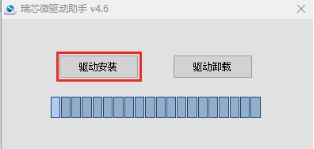
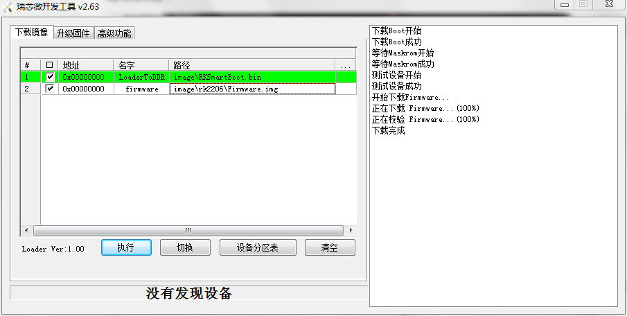
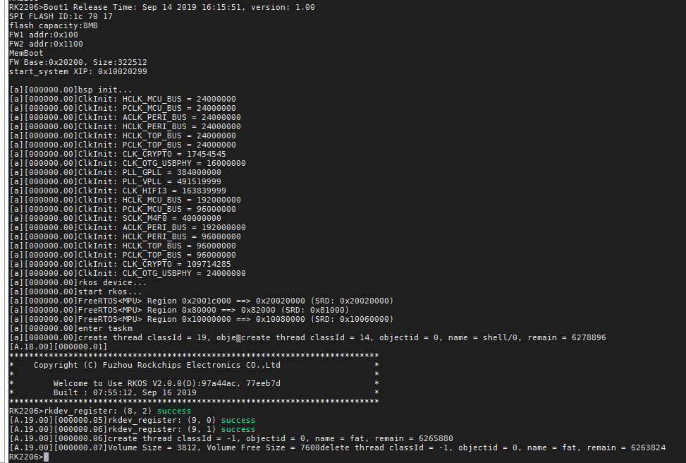

# Rockchip RK2206 FreeRTOS 快速入门

文件标识：RK-JC-CS-001

发布版本：V1.2.0

日期：2020-07-03

文件密级：□绝密   □秘密   □内部资料   ■公开

**免责声明**

本文档按“现状”提供，瑞芯微电子股份有限公司（“本公司”，下同）不对本文档的任何陈述、信息和内容的准确性、可靠性、完整性、适销性、特定目的性和非侵权性提供任何明示或暗示的声明或保证。本文档仅作为使用指导的参考。

由于产品版本升级或其他原因，本文档将可能在未经任何通知的情况下，不定期进行更新或修改。

**商标声明**

“Rockchip”、“瑞芯微”、“瑞芯”均为本公司的注册商标，归本公司所有。

本文档可能提及的其他所有注册商标或商标，由其各自拥有者所有。

**版权所有** **© 2020** **瑞芯微电子股份有限公司**

超越合理使用范畴，非经本公司书面许可，任何单位和个人不得擅自摘抄、复制本文档内容的部分或全部，并不得以任何形式传播。

瑞芯微电子股份有限公司

Rockchip Electronics Co., Ltd.

地址：     福建省福州市铜盘路软件园A区18号

网址：     www.rock-chips.com

客户服务电话： +86-4007-700-590

客户服务传真： +86-591-83951833

客户服务邮箱： fae@rock-chips.com

---

**前言**

**概述**

 本文主要描述了RK2206的基本使用方法，旨在帮助开发者快速了解并使用RK2206 SDK开发包。

**产品版本**

| **芯片名称** | **内核版本**     |
| ------------ | ---------------- |
| RK2206       | FreeRTOS V10.0.1 |

**读者对象**

本文档（本指南）主要适用于以下工程师：

技术支持工程师

软件开发工程师

**修订记录**

| **日期**   | **版本** | **作者**   | **修改说明**                                               |
| ---------- | -------- | :--------- | ---------------------------------------------------------- |
| 2019-09-18 | V0.0.1   | HuangZihan | 初始版本                                                   |
| 2019-09-22 | V0.0.2   | CWW        | 增加工程配置说明                                           |
| 2019-11-27 | V1.0.0   | CWW        | 修改文档排版                                               |
| 2020-03-05 | V1.0.1   | Chad.Ma    | 增加3.5小节                                                |
| 2020-03-11 | V1.1.0   | Aaron.sun  | 修改4.1增加输出信息的说明，增加4.3描述脚本，修订标题，标点 |
| 2020-07-03 | V1.2.0   | Aaron.sun  | 增加6.3 6.4 6.5 6.6 6.7小节                                |

---

**目录**

[TOC]

---

## 开发环境搭建

### 开发环境选择

 Linux环境：Ubuntu14.2以上 + GCC

### 编译工具链选择

 版本号：gcc-arm-none-eabi-7-2018-q2-update

 Linux 版本：

<https://developer.arm.com/-/media/Files/downloads/gnu-rm/7-2018q2/gcc-arm-none-eabi-7-2018-q2-update-linux.tar.bz2>

### 编译工具安装与配置

1. 下载工具链压缩包并解压到指定目录:

   RK2206 SDK工具链安装包默认位置为SDK包的tools目录下，如下：

```
   ├── tools
      └── gcc-arm-none-eabi-7-2018-q2-update
          ├── arm-none-eabi
          ├── bin
          ├── lib
          └── share
```

2. 下载工具链压缩包并解压到指定目录：

   如果用户将工具链解压并安装到指定目录，需要在根目录gcc.mk文件中指定其工具链安装位置，如下配置“CROSS_COMPILE”变量：

```makefile
   # --------------------------------------------------------------------
   # cross compiler
   # --------------------------------------------------------------------
   ifneq ($(wildcard ${ROOT_PATH}/tools/gcc-arm-none-eabi-7-2018-q2-update/bin),)
   CROSS_COMPILE ?= $(ROOT_PATH)/tools/gcc-arm-none-eabi-7-2018-q2-update/bin/arm-none-eabi-
   else
   CROSS_COMPILE ?= arm-none-eabi-
   endif
```

## 目录结构

### 目录结构和说明

```bash
.
├── app..............................#上层应用代码目录
│   ├── common
│   ├── linker_script................#代码编译链接文件
│   ├── wlan_demo
│   ├── story_robot
│   ├── test_demo
│   └── resource
├── bin..............................#分区表
│   ├── RK2108
│   └── RK2206
├── Docs.............................#说明文档
│   ├── avl
│   ├── develop
├── include..........................#公共头文件目录
│   ├── ai
│   ├── app
│   ├── driver
│   ├── dsp
│   ├── kernel
│   ├── linker
│   ├── shell
│   ├── subsys
│   └── sys
├── lib
├── src..............................#第三方组件，公共源文件目录，包含内核代码
│   ├── bsp..........................#板级支持
│   ├── components...................#第三方组件
│   ├── driver.......................#驱动
│   ├── subsys
│   │   ├── delay
│   │   ├── shell....................#终端命令集合以及模块和驱动的测试命令
│   │   ├── sysinfo_save
│   │   └── usb_server
│   ├── kernel
│   │   ├── FreeRTOS.................#FreeRTOS内核源码
│   │   ├── fwmgr....................#固件管理
│   │   ├── oal......................#抽象层接口
│   │   ├── pm.......................#电源管理
│   │   └── service
│   └── libc.........................#部分标准C函数的Wrap处理
└── tools ...........................#工具目录，包含开发升级、量产升级、固件打包、SN/MAC写号等工具
    ├── Rockchip_Develop_Tool_v2.63..#Window烧录工具和驱动
    ├── bin_split_tool_linux.........#二进制程序转txt工具
    ├── debug
    ├── firmware_merger..............#固件打包工具
    ├── Linux_Upgrade_Tool_v1.42.....#Linux烧录工具
    ├── ProductionTool_v1.25.........#生产烧录工具
    └── rk_provision_tool_V1.01......#SN/MAC写号工具
```

## 工程编译配置

### 工程配置

进入到对应的工程目录，如*wlan_demo*目录下，并运行工程配置工具*menuconfig*。

```bash
cd app/wlan_demo/gcc
make rk2206_defconfig   # (defconfig位置位于于各project gcc/defconfigs目录）
make menuconfig
```

如果没有问题，则会显示下面的菜单：


*menuconfig* 工具的常见操作如下：

- 上下箭头：移动

- 回车：进入子菜单

- ESC 键：返回上级菜单或退出

- 英文问号：调出帮助菜单（退出帮助菜单，请按回车键）

- 空格、Y 键``或``N 键：使能/禁用 [*] 配置选项

- 英文问号：调出有关高亮选项的帮助菜单

- / 键：寻找配置项目

- S键：保存当前配置

### 保存配置

以app/wlan_demo工程，rk2206_defconfig为默认配置为例：

```bash
cd app/wlan_demo/gcc
make rk2206_defconfig
make menuconfig
make savedefconfig # 保存配置到对应的默认配置文件rk2206_defconfig
```

### 配置项说明

Kconfig配置主入口为工程根目录下Kconfig文件。

一级菜单配置项说明如下，可根据模块定义检索及添加新模块配置：

| 一级配置项        | 配置定义                                                 |
| ----------------- | -------------------------------------------------------- |
| Target Options    | 定义芯片平台、选用的硬件板型                             |
| Compiler Options  | 定义编译配置项、如log等级、优化等级                      |
| Toolchain Config  | 定义编译工具链配置                                       |
| FreeRTOS          | 定义FreeRTOS系统配置                                     |
| HAL Options       | 定义HAL功能开关及配置                                    |
| BSP Driver        | 定义BSP Driver功能开关及配置                             |
| Components Config | 定义系统组件功能开关及配置，如网络组件、播放器、编解码等 |
| IoT Function      | 定义第三方云平台功能开关及配置                           |
| File System       | 定义文件系统开关及配置                                   |
| Partition Table   | 定义系统使用分区表配置                                   |

### Kconfig生成配置

编译后会生成供代码引用头文件：

```c
include/sdkconfig.h
```

生成供Makefile引用的配置文件（存放至对应工程目录下）：

```bash
app/wlan_demo/gcc/.config
```

### 资源文件的打包

根据项目是否支持GUI，将需要加入用户分区的资源文件放入对应工程目录的resource/userdata/或resource/userdata_gui目录中。例如：

```bash
app/wlan_demo/resource/userdata      #不支持GUI的资源路径
app/wlan_demo/resource/userdata_gui  #支持GUI的资源路径
```

项目Makefile中会根据项目配置来选择对应的userdata路径。

```makefile
ifeq ($(CONFIG_COMPONENTS_GUI), y)
USERDATA_PATH := app/$(PROJECT)/resource/userdata_gui
else
USERDATA_PATH := app/$(PROJECT)/resource/userdata
endif
```

配置文件中，确定分区表以后，若项目编译成功，会根据设置的分区表信息自动解析并打包当前指定工程中的资源文件，生成相应的用户分区文件系统（FAT 12）的userdata.img，并最终合并到Firmware.img固件中。

相关Makefile：

```bash
app/project.mk   #工程Makefile
```

生成用户分区userdata.img镜像：

```makefile
echo "Making $(USERDATA_NAME) from $(RESOURCE_PATH) with size($(USERDATA_PART_SIZE) K)"
dd of=$(USERDATA_NAME) bs=1K seek=$(USERDATA_PART_SIZE) count=0 2>&1 || fatal "Failed to dd image!"
mkfs.fat -F 12 $(USERDATA_NAME)
MTOOLS_SKIP_CHECK=1 mcopy -bspmn -D s -i $(USERDATA_NAME) $(RESOURCE_PATH)/* ::/
mv $(USERDATA_NAME) $(IMAGE_TOOL_PATH)
```

生成后userdata.img的路径：

```bash
Path_to_SDK/tools/firmware_merger/userdata.img
```

## 工程编译

### 命令编译

在SDK的目录中，有许多例子： story_robot，test_demo，wlan_demo等，了解更多请参考《Rockchip_RK2206_Developer_Guide_RKOS_App_Structure_CN》本实例使用wlan_demo来做示范：

工程编译文件在各自私有工程的gcc目录下，如wlan_demo的编译工程：

```bash
cd app/wlan_demo/gcc        #进入工程的目录下
make build	                #编译代码和生成烧录固件
```

编译成功后，将在wlan_demo工程的gcc目录下生成bin、elf及map等文件。

更多详细的编译命令：

```bash
make rk2206_defconfig	#设置编译的默认配置
make menuconfig	        #修改编译配置
make savedefconfig	    #保存配置
make	                #编译代码
make build	            #编译代码和生成烧录固件
make clean	            #清除生成的编译文件
make distclean	        #清除生成的编译文件、配置文件以及生成的固件
make help               #打印详细命令说明
make htmldocs           #生成系统API接口说明文档
```

在 SDK的根目录/image 中会生成固件，image目录有三个文件和一个debug目录：

| **文件名**       | **备注**       |
| ---------------- | -------------- |
| Firmware.img     | 镜像文件       |
| RKSmartBoot.bin  | Loader文件     |
| update.img       | OTA差异包文件  |

debug目录下的文件：

| **文件名**       | **备注**                     |
| ---------------- | ---------------------------- |
| .config          | 当前固件对应的config文件     |
| rk2206_defconfig | 当前固件默认保存的config文件 |
| wlan_demo.elf    | elf文件                      |
| wlan_demo.map    | map文件                      |

### 清除编译

清除编译生成的文件:

```bash
make clean	    #清除生成的编译文件
make distclean	#清除生成的编译文件、配置文件、Doxygen文档以及生成的固件
```

### 脚本编译

在SDK根目录下执行./script/build.sh可以进行脚本编译，其参数如下：

| **参数**               | **备注**                                                     |
| ---------------------- | ------------------------------------------------------------ |
| -l, --list             | 列出所有工程下的所有defconfig：./script/build.sh -l          |
| -h, --help             | 帮助命令: ./script/build.sh -l                               |
| -a, --all              | 编译默认chip下的所有defconfig: ./script/build.sh -a          |
| -p, --project          | 编译默认工程下的所有默认chip的defconfig: ./script/build.sh -p |
| 版本号，工程名，配置名 | 指定版本号，工程名，配置名称的编译: ./script/build.sh V1.10.0 story_robot rk2206_story_defconfig |
| 空                     | 不输入任何参数按默认信息编译                                 |

vi ./scribpt/build.sh可以修改默认配置信息

```bash
#!/bin/bash
  2
  3 TOP_DIR=$(pwd)
  #DVERSION默认版本号
  4 DVERSION=V1.10.0
  #DIC默认芯片名
  5 DIC=rk2206
  #DPROJECT默认APP名称
  6 DPROJECT=story_robot
  #DCONFIG默认配置名称
  7 DCONFIG=rk2206_story_defconfig
  8 VERSION=$1
  9 VERSION=${VERSION:-$DVERSION}
 10 TARGET_PROJECT=$2
 11 TARGET_PROJECT=${TARGET_PROJECT:-$DPROJECT}
 12 TARGET_BOARD_CONFIG=$3
 13 TARGET_BOARD_CONFIG=${TARGET_BOARD_CONFIG:-$DCONFIG}
 14 TARGET_PROJECT_DIR=app/$TARGET_PROJECT/gcc
```

编译结果存在根目录下的IMAGE_RELEASE目录中, 以下以./script/build.sh -a为例进行说明

RK2206_ALL_V1.10.0_20200310.1415_RELEASE_TEST

| **字段**      | **备注**                                                     |
| ------------- | ------------------------------------------------------------ |
| RK2206        | 芯片名                                                       |
| ALL           | 所有APP的统称，非-a 参数时，ALL会被APP名称替代，比如：STORY_ROBOT |
| V1.10.0       | 固件版本                                                     |
| 20200310.1415 | 固件日期                                                     |
| RELEASE_TEST  | 固件用途                                                     |
固件目录中包含的内容如下：

| **文件名**                               | **备注**                                                     |
| ---------------------------------------- | ------------------------------------------------------------ |
| IMAGE-STORY_ROBOT-RK2206_STORY_DEFCONFIG | 固件目录，内容详见 4.1 工程编译中描述的image，格式如下：IMAGE -- 固定标识，STORY_ROBOT -- APP名称，非-a参数时，APP名称显示在上级目录，RK2206_STORY_DEFCONFIG--固件默认配置 |
| PATCHES                                  | 按照SDK目录的组织方式，存放相对于远程仓库的本地提交以及本地未提交的补丁 |
| build_cmd_info                           | 编译信息                                                     |
| manifest_20200311.1431.xml               | 本地所有仓库的mainifest                                      |

## 固件烧录

RK2206开发板进入升级模式的方法有以下两种：

- 1 未烧录过的设备，上电后自动进入MaskRom升级模式
- 2 烧录过的设备，先插入USB上电按住MaskRom按键并同时按下Reset键，进入MaskRom升级模式

### Windows USB驱动安装

开发调试阶段，需要将设备切换至Loader模式或是MaskRom模式，并且正确安装Rockusb驱动才能正常识别设备。

 Rockchip USB驱动安装助手存放在tools/Rockchip_Develop_Tool_v2.63.zip压缩包的DriverAssitant_v4.91文件夹里，支持xp, win7_32, win7_64, win8_32, win8_64操作系统。

RK2206_EVB板：


安装步骤如下：

1. 打开并执行Rockusb驱动软件，界面如下：

   

2. 点击“驱动安装”直到驱动安装成功，参考如下：

   

3. 安装成功

   

 注意：在安装驱动的时候，部分windows系统的版本，需要绕过数字签名，重启电脑按F8，选择**强制禁用驱动程序签名强制**，再安装驱动。

### Windows开发工具烧录

Windows开发升级工具存储路径为：/tools/Rockchip_Develop_Tool_v2.63.zip

选择4.1章节所编译生成的Loader和image文件，点击“执行”按钮开始升级。


 烧写成功后：



### Windows量产工具烧录

Windows量产升级工具存储路径为：/tools/ProductionTool_v1.25/ProductionTool.exe

执行界面如下：


点击“固件”按钮，同时选择RKSmartBoot.bin文件与Firmware.img文件；

点击“启动”开始进入量产工具自动升级模式，此时开始会自动检测是否有升级设备插入，并自动执行升级过程。

界面如下：


量产工具可同时支持多台设备升级，升级结束后，点击“停止”并“关闭”升级窗口。

### Linux开发工具烧录

更多的细节描述，请参考\tools\Linux_Upgrade_Tool_v1.42\目录下文档：《Linux开发工具使用手册_v1.32.pdf》。

## 运行调试

### 系统启动

系统启动方式有以下几种：

1. 固件升级后，自动重新启动；
2. 插入USB供电直接启动；
3. 有电池供电的设备，按Reset键启动；

[^注]: 不同的硬件设计，其上电启动方式也会有不同的区别。

### 系统调试

RK2206支持串口调试。不同的硬件设备，其串口配置也会有所不同。

串口通信配置信息如下：

波特率：115200

数据位：8

停止位：1

奇偶校验：none

流控：none

成功进入调试的截图：



### U盘挂载

RK2206可以通过挂载U盘的方式来导出系统中的文件，目前系统可以同时支持多个文件系统，盘符分别为A B C D E F G H, 盘符分配见下表：

| 盘符 | 卷标     | LUN ID | 描述                                       |
| ---- | -------- | ------ | ------------------------------------------ |
| A    | RKOSA    | 3      | 隐藏盘1： 可以通过用户盘中写入秘钥打开此盘 |
| B    | RKOSB    | 4      | 隐藏盘2： 可以通过用户盘中写入秘钥打开此盘 |
| C    | RKOSC    | 2      | 用户盘：终端用户使用的磁盘                 |
| D    | 原始卷标 | 5      | 支持热插拔的TF卡                           |
| E    | 原始卷标 | 6      | 支持热插拔的TF卡                           |
| F    | 原始卷标 | 7      | 支持热插拔的U盘                            |
| G    | 原始卷标 | 8      | 支持热插拔的U盘                            |
| H    | RKOSH    | 9      | 虚拟磁盘                                   |

其中A,B,H在KCONFIG中可配置打开。

```
(top menu) → RKOS → File System
                        Rockchip RKOS V2.0.0 SDK Configuration
-*- Filesystem support
[*]     Enable Dir Device
[*]     Enable File Device
[*]     Enable Partion Device
[*]     Enable Fat Device
[*]     HIDDEN DISK1
[ ]     HIDDEN DISK2
[*]     Enable Virtual Disk
(0x00100000) Enable Virtual Disk
```

RK2206作为USB设备，每次只弹出一个LUN, 可以通过下列方式配置LUN ID

```
(top menu) → Components Config → Using USB
             Rockchip RKOS V2.0.0 SDK Configuration
-*- Using USB device
        Device type (Enable to use device as Mass Storage device)  --->
(3)     Mass storage LUN ID
[ ] Using USB host
```

### 内存监控

通过以下配置可以开启内存监控

```
(top menu) → RKOS
                      Rockchip RKOS V2.0.0 SDK Configuration
    Firmware  --->
    File System  --->
[ ] Load Resource From File System
[ ] rkos use battery
[*] enable memory leak check
[ ]     enable memory address sort (NEW)
[*]     enable malloc memory count (NEW)
[ ] enable system suspend resume
(0x00000400) idle stack size
(0x00000800) main stack size
(0x00600000) app heap size
(0x00008000) heap size
```

task.lw:   列出系统内存使用情况

task.lw -a  按地址排序

task.lw -s  按大小排序

```
RK2206>task.lw
order = 0
    small memory inf
    200024d0 -- 24 -- Tmr Svc
    200024b8 -- 24 -- Tmr Svc
    20001a50 -- 24 -- Tmr Svc
    20002498 -- 32 -- Tmr Svc
    20002470 -- 40 -- Tmr Svc
    20002448 -- 40 -- Tmr Svc
    20002418 -- 48 -- Tmr Svc
    20002088 -- 40 -- wdemo
    地址     -- 大小 -- 线程名
    200017e0 -- 24 -- dm
    200017c8 -- 24 -- dm
    200016e8 -- 48 -- dm
    20000f58 -- 32 -- dm
    20000f30 -- 40 -- dm
    20000f18 -- 24 -- dm
    20000de0 -- 48 -- dm
    20000d08 -- 40 -- dm
    20000768 -- 16 -- dm
    small memory total = 28

0         3204(     0)          0x38157c6c(0x00000000)          shell/0
1          548(   512)          0x382a59cc(0x382a59e0)          usbd
2          548(   512)          0x382a577c(0x382a5780)          usbd
3           64(     0)          0x382a5714(0x00000000)          Tmr Svc
4           64(     0)          0x382a56ac(0x00000000)          Tmr Svc
5           64(     0)          0x382a5644(0x00000000)          Tmr Svc
编号     实际大小（地址对齐大小）         实际地址（使用地址）           线程名
81         100(     0)          0x3814b15c(0x00000000)          dm
82         192(     0)          0x3814b074(0x00000000)          dm
83         140(     0)          0x3814afbc(0x00000000)          dm
84         536(     0)          0x38148d74(0x00000000)          taskm
85         100(     0)          0x38148ce4(0x00000000)          taskm
86         100(     0)          0x38148c54(0x00000000)          [other]tas
87         100(     0)          0x38148bc4(0x00000000)          [other]tas
88         100(     0)          0x38148b34(0x00000000)          [other]tas
    total block cnt = 89, check block cnt = 89, totalsize = 1422272, check totalsize = 1334532,  remain = 4869184, check remain = 0
```

如果线程名标记为[delete], 表示申请这块内存的线程被删除，需要程序员根据实际情况判断是否为内存泄漏

### 线程监控

task.list 列出当前线程的所有状态

```
state-----task state
 TCBAddr-----task control block address
 IdlTck-----when system enter 2 level, idletick start conuter, unit ms
 Idle1-----task 1 level suspend threshold, unit ms
 idle2-----task 2 level suspend threshold, unit ms
 Event-----if task freertos state is suspend, this value is the address of queue or semaphore this task be suspend
 cpu-----from power on or previous execute cmd "task.list", this task run time, unit 10ms
 Stack-----this task use stack totalsize
 Remain-----this task unuse stack size
 Memory-----this task malloc memory total size with rkos_memory_malloc api
 P-----this task priority 0 - 31 ,the value is more large, the priority is more high
 cid-----task class id, if use rktm_create_task Api create, the value is -1
 oid-----task object id, if use rktm_create_task Api create, the value is -1
 name-----task name, the max size is 16
          state             TCBAddr    IdlTck Idle1  Idle2  Event      cpu     Stack   Remain   Memory   P  cid  oid  Name
---------------------------------------------------------------------------------------------------------------------------
Ready  [Wroking][0:ENABLE ] 0x20000400      0      0      0 unknow   100%(99%)   4096    848        0     0   17    0  IDLE
Blocked[Wroking][0:ENABLE ] 0x20000488      0      0      0 unknow    0%( 0%)   2048   1192      640    25   16    0  Tmr Svc
Blocked[Wroking][0:ENABLE ] 0x20000378      0      0      0 unknow    0%( 0%)   2048   1328     3336     1   18    0  taskm
Blocked[Wroking][0:ENABLE ] 0x200005d8      0  10000      0 unknow    0%( 0%)   8192   6688   1325652     1   19    0  dm
Blocked[Wroking][0:ENABLE ] 0x200007d0      0  10000      0 unknow    0%( 0%)   4096   3816        0    15   -1    0  pmic_int_task
Blocked[Wroking][0:FORCE  ] 0x20001c50      0  10000      0 unknow    0%( 0%)   4096   3320      100     2    2    0  Main/0
Blocked[Wroking][0:ENABLE ] 0x20001cf0      0  10000      0 unknow    0%( 0%)  40960  38960      204     3   -1    4  wdemo
Runing [Wroking][0:FORCE  ] 0x200020b0      0  10000      0 unknow    0%( 0%)  20480  19296        0     2   14    0  shell/0
Blocked[Wroking][0:ENABLE ] 0x20002390      0  10000      0 unknow    0%( 0%)   2048   1248     1096     8   -1    5  usbd
```

1. cpu 使用率第一个百分数，表示5S内CPU使用率，括号中的百分数表示开机运行以来CPU总使用率

2. 线程优先级要遵循以下规则

   | 线程名  | 优先级 | 说明                                                         |
   | ------- | ------ | ------------------------------------------------------------ |
   | IDLE    | 0      | 系统空闲线程                                                 |
   | Tmr Svc | 25     | 电源管理（rkpm）, 热插拔，按键，以及各种模块对TIMER的需求    |
   | taskm   | 1      | rktm -- rkos 任务管理器                                      |
   | dm      | 1      | rkdm -- rkos 设备管理器                                      |
   | Main/0  | 2      | rkos app 管理器，所有的APP中的优先级要大于这个优先级         |
   | shell/0 | 2-28   | 根据需求调整，所有需要用shell 控制器其运行的线程的优先级必须大于shell优先级 |
   | xxx     | 3-29   | 所有其他的线程根据需求在这个范围进行设置。                   |

3. 查看线程堆栈

   task.stack TCBAddr列出堆栈信息

```
   stack = 0x20008b50
   The exception call: 20008b50
   PC call-2: 0008c0b6: f7ff ffd7 4a08 6813 3b01 6013
   PC call-3: 0008c0d4: f380 8814 bd08 bf00 f0e0 2000
   PC call-4: 0008d22c: f7fe ff42 4620 e8bd 83f8 6823
   PC call-5: 0008c254: f000 ffdc 2c01 4603 d005 f3ef
   PC call-6: 0008b2de: f003 fba3 682b 6839 6822 3301
   PC call-7: 0008b27a: 0000 e92d 43f8 f8df 8084 4c1c
   PC call-8: 0008b37a: 4798 4b11 6818 b108 f003 fb69
   PC call-9: 0008be8a: f7ff fa63 e7f5 f000 f8f4 f8d4
   PC call-10: 1008f8aa: 23ff 4628 f7fc ff60 4628 b003
   PC call-11: 00089a14: f7ff bc9e 0190 0000 07d0 0000
   PC call-12: 0008935e: 4770 b530 4615 b089 e9cd 5306
   PC call-13: 000893bc: bd30 b530 b089 7c44 f88d 4005
   PC call-14: 00089550: e7d9 b510 b088 2401 f88d 1005
   PC call-15: 00089586: bd10 b510 b088 2401 f88d 1005
   PC call-16: 00089a2a: 0072 4016 00c8 0880 0203 326b
   PC call-17: 00089a22: 0000 7073 2d69 6f6e 0072 4016
```

   gcc目录下输入make dump, 将堆栈信息复制进去，按CTRL + D即可打印出堆栈调用和对应的C代码行号

   ```
   sch@SYS3:~/rkos_repo/app/wlan_demo/gcc$ make dump
   =============================================
   Input dump log: (Enter CTRL-D To Analytic Log)
   stack = 0x20008b50
   The exception call: 20008b50
   PC call-2: 0008c0b6: f7ff ffd7 4a08 6813 3b01 6013
   PC call-3: 0008c0d4: f380 8814 bd08 bf00 f0e0 2000
   PC call-4: 0008d22c: f7fe ff42 4620 e8bd 83f8 6823
   PC call-5: 0008c254: f000 ffdc 2c01 4603 d005 f3ef
   PC call-6: 0008b2de: f003 fba3 682b 6839 6822 3301
   PC call-7: 0008b27a: 0000 e92d 43f8 f8df 8084 4c1c
   PC call-8: 0008b37a: 4798 4b11 6818 b108 f003 fb69
   PC call-9: 0008be8a: f7ff fa63 e7f5 f000 f8f4 f8d4
   PC call-10: 1008f8aa: 23ff 4628 f7fc ff60 4628 b003
   PC call-11: 00089a14: f7ff bc9e 0190 0000 07d0 0000
   PC call-12: 0008935e: 4770 b530 4615 b089 e9cd 5306
   PC call-13: 000893bc: bd30 b530 b089 7c44 f88d 4005
   PC call-14: 00089550: e7d9 b510 b088 2401 f88d 1005
   PC call-15: 00089586: bd10 b510 b088 2401 f88d 1005
   PC call-16: 00089a2a: 0072 4016 00c8 0880 0203 326b
   PC call-17: 00089a22: 0000 7073 2d69 6f6e 0072 4016******** begin to checking the following file! ****
   /home/sch/rkos_repo/app/wlan_demo/gcc/../../../image/debug/dump.log
   ./rkos_as_file_elf.as
   **** The exception call: ****
   PC call-2: 0008c0b6: f7ff ffd7 4a08 6813 3b01 6013
   /home/sch/rkos_repo/src/kernel/FreeRTOS/Source/portable/GCC/ARM_CM4_MPU/port.c:511
     0008c0b4 <vPortExitCritical>:
        8c0b6:     f7ff ffd7       bl      8c068 <xPortRaisePrivilege>

   PC call-4: 0008d22c: f7fe ff42 4620 e8bd 83f8 6823
   /home/sch/rkos_repo/src/kernel/FreeRTOS/Source/tasks.c:2214
     0008d210 <xTaskResumeAll>:
        8d22c:     f7fe ff42       bl      8c0b4 <vPortExitCritical>

   PC call-5: 0008c254: f000 ffdc 2c01 4603 d005 f3ef
   /home/sch/rkos_repo/src/kernel/FreeRTOS/Source/portable/Common/mpu_wrappers.c:262
     0008c24c <MPU_xTaskResumeAll>:
        8c254:     f000 ffdc       bl      8d210 <xTaskResumeAll>

   PC call-6: 0008b2de: f003 fba3 682b 6839 6822 3301
   /home/sch/rkos_repo/src/subsys/sys_sever/rkutil.c:194
     0008b27c <CpuIdle>:
        8b2de:     f003 fba3       bl      8ea28 <__rkos_scheduler_resume_veneer>

   PC call-8: 0008b37a: 4798 4b11 6818 b108 f003 fb69
   /home/sch/rkos_repo/src/subsys/sys_sever/rkutil.c:242
     0008b354 <vApplicationIdleHook>:
        8b37a:     4798            blx     r3

   PC call-9: 0008be8a: f7ff fa63 e7f5 f000 f8f4 f8d4
   /home/sch/rkos_repo/src/kernel/FreeRTOS/Source/tasks.c:3289
     0008be78 <prvIdleTask>:
        8be8a:     f7ff fa63       bl      8b354 <vApplicationIdleHook>

   PC call-11: 00089a14: f7ff bc9e 0190 0000 07d0 0000
   /home/sch/rkos_repo/src/bsp/hal/lib/hal/src/hal_snor.c:944
     00089a0e <HAL_SNOR_XIPDisable>:
        89a14:     f7ff bc9e       b.w     89354 <SNOR_XipExecOp>

   PC call-12: 0008935e: 4770 b530 4615 b089 e9cd 5306
   /home/sch/rkos_repo/src/bsp/hal/lib/hal/src/hal_snor.c:230
     00089354 <SNOR_XipExecOp>:
        8935e:     4770            bx      lr

   PC call-14: 00089550: e7d9 b510 b088 2401 f88d 1005
   /home/sch/rkos_repo/src/bsp/hal/lib/hal/src/hal_snor.c:522
     00089490 <SNOR_EnableQE>:
        89550:     e7d9            b.n     89506 <SNOR_EnableQE+0x76>
   ```

### 文件查看

file命令集可以查看文件操作

file.ls /v可以列出当前挂在多少个卷

```
RK2206>file.ls /v

  the Volume information as Follow
  RKOSA(A:) 2276/3812
  RKOSC(C:) 15538648/15541760
  RKOSH(H:) 1000/1004
```

file.setpath path 用来设置file命令集的当前路径，模块使用文件路径需要绝对地址

```
RK2206>file.setpath A:\

  curpath:A:\
```

file.ls /f 用来查看当前路径下的文件

```
RK2206>file.ls /f
  A:\ dir and file as Follow:

2020-06-24 18:13:40 192044   <FILE>  16K     .WAV  16k.wav
2020-06-24 18:13:40 576044   <FILE>  48K     .WAV  48k.wav
2020-06-24 18:13:40 433450   <FILE>  IMAGE   .UIS  Image.uis
2020-06-24 18:13:40 46706    <FILE>  MENU    .RES  menu.res
2020-06-24 18:13:40 320204   <FILE>  MUSIC5S .WAV  music5s.wav
2020-06-24 18:13:40 0        <FILE>  README  .TXT  readme.txt
   total dir 0, totoal file 6
```

file命令集里面其他命令可以对文件进行简单的操作

```
    RK2206>file
        help            <command>    get help informastion
        pcb             display file device pcb information
        test            test file system
        setpath         set current path
        ls              list current dir all file and subdir
        mf              create a file in current dir
        md              create a subdir in current dir
        df              delete a file in current dir
        dd              delete a subdir in current dir
        flush           flush a volume cache
        q               <command>    exit package
    RK2206>file.
```

RKOS支持USB上位机和本地同时操作一个文件系统，但是必须保证不能同时写，在PC上COPY到一个文件后，使用命令file.flush 盘符， 比如file.flush H 本地就可看到COPY的文件，同理本地创建一个文件，刷新一个卷CACHE,插拔VBUS或者PC上弹出一下磁盘即可看到新建的文件。

### 固件信息查看

fw命令可以查看固件信息和本地OTA升级等

```
RK2206>fw
    help            <command>    get help informastion
    inf             get fw inf
    custom          test wirte custom id to vendor
    list            get current all segment information
    test            test fw supply api
    read            test fw read
    head            get fw head info according fw seq
    update          update fw from local file or http url
    recov           recovey fw from fw1 to fw0
    verify          verify fw with jhash
    q               <command>    exit package
```

fw.inf 命令：

```
chip:RK2206
Model:EVB
Desc:RKOS
Ver:1.0.0
Date:2020:7:3

Firmave Size = 0
Lun 0 Size = 8192(firmware) Sec
Lun 1 Size = 256(database) Sec
Lun 2 Size = 8380416(C:)
Lun 3 Size = 0(A:)
Lun 4 Size = 0(B:)
 cur fw is fw1
 装载域起          执行域起        执行域终         大小   装载次数  ID信息    类型     名称
0x0006757c      0x1008777c      0x100bf680      229124  0       0       code    xip
0x000e6e48      0x00088c00      0x0008ecb8      24760   0       1       code    sram
0x000ed000      0x2000ee00      0x20011030      8752    0       1       data    sram
0x00000000      0x20011030      0x2001bce4      44212   0       1       bss     sram
0x0009f480      0x18100000      0x181477c0      292800  0       2       code    psram
0x000e6c40      0x381477c0      0x381479c5      517     0       2       data    psram
0x00000000      0x381479c5      0x38147af0      299     0       2       bss     psram
0x00000000      0x20000000      0x200001ce      462     0       3       code    boot
0x000001ce      0x100203ce      0x100876bc      422638  0       4       code    fw
0x00000000      0x20008000      0x20008800      2048    0       5       bss     stack
0x00000000      0x20008800      0x20008c00      1024    0       6       bss     istack
0x00000000      0x20000000      0x20008000      32768   0       7       bss     heap
0x00000000      0x38147b00      0x38747b00      6291456 0       8       bss     aheap
```

固件信息列表解释

装载域起： 装载域开始地址，固件中的偏移

执行域起： 执行域开始地址，代码运行地址

执行域终 ：执行域结束地址

大小： 代码数据大小

装载次数：该段被OS加载的次数

ID信息： 段ID信息

类型： 段类型 code, data. bss

段名： 段名称

以上信息是通过控制link.ld 文件输出到固件当中供OS使用。

