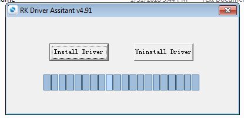
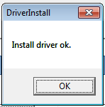
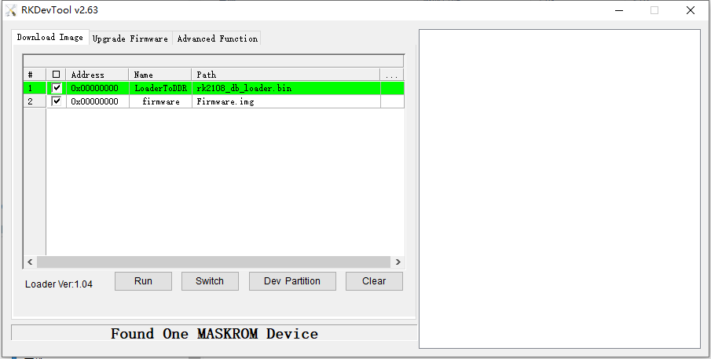

# Rockchip RK2108 RT-Thread Quick Start

ID: RK-JC-YF-362

Release Version: V1.2.0

Release Date: 2020-06-11

Security Level: □Top-Secret   □Secret   □Internal   ■Public

**DISCLAIMER**

THIS DOCUMENT IS PROVIDED “AS IS”. ROCKCHIP ELECTRONICS CO., LTD.(“ROCKCHIP”)DOES NOT PROVIDE ANY WARRANTY OF ANY KIND, EXPRESSED, IMPLIED OR OTHERWISE, WITH RESPECT TO THE ACCURACY, RELIABILITY, COMPLETENESS,MERCHANTABILITY, FITNESS FOR ANY PARTICULAR PURPOSE OR NON-INFRINGEMENT OF ANY REPRESENTATION, INFORMATION AND CONTENT IN THIS DOCUMENT. THIS DOCUMENT IS FOR REFERENCE ONLY. THIS DOCUMENT MAY BE UPDATED OR CHANGED WITHOUT ANY NOTICE AT ANY TIME DUE TO THE UPGRADES OF THE PRODUCT OR ANY OTHER REASONS.

**Trademark Statement**

"Rockchip", "瑞芯微", "瑞芯" shall be Rockchip’s registered trademarks and owned by Rockchip. All the other trademarks or registered trademarks mentioned in this document shall be owned by their respective owners.

**All rights reserved. ©2020. Rockchip Electronics Co., Ltd.**

Beyond the scope of fair use, neither any entity nor individual shall extract, copy, or distribute this document in any form in whole or in part without the written approval of Rockchip.

Rockchip Electronics Co., Ltd.

No.18 Building, A District, No.89, software Boulevard Fuzhou, Fujian,PRC

Website:     [www.rock-chips.com](http://www.rock-chips.com)

Customer service Tel:  +86-4007-700-590

Customer service Fax:  +86-591-83951833

Customer service e-Mail:  [fae@rock-chips.com](mailto:fae@rock-chips.com)

---

**Preface**

**Overview**

The document presents the basic usage of  Rockchip RK2108 RT-Thread SDK, aiming to help engineers get started with RK2108 RT-Thread SDK faster.

Note: please refer to the document RKDocs/RK2108_RT-Thread_Release_Note.txt to get the current version of the SDK.

**Product Version**

| **Chipset** | **Kernel Version** |
| ----------- | :----------------- |
| RK2108      | RT-Thread v3.1.x   |

**Intended Audience**

This document (this guide) is mainly intended for:

Technical support engineers

Software development engineers

**Revision History**

| **Date**   | **Version** | **Author**  | **Revision History**        |
| ---------- | ----------- | ----------- | --------------------------- |
| 2019-02-20 | V1.0.0      | Cliff Chen  | Initial version             |
| 2020-05-14 | V1.1.0      | Chris Zhong | Delete unnecessary chapters |
| 2020-06-11 | V1.2.0      | Ruby Zhang  | Update the company name     |

---

**Contents**

[TOC]

---

## 1 Set up the Development Environment

### 1.1 System Environment

It is recommended to take 64-bit Ubuntu 16.04 or Ubuntu 18.04 system to build this SDK.

### 1.2 Toolchain for Building

The building tool SCons + GCC are officially recommended by RT-Thread. SCons is an open source building system written in Python language. And GCC cross building tool is officially provided by ARM. You can directly install all the required tools by the following commands:

```shell
sudo add-apt-repository ppa:team-gcc-arm-embedded/ppa
sudo apt-get update
sudo apt-get install gcc-arm-embedded scons clang-format astyle libncurses5-dev build-essential python-configparser
```

If the toolchain can not be installed, you can also download them from ARM official website and specify their path through environment variables as follows:

```shell
wget https://developer.arm.com/-/media/Files/downloads/gnu-rm/7-2018q2/gcc-arm-none-eabi-7-2018-q2-update-linux.tar.bz2
tar xvf gcc-arm-none-eabi-7-2018-q2-update-linux.tar.bz2
export RTT_EXEC_PATH=/path/to/toolchain/gcc-arm-none-eabi-7-2018-q2-update/bin
```

## 2 Project Directory

The standard directory structure of RT-Thread is as follows:

```shell
|-- applications            # Rockchip application demo source code
├── AUTHORS
|-- bsp                     # chip related source code
│   ├── rockchip
│   │   ├── common
│   │   │   ├── drivers    # Universal driver of rockchip OS adaptation layer
│   │   │   ├── hal        # Rockchip HAL (hardware Abstraction Layer) implementation
│   │   │   └── tests      # Rockchip driver test code
│   │   ├── rk2108         # RK2108 main directory
│   │   │   ├── board      # Board level configuration
│   │   │   ├── build      # Build main directory and store the intermediate files
│   │   │   ├── build.sh   # RK2108 build script
│   │   │   ├── drivers    # RK2108 Private driver directory
│   │   │   ├── dsp_fw     # Stores dsp firmware
│   │   │   ├── Image      # Stores firmware
│   │   │   ├── tests      # RK2108 private test code
│   │   │   ├── start      # Start relataed soure code
│   │   └── tools          # Rockchip commonly used tools
├── ChangeLog.md
|-- components              # various components of the system,including file system, shell and framework layer and other drivers
│   ├── hifi3
│   │   └── rkdsp          # DSP project directory, please refer to the document "Rockchip_Developer_Guide_RTOS_DSP_CN.pdf" for details
|-- documentation           # RT-Thread Official documents
|-- examples                # RT-Thread example program and test code
|-- include                 # RT-Thread official header file directory
├── Kconfig
|-- libcpu
├── LICENSE
├── README.md
├── README_zh.md
|-- RKDocs                  # Rockchip documents
|-- src                     # RT-Thread kernel source code
|-- third_party             # Directory of third-party code added by Rockchip
|-- tools                   # RT-Thread official tool directory, including menuconfig and building scripts
```

## 3 Project Building Configuration

RT-Thread controls building by SCons which is an open source building system written in Python similar to GNU Make. It takes SConstruct and SConscript files instead of common Makefile. They are also Python scripts and can be written in standard Python syntax, so Python standard libraries can be called for various complex processing in SConstruct and SConscript files.

### 3.1 Project Configuration

Enter the project directory, like bsp/rockchip/rk2108, and run the project configuration tool menuconfig:

```shell
cd bsp/rockchip/rk2108
cp board/rk2108_evb/defconfig .config   #(The defconfig file located in each board directory is the default configuration)
scons --menuconfig
```

The following interface will be prompted. The process loads the current default configuration from .config, which will be overwrote when exiting to save the configuration. At the same time, the rtconfig.h file is automatically generated. These 2 files contain the various configurations we selected, but only rtconfig.h is included in the building.


The frequently operations of menuconfig tool are as follows:

- Up and down arrows: move

- Enter: enter the submenu

- ESC: return to the previous menu or exit

- ? (in English): open help menu ( please press the enter button to exit the help menu).

- Space, Y or N buttons: enable/disable the configuration options with  [*]

- / button: to find configuration items

There is a default configuration file defconfig in each board level directory, which contains the general configuration of the board, and you can modify based on this configuration.

### 3.2 Save the Configurations

There is a default configuration defconfig in each board-level configuration directory. If you didn't execute scons menuconfig, the default rtconfig.h will be included in building. You have to overwrite the .config with its defconfig file at first to modify the defconfig of the board, and then use the new .config to update the defconfig file after modifying through menuconfig. The following is the an detailed example:

```shell
cp board/xxx/defconfig .config             ; Copy the default configuration of the board to be modified
scons menuconfig                           ; Modify configuration items
cp .config board/xxx/defconfig             ; Save the configuration as the default configuration of the board
```

## 4 Project Build

### 4.1 Build Command

Build command:

```shell
cd bsp/rockchip/rk2108
./build.sh     # Call soncs to complete building and packaging
```

The above command used rtconfig.h in the current directory as the building configuration, and finally the following files will be generated in the current directory:

```shell
ls -l rtthread*
-rwxrwxr-x 1 cmc cmc 599616 Feb 15 19:45 rtthread.elf    #elf executable file, can be used for jtag debugging
-rw-rw-r-- 1 cmc cmc 489470 Feb 15 19:45 rtthread.map    #Symbol table
-rwxrwxr-x 1 cmc cmc  56760 Feb 15 19:45 rtthread.bin    #RT-Thread system firmware
```

And the following file will be generated in the image directory:

```shell
Firmware.img
```

The Firmware.img is the binary firmware that we downloaded to device, which is packaged by Loader (rk2108_loader.bin) and RT-Thread system firmware (rtthread.bin).

SCons building system use MD5  to decide whether the file needs to be rebuilt by default. If the content of the code file has not changed and only timestamp has changed (such as updating the timestamp through touch), the file and its dependencies will not be built. In addition, if you only modify some irrelevant content, such as code comments, it will only build and not link, because the content of the obj file has not changed. Therefore, during the development process, if you encounter problems that have not actually taken effect after various modifications, it is recommended to do a cleanup before building. The command is as follows:

```shell
scons -c
```

After the above cleanup, there are also errors, you can force to delete all intermediate files by the following command:

```shell
rm -rf build
```

Please refer to help or documents for other SCons commands:

```shell
scons -h
```

### 4.2 Firmware Package

The purpose of firmware packaging is to package various firmwares required by the system, such as partition table, loader, OS and root file system. The firmware packaging script of RK2108 is: bsp/rockchip/rk2108/mkimage.sh. The current building script will automatically trigger the firmware packaging after building is completed, so you only need to execute the `./build.sh` command once to complete the building and packaging.

## 5 Firmware Flash

Before flashing the firmware, the board should be in upgrade mode. RK2108 supports two upgrade modes: Loader mode and MaskRom mode. The following are the ways to enter these 2 modes:

1. When the USB port is connected to the computer, hold down RECOVERY key and do not release it. Short press RESET key to let the board enter the Loader mode and then release RECOVERY key;
2. When the USB port is connected to the computer, hold down MASROM key and do not release it. Short press RESET key to let the board enter MaskRom mode and then release MASROM key. Devices without flashing firmware will automatically enter MaskRom mode after power on.

### 5.1 Windows USB Driver Installation

In the development and debugging process, you need to switch the device to Loader mode or MaskRom mode, and install the Rockusb driver correctly to recognize the device normally.

The Rockchip USB driver installation assistant is stored in the DriverAssitant_v4.91 folder of the bsp/rockchip/tools/Rockchip_Develop_Tool_v2.63.zip compressed package and supports xp, win7_32, win7_64, win8_32, win8_64 operating systems.

Please refer to the following steps to install:

1. Open and execute Rockusb driver software as the following interface:



2. Click "Driver Installation" until the driver installation is successful.

3. Successful installation:

   

Note: some versions of Windows system need to bypass the digital signature during installing the driver, restart the computer and press F8, select **force to disable the driver signature **, and then install the driver.

### 5.2 Windows Upgrade Tool

Open the Rockchip_Develop_Tool_v2.63 in the bsp/rockchip/tools directory. If it is the first time for you to use this tool, you need to install the driver DriverAssitant_v4.91 in its directory. Open the upgrade tool:



The first item“LoaderToDDR” select  bsp/rockchip/rk2108/Image/rk2108_db_loader.bin.

The second item “Firmware” select  bsp/rockchip/rk2108/Image/Firmware.img.

### 5.3 Linux Upgrade Tool and Command

The following script can be used to complete the firmware flashing under the Linux system:

```shell
bsp/rockchip/rk2108/update_fimeware.sh
```

Actually, it called the following command to complete the flashing:

```shell
#!/bin/sh
../tools/upgrade_tool db Image/rk2108_db_loader.bin
../tools/upgrade_tool wl 0 Image/Firmware.img
../tools/upgrade_tool rd
```

## 6 Run and Debug

### 6.1  System Start

There are several ways to start the system:

1. After firmware upgrade, restart automatically;
2. Plug in USB power supply and start directly;
3. For devices with battery power supply, press Reset button to start;

[^Note]: There are differences in the way of power-on and start between different hardware designs .

### 6.2 System Debug

RK2108 supports serial port debugging. Different hardware devices have different serial port configurations.

The serial communication configuration information is as follows:

Baud rate: 115200

Data bits: 8

Stop bit: 1

Parity: none

Flow control: none

The following picture indicates entering debugging successfully:


