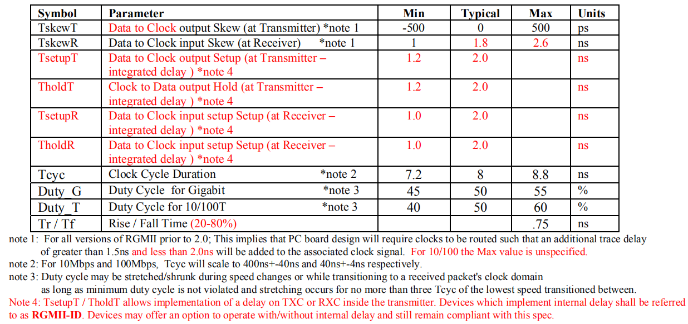

# Rockchip GMAC RGMII Delayline Guide

文件标识：RK-KF-YF-19

发布版本：V1.1.0

日期：2020-06-24

文件密级：公开资料

**免责声明**

本文档按“现状”提供，瑞芯微电子股份有限公司（“本公司”，下同）不对本文档的任何陈述、信息和内容的准确性、可靠性、完整性、适销性、特定目的性和非侵权性提供任何明示或暗示的声明或保证。本文档仅作为使用指导的参考。

由于产品版本升级或其他原因，本文档将可能在未经任何通知的情况下，不定期进行更新或修改。

**商标声明**

“Rockchip”、“瑞芯微”、“瑞芯”均为本公司的注册商标，归本公司所有。

本文档可能提及的其他所有注册商标或商标，由其各自拥有者所有。

**版权所有 © 2020 瑞芯微电子股份有限公司**

超越合理使用范畴，非经本公司书面许可，任何单位和个人不得擅自摘抄、复制本文档内容的部分或全部，并不得以任何形式传播。

瑞芯微电子股份有限公司

Rockchip Electronics Co., Ltd.

地址：     福建省福州市铜盘路软件园A区18号

网址：     [www.rock-chips.com](http://www.rock-chips.com)

客户服务电话： +86-4007-700-590

客户服务传真： +86-591-83951833

客户服务邮箱： [fae@rock-chips.com](mailto:fae@rock-chips.com)

---

**前言**

**概述**

Rockchip 芯片具有千兆以太网的功能，使用 RGMII 接口，为了兼容各种不同硬件所带来的信号差异，芯片增加了调整 (TX/RX) RGMII delayline 功能。本文档介绍的是如何得到一组合适的 delayline 以达到千兆以太网性能最优，和如何改善硬件以得到最大的 delayline 窗口。

**产品版本**

| **芯片名称** | **内核版本** |
| -------- | -------- |
| 所有芯片     | 所有版本     |

**读者对象**

本文档（本指南）主要适用于以下工程师：

技术支持工程师
软件开发工程师

**修订记录**

| **版本号** | **作者** | **修改日期**   | **修改说明** |
| ------- | ------ | :--------- | -------- |
| V1.0.0  | 吴达超    | 2020-02-07 | 初始版本     |
| V1.1.0  | 吴达超    | 2020-06-24 | 支持所有内核版本 |

---

**目录**

[TOC]

---

## 1 RGMII Delayline 获取步骤

如果你的项目具有千兆以太网功能，使用的是 RGMII 接口，只要有硬件差别，都需要重新做一次 delayline 的配置。因为如果配置的 delayline 值与你项目的硬件不匹配，将会影响你千兆以太网的性能，甚至正常的网络功能。

### 1.1 代码确认

代码实现部分都在 `drivers/net/ethernet/stmicro/stmmac/dwmac-rk-tool.c` 文件，所以也比较方便移植。如果你手头上的工程没有这部分代码，请在 Redmine 上索要补丁，有 Kernel-4.4 和 Kernel-3.10 版本，Kernel-4.19 和之后的版本本身已经包含这部分代码，无需补丁。

- Kernel-4.4 补丁：Rockchip_RGMII_Delayline_Kernel4.4.tar.gz
  4.4 内核有优化过性能，补丁代码是基于当前代码生成的，如果有编译不过的问题，先打上               `kernel4.4_stmmac_optimize_output_performances_20191119.zip`。

- Kernel-3.10 补丁：Rockchip_RGMII_Delayline_Kernel3.10.tar.gz

### 1.2 节点确认

上一步的代码确认并编译后，新的固件会生成几个 sysfs 节点，如果没有生成则说明补打的有问题。以 RK3399 为例，在 `/sys/devices/platform/fe300000.ethernet` 目录下可以看到这几个节点：


### 1.3 使用方法

注意，如果你使用的是 `RTL8211E phy`，测试前需要拔掉网线。

#### 1.3.1 扫描 delayline 窗口

通过 `phy_lb_scan` 节点扫描到一个窗口，会得到一个中间坐标，需要使用千兆速度 1000 来扫描。

```c
echo 1000 > phy_lb_scan
```

横轴表示 TX 方向的 delayline(坐标范围 <0x00, 0x7f>)， 纵轴表示 RX 方向的 delayline， (坐标范围也是 <0x00, 0x7f>)。其中的 "O" 表示该点的坐标是可以 pass， 空白处都是 failed。以 RK3399 为例，通过千兆扫描命令，丢弃掉有空缺的行或列，可以得到一个矩形窗口，并得到其中间点坐标，纵轴的 RX 坐标已经有打印，横轴坐标因为打印的关系，没有显示出来，需要手动找下，从 RX(0xXX): 的 `:` 开始算起。


中心点坐标在扫描窗口的最后也会打印出来：


这里测试 RK3399 板子硬件信号并不是很好，所以窗口不是很大。同样百兆也可以得到一个窗口，`echo 100 > phy_lb_scan` 可以看到的是百兆窗口很大，几乎占据所有的坐标，因为百兆对信号要求不如千兆的高。

#### 1.3.2 测试扫描出来的中间值

将扫描得到的值通过命令配置到 `rgmii_delayline` 节点，然后测试该配置下 TX/RX 数据传输是否正常，通过  `phy_lb` 节点测试，至少这个测试需要先 pass。

```c
echo (tx delayline) (rx delayline) > rgmii_delayline
cat rgmii_delayline
echo 1000 > phy_lb
```


测试 pass 后，将 delayline 分别填到 dts： `tx_delay = <0x2e>;` 和 `rx_delay = <0x0f>;`，重新烧入固件，接着继续测试 ping 或者 iperf 性能测试，一般情况下到这一步就可以了。

```c
&gmac {
        assigned-clocks = <&cru SCLK_RMII_SRC>;
        assigned-clock-parents = <&clkin_gmac>;
        clock_in_out = "input";
        phy-supply = <&vcc_lan>;
        phy-mode = "rgmii";
        pinctrl-names = "default";
        pinctrl-0 = <&rgmii_pins>;
        snps,reset-gpio = <&gpio3 RK_PB7 GPIO_ACTIVE_LOW>;
        snps,reset-active-low;
        snps,reset-delays-us = <0 10000 50000>;
        tx_delay = <0x2e>;
        rx_delay = <0x0f>;
        status = "okay";
};
```

#### 1.3.3 自动扫描

如果遇到一组 delayline 的值无法适配所有硬件板子的时候，原因可能是硬件比较差，窗口很小冗余度差；可以打开自动扫描功能，menuconfig 上打开`CONFIG_DWMAC_RK_AUTO_DELAYLINE`。这边需要注意的是窗口很小的问题没有解决的话，打开这个宏也不能完全解决问题，一般来说不需要打开这个宏。

```c
    Device Drivers →
        Network device support →
            Ethernet driver support →
                [*]           Auto search rgmii delayline
```

该功能只会在第一次开机的时候做一次探测，做完后会将 delayline 值存储到 vendor storage，之后的每次开机都是直接从 vendor storage 出来并覆盖 dts 的配置。只有在 vendor storage 被擦除后，才会在下次开机后执行该操作一次。

第一次开机的日志打印：

```c
[   23.532138] Find suitable tx_delay = 0x2f, rx_delay = 0x10
```

之后开机的日志打印：

```c
[   23.092358] damac rk read rgmii dl from vendor tx: 0x2f, rx: 0x10
```

## 2 硬件

### 2.1 参考图纸确认

请 Redmine 上与瑞芯微硬件窗口确认是否使用的是最新发布出来的参考图纸；例如我们的参考图纸已经将默认的 RTL8211E PHY 改成了 RTL8211F，这是因为 RTL8211E 有下面的问题：

- RTL8211F 能兼容1.8V 和 3.3V IO, RTL8211E 只支持 3.3V；
- RTL8211E PHY 眼图测试无法通过；
- RTL8211E 执行上文所提到的 delayline 测试时候需要拔掉网线。

最新的参考图纸，还包括了如果使用3.3V IO, IO 需要分压等等修改。
分压是在 MAC_CLK 靠近主控方向预留下地电阻，避免因布线较长，导致 PHY 送出的 125M 在 Rockchip 平台接收端占空比已超出规范或边沿过缓，经过 bypass 输出的 TX_CLK 信号不够好，留有下地电阻后，通过分压调整 MAC_CLK 的幅度，可以调整 TX_CLK 的信号质量。

### 2.2 测试 RGMII 接口的指标

按照最新的 RGMII 协议，需要满足以下时序要求，请测试你的板子是否符合，如果不会测试或者没有能测试的示波器进行测试，请在 Redmine 上提出需求。



比如确认千兆时 CLK 的信号质量，分别在靠近接收端的位置（不要在发送端量取，发送端信号反射严重，波形不能反应实际信号质量），测量 MAC_CLK、TX_CLK、RX_CLK 信号的波形，重点看占空比、幅度、以及上升下降时间，测量示波器及探头带宽需大于 125M 的 5 倍，如是单端探头注意接地回路要尽可能的短，最好是用差分探头测度，占空比控制在 45% ~ 55% 之间。在测试环境没问题时测出的信号应为方波，而非正弦波，一般客户自测是正玄波，且占空比 为50%，基本都是测量不正确。

#### 2.2.1 RX_CLK / MAC_CLK

MAC_CLK 或 RXCLK 由 PHY 提供，如果接收的 CLK 测量信号完整性有问题，因为一般 PHY 端没有寄存器可调，可能只能通过硬件手段调整，可以在发送端串高频电感来改善边沿过缓（不能用普通电感，带宽要满足才可用），通过发送端电阻分压，降低幅值调整占空比。

#### 2.2.2 TX_CLK

TX_CLK 有问题，出现边沿过缓，可以通过 IO 读取相应寄存器，看 IO 驱动强度是否有调整到最大，可以接上示波器看；同时，直接通过 IO 命令来调整驱动强度观察波形的变化，驱动调整改善不明显也可偿试串高频电感，或将串接 22ohm 电阻改大；如出现占空比不在规范内，可以通过分压 MAC_CLK的幅度来调整 TX_CLK 占空比，分压值为串接 100ohm，下地电阻值因布板而异，不同的板子值不一样，可以从100 向上调，直到示波器观察到占空比符合要求为止。如果以上收效都不大，并且现在使用的 IO 是 3.3V，在 PHY 与 RK 平台端都支持 1.8V IO 的情况下，可以将 IO 电源改为 1.8V 再看信号完整性，1.8V IO 信号指标强于 3.3V，推荐使用1.8V IO。

## 3 FAQ

### 3.1 窗口大小

我们希望能 pass 的窗口越大越好，表明硬件信号好，冗余度大。如果扫描不到窗口或者扫到的窗口太小，一般是硬件问题，请参考硬件部分章节。

### 3.2 PHY 的选型

这里对 PHY 的选择没有特别的要求，只要符合 RGMII。但有以下两点需要注意下:

- 如果你项目计划使用的是 RTL8211E 千兆 PHY，建议你改成 RTL8211F 或者其他的PHY，原因上文 2.1 章节有阐明。

- 如果你所使用的 PHY 没有 loopback 功能，请参照下面的方法获取 delayline:

    可以基于示波器测信号来调试，用大于 125M 5倍带宽的示波器，在靠近 PHY 端测量 TXC 与 TXD 之间的相位差，通过 IO 命令将相位调整在 1.5ns ~ 2ns 区间内（规范为 1 ~ 2.6ns 要留一定量），TX 问题就不大；RX 由于是在主控内部做延时，在 loopback 没用起来的情况下，只能借助于吞吐量来判 断，在 tx_delay 寄存器确定的情况下，先将 rx_delay 设为 0x10, 改完后用 iperf 跑下行吞吐量，刚开始结果可能是不理想的，继续用 IO 命令去改 rxdelay寄存器，以 5 为步进向上加（0x10 ~ 0x7f 的区间），IO 写完寄存器后，当测到吞吐量大于 900M 以后，再缩小以 2 为步进，找出能上 900M 的寄存器区间,然后取中间值设定到 dts。

TXC&TXD 相位测试波形如下图：
