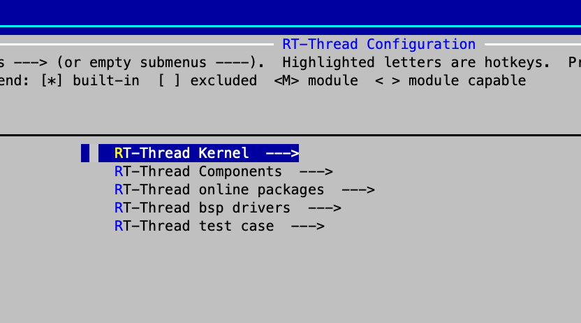

# **RT-Thread开发向导**

发布版本：1.0

作者邮箱：cmc@rock-chips.com

日期：2019.02

文件密级：内部资料

***

**前言**

**概述**

**产品版本**

| **芯片名称**  | **RT-Thread版本** |
| ------------- | ----------------- |
| RK2108/Pisces | 3.11/4.0          |

**读者对象**

本文档（本指南）主要适用于以下工程师：

软件开发工程师


**修订记录**

| **日期**   | **版本** | **作者** | **修改说明** |
| ---------- | -------- | -------- | ------------ |
| 2019-02-20 | V1.0     | 陈谋春   |              |

---

[TOC]

---

## 1 介绍

   RT-Thread是一个开源的RTOS，主要开发成员来自中国，大家主要利用业余时间进行RT-Thread的开发和维护，同时也接受开发者，爱好者，以及专业嵌入式领域公司向RT-Thread捐赠代码。目前我司只有RK2108支持，后续其他MCU芯片可能也会加入。

## 2 Pisces和RK2108

   二者本质上是同一颗芯片，其中Pisces是给OPPO专用，RK2108则是我们内部或其他客户使用的，主要区别是后者多了一些特有的驱动，如SDIO、SFC等。

## 3 准备工作

##### 3.1 下载工程

   目前RT-Thread的移植实际上被我们分成两个部分，HAL(Hardware abstraction layer)和BSP(Board Support Package)，前者是各个IP基本功能的实现，目标是能无缝兼容不同的RTOS，后者则实现了HAL和RT-Thread系统的桥接，包括各种驱动的注册和整个系统的启动引导。现在这两个部分是分成两个仓库，独立维护的。

   所以下载也需要分开，具体命令如下：

```shell
$ git clone ssh://cliff.chen@10.10.10.29:29418/rtos/rt-thread/rt-thread
$ git checkout develop
$ cd bsp/rockchip-pisces
$ git clone ssh://cliff.chen@10.10.10.29:29418/rk/mcu/hal rk_hal
```

   ==Note: clone的时候需要把用户名换成自己的，同时HAL的目录名要保持rk_hal，因为BSP是通过这个名字来找到HAL的。==

##### 3.2 编译环境配置

   目前有两台服务器：172.16.12.243和10.10.10.110，都已经搭建好RT-Thread的编译环境，所以使用这两个服务器的工程师可以跳过这一节，直接开始开发。

   RT-Thread使用SCons作为编译脚本，并支持ARMCC、GCC、IAR三种编译器，我们主要用GCC来开发，所以这里以GCC举例，后续如果确实有另外两个编译的需求，会在补上配置。最后还需要安装两个代码格式检查工具，具体的安装配置命令如下：

```shell
$ sudo add-apt-repository ppa:team-gcc-arm-embedded/ppa
$ sudo apt-get update
$ sudo apt-get install gcc-arm-embedded scons clang-format astyle
```

##### 3.3 编译

   传统开源软件一般用Makefile作为编译脚本，如Linux，有些会加上Autoconf、Automake来实现更灵活方便的配置和编译；而RT-Thread用SCons来实现编译控制，SCons是一套由Python语言编写的开源构建系统，类似于GNU Make。它采用不同于通常Makefile文件的方式，而使用SConstruct和SConscript文件来替代。这些文件也是Python脚本，能够使用标准的Python语法来编写。所以在SConstruct、SConscript文件中可以调用Python标准库进行各类复杂的处理，而不局限于Makefile设定的规则。

   编译命令如下：

```shell
$ cd bsp/rockchip-pisces
$ scons -j8
```

   以上命令将会用默认的配置来编译，最后会在当前目录下生成如下文件：

```shell
ls -l rtthread*
-rwxrwxr-x 1 cmc cmc 599616 Feb 15 19:45 rtthread-pisces.elf
-rw-rw-r-- 1 cmc cmc 489470 Feb 15 19:45 rtthread-pisces.map
-rwxrwxr-x 1 cmc cmc  56760 Feb 15 19:45 rtthread.bin
```

   其中rtthread.bin是我们下载到机器上的二进制固件，另外两个分别是ELF文件和符号表。

   SCons构建系统会自动判断哪些文件需要重新编译，但是如果你改了编译器，则不会自动重编，这时候最好手动清理一下，命令如下：

```shell
$ scons -c
```

   其他SCons命令，可以看帮助或文档

```shell
$ scons -h
```

##### 3.4 模块配置

   RT-Thread沿用了Linux的Kconfig作为模块配置开关，具体命令如下：

```shell
$ cd bsp/rockchip-pisces
$ scons --menuconfig
```

   会弹出如下界面，操作方法和Linux是一样，修改配置以后保持退出，重新编译即可：



​    上图中各个分类的名字很清晰，这里就不具体描述了，其中前三个是RT-Thread公版的配置，后面两个是我们BSP的驱动配置和测试用例。需要额外说明的是：online packages，这些包不是随RT-Thread源码发布的，而是自己独立仓库维护，需要的时候，我们需要先在这里把配置打开，然后再通过pkgs命令下载或更新，把工程下载到本地，最后才能编译，并且这些包并不保证每个都能用，有的可能连编译都无法成功。主要是有些包编译器兼容性较差，有些则是太久没维护了。下面以Wi-Fi模块为例，演示一下具体操作：

- 先选上我们要的Wi-Fi驱动，然后退出并保存配置：


- 再通过pkgs命令下载驱动：

```shell
$ source ~/.env/env.sh
$ pkgs --update
```

- 编译

```shell
$ scons -j8
```

  可以看到下载下来的Wi-Fi驱动在如下目录：

```shell
$ pwd
/home1/rockchip/rt-thread/bsp/rockchip-pisces/packages/wlan_wiced-latest
```

   其他pkgs命令如下：

```shell
$ pkgs -h
usage: env.py package [-h] [--force-update] [--update] [--list] [--wizard]
                      [--upgrade] [--printenv]

optional arguments:
  -h, --help      show this help message and exit
  --force-update  force update and clean packages, install or remove the
                  packages by your settings in menuconfig
  --update        update packages, install or remove the packages by your
                  settings in menuconfig
  --list          list target packages
  --wizard        create a new package with wizard
  --upgrade       upgrade local packages list and ENV scripts from git repo
  --printenv      print environmental variables to check
```

   除了上面用到的update外，另外有几个常用：list可以看到当前我们选中的包列表；upgrade用来更新到最新的包列表，以及ENV脚本（pkgs在这里实现）；wizard是用来创建自己的包。

## 4 驱动开发

   驱动的开发实际上分两个部分：HAL和Driver，前者可以参考HAL的开发指南，这里主要说明后者开发过程中的注意事项：

   首先，所有工程师开发前都应该看一下RT-Thread的coding style文档，路径如下：

```shell
$ cd path/to/rt-thread
$ ls documentation/coding_style_cn.md -l
-rw-rw-r-- 1 cmc cmc 8101 Jan  7 18:38 documentation/coding_style_cn.md
```

   其次，在开始开发前有必要看一下RT-Thread的官方开发指南，了解一下驱动会用的一些系统接口，例如同步与通信、内存管理和中断管理，需要后台线程的话，可以看一下系统的线程和任务管理。这些都可以在开发指南找到介绍，也有一些简单的demo可以参考。同时各类驱动，特别是总线型驱动要看一下系统是否有现成的驱动框架，如果有则要按框架要求来实现，所有的驱动框架都在path_to_rtthread/components目录下，目前可以看到如下驱动都有现成的框架：serial、can、timer、i2c、gpio、pwm、mtd、rtc、sd/mmc、spi、watchdog、audio、wifi、usb等；反之如果RT-Thread没有现成的框架，在自己实现前也可以找一下其他BSP目录下是否已经有相关驱动可以作为参考。

   Pisces和RK2108共用的驱动都要放到如下目录：

```shell
$ pwd
/home1/rockchip/rt-thread/bsp/rockchip-pisces/drivers
```

   RK2108特有的驱动都要放到如下目录：

```shell
$ pwd
/home1/rockchip/rt-thread/bsp/rockchip-rk2108/extDrivers
```

   所有的驱动都要以drv_xxx.c和drv_xxx.h，其中xxx为模块名或相应缩写，要求全部小写，不能有特殊字符存在，如果必要可以用"_"分割长模块名，如“drv_sdio_sd.c”。各个模块不需要修改编译脚本，目前的脚本已经可以自动搜索drivers下所有的源文件，自动完成编译，但是推荐模块加上自己的Kconfig配置开关，方便裁剪和调试，具体可以参考如下实现：

```shell
$ cat drivers/Kconfig
menu "RT-Thread bsp drivers"

config RT_USING_UART0
    bool "Enable UART0"
    default y

config RT_USING_UART1
    bool "Enable UART1"
    default y

config RT_USING_UART2
    bool "Enable UART2"
    default y

config RT_USING_DSP
    bool "Enable DSP"
    default n

endmenu
cmc@cmc-B150-D3A:/home1/rockchip/rt-thread/bsp/rockchip-pisces$
```

   此外，HAL目前是通过hal_conf.h来做模块开关的，为了方便配置，可以让Kconfig和hal_conf.h做一个关联，例如串口的hal_conf.h配置如下：

```c
#if defined(RT_USING_UART0) || defined(RT_USING_UART1) || defined(RT_USING_UART2)
#define HAL_UART_MODULE_ENABLED
#endif
```

   还有就是设备驱动中的定时器延迟，可以简单的使用系统的tick，如rt_thread_delay和rt_thread_sleep来实现，但注意不能在中断上下文使用，也不能用rt_tick_get代替，因为tick中断的优先级不一定会比当前中断高。中断上下文可以用循环来实现一个简单延迟，例如：

```c
static void udelay(unsigned long usec) {
  unsigned long count = 0;
  unsigned long utime = SystemCoreClock / 1000000 * usec;

  while(++count < utime) ;
}
```

   最后，RT-Thread提供了一个自动初始化的接口，驱动如果需要自动初始化，可以调用这些宏：

```c
/* board init routines will be called in board_init() function */
#define INIT_BOARD_EXPORT(fn)           INIT_EXPORT(fn, "1")

/* pre/device/component/env/app init routines will be called in init_thread */
/* components pre-initialization (pure software initilization) */
#define INIT_PREV_EXPORT(fn)            INIT_EXPORT(fn, "2")
/* device initialization */
#define INIT_DEVICE_EXPORT(fn)          INIT_EXPORT(fn, "3")
/* components initialization (dfs, lwip, ...) */
#define INIT_COMPONENT_EXPORT(fn)       INIT_EXPORT(fn, "4")
/* environment initialization (mount disk, ...) */
#define INIT_ENV_EXPORT(fn)             INIT_EXPORT(fn, "5")
/* appliation initialization (rtgui application etc ...) */
#define INIT_APP_EXPORT(fn)             INIT_EXPORT(fn, "6")
```

   如上所示，其初始化顺序是从上到下，大部分设备驱动用INIT_DEVICE_EXPORT就够了，如果需要更前可以加到INIT_PREV_EXPORT或INIT_BOARD_EXPORT，如果两个模块有先后顺序以来，需要自己在代码里去控制，举例，如果有两个模块A和B，A的初始化依赖于B的初始化，则最好只把B的初始化EXPORT出来，然后在B里再去调用A的初始化。当然放到不同EXPORT组去控制先后也是可以的，只是有被别人误改的风险。

   还有一个提示，目前驱动引用HAL的头文件，只需要加“hal_base.h"，而不需要另外在包含芯片头文件，因为会自动根据"hal_conf.h"的定义来包含芯片头文件，例如：

```shell
#include <pisces.h>   /*这一句是可以去掉的*/
#include <rtdevice.h>
#include <rtthread.h>
#include "hal_base.h"
```

## 5 测试用例

   提交驱动的同时，最好同步提交测试程序，目前所有的测试程序都放在如下目录：

```shell
$ pwd
/home1/rockchip/rt-thread/bsp/rockchip-pisces/test
```

   有个简单的测试框架可以用，文件名可以命名为tc_xxx.c，其中xxx是模块名，例如串口可以用tc_uart.c。测试目录下有一个demo可以参考：tc_sample.c。

```c
int _tc_sample()
{
    /* set tc cleanup */
    tc_cleanup(_tc_cleanup);
    sample_init();

    return 25;
}
FINSH_FUNCTION_EXPORT_ALIAS(_tc_sample, __cmd__tc_sample, a thread testcase example.);
```

   要启动测试程序，可以在控制台上输入如下命令：

```shell
msh /> _tc_sample
```

   ==需要注意：输入的命令需要去掉前缀"__cmd\_"，这是msh的命令前缀，用来和finsh风格的命令做区分，具体finsh和msh的区别，请参考RT-Thread官方的指南。==

   如果需要传参数，可以这样修改：

```c
int _tc_sample(int argc, char** argv)
{
    printf("argv[0]: %s\n", argv[0]);
    if (argc > 1)
    printf("argv[1]: %s\n", argv[1]);
    return 0;
}
FINSH_FUNCTION_EXPORT_ALIAS(_tc_sample, __cmd__tc_sample, a thread testcase example.);
```

   测试命令如下：

```shell
msh /> _tc_sample
_tc_sample
msh /> _tc_sample hello
_tc_sample hello
```

   还可以通过测试框架来调用[^1]：

```shell
msh /> exit
finsh >> list_tc()
__cmd__tc_sample
finsh >> tc_start("tc_sample")
```

[^1]:  下面这段命令没在实际板子上验证过，只是根据代码分析，后续会找板子实际验证一把
