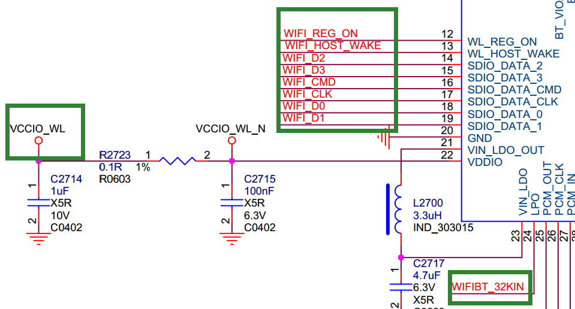
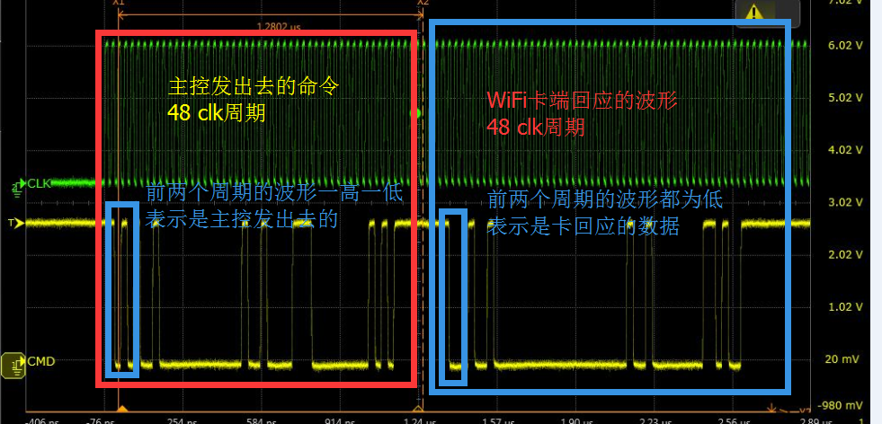

# **SDMMC SDIO eMMC开发指南**

发布版本：1.0

作者邮箱：lintao@rock-chips.com

日期：2017.02

文件密级：公开资料

------------

#**前言**

**概述**

**产品版本**

| **芯片名称** | **内核版本** |
| -------- | -------- |
| 全系列      | 4.4      |


**读者对象**

本文档（本指南）主要适用于以下工程师：

技术支持工程师

软件开发工程师


**修订记录**

| **日期**     | **版本** | **作者** | **修改说明** |
| ---------- | ------ | ------ | -------- |
| 2017-12-15 | V1.0   | 林涛     |          |

-----------------------
[TOC]


## DTS配置

### SDMMC的DTS配置说明

1.  `max-frequency = <150000000>;`

此配置设置SD卡的运行频率，虽然设置为150M，但是还要根据SD卡的不同模式进行调整。这部分不需要用户关心，实际运行频率和模块的关系软件会关联。最大不超过150MHz。

2.  `  supports-sd;`

此配置标识此插槽为SD卡功能，为必须添加项。否则无法初始化SD卡。

3.  `bus-width = <4>;`

此配置标识需要使用SD卡的线宽。SD卡最大支持4线模式，如果不配置就模式使用1线模式。另外，这个位只支持的数值为1，4，配置其他数值会认为是非法数值，强制按照1线模式进行使用。

4.  `cap-mmc-highspeed; cap-sd-highspeed;`

此配置为标识此卡槽支持highspeed的SD卡。 如果不配置，表示不支持highspeed的SD卡。

5.  配置使用SD3.0

首先确保芯片支持SD3.0模式(3288,3328,3399,3368)，并且需要配置vqmmc这一路的SDMMC控制器的IO电源，并添加如下一些SD3.0的速度模式

```
sd-uhs-sdr12: 时钟频率不超过24M
sd-uhs-sdr25: 时钟频率不超过50M
sd-uhs-sdr50: 时钟频率不超过100M
sd-uhs-ddr50: 时钟频率不超过50M，并且采用双沿采样
sd-uhs-sdr104: 时钟频率不超过208M
```

6.  配置SD卡设备的3V3电源

如果硬件上使用的电源控制引脚是芯片上SDMMC控制器默认的电源控制脚：sdmmc_pwren，那么只需要在pinctrl上配置为sdmmc_pwren的功能脚，并在sdmmc节点内引入到default的pinctrl内即可，例如以RK312X为例：

```
sdmmc_pwren: sdmmc-pwren {
	rockchip,pins = <1 RK_PB6 1 &pcfg_pull_default>;
};

pinctrl-0 = <&sdmmc_pwr &sdmmc_clk &sdmmc_cmd &sdmmc_bus4>;
```

如果硬件是使用其他GPIO作为SD卡设备的3V3电源控制引脚，则需要将其定义成regulator来使用，并在sdmmc的节点内将其引用到vmmc-supply内，例如：

```
sdmmc_pwr: sdmmc-pwr {
	rockchip,pins = <7 11 RK_FUNC_GPIO &pcfg_pull_none>;
};

vcc_sd: sdmmc-regulator {
	compatible = "regulator-fixed";
	gpio = <&gpio7 11 GPIO_ACTIVE_LOW>;
	pinctrl-names = "default";
	pinctrl-0 = <&sdmmc_pwr>;
	regulator-name = "vcc_sd";
	regulator-min-microvolt = <3300000>;
	regulator-max-microvolt = <3300000>;
	startup-delay-us = <100000>;
	vin-supply = <&vcc_io>;
};

&sdmmc {
	vmmc-supply = <&vcc_sd>;
};
```


7.  配置SD卡热拔插检测脚

如果检测脚是直接连接到芯片的SDMMC控制器的sdmmc_cd脚，则请直接将该脚位配置为功能脚，并在sdmmc节点的default的pinctrl内进行引用即可。

如果检测脚是使用其他GPIO，则需要在sdmmc节点内使用cd-gpios来进配置，例如

`cd-gpios = <&gpio4 24 GPIO_ACTIVE_LOW>;`

如果使用GPIO的检测脚，但是又要求反向检测方式(即SD卡插入时检测脚为高电平)，则需要追加

`cd-inverted;`


### SDIO的DTS配置说明

1.  `max-frequency = <150000000>;`

此项同SD卡的配置，最大运行频率不超过150Mhz; SDIO2.0卡最大50M，SDIO3.0最大支持150M

2.  `supports-SDIO;`

此配置标识此插槽为SDIO功能，为必须添加项。否则无法初始化SDIO外设。

3.  `bus-width = <4>;`

此配置同SD卡功能。

4.  `cap-sd-highspeed;`

此配置同SD卡功能，作为SDIO外设，也有区分是否为highspeed的SDIO外设。

5.  `cap-sdio-irq;`

此配置标识该SDIO外设(通常是Wifi)是否支持sdio中断，如果你的外设是OOB中断，

请不要加入此项。支持哪种类型的中断请联系Wifi原厂确定。

6.  `  keep-power-in-suspend;`

此配置表示是否支持睡眠不断电，请默认加入该选项。Wifi一般都有深度唤醒的要求。

7.  ` mmc-pwrseq = <&sdio_pwrseq>;`

此项是SDIO外设(一般是Wifi)的电源控制。为必须项，否则Wifi无法上电工作。请参考下面的例子，晶振时钟和复位-使能的GPIO的选择按照实际板级硬件要求进行配置。
```c
		sdio_pwrseq:sdio-pwrseq {
				compatible ="mmc-pwrseq-simple";
				clocks = <&rk808 1>;
				clock-names ="ext_clock";
				pinctrl-names ="default";
				pinctrl-0 =<&wifi_enable_h>;
				/*
				* On the module itself this isone of these (depending
				* on the actual cardpopulated):
				* - SDIO_RESET_L_WL_REG_ON
				* - PDN (power down when low)
				*/
				reset-gpios = <&gpio0 10GPIO_ACTIVE_LOW>; /* GPIO0_B2 */
		};
```
8.  `non-removable;`

此项表示该插槽为不可移动设备且此项为SDIO设备必须添加项。

9.  `num-slots = <4>;`

此项同SD卡的配置。

10.  `sd-uhs-sdr104;`

此项配置决定该SDIO设备是否支持SDIO3.0模式。前提是需要Wifi的IO电压为1.8v。

### eMMC的DTS配置
1.  `max-frequency = <150000000>;`

eMMC 普通模式50M，eMMC HS200最大支持150M；

2.  ` supports-emmc;`

此配置标识此插槽为 emmc 功能，为必须添加项。否则无法初始化 emmc 外设。

3.  ` bus-width = <4>;`

此配置同 SD 卡功能。

4.  `mmc-ddr-1_8v;`

此配置表示支持50MDDR模式；

5.  `mmc-hs200-1_8v;`

此配置表示支持HS200模式；

6.  `mmc-hs400-1_8v; mmc-hs400-enhanced-strobe`

此两项配置表示支持HS400模式以及HS400ES模式，仅RK3399芯片支持。

7.  `non-removable;`

此项表示该插槽为不可移动设备。 此项为必须添加项。


## 常见问题排查

### 硬件问题分析

1.  SD卡


从左到右依次是：

DET		----    检测脚

DATA1    	----    数据线

DATA0

GND

CLK			----	 时钟

VCC_SD		----	 SD卡供电电源

VCCIO_SD	----	 数据线的IO供电电源

CMD 		----	 命令线

DATA3

DATA2

除了DET/CLK/GND外，其它的DATA0-3/VCC_SD/VCCIO_SD/CMD必须都为3.3v左右，最小不能低于3v；DET脚插入为低，拔出为高； DATA0-3/CMD的电压都是VCCIO_SD供给的，所以DATA0-3/CMD必须跟VCCIO_SD保持一致，而VCC_SD和VCCIO_SD要保持一致（NOTE: SD 3.0，要求VCCIO_SD为1.8v）；

如果VCC_SD/VCCIO_SD的电源是长供电，那么请保证VCC_SD和VCCIO_SD在卡拔插时不会有塌陷；

2.  SDIO





首先看下硬件：主要的部分都在绿色方框内

WIFI_D0~3：数据线，平时为高，电压取决于VCCIO_WL的电压；

WIFI_CMD：命令线，平时为高，电压取决于VCCIO_WL的电压；

WIFI_CLK：时钟，平时为低，电压取决于VCCIO_WL的电压；

VBAT_WL：WIFI模组供电电源，一直都为高，供电需打印3.3v；

VCCIO_WL：给DATA/CMD/CLK的IO供电电源，可以为3.3或者1.8v，但SDIO3.0

必须为1.8v；

WIFI_REG_ON: 正常工作时为3.3v，WiFi关闭时为0v；

两个晶振：32K和26M/37.4M,正常工作时都会有波形输出；


3.  eMMC


 eMMC有效电压的组合：


VCC_FLASH 对应 VCC；

VCC_IO 对应 VCCQ；

确保eMMC_CMD/DATA0~7/VCC_IO电压都一致（1.8或3.3v）；

确保 VCC_FLAHS/VCC_IO的电压在开机和运行时或者休眠唤醒时必须保持稳定、不能有塌陷或者纹波过大的情况；

有条件的话，测下clk和cmd以及data的波形质量，确保波形正常；


### 波形分析

下图是SD卡识别模式时的波形时序图（sdio、emmc一样）

简单说一下识别SD卡的方式：主控发出48clk并携带48bit的数据发给SD卡，而SD卡要回应给主控48clk加48bit的数据；如下图：





绿色：SDMMC_CLK

黄色：SDMMC_CMD: SDMMC_CMD空闲时一直处于高电平；

主控发出的波形：当最开始的两个电平有一高一低时，是主控发出去的命令；

SD卡响应的波形： 当最开始的两个电平有连续的两个低电平是表示卡端有响应；

其次主控和响应一般包含48个bit的数据，所以48个clk为一个完整的包。要确认的就是：主控发出去命令包后,SD卡端是否有响应。


### LOG分析

1.  正确识别SD卡的LOG

```
[  293.194013] mmc1: new high speed SDXC card at address 59b4
[  293.198185] mmcblk1: mmc1:59b4 00000 59.6 GiB
[  293.204351]  mmcblk1: p1
```

如果在内核看到这样的打印，说明SD卡已经被正确识别，并且已经有一个可用的分区p1。

如果在用户界面看不到SD卡设备或者设备不可使用，请排查用户态磁盘守护进程，如vold。

另外可手动验证分区是否可以使用

mount -t vfat /dev/block/mmcblk1p1 /mnt

或者

mount -t vfat /dev/block/mmcblk1 /mnt

然后到mnt目录下看下是否有SD卡里面的文件

2.  开机不读卡,运行时拔插OK：大概率时电源问题

例如：拔掉所有电源，发现查着HDMI发现有漏电到VCC_SD卡里面；或者使用外接电源进行测试。

3.  挂载失败：

如果已经看到(1)中的LOG，但是看到如下挂载失败的LOG

```
[ 2229.405694] FAT-fs (mmcblk1p1): bogus number of reserved sectors
[ 2229.405751] FAT-fs (mmcblk1p1): Can't find a valid FAT filesystem
```

请格式化SD卡为FAT32文件系统；

或者NTFS: make menuconfig 选择NTFS文件系统的支持即可；


4.  概率性不识别：

```
mmc1: new high speed SD card at address b368
mmcblk1: mmc1:b368 SMI   486 MiB
[mmc1] Data transmission error !!!!  MINTSTS: [0x00002000]
dwmmc_rockchip ff0c0000.rksdmmc: data FIFO error (status=00002000)
mmcblk1: error -110 sending status command, retrying
need_retune:0,brq->retune_retry_done:0.

```

降频和增加卡检测延时增强电源稳定性，如果降频OK的话，请检查硬件layout；

```
&sdmmc {
	card-detect-delay = <1200>;
｝
```


5.  TF卡已经mount，但不能访问TF卡目录，看起来是卡文件系统问题，但卡在Windows下可以访问。

请尝试使用fsck对TF卡做修复。


6.  硬件问题，io电压异常

```
Workqueue: kmmcd mmc_rescan
[<c0013e24>] (unwind_backtrace+0x0/0xe0) from [<c001172c>] (show_stack+0x10/0x14)
[<c001172c>] (show_stack+0x10/0x14) from [<c04fa444>] (dw_mci_set_ios+0x9c/0x21c)
[<c04fa444>] (dw_mci_set_ios+0x9c/0x21c) from [<c04e7748>] (mmc_set_chip_select+0x18/0x1c)
[<c04e7748>] (mmc_set_chip_select+0x18/0x1c) from [<c04ebd5c>] (mmc_go_idle+0x94/0xc4)
[<c04ebd5c>] (mmc_go_idle+0x94/0xc4) from [<c0748d80>] (mmc_rescan_try_freq+0x54/0xd0)
[<c0748d80>] (mmc_rescan_try_freq+0x54/0xd0) from [<c04e85d0>] (mmc_rescan+0x2c4/0x390)
[<c04e85d0>] (mmc_rescan+0x2c4/0x390) from [<c004d738>] (process_one_work+0x29c/0x458)
[<c004d738>] (process_one_work+0x29c/0x458) from [<c004da88>] (worker_thread+0x194/0x2d4)
[<c004da88>] (worker_thread+0x194/0x2d4) from [<c0052fb4>] (kthread+0xa0/0xac)
[<c0052fb4>] (kthread+0xa0/0xac) from [<c000da98>] (ret_from_fork+0x14/0x3c)
1409..dw_mci_set_ios:  wait for unbusy timeout....... STATUS = 0x306 [mmc1]
```

请检查CMD线与DATA的电压是否在空载状态下为高电平。并且检测IO电压是否过低，以及IO电压与电源域的配置是否一致。如果是SDIO接口，建议排查VCCIO_WL电压，VBAT_WL和WIFI_REG_ON以及晶振是否正常。另可以尝试排查走线太长导致波形质量很差，降频进行测试。

