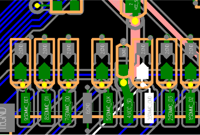
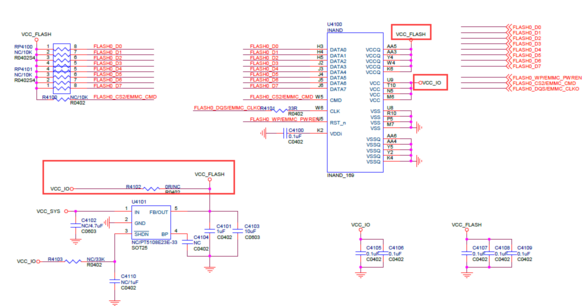

# SDMMC SDIO eMMC 开发指南

文件标识：RK-KF-YF-121

发布版本：V1.1.1

日期：2021-05-25

文件密级：□绝密   □秘密   □内部资料   ■公开

**免责声明**

本文档按“现状”提供，瑞芯微电子股份有限公司（“本公司”，下同）不对本文档的任何陈述、信息和内容的准确性、可靠性、完整性、适销性、特定目的性和非侵权性提供任何明示或暗示的声明或保证。本文档仅作为使用指导的参考。

由于产品版本升级或其他原因，本文档将可能在未经任何通知的情况下，不定期进行更新或修改。

**商标声明**

“Rockchip”、“瑞芯微”、“瑞芯”均为本公司的注册商标，归本公司所有。

本文档可能提及的其他所有注册商标或商标，由其各自拥有者所有。

**版权所有 © 2021 瑞芯微电子股份有限公司**

超越合理使用范畴，非经本公司书面许可，任何单位和个人不得擅自摘抄、复制本文档内容的部分或全部，并不得以任何形式传播。

瑞芯微电子股份有限公司

Rockchip Electronics Co., Ltd.

地址：     福建省福州市铜盘路软件园A区18号

网址：     [www.rock-chips.com](http://www.rock-chips.com)

客户服务电话： +86-4007-700-590

客户服务传真： +86-591-83951833

客户服务邮箱： [fae@rock-chips.com](mailto:fae@rock-chips.com)

---

**前言**

**概述**

**产品版本**

| **芯片名称** | **内核版本** |
| ------------ | ------------ |
| 全系列       | 4.4, 4.19    |

**读者对象**

本文档（本指南）主要适用于以下工程师：

技术支持工程师

软件开发工程师

**修订记录**

| **版本号** | **作者** | **修改日期** | **修改说明**           |
| ---------- | -------- | ------------ | ---------------------- |
| V1.0.0     | 林涛     | 2017-12-15   | 初始版本               |
| V1.1.0     | 林涛     | 2019-11-12   | 针对4.19内核修订       |
| V1.1.1     | 黄莹     | 2021-05-25   | 修改格式，增加版权信息 |

---

**目录**

[TOC]

---

## DTS 配置

### SDMMC 的 DTS 配置说明

1. `max-frequency = <150000000>;`

此配置设置 SD 卡的运行频率，虽然设置为 150M，但是还要根据 SD 卡的不同模式进行调整。这部分不需要用户关心，实际运行频率和模块的关系软件会关联。最大不超过 150MHz。

2. `supports-sd;`

此配置标识此插槽为 SD 卡功能，为必须添加项。否则无法初始化 SD 卡。

3. `bus-width = <4>;`

此配置标识需要使用 SD 卡的线宽。SD 卡最大支持 4 线模式，如果不配置就模式使用 1 线模式。另外，这个位只支持的数值为 1，4，配置其他数值会认为是非法数值，强制按照 1 线模式进行使用。

4. `cap-mmc-highspeed; cap-sd-highspeed;`

此配置为标识此卡槽支持 highspeed 的 SD 卡。 如果不配置，表示不支持 highspeed 的 SD 卡。

5. 配置使用 SD3.0

首先确保芯片支持 SD3.0 模式(3288,3328,3399,3368)，并且需要配置 vqmmc 这一路的 SDMMC 控制器的 IO 电源，并添加如下一些 SD3.0 的速度模式

```c
sd-uhs-sdr12: 时钟频率不超过24M
sd-uhs-sdr25: 时钟频率不超过50M
sd-uhs-sdr50: 时钟频率不超过100M
sd-uhs-ddr50: 时钟频率不超过50M，并且采用双沿采样
sd-uhs-sdr104: 时钟频率不超过208M
```

6. 配置 SD 卡设备的 3V3 电源

如果硬件上使用的电源控制引脚是芯片上 SDMMC 控制器默认的电源控制脚：sdmmc_pwren，那么只需要在 pinctrl 上配置为 sdmmc_pwren 的功能脚，并在 sdmmc 节点内引入到 default 的 pinctrl 内即可，例如以 RK312X 为例：

```c
sdmmc_pwren: sdmmc-pwren {
	rockchip,pins = <1 RK_PB6 1 &pcfg_pull_default>;
};

pinctrl-0 = <&sdmmc_pwr &sdmmc_clk &sdmmc_cmd &sdmmc_bus4>;
```

如果硬件是使用其他 GPIO 作为 SD 卡设备的 3V3 电源控制引脚，则需要将其定义成 regulator 来使用，并在 sdmmc 的节点内将其引用到 vmmc-supply 内，例如：

```c
sdmmc_pwr: sdmmc-pwr {
	rockchip,pins = <7 11 RK_FUNC_GPIO &pcfg_pull_none>;
};

vcc_sd: sdmmc-regulator {
	compatible = "regulator-fixed";
	gpio = <&gpio7 11 GPIO_ACTIVE_LOW>;
	pinctrl-names = "default";
	pinctrl-0 = <&sdmmc_pwr>;
	regulator-name = "vcc_sd";
	regulator-min-microvolt = <3300000>;
	regulator-max-microvolt = <3300000>;
	startup-delay-us = <100000>;
	vin-supply = <&vcc_io>;
};

&sdmmc {
	vmmc-supply = <&vcc_sd>;
};
```

7. 配置 SD 卡热拔插检测脚

如果检测脚是直接连接到芯片的 SDMMC 控制器的 sdmmc_cd 脚，则请直接将该脚位配置为功能脚，并在 sdmmc 节点的 default 的 pinctrl 内进行引用即可。

如果检测脚是使用其他 GPIO，则需要在 sdmmc 节点内使用 cd-gpios 来进配置，例如

`cd-gpios = <&gpio4 24 GPIO_ACTIVE_LOW>;`

如果使用 GPIO 的检测脚，但是又要求反向检测方式(即 SD 卡插入时检测脚为高电平)，则需要追加

`cd-inverted;`

### SDIO 的 DTS 配置说明

1. `max-frequency = <150000000>;`

此项同 SD 卡的配置，最大运行频率不超过 150Mhz; SDIO2.0 卡最大 50M，SDIO3.0 最大支持 150M

2. `supports-SDIO;`

此配置标识此插槽为 SDIO 功能，为必须添加项。否则无法初始化 SDIO 外设。

3. `bus-width = <4>;`

此配置同 SD 卡功能。

4. `cap-sd-highspeed;`

此配置同 SD 卡功能，作为 SDIO 外设，也有区分是否为 highspeed 的 SDIO 外设。

5. `cap-sdio-irq;`

此配置标识该 SDIO 外设(通常是 Wifi)是否支持 sdio 中断，如果你的外设是 OOB 中断，

请不要加入此项。支持哪种类型的中断请联系 Wifi 原厂确定。

6. `keep-power-in-suspend;`

此配置表示是否支持睡眠不断电，请默认加入该选项。Wifi 一般都有深度唤醒的要求。

7. `mmc-pwrseq = <&sdio_pwrseq>;`

此项是 SDIO 外设(一般是 Wifi)的电源控制。为必须项，否则 Wifi 无法上电工作。请参考下面的例子，晶振时钟和复位-使能的 GPIO 的选择按照实际板级硬件要求进行配置。

```c
		sdio_pwrseq:sdio-pwrseq {
				compatible ="mmc-pwrseq-simple";
				clocks = <&rk808 1>;
				clock-names ="ext_clock";
				pinctrl-names ="default";
				pinctrl-0 =<&wifi_enable_h>;
				/*
				* On the module itself this isone of these (depending
				* on the actual cardpopulated):
				* - SDIO_RESET_L_WL_REG_ON
				* - PDN (power down when low)
				*/
				reset-gpios = <&gpio0 10GPIO_ACTIVE_LOW>; /* GPIO0_B2 */
		};
```

8. `non-removable;`

此项表示该插槽为不可移动设备且此项为 SDIO 设备必须添加项。

9. `num-slots = <4>;`

此项同 SD 卡的配置。

10. `sd-uhs-sdr104;`

此项配置决定该 SDIO 设备是否支持 SDIO3.0 模式。前提是需要 Wifi 的 IO 电压为 1.8v。

### eMMC 的 DTS 配置

1. `max-frequency = <150000000>;`

eMMC 普通模式 50M，eMMC HS200 最大支持 150M；

2. `supports-emmc;`

此配置标识此插槽为 emmc 功能，为必须添加项。否则无法初始化 emmc 外设。

3. `bus-width = <4>;`

此配置同 SD 卡功能。

4. `mmc-ddr-1_8v;`

此配置表示支持 50MDDR 模式；

5. `mmc-hs200-1_8v;`

此配置表示支持 HS200 模式；

6. `mmc-hs400-1_8v; mmc-hs400-enhanced-strobe`

此两项配置表示支持 HS400 模式以及 HS400ES 模式，仅 RK3399 芯片支持。

7. `non-removable;`

此项表示该插槽为不可移动设备。 此项为必须添加项。

## 常见问题排查

### 硬件问题分析

1. SD 卡



从左到右依次是：

DET		----    检测脚

DATA1    	----    数据线

DATA0

GND

CLK			----	 时钟

VCC_SD		----	 SD 卡供电电源

VCCIO_SD	----	 数据线的 IO 供电电源

CMD 		----	 命令线

DATA3

DATA2

除了 DET/CLK/GND 外，其它的 DATA0-3/VCC_SD/VCCIO_SD/CMD 必须都为 3.3v 左右，最小不能低于 3v；DET 脚插入为低，拔出为高； DATA0-3/CMD 的电压都是 VCCIO_SD 供给的，所以 DATA0-3/CMD 必须跟 VCCIO_SD 保持一致，而 VCC_SD 和 VCCIO_SD 要保持一致（NOTE: SD 3.0，要求 VCCIO_SD 为 1.8v）；

如果 VCC_SD/VCCIO_SD 的电源是长供电，那么请保证 VCC_SD 和 VCCIO_SD 在卡拔插时不会有塌陷；

2. SDIO


首先看下硬件：主要的部分都在绿色方框内

WIFI_D0~3：数据线，平时为高，电压取决于 VCCIO_WL 的电压；

WIFI_CMD：命令线，平时为高，电压取决于 VCCIO_WL 的电压；

WIFI_CLK：时钟，平时为低，电压取决于 VCCIO_WL 的电压；

VBAT_WL：WIFI 模组供电电源，一直都为高，供电需打印 3.3v；

VCCIO_WL：给 DATA/CMD/CLK 的 IO 供电电源，可以为 3.3 或者 1.8v，但 SDIO3.0

必须为 1.8v；

WIFI_REG_ON: 正常工作时为 3.3v，WiFi 关闭时为 0v；

两个晶振：32K 和 26M/37.4M,正常工作时都会有波形输出；

3. eMMC



 eMMC 有效电压的组合：


VCC_FLASH 对应 VCC；

VCC_IO 对应 VCCQ；

确保 eMMC_CMD/DATA0~7/VCC_IO 电压都一致（1.8 或 3.3v）；

确保 VCC_FLAHS/VCC_IO 的电压在开机和运行时或者休眠唤醒时必须保持稳定、不能有塌陷或者纹波过大的情况；

有条件的话，测下 clk 和 cmd 以及 data 的波形质量，确保波形正常；

### 波形分析

下图是 SD 卡识别模式时的波形时序图（sdio、emmc 一样）

简单说一下识别 SD 卡的方式：主控发出 48clk 并携带 48bit 的数据发给 SD 卡，而 SD 卡要回应给主控 48clk 加 48bit 的数据；如下图：


绿色：SDMMC_CLK

黄色：SDMMC_CMD: SDMMC_CMD 空闲时一直处于高电平；

主控发出的波形：当最开始的两个电平有一高一低时，是主控发出去的命令；

SD 卡响应的波形： 当最开始的两个电平有连续的两个低电平是表示卡端有响应；

其次主控和响应一般包含 48 个 bit 的数据，所以 48 个 clk 为一个完整的包。要确认的就是：主控发出去命令包后,SD 卡端是否有响应。

### LOG 分析

1. 正确识别 SD 卡的 LOG

```c
[  293.194013] mmc1: new high speed SDXC card at address 59b4
[  293.198185] mmcblk1: mmc1:59b4 00000 59.6 GiB
[  293.204351]  mmcblk1: p1
```

如果在内核看到这样的打印，说明 SD 卡已经被正确识别，并且已经有一个可用的分区 p1。

如果在用户界面看不到 SD 卡设备或者设备不可使用，请排查用户态磁盘守护进程，如 vold。

另外可手动验证分区是否可以使用

`mount -t vfat /dev/block/mmcblk1p1 /mnt`

或者

`mount -t vfat /dev/block/mmcblk1 /mnt`

然后到 mnt 目录下看下是否有 SD 卡里面的文件

2. 开机不读卡,运行时拔插 OK：大概率时电源问题

例如：拔掉所有电源，发现查着 HDMI 发现有漏电到 VCC_SD 卡里面；或者使用外接电源进行测试。

3. 挂载失败：

如果已经看到(1)中的 LOG，但是看到如下挂载失败的 LOG

```c++
[ 2229.405694] FAT-fs (mmcblk1p1): bogus number of reserved sectors
[ 2229.405751] FAT-fs (mmcblk1p1): Can't find a valid FAT filesystem
```

请格式化 SD 卡为 FAT32 文件系统；

或者 NTFS: make menuconfig 选择 NTFS 文件系统的支持即可；

4. 概率性不识别：

```c
mmc1: new high speed SD card at address b368
mmcblk1: mmc1:b368 SMI   486 MiB
[mmc1] Data transmission error !!!!  MINTSTS: [0x00002000]
dwmmc_rockchip ff0c0000.rksdmmc: data FIFO error (status=00002000)
mmcblk1: error -110 sending status command, retrying
need_retune:0,brq->retune_retry_done:0.

```

降频和增加卡检测延时增强电源稳定性，如果降频 OK 的话，请检查硬件 layout；

```c#
&sdmmc {
	card-detect-delay = <1200>;
｝
```

5. TF 卡已经 mount，但不能访问 TF 卡目录，看起来是卡文件系统问题，但卡在 Windows 下可以访问。

请尝试使用 fsck 对 TF 卡做修复。

6. 硬件问题，io 电压异常

```c
Workqueue: kmmcd mmc_rescan
[<c0013e24>] (unwind_backtrace+0x0/0xe0) from [<c001172c>] (show_stack+0x10/0x14)
[<c001172c>] (show_stack+0x10/0x14) from [<c04fa444>] (dw_mci_set_ios+0x9c/0x21c)
[<c04fa444>] (dw_mci_set_ios+0x9c/0x21c) from [<c04e7748>] (mmc_set_chip_select+0x18/0x1c)
[<c04e7748>] (mmc_set_chip_select+0x18/0x1c) from [<c04ebd5c>] (mmc_go_idle+0x94/0xc4)
[<c04ebd5c>] (mmc_go_idle+0x94/0xc4) from [<c0748d80>] (mmc_rescan_try_freq+0x54/0xd0)
[<c0748d80>] (mmc_rescan_try_freq+0x54/0xd0) from [<c04e85d0>] (mmc_rescan+0x2c4/0x390)
[<c04e85d0>] (mmc_rescan+0x2c4/0x390) from [<c004d738>] (process_one_work+0x29c/0x458)
[<c004d738>] (process_one_work+0x29c/0x458) from [<c004da88>] (worker_thread+0x194/0x2d4)
[<c004da88>] (worker_thread+0x194/0x2d4) from [<c0052fb4>] (kthread+0xa0/0xac)
[<c0052fb4>] (kthread+0xa0/0xac) from [<c000da98>] (ret_from_fork+0x14/0x3c)
1409..dw_mci_set_ios:  wait for unbusy timeout....... STATUS = 0x306 [mmc1]
```

请检查 CMD 线与 DATA 的电压是否在空载状态下为高电平。并且检测 IO 电压是否过低，以及 IO 电压与电源域的配置是否一致。如果是 SDIO 接口，建议排查 VCCIO_WL 电压，VBAT_WL 和 WIFI_REG_ON 以及晶振是否正常。另可以尝试排查走线太长导致波形质量很差，降频进行测试。
