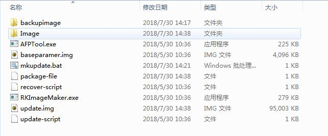
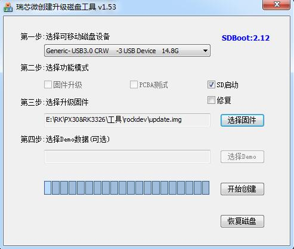
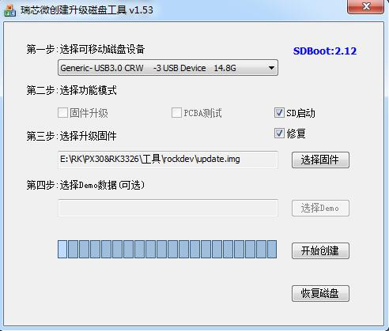
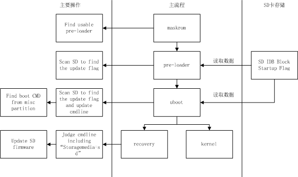

# Rockchip SD Card Boot Reference

发布版本：1.1

作者邮箱：jason.zhu@rock-chips.com

日期：2019.09

文件密级：内部资料

------

**前言**

**概述**

本文主要介绍 Rockchip 对 SD 卡的几种使用，包括制作固件，制作各种 SD 功能卡，固件在 SD 卡内的分布以及 boot 的流程，工程师可以依据此文档来排查使用 SD 卡启动过程出现的问题。

**读者对象**

本文档（本指南）主要适用于以下工程师：

技术支持工程师

软件开发工程师

**产品版本**

**修订记录**

| **日期**     | **版本** | **作者** | **修改说明** |
| ---------- | ------ | ------ | -------- |
| 2018-07-17 | V1.0   | 朱志展、刘翊 | 初始版本     |
| 2019-09-06 | V1.1  | 朱志展 | 升级卡支持GPT     |

------

[TOC]

## 1. SD 卡简介

Rockchip 现将 SD 卡划分为常规 SD 卡，SD 升级卡，SD 启动卡，SD 修复卡。可以通过瑞芯微创建升级磁盘工具将 update.img 下载到 SD 卡内，制作不同的卡类型。

| **卡类型** | **功能**                                   |
| ------- | ---------------------------------------- |
| 常规 SD 卡   | 普通的存储设备                                  |
| SD 升级卡   | 设备从 SD 卡内启动到 recovery，由 recovery 负责把 sd 内固件更新到设备存储 |
| SD 启动卡   | 设备直接从 SD 卡启动                               |
| SD 修复卡   | 从 pre-loader 开始拷贝 SD 卡内的固件到设备存储              |

## 2. update.img 制作

update.img 为 Rockchip 提供整套固件的一个合集，它不仅包含了完整固件，还包括固件完整性校验等一些数据。update.img 可以使得用户非常方便地更新整套固件。

Rockchip 提供了专门的工具来制作 update.img，如果使用 Rockchip sdk，可以进入`RKTools/linux/Linux_Pack_Firmware/rockdev/`目录，如下：



我们可以通过修改 package-file 来打包需要生成的 update.img。package-file 文件内容如下：

```
# NAME     Relative path
#
#HWDEF     HWDEF
package-file    package-file
bootloader  Image/MiniLoaderAll.bin
parameter   Image/parameter.txt
uboot       Image/uboot.img
trust       Image/trust.img
misc        Image/misc.img
resource    Image/resource.img
kernel      Image/kernel.img
boot        Image/boot.img
#recovery   Image/recovery.img
#system     Image/system.img
#vendor     Image/vendor.img
#oem        Image/oem.img
# baseparamer   Image/baseparamer.img
# 要写入backup分区的文件就是自身（update.img）
# SELF 是关键字，表示升级文件（update.img）自身
# 在生成升级文件时，不加入SELF文件的内容，但在头部信息中有记录
# 在解包升级文件时，不解包SELF文件的内容。
# RESERVED不打包backup
backup     backupimage/backup.img
update-script   update-script
recover-script  recover-script
```

添加文件时，写入文件名及固件地址。如果是不需要打包某个固件，则在固件名前面加“#”屏蔽掉即可。
点击运行 mkupdate.bat 即可生成 update.img。

## 3. SD 卡使用及工具打包说明

### 3.1 常规 SD 卡

普通 SD 卡与 PC 使用完全一样，可以在 U-Boot 和 Kernel 系统中作为普通的存储空间使用，无需工具对 SD 卡做任何操作。

### 3.2 SD 升级卡

SD 卡升级卡是通过 RK 的工具制作，实现通过 SD 卡对本地存储(如 eMMC，nand flash)内系统的升级。SD 卡升级是可以脱离 PC 机或网络的一种固件升级方法。具体是将 SD 卡启动代码写到 SD 卡的保留区，然后将固件拷贝到 SD 卡可见分区上，主控从 SD 卡启动时，SD 卡启动代码和升级代码将固件烧写到本地主存储中。同时 SD 升级卡支持 PCBA 测试和 Demo 文件的拷贝。SD 升级卡的这些功能可以使固件升级做到脱离 PC 机进行，提高生产效率。

制作 SD 升级卡流程如下：


操作步骤如下：

1. 选择可移动磁盘设备

2. 选择功能模式为固件升级

3. 选择需要升级的固件

4. 点击开始创建

具体配置可以参考上图设置。
再次制作：
已经制作好的升级用 SD 卡，如果只需要更新固件和 demo 文件时，可以按下面步骤来完成：

1. 拷贝固件到 SD 卡根目录，并重命名为 sdupdate.img

2. 拷贝 demo 文件到 SD 卡根目录下的 Demo 目录中

SD 引导升级卡格式(非 GPT)

|   偏移    |       数据段        |
| :-------: | :-----------------: |
|   扇区 0   |  MBR   |
| 扇区 64-4M |       IDBLOCK(启动标志置 0)       |
|   4M-8M   |      Parameter      |
|  12M-16M   |        uboot        |
|  16M-20M  |        trust        |
|  ……   |        misc         |
|  ……   |      resource       |
|  ……   |       kernel        |
|  ……   |      recovery       |
| 剩下空间  | Fat32 存放 update.img |

SD 引导升级卡格式(GPT)

|   偏移    |       数据段        |
| :-------: | :-----------------: |
|   扇区 0   |  MBR   |
|  扇区 1-34  |      GPT 分区表       |
| 扇区 64-4M |       IDBLOCK(启动标志置 0)       |
|   4M-8M   |      Parameter      |
|  ……   |        uboot        |
|  ……  |        trust        |
|  ……   |        misc         |
|  ……   |      resource       |
|  ……   |       kernel        |
|  ……   |      recovery       |
| 剩下空间  | Fat32 存放 update.img |

### 3.3 SD 启动卡

SD 启动卡是通过 RK 的工具制作，实现设备系统直接从 SD 卡启动，极大的方便用户更新启动新编译的固件而不用非常麻烦地烧写固件到设备存储内。其具体实现是将固件烧写到 SD 卡中，把 SD 卡当作主存储使用。主控从 SD 卡启动时，固件以及临时文件都存放在 SD 卡上，有没有本地主存储都可以正常工作。目前主要用于设备系统从 SD 卡启动，或用于 PCBA 测试。**注意**：PCBA 测试只是 recovery 下面的一个功能项，可用于升级卡与启动卡。
制作启动卡流程如下：



1. 选择可移动磁盘设备

2. 选择功能模式为 SD 启动

3. 选择需要升级的固件

4. 点击开始创建

具体配置可以参考上图设置。

SD 引导启动卡格式(非 GPT)

|   偏移    |        数据段        |
| :-------: | :------------------: |
|   扇区 0   |         MBR          |
| 扇区 64-4M | IDBLOCK(启动标志置 1) |
|   4M-8M   |      Parameter       |
|  8M-12M   |        uboot         |
|  12M-16M  |        trust         |
|  ……   |         misc         |
|  ……   |       resource       |
|  ……   |         boot         |
|  ……   |        kernel        |
|  ……   |       recovery       |
|  ……   |        system        |
|  ……   |         user         |

SD 引导启动卡格式(GPT)

|    偏移    |        数据段        |
| :--------: | :------------------: |
|   扇区 0    |         MBR          |
|  扇区 1-34  |      GPT 分区表       |
| 扇区 64-4M  | IDBLOCK(启动标志置 1) |
|   ……   |        uboot         |
|   ……   |         Boot         |
|   ……   |        trust         |
|   ……   |       resource       |
|   ……   |        kernel        |
|   ……   |       recovery       |
|   ……   |        system        |
|   ……   |        vendor        |
|   ……   |         oem          |
|   ……   |         user         |
| 最后 33 扇区 |       备份 GPT        |

### 3.4 SD 修复卡

SD 卡运行功能，类似于 SD 卡升级功能，但固件升级发生 pre-loader（miniloader）的 SD 卡升级代码。首先工具会将启动代码写到 SD 卡的保留区，然后将固件拷贝到 SD 卡可见分区上，主控从 SD 卡启动时，SD 卡升级代码将固件升级到本地主存储中。主要用于设备固件损坏，SD 卡可以修复设备。
制作修复卡流程如下：



1. 选择可移动磁盘设备

2. 选择功能模式为 SD 启动和修复

3. 选择需要升级的固件

4. 点击开始创建

具体配置可以参考上图设置。
SD 修复卡格式(非 GPT)

|   偏移    |        数据段        |
| :-------: | :------------------: |
|   扇区 0   |         MBR          |
| 扇区 64-4M | IDBLOCK(启动标志置 2) |
|   4M-8M   |      Parameter       |
|  8M-12M   |        uboot         |
|  12M-16M  |        trust         |
|  ……   |         misc         |
|  ……   |       resource       |
|  ……   |         boot         |
|  ……   |        kernel        |
|  ……   |       recovery       |
|  ……   |        system        |
|  ……   |         user         |

SD 修复卡格式(GPT)

|    偏移    |        数据段        |
| :--------: | :------------------: |
|   扇区 0    |         MBR          |
|  扇区 1-34  |      GPT 分区表       |
| 扇区 64-4M  | IDBLOCK(启动标志置 2) |
|   ……   |        uboot         |
|   ……   |         Boot         |
|   ……   |        trust         |
|   ……   |       resource       |
|   ……   |        kernel        |
|   ……   |       recovery       |
|   ……   |        system        |
|   ……   |        vendor        |
|   ……   |         oem          |
|   ……   |         user         |
| 最后 33 扇区 |       备份 GPT        |

## 4. 固件内的标志说明

SD 卡作为各种不同功能的卡，会在 sd 卡内做一些标志。

在 SD 卡的第 64 扇区处，起始标志若为（magic number）为 0xFCDC8C3B，则为一些特殊卡，会从 SD 卡内读取固件，启动设备。如果不是，则作为普通 SD 卡看待。在第（64 扇区 + 616bytes）地方，存放各种卡的标志。目前有三种类型：

| **标志** | **卡类型**     |
| ------ | ----------- |
| 0      | 升级卡或 PCBA 测试卡 |
| 1      | 启动卡         |
| 2      | 修复卡         |

## 5. 整体流程分析

SD 卡的 boot 流程可分为 pre-loader 启动流程与 uboot 启动流程，这两个流程都需要加载检测 SD 卡及 SD 卡内 IDB Block 内 Startup Flag 标志，并且会依据这些标志执行不同的功能。流程如下：



### 5.1 pre-loader 启动流程


maskrom 首先先找到一份可用的 miniloader 固件（可以从 TRM 确定 Maskrom 支持的启动存储介质和优先顺序，maskrom 会依次扫描可用存储里的固件），然后跳转到 miniloader。miniloader 重新查找存储设备，如果检测到 SD 卡，检测 SD 卡是否包含 IDB 格式固件。如果是，再判断卡标志。如果 SD 卡可用且标志位为 '0' 或 ‘1’，则从 SD 卡内读取 U-Boot 固件，加载启动 U-Boot。如果标志为‘2’，则进入修复卡流程，在 loader 下更新固件。正常启动流程为扫描其他存储，加载启动下级 loader。

### 5.2 U-Boot 升级卡及启动卡流程

```flow
st=>start: Start
op1=>operation: Uboot
op2=>operation: 查找存储设备
op3=>operation: 当前设备
设置为SD卡
op4=>operation: cmdline添加
				sdfwupdate标志
op5=>operation: MISC分区
				标志进入
				recovery
op6=>operation: 加载recovery，
				进入recovery模式
op7=>operation: 重新检测
				所有存储
				设备
op8=>operation: 没有检测
				到存储设备
op9=>operation: cmdline添加
				storagemedia=sd
				并从sd卡读取固件
op10=>operation: 启动kernel
cond1=>condition: 是否有SD卡?
cond2=>condition: 64扇区
				起始标志
				是否为
				0xFCDC8C3B?
cond3=>condition: 64扇区 +
				616bytes标志
				为0?
cond4=>condition: 只有SD卡？
e=>end

st->op1->op2->cond1
cond1(yes)->cond2
cond1(no)->op7
cond2(yes)->cond3
cond2(no)->op7
cond3(yes)->op3
cond3(no)->op7
op3->op4->op5->op6->e
op7->cond4
cond4(yes)->op8
cond4(no)->op9
op9->op10->e
```

升级卡：U-Boot 重新查找存储设备，如果检测到 SD 卡，检测 SD 卡是否包含 IDB 格式固件。如果是，再判断偏卡标志是否为 0，传递给 kernel 的 cmdline 添加'sdfwupdate'。最后读取 SD 卡的 misc 分区，读取卡启动模式，若为 recovery 模式，加载启动 recovery。
启动卡：U-Boot 重新查找存储设备，如果检测到 SD 卡， 检测 SD 卡是否包含 IDB 格式固件。如果是，再判断卡标志是否为 1。最后读取 SD 卡的 misc 分区，读取卡启动模式，如果为 recovery，加载启动 recovery。如果是 normal 模式，则加载启动 kernel。

### 5.3 recovery 及 PCBA 说明

具体可参考《Rockchip Recovery 用户操作指南 V1.03.pdf》。

## 6. 注意事项

1. 非 GPT 格式，U-Boot 需要配置 CONFIG_RKPARM_PARTITION。

2. 在制作 SD 升级卡时，update.img 必须包含 MiniloaderAll.bin，parameter.txt，uboot.img，trust.img，misc.img，resource.img，recovery.img 这些固件，否则烧写 update.img 会出现写入 MBR 失败的提示。
