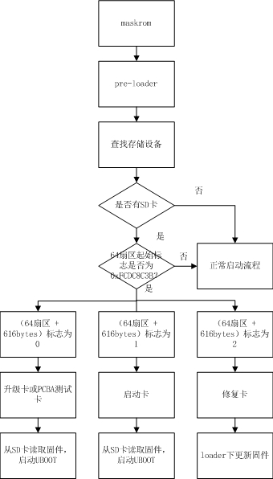

# Rockchip SD Card Boot Reference

发布版本：1.0

作者邮箱：jason.zhu@rock-chips.com

日期：2018.07

文件密级：内部资料

------

**前言**

**概述**

本文主要介绍Rockchip对SD卡的几种使用，包括制作固件，制作各种SD功能卡，固件在SD卡内的分布以及boot的流程，工程师可以依据此文档来排查使用SD卡启动过程出现的问题。

**读者对象**

本文档（本指南）主要适用于以下工程师：

技术支持工程师

软件开发工程师

**产品版本**

**修订记录**

| **日期**     | **版本** | **作者** | **修改说明** |
| ---------- | ------ | ------ | -------- |
| 2018-07-17 | V1.0   | 朱志展、刘翊 | 初始版本     |

------

[TOC]

## 1. SD卡简介

Rockchip现将SD卡划分为常规SD卡，SD升级卡，SD启动卡，SD修复卡。可以通过瑞芯微创建升级磁盘工具将update.img下载到SD卡内，制作不同的卡类型。

| **卡类型** | **功能**                                   |
| ------- | ---------------------------------------- |
| 常规SD卡   | 普通的存储设备                                  |
| SD升级卡   | 设备从SD卡内启动到recovery，由recovery负责把sd内固件更新到设备存储 |
| SD启动卡   | 设备直接从SD卡启动                               |
| SD修复卡   | 从pre-loader开始拷贝SD卡内的固件到设备存储              |

## 2. update.img制作

update.img为Rockchip提供整套固件的一个合集，它不仅包含了完整固件，还包括固件完整性校验等一些数据。update.img可以使得用户非常方便地更新整套固件。

Rockchip提供了专门的工具来制作update.img，如果使用Rockchip sdk，可以进入`RKTools/linux/Linux_Pack_Firmware/rockdev/`目录，如下：


我们可以通过修改package-file来打包需要生成的update.img。package-file文件内容如下：

```
# NAME     Relative path
#
#HWDEF     HWDEF
package-file    package-file
bootloader  Image/MiniLoaderAll.bin
parameter   Image/parameter.txt
uboot       Image/uboot.img
trust       Image/trust.img
misc        Image/misc.img
resource    Image/resource.img
kernel      Image/kernel.img
boot        Image/boot.img
#recovery   Image/recovery.img
#system     Image/system.img
#vendor     Image/vendor.img
#oem        Image/oem.img
# baseparamer   Image/baseparamer.img
# 要写入backup分区的文件就是自身（update.img）
# SELF 是关键字，表示升级文件（update.img）自身
# 在生成升级文件时，不加入SELF文件的内容，但在头部信息中有记录
# 在解包升级文件时，不解包SELF文件的内容。
# RESERVED不打包backup
backup     backupimage/backup.img
update-script   update-script
recover-script  recover-script
```

添加文件时，写入文件名及固件地址。如果是不需要打包某个固件，则在固件名前面加“#”屏蔽掉即可。
点击运行mkupdate.bat即可生成update.img。

## 3. SD卡使用及工具打包说明

### 3.1 常规SD卡

普通SD卡与PC使用完全一样，可以在U-Boot和Kernel系统中作为普通的存储空间使用，无需工具对SD卡做任何操作。

### 3.2 SD升级卡

SD卡升级卡是通过RK的工具制作，实现通过SD卡对本地存储(如eMMC，nand flash)内系统的升级。SD卡升级是可以脱离PC机或网络的一种固件升级方法。具体是将SD卡启动代码写到SD卡的保留区，然后将固件拷贝到SD卡可见分区上，主控从SD卡启动时，SD卡启动代码和升级代码将固件烧写到本地主存储中。同时SD升级卡支持PCBA测试和Demo文件的拷贝。SD升级卡的这些功能可以使固件升级做到脱离PC机进行，提高生产效率。

制作SD升级卡流程如下：


操作步骤如下：

1. 选择可移动磁盘设备

2. 选择功能模式为固件升级

3. 选择需要升级的固件

4. 点击开始创建

具体配置可以参考上图设置。
再次制作：
已经制作好的升级用SD卡，如果只需要更新固件和demo文件时，可以按下面步骤来完成：

1. 拷贝固件到SD卡根目录，并重命名为sdupdate.img

2. 拷贝demo文件到SD卡根目录下的Demo目录中

SD引导升级卡格式(非GPT，目前不支持GPT，所以**U-Boot需要配置CONFIG_RKPARM_PARTITION**)

|   偏移    |       数据段        |
| :-------: | :-----------------: |
|   扇区0   |  MBR(启动标志置0)   |
| 扇区64-4M |       IDBLOCK       |
|   4M-8M   |      Parameter      |
|  8M-12M   |        uboot        |
|  12M-16M  |        trust        |
|  ......   |        misc         |
|  ......   |      resource       |
|  ......   |       kernel        |
|  ......   |      recovery       |
| 剩下空间  | Fat32存放update.img |

### 3.3 SD启动卡

SD启动卡是通过RK的工具制作，实现设备系统直接从SD卡启动，极大的方便用户更新启动新编译的固件而不用非常麻烦地烧写固件到设备存储内。其具体实现是将固件烧写到SD卡中，把SD卡当作主存储使用。主控从SD卡启动时，固件以及临时文件都存放在SD卡上，有没有本地主存储都可以正常工作。目前主要用于设备系统从SD卡启动，或用于PCBA测试。**注意**：PCBA测试只是recovery下面的一个功能项，可用于升级卡与启动卡。
制作启动卡流程如下：


1. 选择可移动磁盘设备

2. 选择功能模式为SD启动

3. 选择需要升级的固件

4. 点击开始创建

具体配置可以参考上图设置。

SD引导启动卡格式(非GPT)

|   偏移    |        数据段        |
| :-------: | :------------------: |
|   扇区0   |         MBR          |
| 扇区64-4M | IDBLOCK(启动标志置1) |
|   4M-8M   |      Parameter       |
|  8M-12M   |        uboot         |
|  12M-16M  |        trust         |
|  ......   |         misc         |
|  ......   |       resource       |
|  ......   |         boot         |
|  ......   |        kernel        |
|  ......   |       recovery       |
|  ......   |        system        |
|  ......   |         user         |

SD引导启动卡格式(GPT)

|    偏移    |        数据段        |
| :--------: | :------------------: |
|   扇区0    |         MBR          |
|  扇区1-34  |      GPT分区表       |
| 扇区64-4M  | IDBLOCK(启动标志置1) |
|   ......   |        uboot         |
|   ......   |         Boot         |
|   ......   |        trust         |
|   ......   |       resource       |
|   ......   |        kernel        |
|   ......   |       recovery       |
|   ......   |        system        |
|   ......   |        vendor        |
|   ......   |         oem          |
|   ......   |         user         |
| 最后33扇区 |       备份GPT        |

### 3.4 SD修复卡

SD卡运行功能，类似于SD卡升级功能，但固件升级发生pre-loader（miniloader）的SD卡升级代码。首先工具会将启动代码写到SD卡的保留区，然后将固件拷贝到SD卡可见分区上，主控从SD卡启动时，SD卡升级代码将固件升级到本地主存储中。主要用于设备固件损坏，SD卡可以修复设备。
制作修复卡流程如下：


1. 选择可移动磁盘设备

2. 选择功能模式为SD启动和修复

3. 选择需要升级的固件

4. 点击开始创建

具体配置可以参考上图设置。
SD修复卡格式(非GPT)

|   偏移    |        数据段        |
| :-------: | :------------------: |
|   扇区0   |         MBR          |
| 扇区64-4M | IDBLOCK(启动标志置2) |
|   4M-8M   |      Parameter       |
|  8M-12M   |        uboot         |
|  12M-16M  |        trust         |
|  ......   |         misc         |
|  ......   |       resource       |
|  ......   |         boot         |
|  ......   |        kernel        |
|  ......   |       recovery       |
|  ......   |        system        |
|  ......   |         user         |

SD修复卡格式(GPT)

|    偏移    |        数据段        |
| :--------: | :------------------: |
|   扇区0    |         MBR          |
|  扇区1-34  |      GPT分区表       |
| 扇区64-4M  | IDBLOCK(启动标志置2) |
|   ......   |        uboot         |
|   ......   |         Boot         |
|   ......   |        trust         |
|   ......   |       resource       |
|   ......   |        kernel        |
|   ......   |       recovery       |
|   ......   |        system        |
|   ......   |        vendor        |
|   ......   |         oem          |
|   ......   |         user         |
| 最后33扇区 |       备份GPT        |

## 4. 固件内的标志说明

SD卡作为各种不同功能的卡，会在sd卡内做一些标志。

在SD卡的第64扇区处，起始标志若为（magic number）为0xFCDC8C3B，则为一些特殊卡，会从SD卡内读取固件，启动设备。如果不是，则作为普通SD卡看待。在第（64扇区 + 616bytes）地方，存放各种卡的标志。目前有三种类型：

| **标志** | **卡类型**     |
| ------ | ----------- |
| 0      | 升级卡或PCBA测试卡 |
| 1      | 启动卡         |
| 2      | 修复卡         |

## 5. 整体流程分析

SD卡的boot流程可分为pre-loader启动流程与uboot启动流程，这两个流程都需要加载检测SD卡及SD卡内IDB Block内Startup Flag标志，并且会依据这些标志执行不同的功能。流程如下：


### 5.1 pre-loader启动流程



maskrom首先先找到一份可用的miniloader固件（可以从TRM确定Maskrom支持的启动存储介质和优先顺序，maskrom会依次扫描可用存储里的固件），然后跳转到miniloader。miniloader重新查找存储设备，如果检测到SD卡，检测SD卡是否包含IDB格式固件。如果是，再判断卡标志。如果SD卡可用且标志位为 '0' 或 ‘1’，则从SD卡内读取U-Boot固件，加载启动U-Boot。如果标志为‘2’，则进入修复卡流程，在loader下更新固件。正常启动流程为扫描其他存储，加载启动下级loader。

### 5.2 U-Boot升级卡及启动卡流程

```flow
st=>start: Start
op1=>operation: Uboot
op2=>operation: 查找存储设备
op3=>operation: 当前设备
设置为SD卡
op4=>operation: cmdline添加
				sdfwupdate标志
op5=>operation: MISC分区
				标志进入
				recovery
op6=>operation: 加载recovery，
				进入recovery模式
op7=>operation: 重新检测
				所有存储
				设备
op8=>operation: 没有检测
				到存储设备
op9=>operation: cmdline添加
				storagemedia=sd
				并从sd卡读取固件
op10=>operation: 启动kernel
cond1=>condition: 是否有SD卡?
cond2=>condition: 64扇区
				起始标志
				是否为
				0xFCDC8C3B?
cond3=>condition: 64扇区 +
				616bytes标志
				为0?
cond4=>condition: 只有SD卡？
e=>end

st->op1->op2->cond1
cond1(yes)->cond2
cond1(no)->op7
cond2(yes)->cond3
cond2(no)->op7
cond3(yes)->op3
cond3(no)->op7
op3->op4->op5->op6->e
op7->cond4
cond4(yes)->op8
cond4(no)->op9
op9->op10->e
```

升级卡：U-Boot重新查找存储设备，如果检测到SD卡，检测SD卡是否包含IDB格式固件。如果是，再判断偏卡标志是否为0，传递给kernel的cmdline添加'sdfwupdate'。最后读取SD卡的misc分区，读取卡启动模式，若为recovery模式，加载启动recovery。
启动卡：U-Boot重新查找存储设备，如果检测到SD卡， 检测SD卡是否包含IDB格式固件。如果是，再判断卡标志是否为1。最后读取SD卡的misc分区，读取卡启动模式，如果为recovery，加载启动recovery。如果是normal模式，则加载启动kernel。

### 5.3 recovery及PCBA说明

具体可参考《Rockchip Recovery用户操作指南V1.03.pdf》。

## 6. 注意事项

1. 非GPT格式，U-Boot需要配置CONFIG_RKPARM_PARTITION。

2. 在制作SD升级卡时，update.img必须包含MiniloaderAll.bin，parameter.txt，uboot.img，trust.img，misc.img，resource.img，recovery.img这些固件，否则烧写update.img会出现写入MBR失败的提示。
