# **Rockchip Secure Boot Application Note**

ID:  RK-SM-YF-024

Release Version: V2.2.0

Release Date: 2020-03-19

Security Level: □Top-Secret   □Secret   □Internal   ■Public

---

**DISCLAIMER**

THIS DOCUMENT IS PROVIDED “AS IS”. FUZHOU ROCKCHIP ELECTRONICS CO., LTD.(“ROCKCHIP”)DOES NOT PROVIDE ANY WARRANTY OF ANY KIND, EXPRESSED, IMPLIED OR OTHERWISE, WITH RESPECT TO THE ACCURACY, RELIABILITY, COMPLETENESS,MERCHANTABILITY, FITNESS FOR ANY PARTICULAR PURPOSE OR NON-INFRINGEMENT OF ANY REPRESENTATION, INFORMATION AND CONTENT IN THIS DOCUMENT. THIS DOCUMENT IS FOR REFERENCE ONLY. THIS DOCUMENT MAY BE UPDATED OR CHANGED WITHOUT ANY NOTICE AT ANY TIME DUE TO THE UPGRADES OF THE PRODUCT OR ANY OTHER REASONS.

**Trademark Statement**

"Rockchip", "瑞芯微", "瑞芯" shall be Rockchip’s registered trademarks and owned by Rockchip. All the other trademarks or registered trademarks mentioned in this document shall be owned by their respective owners.

**All rights reserved. ©2019. Fuzhou Rockchip Electronics Co., Ltd.**

Beyond the scope of fair use, neither any entity nor individual shall extract, copy, or distribute this document in any form in whole or in part without the written approval of Rockchip.

Fuzhou Rockchip Electronics Co., Ltd.

No.18 Building, A District, No.89, software Boulevard Fuzhou, Fujian,PRC

Website:     [www.rock-chips.com](http://www.rock-chips.com)

Customer service Tel:  +86-4007-700-590

Customer service Fax:  +86-591-83951833

Customer service e-Mail:  [fae@rock-chips.com](mailto:fae@rock-chips.com)

---

## Preface

**Terms : **

**Sector:**  Sector size is 512 bytes

**eFuse:**  One-Time Programmable Memory IP in SOC

**RSA Encryption:**  Use public key for encryption

**RSA Decryption:**  Use private key for decryption

**OTP:** One-Time Programmable Memory IP in SOC

**MaskRom:** BootROM, Boot Read-Only Memory in SOC

**loader:** Boot Loader/First Loader, generally means RKMiniloader or SPL(uboot)

**OBM CODE:**  Generally means the code compiled or trusted by OEM/OBM

---

**Introduction**

This document describes how to implement Rockchip secure boot solution.

Secure boot mechanism is for verifying firmware validity, which aims to prevent invalid firmware upgrade and booting.

The device which had programmed eFuse will enable secure boot ROM, and could not boot from the un-signed firmware. So trying to upgrade un-signed firmware or unmatched key signed firmware will fail.

NOTE: The valid signed firmware can boot smoothly on fake copies of device circuit board or same CPU platform hardware. Secure boot will verify the validity of software, but not hardware.

This document applies to RK3126, RK3128, RK3228, RK3229, RK3288, RK3368, RK3399, RK3228H, RK3328, RK3326, RK3308 and PX30.

Features of secure boot:

- Support secure boot ROM

- Support SHA256

- Support RSA2048

- Support eFuse or OTP hash to verify public key

The relative tool revision:

- Efuse tool V1.35 or the latest revision

- SecureBootTool 1.79 or the latest revision

- RKBatchTool 1.8 or the latest revision(deprecated, Use FactoryTool instead)

- FactoryTool 1.39 or the latest revision

**History**

| **Revision** | **Date**   | **Description**                                   | **Author** |
| ------------ | ---------- | ------------------------------------------------- | ---------- |
| V1.0.0       | 2014-11-05 | Original document                                 | ZYF        |
| V1.1.0       | 2015-12-21 | Update secure boot tool                           | YBC        |
| V1.2.0       | 2016-02-02 | Update secure boot tool                           | YHC        |
| V1.3.0       | 2016-09-29 | Re-edit                                           | ZYF        |
| V1.4.0       | 2016-11-15 | Add detailed description of workflow              | Joshua     |
| V1.5.0       | 2016-11-16 | 1. Add terms and definitions.2. Add eFuse layout. | Joshua     |
| V1.6.0       | 2017-02-15 | Add RK3328 and RK3228H.                           | ZYF        |
| V1.7.0       | 2017-05-19 | Add sequence chart and note                       | ZZJ        |
| V1.8.0       | 2017-10-30 | Refactor the format and add hardware info         | CW         |
| V1.9.0       | 2018-06-05 | Add OTP program public key hash flow              | CF         |
| V2.0.0       | 2018-11-09 | Add RK3336、PX30 and RK3308 OTP layout            | CF         |
| V2.1.0       | 2019-10-29 | Fix some error                                    | ZYF/CF     |
| V2.2.0       | 2020-03-19 | Fix some error                                    | ZYF        |

---
<div STYLE="page-break-after: always;"></div>
**Contents**

[TOC]

---
<div STYLE="page-break-after: always;"></div>
## Architecture

### Secure Boot Process

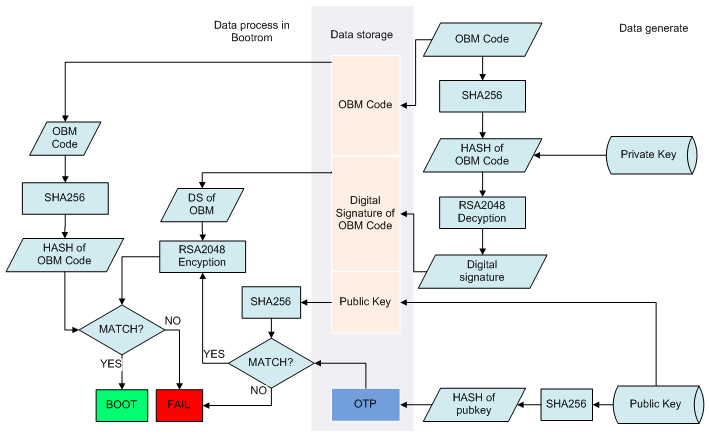

Figure 1-1 Secure boot process

### Secure Boot Sequence

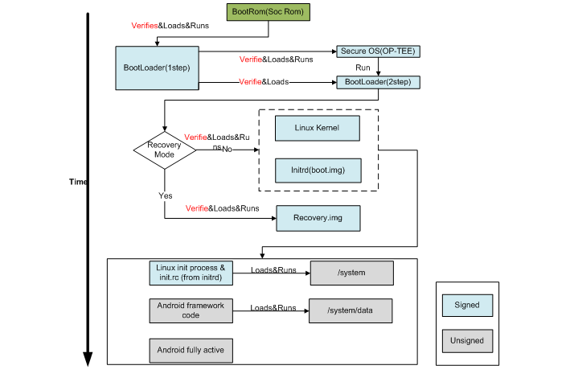

Figure 1-2 Secure boot sequence

### MaskRom Boot to the First Loader (RKminiLoader/U-Boot)


Figure 1-3-1 MaskRom to loader sequence

First loader layout in user partition of flash

Table 1-1 First loader data layout

| 0-63 sector                        | 64 sector reverse                |
| ---------------------------------- | -------------------------------- |
| first loader(8128 sector)(5 copys) | Boot loader partition            |
| 0-2047                             | loader header                    |
| 2048-4095                          | public key and digital signature |
| 4096 -                             | raw binary                       |
| …                                  |                                  |
| Boot loader copy(4) partition      |                                  |
| 0-2047                             | loader header                    |
| 2048-4095                          | public key and digital signature |
| 4096 -                             | raw binary                       |

The structure of public key and digital signature layout at address 2048 to 4095:

```c
typedef struct tagBOOT_HEADER
{
    uint32 tag;
    uint32 version;
    uint32 flags;
    uint32 size;
    uint32 reserved1[3];
    uint16 HashBits;
    uint16 RSABits;        /* length in bits of modulus */
    uint32 RSA_N[64];      /* RSA public key*/
    uint32 RSA_E[64];
    uint32 RSA_C[64];
    uint32 HashData[(8+1)*2];
    uint32 signature[64];
}BOOT_HEADER, *PBOOT_HEADER;
```

Public key: uint32 RSA_N[64], RSA_E[64], RSA_C[64] ;

Digital signature:  uint32 signature[64]

Step1: Get public key from first loader partition.

Step2: Calculate the hash(SHA256) of public key and compare it with the the hash stored in OTP.If mathed,load the first loader successfully, otherwise booting failed.

Step3: Calculate the hash(SHA256) of raw binary and compare it with **RSA2048 encryption**(have been obtainde in step1) of digital signature. If matched, load first loader successfully, otherwise booting failed.

### First Loader boot to u-boot(Secondary Boot Loader,option)


Figure 1-4-1 boot to -uboot flow


Table 1-4 u-boot layout in flash

The structure of header with digital digital signature layout at address 0 to 2047:

```c
typedef struct tag_second_loader_hdr
{
    unsigned char magic[LOADER_MAGIC_SIZE];
    unsigned int version;
    unsigned int reserved0;
    unsigned int loader_load_addr;         /* load to DDR address */
    unsigned int loader_load_size;         /* size in bytes */
    unsigned int crc32;                    /* crc32 */
    unsigned int hash_len;                 /* 20 or 32 , 0 is no hash */
    unsigned char hash[LOADER_HASH_SIZE];  /* sha256 */
    unsigned int js_hash;                  /* js hsah */
    unsigned char reserved[1024-32-32-4];
    unsigned int signTag;                  /* 0x4E474953, "NGIS" */
    unsigned int signlen;                  /* 256 */
    unsigned char rsaHash[256];            /* digital signature */
    unsigned char reserved2[2048-1024-256-8];
}second_loader_hdr;
```

Digital signature: unsigned char rsaHash[256];

l Step 1: Get public key from first loader partition

l Step 2: Calculate the hash (sha256) of public key and compare it with hash in OTP, if matched go to next step, otherwise booting failed.

l Step 3: Calculate the hash(SHA256) of raw binary and compare it with **RSA2048 encryption** (have been obtained in step 1) of digital signature, if matched, loading successfully and deliver the public key to U-Boot, otherwise booting failed.

### U-Boot Boot to Boot Image with Linux kernel


Figure 1-5 U-Boot to boot sequence

Table 1-2 Boot data layout

| boot.img  | 0-2047              | header |
| --------- | ------------------- | ------ |
| 2048-4095 | digital signature   |        |
| 4096-     | kernel,ramdisk,dtb… |        |
| …         |                     |        |
|           |                     |        |

The structure of layout 0-2047(header):

```c
#define BOOT_MAGIC_SIZE 8
#define BOOT_NAME_SIZE 16
#define BOOT_ARGS_SIZE 512
typedef struct tag_boot_img_hdr
{
    unsigned char magic[BOOT_MAGIC_SIZE]; /* "ANDROID!" */
    unsigned int kernel_size;             /* size in bytes */
    unsigned int kernel_addr;             /* physical load addr */
    unsigned int ramdisk_size;            /* size in bytes */
    unsigned int ramdisk_addr;            /* physical load addr */
    unsigned int second_size;             /* size in bytes */
    unsigned int second_addr;             /* physical load addr */
    unsigned int tags_addr;               /* physical addr for kernel tags */
    unsigned int page_size;               /* flash page size we assume */
    unsigned int unused[2];               /* future expansion: should be 0 */
    unsigned char name[BOOT_NAME_SIZE];   /* asciiz product name */
    unsigned char cmdline[BOOT_ARGS_SIZE];
    unsigned int id[8];                   /* timestamp / checksum / sha1 / etc */
    unsigned char reserved[0x400-0x260];
    unsigned int signTag;                 /* 0x4E474953 */
    unsigned int signlen;                 /* 128 */
    unsigned char rsaHash[128];
}boot_img_hdr;
```

Digital signature: unsigned char rsaHash[128];

l Step 1: U-Boot get public key obtained from first loader.

l Step 2: Calculate the hash (sha256) of public key and compare it with hash in OTP, if matched go to next step, otherwise booting failed.

l Step 3: Hash(SHA256) of raw binary and compare it with **RSA2048 encryption** (using public key get in step 1) of digital signature, if matched, boot to linux kernel, otherwise booting failed.

### U-Boot Boot to Recovery

The same as boot to boot image, detail please refer to chapter 1.4.

---
<div STYLE="page-break-after: always;"></div>
## eFuse Layout

RK3368, RK3288, RK3229 and RK3228 used 1024 bits eFuse for secure boot, data layout:

Table 2-1 eFuse data layout

| **32-bit Word Addressing** | **Description**                          |
| -------------------------- | ---------------------------------------- |
| 0x00                       | Security flagBits [7:0] security enable flag Bits [31:8] reserved |
| 0x01-0x3                   | Reserved                                 |
| 0x04-0x07                  | Reserved                                 |
| 0x8-0xF                    | RSA public key hash                      |
| 0x10-0x17                  | Reserved                                 |
| 0x18                       | Reserved                                 |
| 0x19-0x1A                  | Reserved                                 |
| 0x1B-0x1D                  | Reserved                                 |
| 0x1E                       | Reserved                                 |
| 0x1F                       | eFuse write lock bits                    |

RK3228H and RK3328 used 7680 bits OTP for secure boot, data layout:

Table 2-2 OTP data layout

| **32-bit Word Addressing** | **Description**                          |
| -------------------------- | ---------------------------------------- |
| 0-63                       | Public Key (N)                           |
| 64-127                     | Public Key (E)                           |
| 128                        | Security flagBits [7:0] 0xff: security enable flagBits [15:8] RSA_E size (word uint)Bits [31:16] Reserved |
| 129                        | Trusted Firmware revocation counter (ID #0) |
| 130-131                    | Non-trusted Firmware revocation counter (ID #1) |
| 132-239                    | Reserved                                 |

---

RK3326、PX30 and RK3308 used 4096 bits OTP for secure boot, data layout:

Table 2-3 OTP data layout2

| **32-bit Word Addressing** | **Description**                                 |
| -------------------------- | ----------------------------------------------- |
| 0                          | Secure boot enable flag                         |
| 1-3                        | Reserved                                        |
| 4-11                       | RSA Public key hash(using SHA256)               |
| 12-19                      | Device root key                                 |
| 20-23                      | FW encryption key                               |
| 24-25                      | Trusted Firmware revocation counter (ID #0)     |
| 26-31                      | Non-trusted Firmware revocation counter (ID #1) |
| 32-97                      | Reserved for OEM                                |

---
<div STYLE="page-break-after: always;"></div>
## Overall Operation Flow

Enable secure boot flow：

1. Package update.img
2. Sign Firmware(update.img)
3. Program EFUSE or OTP
4. Upgrade Firmware(update.img)
5. Check secure boot enable

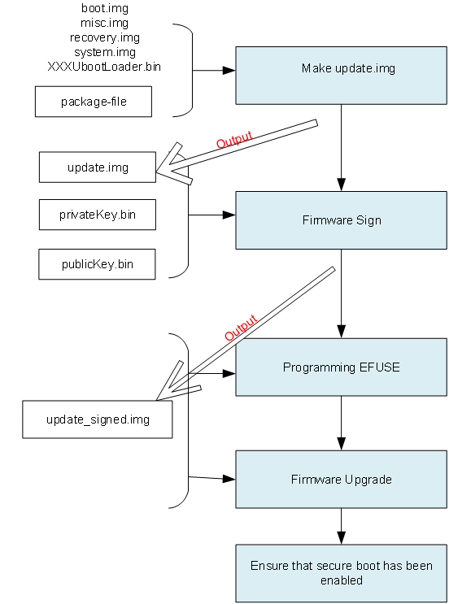

Figure 3-1 Secure boot operation process

---
<div STYLE="page-break-after: always;"></div>
## Make Update.img

### Generate Images

After build Android,use the following script to generate images:

./mkimage.sh ota


Figure 4-1 Script to generate images

### Packet Update.img

Refer to RKTools/windows/AndroidTool/rockdev/package-file. This file controls which files will be packaged.

Take RK3288, for example. Change bootloader path, commentaries resource and kernel lines, set backup to RESERVED.

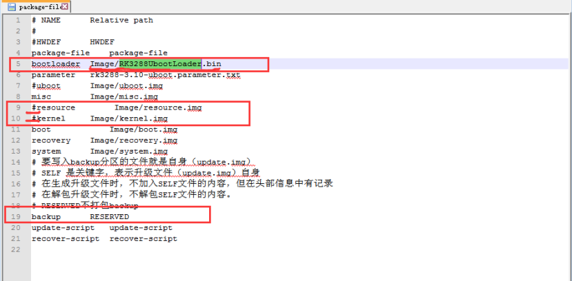

Figure 4-2 Package-file to control the packaging

Copy RKTools/windows folders to windows system, then run AndroidTool/rockdev/mkupdate.bat to generate the update.img.

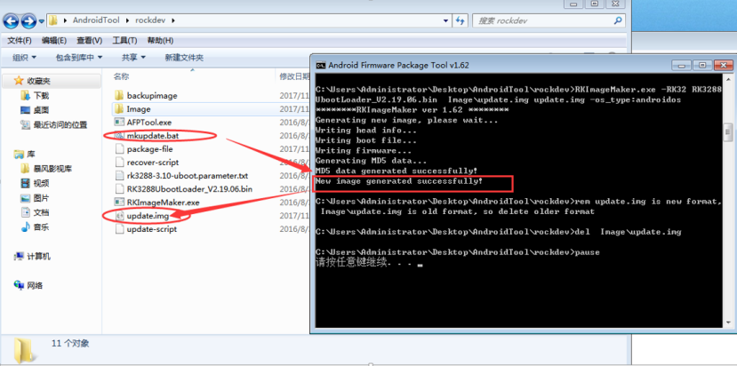Figure 4-3 Script-to-generate-images

---
<div STYLE="page-break-after: always;"></div>
## Firmware Sign Flow

This instruction is for Windows tools, while Linux has its own.

### Generating RSA key

 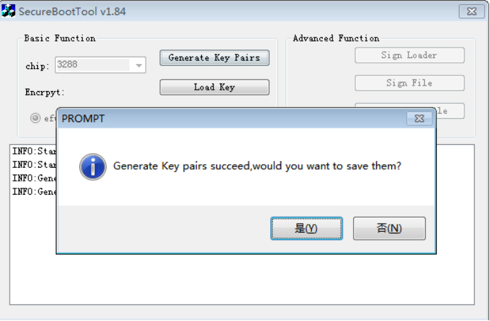

Figure 5-1 SecureBootTool generates RSA key

### Save RSA key

This key will be used for signed firmware and for OTA, please back up to a secure storage.

NOTE: The keypair is VERY important! Make sure to save it securely. Once you lost it or leak it, your product will be exposed in high risk, also the old device will be unable to be updated anymore.It should be maintained through the whole product life cycle


Figure 5-2 SecureBootTool saves RSA key

### Loading RSA key

 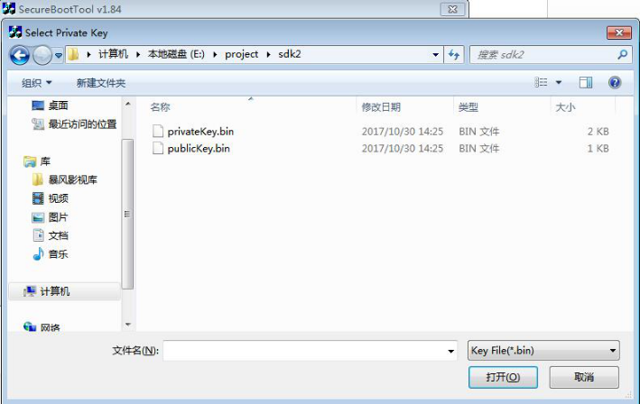

Figure 5-3 SecureBootTool loads RSA key

### Configuration


Choose SOC platform

:

Option ‘efuse’ means using eFuse to store the hash of the RSA public key, and will enable secure boot ROM(recommended).

Option ‘soft’ is for some special applications, will not enable secure boot ROM, used RSA1024 and SHA160.


Every product model will generate RSA KEY only once, please backup in case that you cannot upgrade firmware or OTA again.


Loading backup RSA key (support ‘.pem’ file format generated by openssl)


Sign firmware

### Sign Firmware

Make sure the ‘boot.img’ and the ‘recovery.img’ are included in the kernel image.

Refer to the pack command:


Figure 5-4 Images’pack command

Open firmware image:

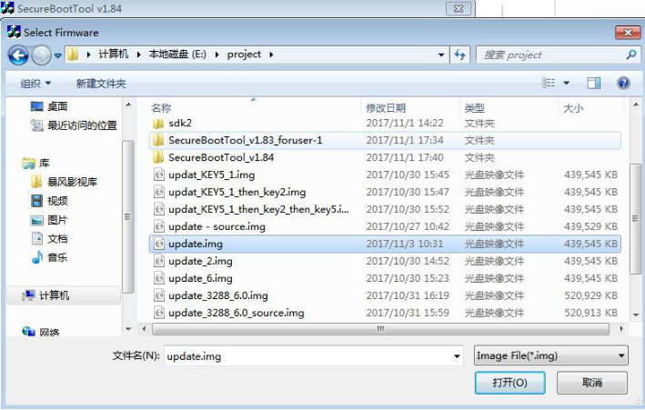

Figure 5-5 SecureBootTool selects firmware

Signed firmware:

 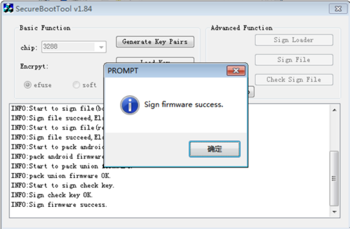

Figure 5-6 Secure Boot Tool-signed firmware

---
<div STYLE="page-break-after: always;"></div>
## Programming eFuse

### Hardware Conditions

For Rockchip AP series, there are two ways to program user secure data. One is "eFuse programming", the other is "OTP programming"(only few chips support). Following is the introduction.

#### eFuse Programming

RK3126, RK3128, RK3228, RK3229, RK3288, RK3368 and RK3399 support eFuse programming, following is the general requirements:

A. If products do not need eFuse data programming, we advise to connect eFuse Power Pin directly to GND. Avoiding eFuse data change caused by misoperation. (RK3126/RK3126C eFuse Power Pin is reused with SARADC function, so that it would not to be grounded.)

B. If products need eFuse programming, then connect a pull down resistance to GND on eFuse Power Pin, to make sure that eFuse power pin doesn't fluctuate in normal work condition. also to avoid eFuse data change caused by misoperation. This pull-down resistance value, please refer to each chip platform's reference schematics, generally it's at a range of 47Ω-10KΩ.

C. There are two types of power supply for eFuse programming:

a) Onboard power supply mode

- Advantage: PCBA socket test board is not needed, you can program eFuse data first, and then upgrade the firmware. When system works in normal condition, the firmware must make sure that eFuse power is not on,keep 0V to prevent misoperation.
- Disadvantange: Power supply circuit must placement on the board. The material cost is increased, and you need to make sure the firmware is no misoperation at any time.
- Apply to: This power supply mode applies to customers who don't want to add PCBA testing process. For example some BOX products, their interfaces and assembling are both simple, not need socket board to use on the PCBA test.

b) Power supply by PCBA test board(recommended)

- Advantage: Only test points needed. It is no power supply circuit on board so users can't crack through software too.
- Disadvantage: Increase PCBA test process, the test cost is higher.

l Apply to: Products like tablets, their assembling is complicated. If PCBA is abnormal, it 's more complicated to rework and replace, so these kinds of products usually have PCBA testing process, Programming eFuse on this process is reasonable.

D. Electronic circuit introduction:

Each chip platform’s eFuse power supply voltage is different(such as 1.5/1.8/2.5V), power supply pin number and current requirement is also different.

we recommend that power supply capacity should be 50mA above, for detailed voltage and pull-down resistance value, you can refer to schematic diagram. Summarized advices are below:

Table 6-1 Hardware parameters

| Chip Part Number | eFusePower | Programming Mode               | VQPS Current Requirement | Pull-down Resistance Value | eFusePower Pin Number | Remark          |
| ---------------- | ---------- | ------------------------------ | ------------------------ | -------------------------- | --------------------- | --------------- |
| RK3126/RK3126C   | 2.5V       | Power by PCBA test board       | >50mA                    | None                       | PIN68                 | Reused with ADC |
| RK3128           | 2.5V       | Onboard or powered by external | >50mA                    | <=10K                      | R10                   |                 |
| RK3168/RK3188    | 1.5V       | Onboard or powered by external | >50mA                    | <=510R                     | Y10                   |                 |
| RK3228/RK3229    | 1.6V       | Onboard or powered by external | >50mA                    | <=100R                     | R10                   |                 |
| RK3288           | 1.5V       | Onboard or powered by external | >50mA                    | <=510R                     | P19                   |                 |
| RK3368           | 1.5V       | Onboard or powered by external | >50mA                    | <=47R                      | Y10                   |                 |
| RK3399           | 1.8V       | Onboard or powered by external | >50mA                    | <=1K                       | AD23                  |                 |

Recommended power supply mode is shown as below diagram.

a) PartA: eFuse power supply circuit, please choose suitable LDO part number according to the voltage requirement above, this part circuit can be placed on mainboard, and also can be placed on the PCBA test board.

b) PartB: eFuse power pin with pull down resistance R4(47R-10K), keep the voltage low level to avoid misoperation. If power supply circuit is placed on the PCBA test board, the SOC mainboard needs to add responding testing points, to facilitate fixture pin touch.

Attention:

a) RK3126C's eFuse power is reused with ADC function, so it can't connect pull-down resistance.

b) RK3228/RK3229's eFuse power supply is suggest to be adjusted to 1.55-1.6V, to be more stabled.

c) If the device uses onboard power supply mode, please make sure eFuse_PWREN, which is in the following diagram be distributed an independent GPIO to control the LDO. It must make sure there is no power output on VCC_eFuse PIN in normal work condition. Details refer to reference schematic that RK released, if there is no GPIO distributed, contact us or use external power supply mode.


Figure 6-1 eFuse circuit

#### OTP Programming

RK3328 and RK3228H support OTP programming mode, this mode is no need external power supply circuit, OTP_VCC18(PIN16) is always powered by VCC_18. you only need to run the special time sequence for OTP programming, not need the additional changes aboout hardware.


Figure 6-2 OTP circuit

### Tool UI

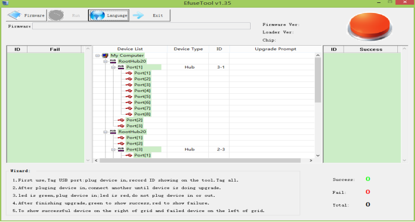

Figure 6-3 eFuse tool UI

### Load the Signed Firmware


Figure 6-4 Load signed firmware

### Click 'run' Button to Start

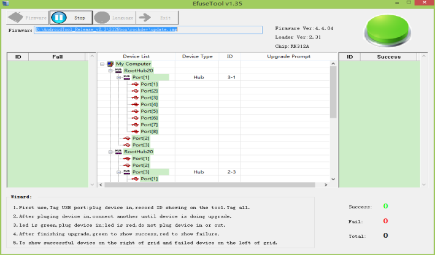

Figure 6-5 Programming the chip

### Programming eFuse

Connect the device to the PC by USB cable; the tool will program the hash of RSA public key to eFuse automatically.

Programming eFuse needs an external power supply, the detail information please refer to SOC's DATASHEET.

Notice:RK3228H,RK3328,RK3336,RK3308 and PX30 don’t need step [6.2](#_Tool_UI) to [6.4](#_Click'run'_Button_to). Programming will be done by upgrading firmware which has been signed.

### Programming OTP

RK3228H,RK3328,RK3326,RK3308 and PX30 support OTP programming. Public key hash need  program to OTP. Programming OTP performs are :

1. First, follow the above steps to burn signed firmware. If the machine can start normally，the signature process is correct. Then OTP can be programed.

2. The signature tool uses version of SecureBootTool V1.9 or more. Open the config.ini file in the tools directory. Find "sign_flag="，set"sign_flag=0x20"(bit 5 set 1) which enable write OTP in RKMiniLoader.  Save config.ini file. Reopen SecureBootTool.exe to sign firmware or RKMiniLoader.

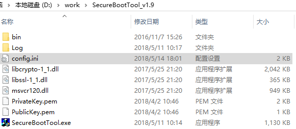

Figure 6-6-1 SecureBootTool

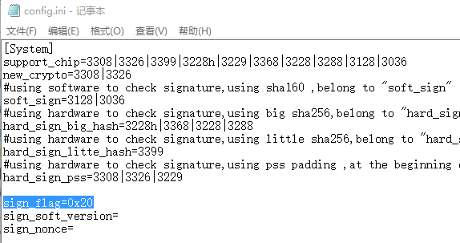

Figure 6-6-2 config.ini

3. Use re-signed firmware or RKMiniLoader burnning. After burnning, restart the machine. The RKMiniLoader will be responsible for generating hash of public key and writing it to OTP during startup and enable secure boot.

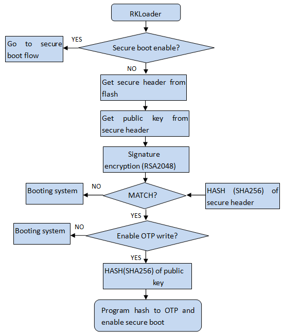

Figure 6-6-3 OTP program flow

4. If OTP program success, serial port print “otp write key success!!!”. If OTP program fail, serial port print"otp write error: !!!".

---
<div STYLE="page-break-after: always;"></div>
## Firmware Upgrade

### Firmware Upgrade

Open the signed firmware and connect the device which has programmed eFuse to the PC by USB cable:


Figure 7-1 Upgrade tool 1

Select ‘Upgrade’ option and Click "Run" button to start firmware upgrade and wait it to be completed:

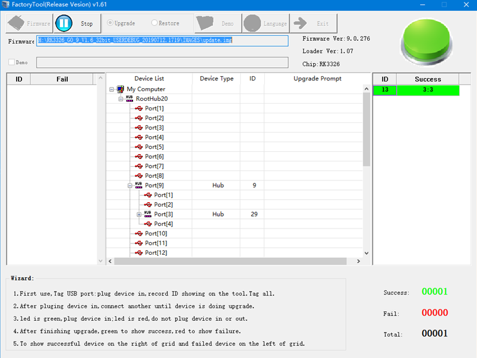

Figure 7-2 Upgrade tool 2

---
<div STYLE="page-break-after: always;"></div>
## Verification

### Check Secure Flag

Use serial port tools (e.g. SecureCRT) to get the log of system boot. These words show that the security boot is on:

​	**Secure Boot Mode: 0x1**  or **SecureMode = 0x1**

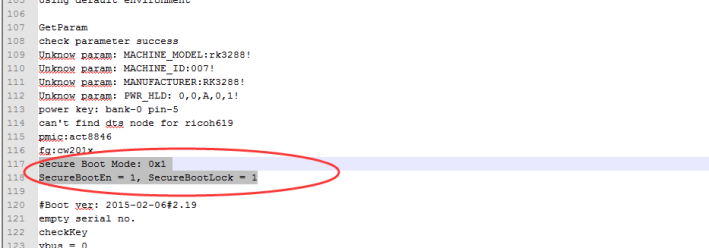

Figure 8-1 Log of system boot

### Secure Boot Test

The device which had programmed eFuse will enable secure boot rom, and could not boot from the un-signed firmware.

So try to upgrade un-signed firmware or unmatched key signed firmware will fail;

And upgrade matched signed firmware will boot success.

SOC RK3128 and RK3126 will fail at “wait for loader”:

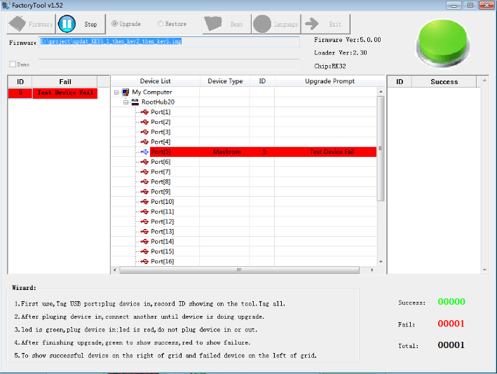

Figure 8-2 Upgrade fail 1

Other SOC will fail at “Download Boot”:


Figure 8-3 Upgrade fail 2

---
<div STYLE="page-break-after: always;"></div>
## Secure Debug

### Introduction

The secure debug only support disabled **secure boot verification** feature for upgrade unsigned kernel to speed up debugging.

There has a 128-bit unique CPU ID for each SOC. The Signed Tools read the CPU ID and using **RSA private key** to Decryption and got a certificate, then the device using **RSA public key** to verify it. After the certificate is verified, the device will disable secure boot verification in uboot.

### Secure Debug Process

```mermaid
graph LR
    cpuid[<font size=8><br>CPU<br><br>ID]-->signed[<font size=8><br>Signed<br><br>Tools]
    signed--<font size=6><br>RSA<br><br>Decryption-->certificate[<font size=8><br>Certi-<br><br>ficate]
    certificate--<font size=6><br>RSA<br><br>Encryption-->verify{<font size=8><br>uboot<br><br>verify?<br>}
    cpuid-->verify
    verify--<font size=6><br>PASS-->disable[<font size=8><br>disable<br><br>secure<br><br>boot<br>]
    verify--<font size=6><br>NOT<br><br>PASS-->do_nothing[<font size=8><br>do<br><br>nothing<br>]
    style cpuid fill:#ff8,stroke:#333,stroke-width:4px;
    style signed fill:#ccf,stroke:#333,stroke-width:4px;
    style certificate fill:#ccf,stroke:#333,stroke-width:4px;
    style disable fill:#ff8,stroke:#333,stroke-width:4px;
    style do_nothing fill:#ff8,stroke:#333,stroke-width:4px;
    style verify fill:#ccf,stroke:#f66,stroke-width:5px,stroke-dasharray:5,5;
```
