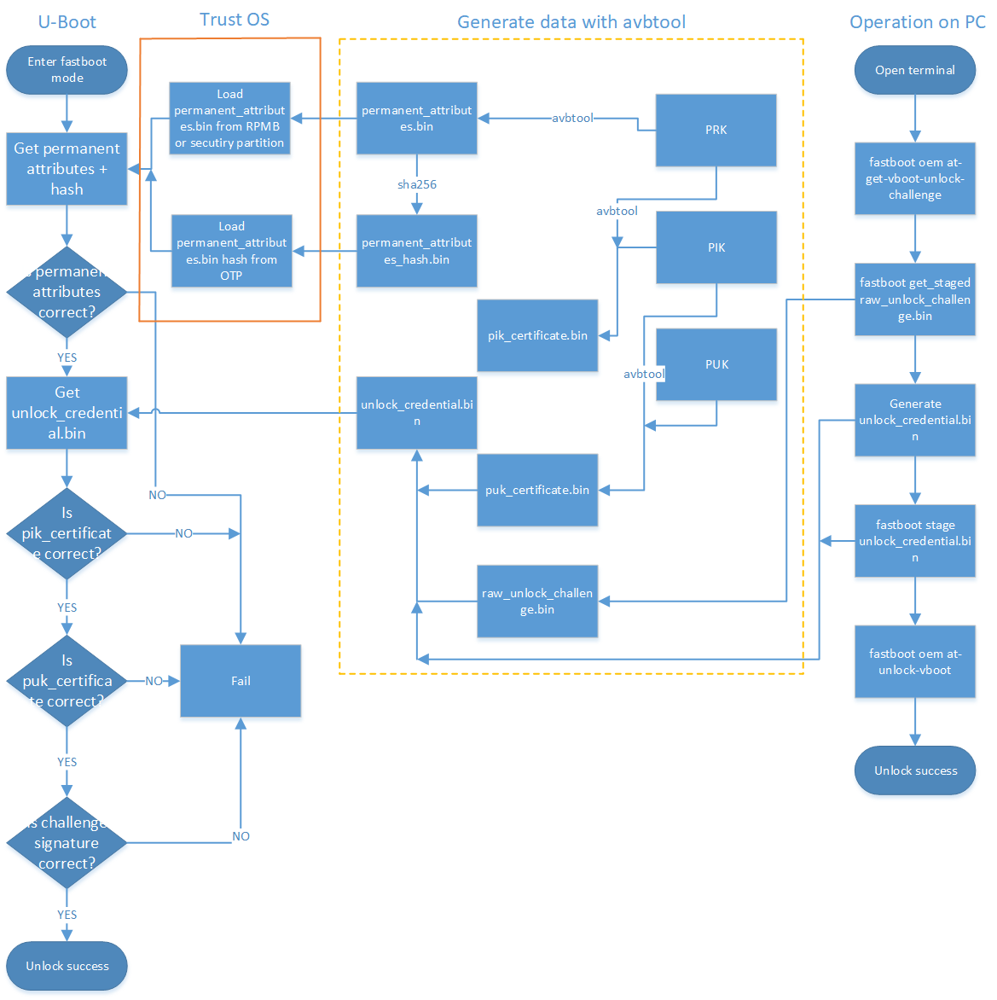
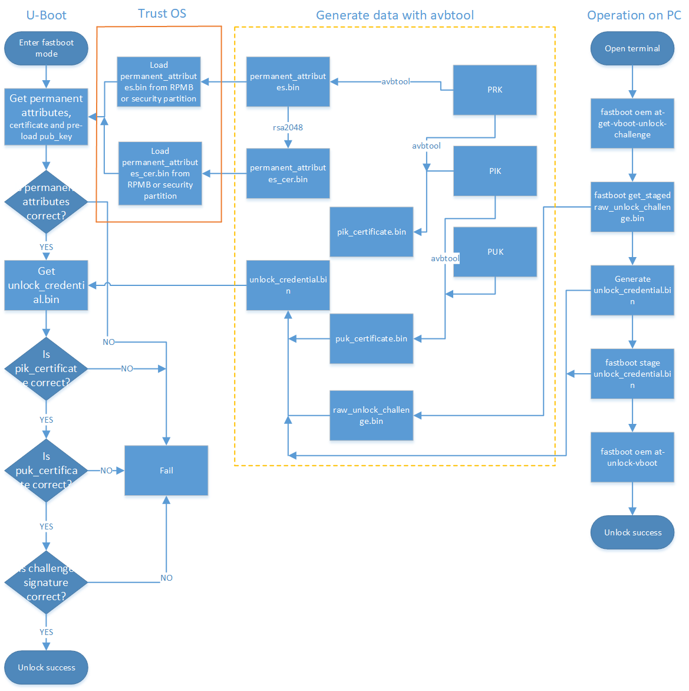
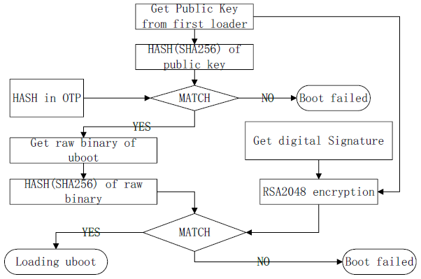
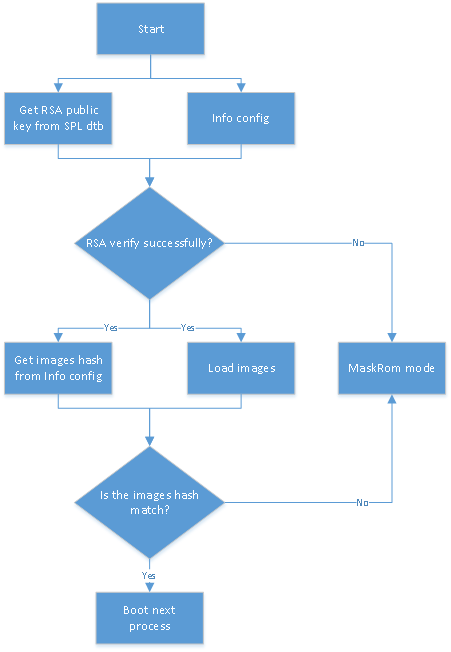
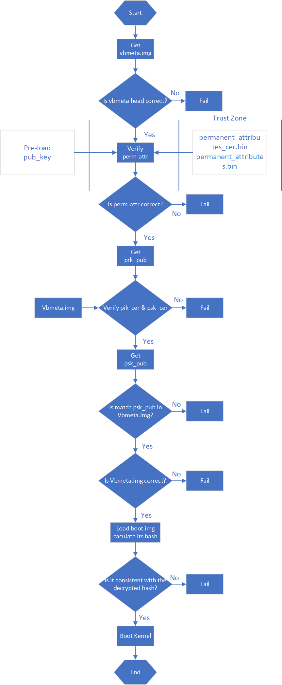

# Rockchip Secure Boot

ID: RK-KF-YF-023

Release version: 2.3.0

Release Date: 2021-04-13

Security Level: □Top-Secret   □Secret   □Internal   ■Public

---

**DISCLAIMER**

THIS DOCUMENT IS PROVIDED “AS IS”. ROCKCHIP ELECTRONICS CO., LTD.(“ROCKCHIP”)DOES NOT PROVIDE ANY WARRANTY OF ANY KIND, EXPRESSED, IMPLIED OR OTHERWISE, WITH RESPECT TO THE ACCURACY, RELIABILITY, COMPLETENESS,MERCHANTABILITY, FITNESS FOR ANY PARTICULAR PURPOSE OR NON-INFRINGEMENT OF ANY REPRESENTATION, INFORMATION AND CONTENT IN THIS DOCUMENT. THIS DOCUMENT IS FOR REFERENCE ONLY. THIS DOCUMENT MAY BE UPDATED OR CHANGED WITHOUT ANY NOTICE AT ANY TIME DUE TO THE UPGRADES OF THE PRODUCT OR ANY OTHER REASONS.

**Trademark Statement**

"Rockchip", "瑞芯微", "瑞芯" shall be Rockchip’s registered trademarks and owned by Rockchip. All the other trademarks or registered trademarks mentioned in this document shall be owned by their respective owners.

**All rights reserved. ©2021. Rockchip Electronics Co., Ltd.**

Beyond the scope of fair use, neither any entity nor individual shall extract, copy, or distribute this document in any form in whole or in part without the written approval of Rockchip.

Rockchip Electronics Co., Ltd.

No.18 Building, A District, No.89, software Boulevard Fuzhou, Fujian,PRC

Website:     [www.rock-chips.com](http://www.rock-chips.com)

Customer service Tel:  +86-4007-700-590

Customer service Fax:  +86-591-83951833

Customer service e-Mail:  [fae@rock-chips.com](mailto:fae@rock-chips.com)

---

**Preface**

**Overview**

This document will describe the secure boot process based on Rockchip U-Boot next-dev in details.

**Product Version**

**Intended Audience**

This document (this guide) is mainly intended for:

Technical support engineers
Software development engineers

---

**Revision History**

| **Version** | **Author** |  **Date** |**Revision description** |
| ---------- | -------- | --------- | ------------------ |
| V1.0.0   | Jason Zhu | 2019-01-14 |Initial version release |
| V1.1.0   | Jason Zhu |2019-06-03 | Correct some inappropriate descriptions |
| V2.0.0  | Jason Zhu & Chen Haiyan  |2019-09-19 | Version update & Release English version |
| V2.1.0 | Ken Bian |2020-01-15 | Add more details for Android SDK |
| V2.2.0 | WuLiangqing |2021-03-25 |  Add AVB Kernel section description |
| V2.3.0 | Jason Zhu |2021-04-13 |  Add pre-loader / SPL verification process description |

---

**Contents**

[TOC]

---

## Reference

《Rockchip_Developer_Guide_Secure_Boot_Application_Note_EN.md》

《Android Verified Boot 2.0》

《Rockchip_Developer_Guide_Linux4.4_SecureBoot_CN.pdf》

## Terminology

AVB : Android Verified Boot

OTP & efuse : One Time Programmable

Product RootKey (PRK)：AVB root key is verified by the root key which is used to sign loader, uboot & trust when secure storage is efuse, while it is verified by the hash which is stored in OTP when secure storage is OTP.

ProductIntermediate Key (PIK)：medium key

ProductSigning Key (PSK)：used to sign the image

ProductUnlock Key (PUK)：used to unlock the device

**With clear responsibility, each key is independent, which can reduce the risk of key disclosure.**

## Overview

This document introduces Rockchip secure boot process which includes secure and integrity verification. Secure verification is to verify encrypted keys. The process is to read the hash of the public key from secure storage(OTP & efuse), then compare it with the calculated hash of the public key to see if they are the same, and then use the public key to decrypt the hash of the image. Integrity verification is to verify the integrity of the image. The process is to load the image from the memory, calculate the hash of the image and compare it with the decrypted hash to see if they are the same.

## Example of Communication Encryption

The secure boot process of the device is similar as the verification process of the data encryption during communication. It can help understand avb verification process through this example. Assuming now Alice is sending digital information to Bob. In order to ensure the confidentiality, authenticity, integrity and non-repudiation of the information transmission, it needs to encrypt and sign the information digitally when transmitted. The transmission process is:

1. Alice prepares the digital information when starts  communication(plaintext).

2. Alice performs hash algorithm on the digital information to get an information digest.

3. Alice uses the private key to encrypt the information digest to get the digital signature, and attach it to the digital information.

4. Alice generates an encryption key randomly, and then use the key to encrypt the information to form the ciphertext.

5. Alice uses Bob's public key to encrypt the encryption key generated randomly just now, and send the encrypted DES encryption key together with the ciphertext to Bob.

6. After receiving the ciphertext and encrypted DES encryption key from Alice, Bob firstly uses his private key to decrypt the DES encryption key, to get the random encryption key generated by Alice.

7. Then Bob uses the random encryption key to decrypt the ciphertext to get the digital information of the plaintext, and then discard the random encryption key.

8. Bob uses Alice's public key to decrypt the digital signature of Alice to get the information digest.

9. Bob performs the same hash algorithm on the received plaintext to get a new information digest.

10. Bob compares the received information digest with the newly generated information digest. If they are the same, it means the information received is not tampered.

DES algorithm mentioned above can be changed to other algorithm, such as AES encryption algorithm. Public/Private key algorithm can use RSA algorithm. The process is as follows:


## AVB

AVB is the abbreviation of Android Verified Boot. It is a set of image verification process designed by Google, which is mainly used to verify boot system and other images. Rockchip Secure Boot Process is a whole set of Secure Boot verification solution referring to the AVB verification method and Communication Encryption.

### AVB support features

- Secure verification
- Integrity verification
- Anti-rollback protection
- Persistent partition
- Support chained partitions

### image signature and key & certificate generation

```shell
#!/bin/sh
touch temp.bin
openssl genpkey -algorithm RSA -pkeyopt rsa_keygen_bits:4096 -outform PEM -out testkey_prk.pem
openssl genpkey -algorithm RSA -pkeyopt rsa_keygen_bits:4096 -outform PEM -out testkey_psk.pem
openssl genpkey -algorithm RSA -pkeyopt rsa_keygen_bits:4096 -outform PEM -out testkey_pik.pem
python avbtool make_atx_certificate --output=pik_certificate.bin --subject=temp.bin --subject_key=testkey_pik.pem --subject_is_intermediate_authority --subject_key_version 42 --authority_key=testkey_prk.pem
python avbtool make_atx_certificate --output=psk_certificate.bin --subject=product_id.bin --subject_key=testkey_psk.pem --subject_key_version 42 --authority_key=testkey_pik.pem
python avbtool make_atx_metadata --output=metadata.bin --intermediate_key_certificate=pik_certificate.bin --product_key_certificate=psk_certificate.bin
```

Generate permanent_attributes.bin:

```shell
python avbtool make_atx_permanent_attributes --output=permanent_attributes.bin --product_id=product_id.bin --root_authority_key=testkey_prk.pem
```

The product_id.bin should be defined by yourself. It takes 16 bytes, and can be used as product ID.

**Note: The signatures of the following Android images(boot.img, system.img) and the generation of vbmeta.img have been bundled in Android 9.0 and later, no signing and manual generation are required. Please refer to [5.7 Android SDK configuration instruction](#5.7-Android SDK configuration instruction)**

The example of boot.img signature:

```shell
avbtool add_hash_footer --image boot.img --partition_size 33554432 --partition_name boot --key testkey_psk.pem --algorithm SHA256_RSA4096
```

**Note: Partition size should be at least 64K larger than original image, 4K aligned, and not larger than the partition size defined by parameter.txt.**

The example of system.img signature:

```shell
avbtool add_hashtree_footer --partition_size 536870912 --partition_name system --image system.img --algorithm SHA256_RSA4096 --key testkey_psk.pem
```

The command to generate vbmeta including metadata.bin is shown as below:

```shell
python avbtool make_vbmeta_image --public_key_metadata metadata.bin --include_descriptors_from_image boot.img --include_descriptors_from_image system.img --generate_dm_verity_cmdline_from_hashtree system.img --algorithm SHA256_RSA4096 --key testkey_psk.pem  --output vbmeta.img
```

Finally flash the generated vbmeta.img to the corresponding partition, such as vbmeta partition.

Generate PrivateKey.pem and PublicKey.pem through SecureBootTool.


Sign permanent_attributes.bin:

```shell
openssl dgst -sha256 -out permanent_attributes_cer.bin -sign PrivateKey.pem permanent_attributes.bin
```

The permanent_attributes.bin is the secure verification data of the whole system. It is required to flash its hash to efuse or OTP, or verify by the pre-load public key. Due to the efuse of rockchip platform is not enough,  permanent_attributes.bin is verified by the pre-load public key and the certificate of permanent_attributes.bin. For the platform with OTP, the secure data space is enough, it will directly flash the hash of permanent_attributes.bin to OTP.

Support status of efuse and OTP for each platform:

| **Platform** | **efuse** | **OTP** |
| ------------ | --------- | ------- |
| rk3568       |           | ✔       |
| rk3566       |           | ✔       |
| rk3399       | ✔         |         |
| rk3368       | ✔         |         |
| rk3328       |           | ✔       |
| rk3326       |           | ✔       |
| rk3308       |           | ✔       |
| rk3288       | ✔         |         |
| rk3229       | ✔         |         |
| rk3126       | ✔         |         |
| rk3128       | ✔         |         |

Flash pub_key on efuse platform:

```shell
fastboot stage permanent_attributes.bin
fastboot oem fuse at-perm-attr
fastboot stage permanent_attributes_cer.bin
fastboot oem fuse at-rsa-perm-attr
```

Flash pub_key on OTP platform:

```shell
fastboot stage permanent_attributes.bin
fastboot oem fuse at-perm-attr
```

The whole signing process:


### AVB lock

```shell
fastboot oem at-lock-vboot
```

Refer to fastboot command support chapters on how to enter fastboot.

### AVB unlock

Currently Rockchip uses strict secure verification, which requires to add config in the corresponding defconfig:

```c
CONFIG_RK_AVB_LIBAVB_ENABLE_ATH_UNLOCK=y
```

Input "fastboot oem at-unlock-vboot" will unlock the device without this config, and the failure of the verification of vbmeta.img，boot.img will also start the device successfully.

Firstly, need to generate PUK:

```shell
openssl genpkey -algorithm RSA -pkeyopt rsa_keygen_bits:4096 -outform PEM -out testkey_puk.pem
```

The unlock_credential.bin is the unlock certificate which should be downloaded to the device. Its generation is as below:

```shell
python avbtool make_atx_certificate --output=puk_certificate.bin --subject=product_id.bin --subject_key=testkey_puk.pem --usage=com.google.android.things.vboot.unlock --subject_key_version 42 --authority_key=testkey_pik.pem
```

Acquire unlock_credential.bin from the device, then use the script avb-challenge-verify.py to acquire unlock_credential.bin, and execute the following command to acquire unlock_credential.bin:

```shell
python avbtool make_atx_unlock_credential --output=unlock_credential.bin --intermediate_key_certificate=pik_certificate.bin --unlock_key_certificate=puk_certificate.bin --challenge=unlock_challenge.bin --unlock_key=testkey_puk.pem
```

Finally download the certificate to the device through the fastboot command, and unlock the device. The fastboot command is as below:

```shell
fastboot stage unlock_credential.bin
fastboot oem at-unlock-vboot
```

The unlock process for OTP device:



The unlock process for efuse device:



The whole operation process is as below:

1. Make the device to enter fastboot mode, then input the following commands from PC side:

```shell
fastboot oem at-get-vboot-unlock-challenge
fastboot get_staged raw_unlock_challenge.bin
```

Enter these commands to obtain the data with version, Product Id and 16 bytes random data. Fetch the random data as unlock_challenge.bin.

2. Use avbtool to generate unlock_credential.bin, referring to make_unlock.sh.

3. Input from PC side:

```shell
fastboot stage unlock_credential.bin
fastboot oem at-unlock-vboot
```

**Note**: Now the device is always in the fastboot mode, and power down, power off, reboot operations are not allowed during this period. Because after step 1, the device stores the generated random data. If power down, power off, or reboot occurs, it will lead to the loss of random data, and further verification of challenge signature will fail due to the mismatch of random data.

If enable:

```c
CONFIG_MISC=y
CONFIG_ROCKCHIP_EFUSE=y
CONFIG_ROCKCHIP_OTP=y
```

It will use CPUID as challenge number. CPUID matches with the device, and generated unlock_credential.bin can be used repeatedly when power off. In this way, you can skip the steps to repeatedly generate unlock_challenge.bin and build unlock_credential.bin. The step to unlock device is changed to:

```shell
fastboot oem at-get-vboot-unlock-challenge
fastboot stage unlock_credential.bin
fastboot oem at-unlock-vboot
```

4. The device enters unlock mode, start to unlock.

make_unlock.sh refers to:

```shell
#!/bin/sh
python avb-challenge-verify.py raw_unlock_challenge.bin product_id.bin
python avbtool make_unlock_credential --output=unlock_credential.bin --intermediate_key_certificate=pik_certificate.bin --unlock_key_certificate=puk_certificate.bin --challenge=unlock_challenge.bin --unlock_key=testkey_puk.pem
```

avb-challenge-verify.py refers to:

```python
#/user/bin/env python
"This is a test module for getting unlock_challenge.bin"
import sys
import  os
from hashlib import sha256

def challenge_verify():
	if (len(sys.argv) != 3) :
		print "Usage: rkpublickey.py [challenge_file] [product_id_file]"
		return
	if ((sys.argv[1] == "-h") or (sys.argv[1] == "--h")):
		print "Usage: rkpublickey.py [challenge_file] [product_id_file]"
		return
	try:
		challenge_file = open(sys.argv[1], 'rb')
		product_id_file = open(sys.argv[2], 'rb')
		challenge_random_file = open('unlock_challenge.bin', 'wb')
		challenge_data = challenge_file.read(52)
		product_id_data = product_id_file.read(16)
		product_id_hash = sha256(product_id_data).digest()
		print("The challege version is %d" %ord(challenge_data[0]))
		if (product_id_hash != challenge_data[4:36]) :
			print("Product id verify error!")
			return
		challenge_random_file.write(challenge_data[36:52])
		print("Success!")

	finally:
		if challenge_file:
			challenge_file.close()
		if product_id_file:
			product_id_file.close()
		if challenge_random_file:
			challenge_random_file.close()

if __name__ == '__main__':
	challenge_verify()
```

### Enable AVB in U-Boot

It requires trust support to enable avb. Need to configure U-Boot in defconfig file:

```c
CONFIG_OPTEE_CLIENT=y
CONFIG_OPTEE_V1=y
CONFIG_OPTEE_ALWAYS_USE_SECURITY_PARTITION=y  // Save secure data to security partition
```

CONFIG_OPTEE_V1: suitable for 312x,322x,3288,3228H,3368,3399.

CONFIG_OPTEE_V2: suitable for 3326,3308.

CONFIG_OPTEE_ALWAYS_USE_SECURITY_PARTITION: disabled by default. Force to use security partition if enable.

It requires to configure in defconfig file to enable avb:

```c
CONFIG_AVB_LIBAVB=y
CONFIG_AVB_LIBAVB_AB=y
CONFIG_AVB_LIBAVB_ATX=y
CONFIG_AVB_LIBAVB_USER=y
CONFIG_RK_AVB_LIBAVB_USER=y
// The above items are mandatory, the following selections are for AVB and A/B feature support. These two features can be used separately.
CONFIG_ANDROID_AB=y // Support A/B
CONFIG_ANDROID_AVB=y // Support AVB
// The following macro is only for efuse platform
CONFIG_ROCKCHIP_PRELOADER_PUB_KEY=y
// Enable dm-crypto
CONFIG_DM_CRYPTO=y
// Support for rk3399/rk3368/rk3328/rk3229/rk3288/rk3128
CONFIG_ROCKCHIP_CRYPTO_V1=y
// Support for px30/rk3326/rk1808/rk3308
CONFIG_ROCKCHIP_CRYPTO_V2=y
// The following macro should be enabled for strict unlock verification
CONFIG_RK_AVB_LIBAVB_ENABLE_ATH_UNLOCK=y
// Enable the secure verification
CONFIG_AVB_VBMETA_PUBLIC_KEY_VALIDATE=y
// If need to use cpuid as challenge number, enalbe the following macro
CONFIG_MISC=y
CONFIG_ROCKCHIP_EFUSE=y
CONFIG_ROCKCHIP_OTP=y
```

### Kernel modification

The changes to the kernel are only applicable to Android9.0. There is no need to change the kernel for Android10 and above. You can skip these changes.

System, vendor, oem and other partitions are verified by loading dm-verify module of kernel, so need to enable this module.

Enable AVB requires to configure parameter avb in kernel dts, referring to below:

```c
&firmware_android {
	compatible = "android,firmware";
	boot_devices = "fe330000.sdhci";
	vbmeta {
		compatible = "android,vbmeta";
		parts = "vbmeta,boot,system,vendor,dtbo";
	};
	fstab {
		compatible = "android,fstab";
		vendor {
			compatible = "android,vendor";
			dev = "/dev/block/by-name/vendor";
			type = "ext4";
			mnt_flags = "ro,barrier=1,inode_readahead_blks=8";
			fsmgr_flags = "wait,avb";
		};
	};
};
```

Enable A/B system requires to configure slotselect parameter, referring to below:

```c
firmware {
	android {
		compatible = "android,firmware";
		fstab {
			compatible = "android,fstab";
			system {
				compatible = "android,system";
				dev = "/dev/block/by-name/system";
				type = "ext4";
				mnt_flags = "ro,barrier=1,inode_readahead_blks=8";
				fsmgr_flags = "wait,verify,slotselect";
			};
			vendor {
				compatible = "android,vendor";
				dev = "/dev/block/by-name/vendor";
				type = "ext4";
				mnt_flags = "ro,barrier=1,inode_readahead_blks=8";
				fsmgr_flags = "wait,verify,slotselect";
			};
		};
	};
};
```

### Android SDK configuration instruction

#### AVB Enable

For Android 9.0 and later, the image signature is already bundled in the SDK, just enable BOARD_AVB_ENABLE and configure the path of PSK and metadata.bin. All the configurations you need to set in your BoardConfig.mk (for example: device/rockchip/rk3326/BoardConfig.mk) are:

```makefile
BOARD_AVB_ENABLE := true
BOARD_AVB_METADATA_BIN_PATH := path/to/metadata.bin
BOARD_AVB_KEY_PATH := path/to/testkey_psk.pem
```

#### A/B system

These variables mainly include three types:

- The variables which must be defined by `A/B` system

  - `AB_OTA_UPDATER := true`
  - `AB_OTA_PARTITIONS := boot system vendor`
  - `BOARD_BUILD_SYSTEM_ROOT_IMAGE := true`
  - `TARGET_NO_RECOVERY := true`
  - `BOARD_USES_RECOVERY_AS_BOOT := true`
  - `PRODUCT_PACKAGES += update_engine update_verifier`

- The variables which can be defined by `A/B` system
  - `PRODUCT_PACKAGES_DEBUG += update_engine_client`

- The variables which cannot be defined by `A/B` system
  - `BOARD_RECOVERYIMAGE_PARTITION_SIZE`
  - `BOARD_CACHEIMAGE_PARTITION_SIZE`
  - `BOARD_CACHEIMAGE_FILE_SYSTEM_TYPE`

### New contents in CMDLINE

```
Kernel command line: androidboot.verifiedbootstate=green androidboot.slot_suffix=_a dm="1 vroot none ro 1,0 1031864 verity 1 PARTUUID=b2110000-0000-455a-8000-44780000706f PARTUUID=b2110000-0000-455a-8000-44780000706f 4096 4096 128983 128983 sha1 90d1d406caac04b7e3fbf48b9a4dcd6992cc628e 4172683f0d6b6085c09f6ce165cf152fe3523c89 10 restart_on_corruption ignore_zero_blocks use_fec_from_device PARTUUID=b2110000-0000-455a-8000-44780000706f fec_roots 2 fec_blocks 130000 fec_start 130000" root=/dev/dm-0 androidboot.vbmeta.device=PARTUUID=f24f0000-0000-4e1b-8000-791700006a98 androidboot.vbmeta.avb_version=1.1 androidboot.vbmeta.device_state=unlocked androidboot.vbmeta.hash_alg=sha512 androidboot.vbmeta.size=6528 androidboot.vbmeta.digest=41991c02c82ea1191545c645e2ac9cc7ca08b3da0a2e3115aff479d2df61feaccdd35b6360cfa936f6f4381e4557ef18e381f4b236000e6ecc9ada401eda4cae androidboot.vbmeta.invalidate_on_error=yes androidboot.veritymode=enforcing
```

Here introduce some parameters:

1. Why to transmit PARTUUID of vbmeta? Because to ensure the further use legality of vbmeta hash-tree, the kernel is required to verify vbmeta once again. The vbmeta's digest is passed by androidboot.vbmeta.digest.

2. skip_initramfs: In A/B system, ramdisk is not packed into boot.img, and cmdline needs to transmit this parameter.

3. root=/dev/dm-0: enables dm-verify, specify system.

4. androidboot.vbmeta.device_state: android verify state

5. androidboot.verifiedbootstate: The verification result.

green：If in LOCKED state and the key used for verification was not set by the end user。

yellow：If in LOCKED state and the key used for verification was set by the end user。

orange：If in the UNLOCKED state。

**Here especially introduce the generation of the parameter  "dm="1 vroot none ro……""**

```shell
avbtool make_vbmeta_image --include_descriptors_from_image boot.img --include_descriptors_from_image system.img --generate_dm_verity_cmdline_from_hashtree system.img --include_descriptors_from_image vendor.img --algorithm SHA512_RSA4096 --key testkey_psk.pem --public_key_metadata metadata.bin --output vbmeta.img
```

If for Android SDK, enabling BOARD_AVB_ENABLE will add these information to vbmeta.

## Partition reference

Add vbmeta partition and security partition when avb is enabled. The vbmeta partition is used to save the image verification information and the security partition is used to save the encrypted secure data.

```
FIRMWARE_VER:8.0
MACHINE_MODEL:RK3326
MACHINE_ID:007
MANUFACTURER: RK3326
MAGIC: 0x5041524B
ATAG: 0x00200800
MACHINE: 3326
CHECK_MASK: 0x80
PWR_HLD: 0,0,A,0,1
TYPE: GPT
CMDLINE:mtdparts=rk29xxnand:0x00002000@0x00004000(uboot),0x00002000@0x00006000(trust),0x00002000@0x00008000(misc),0x00008000@0x0000a000(resource),0x00010000@0x00012000(kernel),0x00002000@0x00022000(dtb),0x00002000@0x00024000(dtbo),0x00000800@0x00026000(vbmeta),0x00010000@0x00026800(boot),0x00020000@0x00036800(recovery),0x00038000@0x00056800(backup),0x00002000@0x0008e800(security),0x000c0000@0x00090800(cache),0x00514000@0x00150800(system),0x00008000@0x00664800(metadata),0x000c0000@0x0066c800(vendor),0x00040000@0x0072c800(oem),0x00000400@0x0076c800(frp),-@0x0076cc00(userdata:grow)
```

A/B System partition definition reference:

```
FIRMWARE_VER:8.1
MACHINE_MODEL:RK3326
MACHINE_ID:007
MANUFACTURER: RK3326
MAGIC: 0x5041524B
ATAG: 0x00200800
MACHINE: 3326
CHECK_MASK: 0x80
PWR_HLD: 0,0,A,0,1
TYPE: GPT
CMDLINE: mtdparts=rk29xxnand:0x00002000@0x00004000(uboot_a),0x00002000@0x00006000(uboot_b),0x00002000@0x00008000(trust_a),0x00002000@0x0000a000(trust_b),0x00001000@0x0000c000(misc),0x00001000@0x0000d000(vbmeta_a),0x00001000@0x0000e000(vbmeta_b),0x00020000@0x0000e000(boot_a),0x00020000@0x0002e000(boot_b),0x00100000@0x0004e000(system_a),0x00300000@0x0032e000(system_b),0x00100000@0x0062e000(vendor_a),0x00100000@0x0072e000(vendor_b),0x00002000@0x0082e000(oem_a),0x00002000@0x00830000(oem_b),0x0010000@0x00832000(factory),0x00008000@0x842000(factory_bootloader),0x00080000@0x008ca000(oem),-@0x0094a000(userdata)
```

## Fastboot command support

In U-Boot, input the following command can enter fastboot:

```shell
fastboot usb 0
```

### Fastboot support command overview

```shell
fastboot flash < partition > [ < filename > ]
fastboot erase < partition >
fastboot getvar < variable > | all
fastboot set_active < slot >
fastboot reboot
fastboot reboot-bootloader
fastboot flashing unlock
fastboot flashing lock
fastboot stage [ < filename > ]
fastboot get_staged [ < filename > ]
fastboot oem fuse at-perm-attr-data
fastboot oem fuse at-perm-attr
fastboot oem fuse at-rsa-perm-attr
fastboot oem at-get-ca-request
fastboot oem at-set-ca-response
fastboot oem at-lock-vboot
fastboot oem at-unlock-vboot
fastboot oem fuse at-bootloader-vboot-key
fastboot oem format
fastboot oem at-get-vboot-unlock-challenge
fastboot oem at-reset-rollback-index
```

### Fastboot usage

1. `fastboot flash < partition > [ < filename > ]`

Function: partition flashing

For example: `fastboot flash boot boot.img`

2. `fastboot erase < partition >`

Function: erase the partition.

For example: `fastboot erase boot`

3. `fastboot getvar < variable > | all`

Function: Acquire the device information

For example: `fastboot getvar all (acquire all the information of the device)`

Other parameters of variable:

```
version                               /* fastboot version */
version-bootloader                    /* U-Boot version */
version-baseband
product                               /* product information */
serialno                              /* serial number */
secure                                /* whether to enable secure verification or not */
max-download-size                     /* the max byte number supported by fastboot for single transmission */
logical-block-size                    /* logical block size */
erase-block-size                      /* erase block size */
partition-type : < partition >        /* partition type */
partition-size : < partition >        /* partition size */
unlocked                              /* lock state of the device */
off-mode-charge
battery-voltage
variant
battery-soc-ok
slot-count                            /* slot number */
has-slot: < partition >               /* check whether the partition is exist */
current-slot                          /* currently enabled slot */
slot-suffixes                         /* current slot supported by the device, print its name */
slot-successful: < _a | _b >          /* check whether the partition is correctly verified and booted */
slot-unbootable: < _a | _b >          /* check whether the partition is set as unbootable */
slot-retry-count: < _a | _b >         /* check retry-count number of the slot */
at-attest-dh
at-attest-uuid
at-vboot-state
```

The example of fastboot getvar all:

```
PS E:\U-Boot-AVB\adb> .\fastboot.exe getvar all
(bootloader) version:0.4
(bootloader) version-bootloader:U-Boot 2017.09-gc277677
(bootloader) version-baseband:N/A
(bootloader) product:rk3229
(bootloader) serialno:7b2239270042f8b8
(bootloader) secure:yes
(bootloader) max-download-size:0x04000000
(bootloader) logical-block-size:0x512
(bootloader) erase-block-size:0x80000
(bootloader) partition-type:bootloader_a:U-Boot
(bootloader) partition-type:bootloader_b:U-Boot
(bootloader) partition-type:tos_a:U-Boot
(bootloader) partition-type:tos_b:U-Boot
(bootloader) partition-type:boot_a:U-Boot
(bootloader) partition-type:boot_b:U-Boot
(bootloader) partition-type:system_a:ext4
(bootloader) partition-type:system_b:ext4
(bootloader) partition-type:vbmeta_a:U-Boot
(bootloader) partition-type:vbmeta_b:U-Boot
(bootloader) partition-type:misc:U-Boot
(bootloader) partition-type:vendor_a:ext4
(bootloader) partition-type:vendor_b:ext4
(bootloader) partition-type:oem_bootloader_a:U-Boot
(bootloader) partition-type:oem_bootloader_b:U-Boot
(bootloader) partition-type:factory:U-Boot
(bootloader) partition-type:factory_bootloader:U-Boot
(bootloader) partition-type:oem_a:ext4
(bootloader) partition-type:oem_b:ext4
(bootloader) partition-type:userdata:ext4
(bootloader) partition-size:bootloader_a:0x400000
(bootloader) partition-size:bootloader_b:0x400000
(bootloader) partition-size:tos_a:0x400000
(bootloader) partition-size:tos_b:0x400000
(bootloader) partition-size:boot_a:0x2000000
(bootloader) partition-size:boot_b:0x2000000
(bootloader) partition-size:system_a:0x20000000
(bootloader) partition-size:system_b:0x20000000
(bootloader) partition-size:vbmeta_a:0x10000
(bootloader) partition-size:vbmeta_b:0x10000
(bootloader) partition-size:misc:0x100000
(bootloader) partition-size:vendor_a:0x4000000
(bootloader) partition-size:vendor_b:0x4000000
(bootloader) partition-size:oem_bootloader_a:0x400000
(bootloader) partition-size:oem_bootloader_b:0x400000
(bootloader) partition-size:factory:0x2000000
(bootloader) partition-size:factory_bootloader:0x1000000
(bootloader) partition-size:oem_a:0x10000000
(bootloader) partition-size:oem_b:0x10000000
(bootloader) partition-size:userdata:0x7ad80000
(bootloader) unlocked:no
(bootloader) off-mode-charge:0
(bootloader) battery-voltage:0mv
(bootloader) variant:rk3229_evb
(bootloader) battery-soc-ok:no
(bootloader) slot-count:2
(bootloader) has-slot:bootloader:yes
(bootloader) has-slot:tos:yes
(bootloader) has-slot:boot:yes
(bootloader) has-slot:system:yes
(bootloader) has-slot:vbmeta:yes
(bootloader) has-slot:misc:no
(bootloader) has-slot:vendor:yes
(bootloader) has-slot:oem_bootloader:yes
(bootloader) has-slot:factory:no
(bootloader) has-slot:factory_bootloader:no
(bootloader) has-slot:oem:yes
(bootloader) has-slot:userdata:no
(bootloader) current-slot:a
(bootloader) slot-suffixes:a,b
(bootloader) slot-successful:a:yes
(bootloader) slot-successful:b:no
(bootloader) slot-unbootable:a:no
(bootloader) slot-unbootable:b:yes
(bootloader) slot-retry-count:a:0
(bootloader) slot-retry-count:b:0
(bootloader) at-attest-dh:1:P256
(bootloader) at-attest-uuid:
all: Done!
finished. total time: 0.636s
```

4. `fastboot set_active < slot >`

Function: set which slot to boot after restart.

For example: `fastboot set_active _a`

5. `fastboot reboot`

Function: restart the device, and boot normally

For example: `fastboot reboot`

6. `fastboot reboot-bootloader`

Function: restart the device, and enter fastboot mode

For example: `fastboot reboot-bootloader`

7. `fastboot flashing unlock`

Function: unlock the device, and allow to flash the image

For example: `fastboot flashing unlock`

8. `fastboot flashing lock`

Function: lock the device, unable to flash

For example: `fastboot flashing lock`

9. `fastboot stage [ < filename > ]`

Function: download the data to the memory of the device, the beginning address of the memory is  CONFIG_FASTBOOT_BUF_ADDR

For example: `fastboot stage permanent_attributes.bin`

10. `fastboot get_staged [ < filename > ]`

Function: acquire data from the device

For example: `fastboot get_staged raw_unlock_challenge.bin`

11. `fastboot oem fuse at-perm-attr`

Function: flash permanent_attributes.bin and hash

For example: `fastboot stage permanent_attributes.bin`

`fastboot oem fuse at-perm-attr`

12. `fastboot oem fuse at-perm-attr-data`

Function: only flash permanent_attributes.bin to secure memory area (RPMB)

For example: `fastboot stage permanent_attributes.bin`

`fastboot oem fuse at-perm-attr-data`

13. `fastboot oem at-get-ca-request`

14. `fastboot oem at-set-ca-response`

15. `fastboot oem at-lock-vboot`

Function: lock the device

For example: `fastboot oem at-lock-vboot`

16. `fastboot oem at-unlock-vboot`

Function: unlock the device, currently support authenticated unlock

For example: `fastboot oem at-get-vboot-unlock-challenge`

`fastboot get_staged raw_unlock_challenge.bin`

`./make_unlock.sh（referring to make_unlock.sh ）`
`fastboot stage unlock_credential.bin`
`fastboot oem at-unlock-vboot`

17. `fastboot oem fuse at-bootloader-vboot-key`

Function: flash bootloader key hash

For example: `fastboot stage bootloader-pub-key.bin`

`fastboot oem fuse at-bootloader-vboot-key`

18. `fastboot oem format`

Function: re-format the partition, the partition information is dependent on $partitions

For example: `fastboot oem format`

19. `fastboot oem at-get-vboot-unlock-challenge`

Function: authenticated unlock, need to obtain  unlock challenge data

For example: refer to 16. `fastboot oem at-unlock-vboot`

20. `fastboot oem at-reset-rollback-index`

Function: reset rollback data of the device

For example: `fastboot oem at-reset-rollback-index`

## Image flashing (Windows)


A/B System flashing


## MaskRom verified

Refer to 《Rockchip_Developer_Guide_Secure_Boot_Application_Note_EN.md》


## Pre-Loader/SPL verified

There are two kinds of firmware in the first level loader of rockchip, one is miniloader with closed source, the other is u-boot SPL. The verification methods of these two kinds of firmware are different. The support of each platform is as follows：

| **Platform** | **miniloader** | **SPL** |
| -------- | -------------- | ------- |
| rk3568   |                | ✔       |
| rk3566   |                | ✔       |
| rk3399   | ✔              |         |
| rk3399   | ✔              |         |
| rk3368   | ✔              |         |
| rk3328   | ✔              |         |
| rk3326   | ✔              |         |
| rk3308   | ✔              |         |
| rk3288   | ✔              |         |
| rk3229   | ✔              |         |
| rk3126   | ✔              |         |
| rk3128   | ✔              |         |

Refer to《Rockchip_Developer_Guide_Secure_Boot_Application_Note_EN.md》。



SPL verification process：



## U-Boot verified

The verification process of OTP device:


The verification process of efuse device:



## System boot verification


When the system boots up to kernel, kernel will firstly parse the cmdline parameter transmitted by U-Boot to check whether dm-verify is used for system bootup or not. Then load and start fs_mgr service. The fs_mgr verifies and loads the image according to the parameter of fsmgr_flags. Image hash & hash tree is saved in vbmeta.img. The main parameters are as follow:

avb: Use avb method to load and verify the partition.

slotselect: The partition includes A/B.  "androidboot.slot_suffix=_a" parameter of cmdline will be used when loading the partition.

## AVB operation and verification process based on linux environment

### Operation process

1. Generate a whole set of android image.

2. Use SecureBootConsole to generate  PrivateKey.pem and PublicKey.pem. The tool is rk_sign_tool, and the command is as below:

```shell
rk_sign_tool cc --chip 3399
rk_sign_tool kk --out .
```

3. load key

```shell
rk_sign_tool lk --key privateKey.pem --pubkey publicKey.pem
```

4. Sign loader

```shell
rk_sign_tool sl --loader loader.bin
```

5. Sign uboot.img & trust.img

```shell
rk_sign_tool si --img uboot.img
rk_sign_tool si --img trust.img
```

6. Prepare to sign image with avb: prepare empty temp.bin, 16-byte product_id.bin, boot.img , then execute the following code:

```shell
#!/bin/bash
touch temp.bin
openssl genpkey -algorithm RSA -pkeyopt rsa_keygen_bits:4096 -outform PEM -out testkey_prk.pem
openssl genpkey -algorithm RSA -pkeyopt rsa_keygen_bits:4096 -outform PEM -out testkey_psk.pem
openssl genpkey -algorithm RSA -pkeyopt rsa_keygen_bits:4096 -outform PEM -out testkey_pik.pem
python avbtool make_atx_certificate --output=pik_certificate.bin --subject=temp.bin --subject_key=testkey_pik.pem --subject_is_intermediate_authority --subject_key_version 42 --authority_key=testkey_prk.pem
python avbtool make_atx_certificate --output=psk_certificate.bin --subject=product_id.bin --subject_key=testkey_psk.pem --subject_key_version 42 --authority_key=testkey_pik.pem
python avbtool make_atx_metadata --output=metadata.bin --intermediate_key_certificate=pik_certificate.bin --product_key_certificate=psk_certificate.bin
python avbtool make_atx_permanent_attributes --output=permanent_attributes.bin --product_id=product_id.bin --root_authority_key=testkey_prk.pem
python avbtool add_hash_footer --image boot.img --partition_size 33554432 --partition_name boot --key testkey_psk.pem --algorithm SHA256_RSA4096
python avbtool make_vbmeta_image --public_key_metadata metadata.bin --include_descriptors_from_image boot.img --algorithm SHA256_RSA4096 --key testkey_psk.pem  --output vbmeta.img
openssl dgst -sha256 -out permanent_attributes_cer.bin -sign PrivateKey.pem permanent_attributes.bin
```

Generate vbmeta.img，permanent_attributes_cer.bin，permanent_attributes.bin.

The boot.img is signed in this step.

7.Image flashing

```shell
rkdeveloptool db loader.bin
rkdeveloptool ul loader.bin
rkdeveloptool gpt parameter.txt
rkdeveloptool wlx uboot uboot.img
rkdeveloptool wlx trust trust.img
rkdeveloptool wlx boot boot.img
rkdeveloptool wlx system system.img
```

For rkdeveloptool, you can refer to <https://github.com/rockchip-linux/rkdeveloptool>

8. Flash permanent_attributes_cer.bin，permanent_attributes.bin

For OTP platform:

```shell
fastboot stage permanent_attributes.bin
fastboot oem fuse at-perm-attr
```

For efuse platform:

```shell
fastboot stage permanent_attributes.bin
fastboot oem fuse at-perm-attr
fastboot stage permanent_attributes_cer.bin
fastboot oem fuse at-rsa-perm-attr
```

9. When flash efuse(efuse tool currently only has windows version), select specific loader and select the corresponding device, then click to start flashing.


10. Flash loader public key on OTP platform

Refer to 《Rockchip-Secure-Boot-Application-Note.md》

**Note:  If the first level loader is SPL, please refer to the chapter fit of 《Rockchip_Developer_Guide_UBoot_Nextdev_CN.md》**

### Verification process

to-do.
