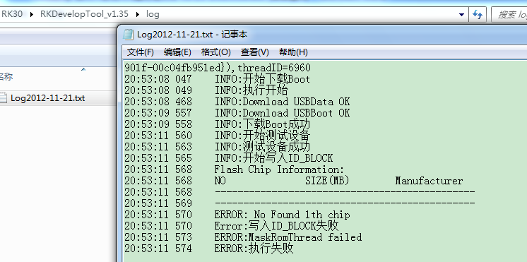
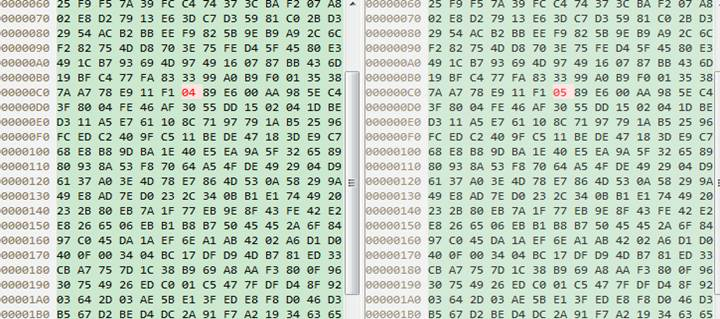
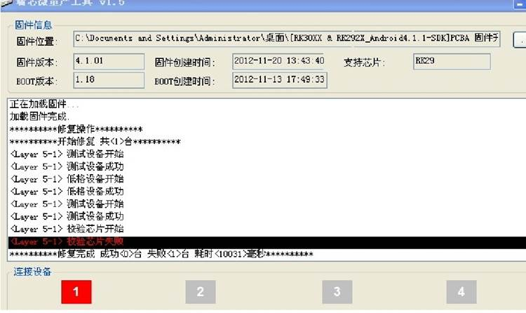
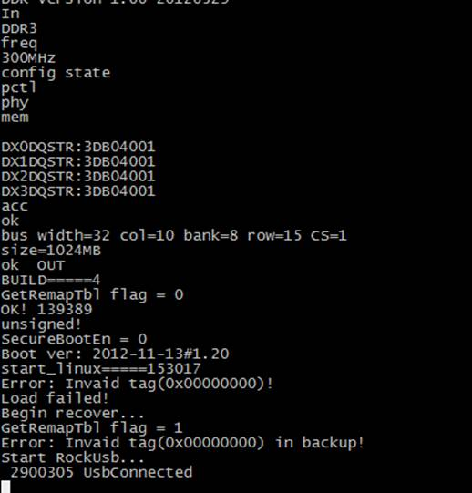
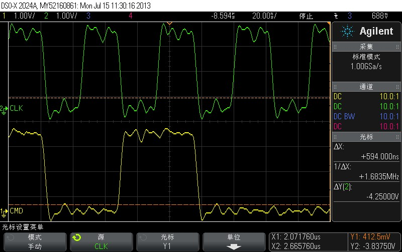
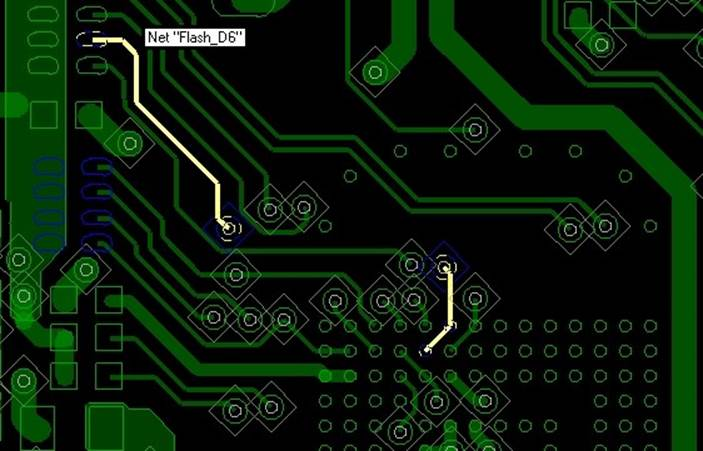
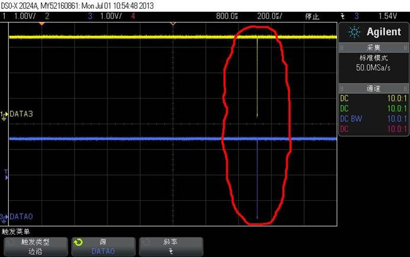
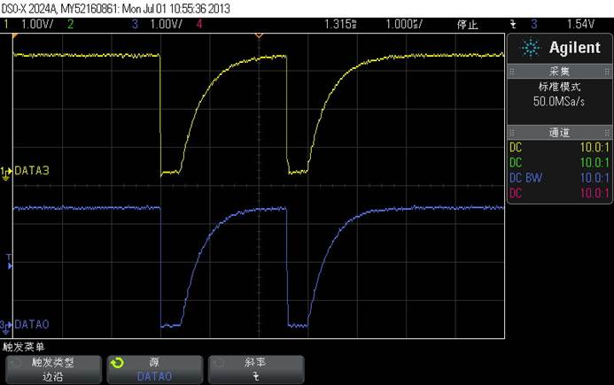
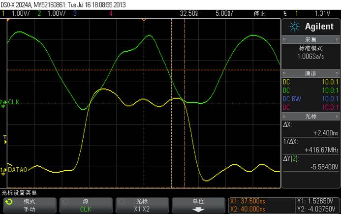

# RK固件升级失败原因分析

发布版本： 1.2

作者邮箱：zyf@rock-chips.com

发布日期：2017/10/18

文件密级：公开资料

| 版本          | 日期         | 描述          | 作者   | 审核   |
| ----------- | ---------- | ----------- | ---- | ---- |
| Version 1.0 | 2010-07-27 | 初版          | 赵仪峰  |      |
| Version 1.1 | 2012-11-22 | 重新整理并增加更多信息 | 赵仪峰  |      |
| Version 1.2 | 2017-10-18 | 增加EMMC等出错分析 | 赵仪峰  |      |

---
[TOC]
---

## 1.  概述

工厂和工程师经常会遇到固件升级失败的问题，为了方便查找问题，本文档整理了一些常见的问题和分析建议。

由于工具一直在更新，本文档的描述的信息可能和工具提示的信息不会完全一样，不过同一种类型的问题，提示信息应该是相似的。

## 2.  常见问题及分析

### **2.1.  **Boot Code下载失败

量厂工具提示信息：

开发工具提示：

量产工具log目录下log文件提示：

开发工具log目录下log文件提示：

出现这种问题可能的原因：

1. USB信号不好
2. 主控虚焊或者电源问题
3. DDR相关问题
4. 供电不足
5. 机器启用secureboot后，升级的固件为非签名固件

排查问题的办法：

1. 使用DDR测试工具测试DDR是否有焊接问题。
2. 使用质量好的短的USB2.0的USB线，并连接在PC机后面的USB口进行固件升级。
3. 检查USB线路上是否接的ESD器件，参数是不是不对。
4. 检查USB供电是否正常：电压和纹波。
5. USB走线是否和其他走线邻层平行。
6. 检查主控和usb相关部分的电阻和电容的参数是否正常。
7. 使用接外电源或者电池供电。
8. 启用secure boot的机器，需要升级对应签名的固件。

### **2.2. **下载Boot Code成功后测试设备失败

量厂工具提示：

开发工具提示：

量产工具log目录下log文件提示：

开发工具log目录下log文件提示：

出现这种问题可能的原因：

1. DDR颗粒问题或者DDR布板走线问题（概率比较大）。
2. USB信号不好。
3. Uboot下打包的miniloader时使用的usbplug错误。

排查问题的办法：

1. 使用DDR测试工具测试DDR是否有焊接问题。
2. 分析PCB DDR走线部分，是否有不符合布板规范的走线。
3. 更换DDR颗粒
4. USB部分参考 [“2.1.Boot Code下载失败”处理办法](#_Boot_Code下载失败)。
5. 接串口分析打印信息，确定CPU运行到DDR还是usbplug

### **2.3. **准备IDB NAND FLASH 或者EMMC 焊接问题

量产工具提示准备IDB失败：

量产工具log目录下log文件提示：

开发工具提示写入ID_BLOCK失败：

开发工具log目录下log文件提示没有找到NAND FLASH,写入ID_BLOCK失败：

出现这种问题可能的原因：

1. NAND FLASH / EMMC没有焊好
2. 不支持的NAND FLASH
3. PCB板有问题
4. FLASH VCCQ供电不对
5. AP端FLASH SEL选择不对
6. 使用EMMC颗粒，CMD和D0没有接上拉电阻

排查问题的办法：

1. 重新焊接NAND FLASH或EMMC，排查PCB板。

2. 检查电路原理图和NAND FLASH的datasheet，确认NAND FLASH pin38是接对了 （Toshiba、Sandisk和Samsung的大部分flash都需要接vcc，其他flash没有要求）。

3. 不支持的NAND FLASH

   联系rockchip [fae@rock-chips.com](mailto:fae@rock-chips.com),更新最新的NAND FLASH驱动补丁，再查看补丁中的NANDFLASH支持列表，确认NAND FLASH是否支持。

4. 如果有串口，可以接串口来帮助分析焊接问题

   下面是正常的机器打印的串口信息，里面有打印FLASH ID.

   使用EMMC的机器，正常不会打印FLASH ID。

FLASH ID第一个byte 为厂家信息:

| ID   | 厂家                             |
| ---- | ------------------------------ |
| 2C   | Micron                         |
| AD   | Hynix                          |
| 45   | Sandisk                        |
| 89   | Intel                          |
| EC   | Samsung                        |
| 98   | Toshiba                        |
| 00   | 没有接NAND FLASH                  |
| FF   | 没有接NAND FLASH                  |
| 其他值  | NAND FLASH没有焊好或不支持的NAND FLASH。 |

Flash ID第二个byte 为容量信息，下表为常用容量的ID:

| ID             | 容量                             |
| -------------- | ------------------------------ |
| 75             | 32MB                           |
| 76             | 64MB                           |
| 78、79、F1、D1    | 128MB                          |
| DA、71          | 256MB                          |
| DC             | 512MB                          |
| D3、            | 1GB                            |
| D5、48          | 2GB                            |
| D7、68          | 4GB                            |
| D9、88、DE、3A、64 | 8GB                            |
| 3C、A8、84       | 16GB                           |
| 其他值            | NAND FLASH没有焊好或不支持的NAND FLASH。 |

下面列几种分析例子：

1. 打印信息如下，那么就是NAND FLASH没有焊好或者EMMC没有焊好。

2. 打印信息如下，只贴了两片NAND FLASH，但是系统却认到4片NAND FLASH，这种情况是是NAND FLASH CS没有焊好。

3. 打印信息如下，贴了两片NAND FLASH，系统也可以认到两片NANDFLASH的ID，但是ID是错误的，根据前面的表格，第一个字节是2c，是美光的NAND FLASH，第二个字节是8C，是错误的，正确的应该是88，可以确定是NAND FLASH没有焊好。

### **2.4.  **写入IDB失败

量产工具提示写入ID_BLOCK失败：

开发工具提示写入ID_BLOCK失败：

开发工具log目录下log提示比较出错：

量产工具log目录下log提示：

并且LOG目录中有几个bin文件：

用文件内容比较工具比较文件名前缀相同，后缀为“flash”和”file”的两个文件，例如比较：

下面这种情况，只有一个bits或者几个bits差异的，是DDR问题，参考“[2.2.下载BootCode成功后测试设备失败](#_下载Boot_Code成功后测试设备失败)”的处理方法。

下面这种情况，有非常多的bits不同，一般是NANDFLASH有问题，可以多升级几次固件看是否可以解决. 如果NAND FLASH电源纹波太大或者没有使用滤波电容，可能也会出现这个问题。

电源正常的情况下多次升级不能解决的，需要更换NAND FLASH解决。

### **2.5.  **下载固件失败

量产工具提示下载固件失败：

量产工具log目录下log提示WriteLBA failed，出错代码 (-3)：

量产工具log目录下log提示ReadLBA failed,出错代码 (-4)：

这两种情况，都是USB通讯中断了，参考“[2.1.Boot Code下载失败](#_Boot_Code下载失败)”处理办法。

量产工具log目录下log提示RKA_File_Check failed：

这种情况下log目下还会生成两个，一个是固件要写到flash的数据，一个是flash里面读出来错误 数据：

用文件内容比较工具比较这两个文件：

下面这种情况，只有一个bits或者几个bits差异的，是DDR问题，参考“[2.2.下载BootCode成功后测试设备失败](#_下载Boot_Code成功后测试设备失败)”的处理方法。

下面这种情况，有非常多的bits不同，一般是NANDFLASH有问题，可以先尝试用量产工具的方式升级固件，或者用开发工具后，再升级固件。

如果NAND FLASH电源纹波太大或者没有使用滤波电容，可能也会出现这个问题。

如果电源正常并重新升级不能解决问题，需要更换NAND FLASH解决问题。

**开发工具的提示及**log信息和量产工具的log类似，可以参考量产工具的情况处理。

### **2.6.  **校验芯片失败

量产工具在下载固件时提示校验芯片失败，这种问题一般都是固件选择错了，固件和芯片不匹配。在开发阶段，可能会是打包固件时参数配置错了。

开发工具不会校验芯片信息，如果升级了错误的固件会出现不开机或者进入固件升级模式，那么需要重新升级正确的固件解决。

上图的固件是rk30的，打包时参数配置错误，配置成RK29了。

解决办法：

打开文件mkupdate.bat，修改

修改RKImageMaker.exe芯片参数，给我“-RK30”.

更多详细的配置信息参考固件生成工具目录下的文档。

## 3. 其他问题

### **3.1. **升级固件完自动重启后还在升级模式

情况一、
用开发工具升级固件后，不开机，连接USB在在升级模式，串口信息提示如下：

这种情况，都是升级固件时，升级了misc.img，没有升级recovery.img引起的。

解决办法：

重新升级recovery.img或者往misc分区写入一个大于32KB的其他文件清除misc分区中的命令。

情况二、

RK3329、RK3368等平台，没有烧录trust.img的话也会出现升级后不能启动。

解决办法：升级对应的trust.img

### **3.2.  **使用EMMC的机器上电无法开机

这种问题一般出现在RK3188、PX3、PX2、RK3066和RK3168等平台上面。出现情况一般是升级完loader或者欲烧录固件的颗粒贴片后出现上电不开机问题。

解决方法：

1. 先查硬件原理图和版图。CMD,DATA0-DATA7都要上拉，上拉电阻建议10K。检查上拉电阻是否虚焊。PCB版图上EMMC信号线不能通过连接NC脚走线。

2. 用示波器测量上电时序。 CMD信号与 EMMC的VCCQ最好一起上电，如下图所示。若CMD 线迟于VCCQ上电， 部分EMMC将无法引导开机。

3. 用示波器测量CMD 、CLK线上是否有毛刺。如果有毛刺，部分EMMC 将无法引导开机。如下图所示。目前发现在RK3066 + TI的PMU会有此毛刺。解决方法是改变上电时序。

4. 用示波器测量CMD 、CLK、DATA线上过冲是否严重，可考虑接串联电阻匹配。下图中CLK 振铃较大可能引起逻辑错误。

5. 用示波器测量电源VCC纹波是否过大，可考虑接滤波电容。
6. 使用欲烧录方式升级的，确认一下"EXT CSD"是否被配置错误了。

EXT CSD配置情况：

179 配置 0x08, 从boot1启动，不使用ACK；

167 位置为0x1F；

162 配置0x01, 启用reset pin；

其他全部不能做配置，使用默认值。

如果是RK312X、RK3228、RK3366、RK3288、RK3399等比较新的主控出现升级固件后机器开机还停留在MASKROM升级模式，那么问题一般都是EMMC D0-D7有个别数据线没有接对。

### **3.3.  **使用EMMC的机器，复位无法开机问题

解决方法：

l  确认是用主控的EMMC_PWEN 连到 EMMC 的RTS_n脚。

l  欲烧录固件时，主控是RK3188、PX3、PX2、RK3066和RK3168，确认EXTCSD 162 配置为0x01。

### **3.4.  **使用EMMC时开机到运行到LOADER很慢的问题

原因是BOOTROM启动时进入NAND FLASH探测模式了，大约需要几秒时间。

解决方法：

1. 先查硬件原理图和版图。CMD, DATA0-DATA7都要上拉，上拉电阻建议10K。检查上拉电阻是否虚焊。PCB版图上EMMC信号线不能通过连接NC脚走线。下图是某客户通过NC脚链接到EMMC的DATA6,导致开机慢的PCB图。

（2）用示波器测量DATO-DATA7。在上电过程中DATA线的上升时间必须小于2us。如下图所示。图2是图1红色椭圆处波形展开，图2中DATA线的上升时间需小于2us。

图1

图2

### **3.5.  **使用EMMC的机器在Android 运行读写报错问题

问题的原因：

1. VCC 或者VCCQ供电不足，运行时出现电源塌陷
2. 走线不合理，干扰严重

解决方法：

(1)检查EMMC电源是否是受到外部干扰，如WIFI开启。建议EMMC独立供电。

(2)用示波器测量 Bus timing 是否符合要求。下图是DDR模式，CLK下降沿采样 Holdtime 时间不够，可能引起逻辑错误的案例。

### **3.6.  **EMMC功耗问题

EMMC 有读写操作时，电流在100-300mA。 待机时，100-700uA。

功耗相关的因素：速度模式、EMMC频率、EMMC容量、接口电压、温度、厂商工艺、上拉电阻大小。下图是某型号EMMC典型参考功耗。

