# RK 固件升级失败原因分析

文件标识：RK-PC-YF-182

发布版本：V1.2.1

日期：2021-05-24

文件密级：□绝密   □秘密   □内部资料   ■公开

**免责声明**

本文档按“现状”提供，瑞芯微电子股份有限公司（“本公司”，下同）不对本文档的任何陈述、信息和内容的准确性、可靠性、完整性、适销性、特定目的性和非侵权性提供任何明示或暗示的声明或保证。本文档仅作为使用指导的参考。

由于产品版本升级或其他原因，本文档将可能在未经任何通知的情况下，不定期进行更新或修改。

**商标声明**

“Rockchip”、“瑞芯微”、“瑞芯”均为本公司的注册商标，归本公司所有。

本文档可能提及的其他所有注册商标或商标，由其各自拥有者所有。

**版权所有 © 2021 瑞芯微电子股份有限公司**

超越合理使用范畴，非经本公司书面许可，任何单位和个人不得擅自摘抄、复制本文档内容的部分或全部，并不得以任何形式传播。

瑞芯微电子股份有限公司

Rockchip Electronics Co., Ltd.

地址：     福建省福州市铜盘路软件园A区18号

网址：     [www.rock-chips.com](http://www.rock-chips.com)

客户服务电话： +86-4007-700-590

客户服务传真： +86-591-83951833

客户服务邮箱： [fae@rock-chips.com](mailto:fae@rock-chips.com)

---

**前言**

**概述**

工厂和工程师经常会遇到固件升级失败的问题，为了方便查找问题，本文档整理了一些常见的问题和分析建议。

由于工具一直在更新，本文档的描述的信息可能和工具提示的信息不会完全一样，不过同一种类型的问题，提示信息应该是相似的。

**产品版本**

| **芯片名称** | **内核版本** |
| ------------ | ------------ |
| ALL          | ALL          |

**读者对象**

本文档（本指南）主要适用于以下工程师：

技术支持工程师

软件开发工程师

**修订记录**

| **版本号** | **作者** | **修改日期** | **修改说明**           |
| ---------- | -------- | ------------ | ---------------------- |
| V1.0.0     | 赵仪峰   | 2010-07-27   | 初始版本               |
| V1.1.0     | 赵仪峰   | 2012-11-22   | 重新整理并增加更多信息 |
| V1.2.0     | 赵仪峰   | 2017-10-18   | 增加 EMMC 等出错分析   |
| V1.2.1     | 黄莹     | 2021-05-24   | 修改格式               |

---

**目录**

[TOC]

---

## 常见问题及分析

### Boot Code 下载失败

量厂工具提示信息：

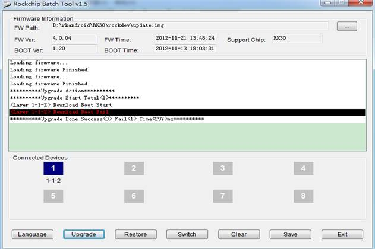

开发工具提示：

量产工具 log 目录下 log 文件提示：

开发工具 log 目录下 log 文件提示：

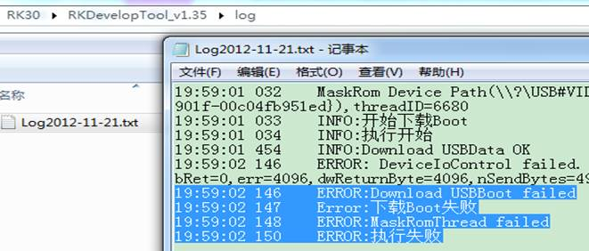

出现这种问题可能的原因：

1. USB 信号不好
2. 主控虚焊或者电源问题
3. DDR 相关问题
4. 供电不足
5. 机器启用 secureboot 后，升级的固件为非签名固件

排查问题的办法：

1. 使用 DDR 测试工具测试 DDR 是否有焊接问题。
2. 使用质量好的短的 USB2.0 的 USB 线，并连接在 PC 机后面的 USB 口进行固件升级。
3. 检查 USB 线路上是否接的 ESD 器件，参数是不是不对。
4. 检查 USB 供电是否正常：电压和纹波。
5. USB 走线是否和其他走线邻层平行。
6. 检查主控和 usb 相关部分的电阻和电容的参数是否正常。
7. 使用接外电源或者电池供电。
8. 启用 secure boot 的机器，需要升级对应签名的固件。

### 下载 Boot Code 成功后测试设备失败

量厂工具提示：

开发工具提示：

量产工具 log 目录下 log 文件提示：

开发工具 log 目录下 log 文件提示：

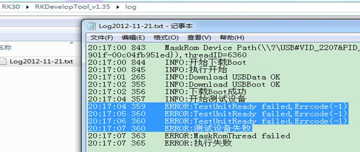

出现这种问题可能的原因：

1. DDR 颗粒问题或者 DDR 布板走线问题（概率比较大）。
2. USB 信号不好。
3. Uboot 下打包的 miniloader 时使用的 usbplug 错误。

排查问题的办法：

1. 使用 DDR 测试工具测试 DDR 是否有焊接问题。
2. 分析 PCB DDR 走线部分，是否有不符合布板规范的走线。
3. 更换 DDR 颗粒
4. USB 部分参考“ [1.1 Boot Code 下载失败](#_Boot_Code下载失败)”处理办法。
5. 接串口分析打印信息，确定 CPU 运行到 DDR 还是 usbplug

### 准备 IDB NAND FLASH 或者 EMMC 焊接问题

量产工具提示准备 IDB 失败：

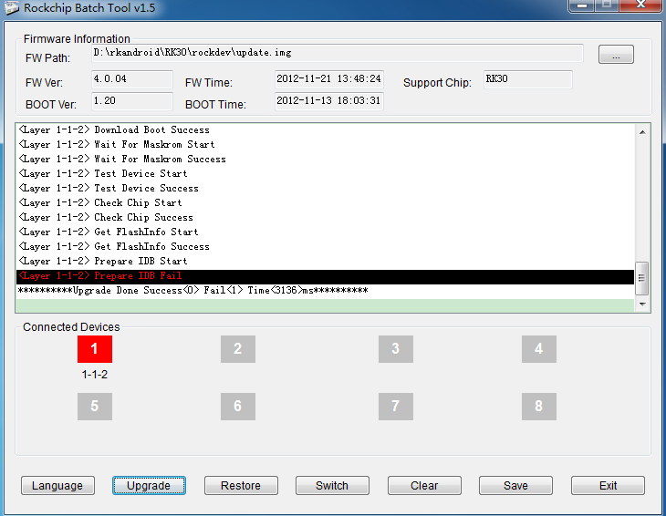

量产工具 log 目录下 log 文件提示：

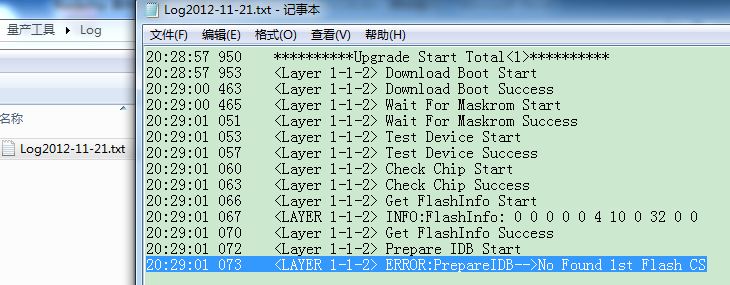

开发工具提示写入 ID_BLOCK 失败：

开发工具 log 目录下 log 文件提示没有找到 NAND FLASH,写入 ID_BLOCK 失败：

出现这种问题可能的原因：

1. NAND FLASH / EMMC 没有焊好
2. 不支持的 NAND FLASH
3. PCB 板有问题
4. FLASH VCCQ 供电不对
5. AP 端 FLASH SEL 选择不对
6. 使用 EMMC 颗粒，CMD 和 D0 没有接上拉电阻

排查问题的办法：

1. 重新焊接 NAND FLASH 或 EMMC，排查 PCB 板。

2. 检查电路原理图和 NAND FLASH 的 datasheet，确认 NAND FLASH pin38 是接对了 （Toshiba、Sandisk 和 Samsung 的大部分 flash 都需要接 vcc，其他 flash 没有要求）。

3. 不支持的 NAND FLASH

   联系 rockchip [fae@rock-chips.com](mailto:fae@rock-chips.com),更新最新的 NAND FLASH 驱动补丁，再查看补丁中的 NANDFLASH 支持列表，确认 NAND FLASH 是否支持。

4. 如果有串口，可以接串口来帮助分析焊接问题

   下面是正常的机器打印的串口信息，里面有打印 FLASH ID.

   使用 EMMC 的机器，正常不会打印 FLASH ID。

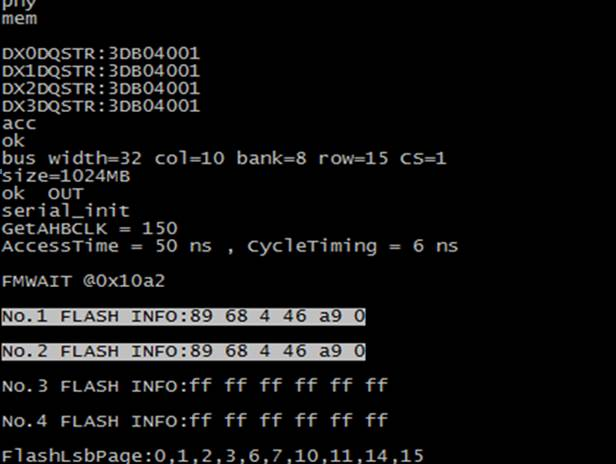

FLASH ID 第一个 byte 为厂家信息:

| ID   | 厂家                             |
| ---- | ------------------------------ |
| 2C   | Micron                         |
| AD   | Hynix                          |
| 45   | Sandisk                        |
| 89   | Intel                          |
| EC   | Samsung                        |
| 98   | Toshiba                        |
| 00   | 没有接 NAND FLASH                  |
| FF   | 没有接 NAND FLASH                  |
| 其他值  | NAND FLASH 没有焊好或不支持的 NAND FLASH。 |

Flash ID 第二个 byte 为容量信息，下表为常用容量的 ID:

| ID             | 容量                             |
| -------------- | ------------------------------ |
| 75             | 32MB                           |
| 76             | 64MB                           |
| 78、79、F1、D1    | 128MB                          |
| DA、71          | 256MB                          |
| DC             | 512MB                          |
| D3、            | 1GB                            |
| D5、48          | 2GB                            |
| D7、68          | 4GB                            |
| D9、88、DE、3A、64 | 8GB                            |
| 3C、A8、84       | 16GB                           |
| 其他值            | NAND FLASH 没有焊好或不支持的 NAND FLASH。 |

下面列几种分析例子：

1. 打印信息如下，那么就是 NAND FLASH 没有焊好或者 EMMC 没有焊好。

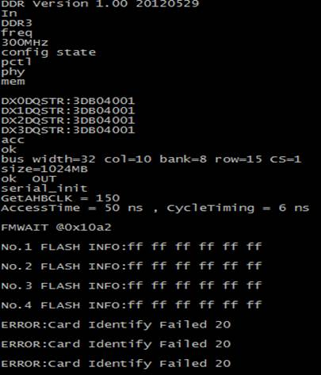

2. 打印信息如下，只贴了两片 NAND FLASH，但是系统却认到 4 片 NAND FLASH，这种情况是是 NAND FLASH CS 没有焊好。

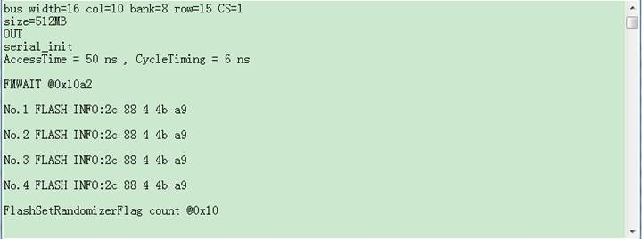

3. 打印信息如下，贴了两片 NAND FLASH，系统也可以认到两片 NANDFLASH 的 ID，但是 ID 是错误的，根据前面的表格，第一个字节是 2c，是美光的 NAND FLASH，第二个字节是 8C，是错误的，正确的应该是 88，可以确定是 NAND FLASH 没有焊好。

### 写入 IDB 失败

量产工具提示写入 ID_BLOCK 失败：

开发工具提示写入 ID_BLOCK 失败：

开发工具 log 目录下 log 提示比较出错：

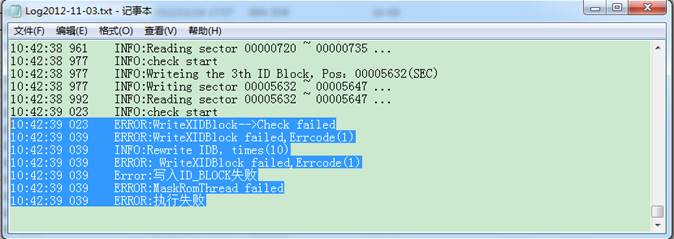

量产工具 log 目录下 log 提示：

并且 LOG 目录中有几个 bin 文件：

用文件内容比较工具比较文件名前缀相同，后缀为“flash”和”file”的两个文件，例如比较：

下面这种情况，只有一个 bits 或者几个 bits 差异的，是 DDR 问题，参考“[1.2 下载 BootCode 成功后测试设备失败](#_下载Boot_Code成功后测试设备失败)”的处理方法。

下面这种情况，有非常多的 bits 不同，一般是 NANDFLASH 有问题，可以多升级几次固件看是否可以解决. 如果 NAND FLASH 电源纹波太大或者没有使用滤波电容，可能也会出现这个问题。

电源正常的情况下多次升级不能解决的，需要更换 NAND FLASH 解决。

### 下载固件失败

量产工具提示下载固件失败：

量产工具 log 目录下 log 提示 WriteLBA failed，出错代码 (-3)：

量产工具 log 目录下 log 提示 ReadLBA failed,出错代码 (-4)：

这两种情况，都是 USB 通讯中断了，参考"[1.1 Boot Code 下载失败](#_Boot_Code下载失败)”处理办法。

量产工具 log 目录下 log 提示 RKA_File_Check failed：

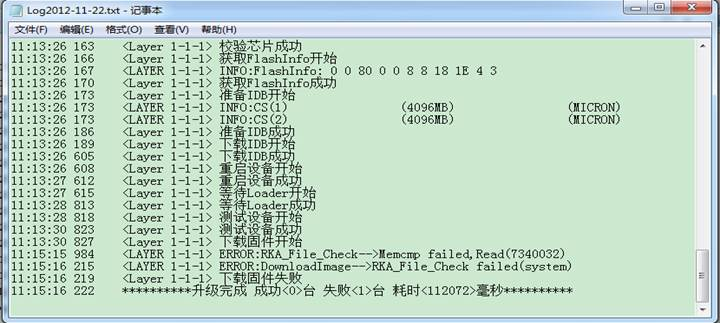

这种情况下 log 目下还会生成两个，一个是固件要写到 flash 的数据，一个是 flash 里面读出来错误 数据：

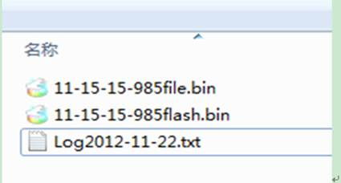

用文件内容比较工具比较这两个文件：

下面这种情况，只有一个 bits 或者几个 bits 差异的，是 DDR 问题，参考“[1.2 下载 BootCode 成功后测试设备失败](#_下载Boot_Code成功后测试设备失败)”的处理方法。

下面这种情况，有非常多的 bits 不同，一般是 NANDFLASH 有问题，可以先尝试用量产工具的方式升级固件，或者用开发工具后，再升级固件。

如果 NAND FLASH 电源纹波太大或者没有使用滤波电容，可能也会出现这个问题。

如果电源正常并重新升级不能解决问题，需要更换 NAND FLASH 解决问题。

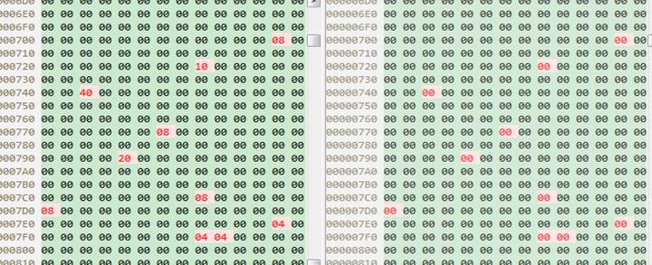

**开发工具的提示及**log 信息和量产工具的 log 类似，可以参考量产工具的情况处理。

### 校验芯片失败

量产工具在下载固件时提示校验芯片失败，这种问题一般都是固件选择错了，固件和芯片不匹配。在开发阶段，可能会是打包固件时参数配置错了。

开发工具不会校验芯片信息，如果升级了错误的固件会出现不开机或者进入固件升级模式，那么需要重新升级正确的固件解决。

上图的固件是 rk30 的，打包时参数配置错误，配置成 RK29 了。

解决办法：

打开文件 mkupdate.bat，修改

修改 RKImageMaker.exe 芯片参数，给我“-RK30”.

更多详细的配置信息参考固件生成工具目录下的文档。

## 其他问题

### 升级固件完自动重启后还在升级模式

情况一、
用开发工具升级固件后，不开机，连接 USB 在在升级模式，串口信息提示如下：

这种情况，都是升级固件时，升级了 misc.img，没有升级 recovery.img 引起的。

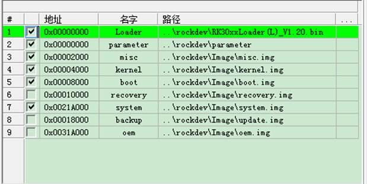

解决办法：

重新升级 recovery.img 或者往 misc 分区写入一个大于 32KB 的其他文件清除 misc 分区中的命令。

情况二、

RK3329、RK3368 等平台，没有烧录 trust.img 的话也会出现升级后不能启动。

解决办法：升级对应的 trust.img

### 使用 EMMC 的机器上电无法开机

这种问题一般出现在 RK3188、PX3、PX2、RK3066 和 RK3168 等平台上面。出现情况一般是升级完 loader 或者欲烧录固件的颗粒贴片后出现上电不开机问题。

解决方法：

1. 先查硬件原理图和版图。CMD,DATA0-DATA7 都要上拉，上拉电阻建议 10K。检查上拉电阻是否虚焊。PCB 版图上 EMMC 信号线不能通过连接 NC 脚走线。

2. 用示波器测量上电时序。 CMD 信号与 EMMC 的 VCCQ 最好一起上电，如下图所示。若 CMD 线迟于 VCCQ 上电， 部分 EMMC 将无法引导开机。

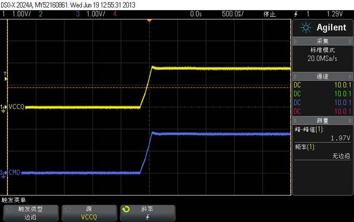

3. 用示波器测量 CMD 、CLK 线上是否有毛刺。如果有毛刺，部分 EMMC 将无法引导开机。如下图所示。目前发现在 RK3066 + TI 的 PMU 会有此毛刺。解决方法是改变上电时序。

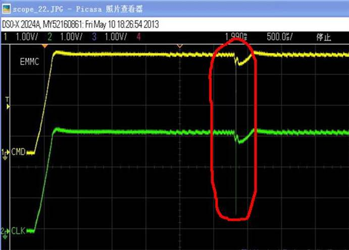

4. 用示波器测量 CMD 、CLK、DATA 线上过冲是否严重，可考虑接串联电阻匹配。下图中 CLK 振铃较大可能引起逻辑错误。

5. 用示波器测量电源 VCC 纹波是否过大，可考虑接滤波电容。
6. 使用欲烧录方式升级的，确认一下"EXT CSD"是否被配置错误了。

EXT CSD 配置情况：

179 配置 0x08, 从 boot1 启动，不使用 ACK；

167 位置为 0x1F；

162 配置 0x01, 启用 reset pin；

其他全部不能做配置，使用默认值。

如果是 RK312X、RK3228、RK3366、RK3288、RK3399 等比较新的主控出现升级固件后机器开机还停留在 MASKROM 升级模式，那么问题一般都是 EMMC D0-D7 有个别数据线没有接对。

### 使用 EMMC 的机器，复位无法开机问题

解决方法：

l  确认是用主控的 EMMC_PWEN 连到 EMMC 的 RTS_n 脚。

l  欲烧录固件时，主控是 RK3188、PX3、PX2、RK3066 和 RK3168，确认 EXTCSD 162 配置为 0x01。

### 使用 EMMC 时开机到运行到 LOADER 很慢的问题

原因是 BOOTROM 启动时进入 NAND FLASH 探测模式了，大约需要几秒时间。

解决方法：

1. 先查硬件原理图和版图。CMD, DATA0-DATA7 都要上拉，上拉电阻建议 10K。检查上拉电阻是否虚焊。PCB 版图上 EMMC 信号线不能通过连接 NC 脚走线。下图是某客户通过 NC 脚链接到 EMMC 的 DATA6,导致开机慢的 PCB 图。

（2）用示波器测量 DATO-DATA7。在上电过程中 DATA 线的上升时间必须小于 2us。如下图所示。图 2 是图 1 红色椭圆处波形展开，图 2 中 DATA 线的上升时间需小于 2us。

图 1

图 2

### 使用 EMMC 的机器在 Android 运行读写报错问题

问题的原因：

1. VCC 或者 VCCQ 供电不足，运行时出现电源塌陷
2. 走线不合理，干扰严重

解决方法：

(1)检查 EMMC 电源是否是受到外部干扰，如 WIFI 开启。建议 EMMC 独立供电。

(2)用示波器测量 Bus timing 是否符合要求。下图是 DDR 模式，CLK 下降沿采样 Holdtime 时间不够，可能引起逻辑错误的案例。

### EMMC 功耗问题

EMMC 有读写操作时，电流在 100-300mA。 待机时，100-700uA。

功耗相关的因素：速度模式、EMMC 频率、EMMC 容量、接口电压、温度、厂商工艺、上拉电阻大小。下图是某型号 EMMC 典型参考功耗。

