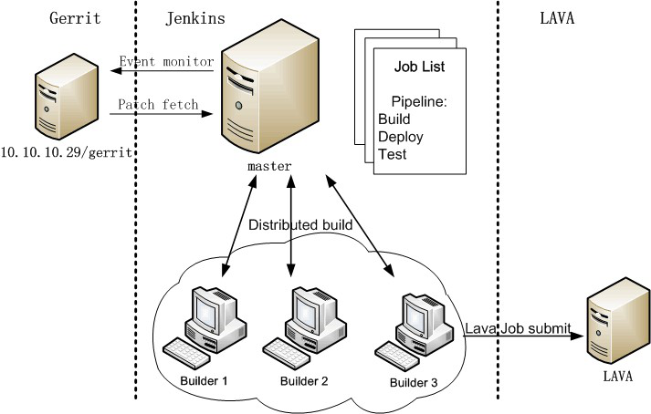
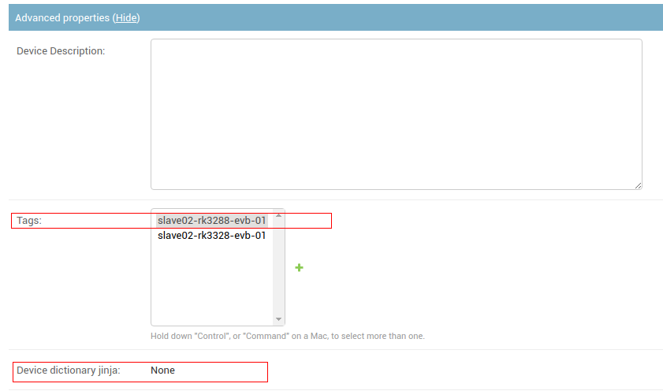
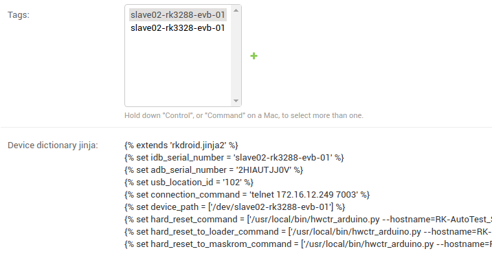
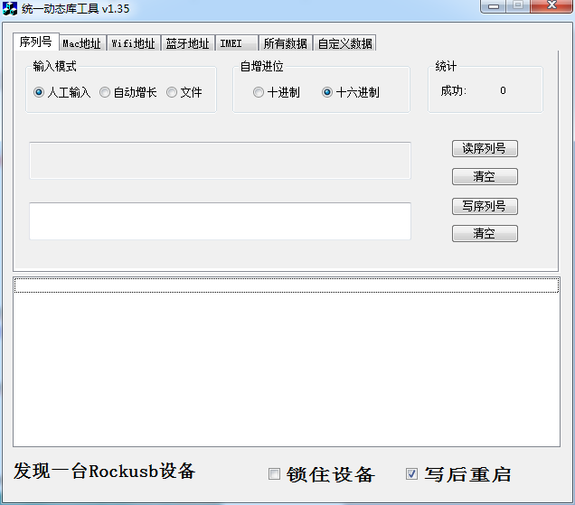

# Chameleon项目文档

发布版本：1.0

文件密级：内部资料

------

**前言**

**概述**

​	Chameleon项目各个环节的详细文档。

**读者对象**

本文档（本指南）主要适用于以下工程师：

SDK维护工程师
测试工程师
软件开发工程师

**产品版本**

**修订记录**

| **日期**     | **版本** | **作者** | **修改说明** |
| ---------- | ------ | ------ | -------- |
| 2018-10-09 | V1.0   | 杨凯    | 初始版本     |

------

[TOC]

------

# 一 Chameleon项目简介


## 1.1 CI自动化测试系统简介

Rockchip的开发模式, 是采用common的BSP, 大部分通用芯片共用kernel, U-Boot, Trust等模块, 一般由同一组人维护, 硬件芯片端会支持十几款芯片和更多的板子, 软件OS端需要支持不同版本的Linux, Android OS,  对于系统可用性, 兼容性, 稳定性, 性能等各方面都是比较大的挑战. Chameleon项目是利用LAVA, Jenkins, Gerrit对系统持续集成进行自动化测试的一个系统, 系统能保证BSP的各个模块, 在日常开发过程中, 做尽量多的验证, 提高整体代码质量. 整体框图如下：


gerrit server：10.10.10.29
jenkins server：10.10.10.29
jenkins slave/builder： kernel builder, 172.16.12.246, 127.16.12.247, 172.16.12.248
lava server： 172.16.10.254
lava client/worker： 172.16.12.246, 127.16.12.247, 172.16.12.248
另有开发用lava系统:
lava-dev server: 172.16.12.245
lava-dev worker: 172.16.12.244

## 1.2 Jenkins简介
Jenkins 是始于Hudson的一个持续集成工具, 下图是一个通用的开发流程.

流程说明:
1. 开发工程师从服务器获取最新代码；
2. 本地修改代码后, 把patch通过git commit推送到Gerrit供review；
3. Jenkins监测到新的提交, 自动出发任务, 把gerrit的提交cherry pick下来；
4. Jenkins进行Build验证, 如果没有LAVA, 通常是按脚本要求进行全面build;
5. Jenkins把验证结果返回Gerrit, 得到一个Jenkins Verify +/- 1的comment；
6. Reviewer查看Gerrit上的代码和jenkins验证结果对patch进行review;
7. 代码reveiw通过后, Reviewer把patch合并到git code base.

下图是Gerrit/Jenkins/LAVA在RK系统的实际部署情况, 其中在Jenkins builder进行验证的时候,会发送job给Lava在实际的硬件板上进行测试.


## 1.3 LAVA简述

Linaro Automation and Validation Architecture(LAVA)是由Linaro开发的一个自动验证系统, 结合Gerrit, Jenkins可以形成一个完整的持续集成(CI)自动测试系统.

LAVA是C/S架构, 可以使用一主多从或多主多从的架构. Server端负责接收任务, 调度job,结果存储和显示, 主要包含:
- LAVA Master daemon, 负责监听XMLRPC的job请求和device端ZMQ交互信息；
- LAVA Scheduler, 负责把任务分配给对应的device和worker；
- LAVA dashboard, 负责把结果进行web显示；

Slave端在LAVA里面也叫Worker, 主要是:
- Slave daemon, 用于跟Server Daemon进行交互, 接收任务并返回结果；
- Dispatcher, 负责把job分解后分布执行, 我们依据自己平台需求修改的内容主要集中在这部分.


LAVA运行的HOST推荐的系统是Debian, 参考http://172.16.10.254/static/docs/v2/installing_on_debian.html.
Dispatcher的流程可参考: http://172.16.10.254/static/docs/v2/dispatcher-design.html

## 1.4 Chameleon项目内容

### 1.4.1 主要目标
- 硬件开发板需要连接所有正在维护的SDK对应的SDK板和市场上流行的开发板, 形成一个云验证平台, 顺便解决工程师硬件环境搭建难的问题；
  日常内部SDK/patch维护(gerrit review), 系统能解决RK发布的SDK所用的主线代码, 处于持续可用状态, 顺便解决工程师在解决非当前开发SDK的软件环境搭建难的问题；
- 内部u-boot/kernel代码版本升级, 直接在全套硬件集合验证升级后的代码可用性;
- upstream u-boot/kernel mainline可用性维护
- 品质批量测试可自动化部分

### 1.4.2 主要测试项
Boot测试,(u-boot, kernel, trust, system), 用于gerrit代码patch review
	能启动到shell, android为adb连接

Smoke testing(基础功能测试), 考虑合并到Boot测试中
    基于U-Boot, kernel shell进行测试, 涵盖大部分可测模块的基础功能,
    U-Boot:
        网络, EMMC, SD, NAND, SPI, U盘,
        显示, 充电, 按键, PMIC
        fastboot, rockusb,
        android, rockchip, linux固件引导
    kernel:
        显示, HDMI/
        音频
        视频
        USB device/host
        CPU调频调压
        网络/wifi/wlan
        storage读写

以下测试大部分需要基于OS,用于周期性(按天或者周)SDK维护, Android大部分已经有了, Linux严重缺失

性能测试
    benchmark--gpu
    benchmark--cpu
    benchmark--mem bandwidth
    benchmark--antutu, geekbench...
    mmc/sd/nand读写速度
    usb 2.0/3.0读写速度

压力测试
    reboot测试
    待机唤醒测试
    monkey测试
    ddr变频测试
    ddr stress test
    usb拔插测试
    hdmi拔插测试
    应用拷机测试(音乐, 视频, 游戏, Camera, WiFi/BT)

功耗测试
    自定义场景的功耗测试(可配合bus, ddr带宽测试)

其他功能兼容性测试
    LFTP
    Android CTS
    视频格式兼容性测试
    显示分辨率兼容性测试
    OTA/Recovery测试
    Kernel模块自定义专项白盒测试

# 二 LAVA服务器搭建
参考https://validation.linaro.org/static/docs/v2/installing_on_debian.html

## 2.1 LAVA版本介绍

目前LAVA的版本比较多，官方网站主要有四个版本，具体区别如下：

| 版本                | 备注                                                       |
| ------------------- | ---------------------------------------------------------- |
| production-repo | 当前的release版本                                          |
| archive-repo        | 旧版本的备份，例如想用旧的v1版本时用得上                   |
| stretch-backports   | 针对debian stretch的backports版本，一般比release版本旧一点 |
| staging-repo        | 最新版本，可能会不太稳定                                   |

## 添加LAVA签名秘钥

```shell
$ wget https://images.validation.linaro.org/staging-repo/staging-repo.key.asc
$ sudo apt-key add staging-repo.key.asc
OK
$ sudo apt update
```

## 安装release版本

### 添加apt源

在/etc/apt/sources.list中添加如下apt源：

release版本

```shell
deb https://images.validation.linaro.org/production-repo stretch-backports main
```

然后执行如下命令：

```shell
$ sudo apt update
```

## 2.2 LAVA Server建立与配置
### 2.2.1 Debian安装LAVA Server


```shell
$ sudo apt install postgresql
$ sudo apt install lava-server
$ sudo a2dissite 000-default
$ sudo a2enmod proxy
$ sudo a2enmod proxy_http
$ sudo a2ensite lava-server.conf
$ sudo service apache2 restart
```

==注意：升级lava-server并不会覆盖其配置文件/etc/apache2/sites-available/lava-server.conf==

### 2.2.2 卸载lava-server

```shell
$ sudo apt autoremove postgresql lava-server
$ sudo a2dismod proxy_http
$ sudo a2dismod proxy
```

注意：如果要同时删除lava-server的一些配置，例如/etc/lava-server/settings.conf，则可以加上--purge选项，命令如下：

```shell
$ sudo apt --purge autoremove postgresql lava-server
```

### 2.2.3 lava-server配置

#### 修改时间域
LAVA默认显示使用的是UTC时间，需要修改为本地之间

```shell
vim /usr/lib/python3/dist-packages/lava_server/settings/common.py
#修改如下内容
TIME_ZONE = 'Asia/Shanghai'
USE_TZ = False
```

#### 允许http访问

编辑/etc/lava-server/settings.conf文件，添加如下配置：

```shell
"CSRF_COOKIE_SECURE": false,
"SESSION_COOKIE_SECURE": false
```

重启gunicorn让配置生效：

```shell
$ sudo service lava-server-gunicorn restart
```

### 2.2.4 检查部署

要检查前面的安装部署是否成功，可以运行如下命令：

```shell
$ sudo lava-server manage check --deploy
```

会得到类似如下输出：

```shell
System check identified some issues:

WARNINGS:
?: (security.W012) SESSION_COOKIE_SECURE is not set to True. Using a secure-only session cookie makes it more difficult for network traffic sniffers to hijack user sessions.
?: (security.W016) You have 'django.middleware.csrf.CsrfViewMiddleware' in your MIDDLEWARE_CLASSES, but you have not set CSRF_COOKIE_SECURE to True. Using a secure-only CSRF cookie makes it more difficult for network traffic sniffers to steal the CSRF token.

System check identified 2 issues (2 silenced).
```

可以看到有一个安全警告，这是我们之前启用http访问导致的，暂时可以不用管，如果没有其他错误，则代表部署成功。

### 2.2.5 添加superuser

部署成功后，首先要添加一个超级用户来管理这个LAVA服务，命令如下：

```shell
$ sudo lava-server manage createsuperuser --username cliff
```

这个命令会提示你输入email（用于密码重置）和passwd，之后你就可以通过访问http://ip_of_lava_server用这个账号登陆来实现大部分的管理功能。

### 2.2.6 添加base device_type
首先把我们自定义的device_type添加到server对应位置

	cp rkdroid.jinja2 /etc/lava-server/dispatcher-config/device-types/rkdroid.jinja2
然后使用命令注册device_type到数据库

	sudo lava-server manage device-types add rkdroid

### 2.2.7 LAVA Server Log
LAVA Server是由几个模块组成的，有各自的log
与lava-slave交互，并接收http请求的是master daemon, log是：
/var/log/lava-server/lava-master.log
scheduler模块的log是：
/var/log/lava-server/lava-scheduler.log
另外每个任务有自己独立的文件夹，目录是
/var/lib/lava-server/default/media/job-output/job-11424/


## 2.3 LAVA Worker建立与配置
为了进行完整的测试，需要LAVA Worker能够保证以下模块/组件能够正常工作：
独立账户，source code访问权限
静态IP
lava-dispatcher
LXC
辅助控制板操作
DUT串口
DUT ADB
RK下载工具
### 2.3.1 新增PC账户
Debian安装完成后，有一个默认用户，我们需要新建一个'lava'的用户，(Debian9默认不支持sudo)．
通过su命令登录到root；
使用如下命令安装sudo命令方便后续使用

	apt install sudo

添加用户并增加sudo权限，

	adduser lava
	passwd lava
	vim /etc/group #添加lava到sudo组

### 2.3.2 设置静态IP
Worker需要使用静态IP, 以便重启后能够通过同一个地址远程访问．修改/etc/network/interfaces文件，修改IP为静态IP

	#iface enp3s0 inet dhcp
	iface enp3s0 inet static
		address 172.16.12.245
		netmask 255.255.255.0
		gateway 172.16.12.1
		dns-nameservers 10.10.10.188 58.22.96.66
FIXME: 以上修改可以实现静态IP，但是无法产生正确的DNS server(查询/etc/resolv.conf)，最终通过UI按以上配置来设置network可以正常工作．

### 2.3.3 建立代码环境
安装各种需要用到的基础包

	sudo apt-get install vim apt-transport-https samba　git python-serial
	sudo apt-get install simg2img img2simg #android sparse 解包打包

在10.10.10.29 Gerrit新增lava用户，并上传lava公钥，
把lava私钥id_rsa放到lava Worker的lava用户目录

	cp id_rsa ~/.ssh/

代码中访问服务器时使用默认帐号，使代码更为通用，需要在不同设备设置默认帐号：

	vim ~/.ssh/config
	#加入以下内容(jenkins帐号user可以改为jenkins)
	host 10.10.10.29
	user lava
加入以上设置后，git clone代码时不需要带username，系统会默认使用以上user和对应的rsa key来认证．

### 2.3.4 安装dispatcher
由于Debian９默认的dispatcher包版本较旧，我们需要安装back-port版本获取最新的安装包．
/etc/apt/sources.list添加：

	deb http://http.debian.net/debian stretch-backports main
	deb https://images.validation.linaro.org/production-repo sid main
	wget https://images.validation.linaro.org/staging-repo/staging-repo.key.asc
	sudo apt-key add staging-repo.key.asc
	sudo apt-mark hold libcurl3-gnutls
	sudo apt-get install libcurl3-gnutls=7.38.0-4+deb8u4
	sudo apt-get update
其中linaro的production-repo用户获取部分linaro后续可能用到的包．

#### 安装官方dispatcher

	sudo apt-get -t stretch-backports install lava-dispatcher
#### 下载并安装rk修改后的dispatcher

	git clone ssh://10.10.10.29:29418/rk/lava-dispatcher
	cd lava-dispatcher
	sudo ./setup.py install
#### 配置LAVA服务器信息

	vim /etc/lava-dispatcher/lava-slave
	#配置如下信息
	MASTER_URL="tcp://172.16.12.245:5556"
	LOGGER_URL="tcp://172.16.12.245:5555"

	#如果主机名需要设置，编辑如下内容
	HOSTNAME="--hostname lava-slave07"

	#设置完成后重启服务
	sudo service lava-slave restart

#### 命令添加user token
首先需要在LAVA server网页添加相应的user和token，然后使用命令注册到数据库：

	sudo lava-tool auth-add http://jenkins:ui1qkdie7l9m6mlk1mg7sparajos5s11oiy0ecd32h4cesrthh82lr3b521ft368000toeu6ztm3y0lp3pbq7q3kaq4x2qec6im9yyull03iunn20kw2dc33u3qu1mz7@172.16.12.245/RPC2

#### lava-slave log
可以通过lava-slave的log查询dispatcher是否工作正常

	/var/log/lava-dispatcher/lava-slave.log
	#正常启动log
	2018-10-15 17:14:34,027    INFO [INIT] LAVA slave has started.
	2018-10-15 17:14:34,028    INFO [INIT] Using protocol version 3
	2018-10-15 17:14:34,028   DEBUG [INIT] Connection is not encrypted
	2018-10-15 17:14:34,029    INFO [BTSP] Connecting to master [tcp://172.16.12.245:5556] as <lava-slave07>
	2018-10-15 17:14:34,029    INFO [BTSP] Greeting the master [tcp://172.16.12.245:5556] => 'HELLO'
	2018-10-15 17:14:34,029   DEBUG [BTSP] Checking master [172.16.12.245:5556] to create socket for lava-slave07
	2018-10-15 17:14:34,029   DEBUG [BTSP] socket IPv4 address: 172.16.12.245
	2018-10-15 17:14:34,030    INFO [BTSP] Connection with master [tcp://172.16.12.245:5556] established
	2018-10-15 17:14:34,030    INFO Master is ONLINE
	2018-10-15 17:14:39,036   DEBUG PING => master (last message 5s ago)
	2018-10-15 17:14:39,037   DEBUG master => PONG(20)
LAVA Master发送过来的LAVA job以及Job的完成情况，都可以通过这个log来查询．

### 2.3.5 安装LXC
####　Debian中安装LXC
Debian9直接使用默认包安装即可

	sudo apt-get install lxc
Debian8使用自行安装lxc　2.06时的注意事项:
- 安装路径使用`--prefix=`, 否则默认会使用`/usr/local'前缀, 与lava-dispatcher中写死的代码冲突
- 默认代码使用iproute时debian模板出错，参考如下代码修改为iproute2，fix后重新编译安装即可解决．
https://bugs.debian.org/cgi-bin/bugreport.cgi?bug=888788

#### LXC网络配置
修改网络设置, 使LXC内wget正常使用

	/etc/lxc/default.conf
	＃修改为如下内容
	lxc.network.type = none　＃原为empty

	# 修改后重启服务
	sudo /etc/init.d/lxc-net restart

#### 测试LXC
通过命令测试LXC是否正常工作，而且第一次运行时LXC会下载target到本地进行cache，在没有cache的情况下，lava运行job很可能会因为超时而失败．

	sudo lxc-create -t debian -n lxc-test-10894 -- --release sid --arch amd64 --mirror http://ftp2.cn.debian.org/debian/ --security-mirror http://ftp2.cn.debian.org/debian-security/

#### LXC Log
LXC的log目录：/var/log/lxc/

### 2.3.6 辅助控制接口
Linaro的设计是使用一个pduclient来对DUT进行一些物理信号控制，如power　on/off, reset等．我们这边直接使用python脚本来给硬件发送信号．
运行dispatcher之前需要先测试辅助的控制命令都可以工作．

#### 基于Arduino的RK TEST板
Arduino板子的固件烧写更新部分略．
Arduino板加上一块RK设计的控制电路，能操作2个三极管开关地路和一个GPIO输出，是通过串口交互控制，连到HOST PC后是ttyUSB设备，设备id有系统顺序分配，我们通过udev映射成固定的设备名．

	vim /etc/udev/rules.d/52-ttyUSB.rules
	SUBSYSTEM=="tty", ATTRS{idVendor}=="0403", ATTRS{serial}=="A50658Y6", MODE="0666", OWNER="rk",SYMLINK+="RK-AutoTest_Serial_A50658Y6"
	SUBSYSTEM=="tty", ATTRS{idVendor}=="0403", ATTRS{serial}=="A50659DV", MODE="0666", OWNER="rk",SYMLINK+="RK-AutoTest_Serial_A50659DV"

	#配置完成后重启服务
	sudo service udev restart
包含以上配置后，如果有个序列号为"A50658Y6"并且vendor也符合的串口设备接入PC，会在/dev/目录映射出一个设备"/dev/RK-AutoTest_Serial_A50658Y6".

测试时首先从device的dictionary提取命令，然后直接在本地运行命令确认控制信号是否符合预期．如：

	/usr/local/bin/hwctr_arduino.py --hostname=RK-AutoTest_Serial_A50659DV --port=A --command=reboot_to_maskrom

####　Chameleon板
介绍测试方法请参考第四章．

### 2.3.7 DUT串口支持
rockchip的DUT均有一个debug uart，用于系统全过程的debug信息输出，lava-dispatcher对DUT串口的支持，是首先将串口转换成一个网络端口设备，然后通过telnet进行访问．
####　udev配置
因为串口在Linux系统的设备名为/dev/ttyUSBn, 其中id n是根据设备接入时顺序生产的，所以一般来说都不固定，需要通过UDEV的rules把串口映射为一个固定的设备名

	vim /etc/udev/rules.d/52-ttyUSB.rules
	#　加入类似如下信息，主要是序列号和SYMLINK的名字需要匹配
	SUBSYSTEM=="tty", ATTRS{idVendor}=="0403", ATTRS{serial}=="A505N80X", MODE="0666", OWNER="lava",SYMLINK+="ttyUSB-rk3328-evb-01"
	# 配置完成后重启服务
	sudo service udev restart

####配置ser2net
ser2net是在安装lava-dispatcher时就已经自动安装了，我们只需要配置设备对应的端口即可

	vim /etc/ser2net.conf
	#添加类似如下信息，注意端口号不重复，波特率正确
	7001:telnet:0:/dev/ttyUSB-rk3328-evb-01:1500000 8DATABITS NONE 1STOPBIT
	7002:telnet:600:/dev/ttyUSB-rk3326-evb-01:1500000 8DATABITS NONE 1STOPBIT
	7003:telnet:600:/dev/ttyUSB-rk3288-evb-01:115200 8DATABITS NONE 1STOPBIT
	7004:telnet:600:/dev/ttyUSB-rk3399-evb-01:1500000 8DATABITS NONE 1STOPBIT

#### 修改device模板
把下面的信息加入到对应的设备模板中，如rk3328-evb的为：

	connection_command=telnet 172.16.12.249 7001
LAVA支持多个串口同时连接的模式，配置格式参考LAVA文档．

####　测试端口连接
可以用上面命令中的内容直接在shell中运行，测试是否可以连接，(前提是/dev/ttyUSB-rk3328-evb-01设备已出现)

	＃以下命令执行后就连接串口了
	telnet 172.16.12.249 7001

### 2.3.8 DUT ADB支持
#### 安装ADB
需要注意的是PC　host使用的adb和LXC里面使用的adb不是同一个位置的程序，最好保证这两个程序是同一个版本．
一个方法是从最新的Android SDK直接拷贝adb，另外可以

	# 从Debian官方源安装
	sudo apt install -t sid android-tools-adb
	# 从Google下载，含adb, fastboot等工具包
	wget https://dl.google.com/android/repository/platform-tools_r27.0.0-linux.zip

#### udev支持rk设备
需要通过修改udev rules来支持rockchip的相关设备

	vim /etc/udev/rules.d/51-android.rules
	# 增加如下内容
	SUBSYSTEM=="usb", ATTR{idVendor}=="2207", ATTR{idProduct}=="0006", MODE="0666", GROUP="plugdev"

	#配置完成后重启服务
	sudo service udev restart

####　测试adb设备
把rockchip带adb功能的设备连接到PC，然后运行adb命令测试设备

	adb devices
	adb reboot loader

### 2.3.9　upgrade_tool
我们使用Linux下的命令行工具upgrade_tool来作为LAVA测试系统的DUT固件下载工具，测试时先手动让设备进入maskrom模式或者loader模式，然后用命令测试是否可以正常烧写设备．

	upgrade_tool -s 201 td
	upgrade_tool -s 201 uf update.img

####　获取usb location id
usb location id是由upgrade_tool提供，并配合工具使用的，这个id是由设备所在的usb端口机器parent(hub)端口组合合成，在某个PC上是唯一的，如果拔插设备时换了一个USB端口，这个id会跟着变化．
把rockusb设备接入PC后，不带参数直接运行工具就可以列出设备的信息

	./upgrade_tool
	# 命令输出
	List of rockusb connected
	DevNo=1	Vid=0x2207,Pid=0x330c,LocationID=50604	Mode=Maskrom
	Found 1 rockusb,Select input DevNo,Rescan press <R>,Quit press <Q>:
其中LocationID就是我们要的usb location id.

# 三 Jenkins服务器搭建
## 3.1 Jenkins job配置
### Jenkins任务管理
Jenkins服务器的job使用jenkins-job-builder进行管理, 官方文档位于:

	https://docs.openstack.org/infra/jenkins-job-builder/
安装(实测Ubuntu 14.04上有问题, Debian 9正常)

	sudo apt install python-setuptools
	sudo easy_install pip
	sudo pip install PyYAML
	sudo pip install jinja2
	sudo pip install jenkins-job-builder

Rockchip内部使用独立的代码库进行jenkins任务管理

	ssh://10.10.10.29:29418/rk/jenkins-jobs

添加配置文件/etc/jenkins_jobs/jenkins_jobs.ini, (FIXME: 在Debian 9上~/.config/目录放配置文件无效, 不确定原因).

	[job_builder]
	ignore_cache=True
	keep_descriptions=False
	include_path=.:scripts:~/git/
	recursive=False
	exclude=.*:manual:./development
	allow_duplicates=False

	[jenkins]
	user=USER
	password=PWD
	url=https://10.10.10.29/jenkins
	query_plugins_info=False
	##### This is deprecated, use job_builder section instead
	#ignore_cache=True


提交job之前使用测试命令测试脚本是否合法:

	jenkins-jobs test rk-u-boot-next-dev-boot.yaml

更新配置命令

	PYTHONHTTPSVERIFY=0 jenkins-jobs update rk-u-boot-next-dev-boot.yaml

### Linaro jenkins job
Linaro的CI jenkins上有大量的验证job可参考，支持的系统有Android, Open Embeded(Yocto), Zepher等，除了本地代码，也有对Mainline kernel/u-boot的验证．

	# Jenkins地址：
	https://ci.linaro.org/
	# job config地址
	https://git.linaro.org/ci/job/configs.git
	# lkft任务的LAVA server dashboard
	https://lkft.validation.linaro.org

## 3.2 Jenkins builder配置
### 3.2.1 新增PC账户
PC添加jenkins用户，把jenkins的私钥放入~/.ssh/目录；
修改~/.ssh/config把访问10.10.10.29的user默认设置为jenkins；

### 3.2.2 Jenkins服务器新增builder结点
在Jenkins服务器添加builder，把用户根目录作为builder的$ROOT_DIR．

### 3.2.3 Jenkins builder环境
Jenkins　builder的环境就是保证所有需要在此builder上运行的程序，脚本均可以正常工作．
####　job目录
jenkins的每个Job都有一个独立的workspace, 其目录是builder根目录下的workspace目录新建一个以job命名的文件夹．如build-rk-u-boot-next-dev的workspace目录是:

	~/workspace/build-rk-u-boot-next-dev/

#### python库
调用LAVA job处理会使用jinja2,需要提前安装

	sudo pip install jinja2
	sudo pip install PyYaml
	sudo pip install pyelftools
	sudo pip install python-dev

#### 交叉编译工具
编译工具是提前从rk29部署好的，需要使用的job可以用链接的方式来获取编译工具的路径．

	mkdir -p ~/workspace/prebuilts/gcc/linux-x86/aarch64
	cd ~/workspace/prebuilts/gcc/linux-x86/aarch64
	git clone ssh://10.10.10.29:29418/rk/prebuilts/gcc-linaro-6.3.1-2017.05-x86_64_aarch64-linux-gnu
	cd ..
	mkdir arm
	git clone ssh://10.10.10.29:29418/rk/prebuilts/gcc-linaro-6.3.1-2017.05-x86_64_arm-linux-gnueabihf

	＃需要使用编译工具的工程，可以使用如下命令获取prebuilts目录链接
	ln -s ~/workspace/prebuilts/ .

####　Kernel/U-Boot编译环境
Kernel/U-Boot编译依赖软件包

	sudo apt-get install git-core gnupg flex bison gperf build-essential zip curl zlib1g-dev gcc-multilib g++-multilib libc6-dev-i386 libssl-dev lib32ncurses5-dev x11proto-core-dev libx11-dev lib32z1-dev ccache libgl1-mesa-dev libxml2-utils xsltproc unzip device-tree-compiler swig liblz4-tool

#### Buildroot编译环境
Buildroot编译依赖软件包

	sudo apt install libfile-which-perl sed make binutils gcc g++ bash patch gzip bzip2 perl tar cpio python unzip rsync file bc libmpc3 git texinfo pkg-config cmake tree genext2fs
	sudo apt install time
另外需要用到repo，Debian9的源不包含，需使用从git仓库下载

编译过程会用到resize2fs程序，是位于/sbin的(如果安装ifconfig也一样)，而/sbin在Debian的非root用户的默认的$PATH是没有的，Ubuntu已经把(/usr/local/sbin:/usr/sbin:/sbin:)这几个都默认加入PATH了，所以需要在Debian中修改$PATH初始化文件:

	vim /etc/profile
	#非root用户原为
	/usr/local/bin:/usr/bin:/bin:/usr/local/games:/usr/games
	#修改为
	/usr/local/sbin:/usr/local/bin:/usr/sbin:/usr/bin:/sbin:/bin:/usr/games:/usr/local/games

#### Android 编译环境
如果需要编译Android, 需要安装如下安装包

	sudo apt-get install openjdk-8-jdk git-core gnupg flex bison gperf build-essential zip curl zlib1g-dev gcc-multilib g++-multilib libc6-dev-i386 lib32ncurses5-dev x11proto-core-dev libx11-dev lib32z-dev ccache libgl1-mesa-dev libxml2-utils xsltproc unzip bc lzop liblz4-tool

	sudo pip install pycryptodome

## 3.3 Apache2 HTTP 服务配置
Jenkins编译生成的固件, 统一通过一个HTTP服务器存放, 方便LAVA job获取使用.

安装

	sudo apt-get install apache2

配置

	sudo vim /etc/apache2/apache2.conf

配置apache2 http访问端口, 文件末尾加入如下内容:

	ServerName localhost:80

配置该服务使用的目录权限(目录修改为实际使用目录):

	<Directory /home/lava/http>
	        Options Indexes FollowSymLinks
	        AllowOverride None
	        Require all granted
	</Directory>

通过下面的文件配置服务访问的默认目录路径

	sudo vim /etc/apache2/sites-available/000-default.conf

找到DocumentRoot并把对应目录替换成实际使用目录, 如

	DocumentRoot /home/lava/http/

重启服务后, 可以通过HTTP访问目标IP

	sudo service apache2 restart


## 3.4 NFS配置
为了方便Jenkins的Artifact Deployer插件在编译完成后把固件放到固件服务器, 同时也可以用于U-Boot NFS root测试, 需要搭建NFS服务器.

### Server端
安装

	sudo apt install nfs-kernel-server

配置共享目录

	sudo vim /etc/exports
把需要共享的目录填入, 具体选项可通过(man exports)查询, 如

	/home/lava/http  172.16.12.*(rw,sync,no_subtree_check)

把共享目录设置为第三方可写, 方便上传文件:

	chmod o+w /home/lava/http

配置完后重启服务:

	sudo service nfs-kernel-server restart

确认NFS server已工作

	$ systemctl status nfs-kernel-server
	● nfs-server.service - NFS server and services
	   Loaded: loaded (/lib/systemd/system/nfs-server.service; enabled; vendor preset: enabled)
	   Active: active (exited) since Tue 2018-10-09 15:43:50 HKT; 1min 31s ago
	  Process: 4605 ExecStopPost=/usr/sbin/exportfs -f (code=exited, status=0/SUCCESS)
	  Process: 4602 ExecStopPost=/usr/sbin/exportfs -au (code=exited, status=0/SUCCESS)
	  Process: 4600 ExecStop=/usr/sbin/rpc.nfsd 0 (code=exited, status=0/SUCCESS)
	  Process: 4622 ExecStart=/usr/sbin/rpc.nfsd $RPCNFSDARGS (code=exited, status=0/SUCCESS)
	  Process: 4619 ExecStartPre=/usr/sbin/exportfs -r (code=exited, status=0/SUCCESS)
	 Main PID: 4622 (code=exited, status=0/SUCCESS)
	      CPU: 4ms


### Client端
安装

	sudo apt install nfs-common

测试是否可以挂载NFS目录

	mount -t nfs NFS-SERVER-IP:/var/nfs-export /mnt/nfs/

通过修改/etc/fstab, 增加如下信息, 使系统开机自动挂载NFS结点

	# NFS
	172.16.12.248:/home/lava/http /mnt/nfs/			nfs defaults,_rnetdev	1	1

# 四 Chameleon硬件辅助板
## 4.1 硬件资源
## 4.2 软件系统
## 4.3 通讯协议
## 4.3 dispatcher控制接口
# 五 添加DUT
每个DUT都有独立的硬件接口，通过USB(ADB), debug uart, wlan等与PC HOST进行交互，同时也有一组受辅助板控制的信号，如power on/off, reset等，所有这些硬件配置，均需要配置到LAVA系统让server可以找到设备，dispatcher可以操作设备．
## 5.1 Server Dashboard添加设备
打开Server Dashboard网页并登录，进入administration并打开Add device页，按需要填写信息，没有对应可选项可以直接添加, 添加新的项时注意按照实际情况填写架构，CPU核数量等信息，最重要的是命名请参考本节命名规范．


注意：
需要点开Advanced properties并添加与hostname同名的TAG
勾选"Is Public"以便所有用户都能提交任务到该设备．


以上信息填完，网页配置就完成了，此时的Device dictionary jinja状态是None, 需要使用命令更新dictionary.

###　命名规范
Device type 为  芯片名-产品形态，　如：

	rk3288-evb
	rk3399-excavator
	rk3128-box

Hostname 命名为 Worker Ｎame - 'device type'- 序号 中间没有空格，如:

	slave01-rk3288-evb-01

其中Worker Ｎame----截取DUT所在Ｗorker的hostname的有效序列部分，这里是slave01. Worker HOSTNAME的配置参考lava　worker设置部分,　在LAVA Server中的Ｗorker Name允许加一个补充描述字段，用于区分不能部门使用的服务器如：

	lava-slave02-bsp
	lava-slave01-box
	lava-slave03-mid
	lava-slave04

## 5.2 更新device dictionary
### 5.2.1 生成device jinja2
####　获取代码
为了更好的对device dictionary进行更新，我们提供了一个脚本，放在如下仓库

	git clone ssh://10.10.10.29:29418/rk/lava-devices
主要实现运行add_device.py脚本，会利用device.conf配置文件的信息生成一个yaml格式的

	# DUT设备名
	deviceName=slave02-rk3328-evb-01
	# LAVA server token
	ip=172.16.10.254
	userName=yk
	key=nk4d12
	#用于升级工指定设备的SN或者usb location id
	idb_serial_number=slave02-rk3288-evb-01
	# 用于adb命令指定设备的SN
	adb_serial_number=OVD34OVJ6C
	# 串口连接命令
	connection_command=telnet 172.16.12.249 7001
	# 辅助板的串口设备名和Port id
	serialName=RK-AutoTest_Serial_A50658Y6
	serialPort=B

#### 获取配置信息
由于这份配置用到的硬件信息每个设备都不一样，需要明确信息的来源：
设备SN: 参考5.3.4获取
usb_location_id: 参考2.2.9获取
connection_command: 参考2.2.7
SerialName/Port: 参考2.2.6

#### 生成device jinja配置
根据设备信息修改完device.conf后就可以运行脚本生成配置文件slave02-rk3288-evb-01_rockusb.yaml

	sudo ./add_device.py

生成的slave02-rk3288-evb-01_rockusb.yaml文件内容如下:

	
	
	
	
	
	
	
	
	
其中开头部分表示这是基于'rkdroid.jinja2'的扩展，需要LAVA Server端的base device_type有对应文件和每个项的定义，参考2.2.6节.

###　5.2.2 更新device dictionary到server
通过lava-tool命令行工具(已被cli工具替换)把配置好的设备配置更新到服务器

	sudo lava-tool device-dictionary http://jenkins:ui1qkdie7l9m6mlk1mg7sparajos5s11oiy0ecd32h4cesrthh82lr3b521ft368000toeu6ztm3y0lp3pbq7q3kaq4x2qec6im9yyull03iunn20kw2dc33u3qu1mz7@172.16.12.245 slave02-rk3288-evb-01 --update slave02-rk3288-evb-01_rockusb.yaml

命令执行成功后，在server　dashboard的device页面确认dictionary信息


## 5.3 DUT序列号
###　5.3.1 RK序列号
Rockchip的SDK提供一个vendor storage区域，用于存放设备的SN，可直接用于U-Boot　rockusb, Kernel的adb等，Android中使用vendor storage的SN作为USB的SN，是在Android 8.1才合并，早期的版本需要手动加补丁．Rockchip早期使用过IDB区域来存放SN数据，这个方法已被替换，后续不推荐使用．
Rockchip的序列号生成方法是：
－查询vendor storage中是否包含SN，如果有就直接使用；
－从efuse读取cpuid(长度不对)，然后通过一次转换得到SN;
－以上接口都没有，则使用随机产生的SN；

### 5.3.2 序列号的使用
Linux升级工具upgrade_tool的'-s'参数支持指定序列号对特定设备进行操作，这个参数同时支持把usb location  id作为参数，可以根据实际情况使用，如maskrom的rockusb没有提供SN．

adb工具同样使用'-s'选项指定序列号对特定设备进行操作．

### 5.3.3 RK写号工具
烧写设备SN可以使用Windows下的写号工具或UpgradeDllTool，目前没有Linux版本．根据文档烧写序列号，工具默认会同时烧写vendor storage区域和IDB区域．



### 5.3.4 确认序列号可用
把烧写序列号后的设备通过USB连接到PC，可以在pc上通过命令查询

	sudo dmesg

	#　截取部分log如下
	[36833.979693] usb 1-2: new high-speed USB device number 33 using xhci_hcd
	[36834.207436] usb 1-2: New USB device found, idVendor=2207, idProduct=0006
	[36834.207439] usb 1-2: New USB device strings: Mfr=1, Product=2, SerialNumber=3
	[36834.207440] usb 1-2: Product: rk3288
	[36834.207442] usb 1-2: Manufacturer: rockchip
	[36834.207443] usb 1-2: SerialNumber: 2HIAUTJJ0V

	[43265.812107] usb 1-2: USB disconnect, device number 33
	[43267.056777] usb 1-2: new high-speed USB device number 34 using xhci_hcd
	[43267.293295] usb 1-2: New USB device found, idVendor=2207, idProduct=320a
	[43267.293297] usb 1-2: New USB device strings: Mfr=1, Product=2, SerialNumber=3
	[43267.293299] usb 1-2: Product: USB download gadget
	[43267.293300] usb 1-2: Manufacturer: Rockchip
	[43267.293301] usb 1-2: SerialNumber: c3d9b8674f4b94f6

如果是adb设备，也可以通过命令查询设备序列号

	adb devices

# 六 LAVA JOB
## 6.1 JOB实现流程
### 任务提交
任务是通过XML-RPC接口提交给Master daemon的
### LAVA Server解析调度
### LAVA Dispatcher解析执行
### 结果处理
### Test-definition
## 6.2 JOB提交
为了方便提交任务，我们提供了一个仓库，包含了提交脚本和job模板

	git clone ssh://10.10.10.29:29418/rk/lava-jobs

脚本的使用方法可以参考pytools/post-lava-job/README，主要是需要提供完整的server和token信息，以及任务信息．其中post-lava-job.py会解析JOB_VARS(命令行'-v'内容)的内容，把对应项替换到模板的宏里面，生产一个完整的job描述文件后，利用token验证后发送请求给LAVA server.

	python post-lava-job.py -c example-job/memtest.cfg
or

	python post-lava-job.py -s 172.16.10.254/RPC2 -u jenkins -t ui1qkdie7l9m6mlk1mg7sparajos5s11oiy0ecd32h4cesrthh82lr3b521ft368000toeu6ztm3y0lp3pbq7q3kaq4x2qec6im9yyull03iunn20kw2dc33u3qu1mz7 -j example-job/memtest.yaml -v '{"device_type":"rk3228b-box", "device_tag":"slave04-rk3228b-box-01", "job_name":"test python submit", "boot_url":"http://172.16.10.254:8000/images/rk322x/stb/4.4/20161026_11/boot.img"}'

example-job/memtest.cfg的内容跟命令行是类似的：

	[LAVA_SERVER]
	lava_server = 172.16.10.254/RPC2
	lava_user = jenkins
	lava_token = ui1qkdie7l9m6mlk1mg7sparajos5s11oiy0ecd32h4cesrthh82lr3b521ft368000toeu6ztm3y0lp3pbq7q3kaq4x2qec6im9yyull03iunn20kw2dc33u3qu1mz7

	# 指定job模板
	[LAVA_JOB]
	lava_job_yaml = example-job/memtest.yaml

	# 以下信息会被post-lava-job.py脚本替换到example-job/memtest.yaml中
	[JOB_VARS]
	#device_type要跟LAVA Server中定义的device_type一致
	device_type = rk3288-evb
	# device_tag　要跟LAVA Server中定义的一致
	device_tag = rk3288-p977-01
	job_name = rk3288-p1-memtest
	boot_url = http://172.16.10.254:8000/images/rk3288_P1/boot.img

任务提交后会打印出任务在server的dashboard的地址，可以通过该地址查看任务的详细执行情况．

需要注意的是JOB_VAR中的"device_tag"是用于指定某个特定的设备，不是必须的，如果未指定，LAVA Server会从设备列表中找一个device_type符合的可用设备来执行任务．

# 七 常见问题及DEBUG
