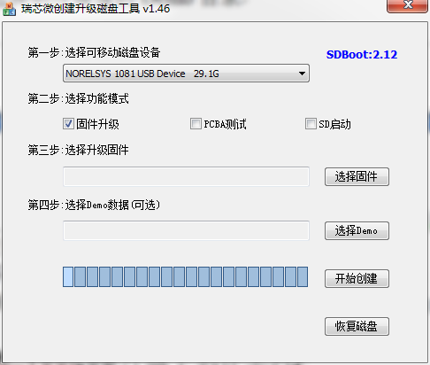
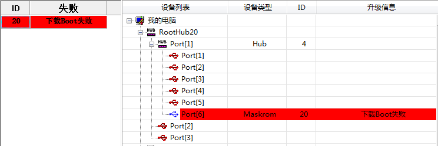

# **量产烧录 指南**

发布版本：1.2

作者邮箱：liuyi@rock-chips.com

日期：2019.11

文档密级：公开资料

---

**前言**

**概述**

本文介绍RK平台的量产烧录方案,包括如何制作烧录镜像、烧录工具使用和常见问题处理。

**支持产品**

| **芯片名称** | **内核版本**                 |
| ------------ | ---------------------------- |
| RK3326       | Linux4.4,Linux4.19           |
| RK3399       | Linux4.4,Linux4.19           |
| RK3368       | Linux4.4,Linux4.19           |
| RK3288       | Linux4.4,Linux4.19           |
| RK3328       | Linux4.4,Linux4.19,Linux3.10 |

**读者对象**

本文档（本指南）主要适用于以下工程师：
生产技术人员

**修订记录**

| **日期**     | **版本** | **作者** | **修改说明**   |
| ---------- | ------ | ------ | ---------- |
| 2016-07-18 | V1.0   | 刘翊     | 初稿         |
| 2017-02-14 | V1.1   | 刘翊     | 增加RK3328支持 |
| 2019-11-13 | V1.2  | 刘翊     | 增加Linux4.19支持 |

---
[TOC]
---

## 量产烧录方案

### 方案一(USB升级方案)

步骤1:制作update.img升级固件

步骤2:使用FactoryTool进行批量烧录

### 方案二(SD升级方案)

步骤1：制作update.img升级固件

步骤2: 使用SD\_Firmware\_Tool工具制作固件升级的SD卡

步骤3: 插入升级SD卡，重新上电，进行固件烧录

### 方案三(烧录器升级方案)

步骤1：制作update.img升级固件

步骤2: 使用SpiImageTool工具制作烧录器的烧录文件

步骤3: 存储芯片接入烧录器，进行固件烧录

## 工具使用

### FactoryTool批量烧录工具

使用步骤:

点击”固件”，选择升级固件

如果有烧录Demo镜像，则勾选”Demo”选择Demo镜像(可选),Demo镜像制作见OemTool工具使用

点击”启动”，开始自动检测升级设备

连接升级设备，工具检测到后，自动开始升级

### OemTool(制作Demo镜像工具)

制作Demo镜像步骤:

1. 点击”选择…”，选择制作镜像的Demo目录

2. 勾选”Fat32”,目前只支持Fat32格式镜像

3. 设置”磁盘大小”,只要大于user分区的容量，按100M对齐即可

4. 点击”开始执行”,成功后会在工具目录下生成一个OemImage.img镜像文件

### SD\_Firmware\_Tool(SD升级卡制作工具)

SD升级卡制作步骤:

1. 从下拉列表中，选中要制作的SD卡或U盘

2. 勾选”固件升级”

3. 点击”选择固件”,选择update.img升级固件

4. 点击”开始创建”

### SpiImageTool(烧录器镜像制作工具)

烧录器镜像制作步骤:

1. 点击”选择固件”，选取update.img升级固件

2. 存储使用Emmc时，勾选”数据区预留”

3. 存储使用Emmc时，空白填充选择0，存储使用nandflash时，空白填充选择0xFF

4. 点击”生成文件”,成功时会在工具目录下生成boot0.bin和data.bin。emmc情况只使用data.bin,nandflash情况需要使用boot0.bin和data.bin

## 制作升级固件

### 步骤

1. 在Android源代码目录下，运行mkimage.sh脚本带上ota参数，生成system.img、boot.img和recovery.img等，将其拷贝到rockdev的image目录下。

2. 在AndroidTool的rockdev目录下，执行mkupdate.bat批处理，生成update.img升级固件.ubuntu下执行mkupdate.sh脚本生成。下图为mkupdate.bat内容:

重点关注-RK31这个参数，它需要跟设备匹配。如果不清楚这个值，可以通过下面方法获得：

- 打开androidtool工具，进入高级功能,选择这个方案的loader文件，点击”下载”

- 点击下方的”读取Chip信息”,右方会打印出以下信息，Image Chip Flag就是那个参数

    

## 烧录器设置

### EMMC烧录数据：

EMMC分为3个部分,USER区,BOOT1区和BOOT2,只需要烧录USER分区即可，烧录的文件为SpiImageTool 生成的data.bin。

### EMMC EXT\_CSD需要配置的信息：

~~~c
EXT_CSD[167] = 0x1f （如果芯片支持，需要配置）

EXT_CSD[162] = 0x0 (默认值)

EXT_CSD[177] = 0x0 (默认值)

EXT_CSD[178] = 0x0 (默认值)

EXT_CSD[179] = 0x0 (默认值)
~~~

## 常见升级问题

### 下载Boot失败一

日志提示:

可能的原因：

1. USB信号不好(检查usb线路上的电容和电阻参数是否正常，usb供电是否正常)

2. 主控虚焊或者电源供电问题

### 下载Boot失败二

可能的原因：

DDR颗粒或者走线问题

### 准备IDB失败

可能的原因：

Flash虚焊或者不支持的颗粒

### 下载IDB失败

可能的原因：

1. USB通讯问题(断电重试,需要使用有源usb hub)

2. DDR稳定性问题(使用DDR测试工具进行稳定性测试)

### 下载固件失败

可能的原因：

1. USB通讯问题(断电重试,需要使用有源usb hub)

2. Flash问题(使用AndroidTool擦除flash重试)

