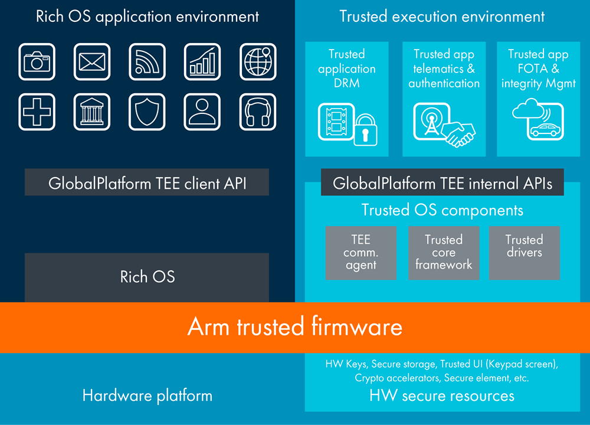
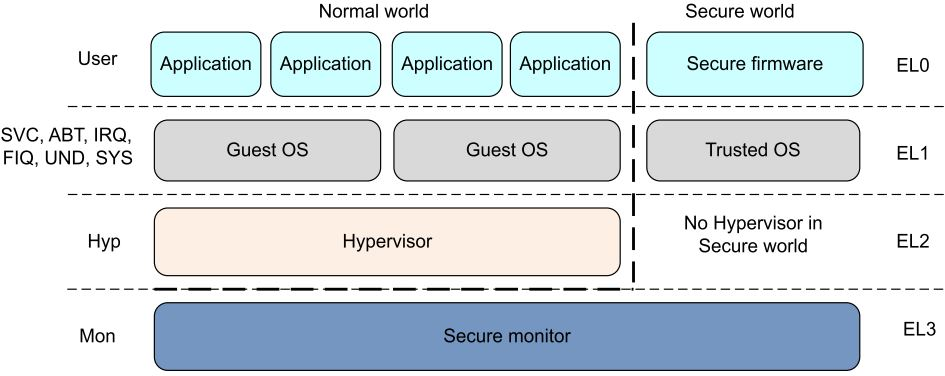

# Trust 指南

发布版本：1.0

作者邮箱：chenjh@rock-chips.com

日期：2017.12

文件密级：公开资料

---

**前言**

**概述**

​	Trust 作为 Rockchip 平台 SDK 里的固件之一，因为涉及安全性和保密性，目前完整源码仅对内部的部分工程师开放（RK322x/RK3328/RK3368/RK3399/平台的基础功已经开源[0]）。本文档仅对 Trust 进行概要介绍（以 64 位平台作为范例），意在让读者明白它在整个系统架构中的角色和作用。同时指导读者在实际使用中遇到问题时如何进行问题收集和反馈。

**读者对象**

本文档（本指南）主要适用于以下工程师：

技术支持工程师

软件开发工程师

**产品版本**

| **芯片名称**                                 | **内核版本** |
| ---------------------------------------- | :------- |
| RK3036/RK3126C/RK3288/RK322X/RK3368/RK3328/RK3399 | 3.10、4.4 |

**修订记录**

| **日期**     | **版本** | **作者** | **修改说明** |
| ---------- | ------ | ------ | -------- |
| 2017-12-30 | V1.0   | 陈健洪    | 初始版本     |

---

[TOC]

---

## ARM TrustZone

​	ARM TrustZone [1]技术是所有 Cortex-A 类处理器的基本功能，是通过 ARM 架构安全扩展引入的。这些扩展可在供应商、平台和应用程序中提供一致的程序员模型，同时提供真实的硬件支持的安全环境。

​	ARM TrustZone 技术是系统范围的安全方法，针对高性能计算平台上的大量应用，包括安全支付、数字版权管理 (DRM)、企业服务和基于 Web 的服务。TrustZone 技术与 Cortex-A 处理器紧密集成，并通过 AMBA AXI 总线和特定的 TrustZone 系统 IP 块在系统中进行扩展，所以 ARM TrustZone 技术是从硬件层次上提供的安全机制。此系统方法意味着可以保护安全内存、加密块、键盘和屏幕等外设，从而可确保它们免遭软件攻击。

​	目前用于 ARM TrustZone 技术的开源项目中，使用比较广泛的有 ARM Trusted Firmware 和 OP-TEE OS[2]，它们都是针对 ARM 芯片给出的底层固件开源项目，二者之间可以配合使用或单独使用。

### 1. 系统架构

​	从系统架构角度看，如下是启用了 ARM TrustZone 技术后的 64 位平台系统架构图。整个系统被分成了两个世界：左边是非安全世界，右边是安全世界。安全世界可以访问两个世界的所有资源，非安全世界只能访问非安全世界的资源，如果非安全世界访问安全世界的资源，则将产生系统硬件总线报错等异常，是无法获取到资源的。

​	这两个世界之间的往来需要通过 ARM Trusted Firmware 作为桥梁。当 CPU 处于非安全世界时，如果想进入安全世界则需要先进入 ARM Trusted Firmware（通过 ARM 的 SMC 硬件指令），在 ARM Trusted Firmware 里的 Secure Monitor 代码会把 CPU 从非安全身份切换成安全的身份，然后再以安全身份进入安全世界。反之亦然。这个是完全从硬件级别上进行的安全和非安全身份转变。

​	Rockchip 的 Trust 可以理解为是 ARM Trusted Firmware + OP-TEE OS 的功能集合，它实现了安全世界里我们需求的功能以及 Secure Monitor(两个世界转换的核心代码)的功能。




### 2. CPU 特权等级

​	从 CPU 的视角看，如下是一个标准的启用了 ARM TrustZone 技术后的 CPU 特权模式等级架构图。如果是 64 位 CPU，它的特权等级分为 EL0、EL1、EL2、EL3，其中根据 CPU 所处的世界又分为安全 EL0、安全 EL1 或者非安全 EL0、非安全 EL1。如果是 32 位 CPU，它的特权等级分为 Mon、Hyp、SVC、ABT、IRQ、FIQ、UND、SYS、USER 模式，其中 SVC、ABT、IRQ、FIQ、UND、SYS、USER 也如 64 位一样有安全和非安全模式之分。

​	Rockchip 的 Trust 可以理解为是 EL3 + 安全 EL1 的功能集合。




## Rockchip 平台的 Trust

### 1. 实现机制

​	目前 Rockchip 平台上的 64 位 SoC 平台上使用的是 ARM Trusted Firmware + OP-TEE OS 的组合；32 位 SoC 平台上使用的是 OP-TEE OS。

### 2. 启动流程

​	ARM Trusted Firmware 的体系架构里将整个系统分成四种安全等级，分别为：EL0、EL1、EL2、EL3。将整个安全启动的流程阶段定义为：BL1、BL2、BL31、BL32、BL33，其中 ARM Trusted Firmware 自身的源代码里提供了 BL1、BL2、BL31 的功能。Rockchip 平台仅使用了其中的 BL31 的功能，BL1 和 BL2 我们有自己的一套实现方案。所以在 Rockchip 平台上我们一般也可以“ 默认” ARM Trusted Firmware 指的就是 BL31，而 BL32 使用的则是 OP-TEE OS。

​	如果把上述这种阶段定义映射到 Rockchip 的平台各级固件上，对应关系为：Maskrom（BL1）、Loader（BL2）、Trust（BL31：ARM Trusted Firmware + BL32：OP-TEE OS）、U-Boot（BL33）。

​	Android 系统的固件启动顺序：

```c
Maskrom -> Loader -> Trust -> U-Boot -> kernel -> Android
```


### 3. 固件获取

目前只提供 binary 文件，不提供源代码。Trust 的 binary 文件提交在 U-Boot 工程里：

```c
./tools/rk_tools/bin/rk30/
./tools/rk_tools/bin/rk31/
./tools/rk_tools/bin/rk32/
./tools/rk_tools/bin/rk33/
```

当编译某个平台的 uboot.img 的时候，相应平台的 trust.img 也会同时打包生成在 U-Boot 的根目录下。其中 binary 打包成 trust.img 的时候是通过 ini 文件进行索引，ini 文件在 U-Boot 工程里：

```c
tools/rk_tools/RKTRUST/
```

### 4. DTS 使能

#### 4.1 内核 3.10

##### 4.1.1 32 位平台

（1）增加 psci 节点

```c
psci {
	compatible      = "arm,psci";
	method          = "smc";
	cpu_suspend     = <0x84000001>;
	cpu_off         = <0x84000002>;
	cpu_on          = <0x84000003>;
	affinity_info   = <0x84000004>;
};
```

（2）在 chosen 节点或者 parameter 里增加：psci=enable

```c
chosen {
	bootargs = "psci=enable vmalloc=496M cma=4M rockchip_jtag";
};
```

##### 4.1.2 64 位平台

（1）增加 psci 节点：

```c
psci {
        compatible = "arm,psci-0.2";
        method = "smc";
};
```

（2）cpu 节点下面增加： enable-method = "psci";

```c
cpus {
        #address-cells = <2>;
        #size-cells = <0>;

        cpu@0 {
                device_type = "cpu";
                compatible = "arm,cortex-a53", "arm,armv8";
                reg = <0x0 0x0>;
                enable-method = "psci";
                cpu-idle-states = <&CPU_SLEEP>;
        };
        cpu@1 {
                device_type = "cpu";
                compatible = "arm,cortex-a53", "arm,armv8";
                reg = <0x0 0x1>;
                enable-method = "psci";
                cpu-idle-states = <&CPU_SLEEP>;
        };
        cpu@2 {
                device_type = "cpu";
                compatible = "arm,cortex-a53", "arm,armv8";
                reg = <0x0 0x2>;
                enable-method = "psci";
                cpu-idle-states = <&CPU_SLEEP>;
        };
        cpu@3 {
                device_type = "cpu";
                compatible = "arm,cortex-a53", "arm,armv8";
                reg = <0x0 0x3>;
                enable-method = "psci";
                cpu-idle-states = <&CPU_SLEEP>;
        };

		.....
};
```

#### 4.2 内核 4.4

##### 4.2.1 32 位平台

增加 psci 节点即可：

```c
psci {
        compatible = "arm,psci-1.0";
        method = "smc";
};
```

##### 4.2.2 64 位平台

（1）增加 psci 节点：

```c
psci {
        compatible = "arm,psci-1.0";
        method = "smc";
};
```

（2）cpu 节点下面增加： enable-method = "psci";

```c
cpus {
        #address-cells = <2>;
        #size-cells = <0>;

        cpu@0 {
                device_type = "cpu";
                compatible = "arm,cortex-a53", "arm,armv8";
                reg = <0x0 0x0>;
                enable-method = "psci";
                cpu-idle-states = <&CPU_SLEEP>;
        };
        cpu@1 {
                device_type = "cpu";
                compatible = "arm,cortex-a53", "arm,armv8";
                reg = <0x0 0x1>;
                enable-method = "psci";
                cpu-idle-states = <&CPU_SLEEP>;
        };
        cpu@2 {
                device_type = "cpu";
                compatible = "arm,cortex-a53", "arm,armv8";
                reg = <0x0 0x2>;
                enable-method = "psci";
                cpu-idle-states = <&CPU_SLEEP>;
        };
        cpu@3 {
                device_type = "cpu";
                compatible = "arm,cortex-a53", "arm,armv8";
                reg = <0x0 0x3>;
                enable-method = "psci";
                cpu-idle-states = <&CPU_SLEEP>;
        };

		.....
};
```

#### 4.3 内核 Document

内核 Document 里提供了关于 psci 的相关说明：

```c
./Documentation/devicetree/bindings/arm/psci.txt
```

### 5. 运行内存和生命周期

#### 5.1 运行内存

ARM Trusted Firmware  运行在 DRAM 起始偏移 0M~2M 的空间，以 0x10000（64KB）作为程序入口地址。

OP-TEE OS 运行在 DRAM 起始偏移 132M~148M 之间（结束地址依各平台需求而定）以 0x08400000（132M）作为入口地址。

#### 5.2 生命周期

Trust 自上电初始化之后就始终常驻于内存之中，完成着自己的使命。

### 6. Security

在第一章节里我们介绍了启用 ARM TrustZone 后系统被分为了安全世界和非安全世界。那么在 Rockchip 平台上 CPU 运行在哪些固件时属于安全世界，哪些固件又属于非安全世界呢？具体区分如下：Loader、Trust 运行在安全世界；U-Boot、kernel、Android 运行在非安全世界里（安全的 driver、APP 除外）。

### 7. 功能

#### 7.1 PSCI（Power State Coordination Interface）

​	通常各家 SoC 厂商的芯片在 IC 设计上具有明显差异，尤其是 CPU 的电源状态管理部分。各家 SoC 厂商有自己的一套软件流程来管理 CPU 电源状态，所以内核里的这部分代码碎片化比较明显，很难进行高度统一，显然内核很不愿意这方面一直维持碎片化的现状。而且普通开发者一般也不是很关心这部分实现，因为这部分软件实现跟 CPU 体系架构、IC 设计紧密相关，要完全理解或者自己实现都存在一定难度。

​	基于上述原因，内核更倾向于把 CPU 的电源管理放到各 SoC 厂商自己的 firmware 里，内核只要专注于 CPU 控制策略，让内核代码更加高度统一。因此后来内核框架增加了 PSCI（Power State Coordination Interface）[3]接口来实现这一目的。

​	PSCI 是一套 CPU core 电源管理相关的接口，本质上是通过 ARM 的 SMC 硬件指令陷入到 Trust 里完成以上相关的操作: CPU 打开、CPU 关闭、系统深度休眠、系统复位、系统关机，等等。主要包括：

```c
PSCI_VERSION
PSCI_FEATURES
CPU_ON
CPU_OFF
CPU_SUSPEND
SYSTEM_SUSPEND
AFFINITY_INFO
SYSTEM_OFF
SYSTEM_RESET
......
```

4.4 内核相关代码路径

```c
./arch/arm/kvm/psci.c
./arch/arm/kernel/smccc-call.S
./arch/arm64/kernel/psci.c
./arch/arm64/kernel/smccc-call.S
./drivers/firmware/psci.c
./drivers/firmware/rockchip_sip.c
```

3.10 内核相关代码路径

```c
./arch/arm/kernel/psci.c
./arch/arm64/kernel/psci.c
./arch/arm/mach-rockchip/psci.c
```

#### 7.2 Secure Monitor

​	Secure Monitor 是 CPU 往来安全世界和非安全世界进行状态转换的桥梁。Secure Monitor 的代码是在 Trust 中实现的。如果没有这部分代码，CPU 将无法进行安全/非安全状态的切换，ARM TrustZone 技术也就失去了它的意义和作用。

​	那么如何进入 Secure Monitor 模式呢？需要通过 SMC 硬件指令实现，如下是 ARM 技术手册的明确说明：

> The Secure Monitor Call exception is implemented only as part of the Security Extensions. The Secure Monitor Call instruction, SMC, requests a Secure Monitor function, causing the processor to enter Monitor mode.

#### 7.3 安全信息的配置

​	ARM TrustZone 技术除了本身 Cortex-A 处理器紧密集成，还需要通过 AMBA AXI 总线和特定的 TrustZone 系统 IP 块在系统中进行扩展，因此有一系列相关 IP 模块的安全信息需要进行配置，这部分配置一般都在 Trust 里完成。

#### 7.4 安全数据的保护

​	安全数据保护。例如：安全支付、数字版权管理 (DRM)、企业服务和基于 Web 的服务等相关安全信息的存储保护。

## Rockchip 平台的 Trust 问题处理

​	目前对外发布的固件只提供 Trust 的 binary 文件，不提供源代码。目前对于 Trust 的调试方式比较少，更多需要借助专门的 jtag 工具来进行分析，当 Trust 出问题的时候普通使用者一般并不具备自行调试和解决问题的能力，所以出现问题时请尽量保护好现场、收集足够多的信息反馈给负责 Trust 的 maintainer。因此通常使用者应当知道哪些是 Trust 的打印信息、Trust 对应的版本号、哪些是 Trust 的 PANIC 信息等。

### 1. 开机 log 示例

```c
NOTICE:  BL31: v1.3(debug):4c793da
NOTICE:  BL31: Built : 18:13:44, Dec 25 2017
NOTICE:  BL31:Rockchip release version: v1.3
INFO:    ARM GICv2 driver initialized
INFO:    Using opteed sec cpu_context!
INFO:    boot cpu mask: 1
INFO:    plat_rockchip_pmu_init: pd status 0xe
INFO:    BL31: Initializing runtime services
INFO:    BL31: Initializing BL32
INF [0x0] TEE-CORE:init_primary_helper:337: Initializing (1.1.0-127-g27532f4 #54 Mon Dec 18 02:01:14 UTC 2017 aarch64)
INF [0x0] TEE-CORE:init_primary_helper:338: Release version: 1.4
INF [0x0] TEE-CORE:init_teecore:83: teecore inits done
INFO:    BL31: Preparing for EL3 exit to normal world
INFO:    Entry point address = 0x200000
INFO:    SPSR = 0x3c9
```

### 2. 打印信息识别

除去开机阶段的打印信息，通常在运行过程中：

ARM Trusted Firmware 打印格式（不带有时间戳）：

 ~~~INFO: *********
INFO: *********
 ~~~

OP-TEE OS 打印格式（不带有时间戳）：

```c
INF [0x0] TEE-CORE: *********
```

### 3. 固件版本号识别

ARM Trusted Firmware 的版本号：4c793da。

```c
NOTICE:  BL31: v1.3(debug):4c793da
```

OP-TEE OS 的版本号：27532f4（忽略最前面的 g）。

```c
INF [0x0] TEE-CORE:init_primary_helper:337: Initializing (1.1.0-127-g27532f4 #54 Mon Dec 18 02:01:14 UTC 2017 aarch64)
```

### 4. PANIC 信息识别

#### 4.1 ARM Trusted Firmware 发生 panic

```c
Unhandled Exception in EL3.
x30 =           0x00000000ff00fff0
x0 =            0x00000000000101c0
x1 =            0x0000000000000000
x2 =            0x0000000000000000
x3 =            0x0000000000000000
x4 =            0x0000000000cd383b
x5 =            0x0000000000080001
x6 =            0x0000000080803520
x7 =            0x00000000000342a0
x8 =            0x00000000000101c0
x9 =            0x0000000000000000
x10 =           0x0000000000000000
x11 =           0x0000000000000000
x12 =           0x0000000000000001
x13 =           0x00000000000101b8
x14 =           0x000000000001a950
x15 =           0x0000000000000000
x16 =           0x00000000000101c0
x17 =           0x0000000000000000
x18 =           0x0000000000000000
x19 =           0x0000000000000000
x20 =           0x0000000040000000
x21 =           0x0000000000000040
x22 =           0x00000000000305b0
x23 =           0x000000000001016c
x24 =           0x00000000000101c0
x25 =           0x0000000000000000
x26 =           0x0000000000000000
x27 =           0x0000000000000000
x28 =           0x0000000000035bf8
x29 =           0x0000000000000000
scr_el3 =       0x00000000000101c0
sctlr_el3 =     0x0000000000000000
cptr_el3 =      0x0000000000000000
tcr_el3 =       0x0000000000000000
daif =          0x0000000000000238
mair_el3 =      0x0000000000cd383b
spsr_el3 =      0x0000000000000000
elr_el3 =       0x0000000080803520
ttbr0_el3 =     0x00000000000101c0
esr_el3 =       0x0000000000000000
far_el3 =       0x0000000000000000
spsr_el1 =      0x00000000000101c0
elr_el1 =       0x0000000000000000
spsr_abt =      0x0000000000000000
......
```

#### 4.2 OP-TEE OS 发生 panic

```c
core data-abort at address 0xc121b16c

 fsr 0x00000805  ttbr0 0x6847446a  ttbr1 0x6847006a  cidr 0x2
 cpu #0          cpsr 0x200001d1
 r0 0x20068000      r4 0x68407195    r8 0x00000000   r12 0x00000000
 r1 0x00000049      r5 0x6848068b    r9 0x6840a3bd    sp 0xc121b1a4
 r2 0x6848068c      r6 0x6848068c   r10 0x684808cc    lr 0x684296a6
 r3 0x0000001f      r7 0x00000001   r11 0x68404f9d    pc 0x6840041c

ERR [0x0] TEE-CORE:tee_pager_handle_fault:125: Unexpected page fault! Trap CPU
PANIC: tee_pager_handle_fault core/arch/arm/include/mm/tee_pager.h:126
```

## 附录参考

[0] 开源代码下载：<br/>
​	ARM Trusted Firmware：<https://github.com/ARM-software/arm-trusted-firmware><br/>
​	OP-TEE OS：<https://github.com/OP-TEE/optee_os><br/>
[1] ARM TrustZone：<br/>
​	<https://www.arm.com/products/security-on-arm/trustzone><br/>
​	<https://developer.arm.com/technologies/trustzone><br/>
[2] op-tee 官网：<https://www.op-tee.org/><br/>
[3] PSCI：<http://infocenter.arm.com/help/topic/com.arm.doc.den0022c/DEN0022C_Power_State_Coordination_Interface.pdf> "Power State Coordination Interface PDD (ARM DEN 0022C)"