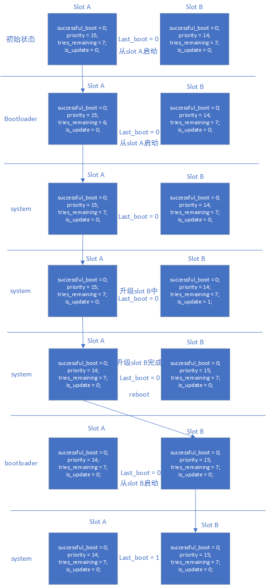
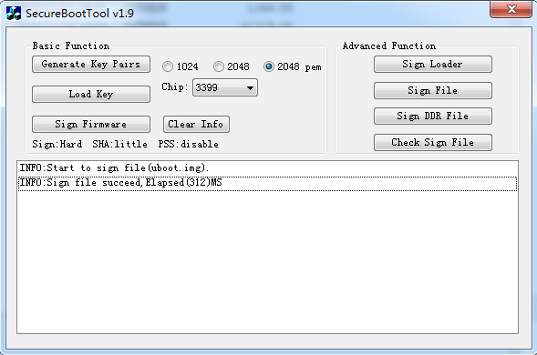
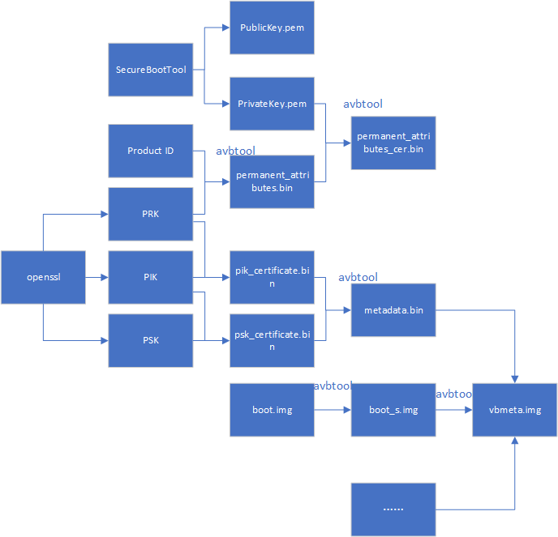
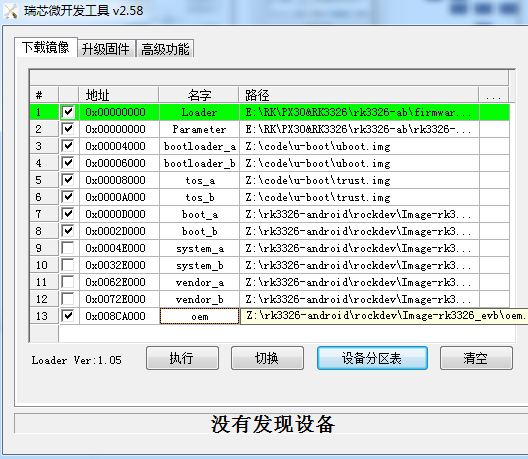
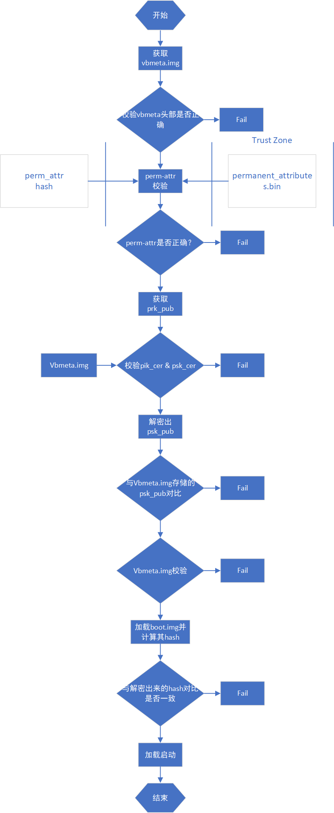
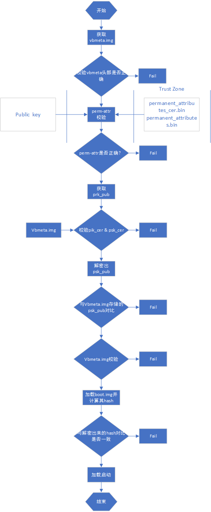
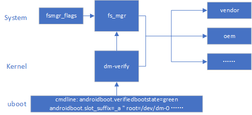

[TOC]

# 进阶原理

## kernel-DTB

### 设计背景

U-Boot 的原生架构要求一块板子必须对应一份 U-Boot dts，并且U-Boot dts生成的dtb是打包到U-Boot自己的镜像中的。这样就会出现各SoC平台上，N块板子需要N份U-Boot镜像。

我们不难发现，其实一个SoC平台不同的板子之间主要是外设的差异，SoC核心部分是一致的。RK平台为了实现一个SoC平台仅需要一份U-Boot镜像，因此增加了 kernel DTB 机制。本质就是在较早的阶段切到kernel DTB，用它的配置信息初始化外设。

所以 RK 平台通过支持 kernel DTB 可以达到兼容板子差异，如：display、pmic/regulator、pinctrl、clk 等。

kernel DTB 的启用需要依赖 OF_LIVE（live device tree，简称：live-dt）。

```
config USING_KERNEL_DTB
        bool "Using dtb from Kernel/resource for U-Boot"
        depends on RKIMG_BOOTLOADER && OF_LIVE
        default y
        help
          This enable support to read dtb from resource and use it for U-Boot,
          the uart and emmc will still using U-Boot dtb, but other devices like
          regulator/pmic, display, usb will use dts node from kernel.
```

### Live device tree

**背景和原理：**

引入kernel DTB后U-Boot阶段存在两份DTB，其中存储、串口、Crypto等模块与U-Boot DTB相关，其余模块与kernel DTB相关。那么在U-Boot阶段可能在不同时刻需要交叉访问到这两类的模块，而模块又可能需要访问自己的DTB节点信息。

那么，这两类模块隶属于不同的DTB，而`gd->fdt_blob`又只能指向其中一份且不方便随意切换，这要怎么办？因为kernel 的 dts 最终要传递给 kernel 使用，所以也不能把 U-Boot dts 中的某些节点直接overlay 到 kernel dts 上合成一份。

Live dt 可以解决这个问题。live dt 的原理是：初始化阶段U-Boot直接扫描整个DTB，把所有DTB节点转换成 struct device_node 节点链表，并且和具体的device-driver绑定。以后device-driver要访问DTB节点时直接访问自己的 device_node 即可，不需要再访问原有 DTB。

所以，相当于U-Boot和kernel 的DTB都绑定了各自的device-driver群组，且不再需要直接访问DTB文件。

这就解决了访问两份DTB引起的冲突。

更多参考:

```
./doc/driver-model/livetree.txt
```

**fdt 和 live dt 转换：**

ofnode 类型（include/dm/ofnode.h）是两种 dt 都支持的一种封装格式，使用 live dt 时用 device_node 来访问 dt 结点，使用 fdt 时用 offset 访问 dt 节点。当需要同时支持两种类型的驱动时请使用 ofnode 类型。

ofnode 结构：

```c
 /*
  * @np: Pointer to device node, used for live tree
  * @of_offset: Pointer into flat device tree, used for flat tree. Note that this
  *      is not a really a pointer to a node: it is an offset value. See above.
  */
 typedef union ofnode_union {
         const struct device_node *np;   /* will be used for future live tree */
         long of_offset;
 } ofnode;
```

- "dev\_"、"ofnode_"开头的函数为支持两种 dt 访问方式；
- "of_"开头的函数是只支持 live dt 的接口；
- "fdtdec\_"、 "fdt_"开头的函数是只支持 fdt 的接口；

### 机制实现

kernel dtb 切换是在`./arch/arm/mach-rockchip/board.c` 的 `init_kernel_dtb()`里实现的。此时 U-Boot 的 dts 已经扫描完成，mmc/nand/nor 等存储驱动可正常工作。

此时从固件中读取 kernel dtb，然后进行 live dt 建表并 bind 所有device-driver，最后更新 `gd->fdt_blob` 指针指向 kernel dtb 即可。

### U-Boot

- U-Boot 编译完成后会在./dts/目录下生成两个 dtb：
  - dt.dtb： 由 defconfig 里 `CONFIG_DEFAULT_DEVICE_TREE` 指定的 dts 编译得到的；
  - dt-spl.dtb：把 dt.dtb 中带`u-boot,dm-pre-reloc`属性的节点全部抽取出来，再去掉 defconfig 里 `CONFIG_OF_SPL_REMOVE_PROPS` 指定的 property 得到。一般仅包含串口、DDR、存储等驱动必须依赖的节点：DMC、UART、MMC、NAND、GRF、CRU等。
- 不启用 `CONFIG_USING_KERNEL_DTB` 时系统使用 dt.dtb；启用 `CONFIG_USING_KERNEL_DTB` 时系统使用 dt-spl.dtb。
- dt.dtb或者dt-spl.dtb在U-Boot编译结束后都被命名为u-boot.dtb，然后追加到u-boot.bin的末尾。用户可以通过fdtdump命令检查u-boot.dtb的内容。

## 内核传参

本章节介绍U-Boot如何向kernel传递参数。

### cmdline

U-Boot把kernel DTB里的`/chosen/bootargs`读取出来，修改/追加上新内容后重新写回`/chosen/bootargs`节点，达到传递cmdline的目的。

### 内存容量

U-Boot修改kernel DTB里的`/memory`节点，把可用的内存容量信息填写进去。开机信息有相关打印：

```c
......
# Booting Android Image at 0x0027f800 ...
Kernel load addr 0x00280000 size 23387 KiB
RAM disk load addr 0x0a200000 size 782 KiB
# Flattened Device Tree blob at 08300000
   Booting using the fdt blob at 0x8300000
   XIP Kernel Image ... OK
  'reserved-memory' ramoops@110000: addr=110000 size=f0000
   Using Device Tree in place at 0000000008300000, end 0000000008314648

// kernel可用的内存空间
Adding bank: 0x00200000 - 0x08400000 (size: 0x08200000)
Adding bank: 0x0a200000 - 0x80000000 (size: 0x75e00000)
Total: 473.217 ms

Starting kernel ...
```

### 其它方式

其它的传参方式本质也都是修改kernel DTB。如下：

| 节点/属性                                         | 操作 | 作用                   |
| :------------------------------------------------ | ---- | ---------------------- |
| /serial-number                                    | 创建 | 序列号                 |
| /memory                                           | 修改 | kernel 可见内存        |
| /display-subsystem/route/route-edp/               | 追加 | 显示相关参数(edp 为例) |
| /chosen/linux,initrd-start                        | 创建 | ramdisk 起始地址       |
| /chosen/linux,initrd-end                          | 创建 | ramdisk 结束地址       |
| /bootargs                                         | 修改 | kernel 可见 cmdline    |
| GMAC 节点内的 mac-address 或 local-mac-address    | 修改 | mac 地址               |
| arch/arm/mach-rockchip/board.c: board_fdt_fixup() | 修改 | 板级的 fdt fixup       |

## AB系统

### AB 数据格式

A/B的数据结构位于 misc 分区偏移 2KB 位置。

```c
/* Magic for the A/B struct when serialized. */
#define AVB_AB_MAGIC "\0AB0"
#define AVB_AB_MAGIC_LEN 4

/* Versioning for the on-disk A/B metadata - keep in sync with avbtool. */
#define AVB_AB_MAJOR_VERSION 1
#define AVB_AB_MINOR_VERSION 0

/* Size of AvbABData struct. */
#define AVB_AB_DATA_SIZE 32

/* Maximum values for slot data */
#define AVB_AB_MAX_PRIORITY 15
#define AVB_AB_MAX_TRIES_REMAINING 7

typedef struct AvbABSlotData {
  /* Slot priority. Valid values range from 0 to AVB_AB_MAX_PRIORITY,
   * both inclusive with 1 being the lowest and AVB_AB_MAX_PRIORITY
   * being the highest. The special value 0 is used to indicate the
   * slot is unbootable.
   */
  uint8_t priority;

  /* Number of times left attempting to boot this slot ranging from 0
   * to AVB_AB_MAX_TRIES_REMAINING.
   */
  uint8_t tries_remaining;

  /* Non-zero if this slot has booted successfully, 0 otherwise. */
  uint8_t successful_boot;

  /* Reserved for future use. */
  uint8_t reserved[1];
} AVB_ATTR_PACKED AvbABSlotData;

/* Struct used for recording A/B metadata.
 *
 * When serialized, data is stored in network byte-order.
 */
typedef struct AvbABData {
  /* Magic number used for identification - see AVB_AB_MAGIC. */
  uint8_t magic[AVB_AB_MAGIC_LEN];

  /* Version of on-disk struct - see AVB_AB_{MAJOR,MINOR}_VERSION. */
  uint8_t version_major;
  uint8_t version_minor;

  /* Padding to ensure |slots| field start eight bytes in. */
  uint8_t reserved1[2];

  /* Per-slot metadata. */
  AvbABSlotData slots[2];

  /* Reserved for future use. */
  uint8_t reserved2[12];

  /* CRC32 of all 28 bytes preceding this field. */
  uint32_t crc32;
} AVB_ATTR_PACKED AvbABData;
```

对于小容量存储，没有 misc 分区但有 vendor 分区，可以考虑存储到 vendor。

在此基础上增加 lastboot，标记最后一个可启动固件。主要应用于低电情况或工厂生产测试时 retry 次数用完，而还没有进入系统调用 boot_ctrl 服务。参考如下：

```c
typedef struct AvbABData {
  /* Magic number used for identification - see AVB_AB_MAGIC. */
  uint8_t magic[AVB_AB_MAGIC_LEN];

  /* Version of on-disk struct - see AVB_AB_{MAJOR,MINOR}_VERSION. */
  uint8_t version_major;
  uint8_t version_minor;

  /* Padding to ensure |slots| field start eight bytes in. */
  uint8_t reserved1[2];

  /* Per-slot metadata. */
  AvbABSlotData slots[2];

  /* mark last boot slot */
  uint8_t last_boot;
  /* Reserved for future use. */
  uint8_t reserved2[11];

  /* CRC32 of all 28 bytes preceding this field. */
  uint32_t crc32;
} AVB_ATTR_PACKED AvbABData;
```

同时在 AvbABSlotData 中增加 is_update 标志位，标志系统升级的状态，更改如下：

```c
typedef struct AvbABSlotData {
  /* Slot priority. Valid values range from 0 to AVB_AB_MAX_PRIORITY,
   * both inclusive with 1 being the lowest and AVB_AB_MAX_PRIORITY
   * being the highest. The special value 0 is used to indicate the
   * slot is unbootable.
   */
  uint8_t priority;

  /* Number of times left attempting to boot this slot ranging from 0
   * to AVB_AB_MAX_TRIES_REMAINING.
   */
  uint8_t tries_remaining;

  /* Non-zero if this slot has booted successfully, 0 otherwise. */
  uint8_t successful_boot;

  /* Mark update state, mark 1 if the slot is in update state, 0 otherwise. */
  uint8_t is_update : 1;
  /* Reserved for future use. */
  uint8_t reserved : 7;
} AVB_ATTR_PACKED AvbABSlotData;
```

最后表格来说明各个参数的含义：

AvbABData：

| **参数**        | **含义**                                                     |
| --------------- | ------------------------------------------------------------ |
| priority        | 标志 slot 优先级，0 为不可启动，15 为最高优先级              |
| tries_remaining | 尝试启动次数，设置为 7 次                                    |
| successful_boot | 系统启动成功后会配置该参数，1：该 slot 成功启动，0：该 slot 未成功启动 |
| is_update       | 标记该 slot 的升级状态，1：该 slot 正在升级，0：该 slot 未升级或升级成功 |

AvbABSlotData：

| **参数**      | **含义**                                                     |
| ------------- | ------------------------------------------------------------ |
| magic         | 结构体头部信息：\0AB0                                        |
| version_major | 主版本信息                                                   |
| version_minor | 次版本信息                                                   |
| slots         | slot 引导信息，参见 AvbABData                                |
| last_boot     | 上一次成功启动的 slot，0：slot A 上次成功启动，1：slot B 上次成功启动 |
| crc32         | 数据校验                                                     |

### AB 启动模式

目前 system bootctrl 设计两套控制模式，bootloader 支持这两种模式启动。

#### successful-boot

正常进入系统后，boot_ctrl 依据 androidboot.slot_suffix，设置当前 slot 的变量：

```
successful_boot = 1;
priority = 15;
tries_remaining = 0;
is_update = 0;
last_boot = 0 or 1;     :refer to androidboot.slot_suffix
```

升级系统中，boot_ctrl 设置：

```
升级的slot设置：
successful_boot = 0;
priority = 14;
tries_remaining = 7;
is_update = 1;
lastboot = 0 or 1;     :refer to androidboot.slot_suffix

当前slot设置：
successful_boot = 1;
priority = 15;
tries_remaining = 0;
is_update = 0;
last_boot = 0 or 1;     :refer to androidboot.slot_suffix
```

升级系统完成，boot_ctrl 设置：

```
升级的slot设置：
successful_boot = 0;
priority = 15;
tries_remaining = 7;
is_update = 0;
lastboot = 0 or 1;     :refer to androidboot.slot_suffix

当前slot设置：
successful_boot = 1;
priority = 14;
tries_remaining = 0;
is_update = 0;
last_boot = 0 or 1;     :refer to androidboot.slot_suffix
```

#### reset-retry

正常进入系统后，boot_ctrl 依据 androidboot.slot_suffix，设置当前 slot 的变量：

```
successful_boot = 0;
priority = 15;
tries_remaining = 7;
is_update = 0;
last_boot = 0 or 1;     :refer to androidboot.slot_suffix
```

升级系统中，boot_ctrl 设置：

```
升级的slot设置：
successful_boot = 0;
priority = 14;
tries_remaining = 7;
is_update = 1;
lastboot = 0 or 1;     :refer to androidboot.slot_suffix

当前slot设置：
successful_boot = 0;
priority = 15;
tries_remaining = 7;
is_update = 0;
last_boot = 0 or 1;     :refer to androidboot.slot_suffix
```

升级系统完成，boot_ctrl 设置：

```
升级的slot设置：
successful_boot = 0;
priority = 15;
tries_remaining = 7;
is_update = 0;
lastboot = 0 or 1;     :refer to androidboot.slot_suffix

当前slot设置：
successful_boot = 0;
priority = 14;
tries_remaining = 7;
is_update = 0;
last_boot = 0 or 1;     :refer to androidboot.slot_suffix
```

#### 模式对比

- successful_boot 模式
  - 优点：只要正常启动系统，不会回退到旧版本固件，除非 system bootctrl 配置
  - 缺点：设备长时间工作后，如果存储某些颗粒异常，会导致系统一直重启
- reset retry 模式
  - 优点：始终保持 retry 机制，可以应对存储异常问题
  - 缺点：会回退到旧版本固件

### 启动流程


**AB successful_boot 模式数据流程：**


**AB reset retry 模式数据流程：**



### 升级和异常

- 系统 升级：参考《Rockchip Linux 升级方案开发指南》
- recovery 升级：AB system 不考虑支持 recovery 升级

### 验证方法

#### successful-boot

1. 只烧写 slot A，系统从 slot A 启动。设置从 slot B 启动，系统从 slot A 启动。测试完成，清空 misc 分区
2. 烧写 slot A 与 slot B，启动系统，当前系统为 slot A。设置系统从 slot B 启动，reboot 系统，当前系统为 slot B。测试完成，清空 misc 分区
3. 烧写 slot A 与 slot B，迅速 reset 系统 14 次后，retry counter 用完，还能从 last_boot 指定的系统启动，即能正常从 slot A 启动。测试完成，清空 misc 分区
4. 烧写 slot A 与 slot B，启动系统，当前系统为 slot A。设置系统从 slot B 启动，reboot 系统，当前系统为 slot B。设置系统从 slot A 启动，reboot 系统，当前系统为 slot A。测试完成，清空 misc 分区

#### reset-retry

1. 只烧写 slot A，系统从 slot A 启动。设置从 slot B 启动，系统从 slot A 启动。测试完成，清空 misc 分区
2. 烧写 slot A 与 slot B，启动系统，当前系统为 slot A。设置系统从 slot B 启动，reboot 系统，当前系统为 slot B。测试完成，清空 misc 分区
3. 烧写 slot A 与 slot B，迅速 reset 系统 14 次后，retry counter 用完，还能从 last_boot 指定的系统启动，即能正常从 slot A 启动。测试完成，清空 misc 分区
4. 烧写 slot A 与 slot B，其中 slot B 的 boot.img 损坏，启动系统，当前系统为 slot A。设置系统从 slot B 启动，reboot 系统，系统会重启 7 次后，从 slot A 正常启动系统。测试完成，清空 misc 分区
5. 烧写 slot A 与 slot B，启动系统，当前系统为 slot A。设置系统从 slot B 启动，reboot 系统，当前系统为 slot B。设置系统从 slot A 启动，reboot 系统，当前系统为 slot A。测试完成，清空 misc 分区

### 引用参考

《Rockchip-Secure-Boot2.0.md》

《Rockchip-Secure-Boot-Application-Note.md》

《Android Verified Boot 2.0》

## AVB安全启动

### 引用参考

《Rockchip-Secure-Boot-Application-Note.md》

《Android Verified Boot 2.0》

《Rockchip_Developer_Guide_Linux4.4_SecureBoot_CN.pdf》

### 术语

AVB : Android Verified Boot

OTP & efuse : One Time Programmable

Product RootKey (PRK)：AVB 的 root key 由签名 loader，uboot & trust 的 root key 校验

ProductIntermediate Key (PIK)：中间 key，中介作用

ProductSigning Key (PSK)：用于签固件的 key

ProductUnlock Key (PUK)：用于解锁设备

**各种key分离，职责明确，可以降低key被泄露的风险。**

### 简介

本文介绍 Rockchip 安全验证引导流程。所谓的安全验证引导流程分为安全性校验与完整性校验。安全性校验是加密公钥的校验，流程为从安全存储（OTP & efuse）中读取公钥 hash，与计算的公钥 hash 对比，是否一致，然后公钥用于解密固件 hash。完整性校验为校验固件的完整性，流程为从存储里加载固件，计算固件的 hash 与解密出来的 hash 对比是否一致。

### 加密示例

设备的安全验证启动流程与通信中的数据加密校验流程类似，通过该例子可以加速对 avb 校验流程的理解。假如现在 Alice 向 Bob 传送数字信息，为了保证信息传送的保密性、真实性、完整性和不可否认性，需要对传送的信息进行数字加密和签名，其传送过程为：

1.Alice 准备好要传送的数字信息（明文）；

2.Alice 对数字信息进行哈希运算，得到一个信息摘要；

3.Alice 用自己的私钥对信息摘要进行加密得到 Alice 的数字签名，并将其附在数字信息上；

4.Alice 随机产生一个加密密钥，并用此密码对要发送的信息进行加密，形成密文；

5.Alice 用 Bob 的公钥对刚才随机产生的加密密钥进行加密，将加密后的 DES 密钥连同密文一起传送给 Bob；

6.Bob 收到 Alice 传送来的密文和加密过的 DES 密钥，先用自己的私钥对加密的 DES 密钥进行解密，得到 Alice 随机产生的加密密钥；

7.Bob 然后用随机密钥对收到的密文进行解密，得到明文的数字信息，然后将随机密钥抛弃；

8.Bob 用 Alice 的公钥对 Alice 的数字签名进行解密，得到信息摘要；

9.Bob 用相同的哈希算法对收到的明文再进行一次哈希运算，得到一个新的信息摘要；

10.Bob 将收到的信息摘要和新产生的信息摘要进行比较，如果一致，说明收到的信息没有被修改过。

上面提及的 DES 算法可以更换其他算法，如 AES 加密算法，公私钥算法可以采用 RSA 算法，流程如下：


### AVB

AVB 为 Android Verified Boot，谷歌设计的一套固件校验流程，主要用于校验 boot system 等固件。Rockchip Secure Boot 参考通信中的校验方式及 AVB，实现一套完整的 Secure Boot 校验方案。

#### AVB 特性

- 安全校验
- 完整性校验
- 防回滚保护
- persistent partition 支持
- chained partitions 支持，可以与 boot，system 签名私钥一致，也可以由 oem 自己保存私钥，但必须由 PRK 签名

#### key+签名+证书

```shell
#!/bin/sh
touch temp.bin
openssl genpkey -algorithm RSA -pkeyopt rsa_keygen_bits:4096 -outform PEM -out testkey_prk.pem
openssl genpkey -algorithm RSA -pkeyopt rsa_keygen_bits:4096 -outform PEM -out testkey_psk.pem
openssl genpkey -algorithm RSA -pkeyopt rsa_keygen_bits:4096 -outform PEM -out testkey_pik.pem
python avbtool make_atx_certificate --output=pik_certificate.bin --subject=temp.bin --subject_key=testkey_pik.pem --subject_is_intermediate_authority --subject_key_version 42 --authority_key=testkey_prk.pem
python avbtool make_atx_certificate --output=psk_certificate.bin --subject=product_id.bin --subject_key=testkey_psk.pem --subject_key_version 42 --authority_key=testkey_pik.pem
python avbtool make_atx_metadata --output=metadata.bin --intermediate_key_certificate=pik_certificate.bin --product_key_certificate=psk_certificate.bin
```

permanent_attributes.bin 生成：

```shell
python avbtool make_atx_permanent_attributes --output=permanent_attributes.bin --product_id=product_id.bin --root_authority_key=testkey_prk.pem
```

其中 product_id.bin 需要自己定义，占 16 字节，可作为产品 ID 定义。

boot.img 签名示例：

```shell
avbtool add_hash_footer --image boot.img --partition_size 33554432 --partition_name boot --key testkey_psk.pem --algorithm SHA256_RSA4096
```

**注意：partition size 要至少比原固件大 64K，大小还要 4K 对齐，且不大于 parameter.txt 定义的分区大小。**

sytem.img 签名示例：

```shell
avbtool add_hashtree_footer --partition_size 536870912 --partition_name system --image system.img --algorithm SHA256_RSA4096 --key testkey_psk.pem
```

生成 vbmeta 包含 metadata.bin，命令示例如下：

```shell
python avbtool make_vbmeta_image --public_key_metadata metadata.bin --include_descriptors_from_image boot.img --include_descriptors_from_image system.img --generate_dm_verity_cmdline_from_hashtree system.img --algorithm SHA256_RSA4096 --key testkey_psk.pem  --output vbmeta.img
```

最终把生成的 vbmeta.img 烧写到对应的分区，如 vbmeta 分区。

通过 SecureBootTool 生成 PrivateKey.pem 和 PublicKey.pem。



对 permanent_attributes.bin 进行签名：

```shell
openssl dgst -sha256 -out permanent_attributes_cer.bin -sign PrivateKey.pem permanent_attributes.bin
```

permanent_attributes.bin 是整个系统的安全认证数据，它需要烧写它的 hash 到 efuse 或 OTP，或它的数据由前级的安全认证（pre-load）。由于 rockchip 平台规划的 efuse 不足，所以 permanent_attributes.bin 的验证由前级的公钥加permanent_attributes.bin 的证书进行认证。而对于有OTP的平台，安全数据空间足够，会直接烧写permanent_attributes.bin 的 hash 到 OTP。

各个平台efuse与OTP支持情况：

| **平台** | **efuse** | **OTP** |
| -------- | --------- | ------- |
| rk3399   | ✔         |         |
| rk3368   | ✔         |         |
| rk3328   |           | ✔       |
| rk3326   |           | ✔       |
| rk3308   |           | ✔       |
| rk3288   | ✔         |         |
| rk3229   | ✔         |         |
| rk3126   | ✔         |         |
| rk3128   | ✔         |         |

efuse 平台 pub_key 烧写：

```
fastboot stage permanent_attributes.bin
fastboot oem fuse at-perm-attr
fastboot stage permanent_attributes_cer.bin
fastboot oem fuse at-rsa-perm-attr
```

OTP 平台 pub_key 烧写：

```
fastboot stage permanent_attributes.bin
fastboot oem fuse at-perm-attr
```

整个签名流程：



#### AVB lock

```
fastboot oem at-lock-vboot
```

如何进入 fastboot 见 fastboot 命令支持章节。

#### AVB unlock

目前 Rockchip 采用严格安全校验，需要在对应的defconfig内添加

```
CONFIG_RK_AVB_LIBAVB_ENABLE_ATH_UNLOCK=y
```

否则输入 fastboot oem at-unlock-vboot 就可以解锁设备，启动校验 vbmeta.img，boot.img 失败也会成功启动设备。

首先，需要生成 PUK：

```shell
openssl genpkey -algorithm RSA -pkeyopt rsa_keygen_bits:4096 -outform PEM -out testkey_puk.pem
```

unlock_credential.bin 为需要下载到设备解锁的证书，其生成过程如下：

```shell
python avbtool make_atx_certificate --output=puk_certificate.bin --subject=product_id.bin --subject_key=testkey_puk.pem --usage=com.google.android.things.vboot.unlock --subject_key_version 42 --authority_key=testkey_pik.pem
```

从设备获取 unlock_credential.bin，使用 avb-challenge-verify.py 脚本获取 unlock_credential.bin，执行下列命令获取 unlock_credential.bin：

```shell
python avbtool make_atx_unlock_credential --output=unlock_credential.bin --intermediate_key_certificate=pik_certificate.bin --unlock_key_certificate=puk_certificate.bin --challenge=unlock_challenge.bin --unlock_key=testkey_puk.pem
```

最终可以把证书通过 fastboot 命令下载到设备，并解锁设备，fastboot 命令如下：

```
fastboot stage unlock_credential.bin
fastboot oem at-unlock-vboot
```

最后 OTP 设备解锁流程：


最后 efuse 设备解锁流程：


最后操作流程如下：

1. 设备进入 fastboot 模式，电脑端输入

```
fastboot oem at-get-vboot-unlock-challenge
fastboot get_staged raw_unlock_challenge.bin
```

获得带版本、Product Id 与 16 字节的随机数的数据，取出随机数作为 unlock_challenge.bin。

1. 使用 avbtool 生成 unlock_credential.bin，参考make_unlock.sh。
2. 电脑端输入

```
fastboot stage unlock_credential.bin
fastboot oem at-unlock-vboot
```

**注意**：此时设备状态一直处于第一次进入 fastboot 模式状态，在此期间不能断电、关机、重启。因为步骤 1.做完后，设备存储着生成的随机数，如果断电、关机、重启，会导致随机数丢失，后续校验 challenge signature 会因为随机数不匹配失败。

如果开启：

```
CONFIG_MISC=y
CONFIG_ROCKCHIP_EFUSE=y
CONFIG_ROCKCHIP_OTP=y
```

就会使用 CPUID 作为 challenge number，而 CPUID 是与机器匹配的，数据不会因为关机而丢失，生成的unlock_credential.bin 可以重复使用。省去重复生成unlock_challenge.bin，制作unlock_credential.bin的步骤。再次解锁步骤变为：

```
fastboot oem at-get-vboot-unlock-challenge
fastboot stage unlock_credential.bin
fastboot oem at-unlock-vboot
```

1. 设备进入解锁状态，开始解锁。

make_unlock.sh 参考

```shell
#!/bin/sh
python avb-challenge-verify.py raw_unlock_challenge.bin product_id.bin
python avbtool make_unlock_credential --output=unlock_credential.bin --intermediate_key_certificate=pik_certificate.bin --unlock_key_certificate=puk_certificate.bin --challenge=unlock_challenge.bin --unlock_key=testkey_puk.pem
```

avb-challenge-verify.py 源码

```python
#/user/bin/env python
"This is a test module for getting unlock_challenge.bin"
import sys
import  os
from hashlib import sha256

def challenge_verify():
	if (len(sys.argv) != 3) :
		print "Usage: rkpublickey.py [challenge_file] [product_id_file]"
		return
	if ((sys.argv[1] == "-h") or (sys.argv[1] == "--h")):
		print "Usage: rkpublickey.py [challenge_file] [product_id_file]"
		return
	try:
		challenge_file = open(sys.argv[1], 'rb')
		product_id_file = open(sys.argv[2], 'rb')
		challenge_random_file = open('unlock_challenge.bin', 'wb')
		challenge_data = challenge_file.read(52)
		product_id_data = product_id_file.read(16)
		product_id_hash = sha256(product_id_data).digest()
		print("The challege version is %d" %ord(challenge_data[0]))
		if (product_id_hash != challenge_data[4:36]) :
			print("Product id verify error!")
			return
		challenge_random_file.write(challenge_data[36:52])
		print("Success!")

	finally:
		if challenge_file:
			challenge_file.close()
		if product_id_file:
			product_id_file.close()
		if challenge_random_file:
			challenge_random_file.close()

if __name__ == '__main__':
	challenge_verify()
```

4.5.5 U-boot 使能

开启 avb 需要 trust 支持，需要 U-Boot 在 defconfig 文件中配置：

```c
CONFIG_OPTEE_CLIENT=y
CONFIG_OPTEE_V1=y
CONFIG_OPTEE_ALWAYS_USE_SECURITY_PARTITION=y  // 安全数据存储到security分区
```

CONFIG_OPTEE_V1：适用平台有 312x,322x,3288,3228H,3368,3399。
CONFIG_OPTEE_V2：适用平台有 3326,3308。
CONFIG_OPTEE_ALWAYS_USE_SECURITY_PARTITION：当 emmc 的 rpmb 不能用，才开这个宏，默认不开。

avb 开启需要在 defconfig 文件中配置：

```c
CONFIG_AVB_LIBAVB=y
CONFIG_AVB_LIBAVB_AB=y
CONFIG_AVB_LIBAVB_ATX=y
CONFIG_AVB_LIBAVB_USER=y
CONFIG_RK_AVB_LIBAVB_USER=y
// 上面几个为必选，下面选择为支持 AVB 与 A/B 特性，两个特性可以分开使用。
CONFIG_ANDROID_AB=y //这个支持 A/B
CONFIG_ANDROID_AVB=y //这个支持 AVB
// 下面宏为仅有 efuse 的平台使用
CONFIG_ROCKCHIP_PRELOADER_PUB_KEY=y
// 下面宏需要严格unlock校验时候打开
CONFIG_RK_AVB_LIBAVB_ENABLE_ATH_UNLOCK=y
// 安全校验开启
CONFIG_AVB_VBMETA_PUBLIC_KEY_VALIDATE=y
// 如果需要cpuid作为challenge number，开启以下宏
CONFIG_MISC=y
CONFIG_ROCKCHIP_EFUSE=y
CONFIG_ROCKCHIP_OTP=y
```

#### kernel 配置

system，vendor，oem 等分区的校验由 kernel 的 dm-verify 模块加载校验，所以需要使能该模块。

使能 AVB 需要在 kernel dts 上配置参数 avb，参考如下：

```c
&firmware_android {
	compatible = "android,firmware";
	boot_devices = "fe330000.sdhci";
	vbmeta {
		compatible = "android,vbmeta";
		parts = "vbmeta,boot,system,vendor,dtbo";
	};
	fstab {
		compatible = "android,fstab";
		vendor {
			compatible = "android,vendor";
			dev = "/dev/block/by-name/vendor";
			type = "ext4";
			mnt_flags = "ro,barrier=1,inode_readahead_blks=8";
			fsmgr_flags = "wait,avb";
		};
	};
};
```

使能 A/B system 需要配置 slotselect 参数，参考如下：

```c
firmware {
	android {
		compatible = "android,firmware";
		fstab {
			compatible = "android,fstab";
			system {
				compatible = "android,system";
				dev = "/dev/block/by-name/system";
				type = "ext4";
				mnt_flags = "ro,barrier=1,inode_readahead_blks=8";
				fsmgr_flags = "wait,verify,slotselect";
			};
			vendor {
				compatible = "android,vendor";
				dev = "/dev/block/by-name/vendor";
				type = "ext4";
				mnt_flags = "ro,barrier=1,inode_readahead_blks=8";
				fsmgr_flags = "wait,verify,slotselect";
			};
		};
	};
};
```

#### Android SDK

如下介绍 Android SDK 上的一些配置说明。

**AVB Enable**

使能 BOARD_AVB_ENABLE

**A/B system**

这些变量主要有三类：

- `A/B`系统必须定义的变量
  - `AB_OTA_UPDATER := true`
  - `AB_OTA_PARTITIONS := boot system vendor`
  - `BOARD_BUILD_SYSTEM_ROOT_IMAGE := true`
  - `TARGET_NO_RECOVERY := true`
  - `BOARD_USES_RECOVERY_AS_BOOT := true`
  - `PRODUCT_PACKAGES += update_engine update_verifier`
- `A/B`系统可选定义的变量
  - `PRODUCT_PACKAGES_DEBUG += update_engine_client`
- `A/B`系统不能定义的变量
  - `BOARD_RECOVERYIMAGE_PARTITION_SIZE`
  - `BOARD_CACHEIMAGE_PARTITION_SIZE`
  - `BOARD_CACHEIMAGE_FILE_SYSTEM_TYPE`

#### Cmdline 新内容

```
Kernel command line: androidboot.verifiedbootstate=green androidboot.slot_suffix=_a dm="1 vroot none ro 1,0 1031864 verity 1 PARTUUID=b2110000-0000-455a-8000-44780000706f PARTUUID=b2110000-0000-455a-8000-44780000706f 4096 4096 128983 128983 sha1 90d1d406caac04b7e3fbf48b9a4dcd6992cc628e 4172683f0d6b6085c09f6ce165cf152fe3523c89 10 restart_on_corruption ignore_zero_blocks use_fec_from_device PARTUUID=b2110000-0000-455a-8000-44780000706f fec_roots 2 fec_blocks 130000 fec_start 130000" root=/dev/dm-0 androidboot.vbmeta.device=PARTUUID=f24f0000-0000-4e1b-8000-791700006a98 androidboot.vbmeta.avb_version=1.1 androidboot.vbmeta.device_state=unlocked androidboot.vbmeta.hash_alg=sha512 androidboot.vbmeta.size=6528 androidboot.vbmeta.digest=41991c02c82ea1191545c645e2ac9cc7ca08b3da0a2e3115aff479d2df61feaccdd35b6360cfa936f6f4381e4557ef18e381f4b236000e6ecc9ada401eda4cae androidboot.vbmeta.invalidate_on_error=yes androidboot.veritymode=enforcing
```

这里说明几个参数：

1. 为什么传递 vbmeta 的 PARTUUID？因为确保后续使用 vbmeta hash-tree 的合法性，需要 kernel 再校验一遍 vbmeta，digest 为 androidboot.vbmeta.digest。
2. skip_initramfs：boot ramdisk 有无打包到 boot.img 问题，在 A/B system 中，ramdisk 是没有打包到 boot.img，cmdline需要传递这个参数。
3. root=/dev/dm-0 开启 dm-verify，指定system。
4. androidboot.vbmeta.device_state：android verify 状态
5. androidboot.verifiedbootstate：校验结果。

green：If in LOCKED state and an the key used for verification was not set by the end user。

yellow：If in LOCKED state and an the key used for verification was set by the end user。

orange：If in the UNLOCKED state。

**这里特别说明一下 dm="1 vroot none ro……"参数生成：**

```shell
avbtool make_vbmeta_image --include_descriptors_from_image boot.img --include_descriptors_from_image system.img --generate_dm_verity_cmdline_from_hashtree system.img --include_descriptors_from_image vendor.img --algorithm SHA512_RSA4096 --key testkey_psk.pem --public_key_metadata metadata.bin --output vbmeta.img
```

avbtool 生成 vbmeta 时，对 system 固件加--generate_dm_verity_cmdline_from_hashtree 即可。dm="1 vroot none ro……"这些信息会保存到 vbmeta。这部分安卓专用，如果分区只校验到 boot.img，无需增加该参数。

Android SDK 开启 BOARD_AVB_ENABLE 会把这些信息加到 vbmeta 内。

### 分区参考

新增加 vbmeta 分区与 security 分区，vbmeta 分区存储固件校验信息，security 分区存储加密过的安全数据。

```
FIRMWARE_VER:8.0
MACHINE_MODEL:RK3326
MACHINE_ID:007
MANUFACTURER: RK3326
MAGIC: 0x5041524B
ATAG: 0x00200800
MACHINE: 3326
CHECK_MASK: 0x80
PWR_HLD: 0,0,A,0,1
TYPE: GPT
CMDLINE:mtdparts=rk29xxnand:0x00002000@0x00004000(uboot),0x00002000@0x00006000(trust),0x00002000@0x00008000(misc),0x00008000@0x0000a000(resource),0x00010000@0x00012000(kernel),0x00002000@0x00022000(dtb),0x00002000@0x00024000(dtbo),0x00000800@0x00026000(vbmeta),0x00010000@0x00026800(boot),0x00020000@0x00036800(recovery),0x00038000@0x00056800(backup),0x00002000@0x0008e800(security),0x000c0000@0x00090800(cache),0x00514000@0x00150800(system),0x00008000@0x00664800(metadata),0x000c0000@0x0066c800(vendor),0x00040000@0x0072c800(oem),0x00000400@0x0076c800(frp),-@0x0076cc00(userdata:grow)
uuid:system=af01642c-9b84-11e8-9b2a-234eb5e198a0
```

A/B System 分区定义参考：

```
FIRMWARE_VER:8.1
MACHINE_MODEL:RK3326
MACHINE_ID:007
MANUFACTURER: RK3326
MAGIC: 0x5041524B
ATAG: 0x00200800
MACHINE: 3326
CHECK_MASK: 0x80
PWR_HLD: 0,0,A,0,1
TYPE: GPT
CMDLINE: mtdparts=rk29xxnand:0x00002000@0x00004000(uboot_a),0x00002000@0x00006000(uboot_b),0x00002000@0x00008000(trust_a),0x00002000@0x0000a000(trust_b),0x00001000@0x0000c000(misc),0x00001000@0x0000d000(vbmeta_a),0x00001000@0x0000e000(vbmeta_b),0x00020000@0x0000e000(boot_a),0x00020000@0x0002e000(boot_b),0x00100000@0x0004e000(system_a),0x00300000@0x0032e000(system_b),0x00100000@0x0062e000(vendor_a),0x00100000@0x0072e000(vendor_b),0x00002000@0x0082e000(oem_a),0x00002000@0x00830000(oem_b),0x0010000@0x00832000(factory),0x00008000@0x842000(factory_bootloader),0x00080000@0x008ca000(oem),-@0x0094a000(userdata)
```

### fastboot 命令

U-Boot 下可以通过输入命令进入 fastboot：

```
fastboot usb 0
```

#### 命令速览

```
fastboot flash < partition > [ < filename > ]
fastboot erase < partition >
fastboot getvar < variable > | all
fastboot set_active < slot >
fastboot reboot
fastboot reboot-bootloader
fastboot flashing unlock
fastboot flashing lock
fastboot stage [ < filename > ]
fastboot get_staged [ < filename > ]
fastboot oem fuse at-perm-attr-data
fastboot oem fuse at-perm-attr
fastboot oem fuse at-rsa-perm-attr
fastboot oem at-get-ca-request
fastboot oem at-set-ca-response
fastboot oem at-lock-vboot
fastboot oem at-unlock-vboot
fastboot oem at-disable-unlock-vboot
fastboot oem fuse at-bootloader-vboot-key
fastboot oem format
fastboot oem at-get-vboot-unlock-challenge
fastboot oem at-reset-rollback-index
```

#### 命令使用

1. fastboot flash < partition > [ < filename > ]

功能：分区烧写。

例： fastboot flash boot boot.img

1. fastboot erase < partition >

功能：擦除分区。

举例：fastboot erase boot

1. fastboot getvar < variable > | all

功能：获取设备信息

举例：fastboot getvar all （获取设备所有信息）

variable 还可以带的参数：

```
version                               /* fastboot 版本 */
version-bootloader                    /* U-Boot 版本 */
version-baseband
product                               /* 产品信息 */
serialno                              /* 序列号 */
secure                                /* 是否开启安全校验 */
max-download-size                     /* fastboot 支持单次传输最大字节数 */
logical-block-size                    /* 逻辑块数 */
erase-block-size                      /* 擦除块数 */
partition-type : < partition >        /* 分区类型 */
partition-size : < partition >        /* 分区大小 */
unlocked                              /* 设备lock状态 */
off-mode-charge
battery-voltage
variant
battery-soc-ok
slot-count                            /* slot 数目 */
has-slot: < partition >               /* 查看slot内是否有该分区名 */
current-slot                          /* 当前启动的slot */
slot-suffixes                         /* 当前设备具有的slot,打印出其name */
slot-successful: < _a | _b >          /* 查看分区是否正确校验启动过 */
slot-unbootable: < _a | _b >          /* 查看分区是否被设置为unbootable */
slot-retry-count: < _a | _b >         /* 查看分区的retry-count次数 */
at-attest-dh
at-attest-uuid
at-vboot-state


```

fastboot getvar all 举例：

```
PS E:\U-Boot-AVB\adb> .\fastboot.exe getvar all
(bootloader) version:0.4
(bootloader) version-bootloader:U-Boot 2017.09-gc277677
(bootloader) version-baseband:N/A
(bootloader) product:rk3229
(bootloader) serialno:7b2239270042f8b8
(bootloader) secure:yes
(bootloader) max-download-size:0x04000000
(bootloader) logical-block-size:0x512
(bootloader) erase-block-size:0x80000
(bootloader) partition-type:bootloader_a:U-Boot
(bootloader) partition-type:bootloader_b:U-Boot
(bootloader) partition-type:tos_a:U-Boot
(bootloader) partition-type:tos_b:U-Boot
(bootloader) partition-type:boot_a:U-Boot
(bootloader) partition-type:boot_b:U-Boot
(bootloader) partition-type:system_a:ext4
(bootloader) partition-type:system_b:ext4
(bootloader) partition-type:vbmeta_a:U-Boot
(bootloader) partition-type:vbmeta_b:U-Boot
(bootloader) partition-type:misc:U-Boot
(bootloader) partition-type:vendor_a:ext4
(bootloader) partition-type:vendor_b:ext4
(bootloader) partition-type:oem_bootloader_a:U-Boot
(bootloader) partition-type:oem_bootloader_b:U-Boot
(bootloader) partition-type:factory:U-Boot
(bootloader) partition-type:factory_bootloader:U-Boot
(bootloader) partition-type:oem_a:ext4
(bootloader) partition-type:oem_b:ext4
(bootloader) partition-type:userdata:ext4
(bootloader) partition-size:bootloader_a:0x400000
(bootloader) partition-size:bootloader_b:0x400000
(bootloader) partition-size:tos_a:0x400000
(bootloader) partition-size:tos_b:0x400000
(bootloader) partition-size:boot_a:0x2000000
(bootloader) partition-size:boot_b:0x2000000
(bootloader) partition-size:system_a:0x20000000
(bootloader) partition-size:system_b:0x20000000
(bootloader) partition-size:vbmeta_a:0x10000
(bootloader) partition-size:vbmeta_b:0x10000
(bootloader) partition-size:misc:0x100000
(bootloader) partition-size:vendor_a:0x4000000
(bootloader) partition-size:vendor_b:0x4000000
(bootloader) partition-size:oem_bootloader_a:0x400000
(bootloader) partition-size:oem_bootloader_b:0x400000
(bootloader) partition-size:factory:0x2000000
(bootloader) partition-size:factory_bootloader:0x1000000
(bootloader) partition-size:oem_a:0x10000000
(bootloader) partition-size:oem_b:0x10000000
(bootloader) partition-size:userdata:0x7ad80000
(bootloader) unlocked:no
(bootloader) off-mode-charge:0
(bootloader) battery-voltage:0mv
(bootloader) variant:rk3229_evb
(bootloader) battery-soc-ok:no
(bootloader) slot-count:2
(bootloader) has-slot:bootloader:yes
(bootloader) has-slot:tos:yes
(bootloader) has-slot:boot:yes
(bootloader) has-slot:system:yes
(bootloader) has-slot:vbmeta:yes
(bootloader) has-slot:misc:no
(bootloader) has-slot:vendor:yes
(bootloader) has-slot:oem_bootloader:yes
(bootloader) has-slot:factory:no
(bootloader) has-slot:factory_bootloader:no
(bootloader) has-slot:oem:yes
(bootloader) has-slot:userdata:no
(bootloader) current-slot:a
(bootloader) slot-suffixes:a,b
(bootloader) slot-successful:a:yes
(bootloader) slot-successful:b:no
(bootloader) slot-unbootable:a:no
(bootloader) slot-unbootable:b:yes
(bootloader) slot-retry-count:a:0
(bootloader) slot-retry-count:b:0
(bootloader) at-attest-dh:1:P256
(bootloader) at-attest-uuid:
all: Done!
finished. total time: 0.636s


```

1. fastboot set_active < slot >

功能：设置重启的 slot。

举例：fastboot set_active _a

1. fastboot reboot

功能：重启设备，正常启动

举例：fastboot reboot

1. fastboot reboot-bootloader

功能：重启设备，进入 fastboot 模式

举例：fastboot reboot-bootloader

1. fastboot flashing unlock

功能：解锁设备，允许烧写固件

举例：fastboot flashing unlock

1. fastboot flashing lock

功能：锁定设备，禁止烧写

举例：fastboot flashing lock

1. fastboot stage [ < filename > ]

功能：下载数据到设备端内存，内存起始地址为 CONFIG_FASTBOOT_BUF_ADDR

举例：fastboot stage permanent_attributes.bin

1. fastboot get_staged [ < filename > ]

功能：从设备端获取数据

举例：fastboot get_staged raw_unlock_challenge.bin

1. fastboot oem fuse at-perm-attr

功能：烧写 permanent_attributes.bin 及 hash

举例：fastboot stage permanent_attributes.bin

fastboot oem fuse at-perm-attr

1. fastboot oem fuse at-perm-attr-data

功能：只烧写 permanent_attributes.bin 到安全存储区域（RPMB）

举例：fastboot stage permanent_attributes.bin

fastboot oem fuse at-perm-attr-data

1. fastboot oem at-get-ca-request
2. fastboot oem at-set-ca-response
3. fastboot oem at-lock-vboot

功能：锁定设备

举例：fastboot oem at-lock-vboot

1. fastboot oem at-unlock-vboot

功能：解锁设备，现支持 authenticated unlock

举例：fastboot oem at-get-vboot-unlock-challenge
fastboot get_staged raw_unlock_challenge.bin

./make_unlock.sh（见 make_unlock.sh 参考）
fastboot stage unlock_credential.bin
fastboot oem at-unlock-vboot

1. fastboot oem fuse at-bootloader-vboot-key

功能：烧写 bootloader key hash

举例：fastboot stage bootloader-pub-key.bin

fastboot oem fuse at-bootloader-vboot-key

1. fastboot oem format

功能：重新格式化分区，分区信息依赖于$partitions

举例：fastboot oem format

1. fastboot oem at-get-vboot-unlock-challenge

功能：authenticated unlock，需要获得 unlock challenge 数据

举例：参见 16. fastboot oem at-unlock-vboot

1. fastboot oem at-reset-rollback-index

功能：复位设备的 rollback 数据

举例：fastboot oem at-reset-rollback-index

1. fastboot oem at-disable-unlock-vboot

功能：使 fastboot oem at-unlock-vboot 命令失效

举例：fastboot oem at-disable-unlock-vboot

### 固件烧写

如下是windows固件烧写工具：


A/B System 烧写



### Pre-loader verified

参见《Rockchip-Secure-Boot-Application-Note.md》


### U-boot verified

OTP 设备校验流程：



efuse设备校验流程：



### 系统校验启动



系统启动到 kernel，kernel 首先解析 U-Boot 传递的 cmdline 参数，确认系统启动是否使用 dm-verify。然后加载启用 system 的 fs_mgr 服务。fs_mgr 依据 fsmgr_flags 的参数来校验加载固件，固件 hash & hash tree 存放于 vbmeta.img。主要有如下参数：

avb：使用 avb 的方式加载校验分区

slotselect：该分区分 A/B，加载时会使用到 cmdline 的"androidboot.slot_suffix=_a"这个参数。

### Linux AVB

如下介绍基于linux 环境的 AVB 操作及验证流程。

#### 操作流程

1. 生成整套固件
2. 使用 SecureBootConsole 生成 PrivateKey.pem 与 PublicKey.pem，工具为 rk_sign_tool，命令如下：

```
rk_sign_tool cc --chip 3399
rk_sign_tool kk --out .
```

3. load key

```
rk_sign_tool lk --key privateKey.pem --pubkey publicKey.pem
```

4. 签名 loader

```
rk_sign_tool sl --loader loader.bin
```

5. 签名 uboot.img & trust.img

```
rk_sign_tool si --img uboot.img
rk_sign_tool si --img trust.img
```

6. avb 签名固件准备：准备空的 temp.bin，16 字节的 product_id.bin，待签名的 boot.img，运行下列代码

```
#!/bin/bash
touch temp.bin
openssl genpkey -algorithm RSA -pkeyopt rsa_keygen_bits:4096 -outform PEM -out testkey_prk.pem
openssl genpkey -algorithm RSA -pkeyopt rsa_keygen_bits:4096 -outform PEM -out testkey_psk.pem
openssl genpkey -algorithm RSA -pkeyopt rsa_keygen_bits:4096 -outform PEM -out testkey_pik.pem
python avbtool make_atx_certificate --output=pik_certificate.bin --subject=temp.bin --subject_key=testkey_pik.pem --subject_is_intermediate_authority --subject_key_version 42 --authority_key=testkey_prk.pem
python avbtool make_atx_certificate --output=psk_certificate.bin --subject=product_id.bin --subject_key=testkey_psk.pem --subject_key_version 42 --authority_key=testkey_pik.pem
python avbtool make_atx_metadata --output=metadata.bin --intermediate_key_certificate=pik_certificate.bin --product_key_certificate=psk_certificate.bin
python avbtool make_atx_permanent_attributes --output=permanent_attributes.bin --product_id=product_id.bin --root_authority_key=testkey_prk.pem
python avbtool add_hash_footer --image boot.img --partition_size 33554432 --partition_name boot --key testkey_psk.pem --algorithm SHA256_RSA4096
python avbtool make_vbmeta_image --public_key_metadata metadata.bin --include_descriptors_from_image boot.img --algorithm SHA256_RSA4096 --key testkey_psk.pem  --output vbmeta.img
openssl dgst -sha256 -out permanent_attributes_cer.bin -sign PrivateKey.pem permanent_attributes.bin
```

生成 vbmeta.img，permanent_attributes_cer.bin，permanent_attributes.bin。

该步骤就签名了 boot.img……

7.固件烧写

```
rkdeveloptool db loader.bin
rkdeveloptool ul loader.bin
rkdeveloptool gpt parameter.txt
rkdeveloptool wlx uboot uboot.img
rkdeveloptool wlx trust trust.img
rkdeveloptool wlx boot boot.img
rkdeveloptool wlx system system.img
```

rkdeveloptool 可以参考<https://github.com/rockchip-linux/rkdeveloptool>

1. 烧写 permanent_attributes_cer.bin，permanent_attributes.bin

有OTP平台：

```
fastboot stage permanent_attributes.bin
fastboot oem fuse at-perm-attr
```

有 efuse 平台：

```
fastboot stage permanent_attributes.bin
fastboot oem fuse at-perm-attr
fastboot stage permanent_attributes_cer.bin
fastboot oem fuse at-rsa-perm-attr
```

1. efuse 烧写（efuse 工具目前只有 windows 版本），选择特定的 loader，选择对应的设备，点击启动烧写。


1. OTP 平台 loader public key烧写

参考《Rockchip-Secure-Boot-Application-Note.md》

#### 验证流程

[TODO]

## SD启动和升级

### 简介

Rockchip 现将 SD 卡划分为常规 SD 卡，SD 升级卡，SD 启动卡，SD 修复卡。可以通过瑞芯微创建升级磁盘工具将 update.img 下载到 SD 卡内，制作不同的卡类型。

| **卡类型** | **功能**                                                     |
| ---------- | ------------------------------------------------------------ |
| 常规 SD 卡 | 普通的存储设备                                               |
| SD 升级卡  | 设备从 SD 卡内启动到 recovery，由 recovery 负责把 sd 内固件更新到设备存储 |
| SD 启动卡  | 设备直接从 SD 卡启动                                         |
| SD 修复卡  | 从 pre-loader 开始拷贝 SD 卡内的固件到设备存储               |

### 分类

#### 常规卡

普通 SD 卡与 PC 使用完全一样，可以在 U-Boot 和 Kernel 系统中作为普通的存储空间使用，无需工具对 SD 卡做任何操作。

#### 升级卡

SD 升级卡是通过 RK 的工具制作，实现 SD 卡对本地存储(如 eMMC，nand flash)固件的升级。SD 卡升级是可以脱离 PC 机或网络的一种固件升级方法。具体是将 SD 卡启动代码写到 SD 卡的保留区，然后将固件拷贝到 SD 卡可见分区上，主控从 SD 卡启动时，SD 卡启动代码和升级代码将固件烧写到本地主存储中。同时 SD 升级卡支持 PCBA 测试和 Demo 文件的拷贝。SD 升级卡的这些功能可以使固件升级做到脱离 PC 机进行，提高生产效率。
已经制作好的升级用 SD 卡，如果只需要更新固件和 demo 文件时，可以按下面步骤来完成：

1. 拷贝固件到 SD 卡根目录，并重命名为 sdupdate.img
2. 拷贝 demo 文件到 SD 卡根目录下的 Demo 目录中

SD 引导升级卡格式(非 GPT)

|    偏移    |        数据段         |
| :--------: | :-------------------: |
|   扇区 0   |          MBR          |
| 扇区 64-4M | IDBLOCK(启动标志置 0) |
|   4M-8M    |       Parameter       |
|  12M-16M   |         uboot         |
|  16M-20M   |         trust         |
|     ……     |         misc          |
|     ……     |       resource        |
|     ……     |        kernel         |
|     ……     |       recovery        |
|  剩下空间  | Fat32 存放 update.img |

SD 引导升级卡格式(GPT)

|    偏移    |        数据段         |
| :--------: | :-------------------: |
|   扇区 0   |          MBR          |
| 扇区 1-34  |      GPT 分区表       |
| 扇区 64-4M | IDBLOCK(启动标志置 0) |
|   4M-8M    |       Parameter       |
|     ……     |         uboot         |
|     ……     |         trust         |
|     ……     |         misc          |
|     ……     |       resource        |
|     ……     |        kernel         |
|     ……     |       recovery        |
|  剩下空间  | Fat32 存放 update.img |

#### 启动卡

SD 启动卡是通过 RK 的工具制作，实现直接从 SD 卡启动，极大的方便用户更新启动新固件而不用重新烧写固件到设备存储内。具体实现是将固件烧写到 SD 卡中，把 SD 卡当作主存储使用。主控从 SD 卡启动时，固件以及临时文件都存放在 SD 卡上，有没有本地主存储都可以正常工作。目前主要用于设备系统从 SD 卡启动，或用于 PCBA 测试。**注意**：PCBA 测试只是 recovery 下面的一个功能项，可用于升级卡与启动卡。

SD 引导启动卡格式(非 GPT)

|    偏移    |        数据段         |
| :--------: | :-------------------: |
|   扇区 0   |          MBR          |
| 扇区 64-4M | IDBLOCK(启动标志置 1) |
|   4M-8M    |       Parameter       |
|   8M-12M   |         uboot         |
|  12M-16M   |         trust         |
|     ……     |         misc          |
|     ……     |       resource        |
|     ……     |         boot          |
|     ……     |        kernel         |
|     ……     |       recovery        |
|     ……     |        system         |
|     ……     |         user          |

SD 引导启动卡格式(GPT)

|     偏移     |        数据段         |
| :----------: | :-------------------: |
|    扇区 0    |          MBR          |
|  扇区 1-34   |      GPT 分区表       |
|  扇区 64-4M  | IDBLOCK(启动标志置 1) |
|      ……      |         uboot         |
|      ……      |         Boot          |
|      ……      |         trust         |
|      ……      |       resource        |
|      ……      |        kernel         |
|      ……      |       recovery        |
|      ……      |        system         |
|      ……      |        vendor         |
|      ……      |          oem          |
|      ……      |         user          |
| 最后 33 扇区 |       备份 GPT        |

#### 修复卡

SD 修复卡类似于 SD 卡升级功能，但固件升级工作由 miniloader完成。首先工具会将启动代码写到 SD 卡的保留区，然后将固件拷贝到 SD 卡可见分区上，主控从 SD 卡启动时，SD 卡升级代码将固件升级到本地主存储中。主要用于设备固件损坏，SD 卡可以修复设备。
SD 修复卡格式(非 GPT)

|    偏移    |        数据段         |
| :--------: | :-------------------: |
|   扇区 0   |          MBR          |
| 扇区 64-4M | IDBLOCK(启动标志置 2) |
|   4M-8M    |       Parameter       |
|   8M-12M   |         uboot         |
|  12M-16M   |         trust         |
|     ……     |         misc          |
|     ……     |       resource        |
|     ……     |         boot          |
|     ……     |        kernel         |
|     ……     |       recovery        |
|     ……     |        system         |
|     ……     |         user          |

SD 修复卡格式(GPT)

|     偏移     |        数据段         |
| :----------: | :-------------------: |
|    扇区 0    |          MBR          |
|  扇区 1-34   |      GPT 分区表       |
|  扇区 64-4M  | IDBLOCK(启动标志置 2) |
|      ……      |         uboot         |
|      ……      |         Boot          |
|      ……      |         trust         |
|      ……      |       resource        |
|      ……      |        kernel         |
|      ……      |       recovery        |
|      ……      |        system         |
|      ……      |        vendor         |
|      ……      |          oem          |
|      ……      |         user          |
| 最后 33 扇区 |       备份 GPT        |

### 固件标志

SD 卡作为各种不同功能的卡，会在 sd 卡内做一些标志。

在 SD 卡的第 64 扇区处，起始标志若为（magic number）为 0xFCDC8C3B，则为一些特殊卡，会从 SD 卡内读取固件，启动设备。如果不是，则作为普通 SD 卡看待。在第（64 扇区 + 616bytes）地方，存放各种卡的标志。目前有三种类型：

| **标志** | **卡类型**           |
| -------- | -------------------- |
| 0        | 升级卡或 PCBA 测试卡 |
| 1        | 启动卡               |
| 2        | 修复卡               |

### 启动流程

SD 卡的 boot 流程可分为 pre-loader 启动流程与 uboot 启动流程，这两个流程都需要加载检测 SD 卡及 SD 卡内 IDB Block 内 Startup Flag 标志，并且会依据这些标志执行不同的功能。流程如下：


#### pre-loader 启动


maskrom 首先先找到一份可用的 miniloader 固件（可以从 TRM 确定 Maskrom 支持的启动存储介质和优先顺序，maskrom 会依次扫描可用存储里的固件），然后跳转到 miniloader。miniloader 重新查找存储设备，如果检测到 SD 卡，检测 SD 卡是否包含 IDB 格式固件。如果是，再判断卡标志。如果 SD 卡可用且标志位为 '0' 或 ‘1’，则从 SD 卡内读取 U-Boot 固件，加载启动 U-Boot。如果标志为‘2’，则进入修复卡流程，在 loader 下更新固件。正常启动流程为扫描其他存储，加载启动下级 loader。

#### U-Boot 启动

```flow
st=>start: Start
op1=>operation: Uboot
op2=>operation: 查找存储设备
op3=>operation: 当前设备
设置为SD卡
op4=>operation: cmdline添加
				sdfwupdate标志
op5=>operation: MISC分区
				标志进入
				recovery
op6=>operation: 加载recovery，
				进入recovery模式
op7=>operation: 重新检测
				所有存储
				设备
op8=>operation: 没有检测
				到存储设备
op9=>operation: cmdline添加
				storagemedia=sd
				并从sd卡读取固件
op10=>operation: 启动kernel
cond1=>condition: 是否有SD卡?
cond2=>condition: 64扇区
				起始标志
				是否为
				0xFCDC8C3B?
cond3=>condition: 64扇区 +
				616bytes标志
				为0?
cond4=>condition: 只有SD卡？
e=>end

st->op1->op2->cond1
cond1(yes)->cond2
cond1(no)->op7
cond2(yes)->cond3
cond2(no)->op7
cond3(yes)->op3
cond3(no)->op7
op3->op4->op5->op6->e
op7->cond4
cond4(yes)->op8
cond4(no)->op9
op9->op10->e
```

升级卡：U-Boot 重新查找存储设备，如果检测到 SD 卡，检测 SD 卡是否包含 IDB 格式固件。如果是，再判断偏卡标志是否为 0，传递给 kernel 的 cmdline 添加'sdfwupdate'。最后读取 SD 卡的 misc 分区，读取卡启动模式，若为 recovery 模式，加载启动 recovery。
启动卡：U-Boot 重新查找存储设备，如果检测到 SD 卡， 检测 SD 卡是否包含 IDB 格式固件。如果是，再判断卡标志是否为 1。最后读取 SD 卡的 misc 分区，读取卡启动模式，如果为 recovery，加载启动 recovery。如果是 normal 模式，则加载启动 kernel。

#### Recovery和PCBA

具体可参考《Rockchip Recovery 用户操作指南 V1.03.pdf》。

### 注意事项

- 制作非GPT 格式固件时，U-Boot 需要配置 CONFIG_RKPARM_PARTITION。
- 制作 SD 升级卡时，update.img 必须包含 MiniloaderAll.bin，parameter.txt，uboot.img，trust.img，misc.img，resource.img，recovery.img 这些固件，否则烧写 update.img 会出现写入 MBR 失败的提示。
