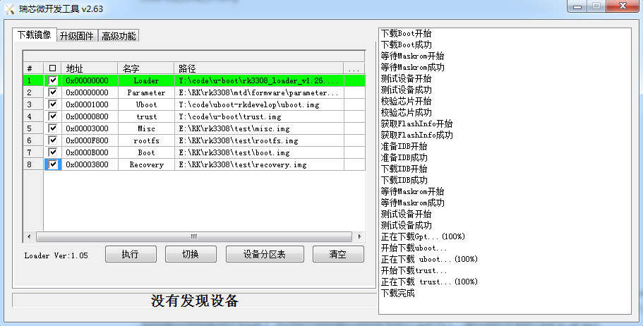

# U-Boot MTD Block Device Design

发布版本：1.1

作者邮箱：jason.zhu@rock-chips.com

日期：2019.06

文件密级：内部资料

------

**前言**

**概述**

U-Boot 下 MTD block device 设计介绍。

**读者对象**

本文档（本指南）主要适用于以下工程师：

技术支持工程师

软件开发工程师

**产品版本**

**修订记录**

| **日期**   | **版本** | **作者**  | **修改说明** |
| ---------- | -------- | --------- | ------------ |
| 2019-05-20 | V1.0     | Jason Zhu | 初始版本     |
| 2019-06-18 | V1.1     | Jason Zhu | 修改分区支持,更新 step by step 章节 |

------

[TOC]

------

## 1 引用参考

[1].《Rockchip-Developer-Guide-UBoot-nextdev-CN.md》

[2].《Rockchip-Developer-Guide-Uboot-mmc-device-driver-analysis.md》

## 2 术语

MTD：Memory Technology Device 即内存技术设备。

## 3 简介

设计 MTD block 层，兼容目前 block 设备接口。

## 4 设计

### 4.1 MTD block 设计

设计 mtd bread & bwrite & berase 三个函数，通过 desc->devnum 来区分挂接的不同 MTD 设备，这样上层可以直接调用 blk_dread & blk_dwrite & blk_derase 操作 MTD 设备。代码位于 drivers/mtd/mtd_blk.c。

### 4.2 多设备挂接设计

对于 block 设备，会依据 if_type 与 devnum 来找挂接在 block 设备下的驱动。对于挂接在 block 设备下的 MTD 驱动，定义 if_type 为 IF_TYPE_MTD。devnum 在设备驱动在与 block 层 bind 时传递。例：

```c
static int rockchip_nandc_bind(struct udevice *udev)
{
    ...
	blk_create_devicef(udev, "mtd_blk", "blk", IF_TYPE_MTD,
                    devnum, 512, 0, &bdev);
    ...
｝
```

devnum 为不同设备，目前 nand 设备有 nand，spi nand, spi nor 分别为 0，1，2。

MTD block 不同设备间切换：

```
mtd dev <devnum>
```

读写擦除接口挂接：

```c
ulong mtd_dread(struct udevice *udev, lbaint_t start,
		lbaint_t blkcnt, void *dst)
{
	struct blk_desc *desc = dev_get_uclass_platdata(udev);

	if (desc->devnum == BLK_MTD_NAND) {
		/* nand驱动*/
	} else if (desc->devnum == BLK_MTD_SPI_NAND) {
		/* spi nand驱动 */
	} else if (desc->devnum == BLK_MTD_SPI_NOR) {
		/* spi nor驱动 */
	}
}

ulong mtd_dwrite(struct udevice *udev, lbaint_t start,
		 lbaint_t blkcnt, const void *src)
{
	struct blk_desc *desc = dev_get_uclass_platdata(udev);

	if (desc->devnum == BLK_MTD_NAND) {
		/* nand驱动*/
	} else if (desc->devnum == BLK_MTD_SPI_NAND) {
		/* spi nand驱动 */
	} else if (desc->devnum == BLK_MTD_SPI_NOR) {
		/* spi nor驱动 */
	}
}

ulong mtd_derase(struct udevice *udev, lbaint_t start,
		 lbaint_t blkcnt)
{
	struct blk_desc *desc = dev_get_uclass_platdata(udev);

	if (desc->devnum == BLK_MTD_NAND) {
		/* nand驱动*/
	} else if (desc->devnum == BLK_MTD_SPI_NAND) {
		/* spi nand驱动 */
	} else if (desc->devnum == BLK_MTD_SPI_NOR) {
		/* spi nor驱动 */
	}
}
```

### 4.3 分区表设计

兼容 GPT 分区表，注意 nand flash 与 spi flash 尾部需要保留 4 个 blocks 用于保存坏块表。

### 4.4 新增 CONFIG

增加 CONFIG_MTD_BLK、CONFIG_CMD_MTD，支持 mtd block device。

### 4.5 驱动挂接框图


## 5 step by step

1. 对应的 defconfig 添加

```
CONFIG_MTD_BLK=y
CONFIG_CMD_MTD=y
```

其他 nand 的配置可以参考<https://10.10.10.29/#/c/android/rk/u-boot/+/75116/>。

2. 更新支持 mtd 的 laoder，rk3308 补丁地址<https://10.10.10.29/#/c/rk/rkbin/+/75644/>。
3. 编译 uboot，例如编译 rk3308

```
./make.sh evb-rk3308
```

4. 更改支持 GPT 的 parameter.txt，例如：

```
FIRMWARE_VER:8.1
MACHINE_MODEL:RK3308
MACHINE_ID:007
MANUFACTURER: RK3308
MAGIC: 0x5041524B
ATAG: 0x00200800
MACHINE: 3308
CHECK_MASK: 0x80
PWR_HLD: 0,0,A,0,1
TYPE: GPT
CMDLINE:mtdparts=rk29xxnand:0x00000800@0x00001000(uboot),0x00000800@0x00000800(trust),0x00000100@0x00002000(pa),0x00000800@0x00003000(misc),0x00007800@0x00003800(recovery),0x00004800@0x0000B000(boot),0x00020000@0x0000F800(rootfs),-@0x0002F800(data:grow)
```

5. 烧写固件



6. 成功启动 log

```
......
U-Boot 2017.09-02976-g47b3c04-dirty (Jun 19 2019 - 17:02:46 +0800)
......
Device 0: nand_base: Could not find valid JEDEC parameter page; aborting //正常错误打印
Vendor: 0x2207 Rev: V1.00 Prod: MTD                                      //MTD设备初始化
            Type: Hard Disk
            Capacity: 255.5 MB = 0.2 GB (523264 x 512)
... is now current device
Bootdev: mtd 0                  //Bootdev为MTD设备
PartType: EFI                   //使用GPT分区
......
Starting kernel ...
......
[    0.000000] Kernel command line: storagemedia=mtd androidboot.storagemedia=mtd androidboot.mode=normal  mtdparts=rk-nand:0x200000@0x400000(uboot),0x200000@0x600000(trust),0x100000@0x800000(misc),0xc00000@0x900000(recovery),0x900000@0x1500000(boot),0x2a00000@0x1e00000(rootfs),0x1a00000@0x4800000(oem),-@0x6200000(userdata:grow) androidboot.slot_suffix= androidboot.serialno=c3d9b8674f4b94f6  rootwait earlycon=uart8250,mmio32,0xff0c0000 swiotlb=1 console=ttyFIQ0 ubi.mtd=5 root=ubi0:rootfs rootfstype=ubifs snd_aloop.index=7    //mtdparts为调整过的分区表，单位为Byte
                                      //ubi.mtd指定分区中rootfs的位置
......
```
