# **USB SQ Test Guide**

发布版本:1.0

作者邮箱:wulf@rock-chips.com

日期:2017.12.12

文档密级：公开资料

---------
# 前言

**概述**

本文档提供Rockchip平台USB 2.0/3.0信号完整性测试的方法。

USB 2.0信号完整性测试，包括：高速(High Speed)、全速(Full Speed)和低速(Low Speed)模式，测试项包括: High Speed Signal Quality、 Packet Parameters、 CHIRP Timing、 Suspend/Resume/Reset Timing、Test J/K、 SE0_NAK、Receiver Sensitivity 等。本文档只提供常用的 High Speed Signal Quality的测试方法。

USB 3.0信号完整性测试 ，包 括 Tx compliance test 和 Rx compliance test 。 由 于 Rx compliance test 的测试环境和测试方法比较复杂，所以本文档没有提供详细的Rx测试方法，只提供 Tx的详细测试方法和Rx的测试原理说明。

Rockchip SOCs通常内置多个USB控制器，不同控制器之间互相独立，请在对应的芯片TRM中获取详细信息。因为不同的USB控制器，使用的测试命令和测试方法有所不同，所以测试USB信号完整性前，请先明确测试的USB接口所对应的USB控制器。

本文档提供的测试方法适用于Agilent、Tektronix、LeCroy示波器和USB测试夹具。

**产品版本**
| **芯片名称**                                 | **内核版本** |
| ---------------------------------------- | -------- |
| 所有芯片(包括29系列、30系列、31系列、32系列、33系列、PX系列、Sofia、1108) | 所有内核版本   |

**读者对象**
本文档（本指南）主要适用于以下工程师：
硬件工程师
软件工程师
技术支持工程师

**修订记录**
| **日期**     | **版本** | **作者** | **修改说明**                 |
| ---------- | ------ | ------ | ------------------------ |
| 2017.12.12 | V1.0   | 吴良峰    | 初始版本                     |
| 2018.3.7   | V1.1   | 吴良峰    | 增加rk3399 Type-C反面测试命令    |
| 2018.3.30  | V1.2   | 吴良峰    | 增加RK3229/RK3326/PX30测试命令 |
| 2018.5.21  | V1.3   | 吴良峰    | 修正USB3.0 测试方法            |

--------------------
[TOC]
------
# 1 USB 2.0 SQ Test
## 1.1 USB 2.0 测试内容

- 眼图测试
- 信号速率
- 包尾宽度
- 交叉电压范围(用于低速和全速)
- JK 抖动、KJ 抖动
- 连续抖动
- 单调性测试(用于高速)
- 上升下降时间

## 1.2 USB 2.0 测试命令和测试工具

USB 2.0 SQ的测试原理是，设置USB控制器的Test Control寄存器，使USB控制器进入Test Packet Mode，USB控制器就会持续产生并发送周期性的Test Pattern。USB示波器通过检测Test Pattern的波形来分析USB的信号完整性。
对于Rockchip平台的USB 2.0 Device和USB 2.0 Host接口，设置USB控制器进入Test Packet Mode的方法有所不同：

- USB 2.0 Device，可以使用测试命令或者测试工具设置USB控制器进入Test Packet Mode
- USB 2.0 Host，只能使用测试命令设置USB控制器进入Test Packet Mode

### 1.2.1 USB 2.0 Device 测试命令和测试工具

**测试命令**

测试命令如下表1-1所示，可以通过串口或者ADB执行命令。

表1-1 USB 2.0 Device SQ测试命令

|                   芯片名称                   | DWC2_0 OTG 2.0 Device |    DWC3_0 OTG 2.0 device    |    DWC3_1 OTG 2.0 device    |
| :--------------------------------------: | :-------------------: | :-------------------------: | :-------------------------: |
|   RK29XX<br />RK30XX<br />RK31XX<br />   | io -4 0x10180804 0x40 |             N.A             |             N.A             |
|         RK3228<br />RK3229<br />         | io -4 0x30040804 0x40 |             N.A             |             N.A             |
| RK3288<br />RK3228H<br/>RK3328<br />RK3368<br /> | io -4 0xff580804 0x40 |             N.A             |             N.A             |
|                  RK3308                  | io -4 0xff400804 0x40 |             N.A             |             N.A             |
|          RK3326<br />PX30<br />          | io -4 0xff300804 0x40 |             N.A             |             N.A             |
|                  RV1108                  | io -4 0x30180804 0x40 |             N.A             |             N.A             |
|                SOFIA-3GR                 | io -4 0xe2100804 0x40 |             N.A             |             N.A             |
|                  RK3366                  | io -4 0xff4c0804 0x40 | io -4 0xff50c704 0x8c000a08 |             N.A             |
|                  RK3399                  |          N.A          | io -4 0xfe80c704 0x8c000a08 | io -4 0xfe90c704 0x8c000a08 |

**测试工具**

Rockchip平台的USB 2.0 Device SQ测试，除了可以使用上述的测试命令外，还可以使用 USB-IF 官方组织提供的 USB HSET 测试工具，下载工具“USBHSET for EHCI”或者“USBHSET for XHCI”,
下载地址如下:
for EHCI：
32 bit： http://www.usb.org/developers/tools/usb20_tools/EHSETT_Releasex86_1.3.1.1.exe
64 bit： http://www.usb.org/developers/tools/usb20_tools/EHSETT_Releasex64_1.3.1.1.exe

for xHCI：
32 bit： http://www.usb.org/developers/tools/XHSETT_Releasex86_1.3.2.2.exe
64 bit： http://www.usb.org/developers/tools/XHSETT_Releasex86_1.3.2.2.exe

测试工具的简单使用步骤如下：

1. 将待测试的USB device口通过USB线连接到PC

2. 打开测试工具，选择“Device”,然后点击“TEST”按钮，如下图 1-1 所示

   

   ​          									图1-1 选择测试类型

3. 如图 1-2所示，选择要测试的设备和测试命令”TEST PACKET”，然后点击“EXECUTE”按钮所示，执行完上述操作后，USB控制器就会自动进入Test Packet Mode，并连续发送周期性的测试包，测试波形如图 1-3 所示：

   

   ​								图1-2 选择测试设备和测试命令

   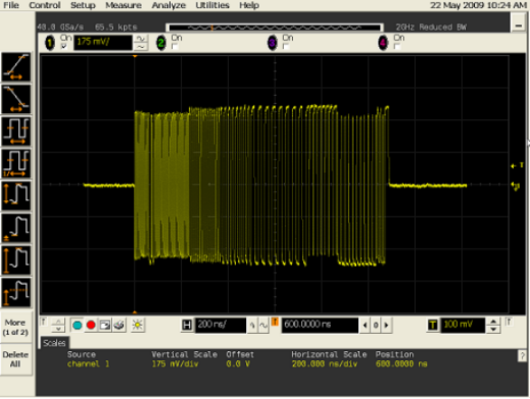

   ​										图1-3 测试波形

### 1.2.2 USB 2.0 Host 测试命令

USB 2.0 Host SQ测试，只能使用测试命令，没有专门的测试工具。测试命令如表1-2，表1-3，表1-4所示，测试命令可以通过ADB或者串口执行。

表1-2 USB 2.0 Host 测试命令(a)

|                 芯片名称                 |    DWC2 OTG Host 2.0    |      DWC2 Host 2.0      |     EHCI_0 Host 2.0      |
| :----------------------------------: | :---------------------: | :---------------------: | :----------------------: |
| RK29XX<br />RK30XX<br />RK3188<br /> | io -4 0x10180440 0x8000 | io -4 0x101c0440 0x8000 |           N.A            |
|                RK312X                | io -4 0x10180440 0x8000 | io -4 0x101c0440 0x8000 | io -4 0x101c0054 0x40000 |
|       RK3228<br />RK3229<br />       | io -4 0x30040440 0x8000 |           N.A           | io -4 0x30080054 0x40000 |
|                RK3288                | io -4 0xff580440 0x8000 | io -4 0xff540440 0x8000 | io -4 0xff500054 0x40000 |
|                RK3308                | io -4 0xff400440 0x8000 |           N.A           | io -4 0xff440054 0x40000 |
|        PK3326<br />PX30<br />        | io -4 0xff300440 0x8000 |           N.A           | io -4 0xff340054 0x40000 |
|      RK3228H<br />RK3328<br />       | io -4 0xff580440 0x8000 |           N.A           | io -4 0xff5c0054 0x40000 |
|                RK3366                | io -4 0xff4c0440 0x8000 |           N.A           | io -4 0xff480054 0x40000 |
|                RK3368                | io -4 0xff580440 0x8000 |           N.A           | io -4 0xff500054 0x40000 |
|                RV1108                | io -4 0x30180440 0x8000 |           N.A           | io -4 0x30140054 0x40000 |
|              SOFIA-3GR               | io -4 0xe2100440 0x8000 |           N.A           |           N.A            |
|                RK3399                |           N.A           |           N.A           | io -4 0xfe380054 0x40000 |

表1-3 USB 2.0 Host 测试命令(b)

|           芯片名称           |     EHCI_1 Host 2.0      |     EHCI_2 Host 2.0      |    EHCI_HSIC Host 2.0    |
| :----------------------: | :----------------------: | :----------------------: | :----------------------: |
| RK3168<br />RK3188<br /> |           N.A            |           N.A            | io -4 0x10240054 0x40000 |
|          RK3288          |           N.A            |           N.A            | io -4 0xff5c0054 0x40000 |
| RK3228<br />RK3229<br /> | io -4 0x300c0054 0x40000 | io -4 0x30100054 0x40000 |           N.A            |
|          RK3368          |           N.A            |           N.A            | io -4 0xff5c0054 0x40000 |
|          RK3399          | io -4 0xfe3c0054 0x40000 |           N.A            | io -4 0xfe340054 0x40000 |

表1-4 USB 2.0 Host 测试命令(c)

|  芯片名称   |     DWC3_0 OTG Host 2.0     |     DWC3_1 OTG Host 2.0     |
| :-----: | :-------------------------: | :-------------------------: |
| RK3228H | io -4 0xff600424 0x40000000 |             N.A             |
| RK3366  | io -4 0xff500424 0x40000000 |             N.A             |
| RK3399  | io -4 0xfe800424 0x40000000 | io -4 0xfe900424 0x40000000 |

## 1.3 USB 2.0 测试环境

测试USB 2.0 SQ，需要使用已安装USB专业测试软件的示波器，比如Agilent 9000系列示波器（或90000系列）、Tektronix、LeCroy系列的示波器。本文档主要介绍Agilent 9000系列示波器的USB 2.0测试环境，需要的工具如下：

- MSO9254A示波器，安装USB 2.0测试软件N5416A

- 113xA差分有源探头

- E2678A差分探头前端

- E2649-66401 device夹具和E2649-66402 host夹具

- USB 2.0 cable

  USB 2.0 cable的线材需要严格符合USB 2.0 Spec的规定，如果USB cable的线长小于10cm，则眼图测试时，应采用Near End 模板，如果线长大于10cm，则眼图测试应采用Far End模板。近端（Near End）测试时，如果使用太长的USB线缆或者USB线缆的阻抗匹配不好，可能导致眼图测试指标不通过。

## 1.4 USB 2.0 测试步骤

**1). 搭建测试环境**

如果使用的是Agilent的测试套件，测试环境的搭建和示波器的设置方法，请参考如下的文档：

《Agilent N5416A USB 2.0 Compliance Test Option》

《Agilent USB2.0 High Speed Device SQ Test》

如果使用的是Tektronix或LeCroy的测试套件，请到Tektronix和LeCroy的官网上搜索测试说明文档。

以Agilent示波器测试USB2.0 Device SQ为例，搭建好的测试环境如图1-4所示：

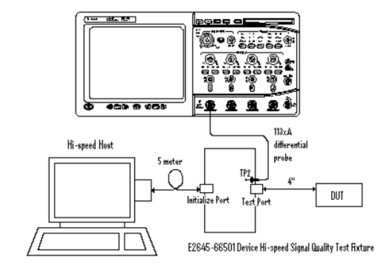

​								图1-4 Agilent USB 2.0 SQ测试环境

**2). 设置USB进入测试模式[Test Packet Mode]**

设置USB控制器进入Test Mode前，需要先确认USB已经可以正常通信。

如果是测试USB 2.0 OTG Device接口，要保证待测试的USB口已经通过测试夹具和线缆连接到PC，并且PC可以正常识别到USB设备。然后，再通过[1.2.1节](#1.2.1 USB 2.0 Device 测试命令和测试工具)提到的PC端测试工具，或者使用 ADB (或串口)发送[1.2.1节](#1.2.1 USB 2.0 Device 测试命令和测试工具)的测试命令，设置USB控制器进入测试模式。

如果测试USB 2.0 Host接口，不同的示波器和测试夹具，设置USB控制器进入测试模式的方法有所不同，下面分别对使用Agilent测试套件和使用Tektronix测试套件的设置方法做简要说明：

**a). Agilent测试套件**

先将待测的Host口连接到测试夹具的测试接口一端，然后将高速设备（如U盘）连接到夹具的另一端接口，如下图1-5，再执行测试命令，设置USB进测试模式。


​							图1-5 Agilent USB 2.0 SQ测试夹具连接方法

**b). Tektronix测试套件**

如果使用Tektronix的测试夹具，由于测试夹具上只有一个接口用于连接待测的HOST口，无法再连接其他高速设备，所以，先断开待测的Host接口与测试夹具连接，然后将高速USB设备（如U盘）插到待测试的HOST口，再执行测试命令，等测试命令发送完成后，USB控制器就会自动进入测试模式，然后再拔出高速USB设备，将测试夹具连接到待测试的Host接口，开始测试。

**Note：**测试USB 2.0 Host接口，必须在Host口上接一个**高速USB设备**(如U盘)，不能接鼠标、键盘等全速或者低速的USB设备。

**3). USB自动化测试软件分析波形**

在USB控制器成功进入测试模式后，会产生并发送持续的Test Packet Pattern，可以从示波器观察到周期性的测试波形，如图1-6所示。示波器的USB自动化测试软件，会自动对测试波形进行分析，并生成完成的测试报告。


​								图1-6 USB 2.0 信号质量分析界面

## 1.5 USB 2.0 测试结果分析

### 1.5.1 USB 2.0 标准眼图分析

USB 2.0眼图模板有两种不同的标准：近端（Near End）和远端（Far End）。在High Speed Signal Quality测试中，若待测USB的端口直接通过小于10cm的线缆与测试夹具相连，则采用Near End眼图模板。若待测的USB端口通过大于10cm的线缆与测试夹具相连，则采用Far End眼图模板。在Rockchip平台的USB 2.0眼图测试中，为保证USB 2.0信号质量的可靠性，建议统一采用更为严格的Near End眼图模块作为参考标准。图1-7和图1-8分别是使用Near End和Far End眼图模板的标准USB眼图。


​							图1-7 USB 2.0 High-speed Near End SQ Eye Diagram


​						   图1-8 USB 2.0 High-speed Far End SQ Eye Diagram

从图1-7和图1-8中，可以看出，标准的USB 2.0眼图呈现为一个迹线又细又清晰的“眼睛”，“眼”张开得很大。当有码间串扰时，波形失真，码元不完全重合，眼图的迹线就会不清晰，引起“眼”部分闭合。若再加上噪声的影响，则使眼图的线条变得模糊，“眼”开启得小了，因此，“眼”张开的大小表示了失真的程度，反映了码间串扰的强弱。

### 1.5.2 USB 2.0 SQ测试常见问题分析

**1).  示波器无法检测到眼图测试的触发信号**

- 检查测试夹具是否连接正确，以及示波器的USB测试软件是否设置正确
- 从示波器上观察是否有检测到如图1-3的周期性测试波形
- 如果没有图1-3的周期性测试波形，可能是测试命令没有执行成功或者测试命令有误

**2). 测试的眼图严重失真**

测试的眼图严重失真，比如幅度失真、信号塌陷，一般是因为测试的操作方法有误。

如图1-9所示，USB眼图的信号幅度比标准的大一倍，如果使用的是Agilent测试套件，一般是因为测试夹具的D+和D-没有挂上50欧的终端SMA电阻。

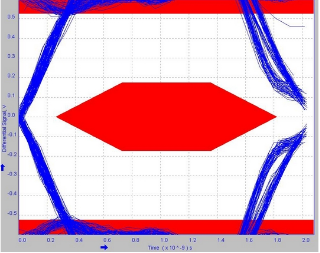

​									    图1-9 USB眼图幅度失真

如图1-10所示，USB眼图的信号中间有明显的塌陷，如果使用的是Agilent测试套件，一般是因为没有将测试夹具的开关切到ON档。

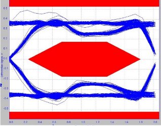

​									图1-10 USB眼图信号塌陷失真

**3). USB眼图没有张开**

如图1-11所示，USB眼图没有张开，会压到USB眼图的测试模板。

- 检查USB的DP和DM线上是否连接了内部电容较大的ESD或者电子开关，如果有，可以去掉这些器件再测试
- 通过软件调整USB PHY的驱动强度和上升沿、下降沿，请联系负责USB驱动的工程师协助调试。


​									   图1-11 USB眼图没有张开

**4). USB眼图模糊甚至布满血丝**

如图1-12所示，USB眼图的轮廓线条模糊，说明USB的串扰十分严重，还可能存在阻抗不匹配、噪声干扰的问题。

- 检查USB的DP和DM线上是否连接了内部电容较大的ESD或者电子开关，如果有，可以去掉这些器件再测试
- 检查测试使用的USB线缆是否存在阻抗不匹配的问题，或者换条USB线缆重新测试
- 检查USB的PCB走线、USB的24MHz时钟源、USB PHY的供电电源纹波


​										图1-12 USB眼图模糊

-----
# 2 USB 2.0 HUB SQ Test

USB 2.0 HUB的SQ test包括了upstream ports和downstream ports，但实际应用中，我们一般只需测试提供给用户使用的downstream ports。因此，本文档只提供了测试USB2.0 HUB downstream ports的SQ测试方法。

常见的USB 2.0 HUB芯片型号主要有：FE1.1、FE1.1S、GL850、GL852、USX2064、HX2VL等。常见的HSIC HUB型号主要有：USB4604、GL850H。对于USB 2.0 HUB，Rockchip平台有两种测试方法，详见下面的方法1-命令测试和方法2-脚本测试，对于**HSIC HUB**，只能使用方法2-脚本测试。

**方法1-命令测试**

该测试方法使用的测试命令与“[1.2.2 USB 2.0 Host 测试命令](#1.2.2 USB 2.0 Host 测试命令)”一样，测试步骤如下：

- 确定HUB连接的USB HOST控制器，然后查表1-2，表1-3，表1-4，找到HOST控制器对应的测试命令
- 参考“[1.4 测试步骤](#1.4 测试步骤)”，完成HUB的所有downstream ports的SQ测试

**Note**：不同的HUB downstream ports，测试命令和测试方法都是一样的。

**方法2-脚本测试**

相比方法1-命令测试，方法2-脚本测试比较复杂，需要编译和运行脚本，但更具有通用性，可以测试所有类型的HUB，包括USB 2.0 HUB和HSIC HUB。

**1). 编译测试脚本**

脚本源码和编译方法见“usb2_hub_Compliance_test_script”，该脚本适用于Linux-3.3以后的内核，更早的kernel版本请自行修改测试脚本源码。

**2). 执行测试脚本**

将编译生成的可执行文件linux-eye拷贝到系统的data目录下，并 执行命令

`chmod 777 linux-eye`

执行测试脚本linux-eye，然后，根据脚本的提示，输入测试命令，参考如下：

```
[root@hari LinuxEye]# ./linuxEye
LinuxEye - select one of the following hub for testing.
[ 0] 4-port Full-Speed hub at tier 2 of Bus 3
(VID: 0451, PID: 1446, Address: 3)
[ 1] 4-port High-Speed hub at tier 2 of Bus 1
(VID: 1A40, PID: 0101, Address: 15)
[ 2] 4-port High-Speed hub at tier 2 of Bus 1
(VID: 1A40, PID: 0101, Address: 10)
[ 3] 7-port High-Speed hub at tier 3 of Bus 1
(VID: 1A40, PID: 0201, Address: 50)
Please enter [0 ~ 3] to select a hub or 'q' to quit: 2 （表示共有4个HUB， 测试HUB[2]）
[ 1] is connected to Low-Speed device
[ 2] is open
[ 3] is connected to High-Speed device
[ 4] is connected to Low-Speed device
Please enter [1 ~ 4] to select a port or 'q' to quit: 2 （表示测试HUB的第2个port）
LinuxEye - Start testing port 2 of device 10 on bus 1
Type 'q' to stop the test: q (退出测试脚本)
[root@hari LinuxEye]#
```

----
#  3 USB 3.0 Compliance Test

USB 3.0是双总线架构，在USB 2.0的基础上增加了超高速(Super Speed)总线部分。超高速总线的信号速率达到5Gbps， 采用ANSI 8b/10b编码，全双工方式工作，最大支持的电缆长度达3米。如下图3-1是典型的USB3.0的总线架构。

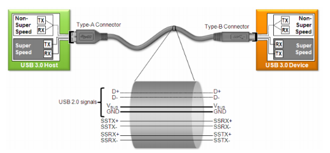

​									图3-1 USB 3.0 总线架构

## 3.1 USB 3.0 新增测试规范

- 一致性校准和测试在一致性通道末端进行

  一致性通道用来表征测试TX和RX时最差的互连通道情况

  Host：**3米电缆+5英寸的走线**

  Device：**3米电缆+11英寸走线**


- TX测试允许使用通道嵌入,选择黄金S参数做嵌入测试


- 需要计算基于10e-12误码率的DJ，RJ和TJ

  增加了10MHz，20MHz 和33MHz一致性Pj测试频点


- 后处理需要使用CTLE均衡器，在均衡器后观察和分析眼图及其参数。由于5Gbps的信号经过长电缆和PCB传输以后有可能眼图就张不开了，所以USB 3.0的芯片接收端内部会提供CTLE(连续时间线性均衡)功能以补偿高频损耗。所以测试时示波器的测试软件也要能支持CTLE才能得到真实的结果。


- Device 接收端眼图幅度校准标准为145mVp-p


- Host 接收端眼图幅度标准为180mVpp

USB 3.0的电气性能测试分为**发送信号测试(Tx)**、**接收容限测试(Rx Tolerance Compliance Test)**以及电缆/连接器的测试。

## 3.2 USB 3.0 Tx Compliance Test

### 3.2.1 USB 3.0 Tx 测试要求

在进行发送端测试时，要求测试对象发出特定的测试码型，实时示波器对该码型进行眼图分析，测量信号的幅度、抖动、平均数据率及上升∕下降时间。USB3.0针对超高速部分的信号测试与以前USB2.0的测试方法有较大的不同。

首先，由于USB3.0 SuperSpeed的信号速率达到5Gbps，同时信号的幅度更小，因此测试中需要**12GHz以上带宽**的示波器，同时要示波器的底噪声更低才能保证准确的测量。

其次， USB 3.0 发送端测试，不是用夹具直接连接DUT，其定义的被测点是“**一致性通道** ( Compliance Channel)” 的末端。一致性通道模拟PCB走线和电缆对信号的影响。对于HOST的测试，它模拟的是3m长电缆＋5英寸PCB走线的影响；对于Device的测试，它模拟的是3m长电缆＋11英寸PCB走线的影响。USB3.0的测试规范里会以S参数文件的形式提供一致性通道的模型。在真正测试时是用测试夹具直接连接DUT，然后用示波器的S参数嵌入的方式加入通道影响。如图3-2 Tx测试模型，TP1为示波器的测试点。


​									图3-2 USB 3.0 Tx测试模型 

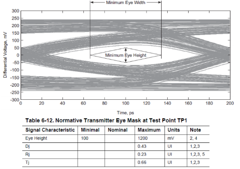

​								   图3-3 USB 3.0 Tx测试眼图要求

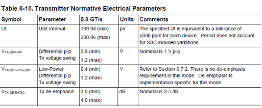

​								  图3-4 USB 3.0 Tx测试电气参数要求

### 3.2.2 USB 3.0 Tx 测试项目

- LFPS(近端)
- SSC(近端)
- Tx(近端/远端）：眼图；Tj， Rj， Dj；幅度；


​								图3-5 Agilent USB 3.0 Tx测试选项

### 3.2.3 USB 3.0 Tx 测试模式

根据USB 3.0 spec规定，USB 3.0控制器要先进入测试模式(Compliance Mode)，才能开始USB 3.0 Tx的信号完整性测试。如图3-6所示，在Polling阶段的**第一个LFPS timeout**后，控制器就会从Polling.LFPS退出到Compliance Mode。


​						图3-6 USB 3.0 进入Compliance Mode的流程

### 3.2.4 USB 3.0 Tx 测试环境

**1). Agilent USB 3.0 Tx测试套件**

对于USB 3.0 Tx信号的测试，Agilent 推荐使用 90000 系列示波器(提供高达13GHz 的带宽)， 配上自动的一致性测试软件U7243A 和测试夹具U7242A来完成USB 3.0 规范要求的发送端测试和验证。


​							图3-7 Agilent USB 3.0 Tx测试环境


​							图3-8 Agilent USB 3.0 Tx测试夹具U7242

此外，Agilent 还提供了USB 3.1 Gen1 Type-C测试夹具N7015A，如下图3-9，用于测试USB 3.0/3.1 Type-C接口的信号完整性，测试软件与U7242A夹具一样。Type-C测试夹具的具体使用方法，请参考文档《Keysight N7015A-16A Type-C Test Kit》。


​								图3-9 Agilent USB 3.0 Type-C测试夹具N7015A

 

**2). Tektronix USB 3.0 Tx 测试套件**

Tektronix的Tx测试示意图如图3-10所示，Tektronix USB 3.0 发射机测量（选项USB-Tx）适用于 DPO/MSO70000 系列示波器，提供了自动 USB 3.0发射机解决方案。

具体测试方案请参考：https://www.tek.com.cn/datasheet/usb3-transmitter-and-receiver-solutions-datasheet


​								图3-10 Tektronix USB 3.0 Tx测试示意图

### 3.2.5 USB 3.0 Device Tx 测试方法

本文档主要说明使用Agilent 90000系列示波器(型号：DSO91204A和测试夹具U7242A)的USB 3.0 Device Tx测试方法。如果使用的是Tektronix或者LeCroy的示波器，请自行搜索Tektronix和LeCroy官方发布的测试指南。

**测试注意事项：**

1). 测试USB 3.0 Device Tx时，**不用输入任何测试命令**，只要按照示波器测试软件提示的测试步骤操作，将待测试的Device USB口连接到测试夹具，USB 3.0控制器就会自动进入Compliance mode。而**测试host Tx时，需要输入测试命令**，具体命令将在[3.2.6 USB 3.0 Host Tx 测试方法](#3.2.6 USB 3.0 Host Tx 测试方法)章节中详细描述。

2). 执行如下命令，可以查询USB 3.0控制器是否进入Compliance mode：

​     `cat /sys/kernel/debug/xxxx.dwc3/link_state    (xxxx表示USB3控制器基地址)`

​     返回的值如果为“compliance”，表示控制器已进入Compliance mode

3). 测试USB 3.0 Device Tx时，**VBus 5V不能自供电，否则会导致USB 3.0控制器无法进入Compliance mode**。VBus的供电需要由测试夹具U7242A提供，可以通过USB线将测试夹具的USB供电口与示波器或者PC的USB口连接，实现VBus 5V的供电。

 **USB 3.0 Device Tx测试步骤**

**1). 自动化测试软件设置**

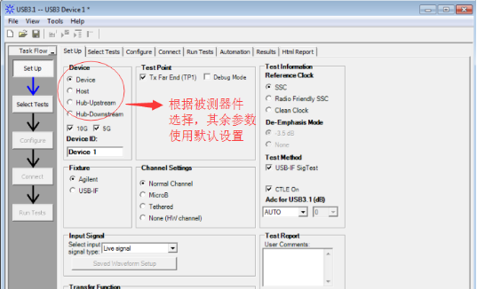

​							图3-11 USB 3.0 Device Tx测试软件设置界面

**Note：**

a). 使用的测试软件版本为**V2.01**，如果使用更新的测试版本(如V3.00.0001)，软件设置方法会有所不同

b). Channel Setting的设置方法如下：

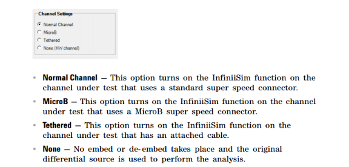

​					图3-12 USB 3.0 Device Tx测试软件中Channel的设置方法

Channel Settings默认选择Normal Channel，即嵌入S参数，来模拟3m长usb cable + 5’’PCB走线的影响。因此，要求测试时，用测试夹具直接连接待测试设备（DUT）。如果测试使用的usb cable太长（大于10 cm），可能导致Far End测试项fail，建议Channel Settings选择None，或者使用小于10cm的短线测试。

**2). 选择测试项目**

勾选All USB3 Tests，可选择全部USB 3.0 Tx一致性测试项目。


​							图3-13 USB 3.0 Device Tx测试项的设置

**3).  配置测试条件**

将Automate Test Pattern Change设置为Auto，其余使用默认配置即可。


​							图3-14 USB 3.0 Device Tx测试条件设置

**4). 连接示波器、夹具和待测USB设备**

按照示波器的提示进行连接，如下图所示。VBus 5V供电也要连接。


​							图3-15 USB 3.0 Device Tx测试连接示意图

**5). 开始Tx测试**

5.1). 测试过程中，自动化软件提示测试LFPS的操作方法


​									图3-16 LFPS测试界面

**Note**：进行LFPS测试前，要先断开USB3.0夹具和被测件，然后点击“OK”，再重新连接到夹具。

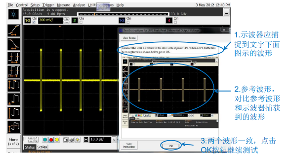

​							图3-17 USB 3.0 Device Tx LFPS参考波形

5.2). LFPS测试完成后，开始SSC测试，自动化软件提示更改示波器、夹具和被测件的连接


​							图3-18 USB 3.0 Device Tx SSC测试

 5.3). SSC测试完成后， 开始眼图/抖动测试，自动化软件提示更改示波器、夹具和被测件的连接。


​						图3-19 USB 3.0 Device Tx眼图及抖动测试

5.4). 测试完成，自动生成测试报告，查看测试报告


​								图3-20 USB 3.0 Device Tx测试报告


​							图3-21  USB 3.0 Device Tx LFPS Burst Width

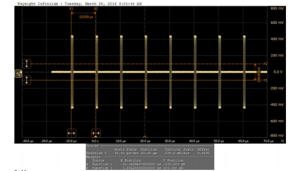

​						图3-22 USB 3.0 Device Tx LFPS Repeat Time Interval


​						图3-23 USB 3.0 Device Tx Short Channel Eye Diagram


​							图3-24 USB 3.0 Device Tx Far End Eye Diagram

### 3.2.6 USB 3.0 Host Tx 测试命令

Android平台和Chrome平台的USB 3.0 Host Tx测试命令有所不同，以下分别说明。

**1). Android 平台USB 3.0 Host Tx测试命令**

Android平台支持两种不同的测试命令，一种是io命令写寄存器的方式，另外一种是写内核设备节点的方式。**推荐优先使用写内核节点的方式，尤其是3399平台**。

**1.1)  Android平台io测试命令**

表3-1 USB 3.0 Host Tx测试命令-Android平台

|  芯片名称   |           DWC3_0 OTG Host 3.0            |      DWC3_1 OTG Host 3.0       |
| :-----: | :--------------------------------------: | :----------------------------: |
| RK3228H | io -4 0xff478408 0x0000000c<br />io  -4  0xff600430  0x0a010340 |              N.A               |
| RK3366  |      io  -4  0xff500430  0x0a010340      |              N.A               |
| RK3399  |      io  -4  0xfe800430  0x0a010340      | io  -4  0xfe900430  0x0a010340 |

**Note**： RK3228H 需要两条测试命令，其中命令“io -4 0xff478408 0x0000000c”是为了触发CP1 test pattern。

**1.2)  Android平台写内核设备节点的方法[推荐优先使用]**

 **echo test_u3 > /sys/kernel/debug/usb3控制器节点/host_testmode**

其中，“usb3控制器节点”应该根据芯片的USB 3.0控制器节点的名称进行修改。

比如，**rk3399**平台的USB3 Host Tx测试命令如下：

**rk3399 Type-C USB正面连接的测试命令：**

Type-C0 USB：`echo test_u3 > /sys/kernel/debug/usb@fe800000/host_testmode`

Type-C1 USB：`echo test_u3 > /sys/kernel/debug/usb@fe900000/host_testmode`

**rk3399 Type-C USB反面连接的测试命令：**

Type-C0 USB flip：`echo test_flip_u3 > /sys/kernel/debug/usb@fe800000/host_testmode`

Type-C1 USB flip：`echo test_flip_u3 > /sys/kernel/debug/usb@fe900000/host_testmode`

**2).  Chrome平台USB 3.0 Host Tx测试命令**

Chrome平台可使用表3-1和表3-2两种测试命令，效果一样，但Chrome平台不支持写内核设备节点的方法。

表3-2 USB 3.0 Host Tx测试命令-Chrome平台

|  芯片名称   |           DWC3_0 OTG Host 3.0            |      DWC3_1 OTG Host 3.0       |
| :-----: | :--------------------------------------: | :----------------------------: |
| RK3228H | mem w 0xff478408 0x0000000c<<br />mem  w  0xff600430  0x0a010340 |              N.A               |
| RK3366  |      mem  w  0xff500430  0x0a010340      |              N.A               |
| RK3399  |      mem  w  0xfe800430  0x0a010340      | mem  w  0xfe900430  0x0a010340 |

### 3.2.7 USB 3.0 Host Tx测试方法

本文档主要说明使用Agilent 90000系列示波器(型号：DSO91204A和测试夹具U7242A)的USB 3.0 Device Tx测试方法。如果使用的是Tektronix或者LeCroy的示波器，请自行搜索Tektronix和LeCroy官方发布的测试指南。

**USB 3.0 Host Tx 测试注意事项：**

- 如果是测试 **Type-A USB3.0** 接口，测试前，**先将USB 3.0 Disk插入待测试的USB 3.0接口**，并通过串口log确认待测试的USB 3.0接口和固件是否支持USB 3.0，如果支持USB 3.0，log中会提示“**SuperSpeed**”，详细的参考log如下所示，然后再拔出USB3.0 Disk，开始测试Tx。**如果缺少该步骤，Type-A USB3.0 可能无法进入测试模式**；

  ```
  usb 8-1: new SuperSpeed USB device number 2 using xhci-hcd
  usb 8-1: New USB device found,idVendor=0bc2, idProduct=2320
  usb 8-1: New USB device strings:Mfr=2, Product=3, SerialNumber=1
  usb 8-1: Product: Expansion
  usb 8-1: Manufacturer: Seagate
  usb 8-1: SerialNumber: NA45HT1K
  usb-storage 8-1:1.0: USB MassStorage device detected
  ```

- 需要先**输入测试命令**，再连接测试夹具，USB 3.0控制器才能进入测试模式；

- 待测试的USB接口的VBUS需要对外输出5v供电，而测试夹具U7242A则不需要5V供电(这与Device Tx测试恰好相反)；


**USB 3.0 Host Tx测试步骤**

USB 3.0 Host Tx测试过程中，示波器的自动化测试软件的设置与USB 3.0 Device Tx类似，所以测试软件的设置请参考Device Tx测试步骤中的说明，此处不再赘述。

以下分别介绍基于Android平台和基于Chrome平台的USB 3.0 Host Tx测试步骤。

**1). 基于Android平台的USB 3.0 Host Tx测试步骤**

**1.1) 基于Android平台的io命令测试步骤**

**Note：该方法不适用于RK3399 Type-C USB 3.0**

- 如果是测试 **Type-A USB3.0** 接口，测试前，先将USB 3.0 Disk插入待测试的USB 3.0接口，并通过串口log确认可以识别为“SuperSpeed”，表示测试固件可以正常支持USB3.0，然后拔出USB 3.0 Disk。**如果缺少该步骤，Type-A USB3.0 可能无法进入测试模式**。

- 将测试夹具的一端连接到示波器，**测试夹具的另外一端先不要连接到待测试的USB 3.0 Host port**；

- 设置示波器进入USB 3.0 的LFPS测试项，示波器会提示断开测试夹具与待测的USB 3.0 Host port的连接；

- 查表3-1，输入对应的测试命令；

- 连接测试夹具与待测试的USB 3.0 Host port，则USB 3.0控制器会自动进入测试模式；

  注意：一定要先输入测试命令，再连接测试夹具与待测试的USB3 port，否则可能导致USB 3.0控制器没有成功进入测试模式。

- 根据示波器的操作提示，完成所有的测试项；

**1.2) 基于Android平台的写内核设备节点的测试步骤**

**Note：该方法适用于包括RK3399在内的所有Rockchip SoCs**

- 如果是测试 **Type-A USB3.0** 接口，测试前，先将USB 3.0 Disk插入待测试的USB 3.0接口，并通过串口log确认可以识别为“SuperSpeed”，表示测试固件可以正常支持USB3.0，然后拔出USB 3.0 Disk。**如果缺少该步骤，Type-A USB3.0 可能无法进入测试模式**。
- 将测试夹具的一端连接到示波器，**测试夹具的另外一端先不要连接到待测试的USB 3.0 Host port**；


- 设置示波器进入USB 3.0 的LFPS测试项，示波器会提示断开测试夹具与待测的USB 3.0 Host port的连接；


- 输入测试命令：echo test_u3 > /sys/kernel/debug/**usb3控制器节点**/host_testmode

  其中，“usb3控制器节点”应根据芯片的USB 3.0控制器节点的名称进行修改

  如rk3399平台的USB3 Host Tx测试命令如下：

  **rk3399 Type-C USB正面连接的测试命令：**

  Type-C0 USB：`echo test_u3 > /sys/kernel/debug/usb@fe800000/host_testmode`

  Type-C1 USB：`echo test_u3 > /sys/kernel/debug/usb@fe900000/host_testmode`

  **rk3399 Type-C USB反面连接的测试命令：**

  Type-C0 USB flip：`echo test_flip_u3 > /sys/kernel/debug/usb@fe800000/host_testmode`

  Type-C1 USB flip：`echo test_flip_u3 > /sys/kernel/debug/usb@fe900000/host_testmode`


- 连接测试夹具与待测试的USB 3.0 Host port，则USB 3.0控制器会自动进入测试模式。

  可以执行如下的命令，查看USB是否进入测试模式：

  **cat /sys/kernel/debug/usb3控制器节点/host_testmode**

   返回的结果参考如下：

  U2: test_packet     // means that U2 in test mode

  U3: compliance mode // means that U3 in test mode 

  (如果返回的是 U3: UNKNOWN， 表示USB没有进入测试模式)

- 根据示波器的操作提示，完成所有的测试项；

**2). 基于Chrome平台的USB 3.0 Host Tx测试步骤**

Chrome平台支持USB 3.0的芯片，目前只有RK3399，以下提供两种Chrome平台RK3399的测试方法，分别是基于io/mem命令的测试方法和基于自动输入命令的补丁的测试方法。

**2.1) 基于io/mem命令测试步骤**

- 将测试夹具的一端连接到示波器，**测试夹具的另外一端先不要连接到待测试的USB 3.0 Host port**；


- 设置示波器进入USB 3.0 的LFPS测试项，示波器会提示断开测试夹具与待测的USB 3.0 Host port的连接；


- 连接测试夹具与待测试的USB 3.0 Host port，则示波器会检测到LFPS，开始进入LFPS测试项；


- LFPS测试完成后，会进入SSC测试项，需要检测CP0 test pattern，在示波器弹出CP0 test pattern界面时，同时断开测试夹具与示波器、RK3399待测试USB3 port的连接。然后，先连接测试夹具与K3399待测试的USB3 port，再查表3-2，输入对应的测试命令。最后，连接测试夹具与示波器，USB控制器就能自动进入测试模式，同时会自动触发CP0 test pattern；


- 按照示波器操作提示,完成所有的测试项；

**2.2) 基于自动输入命令的补丁的测试**

该方法目前仅适用于Chrome 平台RK3399芯片。需要先打补丁chrome_usb3_compliance_test.patch，更新该补丁后，不需要再手动输入测试命令(如"mem w 0xfe800430 0x0a010340")，只要将待测试的USB 3.0 port连接到测试夹具，软件会自动写入测试命令。

**如果使用Agilent U7242夹具，测试步骤,建议如下:**

- 将测试夹具的一端连接到示波器，测试夹具的另一端连接到Type-C 转Type-A线，但先不要连接到RK3399待测试的USB3 Host port；


- 设置示波器进入USB 3.0 的LFPS测试项，示波器会提示断开测试夹具和待测的USB3 port；


- 连接Type-C 转Type-A 线与RK3399待测试的USB3 port，则示波器会检测到LFPS，开始进入LFPS测试项；


- LFPS测试完成后，会进入SSC测试项，需要检测CP0 test pattern，如果没有检测到CP0的test pattern，说明USB3控制器没有进入测试模式。此时，保持测试夹具U7242与示波器、Type-C转Type-A 线的连接，**只要重新拔插一次Type-C转Type-A线与RK3399待测试的USB3 port的连接**，USB控制器就能自动进入测试模式，同时会自动触发CP0 test pattern；


- 按照示波器操作提示,完成所有的测试项；

**如果使用Tektronix夹具或者Agilent Type-C夹具N7015A，测试步骤,建议如下:**

- 将测试夹具的一端连接到示波器，测试夹具的另外一端Type-C接口，先不要连接到RK3399待测试的USB3 Host port；


- 设置示波器进入USB 3.0 的LFPS测试项，示波器会提示断开U3测试夹具和待测的U3 port；


- 连接测试夹具的Type-C接口与RK3399待测试的USB3 port，则示波器会检测到LFPS，开始进入LFPS测试项


- LFPS测试完成后，会进入SSC测试项，需要检测CP0 test pattern，如果没有检测到CP0的test pattern，说明USB3控制器没有进入测试模式，此时，**需要先同时断开测试夹具与示波器、RK3399 USB3 port的连接，然后，先连接测试夹具的Type-C接口与RK3399 USB3 port，再将测试夹具的另一端连接到示波器**，USB3控制器就能自动进入测试模式，同时会自动触发CP0 test pattern；


- 按照示波器操作提示,完成所有的测试项；

## 3.3 USB 3.0 Rx Compliance Test

USB 3.0 Rx的电气性能测试，我们称之为接收容限测试(Rx Tolerance Compliance Test)，测试过程中，**不需要输入任何的测试命令**，只要搭建好测试环境，USB 3.0控制器在连接到测试仪器后，会自动进入**Loopback mode**，开始进行Rx测试。由于USB 3.0 Rx测试环境搭建比较复杂，并且不同示波器，测试步骤有所不同，所以本文档没有提供Rx的详细测试方法，请参考测试示波器的操作说明。

本文档只简单说明进入Loopback mode的原理，以及确认已经进入Loopback mode的方法。

**1). 进入Loopback mode的流程**

USB 3.0控制器在link training的Polling.Configuration阶段，如果检测到T2 pattern中Loopback bit位，就会自动配置USB 3.0 PHY进入Loopback mode。如下图3-25所示。


​						图3-25 USB 3.0进入Loopback mode的流程

**2). 确认进入Loopback mode的方法**

读USB 3.0 xHCI控制器的寄存器PORTSC，bit8:5 Port Link State (PLS) ，如果PORTSC.PLS = 11(十进制)，则表示已经处于Loopback mode。

不同芯片，PORTSC的地址也不同，请查芯片的TRM。

比如，RK3399 USB3 Host0的PORTSC的地址为0xfe800430 , USB3 Host1的PORTSC地址为0xfe900430。

**3). 测试注意事项**

如果是测试 **Type-A USB3.0** 接口，测试前，先将USB 3.0 Disk插入待测试的USB 3.0接口，并通过串口log确认可以识别为“SuperSpeed”，表示测试固件可以正常支持USB3.0，然后拔出USB 3.0 Disk。**如果缺少该步骤，Type-A USB3.0 可能无法进入Loopback mode**。

----
# 4 USB 3.0 HUB Compliance Test

USB 3.0 HUB的Compliance test包括了upstream ports和downstream ports，但实际应用中，我们一般只需测试提供给用户使用的downstream ports。因此，本文档只提供了测试USB3.0 HUB downstream ports的Compliance test测试方法。

常见的USB 3.0 HUB芯片型号主要有：GL352x系列、VL812、VL813、USB5734、RTS5411、CYPRESS HX3系列等。与USB 2.0 HUB的测试方法不同，Rockchip平台的USB 3.0 HUB Compliance Test只能使用**脚本测试方法**。

脚本源码和编译方法见“usb3_hub_Compliance_test_script”，该脚本适用于Linux-3.3以后的内核，更早的kernel版本请自行修改测试脚本源码。

以RK3399 平台测试GL3523 HUB为例，测试步骤如下：

```
1. 使用adb push 脚本到Android系统，如：
   adb push C:\Users\user\Desktop\linux-eye /data

2. 修改linux-eye的权限
   root@rk3399:/data # chmod 777 linux-eye

3. 执行脚本，开始设置USB3 HUB port 进入测试模式：

3.1 根据kernel log 确定待测试的USB3 HUB信息
[  139.427845] usb 6-1: new SuperSpeed USB device number 2 using xhci-hcd
[  139.445641] usb 6-1: New USB device found, idVendor=05e3, idProduct=0612
[  139.445708] usb 6-1: New USB device strings: Mfr=1, Product=2, SerialNumber=0
[  139.445738] usb 6-1: Product: USB3.0 Hub
[  139.445763] usb 6-1: Manufacturer: GenesysLogic
[  139.452409] usb 5-1: new high-speed USB device number 2 using xhci-hcd
[  139.463572] hub 6-1:1.0: USB hub found
[  139.465861] hub 6-1:1.0: 4 ports detected
[  139.589854] usb 5-1: New USB device found, idVendor=05e3, idProduct=0610
[  139.589920] usb 5-1: New USB device strings: Mfr=1, Product=2, SerialNumber=0
[  139.589950] usb 5-1: Product: USB2.0 Hub
[  139.589975] usb 5-1: Manufacturer: GenesysLogic
[  139.607244] hub 5-1:1.0: USB hub found
[  139.609146] hub 5-1:1.0: 4 ports detected

3.2 执行测试脚本
root@rk3399:/ # ./data/linux-eye

LinuxEye - select one of the following hub for testing.

        [ 0]    4-port Super-Speed hub at tier 2 of Bus 6
                (VID: 05E3, PID: 0612, Address: 2)

        [ 1]    4-port High-Speed hub at tier 2 of Bus 5
                (VID: 05E3, PID: 0610, Address: 2)

    Please enter [0 ~ 1] to select a hub or 'q' to quit: 0 （输入0，表示测试super-speed）
                [ 1] is open
                [ 2] is open
                [ 3] is open
                [ 4] is open
    Please enter [1 ~ 4] to select a port or 'q' to quit: 1 （输入1，表示测试USB3 HUB port1，如果测试port2，则输入2，以此类推）
    device file /dev/bus/usb/006/002 opened successfully
           Port (1) Status: 02A0
    LinuxEye - Start testing port 1 of device 2 on bus 6    （开始测试）
                Type 'q' to stop the test: q                （测试结束，输入q，退出）

重复上述步骤，测试其他port
```

# 5 参考文档

1. 《USB 2.0 Specification》
2. 《USB 3.1 Specification》
3. 《Agilent N5416A USB 2.0 Compliance Test Option》
4. 《Agilent USB2.0 High Speed Device SQ Test》》
5. 《Keysight N7015A-16A Type-C Test Kit》

