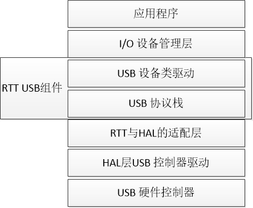
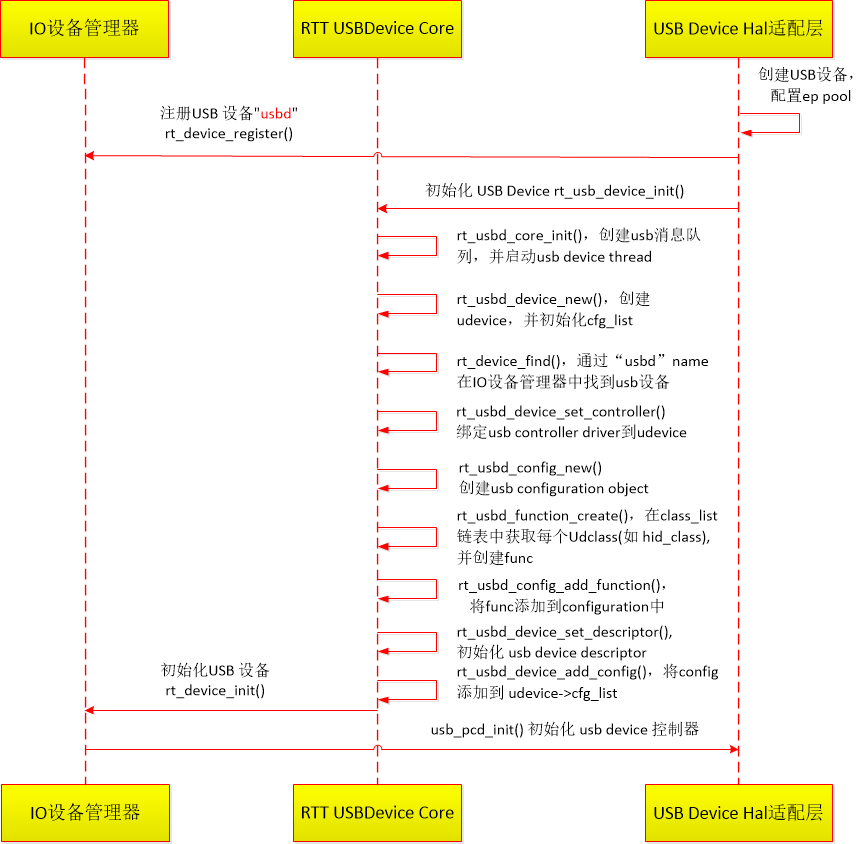
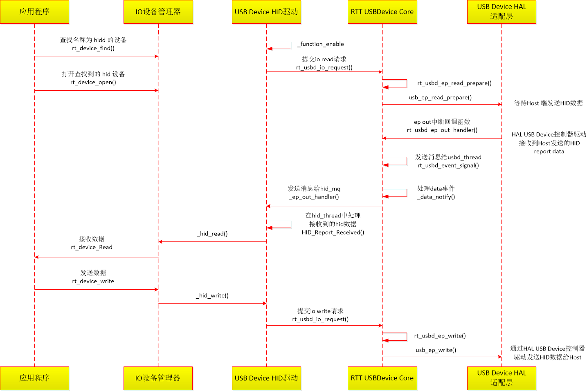

# USB 开发指南

文件标识：RK-GL-YF-106

发布版本：V1.0.2

日期：2020-05-25

文件密级：□绝密   □秘密   □内部资料   ■公开

---

**免责声明**

本文档按“现状”提供，福州瑞芯微电子股份有限公司（“本公司”，下同）不对本文档的任何陈述、信息和内容的准确性、可靠性、完整性、适销性、特定目的性和非侵权性提供任何明示或暗示的声明或保证。本文档仅作为使用指导的参考。

由于产品版本升级或其他原因，本文档将可能在未经任何通知的情况下，不定期进行更新或修改。

**商标声明**

“Rockchip”、“瑞芯微”、“瑞芯”均为本公司的注册商标，归本公司所有。

本文档可能提及的其他所有注册商标或商标，由其各自拥有者所有。

**版权所有© 2020福州瑞芯微电子股份有限公司**

超越合理使用范畴，非经本公司书面许可，任何单位和个人不得擅自摘抄、复制本文档内容的部分或全部，并不得以任何形式传播。

福州瑞芯微电子股份有限公司

Fuzhou Rockchip Electronics Co., Ltd.

地址：     福建省福州市铜盘路软件园A区18号

网址：     [www.rock-chips.com](http://www.rock-chips.com)

客户服务电话： +86-4007-700-590

客户服务传真： +86-591-83951833

客户服务邮箱： [fae@rock-chips.com](mailto:fae@rock-chips.com)

---

**前言**

**概述**

本文介绍了基于 RT-Thread 的 USB 框架，以及常用的 USB Device/Host 使用方法。

**产品版本**

| **芯片名称** | **内核版本**    |
| ------------ | --------------- |
| RK2108       | RT-Thread 3.1.x |

**读者对象**

本文档（本指南）主要适用于以下工程师：

技术支持工程师
软件开发工程师

---

**修订记录**

| **版本号** | **作者** | **修改日期** | **修改说明** |
| ---------- | --------| :--------- | ------------ |
| V1.0.0    | 吴良峰 | 2019-07-23 | 初始版本     |
| V1.0.1    | 陈谋春 | 2020-03-17 | 修正链接  |
| V1.0.2   | 吴良峰 | 2020-05-25 | 修正格式  |

**目录**

---
[TOC]
---

## Rockchip USB 功能特点

USB （Universal Serial Bus）

* 支持 High-Speed, Full-Speed
* 支持 DMA 传输模式
* 支持 Device mode，但不一定支持 OTG mode 和 Host mode ，具体请参考芯片数据手册

## 软件

### 代码路径

RT-Thread USB 组件位于`/rt-thread/components/drivers/usb`，是 RT-Thread 依据 USB2.0 协议规范将 USB 协议栈逻辑高度抽象，支持 Host (主机) 模式和 Device (从机) 模式。 该组件在驱动移植方面提供了友好的移植接口，开发者可将厂商 BSP 中的 HCD (Host Controller Driver) 和 PCD (Peripheral Controller Driver) 驱动代码直接接入到 RT-Thread。

USB组件的框架代码路径如下：

~~~c
components/drivers/usb/usbdevice/core  /* USB Device 核心代码，实现 Device 协议栈 */
components/drivers/usb/usbdevice/class /* Note1; USB Device 设备类驱动 */
components/drivers/usb/usbhost/core    /* USB Host 核心代码，实现 Host 协议栈 */
components/drivers/usb/usbhost/class   /* Note2；USB Host 设备类驱动 */
~~~

*Note1*. USB Device Class 支持:

1. CDC (Communication Device Class, USB 通信设备类)
2. ECM (Ethernet Networking Control Model, USB 以太网控制模型)
3. HID (Human Interface Device, 人体学输入设备)，支持 Keyboard, Mouse, General HID, media keyboard
4. MStorage (Mass Storage, 大容量存储设备)
5. RNDIS (Remote Network Driver Interface Specification，远程网络驱动接口)
6. WINUSB (Windows USB, 微软通用 USB)

*Note2*. USB Host Class 目前只支持MStorage (Mass Storage, 大容量存储设备)

USB 驱动适配层：

~~~c
bsp/rockchip/common/drivers/drv_usbd.c /* Note3; RT-Thread 与 HAL USB Device控制器驱动之间的适配层 */
~~~

*Note3*. RT-Thread 与 HAL USB Host控制器驱动之间的适配层尚未支持，后续将支持。

### 配置

#### USB Device 配置

USB Device 可以支持一个 interface 或者多个 interface 组合的复合设备（Composite Device）。USB组件允许开发者通过宏 RT_USB_DEVICE_COMPOSITE 开启复合功能。下面是 USB Device HID 功能的配置，其中：

USB Vendor ID 为 0x2207，是 USB-IF 官方授权给 Rockchip 的 VID

USB Product ID 为 0x0007，可以根据实际产品来定义，规则是 0x00XX，保持高8位为0，用于区分Maskrom/Loader USB。

~~~c
RT-Thread Components  --->
    Device Drivers  --->
        Using USB  --->
            [*] Using USB device
            (4096) usb thread stack size
            (0x2207) USB Vendor ID
            (0x0007) USB Product ID
            [ ]   Enable composite device
                Device type (Enable to use device as HID device)  --->
            [*]   Use to HID device as Keyboard
            (1)     Number of Keyboard(max 3)
            [ ]   Use to HID device as Mouse
            [ ]   Use to HID device as General HID device
            [ ]   Use to HID device as media keyboard
~~~

#### USB Host 配置

USB Host 目前只能配置 Mass Storage 功能。

~~~c
RT-Thread Components  --->
    Device Drivers  --->
        Using USB  --->
            [*] Using USB host
            [*]   Enable Udisk Drivers
            (/)     Udisk mount dir (NEW)
            [ ] Using USB device
            (4096) usb thread stack size
~~~

### USB 框架介绍

USB 框架是基于 RT-Thread 提供的 [I/O 设备模型框架](https://www.rt-thread.org/document/site/programming-manual/device/device/)实现的，如下图1所示，从上到下分别是 I/O 设备管理层、RTT USB 组件、RTT 与 HAL 的适配层、HAL 层 USB 控制器驱动。



图1 USB 框架图

应用程序通过 I/O 设备管理接口来访问 USB 设备类驱动，然后通过USB设备类驱动与底层的USB控制器进行数据（或控制）交互。

I/O 设备管理层实现了对 USB 设备类驱动程序的封装，提供标准接口给应用程序。

RTT USB组件实现了 USB Device/Host 协议栈以及各种 USB 设备类驱动。USB设备类驱动通过USB协议栈（USB Core）提供的标准接口与底层的USB控制器进行数据交互。USB协议栈通过适配层提供的标准接口与USB控制器进行数据（或控制）交互。

RTT 与 HAL 的适配层，作用是配置 Rockchip USB 控制器的硬件信息，并通过 HAL 层 USB控制器驱动提供的接口初始化 USB 控制器。同时，根据 RTT USB 组件定义的标准接口，将 HAL 层 USB 控制器驱动抽象为方便 RTT USB 组件直接访问的接口函数。

HAL 层 USB 控制器驱动实现了对 USB 控制器进行读写操作的底层代码，可以适配不同的RTOS。

*Note*： RT-Thread 官方论坛上有开发者总结了USB组件之USB device框架的简单概览，有兴趣请参考：

[USB组件之USB device框架简单概览](https://www.rt-thread.org/qa/forum.php?mod=viewthread&tid=5651&highlight=usb)

### USB Device 的创建和注册

USB Device 通过 `rt_device_register()` 接口注册到 RT-Thread I/O 设备管理器中。

这里的 USB Device 是指 USB 控制器在 RT-Thread I/O 设备管理器中注册的设备，该设备只提供给 USB 设备类驱动（如HID/MStorage等）访问，应用程序无法直接访问 USB 控制器设备。此外，不同的 USB 设备类驱动，可能还会在 RT-Thread I/O 设备管理器创建和注册对应的设备，以方便应用程序访问 USB 设备，比如 `components/drivers/usb/usbdevice/class/hid.c` 通过 `rt_device_register` 接口创建 "hidd"  设备节点。

USB 控制器 Device 的创建和注册是在 RTT 与 HAL 的适配层 `bsp/rockchip/common/drivers/drv_usbd.c` 实现，流程如下图2所示。



图2 USB Device 的创建和注册流程

执行命令 `list_device` 可以看到已经生成的 USB Device 设备：

~~~c
msh />list_device
device           type         ref count
-------- -------------------- ----------
usbd     USB Slave Device     0
~~~

### USB Host 的创建和注册

[TODO]

### USB Device 使用示例

USB 应用程序通过 RT-Thread 提供的 I/O 设备管理接口来访问USB硬件，相关接口如下所示：

| 函数                | 描述          |
| ------------------- | ------------- |
| rt_device_find()    | 查找 USB 设备 |
| rt_device_open()    | 打开 USB 设备 |
| rt_device_read()    | 读取 USB 数据 |
| rt_device_write()   | 写入 USB 数据 |
| rt_device_control() | 控制 USB 设备 |

#### USB Device HID 使用示例

RT-Thread USB 组件支持常见的 USB Device HID 功能，包括：Keyboard, Mouse, General HID, media keyboard。用户可以根据实际的需求配置对应的 HID 功能。下面以 RK2108 USB HID Keyboard 为例，说明 HID 的配置和使用方法。

1. **USB Device HID 配置**

   配置方法请参考 [2.2.1 USB Device 配置](#221-usb-device-配置)

   执行命令 `list_device` 可以看到已经生成的 USB HID 设备，属于字符设备类型：

~~~c
   msh />list_device
   device           type         ref count
   -------- -------------------- ----------
   hidd     Character Device     0
~~~

2. **USB Device HID 的创建和注册流程**

   

3. **应用程序访问 HID 设备的流程**

   

   USB Device HID 应用程序的编写，可以参考 [RT-Thread/IoT_Board 的 USB 鼠标例程](https://github.com/RT-Thread/IoT_Board/tree/master/examples/10_component_usb_mouse)

#### USB ADB 使用示例

RT-Thread 官方提供了 ADB 软件包，可以支持通过 USB 与 PC之间进行 ADB 通信 (文件 pull/push)。

支持该功能，需要开启宏 _RT_USB_DEVICE_WINUSB，然后 `components/drivers/usb/usbdevice/class/winusb.c` 会创建 ”/dev/winusb“ 节点，ADB 应用程序通过操作该设备节点，可以与 USB 控制器进行数据交互。

ADB 软件包的说明，请参考：

<http://packages.rt-thread.org/itemDetail.html?package=adbd>

ADB软件包的下载地址如下：

<https://github.com/heyuanjie87/adbd>

#### USB MSC 使用示例

USB MSC (Mass Storage Class) 的功能，可以将设备作为U盘使用。当设备通过 USB 连接 PC 后，PC 可以识别到一个可移动的存储设备，方便设备和 PC 进行文件的拷贝。

以RT-Thread RK2108 MSC的使用为例

1. **USB MSC Device 配置**

   执行命令`scons --menuconfig`，将USB 配置为 Mass Storage device。

   *Note*. 需要手动修改 `msc class disk name`为`root`

~~~c
   RT-Thread Components  --->
       Device Drivers  --->
           Using USB  --->
               [*] Using USB device
               (4096) usb thread stack size
               (0x2207) USB Vendor ID
               (0x0007) USB Product ID
               [ ]   Enable composite device
                   Device type (Enable to use device as Mass Storage device)  --->
               (root) msc class disk name
~~~

2. **USB MSC 驱动修改**

   由于 USB MSC 和 文件系统 都是使用 `root` 分区，而系统起来之后， `root` 分区默认挂载到文件系统，所以，如果要使用 USB MSC 功能，需要更新如下的补丁，将  `root` 分区从文件系统 unmount。

~~~c
   diff --git a/components/drivers/usb/usbdevice/class/mstorage.c b/components/drivers/usb/usbdevice/class/mstorage.c
   index 507e3e0..b96c90d 100644
   --- a/components/drivers/usb/usbdevice/class/mstorage.c
   +++ b/components/drivers/usb/usbdevice/class/mstorage.c
   @@ -16,6 +16,7 @@
    #include "drivers/usb_device.h"
    #include "mstorage.h"
    #include "dma.h"
   +#include <dfs_fs.h>

    #ifdef RT_USB_DEVICE_MSTORAGE

   @@ -958,6 +959,8 @@ static rt_err_t _function_enable(ufunction_t func)
        RT_DEBUG_LOG(RT_DEBUG_USB, ("Mass storage function enabled\n"));
        data = (struct mstorage*)func->user_data;

   +    dfs_unmount("/");
   +
        data->disk = rt_device_find(RT_USB_MSTORAGE_DISK_NAME);
        if(data->disk == RT_NULL)
        {
~~~

3. **USB MSC的使用**

   开机后，如果设备没有通过 USB 连接到 PC，`root` 分区是默认挂在设备端的文件系统上。此时，设备端可以对`root`分区进行读写。

   当设备通过 USB 连接到 PC 后，USB 驱动会将`root`分区从设备端的文件系统上umount掉。此时，设备端无法对`root`分区进行读写，而PC端可以自动识别到U盘，并可以对U盘进行读写。

#### USB UAC 使用示例

USB UAC (USB Audio Class)功能，可以将设备做为 PC 或其他上位机的扩展声卡使用，RK2108 RT-Thread SDK 支持 UAC V1.0。开启 UAC 功能需要打开或关闭以下 config：

```
CONFIG__RT_USB_DEVICE_UAC1=y
CONFIG_RT_USB_AUDIO_P_NAME="es8311p"  //播放设备结点
CONFIG_RT_USB_AUDIO_C_NAME="pdmc"     //输入设备结点
# CONFIG_RT_USING_VAD is not set      //UAC需要关闭VAD功能
```

UAC 功能除了使能 CONFIG__RT_USB_DEVICE_UAC1 外，还需要打开一个播放设备 CONFIG_RT_USB_AUDIO_P_NAME 和一个录音设备 CONFIG_RT_USB_AUDIO_C_NAME。若找不到播放设备，PC 虽能能识别 UAC 设备，但无法播放音频。而如果找不到录音设备，系统会出现 fault 出错。因此在打开 UAC功能之前，请使用 list_device 命令检查是否有这2个设备：es8311p，pdmc。

```
msh />list_device
device          type         ref count
------- -------------------- ----------
es8311c Sound Device         0
es8311p Sound Device         1
audpwmp Sound Device         0
pdmc    Sound Device         0
adcc    Sound Device         0
usbd    USB Slave Device     0
root    Block Device         1
snor    MTD Device           0
pwm0    Miscellaneous Device 0
dmac0   Miscellaneous Device 0
i2c0    I2C Bus              0
pin     Miscellaneous Device 0
uart2   Character Device     0
uart0   Character Device     2
```

如 list_device 未发现音频播放和录音设备，请在 menuconfig 中打开相应的 Audio 编译开关。上例中的 es8311p 和 pdmc 也可改成相应类型的其他设备，取决于您的音频硬件连接方式。

注意：UAC 功能开启时，CONFIG_RT_USING_VAD 必须关闭。

### USB Host 使用示例

[TODO]

