# Rockchip USB SQ 测试指南

文件标识：RK-CS-YF-094

发布版本：V1.6.2

日期：2020-02-19

文件密级：□绝密   □秘密   □内部资料   ■公开

---

**免责声明**

本文档按“现状”提供，福州瑞芯微电子股份有限公司（“本公司”，下同）不对本文档的任何陈述、信息和内容的准确性、可靠性、完整性、适销性、特定目的性和非侵权性提供任何明示或暗示的声明或保证。本文档仅作为使用指导的参考。

由于产品版本升级或其他原因，本文档将可能在未经任何通知的情况下，不定期进行更新或修改。

**商标声明**

“Rockchip”、“瑞芯微”、“瑞芯”均为本公司的注册商标，归本公司所有。

本文档可能提及的其他所有注册商标或商标，由其各自拥有者所有。

**版权所有** **© 2019** **福州瑞芯微电子股份有限公司**

超越合理使用范畴，非经本公司书面许可，任何单位和个人不得擅自摘抄、复制本文档内容的部分或全部，并不得以任何形式传播。

福州瑞芯微电子股份有限公司

Fuzhou Rockchip Electronics Co., Ltd.

地址：     福建省福州市铜盘路软件园A区18号

网址：     [www.rock-chips.com](http://www.rock-chips.com)

客户服务电话： +86-4007-700-590

客户服务传真： +86-591-83951833

客户服务邮箱： [fae@rock-chips.com](mailto:fae@rock-chips.com)

---

**前言**

**概述**

本文档提供 Rockchip 平台 USB 2.0/3.0 信号完整性测试的方法。

USB 2.0 信号完整性测试，包括：高速(High Speed)、全速(Full Speed)和低速(Low Speed)模式，测试项包括: High Speed Signal Quality、 Packet Parameters、 CHIRP Timing、 Suspend/Resume/Reset Timing、Test J/K、 SE0_NAK、Receiver Sensitivity 等。本文档只提供常用的 High Speed Signal Quality 的测试方法。

USB 3.0 信号完整性测试 ，包 括 Tx compliance test 和 Rx compliance test 。 由 于 Rx compliance test 的测试环境和测试方法比较复杂，所以本文档没有提供详细的 Rx 测试方法，只提供 Tx 的详细测试方法和 Rx 的测试原理说明。

Rockchip SOCs 通常内置多个 USB 控制器，不同控制器之间互相独立，请在对应的芯片 TRM 中获取详细信息。因为不同的 USB 控制器，使用的测试命令和测试方法有所不同，所以测试 USB 信号完整性前，请先明确测试的 USB 接口所对应的 USB 控制器。

本文档提供的测试方法适用于 Agilent、Tektronix、LeCroy 示波器和 USB 测试夹具。

**产品版本**
| **芯片名称**                                                 | **内核版本** |
| ------------------------------------------------------------ | ------------ |
| 所有芯片(包括 29 系列、30 系列、31 系列、32 系列、33 系列、PX 系列、Sofia、1108、MCU) | 所有内核版本 |

**读者对象**
本文档（本指南）主要适用于以下工程师：
硬件工程师
软件工程师
技术支持工程师

**修订记录**

| **日期**   | **版本** | **作者** | **修改说明**                                             |
| ---------- | -------- | -------- | -------------------------------------------------------- |
| 2017-12-12 | V1.0     | 吴良峰   | 初始版本                                                 |
| 2018-03-07 | V1.1     | 吴良峰   | 增加 rk3399 Type-C 反面测试命令                          |
| 2018-03-30 | V1.2     | 吴良峰   | 增加 RK3229/RK3326/PX30 测试命令                         |
| 2018-05-21 | V1.3     | 吴良峰   | 修正 USB3.0 测试方法                                     |
| 2019-01-09 | V1.4     | 吴良峰   | 使用 markdownlint 修订格式                               |
| 2019-01-15 | V1.5     | 吴良峰   | 增加 RK1808 测试命令、修正文档缩进、修正 USB3.0 测试命令 |
| 2019-06-26 | V1.6     | 吴良峰   | 增加无法进入 Compliance Test 的解决方法                  |
| 2019-10-21 | V1.6.1   | 吴良峰   | 增加 RK2108/RK2206 测试命令                              |
| 2020-02-19 | V1.6.2   | 吴良峰   | 增加免责声明，商标声明以及版权声明                       |
| 2020-12-08 | V1.6.3   | 任家宁   | 增加 RK3566/RK3568 测试命令                              |

---
[TOC]
---

## USB 2.0 SQ Test

### USB 2.0 测试内容

- 眼图测试
- 信号速率
- 包尾宽度
- 交叉电压范围(用于低速和全速)
- JK 抖动、KJ 抖动
- 连续抖动
- 单调性测试(用于高速)
- 上升下降时间

### USB 2.0 测试命令和测试工具

USB 2.0 SQ 的测试原理是，设置 USB 控制器的 Test Control 寄存器，使 USB 控制器进入 Test Packet Mode，USB 控制器就会持续产生并发送周期性的 Test Pattern。USB 示波器通过检测 Test Pattern 的波形来分析 USB 的信号完整性。
对于 Rockchip 平台的 USB 2.0 Device 和 USB 2.0 Host 接口，设置 USB 控制器进入 Test Packet Mode 的方法有所不同：

- USB 2.0 Device，可以使用测试命令或者测试工具设置 USB 控制器进入 Test Packet Mode
- USB 2.0 Host，只能使用测试命令设置 USB 控制器进入 Test Packet Mode

#### USB 2.0 Device 测试命令和测试工具

**测试命令**

测试命令如下表 1-1 所示，可以通过串口或者 ADB 执行命令。

表 1-1 USB 2.0 Device SQ 测试命令

|                     芯片名称                     | DWC2_0 OTG 2.0 Device |    DWC3_0 OTG 2.0 device    |    DWC3_1 OTG 2.0 device    |
| :----------------------------------------------: | :-------------------: | :-------------------------: | :-------------------------: |
|                      RK1808                      |          N.A          | io -4 0xfd00c704 0x8c000a08 |             N.A             |
|                      RK2108                      | io -4 0x41300804 0x40 |             N.A             |             N.A             |
|                      RK2206                      | io -4 0x43040804 0x40 |             N.A             |             N.A             |
|       RK29XX<br />RK30XX<br />RK31XX<br />       | io -4 0x10180804 0x40 |             N.A             |             N.A             |
|             RK3228<br />RK3229<br />             | io -4 0x30040804 0x40 |             N.A             |             N.A             |
| RK3288<br />RK3228H<br/>RK3328<br />RK3368<br /> | io -4 0xff580804 0x40 |             N.A             |             N.A             |
|                      RK3308                      | io -4 0xff400804 0x40 |             N.A             |             N.A             |
|              RK3326<br />PX30<br />              | io -4 0xff300804 0x40 |             N.A             |             N.A             |
|                      RV1108                      | io -4 0x30180804 0x40 |             N.A             |             N.A             |
|                RV1126<br />RV1109                |          N.A          | io -4 0xffd0c704 0x8c000a08 |             N.A             |
|                    SOFIA-3GR                     | io -4 0xe2100804 0x40 |             N.A             |             N.A             |
|                      RK3366                      | io -4 0xff4c0804 0x40 | io -4 0xff50c704 0x8c000a08 |             N.A             |
|                      RK3399                      |          N.A          | io -4 0xfe80c704 0x8c000a08 | io -4 0xfe90c704 0x8c000a08 |
|                RK3566<br />RK3568                |          N.A          | io -4 0xfcc0c704 0x8c000a08 |             N.A             |

**测试工具**

Rockchip 平台的 USB 2.0 Device SQ 测试，除了可以使用上述的测试命令外，还可以使用 USB-IF 官方组织提供的 USB HSET 测试工具，下载工具“USBHSET for EHCI”或者“USBHSET for XHCI”,
下载地址如下:
for EHCI：
32 bit： <http://www.usb.org/developers/tools/usb20_tools/EHSETT_Releasex86_1.3.1.1.exe>
64 bit： <http://www.usb.org/developers/tools/usb20_tools/EHSETT_Releasex64_1.3.1.1.exe>

for xHCI：
32 bit： <http://www.usb.org/developers/tools/XHSETT_Releasex86_1.3.2.2.exe>
64 bit： <http://www.usb.org/developers/tools/XHSETT_Releasex86_1.3.2.2.exe>

测试工具的简单使用步骤如下：

1. 将待测试的 USB device 口通过 USB 线连接到 PC

2. 打开测试工具，选择“Device”,然后点击“TEST”按钮，如下图 1-1 所示


图 1-1 选择测试类型

3. 如图 1-2 所示，选择要测试的设备和测试命令”TEST PACKET”，然后点击“EXECUTE”按钮所示，执行完上述操作后，USB 控制器就会自动进入 Test Packet Mode，并连续发送周期性的测试包，测试波形如图 1-3 所示：

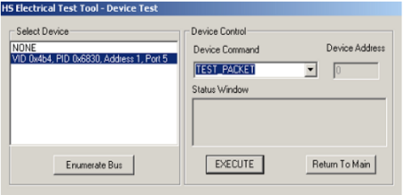
图 1-2 选择测试设备和测试命令


图 1-3 测试波形

#### USB 2.0 Host 测试命令

USB 2.0 Host SQ 测试，只能使用测试命令，没有专门的测试工具。测试命令如表 1-2，表 1-3，表 1-4 所示，测试命令可以通过 ADB 或者串口执行。

表 1-2 USB 2.0 Host 测试命令(a)

|               芯片名称               |    DWC2 OTG Host 2.0    |      DWC2 Host 2.0      |     EHCI_0 Host 2.0      |
| :----------------------------------: | :---------------------: | :---------------------: | :----------------------: |
|                RK1808                |           N.A           |           N.A           | io -4 0xffd80054 0x40000 |
|                RK2206                | io -4 0x43040440 0x8000 |           N.A           |           N.A            |
| RK29XX<br />RK30XX<br />RK3188<br /> | io -4 0x10180440 0x8000 | io -4 0x101c0440 0x8000 |           N.A            |
|                RK312X                | io -4 0x10180440 0x8000 | io -4 0x101c0440 0x8000 | io -4 0x101c0054 0x40000 |
|       RK3228<br />RK3229<br />       | io -4 0x30040440 0x8000 |           N.A           | io -4 0x30080054 0x40000 |
|                RK3288                | io -4 0xff580440 0x8000 | io -4 0xff540440 0x8000 | io -4 0xff500054 0x40000 |
|                RK3308                | io -4 0xff400440 0x8000 |           N.A           | io -4 0xff440054 0x40000 |
|        PK3326<br />PX30<br />        | io -4 0xff300440 0x8000 |           N.A           | io -4 0xff340054 0x40000 |
|      RK3228H<br />RK3328<br />       | io -4 0xff580440 0x8000 |           N.A           | io -4 0xff5c0054 0x40000 |
|                RK3366                | io -4 0xff4c0440 0x8000 |           N.A           | io -4 0xff480054 0x40000 |
|                RK3368                | io -4 0xff580440 0x8000 |           N.A           | io -4 0xff500054 0x40000 |
|                RV1108                | io -4 0x30180440 0x8000 |           N.A           | io -4 0x30140054 0x40000 |
|          RV1126<br />RV1109          |           N.A           |           N.A           | io -4 0xffe00054 0x40000 |
|              SOFIA-3GR               | io -4 0xe2100440 0x8000 |           N.A           |           N.A            |
|                RK3399                |           N.A           |           N.A           | io -4 0xfe380054 0x40000 |
|          RK3566<br />RK3568          |           N.A           |           N.A           | io -4 0xfd800054 0x40000 |

表 1-3 USB 2.0 Host 测试命令(b)

|         芯片名称         |     EHCI_1 Host 2.0      |     EHCI_2 Host 2.0      |    EHCI_HSIC Host 2.0    |
| :----------------------: | :----------------------: | :----------------------: | :----------------------: |
| RK3168<br />RK3188<br /> |           N.A            |           N.A            | io -4 0x10240054 0x40000 |
|          RK3288          |           N.A            |           N.A            | io -4 0xff5c0054 0x40000 |
| RK3228<br />RK3229<br /> | io -4 0x300c0054 0x40000 | io -4 0x30100054 0x40000 |           N.A            |
|          RK3368          |           N.A            |           N.A            | io -4 0xff5c0054 0x40000 |
|          RK3399          | io -4 0xfe3c0054 0x40000 |           N.A            | io -4 0xfe340054 0x40000 |
|    RK3566<br />RK3568    | io -4 0xfd880054 0x40000 |           N.A            |           N.A            |

表 1-4 USB 2.0 Host 测试命令(c)

|      芯片名称      |     DWC3_0 OTG Host 2.0     |     DWC3_1 OTG Host 2.0     |
| :----------------: | :-------------------------: | :-------------------------: |
|       RK1808       | io -4 0xfd000424 0x40000000 |             N.A             |
|      RK3228H       | io -4 0xff600424 0x40000000 |             N.A             |
|       RK3366       | io -4 0xff500424 0x40000000 |             N.A             |
|       RK3399       | io -4 0xfe800424 0x40000000 | io -4 0xfe900424 0x40000000 |
| RV1126<br />RV1109 | io -4 0xffd00424 0x40000000 |             N.A             |
| RK3566<br />RK3568 | io -4 0xfcc00424 0x40000000 | io -4 0xfd000424 0x40000000 |

### USB 2.0 测试环境

测试 USB 2.0 SQ，需要使用已安装 USB 专业测试软件的示波器，比如 Agilent 9000 系列示波器（或 90000 系列）、Tektronix、LeCroy 系列的示波器。本文档主要介绍 Agilent 9000 系列示波器的 USB 2.0 测试环境，需要的工具如下：

- MSO9254A 示波器，安装 USB 2.0 测试软件 N5416A

- 113xA 差分有源探头

- E2678A 差分探头前端

- E2649-66401 device 夹具和 E2649-66402 host 夹具

- USB 2.0 cable

  USB 2.0 cable 的线材需要严格符合 USB 2.0 Spec 的规定，如果 USB cable 的线长小于 10cm，则眼图测试时，应采用 Near End 模板，如果线长大于 10cm，则眼图测试应采用 Far End 模板。近端（Near End）测试时，如果使用太长的 USB 线缆或者 USB 线缆的阻抗匹配不好，可能导致眼图测试指标不通过。

### USB 2.0 测试步骤

**1). 搭建测试环境**

如果使用的是 Agilent 的测试套件，测试环境的搭建和示波器的设置方法，请参考如下的文档：

《Agilent N5416A USB 2.0 Compliance Test Option》

《Agilent USB2.0 High Speed Device SQ Test》

如果使用的是 Tektronix 或 LeCroy 的测试套件，请到 Tektronix 和 LeCroy 的官网上搜索测试说明文档。

以 Agilent 示波器测试 USB2.0 Device SQ 为例，搭建好的测试环境如图 1-4 所示：


图 1-4 Agilent USB 2.0 SQ 测试环境

**2). 设置 USB 进入测试模式[Test Packet Mode]**

设置 USB 控制器进入 Test Mode 前，需要先确认 USB 已经可以正常通信。

如果是测试 USB 2.0 OTG Device 接口，要保证待测试的 USB 口已经通过测试夹具和线缆连接到 PC，并且 PC 可以正常识别到 USB 设备。然后，再通过[1.2.1 节](#1.2.1 USB 2.0 Device 测试命令和测试工具)提到的 PC 端测试工具，或者使用 ADB (或串口)发送[1.2.1 节](#1.2.1 USB 2.0 Device 测试命令和测试工具)的测试命令，设置 USB 控制器进入测试模式。

如果测试 USB 2.0 Host 接口，不同的示波器和测试夹具，设置 USB 控制器进入测试模式的方法有所不同，下面分别对使用 Agilent 测试套件和使用 Tektronix 测试套件的设置方法做简要说明：

**a). Agilent 测试套件**

先将待测的 Host 口连接到测试夹具的测试接口一端，然后将高速设备（如 U 盘）连接到夹具的另一端接口，如下图 1-5，再执行测试命令，设置 USB 进测试模式。

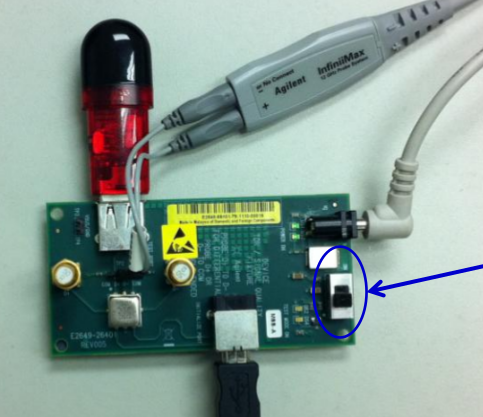
图 1-5 Agilent USB 2.0 SQ 测试夹具连接方法

**b). Tektronix 测试套件**

如果使用 Tektronix 的测试夹具，由于测试夹具上只有一个接口用于连接待测的 HOST 口，无法再连接其他高速设备，所以，先断开待测的 Host 接口与测试夹具连接，然后将高速 USB 设备（如 U 盘）插到待测试的 HOST 口，再执行测试命令，等测试命令发送完成后，USB 控制器就会自动进入测试模式，然后再拔出高速 USB 设备，将测试夹具连接到待测试的 Host 接口，开始测试。

**Note：**测试 USB 2.0 Host 接口，必须在 Host 口上接一个**高速 USB 设备**(如 U 盘)，不能接鼠标、键盘等全速或者低速的 USB 设备。

**3). USB 自动化测试软件分析波形**

在 USB 控制器成功进入测试模式后，会产生并发送持续的 Test Packet Pattern，可以从示波器观察到周期性的测试波形，如图 1-6 所示。示波器的 USB 自动化测试软件，会自动对测试波形进行分析，并生成完成的测试报告。

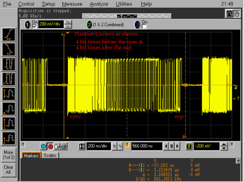
图 1-6 USB 2.0 信号质量分析界面

### USB 2.0 测试结果分析

#### USB 2.0 标准眼图分析

USB 2.0 眼图模板有两种不同的标准：近端（Near End）和远端（Far End）。在 High Speed Signal Quality 测试中，若待测 USB 的端口直接通过小于 10cm 的线缆与测试夹具相连，则采用 Near End 眼图模板。若待测的 USB 端口通过大于 10cm 的线缆与测试夹具相连，则采用 Far End 眼图模板。在 Rockchip 平台的 USB 2.0 眼图测试中，为保证 USB 2.0 信号质量的可靠性，建议统一采用更为严格的 Near End 眼图模块作为参考标准。图 1-7 和图 1-8 分别是使用 Near End 和 Far End 眼图模板的标准 USB 眼图。


图 1-7 USB 2.0 High-speed Near End SQ Eye Diagram

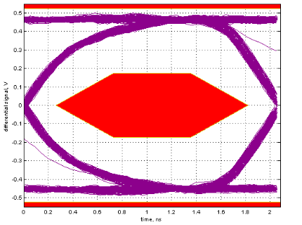
图 1-8 USB 2.0 High-speed Far End SQ Eye Diagram

从图 1-7 和图 1-8 中，可以看出，标准的 USB 2.0 眼图呈现为一个迹线又细又清晰的“眼睛”，“眼”张开得很大。当有码间串扰时，波形失真，码元不完全重合，眼图的迹线就会不清晰，引起“眼”部分闭合。若再加上噪声的影响，则使眼图的线条变得模糊，“眼”开启得小了，因此，“眼”张开的大小表示了失真的程度，反映了码间串扰的强弱。

#### USB 2.0 SQ 测试常见问题分析

**1).  示波器无法检测到眼图测试的触发信号**

- 检查测试夹具是否连接正确，以及示波器的 USB 测试软件是否设置正确
- 从示波器上观察是否有检测到如图 1-3 的周期性测试波形
- 如果没有图 1-3 的周期性测试波形，可能是测试命令没有执行成功或者测试命令有误

**2). 测试的眼图严重失真**

测试的眼图严重失真，比如幅度失真、信号塌陷，一般是因为测试的操作方法有误。

如图 1-9 所示，USB 眼图的信号幅度比标准的大一倍，如果使用的是 Agilent 测试套件，一般是因为测试夹具的 D+和 D-没有挂上 50 欧的终端 SMA 电阻。


图 1-9 USB 眼图幅度失真

如图 1-10 所示，USB 眼图的信号中间有明显的塌陷，如果使用的是 Agilent 测试套件，一般是因为没有将测试夹具的开关切到 ON 档。


图 1-10 USB 眼图信号塌陷失真

**3). USB 眼图没有张开**

如图 1-11 所示，USB 眼图没有张开，会压到 USB 眼图的测试模板。

- 检查 USB 的 DP 和 DM 线上是否连接了内部电容较大的 ESD 或者电子开关，如果有，可以去掉这些器件再测试
- 通过软件调整 USB PHY 的驱动强度和上升沿、下降沿，请联系负责 USB 驱动的工程师协助调试。

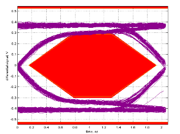
图 1-11 USB 眼图没有张开

**4). USB 眼图模糊甚至布满血丝**

如图 1-12 所示，USB 眼图的轮廓线条模糊，说明 USB 的串扰十分严重，还可能存在阻抗不匹配、噪声干扰的问题。

- 检查 USB 的 DP 和 DM 线上是否连接了内部电容较大的 ESD 或者电子开关，如果有，可以去掉这些器件再测试
- 检查测试使用的 USB 线缆是否存在阻抗不匹配的问题，或者换条 USB 线缆重新测试
- 检查 USB 的 PCB 走线、USB 的 24MHz 时钟源、USB PHY 的供电电源纹波


图 1-12 USB 眼图模糊

---
## USB 2.0 HUB SQ Test

USB 2.0 HUB 的 SQ test 包括了 upstream ports 和 downstream ports，但实际应用中，我们一般只需测试提供给用户使用的 downstream ports。因此，本文档只提供了测试 USB2.0 HUB downstream ports 的 SQ 测试方法。

常见的 USB 2.0 HUB 芯片型号主要有：FE1.1、FE1.1S、GL850、GL852、USX2064、HX2VL 等。常见的 HSIC HUB 型号主要有：USB4604、GL850H。对于 USB 2.0 HUB，Rockchip 平台有两种测试方法，详见下面的方法 1-命令测试和方法 2-脚本测试，对于**HSIC HUB**，只能使用方法 2-脚本测试。

**方法 1-命令测试**

该测试方法使用的测试命令与“[1.2.2 USB 2.0 Host 测试命令](#1.2.2 USB 2.0 Host 测试命令)”一样，测试步骤如下：

- 确定 HUB 连接的 USB HOST 控制器，然后查表 1-2，表 1-3，表 1-4，找到 HOST 控制器对应的测试命令
- 参考“[1.4 测试步骤](#1.4 测试步骤)”，完成 HUB 的所有 downstream ports 的 SQ 测试

**Note**：不同的 HUB downstream ports，测试命令和测试方法都是一样的。

**方法 2-脚本测试**

相比方法 1-命令测试，方法 2-脚本测试比较复杂，需要编译和运行脚本，但更具有通用性，可以测试所有类型的 HUB，包括 USB 2.0 HUB 和 HSIC HUB。

**1). 编译测试脚本**

脚本源码和编译方法见“usb2_hub_Compliance_test_script”，该脚本适用于 Linux-3.3 以后的内核，更早的 kernel 版本请自行修改测试脚本源码。

**2). 执行测试脚本**

将编译生成的可执行文件 linux-eye 拷贝到系统的 data 目录下，并 执行命令

```shell
chmod 777 linux-eye
```

执行测试脚本 linux-eye，然后，根据脚本的提示，输入测试命令，参考如下：

```shell
[root@hari LinuxEye]# ./linuxEye
LinuxEye - select one of the following hub for testing.
[ 0] 4-port Full-Speed hub at tier 2 of Bus 3
(VID: 0451, PID: 1446, Address: 3)
[ 1] 4-port High-Speed hub at tier 2 of Bus 1
(VID: 1A40, PID: 0101, Address: 15)
[ 2] 4-port High-Speed hub at tier 2 of Bus 1
(VID: 1A40, PID: 0101, Address: 10)
[ 3] 7-port High-Speed hub at tier 3 of Bus 1
(VID: 1A40, PID: 0201, Address: 50)
Please enter [0 ~ 3] to select a hub or 'q' to quit: 2 （表示共有4个HUB， 测试HUB[2]）
[ 1] is connected to Low-Speed device
[ 2] is open
[ 3] is connected to High-Speed device
[ 4] is connected to Low-Speed device
Please enter [1 ~ 4] to select a port or 'q' to quit: 2 （表示测试HUB的第2个port）
LinuxEye - Start testing port 2 of device 10 on bus 1
Type 'q' to stop the test: q (退出测试脚本)
[root@hari LinuxEye]#
```

---
## USB 3.0 Compliance Test

USB 3.0 是双总线架构，在 USB 2.0 的基础上增加了超高速(Super Speed)总线部分。超高速总线的信号速率达到 5Gbps， 采用 ANSI 8b/10b 编码，全双工方式工作，最大支持的电缆长度达 3 米。如下图 3-1 是典型的 USB3.0 的总线架构。


图 3-1 USB 3.0 总线架构

### USB 3.0 新增测试规范

- 一致性校准和测试在一致性通道末端进行

  一致性通道用来表征测试 TX 和 RX 时最差的互连通道情况

  Host：**3 米电缆+5 英寸的走线**

  Device：**3 米电缆+11 英寸走线**

- TX 测试允许使用通道嵌入,选择黄金 S 参数做嵌入测试

- 需要计算基于 10e-12 误码率的 DJ，RJ 和 TJ

  增加了 10MHz，20MHz 和 33MHz 一致性 Pj 测试频点

- 后处理需要使用 CTLE 均衡器，在均衡器后观察和分析眼图及其参数。由于 5Gbps 的信号经过长电缆和 PCB 传输以后有可能眼图就张不开了，所以 USB 3.0 的芯片接收端内部会提供 CTLE(连续时间线性均衡)功能以补偿高频损耗。所以测试时示波器的测试软件也要能支持 CTLE 才能得到真实的结果。

- Device 接收端眼图幅度校准标准为 145mVp-p

- Host 接收端眼图幅度标准为 180mVpp

  USB 3.0 的电气性能测试分为**发送信号测试(Tx)**、**接收容限测试(Rx Tolerance Compliance Test)**以及电缆/连接器的测试。

### USB 3.0 Tx Compliance Test

#### USB 3.0 Tx 测试要求

在进行发送端测试时，要求测试对象发出特定的测试码型，实时示波器对该码型进行眼图分析，测量信号的幅度、抖动、平均数据率及上升∕下降时间。USB3.0 针对超高速部分的信号测试与以前 USB2.0 的测试方法有较大的不同。

首先，由于 USB3.0 SuperSpeed 的信号速率达到 5Gbps，同时信号的幅度更小，因此测试中需要**12GHz 以上带宽**的示波器，同时要示波器的底噪声更低才能保证准确的测量。

其次， USB 3.0 发送端测试，不是用夹具直接连接 DUT，其定义的被测点是“**一致性通道** ( Compliance Channel)” 的末端。一致性通道模拟 PCB 走线和电缆对信号的影响。对于 HOST 的测试，它模拟的是 3m 长电缆＋5 英寸 PCB 走线的影响；对于 Device 的测试，它模拟的是 3m 长电缆＋11 英寸 PCB 走线的影响。USB3.0 的测试规范里会以 S 参数文件的形式提供一致性通道的模型。在真正测试时是用测试夹具直接连接 DUT，然后用示波器的 S 参数嵌入的方式加入通道影响。如图 3-2 Tx 测试模型，TP1 为示波器的测试点。


图 3-2 USB 3.0 Tx 测试模型


图 3-3 USB 3.0 Tx 测试眼图要求


图 3-4 USB 3.0 Tx 测试电气参数要求

#### USB 3.0 Tx 测试项目

- LFPS(近端)
- SSC(近端)
- Tx(近端/远端）：眼图；Tj， Rj， Dj；幅度；

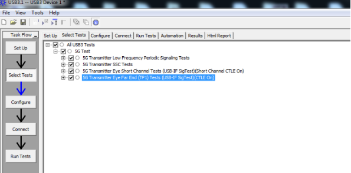
图 3-5 Agilent USB 3.0 Tx 测试选项

#### USB 3.0 Tx 测试模式

根据 USB 3.0 spec 规定，USB 3.0 控制器要先进入测试模式(Compliance Mode)，才能开始 USB 3.0 Tx 的信号完整性测试。如图 3-6 所示，在 Polling 阶段的**第一个 LFPS timeout**后，控制器就会从 Polling.LFPS 退出到 Compliance Mode。


图 3-6 USB 3.0 进入 Compliance Mode 的流程

#### USB 3.0 Tx 测试环境

**1). Agilent USB 3.0 Tx 测试套件**

对于 USB 3.0 Tx 信号的测试，Agilent 推荐使用 90000 系列示波器(提供高达 13GHz 的带宽)， 配上自动的一致性测试软件 U7243A 和测试夹具 U7242A 来完成 USB 3.0 规范要求的发送端测试和验证。

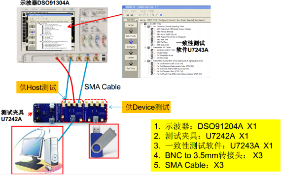
图 3-7 Agilent USB 3.0 Tx 测试环境


图 3-8 Agilent USB 3.0 Tx 测试夹具 U7242

此外，Agilent 还提供了 USB 3.1 Gen1 Type-C 测试夹具 N7015A，如下图 3-9，用于测试 USB 3.0/3.1 Type-C 接口的信号完整性，测试软件与 U7242A 夹具一样。Type-C 测试夹具的具体使用方法，请参考文档《Keysight N7015A-16A Type-C Test Kit》。

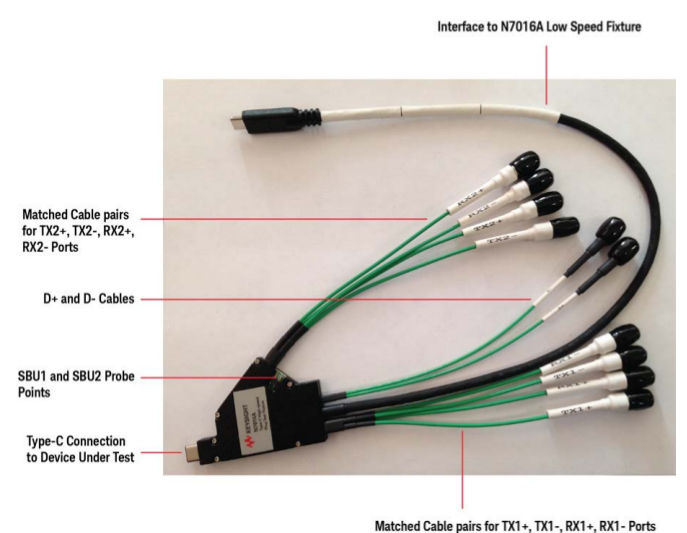
图 3-9 Agilent USB 3.0 Type-C 测试夹具 N7015A

**2). Tektronix USB 3.0 Tx 测试套件**

Tektronix 的 Tx 测试示意图如图 3-10 所示，Tektronix USB 3.0 发射机测量（选项 USB-Tx）适用于 DPO/MSO70000 系列示波器，提供了自动 USB 3.0 发射机解决方案。

具体测试方案请参考：

<https://www.tek.com.cn/datasheet/usb3-transmitter-and-receiver-solutions-datasheet>

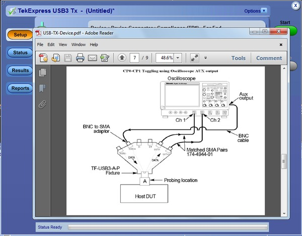
图 3-10 Tektronix USB 3.0 Tx 测试示意图

#### USB 3.0 Device Tx 测试命令

如下芯片在测试 USB 3.0 Device Tx 时，需要输入测试命令，作用是为了触发 CP1 test pattern。并且，**要严格按照测试步骤的要求，在示波器弹出测试 CP1 test pattern 时，再输入 Device 测试命令**。否则，可能会导致 CP0 test pattern 或 CP1 test pattern 测试异常。

表 3-1 USB 3.0 Device Tx 测试命令

|      芯片名称       | DWC3_0 OTG Host 3.0  | DWC3_1 OTG Host 3.0 |
| :-----------------: | :------------------: | :-----------------: |
|       RK1808        | io -4 0xff384008 0xc |         N.A         |
| RK3228H<br />RK3328 | io -4 0xff478408 0xc |         N.A         |

#### USB 3.0 Device Tx 测试方法

本文档主要说明使用 Agilent 90000 系列示波器(型号：DSO91204A 和测试夹具 U7242A)的 USB 3.0 Device Tx 测试方法。如果使用的是 Tektronix 或者 LeCroy 的示波器，请自行搜索 Tektronix 和 LeCroy 官方发布的测试指南。

**测试注意事项：**

1). 测试 USB 3.0 Device Tx 时，请先查表 3-1，确认是否需要输入测试命令。

如果不用输入测试命令，则只要按照示波器测试软件提示的测试步骤操作，将待测试的 Device USB 口连接到测试夹具，USB 3.0 控制器就会自动进入 Compliance mode。

如果需要输入测试命令，则先按照示波器测试软件提示的测试步骤操作，将待测试的 Device USB 口连接到测试夹具，USB 3.0 控制器就会自动进入 Compliance mode。然后，在示波器弹出测试 CP1 test pattern 时，再输入 Device 测试命令。

2). 执行如下命令，可以查询 USB 3.0 控制器是否进入 Compliance mode：

```shell
cat /sys/kernel/debug/xxxx.dwc3/link_state    (xxxx表示USB3控制器基地址)
```

返回的值如果为“compliance”，表示控制器已进入 Compliance mode

3). 测试 USB 3.0 Device Tx 时，**VBus 5V 不能自供电，否则会导致 USB 3.0 控制器无法进入 Compliance mode**。VBus 的供电需要由测试夹具 U7242A 提供，可以通过 USB 线将测试夹具的 USB 供电口与示波器或者 PC 的 USB 口连接，实现 VBus 5V 的供电。

 **USB 3.0 Device Tx 测试步骤**

**1). 自动化测试软件设置**


图 3-11 USB 3.0 Device Tx 测试软件设置界面

**Note：**

a). 使用的测试软件版本为**V2.01**，如果使用更新的测试版本(如 V3.00.0001)，软件设置方法会有所不同

b). Channel Setting 的设置方法如下：


图 3-12 USB 3.0 Device Tx 测试软件中 Channel 的设置方法

Channel Settings 默认选择 Normal Channel，即嵌入 S 参数，来模拟 3m 长 usb cable + 5’’PCB 走线的影响。因此，要求测试时，用测试夹具直接连接待测试设备（DUT）。如果测试使用的 usb cable 太长（大于 10 cm），可能导致 Far End 测试项 fail，建议 Channel Settings 选择 None，或者使用小于 10cm 的短线测试。

**2). 选择测试项目**

勾选 All USB3 Tests，可选择全部 USB 3.0 Tx 一致性测试项目。


图 3-13 USB 3.0 Device Tx 测试项的设置

**3).  配置测试条件**

将 Automate Test Pattern Change 设置为 Auto，其余使用默认配置即可。

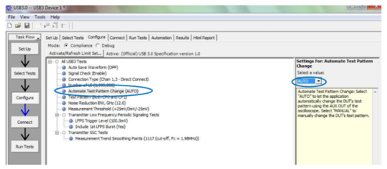
图 3-14 USB 3.0 Device Tx 测试条件设置

**4). 连接示波器、夹具和待测 USB 设备**

按照示波器的提示进行连接，如下图所示。VBus 5V 供电也要连接。


图 3-15 USB 3.0 Device Tx 测试连接示意图

**5). 开始 Tx 测试**

5.1). 测试过程中，自动化软件提示测试 LFPS 的操作方法

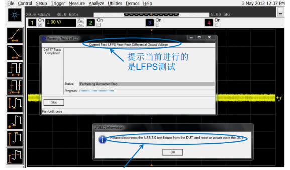
图 3-16 LFPS 测试界面

**Note**：进行 LFPS 测试前，要先断开 USB3.0 夹具和被测件，然后点击“OK”，再重新连接到夹具。


图 3-17 USB 3.0 Device Tx LFPS 参考波形

5.2). LFPS 测试完成后，开始 SSC 测试，自动化软件提示更改示波器、夹具和被测件的连接

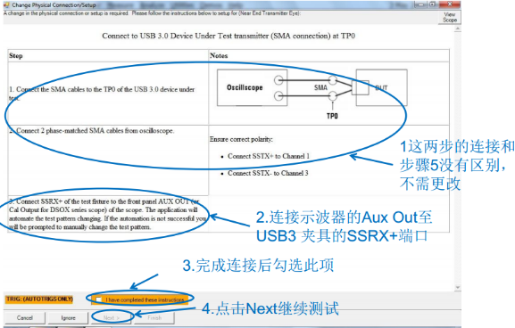
图 3-18 USB 3.0 Device Tx SSC 测试

 5.3). SSC 测试完成后， 开始眼图/抖动测试，自动化软件提示更改示波器、夹具和被测件的连接。

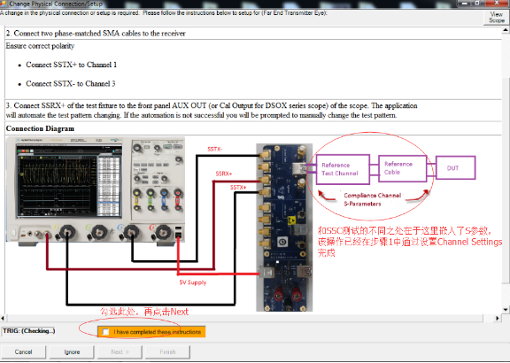
图 3-19 USB 3.0 Device Tx 眼图及抖动测试

5.4). 测试完成，自动生成测试报告，查看测试报告

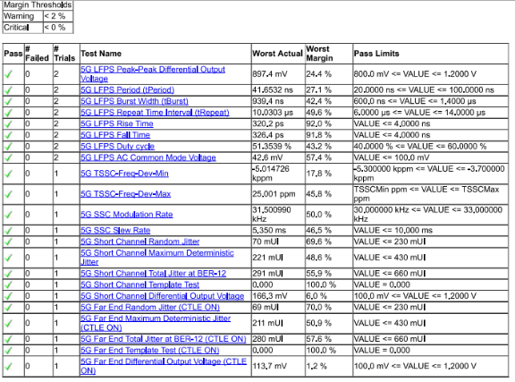
图 3-20 USB 3.0 Device Tx 测试报告

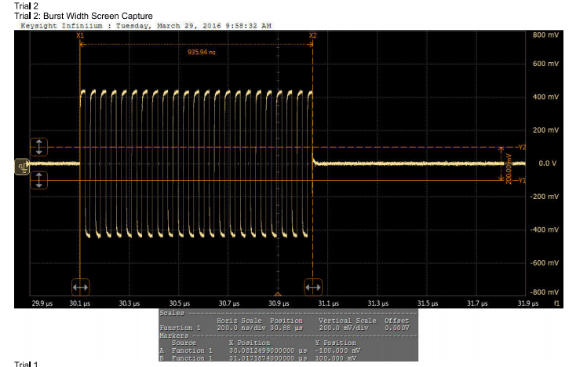
图 3-21  USB 3.0 Device Tx LFPS Burst Width


图 3-22 USB 3.0 Device Tx LFPS Repeat Time Interval

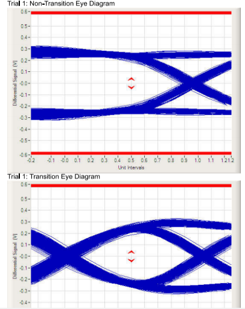
图 3-23 USB 3.0 Device Tx Short Channel Eye Diagram

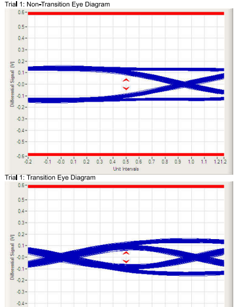
图 3-24 USB 3.0 Device Tx Far End Eye Diagram

#### USB 3.0 Host Tx 测试命令

Android 平台和 Chrome 平台的 USB 3.0 Host Tx 测试命令有所不同，以下分别说明。

**1). Android 平台 USB 3.0 Host Tx 测试命令**

Android 平台支持两种不同的测试命令，一种是 io 命令写寄存器的方式，另外一种是写内核设备节点的方式。**推荐优先使用写内核节点的方式，尤其是 3399 平台**。

**1.1)  Android 平台 io 测试命令**

表 3-2 USB 3.0 Host Tx 测试命令-Android 平台

|      芯片名称      |                   DWC3_0 OTG Host 3.0                    |      DWC3_1 OTG Host 3.0       |
| :----------------: | :------------------------------------------------------: | :----------------------------: |
|       RK1808       |  io -4 0xff384008 0xc<br />io -4 0xfd000430 0x0a010340   |              N.A               |
|      RK3228H       | io -4 0xff478408 0xc<br />io  -4  0xff600430  0x0a010340 |              N.A               |
|       RK3366       |              io  -4  0xff500430  0x0a010340              |              N.A               |
|       RK3399       |              io  -4  0xfe800430  0x0a010340              | io  -4  0xfe900430  0x0a010340 |
| RK3566<br />RK3568 |               io -4 0xfcc00430 0x0a010340                |  io -4 0xfd000430 0x0a010340   |

**Note**：RK1808/RK3228H 需要两条测试命令，其中第一个命令（即写”0xc“）是为了触发 CP1 test pattern。一般情况下，测试时，两条命令可以同时输入。但如果出现 CP0 或 CP1 test pattern 切换异常时，请先不要执行第一个命令（即写”0xc“），但写“ 0x0a010340”的命令仍需要在测试前输入，然后，待示波器弹出 CP1 pattern 测试的提示窗口时，再输入写“0xc”的命令。

**1.2)  Android 平台写内核设备节点的方法[推荐优先使用]**

**Legacy：**（适用于较早的 Linux-3.10/Linux-4.4 版本）

```shell
echo test_u3 > /sys/kernel/debug/usb3控制器节点/host_testmode
```

其中，“usb3 控制器节点”应该根据芯片的 USB 3.0 控制器节点的名称进行修改。

**Tips：**

可以在系统的根目录下，通过如下命令搜索“host_testmode”节点的完整路径

```shell
find . -name "host_testmode"
```

比如，**rk3399**平台的 USB3 Host Tx 测试命令如下：

**rk3399 Type-C USB 正面连接的测试命令：**

Type-C0 USB：

```shell
echo test_u3 > /sys/kernel/debug/usb@fe800000/host_testmode
```

Type-C1 USB：

```shell
echo test_u3 > /sys/kernel/debug/usb@fe900000/host_testmode
```

**rk3399 Type-C USB 反面连接的测试命令：**

Type-C0 USB flip：

```shell
echo test_flip_u3 > /sys/kernel/debug/usb@fe800000/host_testmode
```

Type-C1 USB flip：

```shell
echo test_flip_u3 > /sys/kernel/debug/usb@fe900000/host_testmode
```

**New：**（适用于最新的 Linux-4.4 版本）

```shell
echo test_u3 > /sys/devices/platform/usb3控制器节点/host_testmode
```

比如，**rk3399**平台的 USB3 Host Tx 测试命令如下：

**rk3399 Type-C USB 正面连接的测试命令：**

Type-C0 USB：

```shell
echo test_u3 > /sys/devices/platform/usb0/host_testmode
```

Type-C1 USB：

```shell
echo test_u3 > /sys/devices/platform/usb1/host_testmode
```

**rk3399 Type-C USB 反面连接的测试命令：**

Type-C0 USB flip：

```shell
echo test_flip_u3 > /sys/devices/platform/usb0/host_testmode
```

Type-C1 USB flip：

```shell
echo test_flip_u3 > /sys/devices/platform/usb1/host_testmode
```

**2).  Chrome 平台 USB 3.0 Host Tx 测试命令**

Chrome 平台可使用表 3-2 和表 3-3 两种测试命令，效果一样，但 Chrome 平台不支持写内核设备节点的方法。

表 3-3 USB 3.0 Host Tx 测试命令-Chrome 平台

|      芯片名称       |                     DWC3_0 OTG Host 3.0                      |      DWC3_1 OTG Host 3.0       |
| :-----------------: | :----------------------------------------------------------: | :----------------------------: |
| RK3228H<br />RK3328 | mem w 0xff478408 0x0000000c<<br />mem  w  0xff600430  0x0a010340 |              N.A               |
|       RK3366        |                mem  w  0xff500430  0x0a010340                |              N.A               |
|       RK3399        |                mem  w  0xfe800430  0x0a010340                | mem  w  0xfe900430  0x0a010340 |

#### USB 3.0 Host Tx 测试方法

本文档主要说明使用 Agilent 90000 系列示波器(型号：DSO91204A 和测试夹具 U7242A)的 USB 3.0 Device Tx 测试方法。如果使用的是 Tektronix 或者 LeCroy 的示波器，请自行搜索 Tektronix 和 LeCroy 官方发布的测试指南。

**USB 3.0 Host Tx 测试注意事项：**

- 如果是测试 **Type-A USB3.0** 接口，测试前，**先将 USB 3.0 Disk 插入待测试的 USB 3.0 接口**，并通过串口 log 确认待测试的 USB 3.0 接口和固件是否支持 USB 3.0，如果支持 USB 3.0，log 中会提示“**SuperSpeed**”，详细的参考 log 如下所示，然后再拔出 USB3.0 Disk，开始测试 Tx。**如果缺少该步骤，Type-A USB3.0 可能无法进入测试模式**；

  ```
  usb 8-1: new SuperSpeed USB device number 2 using xhci-hcd
  usb 8-1: New USB device found,idVendor=0bc2, idProduct=2320
  usb 8-1: New USB device strings:Mfr=2, Product=3, SerialNumber=1
  usb 8-1: Product: Expansion
  usb 8-1: Manufacturer: Seagate
  usb 8-1: SerialNumber: NA45HT1K
  usb-storage 8-1:1.0: USB MassStorage device detected
  ```

- 需要先**输入测试命令**，再连接测试夹具，USB 3.0 控制器才能进入测试模式；

- 待测试的 USB 接口的 VBUS 需要对外输出 5v 供电，而测试夹具 U7242A 则不需要 5V 供电(这与 Device Tx 测试恰好相反)；

**USB 3.0 Host Tx 测试步骤**

USB 3.0 Host Tx 测试过程中，示波器的自动化测试软件的设置与 USB 3.0 Device Tx 类似，所以测试软件的设置请参考 Device Tx 测试步骤中的说明，此处不再赘述。

以下分别介绍基于 Android 平台和基于 Chrome 平台的 USB 3.0 Host Tx 测试步骤。

**1). 基于 Android 平台的 USB 3.0 Host Tx 测试步骤**

**1.1) 基于 Android 平台的 io 命令测试步骤**

**Note：该方法不适用于 RK3399 Type-C USB 3.0**

- 如果是测试 **Type-A USB3.0** 接口，测试前，先将 USB 3.0 Disk 插入待测试的 USB 3.0 接口，并通过串口 log 确认可以识别为“SuperSpeed”，表示测试固件可以正常支持 USB3.0，然后拔出 USB 3.0 Disk。**如果缺少该步骤，Type-A USB3.0 可能无法进入测试模式**。

- 将测试夹具的一端连接到示波器，**测试夹具的另外一端先不要连接到待测试的 USB 3.0 Host port**；

- 设置示波器进入 USB 3.0 的 LFPS 测试项，示波器会提示断开测试夹具与待测的 USB 3.0 Host port 的连接；

- 查表 3-2，输入对应的测试命令；

- 连接测试夹具与待测试的 USB 3.0 Host port，则 USB 3.0 控制器会自动进入测试模式；

  注意：一定要先输入测试命令，再连接测试夹具与待测试的 USB3 port，否则可能导致 USB 3.0 控制器没有成功进入测试模式。

- 根据示波器的操作提示，完成所有的测试项；

**1.2) 基于 Android 平台的写内核设备节点的测试步骤**

**Note：该方法适用于包括 RK3399 在内的所有 Rockchip SoCs**

- 如果是测试 **Type-A USB3.0** 接口，测试前，先将 USB 3.0 Disk 插入待测试的 USB 3.0 接口，并通过串口 log 确认可以识别为“SuperSpeed”，表示测试固件可以正常支持 USB3.0，然后拔出 USB 3.0 Disk。**如果缺少该步骤，Type-A USB3.0 可能无法进入测试模式**。
- 将测试夹具的一端连接到示波器，**测试夹具的另外一端先不要连接到待测试的 USB 3.0 Host port**；

- 设置示波器进入 USB 3.0 的 LFPS 测试项，示波器会提示断开测试夹具与待测的 USB 3.0 Host port 的连接；

- 输入测试命令：echo test_u3 > /sys/kernel/debug/**usb3 控制器节点**/host_testmode

  其中，“usb3 控制器节点”应根据芯片的 USB 3.0 控制器节点的名称进行修改

  如 rk3399 平台的 USB3 Host Tx 测试命令如下：

  **rk3399 Type-C USB 正面连接的测试命令：**

  Type-C0 USB：`echo test_u3 > /sys/kernel/debug/usb@fe800000/host_testmode`

  Type-C1 USB：`echo test_u3 > /sys/kernel/debug/usb@fe900000/host_testmode`

  **rk3399 Type-C USB 反面连接的测试命令：**

  Type-C0 USB flip：`echo test_flip_u3 > /sys/kernel/debug/usb@fe800000/host_testmode`

  Type-C1 USB flip：`echo test_flip_u3 > /sys/kernel/debug/usb@fe900000/host_testmode`

- 连接测试夹具与待测试的 USB 3.0 Host port，则 USB 3.0 控制器会自动进入测试模式。

  可以执行如下的命令，查看 USB 是否进入测试模式：

  **cat /sys/kernel/debug/usb3 控制器节点/host_testmode**

   返回的结果参考如下：

  U2: test_packet     // means that U2 in test mode

  U3: compliance mode // means that U3 in test mode

  (如果返回的是 U3: UNKNOWN， 表示 USB 没有进入测试模式)

- 根据示波器的操作提示，完成所有的测试项；

**2). 基于 Chrome 平台的 USB 3.0 Host Tx 测试步骤**

Chrome 平台支持 USB 3.0 的芯片，目前只有 RK3399，以下提供两种 Chrome 平台 RK3399 的测试方法，分别是基于 io/mem 命令的测试方法和基于自动输入命令的补丁的测试方法。

**2.1) 基于 io/mem 命令测试步骤**

- 将测试夹具的一端连接到示波器，**测试夹具的另外一端先不要连接到待测试的 USB 3.0 Host port**；

- 设置示波器进入 USB 3.0 的 LFPS 测试项，示波器会提示断开测试夹具与待测的 USB 3.0 Host port 的连接；

- 连接测试夹具与待测试的 USB 3.0 Host port，则示波器会检测到 LFPS，开始进入 LFPS 测试项；

- LFPS 测试完成后，会进入 SSC 测试项，需要检测 CP0 test pattern，在示波器弹出 CP0 test pattern 界面时，同时断开测试夹具与示波器、RK3399 待测试 USB3 port 的连接。然后，先连接测试夹具与 K3399 待测试的 USB3 port，再查表 3-3，输入对应的测试命令。最后，连接测试夹具与示波器，USB 控制器就能自动进入测试模式，同时会自动触发 CP0 test pattern；

- 按照示波器操作提示,完成所有的测试项；

**2.2) 基于自动输入命令的补丁的测试**

该方法目前仅适用于 Chrome 平台 RK3399 芯片。需要先打补丁 chrome_usb3_compliance_test.patch，更新该补丁后，不需要再手动输入测试命令(如"mem w 0xfe800430 0x0a010340")，只要将待测试的 USB 3.0 port 连接到测试夹具，软件会自动写入测试命令。

**如果使用 Agilent U7242 夹具，测试步骤,建议如下:**

- 将测试夹具的一端连接到示波器，测试夹具的另一端连接到 Type-C 转 Type-A 线，但先不要连接到 RK3399 待测试的 USB3 Host port；

- 设置示波器进入 USB 3.0 的 LFPS 测试项，示波器会提示断开测试夹具和待测的 USB3 port；

- 连接 Type-C 转 Type-A 线与 RK3399 待测试的 USB3 port，则示波器会检测到 LFPS，开始进入 LFPS 测试项；

- LFPS 测试完成后，会进入 SSC 测试项，需要检测 CP0 test pattern，如果没有检测到 CP0 的 test pattern，说明 USB3 控制器没有进入测试模式。此时，保持测试夹具 U7242 与示波器、Type-C 转 Type-A 线的连接，**只要重新拔插一次 Type-C 转 Type-A 线与 RK3399 待测试的 USB3 port 的连接**，USB 控制器就能自动进入测试模式，同时会自动触发 CP0 test pattern；

- 按照示波器操作提示,完成所有的测试项；

**如果使用 Tektronix 夹具或者 Agilent Type-C 夹具 N7015A，测试步骤,建议如下:**

- 将测试夹具的一端连接到示波器，测试夹具的另外一端 Type-C 接口，先不要连接到 RK3399 待测试的 USB3 Host port；

- 设置示波器进入 USB 3.0 的 LFPS 测试项，示波器会提示断开 U3 测试夹具和待测的 U3 port；

- 连接测试夹具的 Type-C 接口与 RK3399 待测试的 USB3 port，则示波器会检测到 LFPS，开始进入 LFPS 测试项

- LFPS 测试完成后，会进入 SSC 测试项，需要检测 CP0 test pattern，如果没有检测到 CP0 的 test pattern，说明 USB3 控制器没有进入测试模式，此时，**需要先同时断开测试夹具与示波器、RK3399 USB3 port 的连接，然后，先连接测试夹具的 Type-C 接口与 RK3399 USB3 port，再将测试夹具的另一端连接到示波器**，USB3 控制器就能自动进入测试模式，同时会自动触发 CP0 test pattern；

- 按照示波器操作提示,完成所有的测试项；

### USB 3.0 Rx Compliance Test

USB 3.0 Rx 的电气性能测试，我们称之为接收容限测试(Rx Tolerance Compliance Test)，测试过程中，**不需要输入任何的测试命令**，只要搭建好测试环境，USB 3.0 控制器在连接到测试仪器后，会自动进入**Loopback mode**，开始进行 Rx 测试。由于 USB 3.0 Rx 测试环境搭建比较复杂，并且不同示波器，测试步骤有所不同，所以本文档没有提供 Rx 的详细测试方法，请参考测试示波器的操作说明。

本文档只简单说明进入 Loopback mode 的原理，以及确认已经进入 Loopback mode 的方法。

**1). 进入 Loopback mode 的流程**

USB 3.0 控制器在 link training 的 Polling.Configuration 阶段，如果检测到 T2 pattern 中 Loopback bit 位，就会自动配置 USB 3.0 PHY 进入 Loopback mode。如下图 3-25 所示。


图 3-25 USB 3.0 进入 Loopback mode 的流程

**2). 确认进入 Loopback mode 的方法**

读 USB 3.0 xHCI 控制器的寄存器 PORTSC，bit8:5 Port Link State (PLS) ，如果 PORTSC.PLS = 11(十进制)，则表示已经处于 Loopback mode。

不同芯片，PORTSC 的地址也不同，请查芯片的 TRM。

比如，RK3399 USB3 Host0 的 PORTSC 的地址为 0xfe800430 , USB3 Host1 的 PORTSC 地址为 0xfe900430。

**3). 测试注意事项**

如果是测试 **Type-A USB3.0** 接口，测试前，先将 USB 3.0 Disk 插入待测试的 USB 3.0 接口，并通过串口 log 确认可以识别为“SuperSpeed”，表示测试固件可以正常支持 USB3.0，然后拔出 USB 3.0 Disk。**如果缺少该步骤，Type-A USB3.0 可能无法进入 Loopback mode**。

### 无法进入 Compliance Test 的解决方法

#### 无法进入 Tx Compliance Test 的解决方法

1. USB 3.0 Device VBus 5V 自供电导致无法进入 Tx 测试模式

   正常情况下，USB 3.0 Device 不需要输入测试命令，就可以自动进入测试模式。如果无法进入测试模式，建议先测试 VBus 的电压。USB 3.0 Device Tx 测试要求，**VBus 5V 不能自供电，否则会导致 USB 3.0 控制器无法进入 Compliance mode**。VBus 的供电需要由测试夹具提供，可以通过 USB 线将测试夹具的 USB 供电口与示波器或者 PC 的 USB 口连接，实现 VBus 5V 的供电。

2. RK3399 Type-A USB 3.0 Host 无法进入 Tx 测试模式

   测试 RK3399 Type-A USB 3.0 Host 时，需要增加一个步骤，即在测试前，先将 USB 3.0 Disk 插入待测试的 USB 3.0 接口，详细操作见[3.2.8 USB 3.0 Host Tx 测试方法](#3.2.8 USB 3.0 Host Tx 测试方法) —— USB 3.0 Host Tx 测试注意事项，否则，Type-A USB3.0 可能无法进入测试模式。

   除了上述方法，还可以通过修改软件解决。具体方法是，注释掉

   `arch/arm64/boot/dts/rockchip/rk3399.dtsi` 中 usbdrd_dwc3_0 和 usbdrd_dwc3_1 节点的属性“snps,usb3-warm-reset-on-resume-quirk”

3. RK3399 Type-C USB 3.0 Host 无法进入 Tx 测试模式

   正常情况，RK3399 Type-C USB 3.0 Host 只要参考[3.2.8 USB 3.0 Host Tx 测试方法](#3.2.8 USB 3.0 Host Tx 测试方法)，就可以进入 Tx 测试模式。如果无法进入 Tx 测试模式，建议先测试 VBus 的电压，如果 VBus 为常供电，可能会导致无法进入 Tx 测试模式。有两种解决方法：

   方法 1：将 VBus 供电配置为软件可控的方式，也即默认不输出 5V，当插入 Type-C 转 Type-A 线时，才输出 5V；

   方法 2：将 DTS 对应的 dr_mode 属性配置为"host"；

#### 无法进入 Rx Compliance Test 的解决方法

1. RK3399 Type-A USB 3.0 Host 无法进入 Loopback mode

   如果是测试 **Type-A USB3.0** 接口，测试前，先将 USB 3.0 Disk 插入待测试的 USB 3.0 接口，并通过串口 log 确认可以识别为“SuperSpeed”，表示测试固件可以正常支持 USB3.0，然后拔出 USB 3.0 Disk。如果缺少该步骤，Type-A USB3.0 可能无法进入 Loopback mode

2. RK1808 Type-A USB 3.0 Host 无法进入 Loopback mode

   通过修改软件，disable hub autosuspend 功能，修改参考如下：

   ```
   diff --git a/drivers/usb/core/usb.c b/drivers/usb/core/usb.c
   index 36e5098..0b2930d 100644
   --- a/drivers/usb/core/usb.c
   +++ b/drivers/usb/core/usb.c
   @@ -66,7 +66,7 @@ int usb_disabled(void)
    EXPORT_SYMBOL_GPL(usb_disabled);

    #ifdef CONFIG_PM
   -static int usb_autosuspend_delay = 2;          /* Default delay value,
   +static int usb_autosuspend_delay = -1;         /* Default delay value,
   ```

---
## USB 3.0 HUB Compliance Test

USB 3.0 HUB 的 Compliance test 包括了 upstream ports 和 downstream ports，但实际应用中，我们一般只需测试提供给用户使用的 downstream ports。因此，本文档只提供了测试 USB3.0 HUB downstream ports 的 Compliance test 测试方法。

常见的 USB 3.0 HUB 芯片型号主要有：GL352x 系列、VL812、VL813、USB5734、RTS5411、CYPRESS HX3 系列等。与 USB 2.0 HUB 的测试方法不同，Rockchip 平台的 USB 3.0 HUB Compliance Test 只能使用**脚本测试方法**。

脚本源码和编译方法见“usb3_hub_Compliance_test_script”，该脚本适用于 Linux-3.3 以后的内核，更早的 kernel 版本请自行修改测试脚本源码。

以 RK3399 平台测试 GL3523 HUB 为例，测试步骤如下：

```shell
1. 使用adb push 脚本到Android系统，如：
   adb push C:\Users\user\Desktop\linux-eye /data

2. 修改linux-eye的权限
   root@rk3399:/data # chmod 777 linux-eye

3. 执行脚本，开始设置USB3 HUB port 进入测试模式：

3.1 根据kernel log 确定待测试的USB3 HUB信息
[  139.427845] usb 6-1: new SuperSpeed USB device number 2 using xhci-hcd
[  139.445641] usb 6-1: New USB device found, idVendor=05e3, idProduct=0612
[  139.445708] usb 6-1: New USB device strings: Mfr=1, Product=2, SerialNumber=0
[  139.445738] usb 6-1: Product: USB3.0 Hub
[  139.445763] usb 6-1: Manufacturer: GenesysLogic
[  139.452409] usb 5-1: new high-speed USB device number 2 using xhci-hcd
[  139.463572] hub 6-1:1.0: USB hub found
[  139.465861] hub 6-1:1.0: 4 ports detected
[  139.589854] usb 5-1: New USB device found, idVendor=05e3, idProduct=0610
[  139.589920] usb 5-1: New USB device strings: Mfr=1, Product=2, SerialNumber=0
[  139.589950] usb 5-1: Product: USB2.0 Hub
[  139.589975] usb 5-1: Manufacturer: GenesysLogic
[  139.607244] hub 5-1:1.0: USB hub found
[  139.609146] hub 5-1:1.0: 4 ports detected

3.2 执行测试脚本
root@rk3399:/ # ./data/linux-eye

LinuxEye - select one of the following hub for testing.

        [ 0]    4-port Super-Speed hub at tier 2 of Bus 6
                (VID: 05E3, PID: 0612, Address: 2)

        [ 1]    4-port High-Speed hub at tier 2 of Bus 5
                (VID: 05E3, PID: 0610, Address: 2)

    Please enter [0 ~ 1] to select a hub or 'q' to quit: 0 （输入0，表示测试super-speed）
                [ 1] is open
                [ 2] is open
                [ 3] is open
                [ 4] is open
    Please enter [1 ~ 4] to select a port or 'q' to quit: 1 （输入1，表示测试USB3 HUB port1，如果测试port2，则输入2，以此类推）
    device file /dev/bus/usb/006/002 opened successfully
           Port (1) Status: 02A0
    LinuxEye - Start testing port 1 of device 2 on bus 6    （开始测试）
                Type 'q' to stop the test: q                （测试结束，输入q，退出）

重复上述步骤，测试其他port
```

---
## 参考文档

1. 《USB 2.0 Specification》
2. 《USB 3.1 Specification》
3. 《Agilent N5416A USB 2.0 Compliance Test Option》
4. 《Agilent USB2.0 High Speed Device SQ Test》》
5. 《Keysight N7015A-16A Type-C Test Kit》

